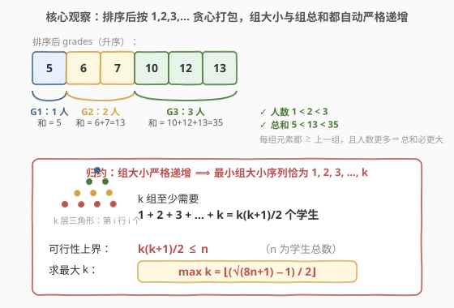
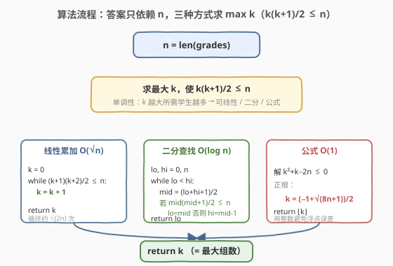
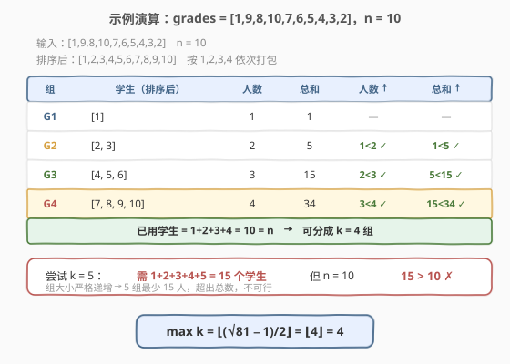

# LeetCode 参加比赛的最大组数 题解

## 1. 题目概述

- **标题 / 题号**：参加比赛的最大组数（#2358，medium）
- **链接**：https://leetcode.cn/problems/maximum-number-of-groups-entering-a-competition/
- **难度**：中等
- **标签**：贪心、数学、二分查找、排序

**题意**：给你一个正整数数组 `grades`，表示一个班级中学生的成绩。你需要把这些学生**分成若干组**，分组的规则是：

- 第 $i$ 组（从 $1$ 开始编号）的**学生人数**严格大于第 $i-1$ 组的学生人数；
- 第 $i$ 组的**成绩总和**严格大于第 $i-1$ 组的成绩总和。

允许有些学生不被分到任何一组。返回**最多**能分成多少组。

**示例 1**：

```text
输入：grades = [10,6,12,7,5,13]
输出：3
解释：可分成 3 组，例如（按升序贪心打包）：
  - 第 1 组：[5]      人数 1，总和 5
  - 第 2 组：[6,7]     人数 2，总和 13
  - 第 3 组：[10,12,13] 人数 3，总和 35
  人数 1<2<3，总和 5<13<35，均严格递增。
```

**示例 2**：

```text
输入：grades = [1,9,8,10,7,6,5,4,3,2]
输出：4
```

**约束**：

- $1 \le \text{grades.length} \le 10^5$
- $1 \le \text{grades}[i] \le 10^5$

> 💡 **关键观察**：组大小「严格递增」意味着 $k$ 个组的大小至少是 $1,2,3,\dots,k$，总和恰为**三角数** $\frac{k(k+1)}{2}$。这把「最多几组」直接绑定到一个关于人数 $n$ 的上界 $k(k+1)/2 \le n$；而把成绩**升序排序后顺序打包**，又能让「总和严格递增」自动成立，恰好达到这个上界。

## 2. 解题思路

### 2.1 暴力思路：回溯枚举所有分组

最直白的做法是把 $n$ 个学生划分进若干组、组大小严格递增、总和严格递增，枚举所有划分方式取最大组数。但「划分」的组合数是指数级的，$n=10^5$ 时完全不可行——既没有利用「组大小递增」给出的强结构，也没有利用成绩可排序这一性质。

> ⚠️ 暴力的浪费在于：它在「总和也要递增」这一约束上盲目搜索，而实际上只要**先排序、再按组大小 $1,2,3,\dots$ 顺序打包**，「总和递增」就被免费满足，根本不需要搜索。

### 2.2 核心观察：排序贪心打包，两条件自动满足 + 归约为三角数



把 `grades` **升序排序**后，按组大小 $1,2,3,\dots,k$ 依次取连续的一段作为一组：

- **人数严格递增**：第 $i$ 组 $i$ 人，$i$ 本身严格递增，显然成立。
- **总和严格递增**：升序保证第 $i$ 组的**每个**元素 $\ge$ 第 $i-1$ 组的每个元素，且第 $i$ 组人数更多，故第 $i$ 组总和 $> $ 第 $i-1$ 组总和。无需任何额外挑选。

于是「能不能分成 $k$ 组」**只取决于有没有足够的人**：$k$ 个组至少需要 $1+2+\dots+k=\frac{k(k+1)}{2}$ 个学生，于是可行性上界为

$$
\frac{k(k+1)}{2} \le n \quad (n=\text{grades.length}).
$$

> 💡 **答案只依赖 $n$，与具体成绩值无关**：因为升序贪心构造对**任意正数成绩**都成立——元素不小于上一组且人数更多，总和必更大。可行性只受人数约束。所以代码里甚至不必真去排序、不必看 `grades[i]` 的值，只需 $n=\text{len(grades)}$。

> ⚠️ 注意「至少需要 $k(k+1)/2$ 人」是**上界论证**（组大小严格递增的最短序列就是 $1,2,\dots,k$），而排序贪心构造恰用 $\frac{k(k+1)}{2}\le n$ 个人达到这个上界——上界与构造吻合，故贪心最优（见第 5 节）。

### 2.3 算法流程图



答案只依赖 $n$，问题归约为「求最大 $k$ 满足 $k(k+1)/2 \le n$」。该条件关于 $k$ **单调**（$k$ 越大所需人数越多），因此有三种解法：

1. **线性累加** $O(\sqrt n)$：$k\gets 0$，只要 $(k+1)(k+2)/2 \le n$ 就 $k\gets k+1$，循环约 $\sqrt{2n}$ 次；
2. **二分查找** $O(\log n)$：在 $[0,n]$ 上二分最大的满足 $k(k+1)/2\le n$ 的 $k$；
3. **公式** $O(1)$：解 $k^2+k-2n\le 0$，正根 $k=\frac{\sqrt{8n+1}-1}{2}$，取下整。

### 2.4 示例演算

以示例 2 `grades = [1,9,8,10,7,6,5,4,3,2]`，$n=10$ 为例：



排序后为 $[1,2,3,4,5,6,7,8,9,10]$，按 $1,2,3,4$ 顺序打包：

| 组 | 学生（排序后） | 人数 | 总和 | 人数 ↑ | 总和 ↑ |
|----|----------------|------|------|--------|--------|
| $G_1$ | [1] | 1 | 1 | — | — |
| $G_2$ | [2,3] | 2 | 5 | $1<2$ ✓ | $1<5$ ✓ |
| $G_3$ | [4,5,6] | 3 | 15 | $2<3$ ✓ | $5<15$ ✓ |
| $G_4$ | [7,8,9,10] | 4 | 34 | $3<4$ ✓ | $15<34$ ✓ |

已用学生 $1+2+3+4=10=n$，可分成 $k=4$ 组。尝试 $k=5$：至少需 $1+2+3+4+5=15$ 人 $>10$，不可行。故最大组数 $k=4$，与公式 $\lfloor(\sqrt{81}-1)/2\rfloor=\lfloor 4\rfloor=4$ 一致。

## 3. 参考代码

### C++：线性累加 $O(\sqrt n)$ / $O(1)$

```cpp
class Solution {
public:
    int maximumGroups(vector<int>& grades) {
        int n = grades.size();
        int k = 0;
        // (k+1)*(k+2)/2 是凑 k+1 组所需最少人数；用 long long 防溢出
        while ((long long)(k + 1) * (k + 2) / 2 <= n) ++k;
        return k;
    }
};
```

> 💡 判据写成「$k+1$ 组是否可行」即 $(k+1)(k+2)/2 \le n$：可行就把 $k$ 自增到 $k+1$。循环结束时 $k$ 即最大可行组数。$n\le10^5$ 时约 $\sqrt{2n}\approx447$ 次循环，毫秒级 AC。

**二分查找变体**（$O(\log n)$，通用，适合 $n$ 极大）：

```cpp
class Solution {
public:
    int maximumGroups(vector<int>& grades) {
        int n = grades.size();
        int lo = 0, hi = n;            // k 的上界：k(k+1)/2 ≤ n ⇒ k < sqrt(2n) < n
        while (lo < hi) {
            int mid = (lo + hi + 1) / 2; // 上 mid，避免死循环
            if ((long long)mid * (mid + 1) / 2 <= n) lo = mid;
            else hi = mid - 1;
        }
        return lo;
    }
};
```

**公式变体**（$O(1)$）：

```cpp
class Solution {
public:
    int maximumGroups(vector<int>& grades) {
        int n = grades.size();
        return (sqrt(8.0 * n + 1) - 1) / 2;  // n≤1e5 时 double 精确整数范围内，安全
    }
};
```

### Python：公式 `math.isqrt` $O(1)$ / $O(1)$

```python
class Solution:
    def maximumGroups(self, grades: List[int]) -> int:
        n = len(grades)
        return (math.isqrt(8 * n + 1) - 1) // 2
```

> 💡 Python 的 `math.isqrt` 返回**整数平方根**（下取整），全程无浮点、无误差，是公式解法的最优实现：`isqrt(8n+1)` 得 $\lfloor\sqrt{8n+1}\rfloor$，减 1 整除 2 即 $\lfloor(\sqrt{8n+1}-1)/2\rfloor$。

**线性累加变体**（$O(\sqrt n)$，最直观）：

```python
class Solution:
    def maximumGroups(self, grades: List[int]) -> int:
        n = len(grades)
        k = 0
        while (k + 1) * (k + 2) // 2 <= n:
            k += 1
        return k
```

## 4. 复杂度分析

| 维度 | 复杂度 | 说明 |
|------|--------|------|
| **时间复杂度** | $O(1)$（公式）/ $O(\sqrt n)$（线性）/ $O(\log n)$（二分） | 答案只依赖 $n$，无需遍历成绩；线性法循环 $\approx\sqrt{2n}$ 次，$n=10^5$ 时约 $447$ 次 |
| **空间复杂度** | $O(1)$ | 只用常数个变量，原地计算 |

> 💡 三种解法对本题规模都远超时限要求（$n\le10^5$）。考点不在性能上限，而在「排序让两约束自动满足 → 归约为三角数可行性上界」这一**把组合优化问题降维成数列不等式**的转化。工程上首推 `isqrt` 公式版：一行、精确、$O(1)$。

## 5. 扩展：贪心最优性证明与公式推导

### 5.1 为什么贪心构造达到最优

记 $n=\text{len(grades)}$，最大组数为 $k^*$。

1. **上界**：$k$ 个组的组大小是严格递增的正整数，最短序列为 $1,2,\dots,k$，总人数 $\ge 1+2+\dots+k=\frac{k(k+1)}{2}$。而总人数 $\le n$，故
   $$
   \frac{k(k+1)}{2} \le n \quad\Longrightarrow\quad k \le \left\lfloor\frac{\sqrt{8n+1}-1}{2}\right\rfloor =: U.
   $$
2. **构造达到上界**：将 `grades` 升序排序，第 $i$ 组取接下来的 $i$ 个（$i=1,\dots,U$），共用 $\frac{U(U+1)}{2}\le n$ 人。人数严格递增显然；总和严格递增因「每元素 $\ge$ 上一组、且人数更多」。故 $U$ 组可行，$k^*\ge U$。

上界 $k^*\le U$ 与构造 $k^*\ge U$ 合于 $k^*=U$，故贪心最优。

### 5.2 闭式公式推导

由 $\frac{k(k+1)}{2}\le n$ 得 $k^2+k-2n\le 0$。二次方程 $k^2+k-2n=0$ 的根为

$$
k=\frac{-1\pm\sqrt{1+8n}}{2},
$$

取正根 $k_0=\frac{\sqrt{8n+1}-1}{2}$。因抛物线开口向上、在两根之间取非正值，故满足不等式的整数 $k$ 即 $\{0,1,\dots,\lfloor k_0\rfloor\}$，最大值为

$$
k^*=\left\lfloor\frac{\sqrt{8n+1}-1}{2}\right\rfloor.
$$

### 5.3 三种解法对比

| 解法 | 时间 | 空间 | 适用与注意 |
|------|------|------|------------|
| 线性累加 | $O(\sqrt n)$ | $O(1)$ | 最直观；$n\le10^5$ 足够，约 447 次循环 |
| 二分查找 | $O(\log n)$ | $O(1)$ | 通用、稳健；$n$ 极大时首选，需 `long long` 防溢出 |
| 公式 | $O(1)$ | $O(1)$ | 最快；Python 用 `math.isqrt` 精确，C++ 用 `sqrt` 对 $n\le10^5$ 安全，更大 $n$ 宜整数平方根 |

> ⚠️ **浮点安全**：$n\le10^5\Rightarrow 8n+1\le800001$，远在 `double` 的精确整数范围（$2^{53}$）内，且 $\sqrt{}$ 对完全平方数（如 $81\to9$）精确返回，故 C++ 公式版安全。若 $n$ 可达 $10^{18}$，应改用整数平方根（手写牛顿迭代或 Python `isqrt`），避免浮点误差把临界值算偏。

## 6. 面试要点

1. **为什么答案只依赖学生总数 $n$，与具体成绩值无关？**

   > 升序贪心构造对任意正数成绩都成立：每组元素不小于上一组、人数更多，总和必更大。「能不能分 $k$ 组」的可行性只受人数约束 $\frac{k(k+1)}{2}\le n$，成绩值不进入判据。所以代码只需 $n=\text{len(grades)}$，连排序都不必真正执行（排序只是**构造可行性**的证明手段）。

2. **排序为什么能让「人数」与「总和」两个递增条件同时自动满足？**

   > 人数递增是组大小 $1,2,3,\dots$ 的直接结果。总和递增：升序保证后一组每个元素 $\ge$ 前一组每个元素，且后组人数更多，故后组总和 $>$ 前组。两个条件用「顺序打包」一次解决，无需搜索。

3. **上界 $\frac{k(k+1)}{2}\le n$ 怎么来的？为什么贪心构造一定达到这个上界？**

   > 上界：组大小严格递增的正整数最短序列是 $1,2,\dots,k$，总人数 $\ge\frac{k(k+1)}{2}$，又 $\le n$，故 $k$ 不超过 $U=\lfloor(\sqrt{8n+1}-1)/2\rfloor$。构造：升序取 $1,2,\dots,U$ 个，恰用 $\frac{U(U+1)}{2}\le n$ 人且满足两条件，故 $U$ 组可行。上界与构造吻合 $\Rightarrow$ 贪心最优。

4. **三种解法如何选？复杂度各是多少？**

   > 线性 $O(\sqrt n)$：最直观，$n\le10^5$ 约 447 次循环；二分 $O(\log n)$：通用、适合 $n$ 极大；公式 $O(1)$：最快，Python 用 `math.isqrt` 精确无浮点误差，C++ 用 `sqrt` 对 $n\le10^5$ 安全。工程首选 `isqrt` 公式版。

5. **用公式时如何避免浮点误差？**

   > $n\le10^5$ 时 $8n+1\le8\times10^5$，远在 `double` 精确整数范围内，$\sqrt{}$ 对完全平方数精确返回，安全。若 $n$ 极大（如 $10^{18}$），改用整数平方根：Python `math.isqrt`；C++ 手写牛顿迭代或对结果 $\pm1$ 回代验证 $\frac{k(k+1)}2\le n$。

> 💡 **一句话总结**：2358 =「排序贪心让组大小与组总和都自动严格递增，问题归约为求 $\max\,k$ 使 $\frac{k(k+1)}2\le n$」。答案只依赖 $n$，线性 / 二分 / 公式皆可，最优 $k=\big\lfloor\frac{\sqrt{8n+1}-1}{2}\big\rfloor$。

## 同类练习题

| # | 题目 | 与本题的关联 |
|---|------|-------------|
| 441 | [排列硬币](https://leetcode.cn/problems/arranging-coins/)（[题解](../0401-0500/441_排列硬币.md)） | 「求 $\max\,k$ 使 $k(k+1)/2\le n$」的**母题**——硬币阶梯第 $i$ 行 $i$ 枚、求完整行数，与本题主约束完全同构，连公式都一样 |
| 875 | [爱吃香蕉的珂珂](https://leetcode.cn/problems/koko-eating-bananas/)（[题解](../0801-0900/875_爱吃香蕉的珂珂.md)） | 二分答案 + $O(n)$ 验证可行性，本题的 $k$ 同样可二分（单调性相同），同属「猜答案 + 单调验证」家族 |
| 1011 | [在 D 天内送达包裹的能力](https://leetcode.cn/problems/capacity-to-ship-packages-within-d-days/)（[题解](../1001-1100/1011_在D天内送达包裹的能力.md)） | 二分答案 + 贪心划分把数组分成若干组求最值，与本题「分组」主题同源，只是组约束换为「容量上界」 |
| 410 | [分割数组的最大值](https://leetcode.cn/problems/split-array-largest-sum/)（[题解](../0401-0500/410_分割数组的最大值.md)） | 二分答案 + 贪心划分连续子数组，对照本题「组大小严格递增」的不同分组约束，体会「分组 + 二分答案」的通用套路 |
| 719 | [找出第 K 小的数对距离](https://leetcode.cn/problems/find-k-th-smallest-pair-distance/)（[题解](../0701-0800/719_找出第K小的数对距离.md)） | 二分答案 + 计数验证，同属「二分答案 + $O(n)$ 验证」范式，可与本题二分解法对照阅读 |
