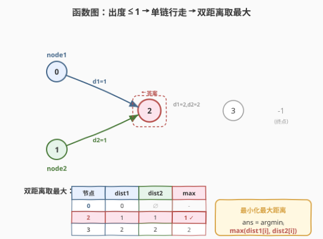
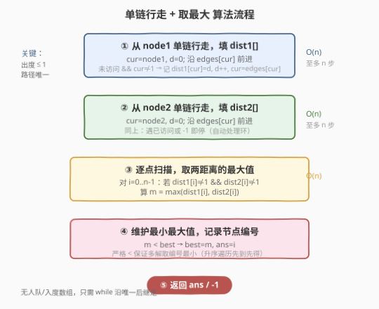
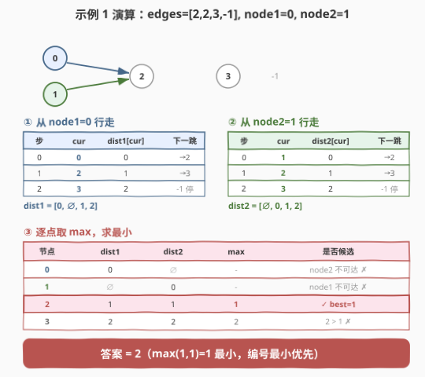

# 找到离给定两个节点最近的节点

- **题目名称**：找到离给定两个节点最近的节点
- **链接**：[2359. 找到离给定两个节点最近的节点](https://leetcode.cn/problems/find-closest-node-to-given-two-nodes/)
- **难度**：中等
- **标签**：图、深度优先搜索、广度优先搜索

## 1. 题目概述

给你一个 $n$ 个节点的**有向图**，节点编号为 $0$ 到 $n-1$，每个节点**至多**有一条出边。图用大小为 $n$、下标从 $0$ 开始的数组 `edges` 表示：节点 $i$ 有一条有向边指向 `edges[i]`；若节点 $i$ 没有出边，则 `edges[i] == -1`。

同时给你两个节点 `node1` 和 `node2`。请返回一个**从 `node1` 和 `node2` 都能到达**的节点编号，使得 `node1` 到该节点、`node2` 到该节点的距离**较大值最小化**。若存在多个答案，返回**最小**的节点编号；若答案不存在，返回 `-1`。注意 `edges` 可能包含环。

**示例 1**：

```text
输入：edges = [2,2,3,-1], node1 = 0, node2 = 1
输出：2
解释：从节点 0 到节点 2 的距离为 1，从节点 1 到节点 2 的距离为 1。
     两个距离的较大值为 1。无法得到比 1 更小的较大值，故返回节点 2。
```

**示例 2**：

```text
输入：edges = [1,2,-1], node1 = 0, node2 = 2
输出：2
解释：节点 0 到节点 2 的距离为 2，节点 2 到自身的距离为 0。
     两个距离的较大值为 2。无法得到比 2 更小的较大值，故返回节点 2。
```

**约束条件**：

- $n = \text{edges.length}$
- $2 \le n \le 10^5$
- $-1 \le \text{edges}[i] < n$
- $\text{edges}[i] \ne i$
- $0 \le \text{node1}, \text{node2} < n$

> 💡 **关键约束**：「每个节点至多一条出边」意味着这是**函数图**（functional graph）：从任一节点出发只有**唯一一条确定性路径**（尾段 + 环，呈 $\rho$ 形）。于是从 `node1` 出发的所有可达点及其距离，**一次 `while` 顺链行走**即可全部记录——无需队列、无需邻接表、无需入度数组。

---

## 2. 解题思路

### 2.1 暴力思路：逐候选点判可达

最直白的做法：对每个候选节点 $i\in[0,n)$，分别从 `node1`、`node2` 出发沿 `edges` 行走，判定能否到达 $i$ 并记录距离，再算 $\max$ 取最小。每个候选点的单次行走最坏 $O(n)$，共 $n$ 个候选点：

$$T = O(n^2)$$

$n\le10^5$ 时约 $10^{10}$ 次操作，**超时**。问题在于**重复行走**——从 `node1` 出发的路径是固定的，却为每个候选点重走了一遍。

> 💡 **从逐点判达到一次填表**：函数图的路径唯一性意味着，从 `node1` 出发走一趟就能得到**所有可达点**的距离。把这趟结果存进 `dist1[]`，后续任意候选点的距离直接查表 $O(1)$，无需重走。

### 2.2 核心观察：函数图单链行走 + 双距离取最大



**第 1 步：从 `node1` 单链行走，填 `dist1[]`。** 设 `cur = node1`、`d = 0`，沿 `edges[cur]` 前进：未访问则记 `dist1[cur] = d`、`d++`、`cur = edges[cur]`；遇 `-1`（无出边）或已访问节点（撞环）即停。一次行走把从 `node1` 出发到所有可达点的距离全部记录。

**第 2 步：从 `node2` 同法填 `dist2[]`。**

**第 3 步：逐点取最大、求最小。** 对每个 $i$，若 `dist1[i]` 与 `dist2[i]` 均非空（即从两边都可达），算 $m_i = \max(\text{dist1}[i], \text{dist2}[i])$，在所有 $m_i$ 中取最小，其对应的 $i$ 即答案。

> 💡 **为什么"遇已访问即停"能正确处理环？** 函数图中从某点出发的路径最终要么终止于 `-1`，要么进入一个环。一旦走到一个已记录距离的节点，后续节点必然已在之前被访问过（路径唯一、确定性），再走只是绕环重复，距离不会再变优，故直接停止即可。一个 `-1` 数组充当"未访问"哨兵，天然区分空与零距离。

### 2.3 算法流程图



1. **行走 1**：`cur=node1, d=0`；循环：`dist1[cur]=d` → `d++` → `cur=edges[cur]`；终止条件 `cur==-1` 或 `dist1[cur]!=-1`。
2. **行走 2**：`cur=node2, d=0`；同法填 `dist2[]`。
3. **扫描取最大**：`i` 从 $0$ 升序到 $n-1$，若两距离都非 $-1$，算 $m=\max(\text{dist1}[i],\text{dist2}[i])$。
4. **维护最小**：`m < best` 则 `best=m, ans=i`。**严格小于**保证多解时取编号最小（升序遍历先到先得）。
5. **返回** `ans`（初值 $-1$，无候选则保持 $-1$）。

### 2.4 示例演算



以示例 1 `edges=[2,2,3,-1], node1=0, node2=1` 为例。

**行走 1（从 `node1=0`）**：

| 步 | cur | dist1[cur] | 下一跳 |
|----|-----|------------|--------|
| 0 | 0 | 0 | →2 |
| 1 | 2 | 1 | →3 |
| 2 | 3 | 2 | -1 停 |

`dist1 = [0, ∅, 1, 2]`。

**行走 2（从 `node2=1`）**：

| 步 | cur | dist2[cur] | 下一跳 |
|----|-----|------------|--------|
| 0 | 1 | 0 | →2 |
| 1 | 2 | 1 | →3 |
| 2 | 3 | 2 | -1 停 |

`dist2 = [∅, 0, 1, 2]`。

**逐点取最大**：

| 节点 | dist1 | dist2 | max | 候选？ |
|------|-------|-------|-----|--------|
| 0 | 0 | ∅ | — | node2 不可达 ✗ |
| 1 | ∅ | 0 | — | node1 不可达 ✗ |
| 2 | 1 | 1 | **1** | ✓ best=1 |
| 3 | 2 | 2 | 2 | 2 > 1 ✗ |

答案 $= 2$（$\max(1,1)=1$ 最小，编号最小优先）。

> 💡 **示例 2 为何返回 2**：`edges=[1,2,-1]`，从 `node1=0` 行走得 `dist1=[0,1,2]`，从 `node2=2` 行走得 `dist2=[∅,∅,0]`，唯一公共可达点只有节点 2，$\max(2,0)=2$，故返回 2。

---

## 3. 参考代码

### C++

```cpp
class Solution {
public:
    int closestMeetingNode(vector<int>& edges, int node1, int node2) {
        int n = edges.size();
        vector<int> dist1(n, -1), dist2(n, -1);

        // 从 node1 单链行走
        for (int cur = node1, d = 0; cur != -1 && dist1[cur] == -1; cur = edges[cur])
            dist1[cur] = d++;

        // 从 node2 单链行走
        for (int cur = node2, d = 0; cur != -1 && dist2[cur] == -1; cur = edges[cur])
            dist2[cur] = d++;

        int ans = -1, best = INT_MAX;
        for (int i = 0; i < n; i++) {
            if (dist1[i] != -1 && dist2[i] != -1) {            // 两边都可达
                int m = max(dist1[i], dist2[i]);
                if (m < best) {                                // 严格 <：多解取编号最小
                    best = m;
                    ans = i;
                }
            }
        }
        return ans;
    }
};
```

> 💡 循环条件 `cur != -1 && dist1[cur] == -1` 同时处理两种终止：走到 `-1`（无出边）或撞到已访问节点（入环，路径唯一故后续皆重复）。`dist` 用 $-1$ 作"未访问"哨兵，无需额外 `visited` 数组。`best` 初始 `INT_MAX` 保证首个候选必被选中；升序遍历 + 严格 `<` 保证同 `best` 时保留更小编号。

### Python

```python
class Solution:
    def closestMeetingNode(self, edges: List[int], node1: int, node2: int) -> int:
        n = len(edges)
        dist1 = [-1] * n
        dist2 = [-1] * n

        cur, d = node1, 0
        while cur != -1 and dist1[cur] == -1:        # 从 node1 单链行走
            dist1[cur] = d
            d += 1
            cur = edges[cur]

        cur, d = node2, 0
        while cur != -1 and dist2[cur] == -1:        # 从 node2 单链行走
            dist2[cur] = d
            d += 1
            cur = edges[cur]

        ans, best = -1, float('inf')
        for i in range(n):
            if dist1[i] != -1 and dist2[i] != -1:    # 两边都可达
                m = max(dist1[i], dist2[i])
                if m < best:                         # 严格 <：多解取编号最小
                    best = m
                    ans = i
        return ans
```

> ⚠️ **勿用 BFS/队列**：本题每点出度 $\le1$，从起点出发路径唯一，`while` 顺链走即可；套通用 BFS 反而多一个队列与邻接表，徒增常数与代码量。BFS 是"出度无限制"时的退化兜底，这里大材小用。

---

## 4. 复杂度分析

| 维度 | 复杂度 | 说明 |
|------|--------|------|
| **时间复杂度** | $O(n)$ | 两趟行走各至多访问 $n$ 个节点（遇环/终点即停）；一次扫描 $n$ 个点取最大。合计线性 |
| **空间复杂度** | $O(n)$ | `dist1`、`dist2` 两个 $O(n)$ 距离数组，无邻接表、无队列 |

> 💡 暴力 $O(n^2)$ 与本解 $O(n)$ 差一个 $n$ 因子，关键在于**把"逐候选重走"重构为"一次填表全员查"**——函数图的路径唯一性让一趟行走即覆盖所有可达距离，后续查询退化为 $O(1)$ 查表。

---

## 5. 扩展：通用 BFS 版（出度无限制时）

若题目放宽为"每个节点出度无限制"（一般有向图），单链行走不再适用（一个节点可通往多个后继）。此时退化为**双源 BFS**：分别从 `node1`、`node2` 做一次 BFS 填全源距离，再同样逐点取最大求最小。

```cpp
class Solution {
public:
    int closestMeetingNode(vector<int>& edges, int node1, int node2) {
        int n = edges.size();
        auto bfs = [&](int src, vector<int>& dist) {
            dist.assign(n, -1);
            queue<int> q; q.push(src); dist[src] = 0;
            while (!q.empty()) {
                int u = q.front(); q.pop();
                int v = edges[u];
                if (v != -1 && dist[v] == -1) { dist[v] = dist[u] + 1; q.push(v); }
            }
        };
        vector<int> d1, d2;
        bfs(node1, d1);
        bfs(node2, d2);
        int ans = -1, best = INT_MAX;
        for (int i = 0; i < n; i++)
            if (d1[i] != -1 && d2[i] != -1) {
                int m = max(d1[i], d2[i]);
                if (m < best) { best = m; ans = i; }
            }
        return ans;
    }
};
```

| 解法 | 适用 | 时间 | 空间 | 备注 |
|------|------|------|------|------|
| 单链行走 | 出度 $\le1$（函数图） | $O(n)$ | $O(n)$ | 无队列，常数最小，本题最优 |
| 双源 BFS | 出度无限制（一般图） | $O(n)$ | $O(n)$ | 通用兜底，本题退化但等价 |

> 💡 **抽象经验**：看到"每个节点至多一条出边"要立刻反应到**函数图**——路径唯一、确定性，图遍历可从 BFS/DFS 退化为单链 `while`，省去队列与邻接表。识别这一结构能把常数与代码量同时压到最低。

---

## 6. 面试要点

1. **"每个节点至多一条出边"如何利用？**

    - 这意味着**函数图**：从任一节点出发只有唯一一条确定性路径（尾段 + 环，$\rho$ 形）。因此从 `node1` 出发走一趟 `while` 就能记录到所有可达点的距离，无需 BFS 队列或邻接表。这是把 $O(n^2)$ 暴力降到 $O(n)$ 的关键。

2. **环如何处理？行走何时停止？**

    - 循环条件 `cur != -1 && dist[cur] == -1`：走到 `-1`（无出边，自然终止）或撞到已记录距离的节点（入环）。因为路径唯一且确定，一旦重访某点，其后续节点必然已被访问过，再走只是绕环重复，距离不会更优，故停止安全。用 $-1$ 兼作"未访问"哨兵，无需额外 `visited` 数组。

3. **为什么对两距离取 $\max$ 再求 $\min$？**

    - 题目要"使两距离的较大值最小化"——即最小化 $\max(\text{dist1}[i],\text{dist2}[i])$。对每个候选点 $i$ 取两端距离的较大值 $m_i$（瓶颈端），再在所有候选中选最小的 $m_i$。这是经典的 **minimax** 取法：先内部取大（定瓶颈），再外部取小（选最优瓶颈）。

4. **多解时如何保证返回编号最小？**

    - 遍历 `i` 从 $0$ 升序到 $n-1`，更新条件用**严格小于** `m < best`：同 `best` 值的后续候选不会覆盖先到的更小编号。故首个达到最小 `best` 的（即编号最小的）被保留。

5. **BFS 版和单链行走版有何区别？何时用哪个？**

    - 单链行走依赖"出度 $\le1$"，只走唯一后继，无队列、无邻接表，常数最小；BFS 版处理每点出度无限制的一般图，用队列展开多后继。本题出度 $\le1$，单链行走最优；一旦约束放宽为一般图，须改 BFS（此时单链行走会漏掉分支后继）。

> 💡 **一句话总结**：2359 是「函数图单链行走 + 双距离取最大求最小」——出度 $\le1$ 让从两源各走一趟 `while` 即填满 `dist1/dist2`，再逐点取 $\max$ 求 $\min$，$O(n)$ 一遍过；遇环靠"已访问即停"自动处理，多解靠升序 + 严格小于取编号最小。

---

## 7. 同类练习题

- [994. 腐烂的橘子](../0901-1000/994_腐烂的橘子.md)：多源 BFS 计算距离场，与本题"从多个源点求距离"同源，体会"出度无限制→队列 BFS"与"出度≤1→单链行走"的取舍
- [743. 网络延迟时间](../0701-0800/743_网络延迟时间.md)：单源最短路（堆优化 Dijkstra），对照本题"单源距离填表"在带权图上的推广
- [410. 分割数组的最大值](../0401-0500/410_分割数组的最大值.md)：经典 minimax——"最小化各段的最大值"，与本题"最小化两端距离的较大值"共享先取大再取小的优化哲学
- [2316. 统计无向图中无法互相到达点对数](../2301-2400/2316_统计无向图中无法互相到达点对数.md)：图遍历 + 计数，对照体会"路径唯一/连通分量"等图结构如何决定遍历方式
- [787. K 站中转内最便宜的航班](https://leetcode.cn/problems/cheapest-flights-within-k-stops/)：限制松弛 Bellman-Ford，在"图上求距离"主题下对照带权/分层距离的处理手法
