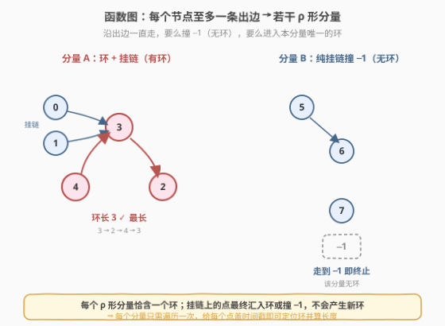
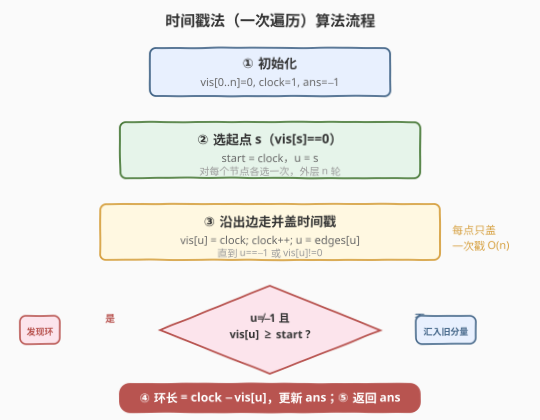
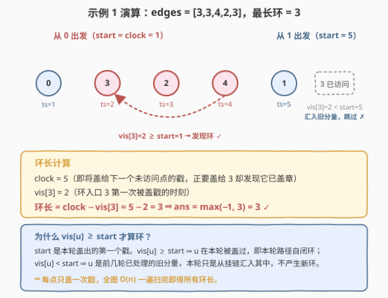

# LeetCode 图中的最长环 题解

## 1. 题目概述

- **标题 / 题号**：图中的最长环（#2360，hard）
- **链接**：https://leetcode.cn/problems/longest-cycle-in-a-graph/
- **难度**：困难
- **标签**：图、深度优先搜索、拓扑排序、时间戳

**题意**：给你一个 $n$ 个节点的**有向图**，节点编号为 $0$ 到 $n-1$，其中每个节点**至多有一条出边**。

图用一个大小为 $n$、下标从 $0$ 开始的数组 `edges` 表示：节点 $i$ 到节点 `edges[i]` 之间有一条有向边；若节点 $i$ 没有出边，则 `edges[i] == -1`。

请你返回图中的**最长环**的长度；如果没有任何环，返回 $-1$。一个环指的是起点和终点是**同一个**节点的路径。

**示例 1**：

```text
输入：edges = [3,3,4,2,3]
输出：3
解释：图中的最长环是：2 -> 4 -> 3 -> 2。
这个环的长度为 3，所以返回 3。
```

**示例 2**：

```text
输入：edges = [2,-1,3,1]
输出：-1
解释：图中没有任何环。
```

**约束**：

- $n = \text{edges.length}$
- $2 \le n \le 10^5$
- $-1 \le \text{edges[i]} < n$
- $\text{edges[i]} \ne i$（无自环）

> 💡 **关键观察**：每个节点出度 $\le 1$ ⇒ 这是一张**函数图（functional graph）**。沿任一节点的出边一直走，要么撞上 $-1$ 终止（无环），要么必然进入一个**环**。整张图由若干「挂链 + 环」的 $\rho$ 形分量组成，**每个分量至多一个环**。于是问题归约为：高效定位每个环并取最大长度，且每个节点只访问一次。

## 2. 解题思路

### 2.1 暴力思路：对每个起点沿出边走到底

最直白的做法：以每个节点为起点，沿 `edges` 一直走，记录走过的节点集合，一旦回到本轮已走过的某个节点 $u$，则 $u$ 到当前点构成环，统计长度；走到 $-1$ 或走出本轮集合则换下一个起点。

$$T = O(n^2)$$

问题在于**重复走**：同一条链、同一个环会被不同起点反复遍历。$n\le10^5$ 时 $10^{10}$ 量级，不可行。根源是「没有把已经处理过的节点永久标记掉」——每个节点其实只需要在全局被盖一次戳。

> 💡 **从「逐点重走」到「全局一次遍历」**：函数图的每个节点出度 $\le 1$，决定了它只有一条确定的命运（撞 $-1$ 或入环）。所以每个节点只需访问一次；只要能用一次访问区分「本轮新发现的环」和「汇入旧分量」，就能把 $O(n^2)$ 压成 $O(n)$。

### 2.2 核心观察：时间戳法（一次遍历定位所有环）



**核心思路**：用一个全局递增的 `clock` 当「时间戳」，给每个首次访问的节点盖一个唯一戳 `vis[u] = clock`，`clock` 自增。于是：

1. **每点只盖一次戳** ⇒ 总访问 $O(n)$。
2. **本轮 vs 旧分量可区分**：记录本轮第一个戳 `start`，若走到已盖章节点 $u$ 且 `vis[u] >= start`，说明 $u$ 是**本轮**盖的，本轮路径自闭环；若 `vis[u] < start`，说明 $u$ 是**前几轮**已处理的旧分量，本轮只是从挂链汇入其中，不产生新环。

**环长如何算**？设走到 $u$ 时发现它已在本轮盖章，此时 `clock` 正要给「下一个未访问点」盖戳（即本轮已盖出的最大戳 $+1$），而 `vis[u]` 是 $u$ 第一次被盖戳的时刻。本轮从 $u$ 出发走了一圈又回到 $u$，环上节点正是时间戳从 `vis[u]` 到 `clock-1` 的那些点，个数：

$$\text{环长} = \text{clock} - \text{vis}[u]$$

> 💡 **为什么不需要先找到环入口？** 在纯前向行走里，第一次撞到的「已盖章点」$u$ 必是环入口——因为函数图每点出度恰一条，本轮从 $u$ 走出后必沿环回到 $u$，挂链上的点不可能在本轮被两次经过。所以「重逢点 = 环入口」，其时间戳之差即环长，一步到位。

### 2.3 算法流程图



1. **初始化**：`vis[0..n-1]=0`（$0$ 表示未访问），`clock=1`，`ans=-1`。
2. **选起点**：遍历 $s\in[0,n)$，若 `vis[s]!=0` 跳过；否则记 `start=clock`、`u=s`，开始本轮。
3. **沿出边走并盖戳**：循环 `while u != -1 and vis[u] == 0`：`vis[u]=clock`，`clock++`，`u=edges[u]`。
4. **判环**：循环退出后，若 `u != -1` 且 `vis[u] >= start`，发现环，`ans = max(ans, clock - vis[u])`；否则（撞 $-1$ 或汇入旧分量）本轮无新环。
5. **返回** `ans`。

### 2.4 示例演算



以示例 1 `edges=[3,3,4,2,3]` 为例（$0\to3,\ 1\to3,\ 2\to4,\ 3\to2,\ 4\to3$）。

**本轮 A：从 $s=0$ 出发**（`clock=1`，`start=1`）

| 步 | 当前 $u$ | 动作 | vis 变化 | clock | 下一个 $u$ |
|----|----------|------|----------|-------|------------|
| 1 | 0 | 盖戳 | vis[0]=1 | 2 | edges[0]=3 |
| 2 | 3 | 盖戳 | vis[3]=2 | 3 | edges[3]=2 |
| 3 | 2 | 盖戳 | vis[2]=3 | 4 | edges[2]=4 |
| 4 | 4 | 盖戳 | vis[4]=4 | 5 | edges[4]=3 |
| 5 | 3 | vis[3]=2≠0，退出 | — | 5 | — |

退出时 $u=3$，`vis[3]=2 >= start=1` ⇒ 发现环。环入口 $3$，时间戳 `vis[3]=2`，`clock=5`：

$$\text{环长} = 5 - 2 = 3,\qquad \text{ans} = \max(-1, 3) = 3$$

环为 $3\to2\to4\to3$（时间戳 $2,3,4$），$0$ 是挂在 $3$ 上的链。

**本轮 B：从 $s=1$ 出发**（`clock=5`，`start=5`）

| 步 | 当前 $u$ | 动作 | vis 变化 | clock | 下一个 $u$ |
|----|----------|------|----------|-------|------------|
| 1 | 1 | 盖戳 | vis[1]=5 | 6 | edges[1]=3 |
| 2 | 3 | vis[3]=2≠0，退出 | — | 6 | — |

退出时 $u=3$，但 `vis[3]=2 < start=5` ⇒ $3$ 属于**旧分量 A**，本轮从挂链 $1$ 汇入而已，无新环。$s=2,3,4$ 均已盖章，跳过。

**返回** `ans=3` ✓。

> 💡 **示例 2 为何返回 $-1$**：`edges=[2,-1,3,1]`，从 $0$ 出发走 $0\to2\to3\to1\to-1$，撞 $-1$ 终止，无重逢点；全图无环。

## 3. 参考代码

### C++

```cpp
class Solution {
public:
    int longestCycle(vector<int>& edges) {
        int n = edges.size();
        vector<int> vis(n, 0);     // 0 = 未访问；否则存该点被盖戳的时刻
        int clock = 1, ans = -1;
        for (int s = 0; s < n; s++) {
            if (vis[s] != 0) continue;          // 已被某轮处理过
            int start = clock, u = s;
            while (u != -1 && vis[u] == 0) {
                vis[u] = clock++;
                u = edges[u];
            }
            if (u != -1 && vis[u] >= start) {  // 本轮重逢 ⇒ 发现环
                ans = max(ans, clock - vis[u]);
            }
        }
        return ans;
    }
};
```

> 💡 `clock` 从 $1$ 起而非 $0$，是为了让 $0$ 专属表示「未访问」，避免与合法时间戳混淆。`clock - vis[u]` 用 `int` 即可：最大环长 $\le n\le10^5$，不溢出。

### Python

```python
class Solution:
    def longestCycle(self, edges: List[int]) -> int:
        n = len(edges)
        vis = [0] * n                # 0 = 未访问；否则存该点被盖戳的时刻
        clock = 1
        ans = -1
        for s in range(n):
            if vis[s] != 0:
                continue            # 已被某轮处理过
            start = clock
            u = s
            while u != -1 and vis[u] == 0:
                vis[u] = clock
                clock += 1
                u = edges[u]
            if u != -1 and vis[u] >= start:   # 本轮重逢 ⇒ 发现环
                ans = max(ans, clock - vis[u])
        return ans
```

> 💡 Python 大整数天然不溢出，但 `clock` 至多 $n+1\le10^5+1$，本就在 `int` 范围内，无需特殊处理。

## 4. 复杂度分析

| 维度 | 复杂度 | 说明 |
|------|--------|------|
| **时间复杂度** | $O(n)$ | 每个节点至多被盖一次戳、访问一次；外层 `for` 只是挑未访问起点，总步数 $\le n$ |
| **空间复杂度** | $O(n)$ | `vis` 数组 $O(n)$；无递归栈（迭代行走），不会爆栈 |

> 💡 暴力 $O(n^2)$ 与本解 $O(n)$ 的差距，源于把「逐点重走」重构成「全局盖戳 + 本轮判定」。函数图每点出度恰一条的确定性，让一次行走就能定终身，时间戳天然区分新旧分量。

## 5. 扩展：拓扑剥离挂链法

时间戳法是「沿出边走」。另一条等价思路是「反着剥」：先把**不在任何环上**的挂链节点逐层删掉，剩下的就全是环上节点。

**做法**：

1. 建**反图**邻接表 `rg`：对每个 $i$，若 `edges[i]!=-1`，把 $i$ 加入 `rg[edges[i]]`。
2. 维护**出度** `deg[i]`（$i$ 的出边目标数，$0$ 或 $1$；目标为 $-1$ 时算 $0$）。
3. Kahn 式剥离：把所有 `deg[i]==0` 的节点入队；每次出队 $u$，对所有前驱 $p\in\text{rg}[u]$，`deg[p]--`，若归 $0$ 则入队。
4. 剥完，`deg[i]>0` 的节点恰为环上节点。对每个未访问的环上节点沿出边走一圈数长度，取最大值。

```cpp
class Solution {
public:
    int longestCycle(vector<int>& edges) {
        int n = edges.size();
        vector<vector<int>> rg(n);
        vector<int> deg(n, 0);
        for (int i = 0; i < n; i++) {
            if (edges[i] != -1) {
                rg[edges[i]].push_back(i);   // 反边
                deg[i] = 1;                   // 出度 1
            }
        }
        queue<int> q;
        for (int i = 0; i < n; i++) if (deg[i] == 0) q.push(i);
        while (!q.empty()) {                 // 剥离挂链
            int u = q.front(); q.pop();
            for (int p : rg[u]) if (--deg[p] == 0) q.push(p);
        }
        vector<int> vis(n, 0);
        int ans = -1;
        for (int i = 0; i < n; i++) {
            if (deg[i] == 0 || vis[i]) continue;   // 挂链或已访问
            int len = 0, u = i;
            while (!vis[u]) { vis[u] = 1; u = edges[u]; len++; }
            ans = max(ans, len);
        }
        return ans;
    }
};
```

> ⚠️ 拓扑法需建反图、开队列，常数与空间都比时间戳法大（反图邻接表 $O(n)$ 但有额外常数）。本题首选时间戳法；拓扑法的价值在于思路与 [207. 课程表](../0201-0300/207_课程表.md) 的 Kahn 拓扑同源，可迁移到「环上点计数」「删边破环」等问题。

| 解法 | 思路 | 时间 | 空间 | 备注 |
|------|------|------|------|------|
| 时间戳法 | 沿出边走 + 全局戳区分新旧 | $O(n)$ | $O(n)$ | 迭代无栈风险，代码最简，首选 |
| 拓扑剥离 | 反图 + Kahn 删挂链，余下即环 | $O(n)$ | $O(n)$ | 与课程表拓扑同源，可推广 |

## 6. 面试要点

1. **「每个节点至多一条出边」意味着什么？**

    - 这是一张**函数图（functional graph）**，又称「内向基环森林」。每个连通分量是 $\rho$ 形：一棵挂在环上的内向树（挂链）+ 一个环。关键推论：从任一点沿出边走，命运只有两种——撞 $-1$（无环）或进入本分量唯一的环。这是把 $O(n^2)$ 压成 $O(n)$ 的根。

2. **时间戳法为什么是 $O(n)$ 而非 $O(n^2)$？**

    - 每个节点**全局只被盖一次戳**：`vis[u]==0` 才进 `while`，盖戳后永不为 $0$。所以 `while` 体总共执行 $\le n$ 次，外层 `for` 只挑未访问起点。撞到旧分量或 $-1$ 立即退出本轮，不会重走已处理路径。

3. **`vis[u] >= start` 这个判定为什么对？**

    - `start` 是本轮盖出的第一个戳。`vis[u] >= start` ⇒ $u$ 是**本轮**盖的，本轮路径从 $u$ 走出又回到 $u$，自闭环；`vis[u] < start` ⇒ $u$ 是前几轮处理的旧分量，本轮只是挂链汇入，不产生新环。这把「本轮新环」与「汇入旧分量」一刀切开，无需额外数组。

4. **环长为什么是 `clock - vis[u]`？**

    - 本轮从 $u$（戳 `vis[u]`）出发走一圈回到 $u$，环上节点时间戳连续取 `vis[u], vis[u]+1, ..., clock-1`，共 `clock - vis[u]` 个。重逢时 `clock` 已是「下一个待盖戳」，故差即环长。重逢点必是环入口（函数图每点出度一条，挂链点不会被本轮两次经过）。

5. **递归 DFS 行不行？**

    - 能，但 $n=10^5$、退化成链时递归深达 $10^5$，C++ 默认栈可能溢出（segfault），Python 更受默认递归上限 $1000$ 限制。本解用 `while` 迭代行走，无递归栈，最稳。

> 💡 **一句话总结**：2360 是「函数图找最长环」——全局递增时间戳给每点盖唯一戳，`vis[u]>=start` 区分本轮新环与旧分量，重逢点即环入口，环长 $=\text{clock}-\text{vis}[u]$，一次 $O(n)$ 遍历搞定。

## 同类练习题

| # | 题目 | 与本题的关联 |
|---|------|-------------|
| 565 | [数组嵌套](../0501-0600/565_数组嵌套.md) | 排列即纯函数图（每点出度入度皆 $1$），全图是不相交环的并集、无挂链；本题是其「允许出边为 $-1$ 且带挂链」的推广，时间戳法通用 |
| 287 | [寻找重复数](../0201-0300/287_寻找重复数.md) | 隐式函数图 $f(i)=\text{nums}[i]$，Floyd 龟兔赛跑从单点找环入口；对照本题时间戳法，体会「单点检测」与「全图扫描」两种找环范式 |
| 2316 | [统计无向图中无法互相到达点对数](../2301-2400/2316_统计无向图中无法互相到达点对数.md) | 同目录的无向图连通分量题，对照有向函数图的 $\rho$ 形分量，体会「分块」在不同图模型下的形态 |
| 1559 | [二维网格图中探测环](../1501-1600/1559_二维网格图中探测环.md) | 网格图判环（并查集/DFS 变体），与本题的有向环检测对照，区分「有向函数图必含唯一环」与「无向图任意环路」 |
| 207 | [课程表](../0201-0300/207_课程表.md) | Kahn 拓扑排序判环，与本题第 5 节「拓扑剥离挂链」扩展同源，可迁移到环上点计数、删边破环等问题 |
