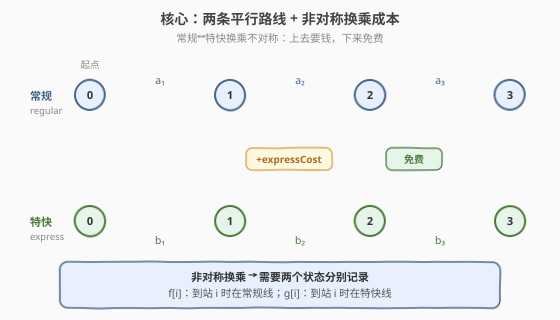
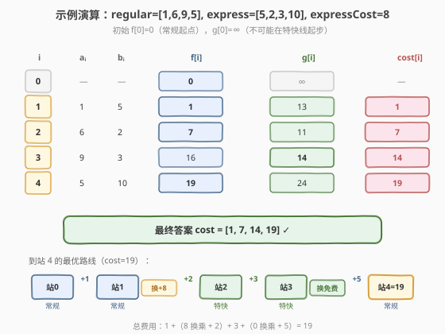

# LeetCode 乘坐火车路线的最少费用 题解

## 1. 题目概述

- **标题 / 题号**：乘坐火车路线的最少费用（#2361，hard）
- **链接**：https://leetcode.cn/problems/minimum-costs-using-the-train-line/
- **难度**：困难
- **标签**：数组、动态规划

**题意**：城市中的火车有两条路线：**常规路线**和**特快路线**。两条路线经过**相同**的 $n+1$ 个车站，编号 $0$ 到 $n$。初始时你位于车站 $0$ 的常规路线上。

给你两个**下标从 1 开始**、长度均为 $n$ 的整数数组 `regular` 和 `express`：

- `regular[i]` 表示乘坐常规路线从车站 $i-1$ 到车站 $i$ 的费用；
- `express[i]` 表示乘坐特快路线从车站 $i-1$ 到车站 $i$ 的费用。

另外给你一个整数 `expressCost`，表示从常规路线**转换到**特快路线的费用。

**注意**：

- 从特快路线转换回常规路线**没有费用**；
- **每次**从常规路线转换到特快路线，都需要支付 `expressCost` 的费用；
- 留在特快路线上没有额外费用。

返回**下标从 1 开始**、长度为 $n$ 的数组 `costs`，其中 `costs[i]` 是从车站 $0$ 到车站 $i$ 的最少费用。每个车站都可以从任意一条路线到达。

**示例 1**：

```text
输入：regular = [1,6,9,5], express = [5,2,3,10], expressCost = 8
输出：[1,7,14,19]
解释：从车站 0 到车站 4 的最少费用方法：
  - 常规路线 0→1，费用 1
  - 站 1 换乘特快（+8），特快 1→2，费用 8+2=10
  - 特快 2→3，费用 3
  - 站 3 换回常规（免费），常规 3→4，费用 5
  总费用 1+10+3+5 = 19
```

**示例 2**：

```text
输入：regular = [11,5,13], express = [7,10,6], expressCost = 3
输出：[10,15,24]
解释：从车站 0 到车站 3 的最少费用方法：
  - 站 0 换乘特快（+3），特快 0→1，费用 3+7=10
  - 站 1 换回常规（免费），常规 1→2，费用 5
  - 站 2 换乘特快（+3），特快 2→3，费用 3+6=9
  总费用 10+5+9 = 24
```

**约束**：

- $n = \text{regular.length} = \text{express.length}$
- $1 \le n \le 10^5$
- $1 \le \text{regular}[i], \text{express}[i], \text{expressCost} \le 10^5$

> 💡 **关键约束**：总费用上限约为 $n \times \max(\text{regular}, \text{express} + \text{expressCost}) \approx 10^5 \times 2 \times 10^5 = 2 \times 10^{10}$，超过 `int` 上界，故答案与中间状态需用 `long long`。

## 2. 解题思路

### 2.1 暴力思路：枚举每段路线

最直白的做法：对 $n$ 段路程，每段选「常规」或「特快」，再在选特快段时额外加上 `expressCost`（特快段的换乘成本）。共 $2^n$ 种组合，$n = 10^5$ 时完全不可行。

> ⚠️ 暴力的浪费在于：每段的最优选择**只依赖**到上一段时所在路线的最少费用，与更早的路线历史无关——这天然是一个**两状态 DP**（当前在常规线 / 在特快线）。

### 2.2 核心观察：两条平行路线 + 非对称换乘成本



**关键观察**：换乘成本是**非对称**的——常规→特快要付 `expressCost`，特快→常规免费。因此「到达站 $i$ 时所在路线」会显著影响后续决策（同一站、同一累计费用下，停在特快线比停在常规线更有"后续优势"，因为可以免费回到常规线，但反过来要花钱）。

故需用**两个状态**分别记录到站 $i$ 时的最少费用：

- $f[i]$：从站 $0$ 到站 $i$、且**到站 $i$ 时在常规线**的最少费用；
- $g[i]$：从站 $0$ 到站 $i$、且**到站 $i$ 时在特快线**的最少费用。

**初始**：$f[0] = 0$（起点在常规线），$g[0] = +\infty$（不可能起步就在特快线，因为换乘要在某站发生，而站 0 起步无需换乘但只可能在常规线）。

### 2.3 算法流程图：4 条状态转移边

![状态转移：f[i] 与 g[i] 的 4 条转移边](../images/train_line_dp_transition.svg)

考虑从站 $i-1$ 前进到站 $i$（记 $a = \text{regular}[i]$、$b = \text{express}[i]$），到达站 $i$ 时所在路线只有两种可能，每种各来自两条来源：

**到达站 $i$ 时在常规线** $f[i]$：

- 从站 $i-1$ 的常规线直接走常规段：$f[i-1] + a$；
- 从站 $i-1$ 的特快线**免费换回**常规线再走常规段：$g[i-1] + a$。

$$f[i] = \min\{\, f[i-1] + a,\ g[i-1] + a \,\}$$

**到达站 $i$ 时在特快线** $g[i]$：

- 从站 $i-1$ 的常规线**付费换乘**到特快线再走特快段：$f[i-1] + \text{expressCost} + b$；
- 从站 $i-1$ 的特快线继续走特快段（无需再付换乘费）：$g[i-1] + b$。

$$g[i] = \min\{\, f[i-1] + \text{expressCost} + b,\ g[i-1] + b \,\}$$

**答案**：到站 $i$ 可停在任一路线，故 $\text{cost}[i] = \min\{f[i], g[i]\}$。

### 2.4 示例演算

以示例 1 `regular=[1,6,9,5]`, `express=[5,2,3,10]`, `expressCost=8` 为例。初始 $f[0]=0$、$g[0]=\infty$。



| $i$ | $a_i$ | $b_i$ | $f[i]$ 计算 | $g[i]$ 计算 | $\text{cost}[i]$ |
|-----|-------|-------|------------|------------|------------------|
| 0   | —     | —     | $0$        | $\infty$   | —                |
| 1   | 1     | 5     | $\min(0{+}1,\ \infty{+}1)=1$ | $\min(0{+}8{+}5,\ \infty{+}5)=13$ | $\min(1,13)=1$ |
| 2   | 6     | 2     | $\min(1{+}6,\ 13{+}6)=7$ | $\min(1{+}8{+}2,\ 13{+}2)=11$ | $\min(7,11)=7$ |
| 3   | 9     | 3     | $\min(7{+}9,\ 11{+}9)=16$ | $\min(7{+}8{+}3,\ 11{+}3)=14$ | $\min(16,14)=14$ |
| 4   | 5     | 10    | $\min(16{+}5,\ 14{+}5)=19$ | $\min(16{+}8{+}10,\ 14{+}10)=24$ | $\min(19,24)=19$ |

最终 $\text{cost}=[1,7,14,19]$，与示例一致。

> 💡 **观察 $i=3$**：$g[3]=14 < f[3]=16$，此时停在特快线反而更省——因为站 1 换乘特快后，连续两段特快（$2+3=5$）比连续两段常规（$6+9=15$）便宜太多，弥补了换乘费 $8$。这就是「非对称换乘 + 路线差异」让两状态 DP 必要的体现。

## 3. 参考代码

### C++

```cpp
class Solution {
public:
    vector<long long> minimumCosts(vector<int>& regular, vector<int>& express, int expressCost) {
        int n = regular.size();
        long long f[n + 1];                 // f[i]：到站 i 在常规线
        long long g[n + 1];                 // g[i]：到站 i 在特快线
        f[0] = 0;
        g[0] = 1 << 30;                     // ∞：起步不可能在特快线
        vector<long long> cost(n);
        for (int i = 1; i <= n; ++i) {
            int a = regular[i - 1];
            int b = express[i - 1];
            f[i] = min(f[i - 1] + a, g[i - 1] + a);              // 到常规线：留常规 或 特快→常规(免费)
            g[i] = min(f[i - 1] + expressCost + b, g[i - 1] + b); // 到特快线：常规→特快(付费) 或 留特快
            cost[i - 1] = min(f[i], g[i]);
        }
        return cost;
    }
};
```

> 💡 `1 << 30` 充当 $\infty$（约 $10^9$，远大于任何可达费用且不会溢出 `long long`）。`cost` 用 `long long`，因为答案可达约 $2 \times 10^{10}$。

### Python

```python
class Solution:
    def minimumCosts(
        self, regular: List[int], express: List[int], expressCost: int
    ) -> List[int]:
        n = len(regular)
        f = [0] * (n + 1)            # f[i]：到站 i 在常规线
        g = [inf] * (n + 1)          # g[i]：到站 i 在特快线
        cost = [0] * n
        for i, (a, b) in enumerate(zip(regular, express), 1):
            f[i] = min(f[i - 1] + a, g[i - 1] + a)                 # 留常规 或 特快→常规(免费)
            g[i] = min(f[i - 1] + expressCost + b, g[i - 1] + b)  # 常规→特快(付费) 或 留特快
            cost[i - 1] = min(f[i], g[i])
        return cost
```

> ⚠️ Python 用 `float('inf')` 作 $\infty$ 自然处理 `min` 比较；返回值为 `int`（`inf + a` 不会出现在最终 `cost` 里，因为 $f[0]=0$ 这一可行源始终存在）。

## 4. 复杂度分析

| 维度 | 复杂度 | 说明 |
|------|--------|------|
| **时间复杂度** | $O(n)$ | 每站 $O(1)$ 转移，共 $n$ 站 |
| **空间复杂度** | $O(n)$ | $f$、$g$ 两数组各 $n+1$；返回数组 $n$ |

## 5. 扩展：滚动变量优化到 $O(1)$ 空间

$f[i]$、$g[i]$ 的转移只依赖 $f[i-1]$、$g[i-1]$，可用两个滚动变量代替整张表，空间降至 $O(1)$（不计返回数组）：

```cpp
class Solution {
public:
    vector<long long> minimumCosts(vector<int>& regular, vector<int>& express, int expressCost) {
        long long f = 0, g = 1 << 30;          // f[i-1], g[i-1]
        vector<long long> cost(regular.size());
        for (int i = 0; i < (int)regular.size(); ++i) {
            int a = regular[i];
            int b = express[i];
            long long ff = min(f + a, g + a);
            long long gg = min(f + expressCost + b, g + b);
            f = ff;
            g = gg;
            cost[i] = min(f, g);
        }
        return cost;
    }
};
```

```python
class Solution:
    def minimumCosts(
        self, regular: List[int], express: List[int], expressCost: int
    ) -> List[int]:
        f, g = 0, inf
        cost = [0] * len(regular)
        for i, (a, b) in enumerate(zip(regular, express)):
            ff = min(f + a, g + a)
            gg = min(f + expressCost + b, g + b)
            f, g = ff, gg
            cost[i] = min(f, g)
        return cost
```

> ⚠️ **滚动更新的顺序**：必须先用旧 `f`、`g` 算出 `ff`、`gg`，**再统一**赋值 `f = ff; g = gg`。若边算边覆盖（如先 `f = ff` 再算 `gg`），`gg` 会读到新 `f`，导致「同一站既换乘又留特快」的错误耦合。

| 解法 | 时间 | 空间 | 说明 |
|------|------|------|------|
| 数组 DP | $O(n)$ | $O(n)$ | 直观，便于调试、回看每站状态 |
| 滚动变量 | $O(n)$ | $O(1)$ | 省空间，面试写法更简洁 |

> 💡 **抽象经验**：状态转移只依赖「上一阶段」时，永远可用滚动变量把 $O(n)$ 空间压成 $O(1)$——这是一维 DP 的通用优化套路（参见 198 打家劫舍、303 区域和检索的滚动版）。

## 6. 面试要点

1. **为什么需要两个状态 $f$ 和 $g$，不能只用一个 `dp[i]`？**

   - 因为换乘成本**非对称**：常规→特快要付费、特快→常规免费。同一站、同一累计费用下，停在特快线比停在常规线更有"后续优势"（可免费回常规，反之要钱）。单状态 `dp[i]` 无法区分到站时所在路线，会丢掉这个影响后续决策的关键信息。两状态 DP 把「所在路线」编码进状态，保证最优子结构成立。

2. **初始为什么 $g[0] = \infty$ 而不是 $0$？**

   - 题目明确「初始时你位于车站 0 的常规路线」，起步只可能在常规线。特快线需在某站**换乘**才能进入（付 `expressCost`），不可能在站 0 就免费处于特快线。$g[0]=\infty$ 切断「起步即特快」的非法来源，迫使换乘只能从站 $i \ge 1$ 发生。

3. **滚动变量更新为什么要先算 `ff`、`gg` 再统一赋值？**

   - 转移方程中 $f[i]$ 和 $g[i]$ **都**依赖 $f[i-1]$ 和 $g[i-1]$。若先 `f = ff` 再算 `gg = min(f + ..., g + ...)`，`gg` 会读到**新** `f`（即 $f[i]$），相当于让 $g[i]$ 从 $f[i]$ 转移，制造了同一站内「先换乘到常规再立刻换乘到特快」的伪路径。先算 `ff`、`gg` 暂存，再统一赋值，保证两者都读旧值。

4. **为什么答案用 `long long` / 任意精度整数？**

   - 最坏情况每段费用约 $10^5$，共 $10^5$ 段，总费用可达 $10^{10}$ 量级，超过 32 位 `int` 上界（约 $2.1 \times 10^9$）。故中间状态与返回值都需 `long long`（Python 自动大整数无需关心）。

5. **能否把"每段选哪条线"还原成实际路径？**

   - 可以。DP 求出最值后，从终点倒推：对站 $i$，看 $f[i]$、$g[i]$ 哪个小即为到该站的最优路线；再据转移方程判断来自 $f[i-1]$ 还是 $g[i-1]$（即站 $i-1$ 的最优路线），逐站回溯。换乘发生在「站 $i-1$ 路线 ≠ 站 $i$ 路线」且方向为常规→特快处。

> 💡 **一句话总结**：非对称换乘 → 「到站时所在路线」影响后续 → 两状态 DP $f/g$，各两条转移边（留同线 / 换线），$\text{cost}[i]=\min(f[i],g[i])$，$O(n)$ 时间 + 滚动变量 $O(1)$ 空间。

## 同类练习题

| # | 题目 | 与本题的关联 |
|---|------|-------------|
| 198 | [打家劫舍](https://leetcode.cn/problems/house-robber/)（[题解](../0201-0300/198_打家劫舍.md)） | 一维 DP 滚动变量优化的经典母题，$O(n) \to O(1)$ 空间的同一套路 |
| 213 | [打家劫舍 II](https://leetcode.cn/problems/house-robber-ii/)（[题解](../0201-0300/213_打家劫舍II.md)） | 拆环为线 + 两状态 DP，状态定义驱动转移的思路同构 |
| 714 | [买卖股票的最佳时机含手续费](https://leetcode.cn/problems/best-time-to-buy-and-resume-transactions-with-fee/) | 两状态 DP（持有 / 不持有），「交易时付手续费」对应本题「换乘时付 expressCost」，结构高度相似 |
| 322 | [零钱兑换](https://leetcode.cn/problems/coin-change/)（[题解](../0301-0400/322_零钱兑换.md)） | 完全背包 DP，同为「每步多选择取 min」的转移范式 |
| 62 | [不同路径](https://leetcode.cn/problems/unique-paths/) | 网格 DP 转移只依赖上一格，可滚动数组优化 $O(n)$ 空间，思路同构 |
