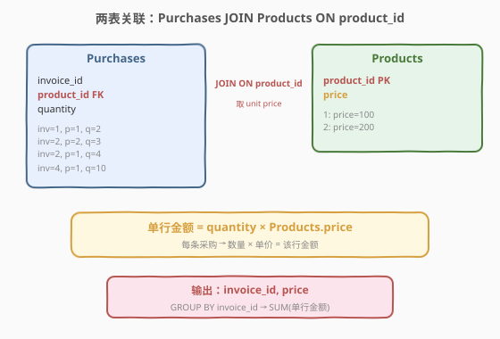
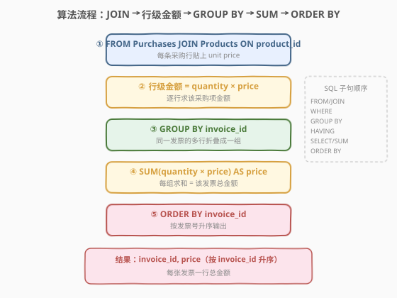
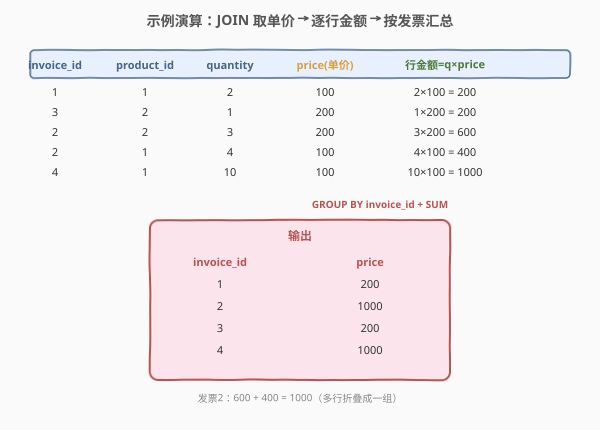

# 生成发票

- **题目名称**：生成发票
- **链接**：[2362. 生成发票 🔒](https://leetcode.cn/problems/generate-the-invoice/)
- **难度**：困难
- **标签**：SQL、多表 JOIN、GROUP BY、聚合求和、LeetCode 锁题

> ⚠️ **关于题面**：本题为 **LeetCode Plus 会员专享题**，官方题面与示例输出被会员墙锁定，公开 GraphQL 接口（leetcode.cn 与 leetcode.com）的 `content` 字段均返回 `null`，网页亦提示"该题目是 Plus 会员专享题"。下文 **第 1 节题意**系依据公开可见的**建表语句（`metaData.database_schema`）与示例输入（`sampleTestCase`）+ 题目名"生成发票"**重构而成，**核心算法（`JOIN + GROUP BY + SUM`）与示例输入的演算结果是确定的**；但**官方输出列名 / 排序细节**（本文取 `price`、按 `invoice_id` 升序）为合理推断，**以官方题面为准**——若官方输出列名为 `total`/`amount` 等，仅需改 `AS` 别名，主体逻辑不变。

---

## 1. 题目概述

给定 `Products`（商品单价表）与 `Purchases`（采购明细表）两张表，编写 SQL 查询，**为每张发票生成一行报告**：该发票的总金额 = 其中所有采购项的「数量 × 单价」之和。

**表结构**：

```text
Table: Products
+-------------+---------+
| Column Name | Type    |
+-------------+---------+
| product_id  | int     |  ← 主键
| price       | int     |  ← 单价
+-------------+---------+
每行给出一件商品的单价。

Table: Purchases
+-------------+---------+
| Column Name | Type    |
+-------------+---------+
| invoice_id  | int     |  ← 发票号
| product_id  | int     |  ← 外键 → Products.product_id
| quantity    | int     |  ← 采购数量
+-------------+---------+
每行表示某张发票上采购了 quantity 件 product_id 商品。
同一发票可含多行（采购多种商品）。
```

**输出列**：`invoice_id`、`price`（该发票总金额）。结果按 `invoice_id` **升序**返回。

**示例 1**（取自官方 `sampleTestCase`）：

```text
输入：
Products 表:
+-------------+--------+
| product_id  | price  |
+-------------+--------+
| 1           | 100    |
| 2           | 200    |
+-------------+--------+

Purchases 表:
+-------------+-------------+----------+
| invoice_id  | product_id  | quantity |
+-------------+-------------+----------+
| 1           | 1           | 2        |
| 3           | 2           | 1        |
| 2           | 2           | 3        |
| 2           | 1           | 4        |
| 4           | 1           | 10       |
+-------------+-------------+----------+

输出：
+-------------+-------+
| invoice_id  | price |
+-------------+-------+
| 1           | 200   |
| 2           | 1000  |
| 3           | 200   |
| 4           | 1000  |
+-------------+-------+
```

**解释**：

| 发票 | 采购明细 | 总金额计算 |
|------|----------|------------|
| 1 | 2 件商品1（单价100） | $2 \times 100 = 200$ |
| 2 | 3 件商品2（单价200）+ 4 件商品1（单价100） | $3 \times 200 + 4 \times 100 = 600 + 400 = 1000$ |
| 3 | 1 件商品2（单价200） | $1 \times 200 = 200$ |
| 4 | 10 件商品1（单价100） | $10 \times 100 = 1000$ |

> ⚠️ 注意同一发票（如发票 2）对应 `Purchases` 的**多行**——计算时要**按 `invoice_id` 分组**，把该发票所有采购行的金额累加。这正是 `GROUP BY invoice_id + SUM` 的用武之地。

**约束条件**（推断自 `database_schema` 类型声明）：

- `product_id` 是 `Products` 表的主键
- `Purchases.product_id` 引用 `Products.product_id`（外键完整性）
- `invoice_id`、`quantity`、`price` 均为 `INT`
- 结果按 `invoice_id` 升序返回

> 💡 本题是 SQL **"多表 JOIN + GROUP BY 聚合求和"** 的招牌形态——核心三步：① `JOIN Products` 取单价 `price`；② 每行算金额 `quantity × price`；③ `GROUP BY invoice_id` + `SUM` 汇总每张发票。难点不在语法，在于把「单价 × 数量」拆成行级表达式后交给 `SUM` 分组聚合（与 [1571. 仓库经理 🔒](../1501-1600/1571_仓库经理.md) 同构）。

---

## 2. 解题思路

### 2.1 暴力思路：逐发票逐采购项累加

最直觉的过程式思路：对每张发票，遍历其所有采购行，关联 `Products` 取单价，算出每行金额后累加。伪代码：

```text
for each invoice inv (grouped by invoice_id):
    total = 0
    for each row (invoice_id, product_id, quantity) in inv:
        p = SELECT * FROM Products WHERE product_id = row.product_id
        total += quantity * p.price
    emit (inv.invoice_id, total)
```

这对应 SQL 的「相关子查询 + 逐行计算」写法。逻辑正确，但**对每行 Purchases 都要探测一次 Products**，复杂度 $O(P \cdot \text{lookup})$。更自然的方式是先 `JOIN` 把单价"贴"到每行 Purchases 上，再一次性分组求和——这正是关系代数中"连接 + 聚合"的标准范式。

### 2.2 核心观察：JOIN 取单价 + GROUP BY 分组求和



**问题拆解为两个子问题**：

1. **取单价算行金额**：`Purchases` 表只有 `product_id` 和 `quantity`，没有单价——需 `JOIN Products ON product_id` 取 `price`，才能算每行的**行金额**：

$$\text{row\_amount} = \text{quantity} \times \text{price}$$

2. **按发票分组汇总**：同一发票 `invoice_id` 下有多行（发票 2 有 2 行），需 `GROUP BY invoice_id` 折叠成一行，用 `SUM(row_amount)` 累加得该发票总金额：

$$\text{price} = \sum_{\text{该发票所有采购行}} \text{quantity}_i \times \text{price}_i$$

> 💡 **为何 `SUM` 里能直接写乘法表达式？** `SUM(quantity * price)` 是合法的——聚合函数的参数可以是任意标量表达式，先对每行求值再累加。等价于先 `JOIN` 后用 `SELECT quantity * price AS row_amount` 算出行金额，再 `SUM(row_amount)`。两种写法语义一致，前者更紧凑。

> ⚠️ **`JOIN` 方式的选择**：本题 `Purchases.product_id` 引用 `Products.product_id`（外键完整性），用 `INNER JOIN` 即可。若存在"采购了某商品但 Products 表缺该商品"的脏数据，`INNER JOIN` 会丢弃该行；此时可用 `LEFT JOIN` 保留，但单价为 `NULL` 时该行 `row_amount = NULL`，`SUM` 会跳过（`NULL × 任何值 = NULL`，`SUM` 忽略 `NULL`）。题面保证数据完整，用 `JOIN`/`INNER JOIN` 即可。

### 2.3 算法流程图



**逻辑执行步骤**：

| 步骤 | 子句 | 作用 |
|------|------|------|
| ① | `FROM Purchases JOIN Products ON product_id` | 两表按 `product_id` 等值连接，每行 Purchases 获得单价 `price` |
| ② | `quantity * price` | 行级表达式：算该采购项的金额 |
| ③ | `GROUP BY invoice_id` | 按发票折叠，同一发票的多行归一组 |
| ④ | `SUM(quantity * price) AS price` | 每组求和 = 该发票总金额 |
| ⑤ | `ORDER BY invoice_id` | 按发票号升序输出 |

> 💡 **SQL 子句执行顺序**：`FROM`（含 `JOIN`/`ON`）→ `WHERE` → `GROUP BY` → `HAVING` → `SELECT`（含 `SUM`）→ `ORDER BY` → `LIMIT`。步骤 ① 的 `JOIN` 在 `FROM` 阶段完成，产出"采购行 × 单价"的明细行集；步骤 ③ 的 `GROUP BY` 把明细按发票折叠；步骤 ④ 的 `SUM` 在 `SELECT` 阶段对每组求和；步骤 ⑤ 的 `ORDER BY` 最后排序。本题**不需要 `WHERE`/`HAVING`**——全量聚合，无过滤条件。

### 2.4 示例演算

以示例 1 的 5 行 Purchases 数据为例，观察「JOIN 取单价 → 逐行算金额 → 分组求和」的逐步过程：



**步骤 ①②：JOIN Products + 逐行算 row_amount**

`Purchases JOIN Products ON product_id` 后，每行获得单价，行金额 = `quantity × price`：

| invoice_id | product_id | quantity | price(单价) | 行金额 |
|------------|------------|----------|-------------|--------|
| 1 | 1 | 2 | 100 | $2 \times 100 = 200$ |
| 3 | 2 | 1 | 200 | $1 \times 200 = 200$ |
| 2 | 2 | 3 | 200 | $3 \times 200 = 600$ |
| 2 | 1 | 4 | 100 | $4 \times 100 = 400$ |
| 4 | 1 | 10 | 100 | $10 \times 100 = 1000$ |

**步骤 ③④⑤：GROUP BY invoice_id + SUM(row_amount) + ORDER BY**

| 发票 | 求和表达式 | price |
|------|-----------|-------|
| 1 | $200$ | $200$ |
| 2 | $600 + 400$ | $1000$ |
| 3 | $200$ | $200$ |
| 4 | $1000$ | $1000$ |

按 `invoice_id` 升序输出 4 行，与示例一致。

> 💡 **观察发票 2**：它在 `Purchases` 中占 2 行（商品2×3 + 商品1×4），`GROUP BY invoice_id` 把这两行折叠成一组，`SUM` 把 $600 + 400 = 1000$ 汇总为一行——这正是"同一实体跨多行、需按标识分组折叠"的标准场景，与 [1571. 仓库经理](../1501-1600/1571_仓库经理.md) 的"同一仓库多商品行"、[2329. 产品销售分析 V](../2301-2400/2329_产品销售分析V.md) 的"同一产品多销售日"同构。

---

## 3. 参考代码

### SQL（解法 A：`JOIN + GROUP BY + SUM`，推荐）

```sql
SELECT
    invoice_id,
    SUM(quantity * price) AS price
FROM
    Purchases
    JOIN Products USING (product_id)
GROUP BY
    invoice_id
ORDER BY
    invoice_id;
```

> 💡 **写法要点**：
> - **`JOIN Products USING (product_id)`**：等值连接，把单价 `price` 贴到每行 Purchases。`USING (product_id)` 等价于 `ON Purchases.product_id = Products.product_id`，但更简洁。
> - **`SUM(quantity * price)`**：聚合函数内嵌乘法表达式——先对每行求 `quantity × price`，再按组累加。
> - **`GROUP BY invoice_id`**：按发票折叠。标准 SQL 推荐用原列名而非列序号。
> - **`ORDER BY invoice_id`**：题目要求按发票号升序。若官方为"顺序任意"可去掉此行。
> - ✓ **最推荐**：一行表达式完成"取单价 + 算金额 + 分组汇总 + 排序"，最紧凑。

### SQL（解法 B：CTE 先算行金额再聚合，可读性更佳）

```sql
WITH Joined AS (
    SELECT
        pu.invoice_id,
        pu.quantity * pr.price AS row_amount
    FROM Purchases pu
    JOIN Products pr ON pu.product_id = pr.product_id
)
SELECT
    invoice_id,
    SUM(row_amount) AS price
FROM Joined
GROUP BY invoice_id
ORDER BY invoice_id;
```

> 💡 **解法 B 的优势**：用 CTE 把「JOIN + 行金额计算」封装为 `Joined`，主查询聚焦于「分组求和」，**职责分离、可读性更佳**。当行级表达式复杂（含 `IFNULL`/`CASE` 等）时，CTE 拆分能避免 `SUM` 内嵌冗长表达式。MySQL 8.0+ 支持 CTE。

### SQL（解法 C：相关子查询，对照思路）

不解构为 JOIN，而是对每张发票分组后用相关子查询求金额：

```sql
SELECT DISTINCT
    pu.invoice_id,
    (
        SELECT SUM(p2.quantity * pr.price)
        FROM Purchases p2 JOIN Products pr ON p2.product_id = pr.product_id
        WHERE p2.invoice_id = pu.invoice_id
    ) AS price
FROM Purchases pu
ORDER BY invoice_id;
```

> ⚠️ **解法 C 的缺陷**：
> - **相关子查询**：对每张发票执行一次子查询，重复扫描 `Purchases` + `Products`，$O(P \cdot (P + R))$，性能差。
> - **`SELECT DISTINCT`**：因每行 Purchases 都会算一次 `price`，需 `DISTINCT` 去重，额外排序开销。
> - **优点**：思路直观（"对每张发票算金额"），不依赖 `GROUP BY`。
>
> 仅作「另一种思路」对照，**生产环境推荐解法 A/B**。

### Python（pandas）

```python
import pandas as pd

def generate_the_invoice(products: pd.DataFrame, purchases: pd.DataFrame) -> pd.DataFrame:
    merged = purchases.merge(products, on='product_id')
    merged['row_amount'] = merged['quantity'] * merged['price']
    result = (
        merged.groupby('invoice_id', as_index=False)['row_amount']
        .sum()
        .rename(columns={'row_amount': 'price'})
        .sort_values('invoice_id', ignore_index=True)
    )
    return result[['invoice_id', 'price']]
```

> 💡 **pandas 对照**：
> - `purchases.merge(products, on='product_id')` 对应 SQL 的 `JOIN Products USING (product_id)`。
> - `merged['row_amount'] = quantity * price` 对应行级金额表达式。
> - `.groupby('invoice_id')['row_amount'].sum()` 对应 `GROUP BY invoice_id` + `SUM(row_amount)`。
> - `.rename(columns={'row_amount': 'price'})` 对应 `SELECT` 中的列别名。
> - `.sort_values('invoice_id')` 对应 `ORDER BY invoice_id`。

---

## 4. 复杂度分析

| 维度 | 解法 A（`JOIN + SUM`） | 解法 B（CTE） | 解法 C（相关子查询） | pandas |
|------|------------------------|---------------|----------------------|--------|
| **时间** | $O(P + R)$ | $O(P + R)$ | $O(P \cdot (P + R))$ | $O(P + R)$ |
| **空间** | $O(P)$ | $O(P)$ | $O(1)$ 额外 | $O(P)$ |
| **扫表次数** | 各表 1 次 | 各表 1 次 | $P$ 次扫 Purchases+Products | 各表 1 次 |
| **可读性** | ✓ 紧凑 | ✓ 最清晰 | ✗ 冗长 | ✓ 清晰 |
| **推荐度** | ✓ **首选** | ✓ 备选 | ✗ 仅对照 | ✓ 验证用 |

> - $P$ = `Purchases` 行数，$R$ = `Products` 行数
> - **解法 A/B**：`JOIN` 在 `product_id`（Products 主键）上探测 $O(\log R)$（B+树索引）或 $O(1)$（哈希连接），$P$ 行探测 $O(P)$；`GROUP BY + SUM` 扫描 $P$ 行 $O(P)$；`ORDER BY invoice_id` 排序 $O(K \log K)$（$K$ 为发票数，$K \le P$）。总体近线性。
> - **解法 C**：对每张发票执行一次子查询，子查询全扫 `Purchases` + `JOIN Products`，总扫描量 $O(K \cdot (P + R))$，发票多时严重退化。
> - **索引优化**：`Products(product_id)` 是主键自带索引；在 `Purchases(product_id)` 上建索引可加速 `JOIN`，在 `Purchases(invoice_id)` 上建索引可加速 `GROUP BY` 与解法 C 的相关子查询。

---

## 5. 扩展：聚合表达式与列名冲突的处理

### 5.1 `SUM(表达式)` vs 先算列再 `SUM`

两种写法等价：

```sql
-- 写法 1：SUM 内嵌表达式（解法 A）
SUM(quantity * price)

-- 写法 2：先算列再 SUM（解法 B 的 CTE）
SELECT quantity * price AS row_amount ...
SUM(row_amount)
```

| 维度 | 写法 1（内嵌） | 写法 2（先算列） |
|------|----------------|-------------------|
| 简洁度 | ✓ 一行搞定 | 需 CTE/子查询拆层 |
| 可读性 | 表达式简单时佳 | 表达式复杂时佳 |
| 性能 | 等价（优化器展开） | 等价 |
| 复用性 | ✗ 无法引用中间值 | ✓ `row_amount` 可在 `HAVING`/`ORDER BY` 复用 |

> 💡 **口诀**：表达式简单（如本题二元乘积）用写法 1；表达式复杂（含 `CASE`/`IFNULL`/多层运算）或中间值需复用（如要 `HAVING row_amount > 0`）时用写法 2（CTE）。

### 5.2 输入列与输出列同名 `price` 的处理

本题输入 `Products.price` 是**单价**，输出列 `price` 是**发票总金额**——同名而语义不同。`SUM(quantity * price)` 中参与运算的 `price` 取自 `JOIN` 后的单价列，`AS price` 把结果**重命名**为输出列。两者互不干扰：聚合发生在 `GROUP BY` 后，`AS` 仅作用于最终投影。

> ⚠️ 若数据库对 `SELECT` 中裸 `price`（非聚合列）与 `GROUP BY` 冲突敏感（如 PostgreSQL 严格模式），务必把裸单价包进 `SUM(quantity * price)` 聚合表达式中，**不要单独 `SELECT price`**——否则会报"非聚合列必须出现在 GROUP BY 中"的错误。MySQL 默认宽松模式（`ONLY_FULL_GROUP_BY` 关闭）会任取一行值，结果错误，应避免依赖。

### 5.3 边界情况

| 场景 | 结果 | 说明 |
|------|------|------|
| 发票无任何采购行 | 不出现在结果 | `GROUP BY` 只对存在的 `invoice_id` 分组，空发票不会被补出 |
| 采购项 `quantity = 0` | 该行 `row_amount = 0` | `SUM` 加 0 不影响总量，但该发票仍出现在结果（若有其他采购行） |
| 单价为 0（赠品） | 该行 `row_amount = 0` | 合理，赠品不计金额 |
| 发票只有 `quantity = 0` 的采购 | `price = 0` | 发票出现在结果，金额为 0 |

> ⚠️ **空发票遗漏**：若一张发票在 `Purchases` 中**完全没有采购行**，它不会出现在 `GROUP BY` 的结果中。本题题面以 `Purchases` 驱动（只记实际采购），故无需处理。若业务要求列出所有发票（含空的），需另维护 `Invoices(invoice_id)` 主表并 `LEFT JOIN Purchases`。

---

## 6. 面试要点

1. **`SUM(quantity * price)` 为什么能直接写在 `SUM` 里？**

   > 聚合函数的参数可以是任意**标量表达式**——`SUM` 会对每行先求该表达式的值，再累加。`quantity * price` 是行级标量（每行一个值），`SUM` 把同组的所有行级值相加。等价于先用 `SELECT quantity * price AS row_amount` 算列，再 `SUM(row_amount)`。

2. **`USING (product_id)` 和 `ON pu.product_id = pr.product_id` 有何区别？**

   > 语义等价，都按 `product_id` 等值连接。区别在于连接后的结果集：`USING` 会**合并**同名列（`product_id` 只出现一列），而 `ON` 会**保留**两表的列（`Purchases.product_id` 和 `Products.product_id` 都出现，需用表名限定）。当两表同名列且语义一致时，`USING` 更简洁。

3. **为什么需要 `GROUP BY invoice_id`，不能只 `SUM` 全表？**

   > 题目要求**每张发票一行**总金额。若不 `GROUP BY`，`SUM(quantity * price)` 会把全表所有采购行加成一个总数，丢失"按发票分桶"的维度。`GROUP BY invoice_id` 让 `SUM` 在每个发票组内分别求和，输出 $K$ 行（$K$ 为发票数）。

4. **输出列 `price` 与输入 `Products.price` 同名会冲突吗？**

   > 不会。`SUM(quantity * price)` 中的 `price` 是 `JOIN` 后的单价列（行级运算），`AS price` 是对聚合结果的**投影别名**。聚合先于投影发生，二者作用阶段不同。但要注意：裸 `SELECT price`（不包进聚合）在 `GROUP BY invoice_id` 下是非法的（非聚合列须在 `GROUP BY` 中），应始终把单价包进 `SUM` 表达式。

5. **如果只要金额最高的发票，怎么改？**

   > 在分组求和外层包一层，按 `price` 降序取首行：`ORDER BY price DESC LIMIT 1`；或用 `RANK() OVER (ORDER BY SUM(quantity*price) DESC)` 窗口函数取并列第一。注意 `LIMIT 1` 只能取一条，并列最高需用窗口函数保留全部。这是「分组聚合 + 取最值」的叠加，承接 [586. 订单最多的客户 🔒](https://leetcode.cn/problems/customer-placing-the-largest-number-of-orders/)。

> 💡 **一句话总结**：2362 是 SQL **"多表 JOIN + GROUP BY 聚合求和"** 招牌形态——核心模板「`JOIN Products USING (product_id)` 取单价 → `SUM(quantity × price)` 行级表达式 → `GROUP BY invoice_id` 分组 → `ORDER BY invoice_id` 排序」。最大要点：**聚合函数内可嵌行级表达式**，先逐行求值再分组累加，一行 SQL 搞定"按发票汇总金额"。

---

## 7. 同类练习题

- [1571. 仓库经理 🔒](https://leetcode.cn/problems/warehouse-manager/)（[题解](../1501-1600/1571_仓库经理.md)）：`JOIN Products` 取尺寸 → `SUM(units × W × L × H)` → `GROUP BY 仓库`，与本题完全同构（"实体跨多行 → 按标识分组折叠"）
- [2329. 产品销售分析 V](https://leetcode.cn/problems/product-sales-analysis-v/)：`JOIN Sales + Product` → `GROUP BY product_id` → `SUM(quantity)` 求总销量，共享「JOIN 取属性 + 分组聚合」骨架，更简单
- [586. 订单最多的客户 🔒](https://leetcode.cn/problems/customer-placing-the-largest-number-of-orders/)：`GROUP BY + COUNT + ORDER BY LIMIT 1`，同为「分组聚合」家族，单组取最值
- [1193. 每月交易 I 🔒](https://leetcode.cn/problems/monthly-transactions-i/)：`GROUP BY` 月份聚合交易金额与状态计数，同为「分组求和」家族，叠加 `CASE WHEN` 条件计数
- [1082. 销售分析 I](https://leetcode.cn/problems/sales-analysis-i/)：`JOIN Sales + Product` 取属性后做分组聚合，对照本题「JOIN 取单价 + GROUP BY 求和」的简化形态
