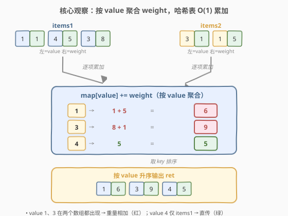
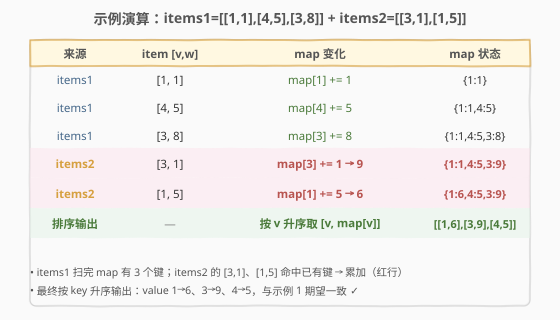

# 合并相似的物品

- **题目名称**：合并相似的物品
- **链接**：[2363. 合并相似的物品](https://leetcode.cn/problems/merge-similar-items/)
- **难度**：简单
- **标签**：数组、哈希表、排序、模拟

## 1. 题目概述

给你两个二维整数数组 `items1` 和 `items2`，表示两个物品集合。每个 `items[i] = [value_i, weight_i]`，其中 `value_i` 是物品**价值**、`weight_i` 是物品**重量**；且**每个数组内部价值唯一**。返回二维数组 `ret`，其中 `ret[i] = [value_i, weight_i]`，`weight_i` 是所有价值为 `value_i` 的物品**重量之和**，且 `ret` 需**按价值升序**排序。

**示例 1**：

```text
输入：items1 = [[1,1],[4,5],[3,8]], items2 = [[3,1],[1,5]]
输出：[[1,6],[3,9],[4,5]]
解释：
  value=1：items1 中 1，items2 中 5，合计 1+5 = 6
  value=3：items1 中 8，items2 中 1，合计 8+1 = 9
  value=4：仅 items1 中 5，合计 5
```

**示例 2**：

```text
输入：items1 = [[1,1],[3,2],[2,3]], items2 = [[2,1],[3,2],[1,3]]
输出：[[1,4],[2,4],[3,4]]
解释：每个 value 都在两个数组出现，重量两两相加后均为 4。
```

**示例 3**：

```text
输入：items1 = [[1,3],[2,2]], items2 = [[7,1],[2,2],[1,4]]
输出：[[1,7],[2,4],[7,1]]
解释：value=7 仅出现在 items2，直接进入结果。
```

**约束条件**：

- $1 \le \text{items1.length},\; \text{items2.length} \le 1000$
- $\text{items1}[i] = \text{items2}[i] = [v, w]$，$1 \le v, w \le 1000$
- `items1` 中每个 `value_i` 唯一；`items2` 中每个 `value_i` 唯一

> 💡 **关键不变式**：题目本质是「按 `value` 分组求 `weight` 之和」——即 SQL 的 `GROUP BY value SUM(weight)`。**两个数组内的价值各自唯一**，意味着同一 `value` 至多在 `items1`、`items2` 各出现一次，累加只需 $O(1)$ 哈希查询，无需处理同源重复。

---

## 2. 解题思路

### 2.1 暴力思路：逐项配对扫描

最直白的做法是**忠实模拟「合并」**：把 `items1` 每个物品当作基准，去 `items2` 里线性查找相同 `value`，若找到则把重量相加并标记已用，否则直接保留；最后再把 `items2` 中未配对的项追加进来，整体排序。

```text
used = [False] * len(items2)
ret = []
for [v, w] in items1:
    total = w
    for j, [v2, w2] in enumerate(items2):
        if not used[j] and v2 == v:
            total += w2; used[j] = True
    ret.append([v, total])
for j, [v2, w2] in enumerate(items2):
    if not used[j]: ret.append([v2, w2])
ret.sort()
return ret
```

正确性没问题，但内层每查一个 `value` 都要扫一遍 `items2`，最坏 $O(n \cdot m)$；用 `used` 数组去重还把「同源唯一」这层不变式丢掉了——明明同一 `value` 至多配一对，却走「找配对」的弯路。

> ⚠️ 真正该问的不是「`items2` 里谁和我配对」，而是「`value=v` 的总重量是多少」。后者用一张**哈希表**就能 $O(1)$ 回答，无需逐对扫描。

### 2.2 核心观察：按 value 聚合 weight，哈希表 O(1) 累加



把「合并」重新表述为**聚合**：维护一张 `map[value] = weight总和` 的哈希表，**两轮遍历**（先 `items1` 后 `items2`）把每项的 `weight` 累加到对应 `value` 槽位：

- 遇 `[v, w]` → `map[v] += w`（不存在则视作 0 再加，等价于直接插入）
- 两轮跑完，`map` 的每个键就是某个 `value`，值就是它在两个数组里的重量之和

最后取出所有 `(v, w)` 对，**按 `v` 升序**排序输出即可。

> 💡 **为什么是两轮而不是先合并再扫？** 「同源唯一」保证每个 `value` 在单数组内至多出现一次，所以「先 `items1` 再 `items2`」与「先合并成一个长列表再灌入」结果完全一致——两轮写法语义直白、无需去重。若同源可重复，两轮依然正确（哈希累加天然吸收重复），不破坏正确性。

> ⚠️ 注意题目要求**按价值升序**输出，哈希表本身无序，故排序不可省。若题目改为「按出现顺序输出」，则需改用**有序哈希**（Python 用 `dict` 保插入序、C++ 用 `unordered_map` + 单独 `vector` 记录首次出现顺序），不能直接 `sort`。

### 2.3 算法流程图

![算法流程：遍历两数组累加 → 取键 → 按 value 排序 → 构建 [v,w] 输出](../images/merge_items_algorithm_flow.svg)

五步走：①遍历 `items1` 累加 → ②遍历 `items2` 累加 → ③取出全部 `(v,w)` → ④按 `v` 升序排序 → ⑤构建 `[[v, map[v]], ...]` 返回。前两步各 $O(n)/O(m)$，排序 $O(k\log k)$（$k$ 为不同 `value` 数），整体 $O(n+m+k\log k)$。

### 2.4 示例演算



以示例 1 `items1 = [[1,1],[4,5],[3,8]]`、`items2 = [[3,1],[1,5]]` 逐步累加 `map`：

| 来源 | item | map 变化 | map 状态 |
|------|------|----------|----------|
| items1 | [1,1] | `map[1] += 1` | {1:1} |
| items1 | [4,5] | `map[4] += 5` | {1:1, 4:5} |
| items1 | [3,8] | `map[3] += 8` | {1:1, 4:5, 3:8} |
| items2 | [3,1] | `map[3] += 1 → 9` | {1:1, 4:5, 3:9} |
| items2 | [1,5] | `map[1] += 5 → 6` | {1:6, 4:5, 3:9} |
| 排序输出 | — | 按 `v` 升序取 `[v, map[v]]` | `[[1,6],[3,9],[4,5]]` |

`items1` 扫完产生 3 个键；`items2` 的 `[3,1]`、`[1,5]` 均命中已有键做累加；最后按 `value` 升序输出 `[[1,6],[3,9],[4,5]]` ✓。

---

## 3. 参考代码

### C++

```cpp
class Solution {
public:
    vector<vector<int>> mergeSimilarItems(vector<vector<int>>& items1,
                                          vector<vector<int>>& items2) {
        unordered_map<int, int> mp;
        for (auto& it : items1) mp[it[0]] += it[1];
        for (auto& it : items2) mp[it[0]] += it[1];
        vector<vector<int>> ret;
        for (auto& [v, w] : mp) ret.push_back({v, w});
        sort(ret.begin(), ret.end());
        return ret;
    }
};
```

> 💡 `unordered_map` 中 `mp[it[0]] += it[1]` 会在键不存在时先零初始化再累加，故无需显式判存在。`sort` 对 `vector<vector<int>>` 默认按字典序——先比第一维 `value`，恰好满足「按价值升序」，无需自定义比较器。

> 💡 价值域 $[1,1000]$ 时可用 `int cnt[1001]` 直接定址当哈希，省去 `unordered_map` 的散列开销；累加后按下标 1→1000 顺序扫描即为升序，**排序步骤自动省去**：

```cpp
class Solution {
public:
    vector<vector<int>> mergeSimilarItems(vector<vector<int>>& items1,
                                          vector<vector<int>>& items2) {
        int cnt[1001] = {0};
        for (auto& it : items1) cnt[it[0]] += it[1];
        for (auto& it : items2) cnt[it[0]] += it[1];
        vector<vector<int>> ret;
        for (int v = 1; v <= 1000; ++v)
            if (cnt[v]) ret.push_back({v, cnt[v]});
        return ret;
    }
};
```

### Python

```python
class Solution:
    def mergeSimilarItems(self, items1: List[List[int]],
                          items2: List[List[int]]) -> List[List[int]]:
        mp = defaultdict(int)
        for v, w in items1:
            mp[v] += w
        for v, w in items2:
            mp[v] += w
        return sorted([v, w] for v, w in mp.items())
```

> 💡 `collections.defaultdict(int)` 让缺失键自动当 0 累加；`sorted` 对 `[v, w]` 列表按字典序排（先 `v` 后 `w`），与「按价值升序」一致。也可用 `Counter`：`mp = Counter(); for v,w in items1+items2: mp[v]+=w`，一行合并两轮。

---

## 4. 复杂度分析

| 维度 | 复杂度 | 说明 |
|------|--------|------|
| **时间复杂度** | $O(n + m + k\log k)$ | 两轮累加各 $O(n)/O(m)$；排序 $k$ 个键 $O(k\log k)$，$k \le n+m$ |
| **空间复杂度** | $O(k)$ | 哈希表存 $k$ 个不同 `value`，$k \le n+m$ |
| 对照：逐项配对 | $O(n\cdot m)$ / $O(m)$ | 每个 `value` 线性扫 `items2` 查配对，正确但慢 |
| 对照：定长数组 | $O(n + m + V)$ / $O(V)$ | 价值域 $V=1000$ 时直接定址，省去排序，按下标顺序扫描即升序 |

> 💡 价值域 $V$ 已知且不大（本题 $V=1000$）时，定长数组版退化时间为 $O(n+m+V)$、空间 $O(V)$，且天然有序无需排序，是本题的最优常数解。价值域未知或很大时退回哈希表 + 排序，仍为 $O(n+m+k\log k)$。

---

## 5. 扩展：哈希聚合 vs 排序归并——按 key 合并的两种范式

2363 是「**按 key 聚合 value**」家族的最简代表——同一骨架可衍生两类实现，对应数据库/MapReduce 里的两种经典合并范式：

| 范式 | 代表做法 | 时间 | 空间 | 适用 |
|------|----------|------|------|------|
| **哈希聚合** | 本题：`map[v] += w` 两轮累加 | $O(n+m+k\log k)$ | $O(k)$ | 需随机访问、价值域大或未知 |
| **排序归并** | 合并后整体按 `v` 排序，相邻同 `v` 合并 | $O((n+m)\log(n+m))$ | $O(1)$~$O(n+m)$ | 无哈希开销、流式友好 |
| **定址数组** | `cnt[v] += w`，按下标顺序输出 | $O(n+m+V)$ | $O(V)$ | 价值域小且连续 |

三者骨架一致——「**把同 key 的 value 归并到一个槽**」，区别在「槽」的定位方式：哈希函数 / 排序后相邻 / 直接下标。

> 💡 抽象经验：见到「合并两个集合、按某字段分组求和/计数/取最值」类题目，第一反应应是**按 key 聚合**（哈希表或定址数组），而非逐对配对扫描。这与 [2341. 数组能形成多少数对](https://leetcode.cn/problems/maximum-number-of-pairs-in-array/) 的频次表、MapReduce 的 shuffle 阶段同构——「group-by-key」是数据合并的通用范式。

---

## 6. 面试要点

1. **为什么用哈希表而不是逐对配对？**

   > 配对法把「`value=v` 的总重量」拆成「去 `items2` 找匹配项」，每次查询 $O(m)$，总计 $O(nm)$。哈希表把查询降到 $O(1)$：`map[v] += w` 一次定位，两轮累加即 $O(n+m)$。本质是**用空间换时间**，把「查找」从线性降为常数。

2. **`unordered_map` 的 `mp[v] += w` 在键不存在时会怎样？**

   > C++ 中 `unordered_map::operator[]` 对缺失键会**值初始化**（`int` 即 0）再返回引用，故 `+=` 等价于「先 0 再加」，无需显式判存在。Python 的普通 `dict` 则需 `defaultdict(int)` 或 `mp[v] = mp.get(v,0)+w`，否则 `KeyError`。

3. **价值域 $[1,1000]$ 给了我们什么优化？**

   > 可用 `int cnt[1001]` 直接定址当哈希，省去散列/再散列开销；累加后按下标 $1\to1000$ 顺序扫描天然升序，**排序步骤消失**，时间降为 $O(n+m+V)$、空间 $O(V)$。这是「值域小且连续」时的标准套路（承接 [448. 找到所有数组中消失的数字](https://leetcode.cn/problems/find-all-numbers-disappeared-in-an-array/) 的原地标记、[740. 删除并获得点数](https://leetcode.cn/problems/delete-and-earn/) 的值域建桶）。

4. **题目要求按价值升序，哈希表无序，怎么保证？**

   > 哈希表本身无序，故必须显式 `sort`（按 `value` 升序）。若改用定址数组，按下标顺序扫描即升序；若改用有序容器（C++ `map`/Python `dict` 保插入序），语义不同——`map` 按 key 排序但增删 $O(\log k)$，`dict` 保插入序需额外记录首次出现顺序。本题排序 $O(k\log k)$ 已足够。

5. **如果同源内 value 不唯一（同数组里 value 可重复）会怎样？**

   > 哈希累加依然正确——`map[v] += w` 天然吸收同源重复，最终每个 `value` 的总和不变。逐对配对法则会出错（`used` 标记会漏算同源重复项）。这正体现了「聚合」语义比「配对」语义更鲁棒：聚合只关心「key→value之和」，与来源分布无关。

> 💡 **一句话总结**：2363 =「按 `value` 分组求 `weight` 之和」= SQL `GROUP BY value SUM(weight)`。哈希表两轮累加 $O(n+m)$，再按 `value` 升序排序 $O(k\log k)$；价值域小时用定址数组省排序。核心是「group-by-key 聚合」范式，逐对配对是它的低效退化。

---

## 7. 同类练习题

- [2341. 数组能形成多少数对](https://leetcode.cn/problems/maximum-number-of-pairs-in-array/)：同「按值分桶统计」骨架——频次表对每个 $c_v$ 取 $\lfloor c/2\rfloor$，对照本题对每个 $v$ 取 $\sum w$
- [1748. 唯一元素的和](https://leetcode.cn/problems/sum-of-unique-elements/)：频次表筛选——只对 $c_v=1$ 的值求和，同「一次遍历建频次再二次筛选」范式
- [1636. 按照频率将数组升序排序](https://leetcode.cn/problems/sort-array-by-increasing-frequency/)：频次表驱动排序——先建频次再以此为键排序，频次表作为通用预处理步骤的延伸
- [740. 删除并获得点数](https://leetcode.cn/problems/delete-and-earn/)：值域建桶 + 打家劫舍 DP——「按 value 聚合 weight」后做相邻互斥选取，承接本题的定址数组优化
- [88. 合并两个有序数组](https://leetcode.cn/problems/merge-sorted-array/)：两数组合并的另一范式——有序双指针归并 $O(n+m)$，对照本题的「哈希聚合」合并思路
