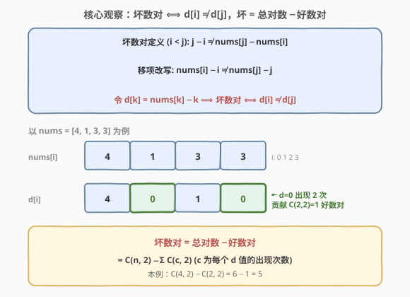
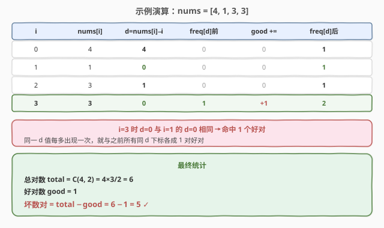

# 统计坏数对的数目

- **题目名称**：统计坏数对的数目
- **链接**：[2364. 统计坏数对的数目](https://leetcode.cn/problems/count-number-of-bad-pairs/)
- **难度**：中等
- **标签**：数组、哈希表、数学

## 1. 题目概述

给你一个下标从 **0** 开始的整数数组 `nums`。若 $i < j$ 且 $j - i \ne \text{nums}[j] - \text{nums}[i]$，则称 $(i, j)$ 是一个**坏数对**。返回 `nums` 中**坏数对的总数目**。

**示例 1**：

```text
输入：nums = [4,1,3,3]
输出：5
解释：坏数对为 (0,1)、(0,2)、(0,3)、(1,2)、(2,3)，共 5 个。
  (0,1): 1-0=1  ≠ 1-4=-3
  (0,2): 2-0=2  ≠ 3-4=-1
  (0,3): 3-0=3  ≠ 3-4=-1
  (1,2): 2-1=1  ≠ 3-1=2
  (2,3): 3-2=1  ≠ 3-3=0
```

**示例 2**：

```text
输入：nums = [1,2,3,4,5]
输出：0
解释：没有坏数对（数组严格递增 1，j-i 恒等于 nums[j]-nums[i]）。
```

**约束条件**：

- $1 \le \text{nums.length} \le 10^5$
- $1 \le \text{nums}[i] \le 10^9$

> 💡 **关键不变式**：坏数对的判别式 $j - i \ne \text{nums}[j] - \text{nums}[i]$ 可整体移项为 $\text{nums}[i] - i \ne \text{nums}[j] - j$。令 $d[k] = \text{nums}[k] - k$，则「坏数对 ⟺ $d[i] \ne d[j]$」「好数对 ⟺ $d[i] = d[j]$」。把「坏」转化为「总对数 − 好」即可把 $O(n^2)$ 的判定降为 $O(n)$ 的同值计数。

---

## 2. 解题思路

### 2.1 暴力思路：双重循环逐对判定

最直白的做法是**忠实枚举每个数对**：两层循环 $i < j$，逐对检查 $j - i \ne \text{nums}[j] - \text{nums}[i]$，命中则计数。

```text
ans = 0
for i in range(n):
    for j in range(i+1, n):
        if j - i != nums[j] - nums[i]:
            ans += 1
return ans
```

正确性没问题，但数对总数 $C(n,2) \approx 5 \times 10^9$（$n = 10^5$），双层循环必然超时。问题出在**逐对判定**——我们关心的是「坏数对有多少」，而非「每对是否坏」。

> ⚠️ 真正该问的不是「每一对坏不坏」，而是「**有多少对是好的**」。好数对有天然结构：$d[i] = d[j]$，即「同 $d$ 值成对」。同 $d$ 的 $c$ 个下标贡献 $C(c,2) = c(c-1)/2$ 个好对，用一张哈希表就能 $O(n)$ 统计出来，再用「总数 − 好数」反推坏数对。

### 2.2 核心观察：移项转化 + 正难则反（总数减好）



分三步把 $O(n^2)$ 降为 $O(n)$：

1. **移项消下标**：坏判别 $j - i \ne \text{nums}[j] - \text{nums}[i]$ 等价于 $\text{nums}[i] - i \ne \text{nums}[j] - j$。令 $d[k] = \text{nums}[k] - k$，则「坏 ⟺ $d[i] \ne d[j]$」「好 ⟺ $d[i] = d[j]$」。
2. **正难则反**：坏数对难以直接计数（不等关系无聚合结构），但好数对可聚合——同 $d$ 值成对。坏 = 总对数 − 好数对。
3. **同值计数**：遍历时维护 `freq[d]`，每来一个新下标 $i$，它与之前所有 $d$ 值相同的下标各成 1 对好对，故 `good += freq[d]`，再 `freq[d] += 1`。

最终：$\text{坏数对} = \dfrac{n(n-1)}{2} - \text{good}$。

> 💡 **为什么移项后好数对可聚合而坏数对不可？** 等值关系 $d[i] = d[j]$ 具有传递性与可分桶性——同 $d$ 值的下标构成一个桶，桶内任取 2 个即好对，贡献 $C(c,2)$。不等关系 $d[i] \ne d[j]$ 无此结构（跨桶两两不等但不可简单相加，因为同一桶内的对要排除）。故「数好减总」远比「数坏」容易，这是**正难则反**的典型场景。

> ⚠️ 注意 `nums[i]` 可达 $10^9$、$i$ 可达 $10^5$，故 $d$ 取值范围约 $[-10^5, 10^9]$，需用哈希表（`unordered_map` / `dict`）而非定长数组。`total` 与 `good` 均可达 $C(10^5, 2) \approx 5 \times 10^9$，**必须用 64 位整数**（C++ `long long`），否则 `int` 必溢出。

### 2.3 算法流程图

![算法流程：初始化 total 与 good → 遍历算 d → good += freq[d] → freq[d]++ → 返回 total − good](../images/count_bad_pairs_algorithm_flow.svg)

单次遍历即可完成：①预处理 `total = n(n-1)/2`；②对每个 $i$，计算 $d = \text{nums}[i] - i$；③把当前 `freq[d]`（即之前同 $d$ 下标个数）累加进 `good`；④`freq[d]++` 把自己计入未来；⑤遍历结束返回 `total - good`。前处理与遍历各 $O(n)$，整体 $O(n)$。

### 2.4 示例演算



以示例 1 `nums = [4,1,3,3]` 逐步演算（$n = 4$，`total = C(4,2) = 6`）：

| $i$ | nums[i] | $d=\text{nums}[i]-i$ | freq[d]前 | good += | freq[d]后 |
|-----|---------|----------------------|-----------|---------|-----------|
| 0 | 4 | 4 | 0 | 0 | 1 |
| 1 | 1 | 0 | 0 | 0 | 1 |
| 2 | 3 | 1 | 0 | 0 | 1 |
| 3 | 3 | 0 | 1 | **+1** | 2 |

`i=3` 时 $d=0$ 与 `i=1` 的 $d=0$ 相同，命中 1 个好对，`good` 累计为 1。最终 $\text{坏数对} = \text{total} - \text{good} = 6 - 1 = 5$ ✓。

验证示例 2 `nums = [1,2,3,4,5]`：$d = [1,1,1,1,1]$，`good = 0+1+2+3+4 = 10 = C(5,2)`，故坏数对 $= 10 - 10 = 0$ ✓。

---

## 3. 参考代码

### C++

```cpp
class Solution {
public:
    long long countBadPairs(vector<int>& nums) {
        int n = nums.size();
        long long total = (long long)n * (n - 1) / 2;
        long long good = 0;
        unordered_map<int, int> freq;
        for (int i = 0; i < n; ++i) {
            int d = nums[i] - i;
            good += freq[d];
            freq[d] += 1;
        }
        return total - good;
    }
};
```

> 💡 顺序不能反：**先累加再自增**。`good += freq[d]` 用的是「之前」的同 $d$ 个数（不含自身，因为 $i < j$ 要求左下标严格小），随后 `freq[d]++` 才把自己计入，留给后续下标配对。若先自增再累加，会把 $(i,i)$ 这种自配对算进去，多算 $n$ 个。

> 💡 也可两阶段写：先一轮建 `freq`，再 $\sum c(c-1)/2$ 算 `good`。但单趟边扫边加更省一次遍历，且无需处理组合数乘除，常数更小。`total` 必须在乘法前强转 `long long`，否则 `n*(n-1)` 在 `int` 下先溢出再赋值。

### Python

```python
class Solution:
    def countBadPairs(self, nums: List[int]) -> int:
        n = len(nums)
        total = n * (n - 1) // 2
        good = 0
        freq = defaultdict(int)
        for i, x in enumerate(nums):
            d = x - i
            good += freq[d]
            freq[d] += 1
        return total - good
```

> 💡 Python 整数任意精度，无需担心溢出；`defaultdict(int)` 让缺失键自动当 0 累加。也可用 `Counter` 先建表再 `sum(c*(c-1)//2 for c in Counter(x-i for i,x in enumerate(nums)).values())`，两阶段更函数式但多一次遍历。

---

## 4. 复杂度分析

| 维度 | 复杂度 | 说明 |
|------|--------|------|
| **时间复杂度** | $O(n)$ | 单次遍历，每步哈希表 $O(1)$ 平均查询/插入 |
| **空间复杂度** | $O(n)$ | 最坏每个下标 $d$ 值不同，哈希表存 $n$ 个键 |
| 对照：暴力双循环 | $O(n^2)$ / $O(1)$ | 逐对判定，$n=10^5$ 时约 $5\times10^9$ 对必超时 |
| 对照：排序后同值分桶 | $O(n\log n)$ / $O(\log n)$ | 排序 $d$ 数组后相邻同值合并算 $C(c,2)$，省哈希但多一个 $\log$ |

> 💡 哈希表单趟是最优渐近复杂度。若 $d$ 值域可压缩（如本题值域跨度大但实际不同 $d$ 不多），哈希仍是最稳选择；只有当 $d$ 值域小且连续时才退化用定长数组省散列开销。

---

## 5. 扩展：「正难则反」与「同值配对计数」两大范式

2364 是两条经典范式的交汇点，理解它就能秒杀一大批「数对计数」题：

| 范式 | 本题体现 | 通用套路 |
|------|----------|----------|
| **正难则反** | 直接数「坏」（不等关系）无结构，改数「好」（等值关系）再用总数减 | 互补转化：所求 = 全集 − 易求的补集 |
| **同值配对计数** | 同 $d$ 值的 $c$ 个下标贡献 $C(c,2)$ 个好对 | 按 key 分桶，每桶 $\sum c(c-1)/2$ |

「正难则反」的同类变形很多：[1248. 统计「优美子数组」](https://leetcode.cn/problems/count-number-of-nice-subarrays/) 用 `atMost(K) − atMost(K−1)` 把「恰好 K」转化为「至多」之差；[992. K 个不同整数的子数组](https://leetcode.cn/problems/subarrays-with-k-different-integers/) 把「恰好 k 种」拆为「至多 k 种 − 至多 (k−1) 种」。核心都是**把难以直接计数的目标，写成两个易求量的差**。

「同值配对计数」则是「group-by-key + 组合数」的通用骨架：

$$\text{好对数} = \sum_{d} \binom{c_d}{2}, \qquad c_d = |\{i : \text{nums}[i] - i = d\}|$$

只要能把判别式改写为「某 key 相等」，就能套这套模板：[1512. 好数对的数目](https://leetcode.cn/problems/number-of-good-pairs/) 是其最简版（key 直接是 `nums[i]`），[2001. 可互换矩形的数目](https://leetcode.cn/problems/interchangeable-rectangles-in-a-station/) 把 key 换成宽高最简比，[974. 和可被K整除的子数组](https://leetcode.cn/problems/subarray-sums-divisible-by-k/) 把 key 换成前缀和模 $k$ 的余数。

> 💡 抽象经验：见到「数对 / 子数组计数 + 等式判别 + $n \le 10^5$」，第一反应应是：①能否**移项把判别式重组为某 key 相等**；②能否**用总数减易求量**避开难计数的方向；③按 key 分桶 $\sum C(c,2)$。三步走完，$O(n^2) \to O(n)$。

---

## 6. 面试要点

1. **坏判别式为什么要移项成 $d[k] = \text{nums}[k] - k$？**

   > 原式 $j - i \ne \text{nums}[j] - \text{nums}[i]$ 把 $i$、$j$ 混在同一不等式里，无法分桶。移项后 $\text{nums}[i] - i \ne \text{nums}[j] - j$，每个下标独立得到一个标量 $d[k]$，坏 ⟺ $d$ 不等、好 ⟺ $d$ 相等——这才把「数对」问题降为「同值分组」问题。**把判别式改写为每点独立属性** 是这类题的通用起手式。

2. **为什么用「总数 − 好数对」而不是直接数坏数对？**

   > 等值关系可分桶：同 $d$ 值的 $c$ 个点贡献 $C(c,2)$，按桶求和即好对数。不等关系无此结构——跨桶两两不等但**不能直接把各桶大小两两相乘**，因为同桶内的对要排除，且要保证 $i < j$ 方向。直接数坏要枚举所有跨桶对，退回 $O(n^2)$。正难则反：好易数（分桶 $O(n)$），故坏 = 总数 − 好。

3. **`good += freq[d]` 和 `freq[d]++` 的顺序为什么不能换？**

   > 题目要求 $i < j$，每个好对 $(i,j)$ 只能在 $j$ 处被统计一次。**先累加再自增**：累加时 `freq[d]` 是「之前」的同 $d$ 下标数，正好是当前 $j$ 能配的左下标个数；自增后才把 $j$ 自己计入，留给后续。若先自增再累加，会把 $(j,j)$ 自配对算进去，多算 $n$ 个，且重复统计方向。

4. **为什么 `total` 和 `good` 必须用 64 位整数？**

   > $n \le 10^5$ 时 $C(n,2) = n(n-1)/2 \approx 5 \times 10^9$，超过 32 位 `int` 上限 $2{,}147{,}483{,}647$。C++ 中 `n*(n-1)` 在乘法阶段就已溢出 `int`，必须**在乘法前强转** `(long long)n * (n-1)`，仅靠赋值时的隐式转换救不了。Python 整数无限精度无此问题。

5. **如果改问「好数对的数目」呢？**

   > 直接返回 `good` 即可，连 `total` 都不用算——本题就是 [1512. 好数对的数目](https://leetcode.cn/problems/number-of-good-pairs/) 的换皮版（key 从 `nums[i]` 换成 `nums[i] - i`）。可见「总数减好」与「直接数好」是同一套同值配对计数的两面，差别仅在题面问的是哪个方向。

> 💡 **一句话总结**：2364 = 移项消下标 + 正难则反。把 $j - i \ne \text{nums}[j] - \text{nums}[i]$ 化为 $d[i] \ne d[j]$（$d[k]=\text{nums}[k]-k$），坏数对难数就数好数对再拿总数 $C(n,2)$ 去减。同 $d$ 分桶 $\sum C(c,2)$，单趟哈希 $O(n)$，64 位整数防溢出。

---

## 7. 同类练习题

- [1512. 好数对的数目](https://leetcode.cn/problems/number-of-good-pairs/)：同「同值配对计数」最简版——key 直接是 `nums[i]`，$\sum C(c,2)$，本题问的是它的补集方向
- [2001. 可互换矩形的数目](https://leetcode.cn/problems/interchangeable-rectangles-in-a-station/)：key 换成宽高最简比（GCD 归一），同样 $\sum C(c,2)$ 数好对，承接 149 斜率约化
- [1248. 统计「优美子数组」](https://leetcode.cn/problems/count-number-of-nice-subarrays/)：「恰好 K = atMost(K) − atMost(K−1)」，正难则反的另一形态——用两个易求量之差替代难计量
- [974. 和可被K整除的子数组](https://leetcode.cn/problems/subarray-sums-divisible-by-k/)：前缀和 + 同余定理，key = 前缀和模 $k$ 的余数，$\sum C(c,2)$ 数能整除子数组，与本题同值分桶骨架一致
- [2341. 数组能形成多少数对](https://leetcode.cn/problems/maximum-number-of-pairs-in-array/)：按值分桶统计频次，每个 $c_v$ 取 $\lfloor c/2\rfloor$，与本题「同 key 计数」同源的不同取整方式
