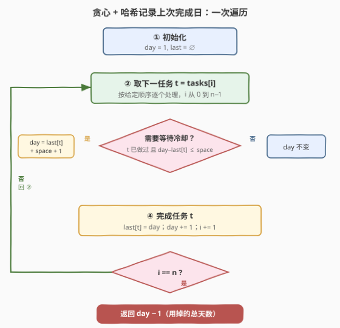

# 任务调度器 II

- **题目名称**：任务调度器 II
- **链接**：[2365. 任务调度器 II](https://leetcode.cn/problems/task-scheduler-ii/)
- **难度**：中等
- **标签**：数组、哈希表、模拟、贪心

## 1. 题目概述

给你一个下标从 $0$ 开始的正整数数组 `tasks`，表示需要**按顺序**完成的任务，其中 `tasks[i]` 表示第 $i$ 件任务的**类型**。同时给你一个正整数 `space`，表示一个任务完成**后**，另一个**相同**类型任务完成前需要间隔的**最少**天数。

在所有任务完成前的每一天，你必须进行以下两种操作之一：

- 完成 `tasks` 中的下一个任务；
- 休息一天。

请你返回完成所有任务所需的**最少**天数。

**示例 1**：

```text
输入：tasks = [1,2,1,2,3,1], space = 3
输出：9
解释：
9 天完成所有任务的一种方法是：
第 1 天：完成任务 0。
第 2 天：完成任务 1。
第 3 天：休息。
第 4 天：休息。
第 5 天：完成任务 2。
第 6 天：完成任务 3。
第 7 天：休息。
第 8 天：完成任务 4。
第 9 天：完成任务 5。
可以证明无法少于 9 天完成所有任务。
```

**示例 2**：

```text
输入：tasks = [5,8,8,5], space = 2
输出：6
解释：
第 1 天：完成任务 0。
第 2 天：完成任务 1。
第 3 天：休息。
第 4 天：休息。
第 5 天：完成任务 2。
第 6 天：完成任务 3。
```

**约束条件**：

- $1 \le \text{tasks.length} \le 10^5$
- $1 \le \text{tasks[i]} \le 10^9$
- $1 \le \text{space} \le \text{tasks.length}$

> 💡 **关键观察**：任务**顺序固定**，且每天要么做下一个、要么休息。要使总天数最少，唯一合理的策略就是「**能做就立刻做**」——把每个任务安排到它**最早合法**的那一天。真正会被迫休息的，只有「下一个任务与它上一次完成间隔不足 `space` 天」这一种情形。于是我们不逐日模拟休息，而是直接算出下一个任务最早能落在哪一天，把 $O(\text{答案})$ 压成 $O(n)$。

---

## 2. 解题思路

### 2.1 暴力思路：逐日模拟

最直白的做法是把日历一天一天推过去：维护当前天数 `cur`、任务指针 `i`、以及每种类型**上次完成的日期** `last[t]`。每天判断：若 `tasks[i]` 从未做过，或 `cur - last[tasks[i]] > space`，就做掉它（`last[t]=cur`、`i++`）；否则这天只能休息。`cur` 自增，直到 `i == n`。

```text
cur = 1, i = 0
while i < n:
    t = tasks[i]
    if t 未做过 or cur - last[t] > space:
        last[t] = cur; i += 1
    cur += 1
return cur - 1
```

正确性没问题，但复杂度是 $O(\text{总天数})$。最坏情形（任务全同类型、`space = n`）总天数约 $1 + (n-1)\times(\text{space}+1) \approx 10^{10}$，逐日推会 **TLE**。浪费的根源是「明知道要休息 `k` 天，却一天一天地空耗着数」。

> ⚠️ 当下一个任务被冷却卡住时，它**最早能做的那一天是确定的**——`last[t] + space + 1`。既然终点已知，就无需逐日挪动，直接跳过去即可。

### 2.2 核心观察：贪心 + 哈希记录上次完成日

![冷却规则：同类任务之间至少间隔 space 天，最早可做日 = last[t] + space + 1](../images/2365_cooldown_concept.svg)

**核心思路**：用一个变量 `day` 表示「下一个任务**将要**被完成的日子」（1-indexed），用一个哈希表 `last` 记录每种类型**上一次完成的日期**。按顺序处理每个任务 $t$：

1. 若 $t$ 之前做过，且 `day - last[t] <= space`（间隔不足），则 $t$ 必须等到冷却结束：`day = last[t] + space + 1`；
2. 否则 `day` 不动，$t$ 就在当天完成；
3. 落定：`last[t] = day`，然后 `day += 1`（推进到下一天，准备接下一个任务）。

处理完 $n$ 个任务后，最后一个完成的日子就是 `day - 1`。

> 💡 **为什么贪心最优？** 任务顺序固定，各类型之间互不约束（冷却只在**同类型**之间生效）。把任意一个任务**提前**到它的最早合法日，绝不会让后续任务变晚——后续任务只受「与自己同类型的前一次」约束，而你把它前驱提前只会让它的约束更早满足（或不变），不会变晚。于是「逐个安排到最早合法日」对每个任务都是局部最优，且不损害全局，交换论证即得全局最优。多余休息只能平移推迟，毫无收益。

> ⚠️ 注意判定条件用的是 `<=` 而非 `<`：`space` 是「完成后到下一个同类完成前**间隔**的最少天数」。若上次在 `last[t]` 完成，中间需隔满 `space` 天（即 `last[t]+1 … last[t]+space` 这些天都不能做同类），故下一个同类最早可做日是 `last[t] + space + 1`。等价地，当下一个打算落在 `day` 时，要求 `day - last[t] > space`；否则就跳到 `last[t] + space + 1`。

### 2.3 算法流程图



单重循环，每个任务处理一次，每次 $O(1)$（一次哈希查询 + 一次写入），冷却等待用公式一步跳过，不再逐日推。

### 2.4 示例演算

![示例 1 演算：tasks=[1,2,1,2,3,1], space=3 逐步执行](../images/2365_example_walkthrough.svg)

以示例 1 `tasks=[1,2,1,2,3,1]`、`space=3` 为例，`day` 初值 $1$、`last` 为空：

| 步 | 任务 $t$ | 进入时 day | 判定（space=3） | 完成日 | last 更新 / day→ |
|----|----------|-----------|----------------|--------|------------------|
| 1 | 1 | 1 | 新任务（无 last） | 1 | last[1]=1；day→2 |
| 2 | 2 | 2 | 新任务（无 last） | 2 | last[2]=2；day→3 |
| 3 | 1 | 3 | $3-1=2\le3$，跳到 $1+3+1=5$ | 5 | last[1]=5；day→6 |
| 4 | 2 | 6 | $6-2=4>3$，直接做 | 6 | last[2]=6；day→7 |
| 5 | 3 | 7 | 新任务（无 last） | 7 | last[3]=7；day→8 |
| 6 | 1 | 8 | $8-5=3\le3$，跳到 $5+3+1=9$ | 9 | last[1]=9；day→10 |

返回 `day - 1 = 10 - 1 = 9` ✓。

> 💡 **示例 2 为何是 6**：`tasks=[5,8,8,5]`、`space=2`。`day=1` 做 5（last[5]=1，day→2）；`day=2` 做 8（last[8]=2，day→3）；第三个是 8，`3-2=1≤2` 跳到 `2+2+1=5`，做 8（last[8]=5，day→6）；第四个是 5，`6-1=5>2` 直接做在 6（last[5]=6）。返回 `6` ✓。

---

## 3. 参考代码

### C++

```cpp
class Solution {
public:
    long long taskSchedulerII(vector<int>& tasks, int space) {
        unordered_map<int, long long> last;   // 类型 -> 上次完成日（1-indexed）
        long long day = 1;                    // 下一个任务将要被完成的日子
        for (int t : tasks) {
            auto it = last.find(t);
            if (it != last.end() && day - it->second <= space) {
                day = it->second + space + 1; // 跳过所有被迫休息的天
            }
            last[t] = day;                    // 落定
            day += 1;                         // 推进到下一天
        }
        return day - 1;                       // 最后一个任务完成的日子
    }
};
```

> ⚠️ **必须用 `long long`**：最坏情形（全同类型、`space = n = 10^5`）答案约 $1 + (n-1)\times(\text{space}+1) \approx 10^{10}$，已超 32 位 `int` 上限 $\approx 2.1\times10^9$，用 `int` 会溢出。`last` 的值类型也跟着用 `long long`。`tasks[i]` 可达 $10^9$，故用 `unordered_map` 而非数组。

### Python

```python
class Solution:
    def taskSchedulerII(self, tasks: List[int], space: int) -> int:
        last = {}                 # 类型 -> 上次完成日（1-indexed）
        day = 1                   # 下一个任务将要被完成的日子
        for t in tasks:
            if t in last and day - last[t] <= space:
                day = last[t] + space + 1   # 跳过所有被迫休息的天
            last[t] = day                   # 落定
            day += 1                         # 推进到下一天
        return day - 1                       # 最后一个任务完成的日子
```

> 💡 Python 整数天然不溢出，无需类型顾虑；`dict` 的查询/写入均摊 $O(1)$。

---

## 4. 复杂度分析

| 维度 | 复杂度 | 说明 |
|------|--------|------|
| **时间复杂度** | $O(n)$ | 单遍扫描，每个任务一次哈希查询 + 一次写入，均摊 $O(1)$；冷却等待用公式 $O(1)$ 跳过，不逐日推 |
| **空间复杂度** | $O(n)$ | `last` 最多存 $\min(\text{不同类型数}, n)$ 项，上界 $O(n)$ |
| 对照：逐日模拟 | $O(\text{答案})$ / $O(n)$ | 正确但最坏 $\approx 10^{10}$ 步，TLE；空间相同 |

> 💡 暴力 $O(\text{答案})$ 与本解 $O(n)$ 的差距，源于把「逐日空耗着数休息」重写成「直接跳到冷却结束日」。因为下一个任务最早合法日由 `last[t] + space + 1` 唯一确定，中间的休息天无需逐个经历。

---

## 5. 扩展：贪心正确性的交换论证

「能做就立刻做」为何最优？给出任意一个最优调度，按下标顺序考察每个任务，若它没被安排在**最早合法日**，就把它（连同其后的同类型后续）整体前移到最早合法日：

- **不同类型**之间没有冷却约束，前移某任务不影响其它类型任务的合法性；
- **同类型**后续任务只受「它的前一次完成日」约束。把前驱前移后，`last` 变小，后续的 `last[t] + space + 1` 也只可能变小或不变，于是后续同样能前移（或保持原位），不会变晚。

如此反复，任何最优调度都能被改造成「每个任务都在最早合法日」的贪心调度，且总天数**不增**。故贪心解即全局最优。

> 💡 这与 [621. 任务调度器](https://leetcode.cn/problems/task-scheduler/) 形成对照：621 是「**顺序自由**、求最短排程」的贪心（按剩余次数最多的类型轮转，用 `max` 公式一步算出），而 2365 是「**顺序固定**、求最短完成日」的模拟（按序处理 + 跳过冷却）。两者都叫「任务调度器」，模型却相反——一个最大化重排自由度，一个完全无重排自由度。

---

## 6. 面试要点

1. **为什么不用逐日模拟？复杂度差在哪？**

   > 逐日模拟是 $O(\text{总天数})$，最坏 $\approx 10^{10}$，必 TLE。根因是「知道要休息 $k$ 天还一天一天数」。下一个同类任务最早合法日由 `last[t] + space + 1` 唯一确定，用公式 $O(1)$ 跳过去即可，复杂度降到 $O(n)$。

2. **判定条件为什么是 `day - last[t] <= space` 用 `<=` 而非 `<`？**

   > `space` 是「完成后到下一个同类完成前**间隔**的最少天数」。上次在 `last[t]` 完成，则 `last[t]+1 … last[t]+space` 这些天都不能做同类（共 `space` 天间隔），下一个最早在 `last[t]+space+1`。所以当下一个打算落在 `day` 时，合法要求 `day - last[t] > space`；不满足（即 `<=`）就跳到 `last[t]+space+1`。边界极易写反，建议用一个小例子（如 `tasks=[1,1], space=1`，答案应为 3：第1天做、第2天休、第3天做）校准。

3. **为什么用哈希表而不是数组存 `last`？**

   > `tasks[i]` 可达 $10^9$，做数组下标既开不出也浪费。类型只是「身份」、值大小无关，用 `unordered_map` / `dict` 按值映射即可，均摊 $O(1)$。若题面把类型限到 $1\sim n$，则可用数组进一步压常数。

4. **C++ 为什么必须 `long long`？**

   > 最坏情形全同类型、`space = n = 10^5`：第 $k$ 个任务完成日约 $1 + (k-1)\times(\text{space}+1)$，最后一个约 $1 + (n-1)\times(\text{space}+1) \approx 10^{10}$，远超 `int` 上限 $\approx 2.1\times10^9$。`day` 与 `last` 的值类型都要升到 `long long`。

5. **贪心为什么最优？能简单说清吗？**

   > 任务顺序固定、冷却只在同类型间生效。把任一任务提前到它的最早合法日，不影响其它类型；对同类型后续，前驱提前只会让其约束更早满足（`last[t]+space+1` 只减不增），后续也能跟着提前或不动。故任何最优解都能被改造成贪心解且总天数不增——交换论证即得最优。

> 💡 **一句话总结**：2365 是「顺序固定的任务调度」——按序处理，哈希记下每种类型上次完成日，遇冷却违规直接 `day = last[t] + space + 1` 跳过休息，一次 $O(n)$ 算出总天数，注意 C++ 用 `long long` 防溢出。

---

## 7. 同类练习题

- [621. 任务调度器](https://leetcode.cn/problems/task-scheduler/)：同名对照题——**顺序自由**求最短排程（按剩余次数轮转 + 公式法），体会「重排自由度最大化」与本题「无重排自由度」两个相反模型
- [2071. 你可以安排的最多任务数目](https://leetcode.cn/problems/maximum-number-of-tasks-you-can-assign/)：任务调度 + 二分答案，对照本题「顺序固定、求总天数」与「选任务、求最多可做数」的调度变体
- [1662. 检查两个字符串数组是否相等](https://leetcode.cn/problems/check-if-two-string-arrays-are-equivalent/)：同目录的按序模拟入门题，体会「顺序固定、逐项处理」的基础范式（非调度但同「按序」骨架）
- [219. 存在重复元素 II](https://leetcode.cn/problems/contains-duplicate-ii/)：哈希记录上次出现下标 + 间隔约束 `abs(i-j) <= k`，与本题「记录上次完成日 + 间隔 `space`」同是「哈希存历史 + 查间隔」范式
- [1700. 做菜顺序的索引](https://leetcode.cn/problems/number-of-students-unable-to-eat-lunch/)：队列模拟逐个处理 + 状态轮转，对照本题「逐个任务 + 跳过冷却」的模拟调度骨架
