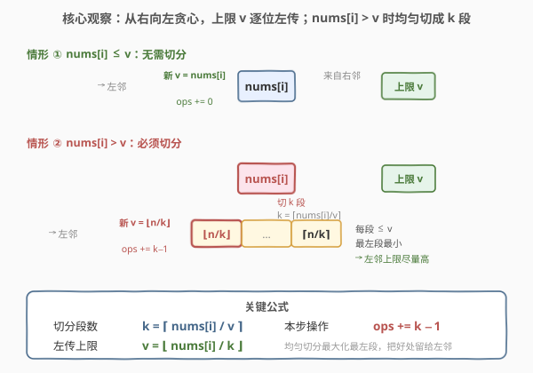
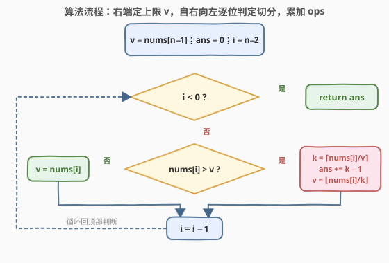
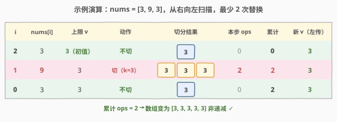

# LeetCode 将数组排序的最少替换次数 题解

## 1. 题目概述

- **标题 / 题号**：将数组排序的最少替换次数（#2366，hard）
- **链接**：https://leetcode.cn/problems/minimum-replacements-to-sort-the-array/
- **难度**：困难
- **标签**：贪心、数组、数学

**题意**：给你一个下标从 **0** 开始的整数数组 `nums`。每次操作中，你可以将数组中**任何一个元素**替换为**任意两个**和为该元素的数字。

- 例如 `nums = [5,6,7]`，一次操作可将 `nums[1]` 替换成 `2` 和 `4`，数组变为 `[5,2,4,7]`。

请执行上述操作，将数组变成元素按 **非递减** 顺序排列的数组，返回所需的**最少**操作次数。

**示例 1**：

```text
输入：nums = [3,9,3]
输出：2
解释：
  [3,9,3]，将 9 变成 3 和 6，得到 [3,3,6,3]
  [3,3,6,3]，将 6 变成 3 和 3，得到 [3,3,3,3,3]
  总共需要 2 步将数组变成非递减有序，返回 2。
```

**示例 2**：

```text
输入：nums = [1,2,3,4,5]
输出：0
解释：数组已是非递减顺序，无需任何操作。
```

**约束**：

- $1 \le \text{nums.length} \le 10^5$
- $1 \le \text{nums}[i] \le 10^9$

> 💡 **关键约束**：$n$ 与值域都很大（$10^5$ / $10^9$），$O(n^2)$ 模拟或基于"末段值"的 DP 都不可行；必须找到 $O(n)$ 的贪心。此外累计操作数可达 $\sim 10^{14}$ 量级，**必须用 64 位整数**，且中途 `cur + v` 也会逼近 `int` 上界。

## 2. 解题思路

### 2.1 暴力思路：从左向右修

最直白的想法是"从左向右"逐个修：遇到 `nums[i] < nums[i-1]` 就把 `nums[i-1]` 拆开。但每次拆会让数组变长、且拆法众多（拆成哪两个、各自多大），搜索空间巨大。换用 DP 记录"以 $i$ 结尾、末段值为 $x$ 的最小操作数"——状态 $(i, x)$ 中 $x$ 取值连续且高达 $10^9$，状态数爆炸。

> ⚠️ 从左向右的困难在于：当前元素该拆成什么，依赖**右侧还没确定**的值，缺乏"局部最优即全局最优"的结构。突破口是把视角掉转——**从右向左**处理，让"右侧已是非递减"成为不变式，于是每个元素只面对一个确定的"上限 $v$"。

### 2.2 核心观察：从右向左贪心 + 均匀切分



设从右向左扫描，记 $v$ 为"当前元素（及切分后所有片段）必须 $\le$ 的上限"，初值 $v = \text{nums}[n-1]$（最右端无需切分，它自己就是右侧天花板）。对每个 $\text{nums}[i]$（$i$ 从 $n-2$ 到 $0$）：

**① 若 $\text{nums}[i] \le v$**：无需切分。它本身已满足 $\le v$，且保持原值能让左邻享受**最高**上限（切只会让片段更小）。于是新上限 $v = \text{nums}[i]$，操作数 $+0$。

**② 若 $\text{nums}[i] > v$**：必须切。要把它拆成若干片段，每片 $\le v$ 且总和 $= \text{nums}[i]$。最少片段数 $k = \lceil \text{nums}[i] / v \rceil$（因 $k$ 片每片至多 $v$，需 $k \cdot v \ge \text{nums}[i]$）。为让**左邻上限尽量高**，应把 $\text{nums}[i]$ **均匀**切成 $k$ 片：每片为 $\lfloor \text{nums}[i]/k \rfloor$ 或 $\lceil \text{nums}[i]/k \rceil$，均 $\le v$。按非递减排列后，**最左片**（最小值）$\lfloor \text{nums}[i]/k \rfloor$ 成为传给左邻的新上限。本步操作数 $= k - 1$（把 $1$ 个拆成 $k$ 个需 $k-1$ 次）。

> 💡 **为何均匀切分最优**：在 $k$ 片总和固定为 $\text{nums}[i]$ 且每片 $\le v$ 的前提下，均匀分配能**最大化最小片**（$\max \min = \lfloor \text{nums}[i]/k \rfloor$）。最小片越大，传给左邻的上限 $v$ 越高，左邻越不容易超限、越少切分——这是贪心"把好处留给后面"的体现。

### 2.3 算法流程图



### 2.4 示例演算

以 `nums = [3,9,3]` 为例，从右向左扫描：



| $i$ | nums[i] | 上限 $v$（来自右） | 动作 | $k$ | 切分结果 | 本步 ops | 累计 ops | 新 $v$（左传） |
|-----|---------|--------------------|------|-----|----------|----------|----------|----------------|
| 2 | 3 | 3（初值） | 不切 | 1 | [3] | 0 | 0 | 3 |
| 1 | 9 | 3 | 切（9 > 3） | $\lceil 9/3\rceil=3$ | [3, 3, 3] | 2 | 2 | $\lfloor 9/3\rfloor=3$ |
| 0 | 3 | 3 | 不切 | 1 | [3] | 0 | 2 | 3 |

最终累计 $\text{ops} = 2$，数组变为 `[3, 3, 3, 3, 3]` 非递减，与示例输出一致。

## 3. 参考代码

### C++

```cpp
class Solution {
public:
    long long minimumReplacement(vector<int>& nums) {
        long long ans = 0;
        int n = nums.size();
        long long v = nums[n - 1];               // 右端天花板，无需切分
        for (int i = n - 2; i >= 0; --i) {
            long long cur = nums[i];
            if (cur > v) {
                long long k = (cur + v - 1) / v; // ceil(cur / v)：最少片段数
                ans += k - 1;                     // 拆成 k 段需 k-1 次
                v = cur / k;                      // 均匀切分，最左段 = floor(cur/k)
            } else {
                v = cur;                          // 不切，原值成为新上限
            }
        }
        return ans;
    }
};
```

> ⚠️ **溢出要点**：`cur + v - 1` 中 `cur`、`v` 均 $\le 10^9$，相加可达 $\sim 2\times 10^9$，逼近并可能超过 `int`（$\sim 2.1\times 10^9$）上界，故 `cur`、`v`、`k` 都用 `long long`；`ans` 累计可达 $\sim 10^{14}$（$n=10^5$、每元素最坏拆 $\sim 10^9$ 次），同样必须 `long long`。

### Python

```python
class Solution:
    def minimumReplacement(self, nums: List[int]) -> int:
        ans = 0
        v = nums[-1]                         # 右端天花板
        for i in range(len(nums) - 2, -1, -1):
            cur = nums[i]
            if cur > v:
                k = (cur + v - 1) // v       # ceil(cur / v)
                ans += k - 1
                v = cur // k                 # 均匀切分，最左段
            else:
                v = cur
        return ans
```

> 💡 Python 整数无溢出，写法更直接；`(cur + v - 1) // v` 是经典的向上取整除法。注意遍历用 `range(len-2, -1, -1)` 实现 $i$ 从 $n-2$ 递减到 $0$。

## 4. 复杂度分析

| 维度 | 复杂度 | 说明 |
|------|--------|------|
| **时间复杂度** | $O(n)$ | 自右向左单次遍历，每个元素 $O(1)$（用除法直接算 $k$，不逐片模拟） |
| **空间复杂度** | $O(1)$ | 只用常数个变量 `v`、`ans`、`k`、`cur`，原地处理 |

## 5. 扩展：正确性证明与均匀切分的最优性

### 5.1 贪心选择性质（为何不切则不切）

当 $\text{nums}[i] \le v$ 时，若仍强行切分成 $k \ge 2$ 片，则每片 $\le \text{nums}[i]$（因总和 $= \text{nums}[i]$），传给左邻的新上限 $\le \text{nums}[i]$，**严格不优于**不切时的 $v = \text{nums}[i]$，且白白多花 $k-1 \ge 1$ 次操作。故不切严格更优。

### 5.2 最少片段数 $k = \lceil \text{nums}[i]/v \rceil$

要把 $\text{nums}[i]$ 拆成 $k$ 片、每片 $\le v$，需 $k \cdot v \ge \text{nums}[i]$，即 $k \ge \text{nums}[i]/v$，最小整数 $k = \lceil \text{nums}[i]/v \rceil$。少于这个数则即便每片都顶满 $v$ 也凑不够总和。

### 5.3 均匀切分最大化最小片（交换论证）

设总和 $S = \text{nums}[i]$，片数 $k$ 固定。若存在两片 $a \le b$ 且 $b - a \ge 2$，则把它们调整为 $a+1, b-1$（总和不变、仍 $\le v$，因为 $b \le v \Rightarrow b-1 < v$），最小片从 $a$ 升到 $a+1$。反复"削峰填谷"直到任意两片之差 $\le 1$，即得均匀分布：最小片 $= \lfloor S/k \rfloor$，最大片 $= \lceil S/k \rceil \le v$。因此传给左邻的上限恰为 $\lfloor S/k \rfloor$，是该 $k$ 下可能的最大值。

### 5.4 为何最大化"传左上限"即全局最优（最优子结构）

从右向左，已处理部分（$i$ 右侧）已是定局，唯一影响左侧未来代价的是**传给 $i$ 左邻的上限 $v$**。$v$ 越大，左邻越可能"不切"或"切更少段"。每一步在"本步代价最小"与"传左上限最大"上同时取等号——前者由 $k=\lceil\cdot\rceil$ 保证（最少片段），后者由均匀切分保证。于是局部最优解组合成全局最优解，贪心得证。

> 💡 **抽象经验**：凡是"拆分/合并使序列单调"且操作有"方向性约束"的题，优先考虑**逆向扫描 + 上限传递**——把"未来约束"固化成一个标量 $v$ 逐位前传，每步在该标量下取局部最优，往往能把指数级搜索压成 $O(n)$。

## 6. 面试要点

1. **为什么从右向左而不是从左向右？**

   - 从左向右时，当前元素该拆成什么依赖**右侧尚未确定**的值，状态爆炸。从右向左把"右侧已非递减"做成不变式，每个元素只面对一个确定的上限 $v$，局部决策即全局最优——这是把"双向耦合"降为"单向传递"的关键。

2. **$k = \lceil \text{nums}[i]/v \rceil$ 是怎么来的？为什么是最少片段数？**

   - 要把 $\text{nums}[i]$ 拆成 $k$ 片、每片 $\le v$，最大可能总和是 $k\cdot v$，需 $k\cdot v \ge \text{nums}[i]$，故 $k \ge \text{nums}[i]/v$，最小整数 $k = \lceil \text{nums}[i]/v \rceil$。每拆一次多一片，故操作数 $= k-1$。

3. **为什么切分要"均匀"？最左段为什么是 $\lfloor \text{nums}[i]/k \rfloor$？**

   - 均匀切分（任意两片之差 $\le 1$）能在"总和固定、每片 $\le v$"下**最大化最小片**（交换论证：差 $\ge 2$ 的两片可削峰填谷升最小片）。均匀分布后最小片 $= \lfloor S/k \rfloor$，最大片 $= \lceil S/k \rceil \le v$。按非递减排列，最左片 $=$ 最小片 $= \lfloor S/k \rfloor$，它成为传给左邻的新上限。

4. **不切的情况为什么直接 $v = \text{nums}[i]$，不再切小一点帮左邻？**

   - 切只会让片段 $\le \text{nums}[i]$，传左上限 $\le \text{nums}[i]$，严格不优于不切的 $\text{nums}[i]$，还白花操作。故 $\text{nums}[i] \le v$ 时必不切。

5. **溢出要注意什么？**

   - `cur + v - 1` 可达 $\sim 2\times 10^9$ 超 `int` 上界，故 `cur`/`v`/`k` 用 `long long`；`ans` 累计可达 $\sim 10^{14}$（$n=10^5$，每元素最坏拆 $\sim 10^9$ 次），也必须 `long long`。Python 无此问题。

> 💡 **一句话总结**：从右向左扫，上限 $v$ 逐位左传；$\text{nums}[i] \le v$ 不切、$v = \text{nums}[i]$，否则均匀切成 $k=\lceil \text{nums}[i]/v \rceil$ 片、$\text{ans} \mathrel{+}= k-1$、$v = \lfloor \text{nums}[i]/k \rfloor$，全程 $O(n)$。

## 同类练习题

| # | 题目 | 与本题的关联 |
|---|------|-------------|
| 410 | [分割数组的最大值](https://leetcode.cn/problems/split-array-largest-sum/) | 给定段数求"最大段和最小化"（二分答案），与本题"给定上限求最少段数"是一对**对偶**问题，同一套"给定上限贪心数段数"的判定原语 |
| 1011 | [在 D 天内送达包裹的能力](https://leetcode.cn/problems/capacity-to-ship-packages-within-d-days/)（[题解](../1001-1100/1011_在D天内送达包裹的能力.md)） | 二分运载能力 + 贪心数所需天数，可行性函数与本题"给定 $v$ 数片段"同构 |
| 2244 | [完成所有任务需要的最少轮数](https://leetcode.cn/problems/minimum-rounds-to-complete-all-tasks/) | 把每个任务计数拆成 $2$ 或 $3$ 的和求最少份数，与本题"把数拆成有界片段求最少片段数"同源贪心 |
| 2139 | [得到目标值的最少行动次数](https://leetcode.cn/problems/minimum-moves-to-reach-target-score/) | 从目标倒推到 $1$ 的逆向贪心（偶则除、奇则减），与本题"逆向扫描 + 每步局部最优"同思想 |
