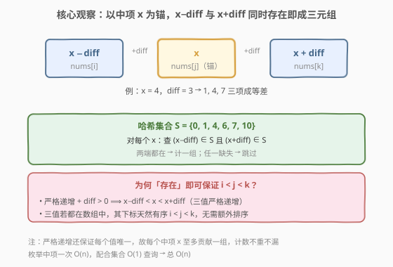
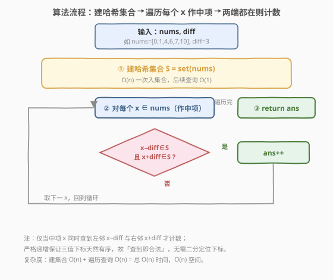

# 等差三元组的数目

- **题目名称**：等差三元组的数目
- **链接**：[2367. 等差三元组的数目](https://leetcode.cn/problems/number-of-arithmetic-triplets/)
- **难度**：简单
- **标签**：数组、哈希表、枚举

## 1. 题目概述

给你一个下标从 **0** 开始、**严格递增** 的整数数组 `nums` 和一个正整数 `diff`。若三元组 `(i, j, k)` 满足：

- $i < j < k$，
- $\text{nums}[j] - \text{nums}[i] = \text{diff}$，且
- $\text{nums}[k] - \text{nums}[j] = \text{diff}$，

则称其为 **等差三元组**。返回不同等差三元组的数目。

**示例 1**：

```text
输入：nums = [0,1,4,6,7,10], diff = 3
输出：2
解释：
(1, 2, 4) 是等差三元组：nums[2]−nums[1]=4−1=3，nums[4]−nums[2]=7−4=3。
(2, 4, 5) 是等差三元组：nums[4]−nums[2]=7−4=3，nums[5]−nums[4]=10−7=3。
```

**示例 2**：

```text
输入：nums = [4,5,6,7,8,9], diff = 2
输出：2
解释：
(0, 2, 4)：nums[2]−nums[0]=6−4=2，nums[4]−nums[2]=8−6=2。
(1, 3, 5)：nums[3]−nums[1]=7−5=2，nums[5]−nums[3]=9−7=2。
```

**约束条件**：

- $3 \le \text{nums.length} \le 200$
- $0 \le \text{nums}[i] \le 200$
- $1 \le \text{diff} \le 50$
- `nums` **严格** 递增。

> 💡 **关键观察**：两个等式合起来等价于 $\text{nums}[i], \text{nums}[j], \text{nums}[k]$ 构成公差为 $\text{diff}$ 的三项等差数列——即 $\text{nums}[j] = x$，则 $\text{nums}[i] = x - \text{diff}$、$\text{nums}[k] = x + \text{diff}$。**中项 $x$ 一旦确定，两端值就唯一确定**，只需查它们在不在数组里。

---

## 2. 解题思路

### 2.1 暴力思路：三重循环枚举

最直白的做法是**忠实枚举所有 $(i, j, k)$ 组合**：

```text
ans = 0
for i in range(n):
    for j in range(i+1, n):
        for k in range(j+1, n):
            if nums[j]-nums[i]==diff and nums[k]-nums[j]==diff:
                ans += 1
return ans
```

$n \le 200$，三重循环约 $\binom{200}{3} \approx 1.3\times10^6$ 量级，能 AC。但它把「值」与「下标」绑死——明明只需关心三个值是否都存在，却遍历了所有下标三元组，重复劳动。

> ⚠️ 暴力法把判定拆成两步独立比较，没注意到：**只要中项 $x$ 和两端值 $x\pm\text{diff}$ 都在数组里，就一定存在合法下标 $i<j<k$**（严格递增保证）。于是可跳过下标枚举，直接查值的存在性。

### 2.2 核心观察：以中项 $x$ 为锚 + 哈希集合 $O(1)$ 查询



把两个等式改写为对**中项** $x = \text{nums}[j]$ 的约束：

$$
\text{nums}[i] = x - \text{diff}, \qquad \text{nums}[k] = x + \text{diff}
$$

于是判定一组三元组只需回答一个问题：**$x - \text{diff}$ 和 $x + \text{diff}$ 是否都在数组中？** 用一个哈希集合 $S$ 存下所有值，每个 $x$ 两次 $O(1)$ 查询即可定论：

$$
\text{ans} = \sum_{x \in \text{nums}} \mathbb{1}\big[\, (x - \text{diff}) \in S \,\land\, (x + \text{diff}) \in S \,\big]
$$

> 💡 **为什么「查到值」就等于「存在合法下标」？** 数组**严格递增**且 $\text{diff} > 0$，故 $x - \text{diff} < x < x + \text{diff}$ 三值严格递增；若三者都在数组中，它们的出现顺序必然是 $i < j < k$。同时严格递增意味着每个值唯一，所以每个中项 $x$ 至多贡献一组，**计数不重不漏**，无需去重、无需二分定位下标。

> ⚠️ 若数组允许重复或非有序，「存在」就不再蕴含下标顺序，需改用三指针或「值→下标」映射处理——本题的严格递增恰好免去了这一切。

### 2.3 算法流程图



两阶段：① 一次遍历把所有值入集合 $S$（$O(n)$）；② 再遍历每个 $x$ 作中项，两次集合查询判定，命中则 `ans++`。建集合与查询分离，循环体里只有 $O(1)$ 操作。

### 2.4 示例演算

![示例演算：nums=[0,1,4,6,7,10], diff=3，逐中项查两端](../images/arith_triplets_example_walkthrough.svg)

对示例 1 逐中项核对（$S = \{0,1,4,6,7,10\}$，$\text{diff}=3$）：

| 中项 $x$ | $x-3 \in S?$ | $x+3 \in S?$ | 贡献 |
|----------|--------------|--------------|------|
| 0 | $-3$ ✗ | $3$ ✗ | 0 |
| 1 | $-2$ ✗ | $4$ ✓ | 0（缺左邻） |
| **4** | $1$ ✓ | $7$ ✓ | **+1 → (1,4,7)** |
| 6 | $3$ ✗ | $9$ ✗ | 0 |
| **7** | $4$ ✓ | $10$ ✓ | **+1 → (4,7,10)** |
| 10 | $7$ ✓ | $13$ ✗ | 0（缺右邻） |

合计 $2$ 组。注意 $x=1$ 虽右邻 $4$ 在 $S$，但左邻 $-2$ 不在，**缺一不可**；$x=10$ 同理左邻在而右邻 $13$ 不在。

---

## 3. 参考代码

### C++

```cpp
class Solution {
public:
    int arithmeticTriplets(vector<int>& nums, int diff) {
        unordered_set<int> s(nums.begin(), nums.end());
        int ans = 0;
        for (int x : nums) {
            if (s.count(x - diff) && s.count(x + diff)) {
                ++ans;
            }
        }
        return ans;
    }
};
```

> 💡 用 `unordered_set` 一次构造存全部值，遍历时以中项 $x$ 为锚两次 `count` 查询。值域仅 $0\sim200$，哈希常数可忽略；若想消除哈希开销，可改用 `bool present[201]` 数组（见第 5 节）。

### Python

```python
class Solution:
    def arithmeticTriplets(self, nums: List[int], diff: int) -> int:
        s = set(nums)
        return sum((x - diff in s) and (x + diff in s) for x in nums)
```

> 💡 `set(nums)` 一次入集合，生成器表达式对每个 $x$ 做两次 `in` 判定后求和。`and` 短路：左邻不在便不查右邻。$n \le 200$，整体 $O(n)$ 清爽可读。

---

## 4. 复杂度分析

| 维度 | 复杂度 | 说明 |
|------|--------|------|
| **时间复杂度** | $O(n)$ | 建集合 $O(n)$；遍历每个 $x$ 做两次 $O(1)$ 哈希查询，合计 $O(n)$ |
| **空间复杂度** | $O(n)$ | 哈希集合存全部 $n$ 个值 |

> 💡 本题 $n \le 200$、值域 $\le 200$ 均为小常数，渐近 $O(n)$ 在实测中近常数。若推广到大 $n$、大值域，哈希集合仍是 $O(n)$ 时间 / $O(n)$ 空间；若值域仍很小，可用布尔数组把空间压到 $O(V)$（$V$ 为值域大小）。

---

## 5. 扩展：值域布尔数组与三指针

### 5.1 值域布尔数组（$O(n)$ / $O(V)$）

值域仅 $0 \sim 200$，可用定长布尔数组代替哈希集合，消除哈希开销、查询严格 $O(1)$：

```cpp
int arithmeticTriplets(vector<int>& nums, int diff) {
    bool present[201] = {false};
    for (int v : nums) present[v] = true;
    int ans = 0;
    for (int x : nums)
        if (x - diff >= 0 && x + diff <= 200
            && present[x - diff] && present[x + diff]) ++ans;
    return ans;
}
```

甚至可直接遍历值域 $v \in [\text{diff},\, 200-\text{diff}]$，对每个 $v$ 检查 $v-\text{diff}, v, v+\text{diff}$ 三桶是否全真——$O(V) = O(201) = O(1)$（不含建桶），适合值域更小、$n$ 更大的场景。这与 [2347. 最好的扑克手牌](./2347_最好的扑克手牌.md) 用定长数组当哈希同出一辙。

### 5.2 三指针 / 二分

数组有序，也可对每个 $i$ 用二分找 $\text{nums}[i] + \text{diff}$ 与 $\text{nums}[i] + 2\text{diff}$，或用三指针（$i$ 推进时 $j, k$ 单调不退）一次性扫完，$O(n)$ 或 $O(n\log n)$。但哈希集合写法更简洁、常数更小，且本题 $n$ 极小，三指针的「单调性」优势无从发挥。

---

## 6. 面试要点

1. **为什么以「中项 $x$」为锚，而不是枚举 $i$ 或 $k$？**

   > 中项 $x$ 同时约束两端：$\text{nums}[i] = x - \text{diff}$、$\text{nums}[k] = x + \text{diff}$，一次定下两个伙伴值，两次查询即可判一组。若枚举 $i$，还需再找 $j$、$k$ 两步；枚举中项把「两步搜索」压成「两次查表」，且天然对应「中间项」的几何对称性。

2. **「严格递增」这个条件为什么必需？能去掉吗？**

   > 严格递增 + $\text{diff} > 0$ 保证 $x - \text{diff} < x < x + \text{diff}$，三值若都在数组中则下标天然有序 $i < j < k$，故「查到值」就等于「存在合法下标」。若去掉严格递增（允许重复或乱序），存在性不再蕴含下标顺序，需用「值→下标列表」或三指针处理重复，计数会变复杂——本题的条件正是为了让「查表」范式成立。

3. **能否用三指针做到 $O(n)$？**

   > 能。数组有序，对每个 $i$ 维护 $j$（首个 $\text{nums}[j] = \text{nums}[i] + \text{diff}$）与 $k$（首个 $\text{nums}[k] = \text{nums}[j] + \text{diff}$），$i$ 推进时 $j, k$ 单调不退，总移动 $O(n)$。但写法比哈希集合繁琐，且本题 $n \le 200$ 优势无从体现；哈希集合更简洁、常数更小。

4. **值域只有 $0 \sim 200$，有什么具体优化？**

   > 用 `bool present[201]` 代替哈希集合：查询严格 $O(1)$、无哈希/再哈希开销、缓存友好。甚至可只遍历值域 $v \in [\text{diff}, 200-\text{diff}]$ 计数，建桶后 $O(V)=O(201)$ 即出答案。值域小是「定长数组当哈希」的甜区。

5. **如果数组不严格递增（允许重复值）会怎样？**

   > 同一值 $x$ 可能出现多次，每个中项实例的左右邻下标需逐一配对，单靠集合存在性无法区分「哪个 $x$ 配哪个 $i, k$」。需退化为三指针或「值→下标列表」枚举，计数逻辑显著复杂化。本题严格递增保证值唯一，正是规避了该情况。

> 💡 **一句话总结**：把两个等式改写成对中项 $x$ 的约束——$\text{nums}[i]=x-\text{diff}, \text{nums}[k]=x+\text{diff}$；用哈希集合 $O(1)$ 查两端存在性，严格递增保证「查到即合法」，整体 $O(n)$ 时间、$O(n)$ 空间。

---

## 7. 同类练习题

- [1. 两数之和](https://leetcode.cn/problems/two-sum/)：哈希一次遍历找「补数」——同「从目标和反推伙伴值，查表确认存在」的思想，是本题「查两端」的二元退化版
- [1502. 判断能否形成等差数列](https://leetcode.cn/problems/can-make-arithmetic-progression-from-sequence/)：排序后查相邻公差是否相等，等差数列判定的入门题，对照本题「给定公差找三元组」
- [413. 等差数列划分](https://leetcode.cn/problems/arithmetic-slices/)：计数所有等差子数组，DP 累加连续段长度，对照本题「固定公差 + 计数」的连续 vs 离散视角
- [1027. 最长等差数列](https://leetcode.cn/problems/longest-arithmetic-subsequence/)：哈希 DP 以「元素 + 公差」记状态求最长，本题「固定 diff + 哈希查表」是其计数延伸
- [1218. 最长定差子序列](https://leetcode.cn/problems/longest-arithmetic-subsequence-of-given-difference/)：固定公差的最长子序列，哈希 DP `dp[v] = dp[v-diff]+1`，与本题「固定 diff + 查 $x-\text{diff}$」高度同构，只是求最长而非计数
