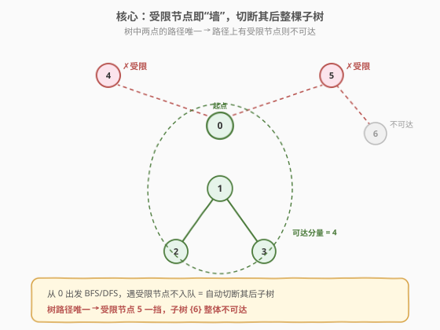
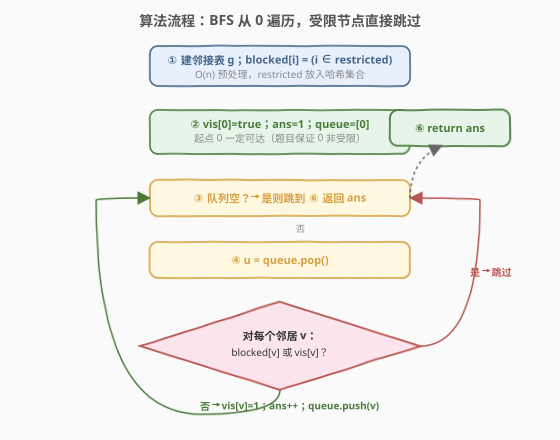

# LeetCode 受限条件下可到达节点的数目 题解

## 1. 题目概述

- **标题 / 题号**：受限条件下可到达节点的数目（#2368，medium）
- **链接**：https://leetcode.cn/problems/reachable-nodes-with-restrictions/
- **难度**：中等
- **标签**：树、深度优先搜索、广度优先搜索、图、哈希表

**题意**：现有一棵由 `n` 个节点组成的**无向树**，节点编号从 `0` 到 `n - 1`，共有 `n - 1` 条边。给你一个二维整数数组 `edges`（长度为 `n - 1`），其中 `edges[i] = [ai, bi]` 表示节点 `ai` 和 `bi` 之间存在一条边。另给你一个整数数组 `restricted` 表示**受限**节点。

在**不访问受限节点**的前提下，返回你可以从节点 `0` 到达的**最多**节点数目。注意，节点 `0` **不**会标记为受限节点。

**示例 1**：

```text
输入：n = 7, edges = [[0,1],[1,2],[3,1],[4,0],[0,5],[5,6]], restricted = [4,5]
输出：4
解释：在不访问受限节点的前提下，只有节点 [0,1,2,3] 可以从节点 0 到达。
```

**示例 2**：

```text
输入：n = 7, edges = [[0,1],[0,2],[0,5],[0,4],[3,2],[6,5]], restricted = [4,2,1]
输出：3
解释：在不访问受限节点的前提下，只有节点 [0,5,6] 可以从节点 0 到达。
```

**约束**：

- $2 \le n \le 10^5$
- `edges.length == n - 1`
- `edges[i].length == 2`
- $0 \le a_i, b_i < n$
- $a_i \ne b_i$
- `edges` 表示一棵有效的树
- $1 \le \text{restricted.length} < n$
- $1 \le \text{restricted}[i] < n$
- `restricted` 中的所有值**互不相同**

> 💡 **关键观察**：题目给的是一棵**树**（连通无环无向图）。树的核心性质是**任意两点间路径唯一**。因此节点 $x$ 能否从 $0$ 到达，取决于"0 到 $x$ 的唯一路径上是否出现受限节点"——出现则 $x$ 不可达，否则可达。于是从 $0$ 出发做一次 BFS/DFS，**遇受限节点直接不入队**，自然就切断了它身后的整棵子树，一次遍历即可数清所有可达节点。

## 2. 解题思路

### 2.1 暴力思路：逐节点判可达

最直白的做法：对每个非受限节点 $x$，单独从 $0$ 跑一次 BFS/DFS，途中绕开所有受限节点，看能否走到 $x$，能则计数加一。

$$T = O\!\left(n\cdot(n+m)\right) = O(n^2)$$

$n\le10^5$ 时这是 $10^{10}$ 量级，不可行。问题在于**重复搜索**——同一片连通区域内的节点被独立判定，而其实一次从 $0$ 出发的遍历就能把整片可达区域标记出来。

> 💡 **从逐点判定到单次遍历**：可达性具有传递性——若 $0$ 能到 $u$、$u$ 能到 $v$（且 $u,v$ 均非受限），则 $0$ 能到 $v$。所以从 $0$ 出发做一次图的遍历，沿途把所有非受限、未访问的邻居加入待探索队列，结束时访问到的节点集合就是全部可达节点。无需对每个节点重复搜索。

### 2.2 核心观察：受限节点即"墙"，一次 BFS 数清



**第 1 步：预处理受限集合。** 把 `restricted` 放入一个 $O(1)$ 查询的结构：C++ 用 `vector<int> blocked(n,0)` 标记数组，Python 用 `set`（或同样用布尔数组）。这样遍历时判断邻居是否受限只需 $O(1)$。

**第 2 步：建邻接表。** `edges` 是无向边，`g[u].push_back(v)` 与 `g[v].push_back(u)` 双向加入，得到邻接表 $O(n)$。

**第 3 步：BFS 从 0 出发。** 起点入队、标记已访问、`ans=1`。每次取队首 $u$，扫描其所有邻居 $v$：
- 若 `blocked[v]`（受限）或 `vis[v]`（已访问）→ **跳过**；
- 否则标记 `vis[v]=1`，`ans++`，$v$ 入队。

队空时 `ans` 即为答案。

> 💡 **为何"跳过受限节点"就够了？** 树中 $0$ 到任意 $v$ 的路径唯一。若该路径上某节点 $r$ 受限，则 $r$ 不会被入队，于是 $r$ 身后的节点（路径必经 $r$ 才能到的那部分）永远不会被探索到——它们天然被隔离。无需显式"删边"，只要在邻居扫描时把受限节点当不存在，效果等价于"切断所有连向受限节点的边"。

### 2.3 算法流程图



1. **预处理**：`blocked[i]=1` for $i\in$ `restricted`；建邻接表 `g`。
2. **初始化**：`vis[0]=1`、`ans=1`、`queue=[0]`（起点 $0$ 必可达）。
3. **循环**：队列为空则跳到第 5 步；否则取队首 $u$。
4. **扫描邻居**：对每个 $v\in g[u]$，若 `blocked[v]` 或 `vis[v]` 则跳过；否则 `vis[v]=1`、`ans++`、$v$ 入队。回到第 3 步。
5. **返回** `ans`。

### 2.4 示例演算

![示例 1 演算：restricted=[4,5] → 可达 4 个节点](../images/rnr_walkthrough.svg)

以示例 1 `n=7, edges=[[0,1],[1,2],[3,1],[4,0],[0,5],[5,6]], restricted=[4,5]` 为例。

**邻接表**（无向）：

| 节点 | 邻居 |
|------|------|
| 0 | 1, 4, 5 |
| 1 | 0, 2, 3 |
| 2 | 1 |
| 3 | 1 |
| 4 | 0 |
| 5 | 0, 6 |
| 6 | 5 |

**BFS 执行过程**：

| 步骤 | 出队 u | 邻居处理 | ans | 队列 |
|------|--------|----------|-----|------|
| 1 | 0 | 4✗受限 5✗受限 1✓入队 | 2 | [1] |
| 2 | 1 | 0已访 2✓入队 3✓入队 | 4 | [2, 3] |
| 3 | 2 | 1已访 → 跳过 | 4 | [3] |
| 4 | 3 | 1已访 → 跳过 | 4 | [] |

队空 → 返回 `ans = 4` ✓。

> 💡 **示例 2 为何只到 3**：`restricted=[4,2,1]`，$0$ 的邻居 $1,2,4$ 全部受限，只剩 $5$ 可入队；$5$ 的邻居 $6$ 非受限入队；$6$ 的邻居只有已访的 $5$。故可达 $\{0,5,6\}=3$。可见**起点周围一圈受限节点能彻底封死大部分子树**。

## 3. 参考代码

### C++

```cpp
class Solution {
public:
    int reachableNodes(int n, vector<vector<int>>& edges, vector<int>& restricted) {
        vector<vector<int>> g(n);
        for (auto& e : edges) {
            g[e[0]].push_back(e[1]);
            g[e[1]].push_back(e[0]);
        }
        vector<int> blocked(n, 0), vis(n, 0);
        for (int r : restricted) blocked[r] = 1;

        queue<int> q;
        q.push(0);
        vis[0] = 1;
        int ans = 1;
        while (!q.empty()) {
            int u = q.front(); q.pop();
            for (int v : g[u]) {
                if (blocked[v] || vis[v]) continue;   // 受限或已访问 → 跳过
                vis[v] = 1;
                ++ans;
                q.push(v);
            }
        }
        return ans;
    }
};
```

> 💡 **`blocked` 用数组而非 `unordered_set`**：节点编号是 $[0,n)$ 的稠密整数，布尔数组查 $O(1)$ 且常数远小于哈希集合；`restricted` 互不相同且 $< n$，直接按下标置 $1$ 即可。`vis` 与 `blocked` 可合并成一个状态数组（如 `0=未访问,1=受限,2=已访问`），但拆开写更清晰、对性能无实质影响。

### Python

```python
from collections import deque

class Solution:
    def reachableNodes(self, n: int, edges: List[List[int]], restricted: List[int]) -> int:
        g = [[] for _ in range(n)]
        for u, v in edges:
            g[u].append(v)
            g[v].append(u)

        blocked = set(restricted)
        vis = [False] * n

        q = deque([0])
        vis[0] = True
        ans = 1
        while q:
            u = q.popleft()
            for v in g[u]:
                if v in blocked or vis[v]:
                    continue
                vis[v] = True
                ans += 1
                q.append(v)
        return ans
```

> 💡 **Python 用 `set` 还是布尔数组做 `blocked`？** $n\le10^5$ 时两者均 $O(1)$ 查询，`set` 代码更直观且 `restricted` 长度可能远小于 $n$。若追求极致常数，可改 `blocked = bytearray(n)` 后 `blocked[r] = 1`，用 `if blocked[v]` 判断，比 `set` 的哈希更快。

## 4. 复杂度分析

| 维度 | 复杂度 | 说明 |
|------|--------|------|
| **时间复杂度** | $O(n)$ | 建邻接表 $O(n)$；BFS 每个节点入队出队各一次，每条无向边被两端各扫描一次共 $O(n)$（树有 $n-1$ 条边）；`blocked` 预处理 $O(\text{restricted.length})$ |
| **空间复杂度** | $O(n)$ | 邻接表 $O(n)$、`vis`/`blocked` 各 $O(n)$、队列最坏 $O(n)$ |

> 💡 暴力 $O(n^2)$ 与本解 $O(n)$ 差一个 $n$ 因子，关键在于**把"逐点判可达"重构为"从 0 出发的一次性扩散"**——可达性的传递性让单次遍历即可标记整片可达区域，受限节点当墙自然隔离其余部分。

## 5. 扩展：DFS 写法与递归栈风险

把 BFS 换成 DFS 逻辑完全等价，同样把受限节点当墙跳过即可。递归 DFS 最简洁：

```cpp
class Solution {
public:
    int reachableNodes(int n, vector<vector<int>>& edges, vector<int>& restricted) {
        vector<vector<int>> g(n);
        for (auto& e : edges) { g[e[0]].push_back(e[1]); g[e[1]].push_back(e[0]); }
        vector<int> blocked(n, 0), vis(n, 0);
        for (int r : restricted) blocked[r] = 1;

        int ans = 0;
        function<void(int)> dfs = [&](int u) {
            vis[u] = 1; ++ans;
            for (int v : g[u]) {
                if (!blocked[v] && !vis[v]) dfs(v);
            }
        };
        dfs(0);
        return ans;
    }
};
```

> ⚠️ **递归 DFS 在 $n=10^5$、树退化为链时栈深达 $10^5$，可能爆栈**（C++ 默认栈约 8MB，每帧几百字节即溢出；Python 默认递归上限 1000，必爆）。推荐 BFS 或迭代 DFS（自管栈）。若题目改成非树的一般图，本解法依旧成立——`vis` 数组天然处理环，受限节点仍当墙。

| 解法 | 思路 | 时间 | 空间 | 备注 |
|------|------|------|------|------|
| BFS（推荐） | 队列扩散，受限不入队 | $O(n)$ | $O(n)$ | 无递归栈风险，最稳 |
| 递归 DFS | 递归深入，受限不进 | $O(n)$ | $O(n)$+栈 | 链状树可能爆栈 |
| 迭代 DFS | 自管栈模拟递归 | $O(n)$ | $O(n)$ | 规避爆栈，与 BFS 等价 |

## 6. 面试要点

1. **"从 0 最多能到多少节点"怎么转化？**

    - 给的是树，任意两点路径唯一。节点 $x$ 可达 $\Leftrightarrow$ $0$ 到 $x$ 的唯一路径上无受限节点。于是从 $0$ 做一次 BFS/DFS，**遇到受限节点不入队**，结束时访问集合大小即答案。一次遍历 $O(n)$ 搞定，无需逐点判定。

2. **为什么"跳过受限节点"就能正确切断子树，而不用显式删边？**

    - 树中通往 $r$ 身后任意节点的路径**必经** $r$。$r$ 被跳过 $\Rightarrow$ $r$ 不入队 $\Rightarrow$ $r$ 的邻居永远不会从 $r$ 这一侧被探索到。等价于"删掉所有连向受限节点的边"，但实现上只需在邻居扫描时一个 `if` 判断，更简洁。

3. **`blocked` 用数组还是哈希集合？**

    - 节点编号是 $[0,n)$ 的稠密整数，布尔/整型数组按下标 $O(1)$ 查询且常数最小，优于 `unordered_set`/Python `set`。`restricted` 互不相同且 $<n$，直接置标记即可。若编号稀疏（本题不会）才考虑哈希集合。

4. **为什么必须用 BFS 或迭代 DFS，递归 DFS 有什么坑？**

    - $n\le10^5$，树退化成链时递归深度 $10^5$：C++ 可能段错误（栈溢出），Python 默认 `sys.setrecursionlimit` 仅 1000 必爆。BFS 用队列、迭代 DFS 用自管栈，均无此风险。树题尤其要警惕链状退化。

5. **如果图不是树（有环）本解法还成立吗？**

    - 仍成立。`vis` 数组天然防止环上的重复访问，受限节点依旧当墙跳过。唯一区别是"路径唯一"不再保证，但 BFS 的"已访问不再入队"机制保证了每个节点只处理一次，复杂度仍 $O(n+m)$。本题限制为树只是让边数 $m=n-1$，复杂度记号更紧凑。

> 💡 **一句话总结**：2368 是「受限节点当墙 + 一次 BFS 扩散」——建邻接表、把 `restricted` 标成不可入队，从 $0$ 跑 BFS 计数，$O(n)$ 时空；树路径唯一性保证跳过受限节点即正确隔离子树，注意链状树别用递归 DFS。

## 同类练习题

| # | 题目 | 与本题的关联 |
|---|------|-------------|
| 2316 | [统计无向图中无法互相到达点对数](../2301-2400/2316_统计无向图中无法互相到达点对数.md) | 同区间相邻题，无向图连通分量计数；本题是"求一个可达分量的大小"，2316 是"求所有分量大小再算跨分量配对"，对照"单源扩散 vs 全图分块" |
| 1971 | [寻找图中是否存在路径](https://leetcode.cn/problems/find-if-path-exists-in-graph/) | BFS/DFS 判两节点连通性，本题是其计数变体（从判"能否到"升级为"能到几个"） |
| 1319 | [连通网络的操作次数](https://leetcode.cn/problems/number-of-operations-to-make-network-connected/) | 并查集求连通分量数，体会"图遍历 / 并查集"两种求连通信息的通用范式 |
| 1557 | [可以到达所有节点的最少点数](https://leetcode.cn/problems/minimum-number-of-vertices-to-traverse-all-trees/) | DAG 反向思考找入口集合，与本题"从单源出发扩散"互补 |
| 1466 | [重新规划路线](https://leetcode.cn/problems/reorient-roads-to-visit-all-cities/) | 树上的有向边改向 + BFS/DFS 从指定根扩散，与本题同为"树上从根出发的遍历计数"套路 |
