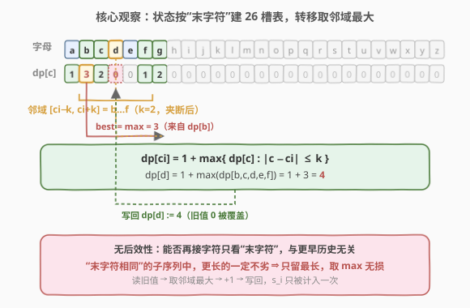
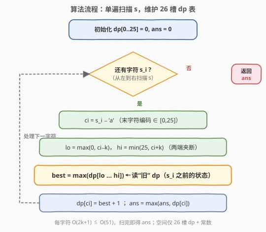
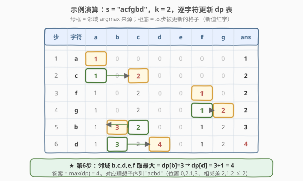

# LeetCode 最长理想子序列 题解

## 1. 题目概述

- **标题 / 题号**：最长理想子序列（#2370，medium）
- **链接**：https://leetcode.cn/problems/longest-ideal-subsequence/
- **难度**：中等
- **标签**：动态规划、字符串、哈希表

**题意**：给你一个由小写字母组成的字符串 `s` 和一个整数 `k`。称字符串 `t` 是**理想**的，当且仅当：

- `t` 是 `s` 的**子序列**（删除若干字符、不改变剩余字符顺序得到）；
- 对 `t` 中任意两个相邻字符，它们在字母表中的**位置差**不超过 `k`（位置：`'a'` 为 $0$，`'b'` 为 $1$，…，`'z'` 为 $25$，即 $|t_i - t_{i+1}| \le k$）。

返回**最长**理想字符串的长度。

**示例 1**：

```text
输入：s = "acfgbd", k = 2
输出：4
解释：最长理想子序列之一是 "acbd"（取下标 0,1,4,5）。
     位置 0,2,1,3：|0−2|=2 ≤2，|2−1|=1 ≤2，|1−3|=2 ≤2，均合法，长度 4。
```

**示例 2**：

```text
输入：s = "abcd", k = 3
输出：4
解释：整个串 "abcd" 即为理想子序列，相邻位置差均为 1 ≤ 3。
```

**约束**：

- $1 \le \text{s.length} \le 10^5$
- $0 \le k \le 25$
- `s` 仅由小写英文字母组成

> 💡 **关键量级**：字母表只有 $26$ 个字母，$k \le 25$ 时"邻域" $|\text{ci}-k, \text{ci}+k|$ 至多覆盖整个字母表，即窗口大小 $\le 2k+1 \le 51$。把状态按"末字符"建在 $26$ 槽的表上，转移是 $O(2k+1)$ 的邻域取最大——这是 $O(n \cdot (2k+1))$ 解法的根。

## 2. 解题思路

### 2.1 暴力思路

枚举 `s` 的所有子序列（$2^n$ 个），逐个检查相邻字符位置差是否 $\le k$，取最长。$n = 10^5$ 时 $2^{10^5}$ 完全不可行。

> ⚠️ 暴力的浪费在于：理想性只依赖"相邻两个字符"，却把整条子序列当成独立方案枚举。事实上，决定一条子序列能否继续往后接字符的，只有它的**最后一个字符**——前面多长、接了什么，对"能否再接一个新字符"没有任何影响。这正是线性 DP 的典型"无后效性"信号。

### 2.2 核心观察：状态只需"最后一个字符"



记 $dp[c]$ 为"**以字母 $c$ 结尾**的最长理想子序列长度"（$c \in [0, 25]$）。从左到右扫描 `s`，处理字符 $s_i$（设其编码 $\text{ci} = s_i - \text{'a'}$）时，把它**接在任意一个以 $c$ 结尾、且 $|c - \text{ci}| \le k$ 的子序列后面**，就能得到一条仍理想的、以 $\text{ci}$ 结尾的新子序列。我们要的是最长，故：

$$
dp[\text{ci}] \;=\; 1 \;+\; \max_{\,c:\,|c-\text{ci}|\le k\,}\; dp[c]
$$

> 💡 **无后效性**：理想性只校验相邻两位的差，因此一条子序列"能否再往后接"完全由其末字符决定，与更早的历史无关。于是"以 $c$ 结尾的最长长度"就是充分统计量——更短的同类方案永远不优于更长的，取最大即无损。

转移里 $c$ 的取值范围是 $[\max(0, \text{ci}-k),\, \min(25, \text{ci}+k)]$（在字母表两端做夹断）。当邻域内所有 $dp[c]$ 都是 $0$（即还没出现过可接的末字符）时，$\max = 0$，$dp[\text{ci}] = 1$，对应"以 $s_i$ 单字符开一条新子序列"。

> ⚠️ **为何读 $dp[\text{ci}]$ 旧值也合法**：邻域包含 $\text{ci}$ 自己（$|\text{ci}-\text{ci}|=0\le k$），所以候选里也有"以 $\text{ci}$ 结尾的旧子序列"——这正是"再接一个同字符"的合法分支。我们在计算时读的是**旧值**（处理 $s_i$ 之前的 $dp$），取完最大再加 $1$ 才写入 $dp[\text{ci}]$，因此不会把 $s_i$ 自己重复计入。

### 2.3 算法流程图



整体只扫一遍 `s`，维护 $dp[0..25]$ 与全局答案 `ans`：

1. 初始化 $dp[0..25] = 0$，`ans = 0`；
2. 对每个字符 $s_i$：算出 $\text{ci}$、夹断邻域 $[lo, hi]$，取 $dp[lo..hi]$ 的最大 `best`；
3. $dp[\text{ci}] = \text{best} + 1$，并用它更新 `ans`；
4. 扫完返回 `ans`。

### 2.4 示例演算



以 $s = \text{"acfgbd"}$、$k = 2$ 为例（编码 `a=0,c=2,f=5,g=6,b=1,d=3`）。$dp$ 初值全 $0$：

| 步 | 字符 | ci | 邻域 $[lo,hi]$（夹断） | best | 新 $dp[\text{ci}]$ | 说明 |
|----|------|----|------------------------|------|--------------------|------|
| 1 | `a` | 0 | $[0,2]$：a,b,c | $\max(1? ,0,0)=0$ | $dp[0]=1$ | 开新串 "a" |
| 2 | `c` | 2 | $[0,4]$：a,b,c,d,e | $\max(1,0,0,0,0)=1$ | $dp[2]=2$ | 接在 "a" 后 → "ac" |
| 3 | `f` | 5 | $[3,7]$：d,e,f,g,h | $\max(0,0,0,0,0)=0$ | $dp[5]=1$ | 无可接，开新串 "f" |
| 4 | `g` | 6 | $[4,8]$：e,f,g,h,i | $\max(0,1,0,0,0)=1$ | $dp[6]=2$ | 接在 "f" 后 → "fg" |
| 5 | `b` | 1 | $[0,3]$：a,b,c,d | $\max(1,0,2,0)=2$ | $dp[1]=3$ | 接在 "ac" 后 → "acb" |
| 6 | `d` | 3 | $[1,5]$：b,c,d,e,f | $\max(3,2,0,0,1)=3$ | $dp[3]=4$ | 接在 "acb" 后 → "acbd" |

最终 $\max(dp) = dp[3] = 4$，对应理想子序列 `"acbd"`（位置 $0,2,1,3$，相邻差 $2,1,2 \le 2$）。

> ⚠️ **直觉陷阱**：不要试图"贪心地"从左到右能接就接。比如第 5 步 `b` 接在 "ac" 后得长度 3，看似不如接在更长的 "fg"(2) 之后，但 "fgb" 位置 $5,6,1$ 中 $|6-1|=5 > 2$ **根本不合法**；真正的最优接法来自邻域取最大（这里是 $dp[2]=2$ 的 "ac"），不是"最长的那条子序列"。"末字符 + 邻域最大"恰好避开了这种陷阱。

## 3. 参考代码

### C++

```cpp
class Solution {
public:
    int longestIdealString(string s, int k) {
        int dp[26]{};
        int ans = 0;
        for (char ch : s) {
            int ci = ch - 'a';
            int lo = max(0, ci - k);
            int hi = min(25, ci + k);
            int best = 0;
            for (int c = lo; c <= hi; ++c)
                best = max(best, dp[c]);
            dp[ci] = best + 1;
            ans = max(ans, dp[ci]);
        }
        return ans;
    }
};
```

### Python

```python
class Solution:
    def longestIdealString(self, s: str, k: int) -> int:
        dp = [0] * 26
        ans = 0
        for ch in s:
            ci = ord(ch) - 97
            lo = max(0, ci - k)
            hi = min(25, ci + k)
            best = max(dp[lo:hi + 1])
            dp[ci] = best + 1
            ans = max(ans, dp[ci])
        return ans
```

> ⚠️ **两个易错点**：
> 1. **邻域夹断**。$\text{ci}-k$ 可能为负、$\text{ci}+k$ 可能超过 $25$，必须 `max(0, ci-k)` / `min(25, ci+k)` 夹断，否则 C++ 数组越界、Python 切片语义错误。
> 2. **先读后写**。计算 `best` 时读的必须是**旧** $dp[\text{ci}]$（来自 $s_i$ 之前的字符），取完最大再加 $1$ 才赋值给 $dp[\text{ci}]$。若一边扫邻域一边就地更新 $dp[\text{ci}]$，可能把 $s_i$ 自身重复计入。这里把"取 max"和"写回"分两步，天然安全。
>
> 💡 **Python 的切片** `dp[lo:hi+1]` 一步算出邻域最大，常数极小；C++ 用一个不超过 $51$ 次的小循环即可，$n=10^5$ 时约 $5\times 10^6$ 次比较，稳过。

## 4. 复杂度分析

| 维度 | 复杂度 | 说明 |
|------|--------|------|
| 时间复杂度 | $O(n\cdot(2k+1))$ | 每个字符扫一遍长度 $\le 2k+1 \le 51$ 的邻域取最大；$n=10^5$ 时约 $5\times10^6$ 次操作 |
| 空间复杂度 | $O(|\Sigma|)=O(1)$ | 仅 $26$ 槽的 $dp$ 数组与常数个变量，字母表大小 $\|\Sigma\|=26$ 视作常数 |

## 5. 扩展：为何"按末字符建表"是最优信息压缩

本题的状态设计本质是一次**信息压缩**：子序列的全部历史被压缩成一个标量"末字符"。这之所以无损，依赖两个性质：

- **马尔可夫性（无后效性）**：理想性校验只看相邻两位，故"末字符"是足以决定"能否再接一个字符"的充分统计量。更早的历史对将来可接的字符集合没有任何约束力。
- **可加最优性**：在"末字符相同"的诸多子序列里，更长的永远支配更短的（往后能接的字符集合完全一样，长度更大者答案更大）。于是只留**最长**的那一条作代表，取最大无损。

对照经典 LIS（[300](https://leetcode.cn/problems/longest-increasing-subsequence/)）：LIS 的"末元素"必须是"严格更大的下一个元素"才能接——本题把"严格更大"松弛成"位置差 $\le k$"，邻域从"右侧射线"变成"以为中心、半径 $k$ 的区间"，但**状态骨架（按末元素建表、转移取邻域最大 $+1$）完全一致**。

> 💡 **能否更快？** 字母表只有 $26$，邻域 $\le 51$，朴素扫描已是常数级。若把字符集推广到值域 $U$ 很大（如整数 $[-10^9, 10^9]$）、$k$ 也大的情形，朴素 $O(n\cdot|U|)$ 会退化，此时可改用**线段树 / 树状数组**做区间最大，转移降到 $O(\log U)$，总体 $O(n\log U)$；或离散化后套同一骨架。本题 $U=26$ 无此必要。

## 6. 面试要点

1. **为什么状态只需"最后一个字符"？**

   - 理想性只校验相邻两位的字母表位置差。一条子序列能否再往后接某个字符 $s_i$，只取决于它的末字符 $c$ 是否满足 $|c - \text{ci}| \le k$；更早的历史对新字符的合法性没有额外约束。这就是无后效性，"末字符"是充分统计量。

2. **转移里 $dp[\text{ci}]$ 自己也在邻域中，会重复计数吗？**

   - 不会。我们读的是**处理 $s_i$ 之前**的旧 $dp$ 值，代表"以 $s_i$ 之前的字符构成的、末字符为 $\text{ci}$ 的子序列"。把 $s_i$ 接在它后面（同字符相邻，差为 $0 \le k$，合法）得到新长度 $dp[\text{ci}]+1$，这是真实的一条新子序列。先取最大、再 $+1$、最后写回，顺序保证 $s_i$ 只被计入一次。

3. **$k = 0$ 时退化成什么？**

   - $|c-\text{ci}| \le 0$ 即 $c = \text{ci}$，只能接同字符。$dp[\text{ci}] = dp[\text{ci}] + 1$，即每个字符只累计自己。答案 $=$ `s` 中出现次数最多的那个字母的频次——最长"理想"子序列就是该字母的全部出现。这是合理的退化结果。

4. **$k \ge 25$ 时呢？**

   - 邻域覆盖整个字母表，任意两个小写字母位置差 $\le 25 \le k$，任何子序列都理想。答案 $= n$（整个串）。

5. **复杂度能否再优化？为什么不必？**

   - 字母表 $|\Sigma| = 26$，邻域 $\le 51$，朴素 $O(n(2k+1))$ 已是 $5\times10^6$ 级，常数极小、稳过。理论上可用线段树/树状数组做区间最大降到 $O(n\log|\Sigma|)$，但 $\log 26 \approx 4.7$，相比 $51$ 的常数并无优势，反而增复杂度与代码量，得不偿失。

> 💡 **一句话总结**：2370 的核心是"按末字符建 $26$ 槽状态表、转移取邻域 $[\text{ci}-k,\text{ci}+k]$ 最大 $+1$"——一次扫描、$O(n(2k+1))$ 时间、$O(1)$ 空间，骨架与 LIS 一脉相承。

## 同类练习题

| # | 题目 | 与本题的关联 |
|---|------|-------------|
| 1218 | [最长定差子序列](https://leetcode.cn/problems/longest-arithmetic-subsequence-of-given-difference/)（[题解](../1201-1300/1218_最长定差子序列.md)） | $dp[v]=dp[v-d]+1$，同为"只关心末元素"的哈希 DP，把"差 $\le k$ 的邻域"退化成"差恰为 $d$"的单点前驱 |
| 300 | [最长递增子序列](https://leetcode.cn/problems/longest-increasing-subsequence/)（[题解](../0201-0300/300_最长递增子序列.md)） | $dp[i]=$ 以 $nums[i]$ 结尾的 LIS，本题的"按末元素建状态、邻域取最大 $+1$"骨架即由此而来 |
| 1143 | [最长公共子序列](https://leetcode.cn/problems/longest-common-subsequence/)（[题解](../1101-1200/1143_最长公共子序列.md)） | 子序列 DP 的二维经典，对照本题一维"末字符"状态的降维之妙 |
| 1027 | [最长等差数列](https://leetcode.cn/problems/longest-arithmetic-subsequence/)（[题解](../1001-1100/1027_最长等差数列.md)） | 相邻元素差固定为公差 $d$，$dp[i][d]$ 的"相邻约束刻画"，对照本题"相邻差 $\le k$" |
| 209 | [长度最小的子数组](https://leetcode.cn/problems/minimum-size-subarray-sum/)（[题解](../0201-0300/209_长度最小的子数组.md)） | 同为"扫一遍 $s$/`nums`、维护一张以某特征为下标的表"的单遍线性套路，对照"按值域建表 + 单次扫描"范式 |
