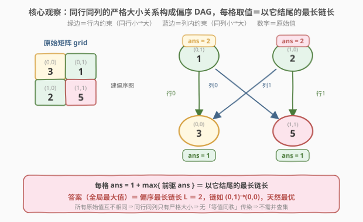
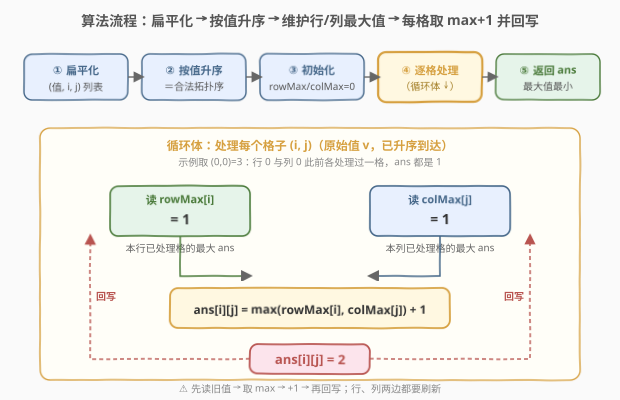

# LeetCode 最小化网格中的最大值 题解

## 1. 题目概述

- **标题 / 题号**：最小化网格中的最大值（#2371，hard）
- **链接**：https://leetcode.cn/problems/minimize-maximum-value-in-a-grid/
- **难度**：困难
- **标签**：排序、贪心、拓扑排序、图、矩阵

**题意**：给定一个包含**互不相同**正整数的 $m \times n$ 矩阵 `grid`。必须把矩阵里的**每一个整数都替换成某个正整数**，且满足：

- 替换后，**同一行或同一列**中任意两个元素的**相对大小顺序保持不变**；
- 在满足上一条的前提下，替换后矩阵中的**最大值要尽可能小**。

「相对顺序不变」的严格定义：若原始矩阵中 $\text{grid}[r_1][c_1] > \text{grid}[r_2][c_2]$，且 $r_1 = r_2$（同行）或 $c_1 = c_2$（同列），则替换后必有 $\text{ans}[r_1][c_1] > \text{ans}[r_2][c_2]$。

例如 `grid = [[2,4,5],[7,3,9]]`，`[[1,2,3],[2,1,4]]` 与 `[[1,2,3],[3,1,4]]` 都是合法替换。返回任意一个使最大值最小的结果矩阵。

**示例 1**：

```text
输入：grid = [[3,1],[2,5]]
输出：[[2,1],[1,2]]
解释：最大值为 2，可以证明取不到更小的最大值。
```

**示例 2**：

```text
输入：grid = [[10]]
输出：[[1]]
解释：唯一一个数字直接替换成 1。
```

**约束**：

- $m = \text{grid.length}$，$n = \text{grid}[i].\text{length}$
- $1 \le m, n \le 1000$
- $1 \le m \cdot n \le 10^5$
- $1 \le \text{grid}[i][j] \le 10^9$
- `grid` 中所有整数**互不相同**

> 💡 **关键前提**：题目保证 `grid` 中所有数互不相同。这把「同行同列的两数关系」化简成纯粹的「严格大于 / 严格小于」，不存在「相等须同秩」的传染——这正是本题比 [1632. 矩阵转换后的秩](../1601-1700/1632_矩阵转换.md)（允许重复值）少掉并查集那一环的根因，详见第 5 节。

## 2. 解题思路

### 2.1 暴力思路

最朴素的做法是逐格枚举替换值，从 $1$ 开始往上试，每填一格就校验它所在行、列的相对大小是否仍被满足，不满足就 $+1$。这完全不可行：

- 替换值上界可达 $mn$（$10^5$），逐格爬升最坏 $O((mn)^2)$；
- 每次校验要扫整行整列，$O(m+n)$；
- 而且「先填谁」没有章法时，后填的格子可能反过来要求先填的格子更大，互相牵扯、顾此失彼。

> 💡 **转换视角**：不要「逐格定值」，而要**按原始值从小到大成批推进**——值小的先定，值大的据此递推。这天然给出一个无后效的处理顺序：当我处理某个格子时，所有「必须比它小」的格子已经处理完了，它的取值只依赖这些已落定的更小格子。

### 2.2 核心观察：偏序约束 → 拓扑最长链 → 排序贪心



把每个格子看作图中的一个节点。若两格 $(r_1,c_1)$、$(r_2,c_2)$ **同行或同列**且 $\text{grid}[r_1][c_1] > \text{grid}[r_2][c_2]$，则结果中必须有 $\text{ans}[r_1][c_1] > \text{ans}[r_2][c_2]$，即 $(r_2,c_2)$ 是 $(r_1,c_1)$ 的**前驱**，画一条「小 → 大」的有向边。由于所有原始值互不相同，同一行/列内任意两格都可比、方向由大小唯一决定，整张图是一个**严格偏序的 DAG**（无环：边总从更小的原始值指向更大的原始值，不可能成环）。

于是每格的最小合法取值就是**以该格结尾的最长链的长度**：

$$
\text{ans}[i][j] \;=\; 1 \;+\; \max_{(p,q)\text{ 是 }(i,j)\text{ 的前驱}} \text{ans}[p][q]
$$

这是拓扑 DP / DAG 最长路的经典递推。处理顺序取**按原始值升序**即可——因为所有边都「小 → 大」，升序正是一个合法拓扑序；处理 $(i,j)$ 时，它的前驱（同行同列、原始值更小的格子）必然已全部处理完。

> ⚠️ **关键化简**：前驱集合 =「同行中已处理的格子」∪「同列中已处理的格子」。我们不必逐个枚举前驱，只需分别记录**第 $i$ 行目前出现过的最大替换值** `rowMax[i]` 与**第 $j$ 列目前出现过的最大替换值** `colMax[j]`。则
> $$\text{ans}[i][j] = \max(\text{rowMax}[i],\, \text{colMax}[j]) + 1$$
> 取完立刻用新值刷新 `rowMax[i]` 与 `colMax[j]`。一行一列两张表就把整张 DAG 的前驱信息压成了 $O(1)$ 查询。

> 💡 **为什么这是最优的（最大值最小）？** 记偏序中**最长链**的长度为 $L$。一方面，链上 $L$ 个格子两两可比且须严格递增，故最大值 $\ge L$（下界）；另一方面，按最长链长赋值正好让每个格子取到满足约束的**最小值**，最终最大值恰 $= L$（达到下界）。所以答案 $=$ 偏序最长链长，贪心赋值天然最优。

### 2.3 算法流程图



整体只扫一遍排好序的格子序列：

1. 把 `grid` 扁平成 `(值, i, j)` 三元组列表，按**值升序**排序；
2. 初始化 `rowMax[0..m-1] = 0`、`colMax[0..n-1] = 0`、答案矩阵 `ans` 全 $0$；
3. 对每个 `(值, i, j)`：
   - `ans[i][j] = max(rowMax[i], colMax[j]) + 1`；
   - `rowMax[i] = colMax[j] = ans[i][j]`（同一格既刷新本行又刷新本列的最大值）；
4. 返回 `ans`。

### 2.4 示例演算

![示例演算：grid = [[3,1],[2,5]]，按值升序逐格填值并维护行/列最大值](../images/2371_example_walkthrough.svg)

以 `grid = [[3,1],[2,5]]` 为例。扁平化按值升序得处理序列 $(1,0,1) \to (2,1,0) \to (3,0,0) \to (5,1,1)$。`rowMax = [0,0]`，`colMax = [0,0]`：

| 步 | 处理格 $(i,j)$（原始值） | $\max(\text{rowMax}[i],\text{colMax}[j])$ | 新 $\text{ans}[i][j]$ | 更新后 rowMax / colMax | 矩阵快照 |
|----|--------------------------|--------------------------------------------|------------------------|------------------------|----------|
| 1 | $(0,1)$，值 $1$ | $\max(0,0)=0$ | $1$ | rowMax$[0]=1$；colMax$[1]=1$ | $[\,[\_,1],[\_,\_]\,]$ |
| 2 | $(1,0)$，值 $2$ | $\max(0,0)=0$ | $1$ | rowMax$[1]=1$；colMax$[0]=1$ | $[\,[\_,1],[1,\_]\,]$ |
| 3 | $(0,0)$，值 $3$ | $\max(\text{rowMax}[0]=1,\text{colMax}[0]=1)=1$ | $2$ | rowMax$[0]=2$；colMax$[0]=2$ | $[\,[2,1],[1,\_]\,]$ |
| 4 | $(1,1)$，值 $5$ | $\max(\text{rowMax}[1]=1,\text{colMax}[1]=1)=1$ | $2$ | rowMax$[1]=2$；colMax$[1]=2$ | $[\,[2,1],[1,2]\,]$ |

最终 $\text{ans} = [[2,1],[1,2]]$，最大值 $=2$。

校验相对顺序：行 $0$ 中 $3 > 1 \Rightarrow 2 > 1$ ✓；行 $1$ 中 $2 < 5 \Rightarrow 1 < 2$ ✓；列 $0$ 中 $3 > 2 \Rightarrow 2 > 1$ ✓；列 $1$ 中 $1 < 5 \Rightarrow 1 < 2$ ✓。

> 💡 **观察要点**：第 3 步 $(0,0)$ 的前驱是同行已处理的 $(0,1)$（值 $1$→秩 $1$）与同列已处理的 $(1,0)$（值 $2$→秩 $1$），二者秩都是 $1$，故 $(0,0)$ 取 $1+1=2$——这正是「以 $(0,0)$ 结尾的最长链长 $=2$」。整张偏序图的最长链恰为 $2$（如 $(0,1)\to(0,0)$ 或 $(1,0)\to(1,1)$），所以最大值不可能小于 $2$。

## 3. 参考代码

### C++

```cpp
class Solution {
public:
    vector<vector<int>> minScore(vector<vector<int>>& grid) {
        int m = grid.size(), n = grid[0].size();
        vector<tuple<int, int, int>> nums;
        nums.reserve(m * n);
        for (int i = 0; i < m; ++i)
            for (int j = 0; j < n; ++j)
                nums.emplace_back(grid[i][j], i, j);
        sort(nums.begin(), nums.end());          // 按原始值升序 = 合法拓扑序
        vector<int> rowMax(m, 0), colMax(n, 0);
        vector<vector<int>> ans(m, vector<int>(n, 0));
        for (auto& [_, i, j] : nums) {
            ans[i][j] = max(rowMax[i], colMax[j]) + 1;   // 1 + 前驱最大值
            rowMax[i] = colMax[j] = ans[i][j];            // 回写行/列最大值
        }
        return ans;
    }
};
```

### Python

```python
class Solution:
    def minScore(self, grid: List[List[int]]) -> List[List[int]]:
        m, n = len(grid), len(grid[0])
        nums = sorted((grid[i][j], i, j)
                      for i in range(m) for j in range(n))  # 按值升序 = 拓扑序
        row_max = [0] * m
        col_max = [0] * n
        ans = [[0] * n for _ in range(m)]
        for _, i, j in nums:
            ans[i][j] = max(row_max[i], col_max[j]) + 1     # 1 + 前驱最大值
            row_max[i] = col_max[j] = ans[i][j]             # 回写行/列最大值
        return ans
```

> ⚠️ **两个易错点**：
> 1. **先取后写**。`max(rowMax[i], colMax[j])` 必须读**旧值**（处理当前格之前的行/列最大值），算完 $+1$ 再一次性回写 `rowMax[i]` 与 `colMax[j]`。若一边读一边写，可能把当前格自身重复计入。代码里把「取 max」与「写回」分两步，天然安全。
> 2. **行、列都要更新**。当前格 $(i,j)$ 同时是其所在行 $i$ 与所在列 $j$ 的一员，赋值后**两边**的最大值都要刷新；只更新一侧会让后续同列（或同行）格子读到过小的下界，漏掉约束。
>
> 💡 **排序稳定性**：题目保证所有值互不相同，因此按值升序排序天然唯一确定处理顺序，无需关心同值排序的稳定性问题（同值情况见第 5 节）。

## 4. 复杂度分析

| 维度 | 复杂度 | 说明 |
|------|--------|------|
| 时间复杂度 | $O(mn \log(mn))$ | 扁平化 $O(mn)$、排序 $O(mn\log(mn))$、单遍扫描 $O(mn)$；排序为主导项 |
| 空间复杂度 | $O(mn)$ | 存扁平三元组列表与答案矩阵；`rowMax`/`colMax` 仅 $O(m+n)$ 是附加常数级 |

## 5. 扩展：与 1632「矩阵转换后的秩」的关系——并查集何时登场

本题在力扣标签里挂着「并查集」，但上面的解法根本没用到它。原因正是第 1 节强调的前提：**`grid` 中所有整数互不相同**。对照近乎同形的 [1632. 矩阵转换后的秩](../1601-1700/1632_矩阵转换.md)：

| 维度 | 2371（本题） | 1632（秩转换） |
|------|--------------|----------------|
| 是否允许重复值 | ❌ 全部互不相同 | ✅ 允许任意重复 |
| 同行同列两数关系 | 只有 $>$、$<$（严格可比） | 还有 $=$（相等须**同秩**） |
| 相等约束 | 不存在 | 等值且同行/同列的格**必须取相同值**，且会**传染**（同行传递到同列再传递到下一行） |
| 处理单元 | 单格逐个赋值 | 把等值且连通的格子**打包成一个分量**，整体赋同一个值 |
| 所需数据结构 | 仅 `rowMax`/`colMax` 两张表 | **并查集**把同行同列的等值格绑成一个连通分量 |

**为什么 1632 需要并查集？** 当出现「等值须同秩」时，同秩约束会传递：$(r_1,c_1)$ 与 $(r_1,c_2)$ 同行同秩，$(r_1,c_2)$ 又与 $(r_2,c_2)$ 同列同秩，于是 $(r_1,c_1)$ 与 $(r_2,c_2)$ 被迫同秩——尽管它们既不同行也不同列。这就构成一张**约束图的连通分量**，必须用并查集把涉及的行号、列号统一连起来，整组取 $1+\max(\text{rowMax},\text{colMax})$ 作为共同秩。

> 💡 **一句话**：2371 是 1632 的「**无重复值退化版**」。重复值一旦消失，「同秩传染」消失，并查集也随之消失，剩下纯粹的偏序最长链 = 排序贪心。可以理解为：**本题的并查集退化为「每格自成一组」的恒等情形**，于是直接按值升序逐格赋值即可。

> ⚠️ **若 2371 放宽「互不相同」约束怎么办？** 直接套 1632 的并查集模板：按值分组、每组用「行号 $i$ + 列号 $m{+}j$」建并查集、把同行同列的等值格 `union`、按连通分量整体取 $1+\max(\text{rowMax},\text{colMax})$ 即可。这正是「先理解 2371 的偏序骨架，再在 1632 上加一层等值打包」的学习路径。

## 6. 面试要点

1. **为什么按原始值升序处理就一定合法？**

   - 所有边都「小 → 大」（同一行/列里原始值小的格要求结果更小，是大格的前驱），所以按原始值升序排列天然满足「前驱先于后继」的拓扑序。处理任意一格时，其全部前驱（同行同列、原始值更小的格）都已落定，递推无后效。

2. **`ans[i][j] = max(rowMax[i], colMax[j]) + 1` 为什么等价于「前驱最大值 + 1」？**

   - $(i,j)$ 的前驱 = 同行已处理的格 ∪ 同列已处理的格。`rowMax[i]` 正是同行已处理格的最大结果，`colMax[j]` 是同列已处理格的最大结果，二者取大即为全部前驱的最大值。+1 表示严格大于所有前驱，是该格满足约束的**最小**取值。

3. **如何证明这样得到的最大值是全局最小的？**

   - 设偏序最长链长为 $L$。链上 $L$ 格两两可比、须严格递增 $\Rightarrow$ 最大值 $\ge L$（下界）。而最长链长 DP 让每格恰好取「以它结尾的最长链长」，故最终最大值 $= \max$ 各格最长链长 $= L$，恰好达到下界，最优。

4. **为什么本题不用并查集，1632 却要？**

   - 本题所有值互不相同，同行同列两数关系只有严格大小、没有「相等须同秩」，因此不存在同秩传染，每个格子独立赋值即可。1632 允许重复值，相等且同行/同列的格必须同秩且会传递，须用并查集把整组等值连通格打包成同一个分量统一赋秩。

5. **行/列最大值更新顺序能写反或漏一个吗？**

   - 不能。当前格 $(i,j)$ 既属于行 $i$ 又属于列 $j$，赋值后**两边**的 `rowMax[i]` 与 `colMax[j]` 都要用新值刷新；漏一个会让后续同列/同行的格子读到偏小的下界，造成结果非最优（甚至违反约束）。且必须**先读旧值算 max，再回写**，否则可能把当前格自身重复计入。

> 💡 **一句话总结**：2371 的核心是「同行同列严格大小构成偏序 DAG，每格取以它结尾的最长链长；按值升序这个天然拓扑序处理，用 `rowMax`/`colMax` 两张表把前驱信息压成 $O(1)$ 查询」——$O(mn\log(mn))$ 时间、$O(mn)$ 空间，答案 $=$ 偏序最长链长，天然最优。

## 同类练习题

| # | 题目 | 与本题的关联 |
|---|------|-------------|
| 1632 | [矩阵转换后的秩](https://leetcode.cn/problems/rank-transform-of-a-matrix/)（[题解](../1601-1700/1632_矩阵转换.md)） | 本题的「允许重复值」加强版，等值格须同秩且会传染，并查集登场；理解 2371 的偏序骨架后，往上加一层「等值打包」即可 |
| 354 | [俄罗斯套娃信封问题](https://leetcode.cn/problems/russian-doll-envelopes/)（[题解](../0301-0400/354_俄罗斯套娃信封问题.md)） | 二维偏序的最长链（LIS 升维），同为「严格大小决定前驱、最长链 DP」范式 |
| 300 | [最长递增子序列](https://leetcode.cn/problems/longest-increasing-subsequence/)（[题解](../0201-0300/300_最长递增子序列.md)） | 一维偏序最长链的本源，本题每行/每列内部就是一条 LIS，DP 取「前驱最大 +1」与之同构 |
| 207 | [课程表](https://leetcode.cn/problems/course-schedule/)（[题解](../0201-0300/207_课程表.md)） | 拓扑排序母题，本题把「按值升序」视作预计算好的拓扑序，对照显式建图 + 入度 BFS 的通用做法 |
| 406 | [根据身高重建队列](https://leetcode.cn/problems/queue-reconstruction-by-height/)（[题解](../0401-0500/406_根据身高重建队列.md)） | 同为「先排序定处理顺序、再逐个贪心放置」的排序 + 贪心重建套路 |
