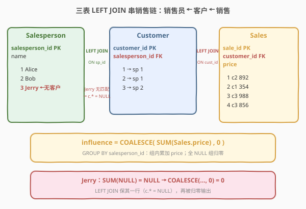
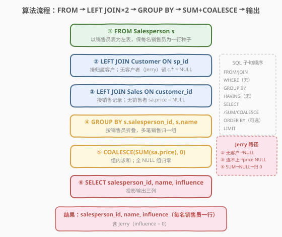
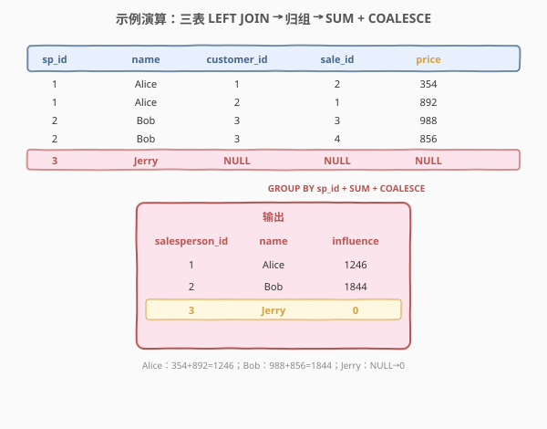

# 计算每个销售人员的影响力

- **题目名称**：计算每个销售人员的影响力
- **链接**：[2372. 计算每个销售人员的影响力 🔒](https://leetcode.cn/problems/calculate-the-influence-of-each-salesperson/)
- **难度**：中等
- **标签**：SQL、多表 JOIN、LEFT JOIN、GROUP BY、聚合求和、COALESCE 零填充、LeetCode 锁题

> ⚠️ **关于题面**：本题为 **LeetCode Plus 会员专享题**，官方题面与示例输出被会员墙锁定，公开 GraphQL 接口（leetcode.cn 与 leetcode.com）的 `content` 字段均返回 `null`，网页亦提示"该题目是 Plus 会员专享题"。下文 **第 1 节题意**系依据公开可见的**建表语句（`mysqlSchemas`）与示例输入（`sampleTestCase`）+ 题目名"计算每个销售人员的影响力"**重构而成，**核心算法（三表 `LEFT JOIN` + `GROUP BY + SUM` + `COALESCE` 零填充）与示例输入的演算结果是确定的**；**输出列名 `influence`** 为依据题目名合理推断，**以官方题面为准**——若官方输出列名为 `total`/`amount` 等，仅需改 `AS` 别名，主体逻辑不变。

---

## 1. 题目概述

给定 `Salesperson`（销售人员表）、`Customer`（客户表）、`Sales`（销售记录表）三张表。每个客户被分配给一名销售人员，每条销售记录归属于一个客户。编写 SQL 查询，**为每一名销售人员计算其"影响力"**：即归属于该销售人员所有客户的销售记录的 `price` 之和。

**表结构**：

```text
Table: Salesperson
+----------------+---------+
| Column Name    | Type    |
+----------------+---------+
| salesperson_id | int     |  ← 主键
| name           | varchar |  ← 销售人员姓名
+----------------+---------+
每行给出一名销售人员。

Table: Customer
+----------------+---------+
| Column Name    | Type    |
+----------------+---------+
| customer_id    | int     |  ← 主键
| salesperson_id | int     |  ← 外键 → Salesperson.salesperson_id
+----------------+---------+
每行表示一名客户及其归属的销售人员。

Table: Sales
+-------------+---------+
| Column Name | Type    |
+-------------+---------+
| sale_id     | int     |  ← 主键
| customer_id | int     |  ← 外键 → Customer.customer_id
| price       | int     |  ← 该笔销售金额
+-------------+---------+
每行表示一笔销售记录及其金额。
```

**输出列**：`salesperson_id`、`name`、`influence`（该销售员所有客户销售金额之和）。结果**涵盖每一名销售人员**——即使某销售员没有客户 / 没有销售记录，其 `influence` 也为 `0`。

**示例 1**（取自官方 `sampleTestCase`）：

```text
输入：
Salesperson 表:
+----------------+-------+
| salesperson_id | name  |
+----------------+-------+
| 1              | Alice |
| 2              | Bob   |
| 3              | Jerry |
+----------------+-------+

Customer 表:
+-------------+----------------+
| customer_id | salesperson_id |
+-------------+----------------+
| 1           | 1              |
| 2           | 1              |
| 3           | 2              |
+-------------+----------------+

Sales 表:
+---------+-------------+-------+
| sale_id | customer_id | price |
+---------+-------------+-------+
| 1       | 2           | 892   |
| 2       | 1           | 354   |
| 3       | 3           | 988   |
| 4       | 3           | 856   |
+---------+-------------+-------+

输出：
+----------------+-------+-----------+
| salesperson_id | name  | influence |
+----------------+-------+-----------+
| 1              | Alice | 1246      |
| 2              | Bob   | 1844      |
| 3              | Jerry | 0         |
+----------------+-------+-----------+
```

**解释**：

| 销售员 | 归属客户 | 该客户的销售 | 影响力计算 |
|--------|----------|--------------|------------|
| Alice (1) | 客户 1、客户 2 | 客户1：354；客户2：892 | $354 + 892 = 1246$ |
| Bob (2) | 客户 3 | 客户3：988 + 856 | $988 + 856 = 1844$ |
| Jerry (3) | 无 | 无 | $0$（无任何客户/销售） |

> ⚠️ **题眼**：注意 Jerry——他是 `Salesperson` 表中的一名销售员，但 `Customer` 表中**没有任何客户**归属给他，`Sales` 表自然也无相关记录。题目要求"**每名**销售人员"的影响力，故 Jerry 必须出现在结果中且 `influence = 0`。这决定了必须用 **`LEFT JOIN`**（而非 `JOIN`/`INNER JOIN`）+ **`COALESCE`/`IFNULL` 零填充**，是本题从"简单"升到"中等"的关键点。

**约束条件**（推断自 `mysqlSchemas` 类型声明）：

- `salesperson_id` 是 `Salesperson` 表的主键，`customer_id` 是 `Customer` 表的主键，`sale_id` 是 `Sales` 表的主键
- `Customer.salesperson_id` 引用 `Salesperson.salesperson_id`，`Sales.customer_id` 引用 `Customer.customer_id`（外键完整性）
- `salesperson_id`、`customer_id`、`sale_id`、`price` 均为 `INT`
- 结果涵盖**所有**销售人员（含无销售者，`influence = 0`）

> 💡 本题是 SQL **"三表 LEFT JOIN + 分组聚合求和 + 缺失值零填充"** 的招牌形态——核心四步：① 以 `Salesperson` 为左表 `LEFT JOIN Customer` 再 `LEFT JOIN Sales` 串成"销售员 → 客户 → 销售"链；② `GROUP BY salesperson_id` 把链上每名销售员的全部销售行折叠成一组；③ `SUM(price)` 组内求和得影响力；④ `COALESCE(SUM, 0)` 把无销售组（Jerry）的 `NULL` 转成 `0`。

---

## 2. 解题思路

### 2.1 暴力思路：逐销售员遍历客户与销售

最直觉的过程式思路：对每一名销售员，找出归属他的所有客户，再找出这些客户的所有销售记录，把 `price` 累加。伪代码：

```text
for each salesperson sp (in Salesperson):
    total = 0
    for each customer cu in Customer where cu.salesperson_id = sp.salesperson_id:
        for each sale sa in Sales where sa.customer_id = cu.customer_id:
            total += sa.price
    emit (sp.salesperson_id, sp.name, total)
```

逻辑正确，但**对每名销售员都要嵌套扫描 `Customer` 与 `Sales`**，复杂度 $O(S \cdot (C + \text{lookup}))$。更自然的方式是把三张表按外键**一次性连接**成"销售员 × 客户 × 销售"的明细宽表，再按销售员分组聚合——这正是关系代数中"连接 + 聚合"的标准范式。

### 2.2 核心观察：三表 LEFT JOIN + 分组求和 + COALESCE 零填充



**问题拆解为三个子问题**：

1. **串成销售链**：销售金额 `price` 在 `Sales` 表，但它只挂到 `customer_id`；客户表只挂到 `salesperson_id`；销售员姓名 `name` 在 `Salesperson` 表。要拿到"某笔销售 → 哪个客户 → 哪名销售员"，必须把三表按外键连起来：

$$\text{Sales} \xrightarrow{\text{customer\_id}} \text{Customer} \xrightarrow{\text{salesperson\_id}} \text{Salesperson}$$

2. **按销售员分组求和**：连接后每笔销售都带上了销售员标识，同一销售员名下可能有多笔销售（如 Alice 有 2 笔、Bob 有 2 笔）。需 `GROUP BY salesperson_id` 折叠，用 `SUM(price)` 累加得影响力：

$$\text{influence}_p = \sum_{\text{该销售员所有销售}} \text{price}_i$$

3. **零填充无销售组**：Jerry 在 `Customer` 表无匹配行。若用 `LEFT JOIN`，Jerry 的分组里 `price` 全为 `NULL`，`SUM(NULL)` 仍为 `NULL`——必须用 `COALESCE(SUM(price), 0)` 把 `NULL` 转成 `0`，才能输出 `influence = 0`。

> 💡 **为何必须 `LEFT JOIN` 而非 `JOIN`？** `JOIN`/`INNER JOIN` 只保留"两表都有匹配"的行——Jerry 在 `Customer` 无匹配会被**丢弃**，结果就少了 Jerry 这一行，违背"**每名**销售员"的要求。`LEFT JOIN` 保留左表（`Salesperson`）全部行，右表无匹配时填 `NULL`，从而把 Jerry"挂"在结果里，再用 `COALESCE` 把 `NULL` 聚合结果归零。

> ⚠️ **链式 LEFT JOIN 的 NULL 传播**：`Salesperson LEFT JOIN Customer` 给 Jerry 产生一行 `c.* = NULL`；再 `LEFT JOIN Sales ON sa.customer_id = c.customer_id`，因 `c.customer_id` 为 `NULL`，连不上任何 `Sales` 行，`sa.price` 也为 `NULL`。故 Jerry 组只有一行全 `NULL` 的价格，`SUM` 得 `NULL`，`COALESCE` 归 `0`。这正是"缺失即零"的标准处理。

### 2.3 算法流程图



**逻辑执行步骤**：

| 步骤 | 子句 | 作用 |
|------|------|------|
| ① | `FROM Salesperson s` | 以销售员表为左表，保证**每名销售员**都作为一行种子 |
| ② | `LEFT JOIN Customer c ON c.salesperson_id = s.salesperson_id` | 接上归属客户；无客户者（Jerry）留一行 `c.* = NULL` |
| ③ | `LEFT JOIN Sales sa ON sa.customer_id = c.customer_id` | 接上销售记录；无销售者 `sa.price = NULL` |
| ④ | `GROUP BY s.salesperson_id, s.name` | 按销售员折叠，同一销售员的多笔销售归一组 |
| ⑤ | `COALESCE(SUM(sa.price), 0) AS influence` | 组内求和；`NULL` 组归零 |
| ⑥ | `SELECT` 投影 `salesperson_id, name, influence` | 输出三列 |

> 💡 **SQL 子句执行顺序**：`FROM`（含 `JOIN`/`ON`）→ `WHERE` → `GROUP BY` → `HAVING` → `SELECT`（含 `SUM`/`COALESCE`）→ `ORDER BY` → `LIMIT`。步骤 ②③ 的 `LEFT JOIN` 在 `FROM` 阶段完成，产出"销售员 × 客户 × 销售"的明细行集（含 Jerry 的全 `NULL` 行）；步骤 ④ 的 `GROUP BY` 把明细按销售员折叠；步骤 ⑤ 的 `SUM`/`COALESCE` 在 `SELECT` 阶段对每组求和并归零。本题**不需要 `WHERE`/`HAVING`/`ORDER BY`**——全量聚合，输出顺序任意（若需稳定排序可加 `ORDER BY salesperson_id`）。

### 2.4 示例演算

以示例 1 的数据为例，观察"三表 LEFT JOIN → 逐行归组 → SUM + COALESCE"的逐步过程：



**步骤 ①②③：三表 LEFT JOIN 得明细行**

`Salesperson LEFT JOIN Customer LEFT JOIN Sales` 后的中间宽表（按销售员归类）：

| salesperson_id | name  | customer_id | sale_id | price |
|----------------|-------|-------------|---------|-------|
| 1 | Alice | 1 | 2 | 354 |
| 1 | Alice | 2 | 1 | 892 |
| 2 | Bob   | 3 | 3 | 988 |
| 2 | Bob   | 3 | 4 | 856 |
| 3 | Jerry | NULL | NULL | NULL |

**步骤 ④⑤：GROUP BY salesperson_id + SUM(price) + COALESCE(…, 0)**

| 销售员 | 求和表达式 | SUM | COALESCE → influence |
|--------|-----------|-----|----------------------|
| Alice | $354 + 892$ | $1246$ | $1246$ |
| Bob | $988 + 856$ | $1844$ | $1844$ |
| Jerry | （空组，单行 `price=NULL`） | $NULL$ | $0$ |

输出 3 行，与示例一致——**Jerry 因 `LEFT JOIN` 被保留，因 `COALESCE` 被归零**。

> 💡 **观察 Jerry 那一行**：它是 `LEFT JOIN Customer` 产生的"右表无匹配"行——`customer_id` 列为 `NULL`，进而 `LEFT JOIN Sales` 也连不上（`ON sa.customer_id = NULL` 永假），`sale_id`/`price` 亦为 `NULL`。`GROUP BY` 把它单独成组，`SUM(NULL)` = `NULL`，最后 `COALESCE(NULL, 0)` = `0`。这条"`NULL` 的传播与归零"路径是本题唯一的"坑"，也是它与纯 `INNER JOIN` 题的分野。

---

## 3. 参考代码

### SQL（解法 A：链式 `LEFT JOIN + COALESCE`，推荐）

```sql
SELECT
    s.salesperson_id,
    s.name,
    COALESCE(SUM(sa.price), 0) AS influence
FROM
    Salesperson s
    LEFT JOIN Customer c  ON c.salesperson_id = s.salesperson_id
    LEFT JOIN Sales   sa ON sa.customer_id   = c.customer_id
GROUP BY
    s.salesperson_id, s.name;
```

> 💡 **写法要点**：
> - **以 `Salesperson` 为左表**：保证每名销售员都作为一行种子，不被后续连接丢弃。
> - **链式 `LEFT JOIN`**：先接 `Customer`（销售员 → 客户），再接 `Sales`（客户 → 销售）。两次都用 `LEFT` 才能保留 Jerry（第一次无客户 → `NULL` 行，第二次无销售 → `price=NULL`）。
> - **`COALESCE(SUM(sa.price), 0)`**：先 `SUM` 组内求和（无销售组得 `NULL`），再 `COALESCE` 归零。顺序不可反——`SUM(COALESCE(sa.price, 0))` 也对（每行 `NULL` 先转 `0` 再加），二者等价，但 `COALESCE` 包在 `SUM` 外更直白地表达"组级零填充"。
> - **`GROUP BY s.salesperson_id, s.name`**：`salesperson_id` 是主键、`name` 函数依赖之；多数实现 `GROUP BY salesperson_id` 即可，显式带上 `name` 兼容严格模式（PostgreSQL `ONLY_FULL_GROUP_BY`）。
> - ✓ **最推荐**：一句 SQL 完成"保全销售员 + 接销售链 + 分组求和 + 零填充"，最紧凑。

### SQL（解法 B：子查询预聚合 + `LEFT JOIN`，可读性更佳）

```sql
SELECT
    s.salesperson_id,
    s.name,
    COALESCE(t.influence, 0) AS influence
FROM
    Salesperson s
    LEFT JOIN (
        SELECT c.salesperson_id, SUM(sa.price) AS influence
        FROM Customer c
        JOIN Sales sa ON sa.customer_id = c.customer_id
        GROUP BY c.salesperson_id
    ) t ON t.salesperson_id = s.salesperson_id;
```

> 💡 **解法 B 的优势**：先用子查询把"每名**有销售**的销售员"的影响力算好（`Customer JOIN Sales` 是 `INNER`，天然只保留有销售者），再 `LEFT JOIN` 回 `Salesperson` 全表补出无销售者（Jerry）。**职责分离**——子查询管"聚合"，外层管"保全 + 零填充"。当连接层级深、聚合逻辑复杂时，这种"先聚合再拼接"的结构更易读、也避免链式 `LEFT JOIN` 的 `NULL` 传播迷雾。等价于解法 A，优化器常改写为相近计划。

### SQL（解法 C：`INNER JOIN`，对照——仅返回有销售者）

```sql
SELECT
    c.salesperson_id,
    sp.name,
    SUM(sa.price) AS influence
FROM
    Customer c
    JOIN Sales        sa ON sa.customer_id   = c.customer_id
    JOIN Salesperson  sp ON sp.salesperson_id = c.salesperson_id
GROUP BY
    c.salesperson_id, sp.name;
```

> ⚠️ **解法 C 的缺陷**：用 `INNER JOIN`，Jerry 在 `Customer` 无匹配会被**丢弃**，结果只有 Alice、Bob 两行——**漏掉 Jerry**，不满足"每名销售员"的要求。**仅作"错误对照"**，说明"`INNER JOIN` 会丢无销售者"这一题眼。若官方题面实际只要求"有销售的销售员"，则解法 C 成立（去掉 `COALESCE` 也无妨），此时本题退化为普通三表 `JOIN + GROUP BY + SUM`。

### Python（pandas）

```python
import pandas as pd

def calculate_influence_of_each_salesperson(
    salesperson: pd.DataFrame, customer: pd.DataFrame, sales: pd.DataFrame
) -> pd.DataFrame:
    merged = (
        sales.merge(customer, on="customer_id")
             .merge(salesperson[["salesperson_id", "name"]], on="salesperson_id")
    )
    infl = (
        merged.groupby(["salesperson_id", "name"], as_index=False)["price"]
              .sum()
              .rename(columns={"price": "influence"})
    )
    res = salesperson[["salesperson_id", "name"]].merge(
        infl, on=["salesperson_id", "name"], how="left"
    )
    res["influence"] = res["influence"].fillna(0).astype(int)
    return res[["salesperson_id", "name", "influence"]]
```

> 💡 **pandas 对照**：
> - `sales.merge(customer).merge(salesperson)` 对应 SQL 的 `JOIN Customer JOIN Salesperson`（`INNER`，只保留有销售者）。
> - `groupby(["salesperson_id","name"]).sum()` 对应 `GROUP BY + SUM(price)`，算出**有销售者**的影响力。
> - `salesperson[...].merge(infl, how="left")` 对应外层 `FROM Salesperson LEFT JOIN (子查询)`，**补回无销售者**（Jerry）。
> - `.fillna(0)` 对应 `COALESCE(..., 0)`，把 Jerry 的 `NaN` 归零——pandas 的 `NaN` 与 SQL 的 `NULL` 同义，需显式填充。

---

## 4. 复杂度分析

| 维度 | 解法 A（链式 `LEFT JOIN`） | 解法 B（子查询预聚合） | 解法 C（`INNER JOIN`，错误对照） | pandas |
|------|---------------------------|------------------------|----------------------------------|--------|
| **时间** | $O(S + C + R)$ | $O(S + C + R)$ | $O(S + C + R)$ | $O(S + C + R)$ |
| **空间** | $O(S)$ | $O(S)$ | $O(S)$ | $O(S)$ |
| **扫表次数** | 各表 1 次 | 各表 1 次 | 各表 1 次 | 各表 1 次 |
| **保无销售者** | ✓ | ✓ | ✗ 漏 Jerry | ✓ |
| **推荐度** | ✓ **首选** | ✓ 备选 | ✗ 仅对照 | ✓ 验证用 |

> - $S$ = `Salesperson` 行数，$C$ = `Customer` 行数，$R$ = `Sales` 行数
> - **解法 A/B/C**：三次连接均在外键（主键）上探测 $O(\log n)$（B+树）或 $O(1)$（哈希连接），总计近线性；`GROUP BY + SUM` 扫描连接后行数 $O(R)$（每条销售恰属一客户、每客户恰属一销售员，无行放大）。差异只在结果行数——A/B 含 Jerry（$S$ 行），C 不含（$\le S$ 行）。
> - **索引优化**：`Salesperson(salesperson_id)`、`Customer(customer_id)`、`Sales(sale_id)` 自带主键索引；在 `Customer(salesperson_id)` 与 `Sales(customer_id)` 上建索引可加速连接。

---

## 5. 扩展：LEFT JOIN vs INNER JOIN 与缺失值填充

### 5.1 何时 `LEFT JOIN`、何时 `INNER JOIN`

| 场景 | 选型 | 理由 |
|------|------|------|
| 要求**全部左表实体**都出现（含无匹配者） | `LEFT JOIN` | 无匹配者右表列填 `NULL`，由 `COALESCE`/`IFNULL` 归零 |
| 只关心**有匹配**的实体 | `INNER JOIN` | 无匹配者直接丢弃，结果更小 |
| 反向："找出**没有**匹配的实体" | `LEFT JOIN ... WHERE 右表.主键 IS NULL` | 经典"反连接"模式 |

> 💡 **判据**：题面出现"**每名/所有** X"且样例含无匹配实体 → `LEFT JOIN` + 零填充；题面"有……的 X"或样例不含无匹配者 → `INNER JOIN`。本题"**每名**销售人员" + Jerry（无客户/销售）→ 锁定 `LEFT JOIN`。

### 5.2 零填充三件套：`COALESCE` / `IFNULL` / `SUM` 外包

```sql
-- 写法 1：COALESCE 包 SUM（推荐，组级归零，标准 SQL）
COALESCE(SUM(sa.price), 0)

-- 写法 2：SUM 包 COALESCE（行级归零再累加，等价）
SUM(COALESCE(sa.price, 0))

-- 写法 3：MySQL 专有 IFNULL
IFNULL(SUM(sa.price), 0)
```

| 维度 | `COALESCE` | `IFNULL` |
|------|------------|----------|
| 标准 | ANSI SQL 标准，全平台 | MySQL 专有 |
| 参数数 | $\ge 2$（可链 `COALESCE(a,b,c)`） | 恰 2 个 |
| 推荐度 | ✓ 跨平台首选 | MySQL 内可用 |

> ⚠️ **`SUM(NULL)` 为何是 `NULL` 而非 `0`**：SQL 规定 `SUM` 对**全 `NULL` 组**返回 `NULL`（对含非 `NULL` 的组忽略 `NULL` 求和）。故 Jerry 那组（唯一行 `price=NULL`）`SUM` 得 `NULL`，必须 `COALESCE` 归零——否则输出 `influence = NULL` 而非 `0`，不符题意。

### 5.3 边界情况

| 场景 | 结果 | 说明 |
|------|------|------|
| 销售员无任何客户（Jerry） | `influence = 0` | `LEFT JOIN` 保留该行，`COALESCE(NULL,0)` |
| 销售员有客户但客户无销售 | `influence = 0` | 客户行接上但 `Sales` 无匹配 → `price=NULL` 组 → 归零 |
| 销售有 `price = 0` 的记录 | 计入但贡献 0 | `SUM` 加 0 不影响总量，该销售员仍出现 |
| `price` 可空且部分为 `NULL` | `SUM` 忽略 `NULL` 行 | 仅累加非 `NULL` 行；若全 `NULL` 才得 `NULL` → `COALESCE` 归零 |

---

## 6. 面试要点

1. **为什么用 `LEFT JOIN` 而不是 `JOIN`？**

   > 题目要求"**每名**销售人员"的影响力，且样例中 Jerry 没有任何客户与销售。`INNER JOIN` 会把 Jerry 在 `Customer` 表无匹配时丢弃，结果漏掉他。`LEFT JOIN` 保留左表（`Salesperson`）全部行，右表无匹配填 `NULL`，再用 `COALESCE` 把 `NULL` 归零，才能输出 Jerry 的 `influence = 0`。

2. **`COALESCE(SUM(price), 0)` 和 `SUM(COALESCE(price, 0))` 有何区别？**

   > 语义等价，都把"无销售组"归零。区别在归零时机：前者先对组求和（全 `NULL` 组得 `NULL`）再组级归零；后者先把每行 `NULL` 转成 `0` 再累加。对含部分 `NULL` 的组，前者忽略 `NULL` 行后求和、后者把 `NULL` 当 `0` 加，结果相同（`SUM` 本就忽略 `NULL`）。前者更直白表达"组级零填充"，后者更直白表达"行级零填充"，按可读性任选。

3. **链式 `LEFT JOIN` 中 Jerry 那一行为什么全是 `NULL`？**

   > `Salesperson LEFT JOIN Customer` 时，Jerry 在 `Customer` 无匹配，产生一行 `c.* = NULL`。接着 `LEFT JOIN Sales ON sa.customer_id = c.customer_id`，因 `c.customer_id` 为 `NULL`，连接条件 `= NULL` 永不为真（`NULL` 比较得 `UNKNOWN`），连不上任何 `Sales` 行，故 `sa.*` 也为 `NULL`。`NULL` 沿链传播，最终 Jerry 组只有一行全 `NULL` 的价格。

4. **`GROUP BY salesperson_id, s.name` 为什么要把 `name` 也写上？**

   > `name` 函数依赖于主键 `salesperson_id`，理论上 `GROUP BY salesperson_id` 即可。但开启 `ONLY_FULL_GROUP_BY`（PostgreSQL 默认、MySQL 5.7+ 默认）时，`SELECT` 中出现的非聚合列必须在 `GROUP BY` 中——显式带上 `name` 兼容严格模式，避免"non-aggregated column"错误。

5. **如果要按影响力降序输出，怎么改？**

   > 末尾加 `ORDER BY influence DESC`（`ORDER BY` 在 `SELECT` 之后，可引用别名 `influence`）；若要并列稳定，加次级键 `ORDER BY influence DESC, salesperson_id`。这是"分组聚合 + 排序输出"的叠加，承接 [2329. 产品销售分析 V](https://leetcode.cn/problems/product-sales-analysis-v/) 的「派生度量 + 多列排序」骨架。

> 💡 **一句话总结**：2372 是 SQL **"三表 LEFT JOIN + 分组聚合求和 + 缺失值零填充"** 招牌形态——核心模板「`FROM Salesperson LEFT JOIN Customer LEFT JOIN Sales` 串销售链 → `GROUP BY salesperson_id` 折叠 → `SUM(price)` 求和 → `COALESCE(…, 0)` 归零」。最大要点：**题面"每名"+无销售者 Jerry ⇒ 必须 `LEFT JOIN` 保行 + `COALESCE` 归零**，这正是它与普通三表 `INNER JOIN` 题的分野。

---

## 7. 同类练习题

- [2362. 生成发票 🔒](https://leetcode.cn/problems/generate-the-invoice/)（[题解](../2301-2400/2362_生成发票.md)）：`JOIN Products` 取单价 → `SUM(quantity × price)` → `GROUP BY invoice_id`，与本题共享"多表 JOIN + 分组求和"骨架，但用 `INNER JOIN`（无"保全发票"要求），对照本题"`LEFT JOIN` 保无销售者"的差异
- [2329. 产品销售分析 V](https://leetcode.cn/problems/product-sales-analysis-v/)：`JOIN Sales + Product` → `GROUP BY product_id` → `SUM(quantity)`，共享「JOIN 取属性 + 分组聚合」骨架，更简单
- [607. 销售员](https://leetcode.cn/problems/sales-person/)：`LEFT JOIN ... WHERE IS NULL` 反连接找"未与 RED 公司交易"的销售员，对照本题"`LEFT JOIN` 保全销售员 + `COALESCE` 归零"的另一面
- [586. 订单最多的客户](https://leetcode.cn/problems/customer-placing-the-largest-number-of-orders/)：`GROUP BY + COUNT + ORDER BY LIMIT 1`，同为「分组聚合」家族，单组取最值
- [1581. 进店却未进行过交易的顾客](https://leetcode.cn/problems/customer-who-visited-but-did-not-make-any-transactions/)：`LEFT JOIN ... WHERE IS NULL` 找"进店无交易"客户，与 Jerry 的"`LEFT JOIN` 保无匹配者"题眼同源
