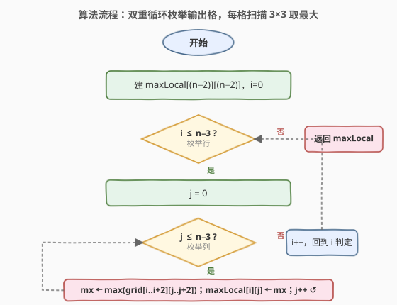
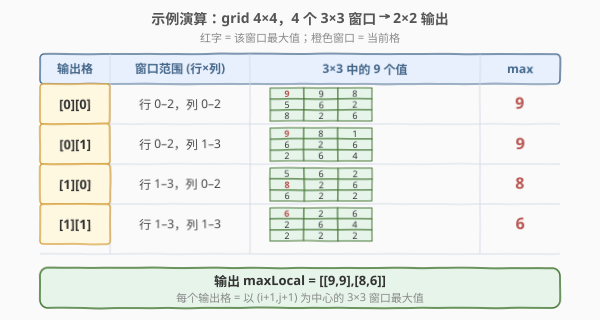

# LeetCode 矩阵中的局部最大值 题解

## 1. 题目概述

- **标题 / 题号**：矩阵中的局部最大值（#2373，easy）
- **链接**：https://leetcode.cn/problems/largest-local-values-in-a-matrix/
- **难度**：简单
- **标签**：数组、矩阵

**题意**：给你一个大小为 $n \times n$ 的整数矩阵 `grid`。生成一个大小为 $(n-2) \times (n-2)$ 的整数矩阵 `maxLocal`，其中：

- `maxLocal[i][j]` 等于 `grid` 中以第 $i+1$ 行、第 $j+1$ 列为中心的 $3 \times 3$ 矩阵中的**最大值**。

换句话说，要找出 `grid` 中每一个 $3 \times 3$ 子矩阵的最大值，按相同位置关系填入输出矩阵。

**示例 1**：

```text
输入：grid = [[9,9,8,1],[5,6,2,6],[8,2,6,4],[6,2,2,2]]
输出：[[9,9],[8,6]]
解释：原矩阵 4×4，每个 3×3 窗口取最大值，得到 2×2 输出矩阵。
```

**示例 2**：

```text
输入：grid = [[1,1,1,1,1],[1,1,1,1,1],[1,1,2,1,1],[1,1,1,1,1],[1,1,1,1,1]]
输出：[[2,2,2],[2,2,2],[2,2,2]]
解释：中心格的 2 包含在每一个 3×3 窗口中，故输出全为 2。
```

**约束**：

- $n = \text{grid.length} = \text{grid[i].length}$
- $3 \le n \le 100$
- $1 \le \text{grid[i][j]} \le 100$

> 💡 **关键量级**：$n \le 100$，输出矩阵不超过 $98 \times 98 \approx 10^4$ 格；窗口恒为 $3 \times 3$（仅 $9$ 格）。对每个输出格直接扫 $9$ 个元素取最大，总比较次数约 $9 \times 10^4$，完全无压力。

## 2. 解题思路

### 2.1 暴力思路

对每个输出位置 $(i, j)$（$0 \le i, j \le n-3$），枚举以其为中心的 $3 \times 3$ 窗口内的 $9$ 个元素，取最大值填入 `maxLocal[i][j]`。

> ⚠️ 暴力即最优。窗口大小固定为 $3 \times 3$，每个输出格扫描 $9$ 次 $\to O(9)=O(1)$，总计 $O((n-2)^2 \cdot 9) = O(n^2)$。$n=100$ 时约 $9 \times 10^4$ 次比较，常数极小，无需任何额外数据结构。本题的"考点"不在于加速，而在于把**索引映射**想清楚：输出 $(i,j)$ 的窗口中心是 `grid` 的 $(i+1, j+1)$，覆盖行 $[i, i+2]$、列 $[j, j+2]$。

### 2.2 核心观察：窗口中心落在 (i+1, j+1)

![核心观察：3×3 窗口最大值 → 输出[i][j]，中心落在 (i+1, j+1)](../images/2373_concept.svg)

输出矩阵 `maxLocal` 的尺寸比 `grid` 在每个维度上少 $2$，因为 $3 \times 3$ 窗口的中心不能落在边界（否则窗口会越界）。于是：

- 输出格 $(i, j)$ 对应 `grid` 中以 $(i+1, j+1)$ 为中心的 $3 \times 3$ 区域；
- 该区域覆盖 `grid` 的行 $[i, i+2]$、列 $[j, j+2]$，共 $9$ 个元素；
- 这 $9$ 个元素的最大值即 `maxLocal[i][j]`。

$$
\text{maxLocal}[i][j] \;=\; \max_{\substack{i \le r \le i+2 \\ j \le c \le j+2}} \text{grid}[r][c]
$$

> 💡 **边界对应**：$n \times n$ 的输入，中心可取的行/列范围是 $[1, n-2]$，共 $n-2$ 个位置，故输出为 $(n-2) \times (n-2)$。$i$ 从 $0$ 枚举到 $n-3$，$j$ 同理，恰好覆盖所有合法中心。

### 2.3 算法流程图



整体两重循环枚举输出位置，对每个位置再开两重小循环扫 $3 \times 3$：

1. 建 `maxLocal` 为 $(n-2) \times (n-2)$ 矩阵；
2. 对 $i$ 从 $0$ 到 $n-3$，对 $j$ 从 $0$ 到 $n-3$：
   1. 令 `mx` 初值为窗口内任一元素（如 `grid[i][j]`）；
   2. 对 `di`、`dj` 各取 $0,1,2$，遍历 $9$ 格，`mx = max(mx, grid[i+di][j+dj])`；
   3. `maxLocal[i][j] = mx`；
3. 返回 `maxLocal`。

### 2.4 示例演算



以示例 1 的 `grid`（$4 \times 4$）为例，输出为 $2 \times 2$，共 $4$ 个窗口：

| 输出格 | 窗口范围（行×列） | $3 \times 3$ 内 $9$ 个值 | max |
|--------|-------------------|--------------------------|-----|
| `[0][0]` | 行 0–2，列 0–2 | $9,9,8,\,5,6,2,\,8,2,6$ | $9$ |
| `[0][1]` | 行 0–2，列 1–3 | $9,8,1,\,6,2,6,\,2,6,4$ | $9$ |
| `[1][0]` | 行 1–3，列 0–2 | $5,6,2,\,8,2,6,\,6,2,2$ | $8$ |
| `[1][1]` | 行 1–3，列 1–3 | $6,2,6,\,2,6,4,\,2,2,2$ | $6$ |

> ⚠️ **易错点**：注意窗口中心是 $(i+1, j+1)$ 而非 $(i, j)$。若误把输出 $(i,j)$ 直接当作中心，会漏掉一整行/列，覆盖范围变成 $[i, i+2] \times [j, j+2]$ 之外的错误区域——其实覆盖范围写对了（就是 $[i,i+2]\times[j,j+2]$），关键是别把"中心"和"左上角"混淆。输出左上角 $(0,0)$ 对应的窗口左上角也是 `grid` 的 $(0,0)$，中心却是 $(1,1)$。

最终输出：

```text
[[9,9],
 [8,6]]
```

## 3. 参考代码

### C++

```cpp
class Solution {
public:
    vector<vector<int>> largestLocal(vector<vector<int>>& grid) {
        int n = grid.size();
        vector<vector<int>> res(n - 2, vector<int>(n - 2));
        for (int i = 0; i <= n - 3; ++i) {
            for (int j = 0; j <= n - 3; ++j) {
                int mx = grid[i][j];
                for (int di = 0; di < 3; ++di)
                    for (int dj = 0; dj < 3; ++dj)
                        mx = max(mx, grid[i + di][j + dj]);
                res[i][j] = mx;
            }
        }
        return res;
    }
};
```

### Python

```python
class Solution:
    def largestLocal(self, grid: List[List[int]]) -> List[List[int]]:
        n = len(grid)
        res = [[0] * (n - 2) for _ in range(n - 2)]
        for i in range(n - 2):
            for j in range(n - 2):
                res[i][j] = max(grid[r][c]
                                for r in range(i, i + 3)
                                for c in range(j, j + 3))
        return res
```

> 💡 **写法对照**：
> - C++ 用四重循环（两重枚举输出格 + 两重扫 $3 \times 3$），`mx` 初值取 `grid[i][j]` 省一次比较；
> - Python 借生成器表达式一行 `max` 搞定 $9$ 元素取最大，可读性极佳；也可用切片 `max(max(row[j:j+3]) for row in grid[i:i+3])`，但生成器更直白。
>
> ⚠️ **索引防越界**：`i`、`j` 上界为 $n-3$（含），故 `i+2`、`j+2` 最大到 $n-1$，恰好不越界。循环条件写 `i <= n - 3`（C++）或 `range(n - 2)`（Python，取值 $0..n-3$）等价。

## 4. 复杂度分析

| 维度 | 复杂度 | 说明 |
|------|--------|------|
| 时间复杂度 | $O(n^2)$ | 共 $(n-2)^2$ 个输出格，每格扫 $9$ 个元素，常数 $9$ 视作 $O(1)$；$n=100$ 时约 $9\times10^4$ 次比较 |
| 空间复杂度 | $O(n^2)$ | 输出矩阵 $(n-2)^2$ 规模（不计输出则 $O(1)$ 额外空间） |

## 5. 扩展：更大的窗口该怎么做？

本题窗口恒为 $3 \times 3$，朴素扫描已是最简且最优。但若把窗口推广为 $k \times k$（$k$ 较大），朴素法变为 $O(n^2 k^2)$，需要更优的结构。

### 5.1 二维滑动窗口最大值（单调双端队列）

把 $k \times k$ 最大值拆成**先沿行、再沿列**两次一维滑动窗口最大值：

1. **行方向**：对 `grid` 每一行做长度为 $k$ 的滑动窗口最大值，得到中间矩阵 `rowMax`（仍是 $n \times n$，但每格是该行内某 $k$ 长窗口最大值）；
2. **列方向**：对 `rowMax` 每一列做长度为 $k$ 的滑动窗口最大值，得到最终结果。

每一步用**单调双端队列**（维护递减序列，队首即窗口最大），单次 $O(1)$ 摊还。总体 $O(n^2)$，与 $k$ 无关。一维版即经典题 [239. 滑动窗口最大值](https://leetcode.cn/problems/sliding-window-maximum/)。

> 💡 **为何行列可拆**：$\max$ 满足结合律，$\max_{r,c}$ 可改写为先对行取 $\max$、再对列取 $\max$，两次一维滑窗叠加等价于一次二维滑窗。换成功率和则对应**二维前缀和**（[304](https://leetcode.cn/problems/range-sum-query-2d-immutable/)）的行列可拆性。

### 5.2 二维稀疏表（ST 表，静态 RMQ）

若矩阵**不可变**且需**多次任意矩形区域查询最大值**，可用二维 ST 表：预处理 $O(n^2 \log n \log n)$，单次查询 $O(1)$。适合"预建表 + 大量查询"场景（如 [304. 二维区域和检索](https://leetcode.cn/problems/range-sum-query-2d-immutable/) 的最大值版本）。本题只查固定 $3\times3$、$k$ 又小，无此必要。

> ⚠️ **何时真需要优化**：仅当 $k$ 较大（如 $k \sim n$）或矩阵规模到 $10^3$ 以上、朴素 $O(n^2 k^2)$ 逼近 $10^8$ 时才考虑单调队列。$n \le 100$、$k=3$ 的本题，朴素四重循环是最优且最简洁的解。

## 6. 面试要点

1. **输出矩阵的尺寸为什么是 $(n-2) \times (n-2)$？**

   - $3 \times 3$ 窗口的中心不能落在第 $0$ 行/列或第 $n-1$ 行/列（否则窗口越界）。合法中心范围是行 $[1, n-2]$、列 $[1, n-2]$，各 $n-2$ 个，故输出为 $(n-2) \times (n-2)$。

2. **输出 $(i, j)$ 对应 `grid` 中哪些坐标？**

   - 中心是 $(i+1, j+1)$，窗口覆盖行 $[i, i+2]$、列 $[j, j+2]$，共 $9$ 个元素。等价地说：输出左上角 $(0,0)$ 的窗口左上角就是 `grid` 的 $(0,0)$。

3. **为什么朴素 $O(n^2 \cdot 9)$ 就是最优解？**

   - $9$ 是常数，每个输出格必须读到自己窗口内全部 $9$ 个元素才能确定最大值，信息量下界就是 $O(1)$ 每格。常数已极小、$n \le 100$ 数据量小，任何额外结构（单调队列、ST 表）都只会增加常数与代码复杂度，得不偿失。

4. **$k=3$ 固定时，单调队列反而更慢吗？**

   - 是。单调队列每格摊还 $O(1)$，但常数（入队出队判断、两次行列扫描）远大于直接扫 $9$ 格。$k=3$ 时朴素法每格只 $9$ 次比较，已是理论最小常数；单调队列的优势只在 $k$ 较大（如 $k \sim n/2$）时才体现。

5. **能否原地修改 `grid` 节省空间？**

   - 可以把结果写回 `grid` 的左上 $(n-2)\times(n-2)$ 区域并 `resize`，省掉输出矩阵空间（仍 $O(1)$ 额外）。但会破坏输入、可读性差，工程上一般不推荐；面试中作为"空间优化"思路提及即可。

> 💡 **一句话总结**：2373 是"矩阵 $3\times3$ 局部聚合"的入门题——双重循环枚举输出格、每格扫 $9$ 元素取最大，$O(n^2)$ 时间 $O(1)$ 额外空间。核心是理清中心 $(i+1,j+1)$ 与窗口 $[i,i+2]\times[j,j+2]$ 的索引映射；进阶可推广到 $k\times k$ 单调队列二维滑窗。

## 同类练习题

| # | 题目 | 与本题的关联 |
|---|------|-------------|
| 661 | [图片平滑器](https://leetcode.cn/problems/image-smoother/)（[题解](../0601-0700/661_图片平滑器.md)） | 把本题的"取最大"换成"取平均"，同为 $3\times3$ 邻域聚合，是本题最直接的姊妹题 |
| 239 | [滑动窗口最大值](https://leetcode.cn/problems/sliding-window-maximum/)（[题解](../0201-0300/239_滑动窗口最大值.md)） | 一维滑动窗口最大值的单调双端队列模板，二维 $k\times k$ 推广的行/列扫描基础 |
| 304 | [二维区域和检索 - 数组不可变](https://leetcode.cn/problems/range-sum-query-2d-immutable/)（[题解](../0301-0400/304_二维区域和检索 - 数组不可变.md)） | 二维矩形区域聚合（求和版），对照"窗口恒定 vs 任意矩形"与"前缀和 vs 单调队列"两条不同优化路线 |
| 378 | [有序矩阵中第 K 小的元素](https://leetcode.cn/problems/kth-smallest-element-in-a-sorted-matrix/)（[题解](../0301-0400/378_有序矩阵中第K小的元素.md)） | 同为矩阵 + 二分/堆套路题，对照"矩阵局部极值"与"矩阵全局第 k 小"的思路差异 |
