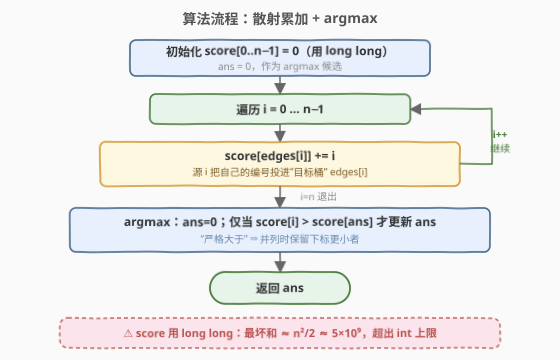

# 边积分最高的节点

- **题目名称**：边积分最高的节点
- **链接**：[2374. 边积分最高的节点](https://leetcode.cn/problems/node-with-highest-edge-score/)
- **难度**：中等
- **标签**：图、数组、计数

## 1. 题目概述

给你一个有向图，$n$ 个节点编号 $0$ 到 $n-1$，其中每个节点**恰有一条出边**。图用一个长度为 $n$、下标从 $0$ 开始的数组 `edges` 表示：`edges[i]` 表示节点 $i$ 到节点 `edges[i]` 之间有一条有向边。

节点 $i$ 的**边积分**定义为：所有"存在一条指向节点 $i$ 的边"的节点的**编号总和**。返回边积分最高的节点；若多个节点并列，返回编号**最小**的那个。

**示例 1**：

```text
输入：edges = [1,0,0,0,0,7,7,5]
输出：7
解释：
- 节点 1、2、3、4 都指向节点 0，节点 0 的边积分 = 1+2+3+4 = 10。
- 节点 0 指向节点 1，节点 1 的边积分 = 0。
- 节点 7 指向节点 5，节点 5 的边积分 = 7。
- 节点 5、6 都指向节点 7，节点 7 的边积分 = 5+6 = 11。
节点 7 边积分最高，返回 7。
```

**示例 2**：

```text
输入：edges = [2,0,0,2]
输出：0
解释：
- 节点 1、2 都指向节点 0，节点 0 的边积分 = 1+2 = 3。
- 节点 0、3 都指向节点 2，节点 2 的边积分 = 0+3 = 3。
节点 0 与 2 并列 3，返回编号更小的 0。
```

**约束条件**：

- $n = \text{edges.length}$
- $2 \le n \le 10^5$
- $0 \le \text{edges[i]} < n$
- $\text{edges[i]} \ne i$（无自环）

> 💡 **关键观察**：边积分是"**谁指向我**"的编号之和。由于每个节点恰有一条出边，每个源 $i$ 必定、且只贡献给**唯一**目标 $\text{edges}[i]$。于是把视角从"对每个目标 $v$ 找所有指向 $v$ 的源"翻转成"对每个源 $i$，把 $i$ 投进 $\text{edges}[i]$ 这个桶"——一次遍历即可累加完所有积分。

---

## 2. 解题思路

### 2.1 暴力思路：对每个目标扫描所有源

最直白的做法：对每个目标节点 $v$，遍历所有 $i\in[0,n)$，若 $\text{edges}[i]==v$ 则 $\text{score}[v]\mathrel{+}=i$。

$$T = O(n^2)$$

$n\le10^5$ 时高达 $10^{10}$ 量级，TLE。

> ⚠️ 暴力的浪费在于：每个源 $i$ 其实"**知道自己指向谁**"，却被反复"询问是否指向 $v$"。把"以目标为中心反复扫"翻转为"以源为中心一次投递"，即可把 $O(n^2)$ 压成 $O(n)$。

### 2.2 核心观察：反向累加（散射到桶）

![核心观察：每个源 i 把编号投进 edges[i] 桶，一次遍历累加完所有边积分](../images/2374_concept.svg)

记 $\text{score}[v]$ = 指向 $v$ 的源编号之和。由于每点恰一条出边，源 $i$ 必贡献且仅贡献给 $\text{edges}[i]$，故：

$$
\text{score}[\text{edges}[i]] \mathrel{+}= i \qquad (i=0,1,\dots,n-1)
$$

遍历一遍 $i$ 执行上式，每个源恰好被处理一次，总加法次数 $=n$。再扫一遍 $\text{score}$ 取 $\arg\max$（并列取最小下标）即得答案。

> ⚠️ **溢出**：最坏所有节点都指向同一节点 $v$，$\text{score}[v]$ 可达 $0+1+\cdots+(n-1) = \dfrac{n(n-1)}{2} \approx 5\times10^9$，超出 32 位 `int` 上限（约 $2.1\times10^9$）。C++ 必须用 `long long`；Python 整数任意精度，无此虑。

> 💡 **与 2360 的对照**：同样是"每点恰一条出边"的**函数图**。[2360. 图中的最长环](../2301-2400/2360_图中的最长环.md) 利用**出边方向**做"命运分析"（沿出边走找环），本题利用**入边方向**做"贡献分析"（把源编号投进目标桶）——同一图模型的两个正交视角，恰好对应"反向累加"的两个面。

### 2.3 算法流程图



1. **初始化**：`score[0..n-1]=0`（用 `long long`），`ans=0` 作 argmax 候选。
2. **散射累加**：遍历 $i=0\dots n-1$，执行 `score[edges[i]] += i`。
3. **取 argmax**：遍历 $i$，仅当 $\text{score}[i] > \text{score}[\text{ans}]$（严格大于）才更新 `ans=i`。
4. **返回** `ans`。

### 2.4 示例演算

![示例 1 演算：每个 i 投进 edges[i] 桶，score[0]=10、score[5]=7、score[7]=11 最高](../images/2374_example_walkthrough.svg)

以示例 1 `edges=[1,0,0,0,0,7,7,5]` 为例，`score` 初值全 $0$：

| 步 $i$ | $\text{edges}[i]$（目标桶） | 操作 | 该桶累加结果 |
|--------|------------------------------|------|--------------|
| 0 | 1 | $\text{score}[1]\mathrel{+}=0$ | $\text{score}[1]=0$ |
| 1 | 0 | $\text{score}[0]\mathrel{+}=1$ | $\text{score}[0]=1$ |
| 2 | 0 | $\text{score}[0]\mathrel{+}=2$ | $\text{score}[0]=3$ |
| 3 | 0 | $\text{score}[0]\mathrel{+}=3$ | $\text{score}[0]=6$ |
| 4 | 0 | $\text{score}[0]\mathrel{+}=4$ | $\text{score}[0]=10$ |
| 5 | 7 | $\text{score}[7]\mathrel{+}=5$ | $\text{score}[7]=5$ |
| 6 | 7 | $\text{score}[7]\mathrel{+}=6$ | $\text{score}[7]=11$ |
| 7 | 5 | $\text{score}[5]\mathrel{+}=7$ | $\text{score}[5]=7$ |

最终 $\text{score}=[10,0,0,0,0,7,0,11]$。扫一遍取 $\arg\max$：$\text{score}[7]=11$ 最高 $\Rightarrow$ 返回 $7$ ✓。

> 💡 **示例 2 为何返回 $0$**：`edges=[2,0,0,2]`，$\text{score}[0]=1+2=3$、$\text{score}[2]=0+3=3$ 并列。argmax 从 `ans=0` 起，仅严格大于才更新：扫到 $i=2$ 时 $\text{score}[2]=3$ 不大于 $\text{score}[0]=3$，不更新，故保留更小的 $0$。

---

## 3. 参考代码

### C++

```cpp
class Solution {
public:
    int edgeScore(vector<int>& edges) {
        int n = edges.size();
        vector<long long> score(n, 0);          // long long 防溢出
        for (int i = 0; i < n; i++)
            score[edges[i]] += i;                // 源 i 投编号进目标桶
        int ans = 0;
        for (int i = 1; i < n; i++)
            if (score[i] > score[ans])           // 严格大于 ⇒ 并列保最小下标
                ans = i;
        return ans;
    }
};
```

> 💡 argmax 从 `ans=0` 起且仅在**严格大于**时更新，天然保留并列中最小下标。`score` 用 `long long` 防止 $\approx 5\times10^9$ 溢出；返回值是下标，仍是 `int`。

### Python

```python
class Solution:
    def edgeScore(self, edges: List[int]) -> int:
        n = len(edges)
        score = [0] * n
        for i, t in enumerate(edges):
            score[t] += i                        # 源 i 投编号进目标桶
        ans = 0
        for i in range(1, n):
            if score[i] > score[ans]:            # 严格大于 ⇒ 并列保最小下标
                ans = i
        return ans
```

> 💡 Python 整数无溢出之忧。也可一行写 `return max(range(n), key=score.__getitem__)`：`max` 遇并列返回**首个**最大元素，而 `range(n)` 升序，故恰为最小下标——但显式 `if score[i] > score[ans]` 更直白地体现"严格大于保最小"的判定，与流程图一致，面试更易讲清。

---

## 4. 复杂度分析

| 维度 | 复杂度 | 说明 |
|------|--------|------|
| **时间复杂度** | $O(n)$ | 第一遍遍历 $n$ 次累加；第二遍 $n$ 次找 argmax；共 $\sim 2n$ |
| **空间复杂度** | $O(n)$ | `score` 数组 $O(n)$；输入 `edges` 引用复用，不复制 |

> 💡 暴力 $O(n^2)$ 与本解 $O(n)$ 的差距，源于把"以目标为中心反复扫源"重构成"以源为中心一次投递"。每个节点恰一条出边的确定性，让每个源恰贡献一次，散射累加即成。

---

## 5. 扩展：为何"每点恰一条出边"是 $O(n)$ 的关键

- **出边数决定累加次数**：若每个节点可有多条出边（一般有向图），"每个源 $i$ 投递到 $\text{edges}[i]$"仍成立（只是 $i$ 可能投递到多个目标），总投递次数 = 总边数 $m$，复杂度 $O(n+m)$。本题 $m$ 恰 $=n$（每点一条）$\Rightarrow O(n)$。
- **"散射到桶 + 全局最值"是经典范式**：本题的 key $=\text{edges}[i]$（目标），聚合算子 $=$ 求和。推广到"按任意 key 分组求和/计数/取最大"，见 [2342](../2301-2400/2342_数位和相等数对的最大和.md) 与 [1399](../1301-1400/1399_统计最大组的数目.md)。
- **带权变体**：若边带权（贡献不是 $i$ 而是 $w[i]$），只需 $\text{score}[\text{edges}[i]] \mathrel{+}= w[i]$，骨架不变；只影响溢出上界（按 $w$ 总和估）。
- **省掉第二遍扫描**：可边累加边维护一个候选 max——仅当某桶更新后 $\text{score}[t]>\text{score}[\text{ans}]$ 才更新 `ans`，省去末尾的 $O(n)$ 扫描。但 $n=10^5$ 两遍无妨，且单写 argmax 循环更不易错。

---

## 6. 面试要点

1. **边积分是"指向我的源编号之和"，怎么 $O(n)$ 求？**

   - 翻转视角：不问"谁指向 $v$"，而对每个源 $i$ 直接 $\text{score}[\text{edges}[i]]\mathrel{+}=i$。每点恰一条出边 $\Rightarrow$ 每源恰贡献一次 $\Rightarrow$ 共 $n$ 次加法。

2. **为什么必须用 `long long`？**

   - 最坏所有源指向同一节点，$\text{score}\approx\dfrac{n(n-1)}{2}\approx5\times10^9$，超 32 位 `int` 上限（$\sim2.1\times10^9$）。C++ 用 `long long`；Python 无此虑。

3. **并列取最小下标怎么实现？**

   - argmax 从 `ans=0` 起，仅当**严格大于**（$\text{score}[i]>\text{score}[\text{ans}]$）才更新。等于不更新 $\Rightarrow$ 保留更小下标。注意是 `>` 不是 `>=`。

4. **如果每个节点可有多条出边呢？**

   - 骨架不变，遍历所有 $(i,\text{target})$ 对累加，总次数 $=$ 边数 $m$，复杂度 $O(n+m)$。本题约束"恰一条"只是把 $m$ 钉成 $n$。

5. **能否原地优化空间到 $O(1)$？**

   - 不能。$\text{score}$ 必须为每个目标存累加值以供后续 argmax，无法低于 $O(n)$。但可边累加边维护候选 max 省掉第二遍扫描（见第 5 节），不过 $n=10^5$ 两遍也完全无妨。

> 💡 **一句话总结**：2374 是"反向累加 + argmax"——每个源 $i$ 把自己编号投进 $\text{edges}[i]$ 桶，一次 $O(n)$ 散射累加后再扫一遍取最大，并列取最小下标。注意 `long long` 防溢出。

---

## 7. 同类练习题

- [2360. 图中的最长环](../2301-2400/2360_图中的最长环.md)：同是"每点恰一条出边"的函数图，2360 利用**出边方向**找环（命运分析），本题利用**入边方向**做积分累加（贡献分析），同一图模型的两个正交视角
- [2342. 数位和相等数对的最大和](../2301-2400/2342_数位和相等数对的最大和.md)：同为"按 key 分桶聚合"范式——以数位和为桶键、维护桶内最大两值求最大配对和，对照本题以 $\text{edges}[i]$ 为桶键求和
- [1399. 统计最大组的数目](../1301-1400/1399_统计最大组的数目.md)：按数位和分桶计数，再统计最大桶的个数；同"分桶聚合 + 全局最值"骨架，聚合算子从"求和"换成"计数"
- [1748. 唯一元素的和](../1701-1800/1748_唯一元素的和.md)：先按值分桶计频，再对频次为 $1$ 的桶求和；同"一次遍历散射到桶 + 二次扫描聚合"两阶段范式
- [2341. 数组能形成多少数对](../2301-2400/2341_数组能形成多少数对.md)：按值分桶计频后凑对、剩余单元素计数；同"散射到桶 + 桶上聚合"的计数型变体
