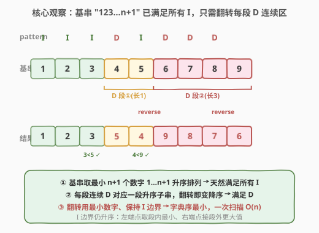
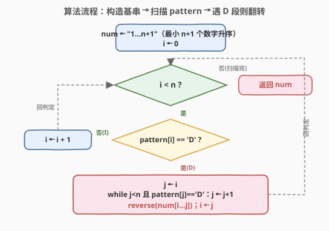
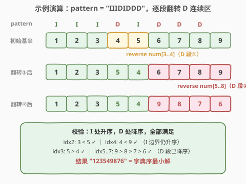

# LeetCode 根据模式串构造最小数字 题解

## 1. 题目概述

- **标题 / 题号**：根据模式串构造最小数字（#2375，medium）
- **链接**：https://leetcode.cn/problems/construct-smallest-number-from-di-string/
- **难度**：中等
- **标签**：贪心、字符串、双指针

**题意**：给你下标从 $0$ 开始、长度为 $n$ 的字符串 `pattern`，它只含两种字符：`'I'` 表示**上升**（Increase），`'D'` 表示**下降**（Decrease）。

需要构造一个长度为 $n+1$ 的字符串 `num`，满足：

- `num` 的字符取自 `'1'` 到 `'9'`，每个数字**至多**使用一次；
- 若 `pattern[i] == 'I'`，则 `num[i] < num[i+1]`；
- 若 `pattern[i] == 'D'`，则 `num[i] > num[i+1]`。

返回满足条件的**字典序最小**的 `num`。

**示例 1**：

```text
输入：pattern = "IIIDIDDD"
输出："123549876"
解释：
  下标 0,1,2,4 处需 num[i] < num[i+1]；下标 3,5,6,7 处需 num[i] > num[i+1]。
  "123549876" 满足全部约束且字典序最小。
  （"123414321" 不合法：'1' 用了超过 1 次。）
```

**示例 2**：

```text
输入：pattern = "DDD"
输出："4321"
解释：4>3>2>1，对应 DDD，且为字典序最小解。
```

**约束**：

- $1 \le \text{pattern.length} \le 8$
- `pattern` 只包含字符 `'I'` 和 `'D'`

> 💡 **关键量级**：`n \le 8`，`num` 长度 $\le 9$，恰可由 `'1'` 到 `'9'` 各取一个填满。极小的 $n$ 意味着回溯也能过，但存在 $O(n)$ 的**构造法**——把"求最小排列"翻译成"基串 + 翻转 D 段"，一次扫描即得。

## 2. 解题思路

### 2.1 暴力思路：回溯逐位填数

最直白的做法是**回溯**：从左到右逐位填数字，每位从 `'1'` 试到 `'9'`，跳过已用数字，并即时校验与前一位的 I/D 关系，不一致就剪枝回溯。由于按 `'1'→'9'` 升序尝试，**第一个填满的合法解就是字典序最小**。

$n \le 8$ 时搜索树极浅，配合剪枝可秒过。但它的本质是"枚举 + 验证"——把"如何满足 D 段"这个结构问题丢给了搜索，常数大、不够本质。

> ⚠️ 回溯的浪费在于：它没有利用"基串"这个免费的最优起点。事实上 `'1''2'…'n+1'` 升序排列已经是所有 $n+1$ 位不同数字串中**字典序最小**的，且**天然满足所有 I 关系**——只差把 D 段"扳过来"。一旦看到这一点，搜索就完全多余了。

### 2.2 核心观察：基串升序满足 I，翻转 D 连续段即满足 D



记 $n = \text{len}(\text{pattern})$，`num` 长 $n+1$。构造分三步：

**① 基串取最小**：令 `num = "123…(n+1)"`，即用最小的 $n+1$ 个数字 `'1'..'n+1'` 升序排列。它是所有合法候选中字典序最小的"骨架"，且处处严格递增，**自动满足全部 `I` 约束**（$num[i] < num[i+1]$）。

**② D 段需递减**：对一段连续的 `'D'`（设 `pattern[i..j]` 全为 `'D'`），要求 $num[i] > num[i+1] > \cdots > num[j+1]$，即这 $j-i+2$ 个位置必须**严格递减**。而在基串里它们本是 $i\!+\!1, i\!+\!2, \dots, j\!+\!2$（递增）——**翻转**这段子串即变递减，恰好满足。

**③ 翻转不改值集、不扰 I 边界**：翻转 `num[i..j+1]` 后，该段的**值集合不变**（仍是 $\{i\!+\!1,\dots,j\!+\!2\}$），只是顺序由升变降。段内自然递减（满足 D）；段与段之间被 `I` 隔开，翻转前后边界值的大小关系不变：

> ⚠️ **I 边界安全的证明**：设 D 段覆盖位置 $[i, j+1]$，翻转后 $num[i] = j\!+\!2$（段内最大），$num[j\!+\!1] = i\!+\!1$（段内最小）。若段前有 I（位置 $i\!-\!1 \to i$），则 $num[i\!-\!1] \le i < j\!+\!2 = num[i]$，成立；若段后有 I（位置 $j\!+\!1 \to j\!+\!2$），则 $num[j\!+\!1] = i\!+\!1 < j\!+\!3 \le num[j\!+\!2]$，成立。各 D 段互不相邻、互不干扰。

> 💡 **为什么翻转后仍字典序最小？** 因为翻转是"最小改动"——只动必须动的位置（D 段），且只做最小限度的重排（翻转而非任意排列）。每段翻转后值集合与基串相同，只是升变降；更靠前的 I 段位置完全未动，保持基串的最小值。故整体仍是字典序最小的合法解。

### 2.3 算法流程图



整体只扫一遍 `pattern`，维护结果串 `num` 与游标 $i$：

1. 初始化 `num = "123…(n+1)"`，$i = 0$；
2. 若 $i \ge n$，扫描结束，返回 `num`；
3. 若 `pattern[i] == 'I'`，无需操作，$i \mathrel{+}= 1$（基串此处已升序）；
4. 若 `pattern[i] == 'D'`：向右扩展 $j$ 直到 D 段末尾（`pattern[j] != 'D'` 或 $j = n$），翻转 `num[i..j]`（注意翻转区间比 D 段长 1），令 $i = j$；
5. 回到第 2 步。

### 2.4 示例演算



以 `pattern = "IIIDIDDD"`（$n=8$，`num` 长 9）为例：

| 步 | 操作 | num 状态 | 说明 |
|----|------|----------|------|
| 0 | 初始化基串 | `123456789` | 取最小 9 个数字升序排列 |
| 1 | 翻转 D 段① `num[3..4]`（"45"） | `123546789` | 单个 D，"45"→"54"，$5>4$ 满足 |
| 2 | 翻转 D 段② `num[5..8]`（"6789"） | `123549876` | 连续 3 个 D，"6789"→"9876"，$9>8>7>6$ 满足 |

**校验**：

- I 处：$idx2: 3<5$ ✓、$idx4: 4<9$ ✓（翻转后 I 边界仍升序）；
- D 处：$idx3: 5>4$ ✓、$idx5..7: 9>8>7>6$ ✓（D 段已降序）。

结果 `"123549876"`，与示例输出一致。

> ⚠️ **直觉陷阱**：不要"贪心地从左到右能填小就填小"而忽略 D 段的长度。如本例初始的 D 段②长度为 3，意味着位置 5 必须至少是 `'9'`（要能放下 3 个比它小的后续值）——基串在这里放 `'6'` 是错的，必须靠翻转把 `'9'` 顶到位置 5。"先建升序基串再翻转 D 段"恰好自动完成了这一"顶大数"动作，无需手动预估。

## 3. 参考代码

### C++

```cpp
class Solution {
public:
    string smallestNumber(string pattern) {
        int n = pattern.size();
        string num;
        for (int i = 0; i <= n; ++i) num.push_back('1' + i);   // 基串 "123…n+1"
        int i = 0;
        while (i < n) {
            if (pattern[i] == 'D') {
                int j = i;
                while (j < n && pattern[j] == 'D') ++j;       // 扩展到 D 段末尾
                reverse(num.begin() + i, num.begin() + j + 1); // 翻转 num[i..j]
                i = j;
            } else {
                ++i;                                           // 'I'：基串已升序，跳过
            }
        }
        return num;
    }
};
```

### Python

```python
class Solution:
    def smallestNumber(self, pattern: str) -> str:
        n = len(pattern)
        num = list("123456789"[:n + 1])          # 基串
        i = 0
        while i < n:
            if pattern[i] == 'D':
                j = i
                while j < n and pattern[j] == 'D':
                    j += 1                       # 扩展到 D 段末尾
                num[i:j + 1] = reversed(num[i:j + 1])  # 翻转 num[i..j]
                i = j
            else:
                i += 1                            # 'I'：跳过
        return "".join(num)
```

> ⚠️ **两个易错点**：
> 1. **翻转区间比 D 段长 1**。D 段 `pattern[i..j-1]`（长度 $j-i$）对应位置 $[i, j]$（共 $j-i+1$ 个数字），所以翻转的是 `num[i..j]` 而非 `num[i..j-1]`。少翻一位会漏掉段尾，D 关系不闭合。
> 2. **基串长度恰好 $n+1$**。`"123456789"[:n+1]` 取前 $n+1$ 个字符；C++ 用 `'1' + i` 生成，$i \le n \le 8$ 保证 $\le '9'$，不会越界。题目保证 $n \le 8$ 正是为了让 $1..n+1 \le 9$ 始终合法。
>
> 💡 `reversed` 返回迭代器，切片赋值 `num[i:j+1] = reversed(...)` 是原地翻转，$O(\text{段长})$；C++ `std::reverse` 同理。各位置至多被翻转一次，总翻转成本 $O(n)$。

## 4. 复杂度分析

| 维度 | 复杂度 | 说明 |
|------|--------|------|
| 时间复杂度 | $O(n)$ | 每个位置至多被扫描一次、翻转一次；翻转总工作量 $\le n$，故整体线性 |
| 空间复杂度 | $O(n)$ | 存结果串 `num`（长 $n+1$）；若不计输出则 $O(1)$ 额外空间 |

## 5. 扩展：栈法 —— 一次遍历完成翻转

"找 D 段 + 翻转"也可用**栈**优雅地合并成一次遍历：栈的 LIFO 特性天然把 D 连续段逆序输出。

```
val = 1, res = [], stack = []
for i in 0..n:                 # 多走一步到 n，处理末尾
    stack.append(val); val += 1
    if i == n or pattern[i] == 'I':
        while stack: res.append(stack.pop())   # D 段逆序弹出
return res
```

- `D` 段的值被依次压栈（如 $1,2,3$），遇到 `I` 一次性弹出 → 弹出顺序 $3,2,1$，恰好是翻转；
- `I` 位置的值压入后立即弹出（栈中只有自己），保持原序。

> 💡 **三种实现对照**：
>
> | 实现 | 思路 | 时间 | 备注 |
> |------|------|------|------|
> | 基串 + reverse | 先建升序基串，扫到 D 段就翻转 | $O(n)$ | 本题主解，直观 |
> | 栈法（遇 I 弹栈） | 压栈 + LIFO 自动逆序 | $O(n)$ | 与 [484](../0401-0500/484_寻找排列.md) 同款，一气呵成 |
> | 回溯 + 剪枝 | 升序试数 + I/D 校验 | 最坏指数，$n\le8$ 可过 | 枚举思路，便于对照 |
>
> 三者**等价**：基串翻转法是栈法的"展开版"——栈法把"先升序排列再翻转"折叠进单次遍历，二者产出的字典序最小解完全一致。

## 6. 面试要点

1. **为什么基串取 `"123…n+1"` 而不是任意升序串？**

   - 字典序由高位决定。`num` 长 $n+1$ 且各数字不同，要让整体最小，应让每一位尽可能小。`'1','2',…,'n+1'` 是从 `'1'` 起的前 $n+1$ 个最小数字，升序排列后第 $i$ 位取 $i\!+\!1$ 已是该位的下界（更小的数字要么在前位用过、要么会破坏后续 D 段所需的大数）。故基串是合法解的字典序最小"骨架"。

2. **翻转 D 段后为什么 I 边界仍成立？**

   - D 段 $[i, j\!+\!1]$ 翻转后 $num[i]=j\!+\!2$（段内最大）、$num[j\!+\!1]=i\!+\!1$（段内最小）。段前若有 I：$num[i\!-\!1] \le i < j\!+\!2 = num[i]$；段后若有 I：$num[j\!+\!1] = i\!+\!1 < j\!+\!3 \le num[j\!+\!2]$。两侧都天然成立，因为翻转不改值集、只改顺序，而 I 比较的是"段内极值 vs 段外更大/更小值段"。

3. **翻转区间为什么比 D 段长 1？**

   - $k$ 个连续 D 约束 $k+1$ 个相邻位置，需 $k+1$ 个数递减。D 段 `pattern[i..j-1]`（$k=j-i$ 个 D）对应位置 $[i, j]$（$k+1$ 个数），故翻转 `num[i..j]`。少翻一位会漏掉段尾，最后那个 D 关系不闭合。

4. **`n = 8`（上界）时基串用到的最大数字是几？会越界吗？**

   - `num` 长 $9$，基串 `"123456789"`，最大数字 `'9'`，恰是允许的上界。题目把 $n$ 限制到 $\le 8$ 正是为此——保证 $1..n+1 \le 9$，基串永远合法、无需借用更大的数字。

5. **与 [942. 增减字符串匹配](../0901-1000/942_增减字符串匹配.md) 有何区别？**

   - 942 用 $[0, n]$ 构造**任意一个**合法排列（不要求字典序最小），贪心双指针"I 取小、D 取大"即可。2375 要求**字典序最小**且用数字 `1-9`，需更精细的构造——基串取最小、再翻转 D 段。942 是"任一解"的弱化版，2375（与会员题 484）是"最小解"的强化版，二者构造法一脉相承。

> 💡 **一句话总结**：2375 的核心是"基串 `1..n+1` 升序满足所有 I + 翻转每段连续 D"——一次扫描 $O(n)$ 时间、$O(n)$ 空间，翻转区间比 D 段长 1，I 边界天然安全。

## 同类练习题

| # | 题目 | 与本题的关联 |
|---|------|-------------|
| 942 | [增减字符串匹配](https://leetcode.cn/problems/di-string-match/)（[题解](../0901-1000/942_增减字符串匹配.md)） | DI 串构造**任意**合法排列（用 $[0,n]$），贪心双指针"I 取小、D 取大"，2375 的弱化版 |
| 484 | [寻找排列](https://leetcode.cn/problems/find-permutation/)（[题解](../0401-0500/484_寻找排列.md)） | DI 串构造字典序最小排列（用 $[1,n]$），栈法"遇 I 弹栈逆序输出"，与本题翻转法等价、同款强化版 |
| 31 | [下一个排列](https://leetcode.cn/problems/next-permutation/)（[题解](../0001-0100/31_下一个排列.md)） | 原地求字典序下一排列，翻转后缀是其核心步骤，对照"翻转"这一原语的不同用途 |
| 60 | [第 k 个排列](https://leetcode.cn/problems/permutation-sequence/)（[题解](../0001-0100/60_第k个排列.md)） | 按字典序枚举第 $k$ 个排列，康托尔展开解码，对照"构造特定字典序排列"的另一思路 |
| 46 | [全排列](https://leetcode.cn/problems/permutations/)（[题解](../0001-0100/46_全排列.md)） | 回溯枚举全排列的母题，对照本题"回溯暴力 → 贪心构造"的优化跃迁 |
