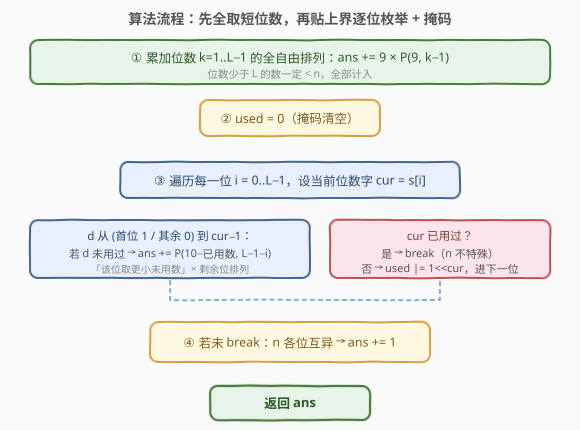
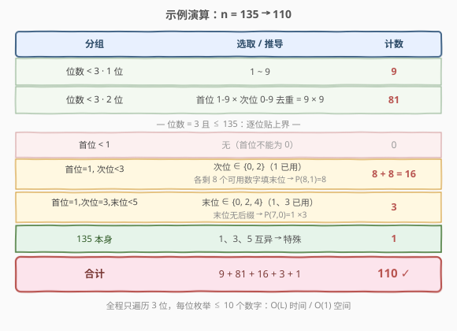

# LeetCode 统计特殊整数 题解

## 1. 题目概述

- **标题 / 题号**：统计特殊整数（#2376，hard）
- **链接**：https://leetcode.cn/problems/count-special-integers/
- **难度**：困难
- **标签**：数学、数位 DP、动态规划、位运算

**题意**：如果一个正整数**每一个数位都互不相同**，称它为**特殊整数**。给定正整数 `n`，返回 `[1, n]` 之间特殊整数的数目。

**示例 1**：

```text
输入：n = 20
输出：19
解释：1 到 20 之间所有整数除了 11 以外都是特殊整数，共 19 个。
```

**示例 2**：

```text
输入：n = 5
输出：5
解释：1 到 5 所有整数都是特殊整数。
```

**示例 3**：

```text
输入：n = 135
输出：110
解释：从 1 到 135 共 110 个特殊整数，不特殊的为 22、114、131。
```

**约束**：

- $1 \le n \le 2 \times 10^9$

> ⚠️ $n$ 最高 $2 \times 10^9$（10 位十进制数），逐个枚举 $O(n \log n)$ 必然超时。但十进制位数 $L \le 10$，每位的取值只受「上界」与「已用数字集合」两重约束——这是典型的**数位 DP** 场景，把线性枚举压缩为对数级状态转移。

## 2. 解题思路

### 2.1 暴力思路：逐个数检查去重

最直白做法：遍历 $i \in [1, n]$，把 $i$ 转字符串判各位是否互异，命中则计数。

```text
ans = 0
for i in 1..n:
    if len(set(str(i))) == len(str(i)):
        ans += 1
```

$n \le 2 \times 10^9$、每个数 $O(L)$ 位，总操作约 $2 \times 10^{10}$，必然超时。问题症结与 [233. 数字 1 的个数](../0201-0300/233_数字1的个数.md) 同源：**逐个数重复扫描数位**。换视角——既然位数 $L \le 10$ 极小，就按「位」做组合级累加。

### 2.2 核心观察：分段计数 + 掩码记已用

![核心思想：把 [1,n] 拆成「位数少全取」+「同位数贴上界枚举」](../images/csi_concept.svg)

关键直觉：设 $n$ 的十进制位数为 $L$。把 $[1, n]$ 的特殊数拆成**互不重叠**的两段：

**第一段——位数 $< L$ 的特殊数（全自由，全部计入）。** 这些数位数更少，必然 $< n$，无需贴上界，纯排列计数：

- 1 位：$1 \dots 9$ 共 $9$ 个；
- $k$ 位（$2 \le k \le 9$）：首位不能为 0，有 $9$ 种（$1 \dots 9$）；其后 $k-1$ 位从剩余 $9$ 个数字里**无重复**选排列，有 $9 \times 8 \times \cdots \times (11-k)$ 种 $= P(9, k-1)$。
- 故 $k$ 位特殊数 $= 9 \times P(9, k-1)$。位数为 $L-1$ 及以下全加进来即可。

> 💡 $k > 10$ 时无解：10 个数字互异最多凑 10 位（`9876543210`），位数再多必重复。

**第二段——位数 $= L$ 且 $\le n$ 的特殊数（贴上界逐位枚举）。** 从高到低逐位填，用**掩码** `used` 记录已填数字（第 $d$ 位为 1 表示 $d$ 已用，禁止再填）。在第 $i$ 位：

- 当前上界数字 `cur = s[i]`。枚举 $d < \text{cur}$ 且 $d \notin \text{used}$（首位还要求 $d \ge 1$ 防前导零），**该位取 $d$ 后低位完全自由**——只需从剩余可用数字里无重复排列填满 $L-1-i$ 位，方案数 $= P(\text{可用数字数},\ L-1-i)$。
- 枚举完所有 $d < \text{cur}$ 后，**尝试让第 $i$ 位贴上界 `cur` 自身**：若 `cur` 已用过（掩码命中）则 $n$ 的前缀已重复，后续不可能凑出 $\le n$ 的特殊数，提前 `break`；否则标记 `cur` 已用，进入第 $i+1$ 位。
- 若顺利走完所有 $L$ 位未 `break`，说明 $n$ 各位本身互异，$n$ 自身是特殊数，再 $+1$。

两段相加即答案。

> ⚠️ **掩码是核心**：每个特殊数的各位互异 ⟺ 填数过程「每位避开已用数字」。掩码把「已用集合」压成 10 位整数，查询/更新均 $O(1)$。这与 [187. 重复的 DNA 序列](../0101-0200/187_重复的DNA序列.md) 用位编码做滚动哈希、[526. 优美的排列](../0101-0200/526_优美的排列.md) 用 bitmask 记已用集合是同一思路。

### 2.3 算法流程图



1. `ans = Σ_{k=1}^{L-1} 9 × P(9, k-1)`（短位数全自由）。
2. `used = 0`（掩码清空）。
3. 遍历 $i = 0 \dots L-1$，`cur = s[i]`：
   - 枚举 $d \in [\text{起始},\ \text{cur}-1]$（首位起始为 1，其余为 0）：若 $d$ 未用过，`ans += P(10 - 已用数 - 1, L-1-i)`。
   - 若 `cur` 已用过 → `break`（$n$ 本身不特殊）；否则 `used |= 1 << cur`，进下一位。
4. 若未 `break`（$n$ 各位互异）→ `ans += 1`。
5. 返回 `ans`。

### 2.4 示例演算



以 $n = 135$（$L = 3$）为例：

| 分组 | 选取 / 推导 | 计数 |
|------|------------|------|
| 1 位 | $1 \sim 9$ | $9$ |
| 2 位 | $9 \times 9$ | $81$ |
| 首位 $<1$ | 无（首位非零） | $0$ |
| 首位 $=1$，次位 $<3$ | 次位 $\in \{0,2\}$，各 $P(8,1)=8$ | $16$ |
| 首位 $=1$，次位 $=3$，末位 $<5$ | 末位 $\in \{0,2,4\}$，各 $P(7,0)=1$ | $3$ |
| $135$ 本身 | $1,3,5$ 互异 | $1$ |
| **合计** | $9+81+16+3+1$ | **$110$ ✓** |

> 💡 **第二段的每一步都对应「该位贴住上界的前缀」**：首位 $=1$ 已锁定，到次位时枚举「比 3 小且未用过 1」的 $0$、$2$，低位自由填；次位也 $=3$ 后，到末位枚举「比 5 小且未用过 1、3」的 $0,2,4$。最后前缀 $135$ 本身合法 $+1$。

## 3. 参考代码

### 方法一：分段计数 + 掩码（O(1) 空间，推荐）

### C++

```cpp
class Solution {
  public:
    int countSpecialNumbers(int n) {
        string s = to_string(n);
        int L = s.size();
        long long ans = 0;
        // 第一段：位数 < L 的特殊数全自由排列
        for (int k = 1; k < L; ++k)
            ans += 9 * P(9, k - 1);
        // 第二段：位数 = L 且 <= n，贴上界逐位枚举
        int used = 0; // 掩码：第 d 位为 1 表示数字 d 已用
        bool ok = true;
        for (int i = 0; i < L && ok; ++i) {
            int cur = s[i] - '0';
            for (int d = (i == 0 ? 1 : 0); d < cur; ++d) {
                if (used >> d & 1) continue;            // 该数字已用
                int avail = 10 - __builtin_popcount(used | (1 << d));
                ans += P(avail, L - 1 - i);
            }
            if (used >> cur & 1) ok = false;            // 前缀已重复，n 不特殊
            else used |= 1 << cur;
        }
        if (ok) ++ans;                                  // n 本身特殊
        return (int)ans;
    }
  private:
    // 排列数 P(n, k) = n*(n-1)*...*(n-k+1)
    long long P(int n, int k) {
        long long p = 1;
        for (int i = 0; i < k; ++i) p *= (n - i);
        return p;
    }
};
```

### Python

```python
from math import perm

class Solution:
    def countSpecialNumbers(self, n: int) -> int:
        s = list(map(int, str(n)))
        L = len(s)
        ans = 0
        # 第一段：位数 < L 的特殊数全自由排列
        for k in range(1, L):
            ans += 9 * perm(9, k - 1)
        # 第二段：位数 = L 且 <= n，贴上界逐位枚举
        used = 0  # 掩码：第 d 位为 1 表示数字 d 已用
        for i, cur in enumerate(s):
            for d in range(1 if i == 0 else 0, cur):
                if used >> d & 1:
                    continue
                avail = 10 - bin(used | (1 << d)).count('1')
                ans += perm(avail, L - 1 - i)
            if used >> cur & 1:        # 前缀已重复，n 不特殊
                break
            used |= 1 << cur
        else:
            ans += 1                   # n 本身特殊
        return ans
```

> 💡 **`for ... else`**：Python 特有，循环未被 `break` 才执行 `else`。此处含义是「逐位贴住上界全程未遇重复」即 $n$ 各位互异，补 $+1$；一旦因 `cur` 已用 `break`，则跳过 `else`，不加。

> ⚠️ **类型选择**：$n \le 2 \times 10^9$，答案上界为 $9887719$（10 位以下全部特殊数之和），`int` 足以容纳；C++ 中 $P(\cdot)$ 中间量可达 $9! \approx 3.6 \times 10^5$，用 `long long` 防溢出，最终转 `int` 返回。

## 4. 复杂度分析

| 维度 | 复杂度 | 说明 |
|------|--------|------|
| 时间复杂度 | $O(L)$ | $L = \lfloor \log_{10} n \rfloor + 1 \le 10$。第一段 $L-1$ 次排列，第二段每位枚举 $\le 10$ 个数字，共 $O(L \times 10) = O(L)$ |
| 空间复杂度 | $O(1)$ | 仅掩码 `used` 与常数变量，与输入规模无关 |

> ⚠️ **与暴力 $O(n \log n)$ 的对比**：$n = 2 \times 10^9$ 时暴力约 $2 \times 10^{10}$ 次操作；分段计数仅约 $10 \times 10 = 10^2$ 次 $O(1)$ 计算。这是**数的进制结构**带来的降维——把线性枚举压缩为位数级累加，与 [233](../0201-0300/233_数字1的个数.md)、[400. 第 N 位数字](../0301-0400/400_第N位数字.md) 同源。

## 5. 扩展：数位 DP 通用框架（统一 `started`/`tight`/`mask`）

分段计数高效但需手动拆「短位数」与「同位数贴上界」两段，前导零也要单独防。若用**数位 DP**，只需三个状态标记即可统一处理：`tight`（是否仍贴上界）、`started`（是否已填非零位，统一管前导零）、`mask`（已用数字掩码）。记 $s$ 为 $n$ 的数字串：

$$\text{dfs}(i,\ \text{mask},\ \text{tight},\ \text{started}) = \text{从第 } i \text{ 位起，合法填法数}$$

```python
from functools import lru_cache

class Solution:
    def countSpecialNumbers(self, n: int) -> int:
        s = str(n)

        @lru_cache(None)
        def dfs(i, mask, tight, started):
            if i == len(s):
                return 1 if started else 0   # 填过非零位才算一个数
            up = int(s[i]) if tight else 9
            ans = 0
            for d in range(up + 1):
                if not started and d == 0:
                    ans += dfs(i + 1, mask, False, False)   # 前导零，不计入掩码
                elif mask >> d & 1:
                    continue                               # 数字已用
                else:
                    ans += dfs(i + 1, mask | (1 << d), tight and d == up, True)
            return ans

        return dfs(0, 0, True, False)
```

### C++

```cpp
#include <functional>
#include <cstring>
#include <string>
using namespace std;

class Solution {
  public:
    int countSpecialNumbers(int n) {
        string s = to_string(n);
        int m = s.size();
        int memo[11][1 << 10][2][2];
        memset(memo, -1, sizeof(memo));
        function<int(int,int,bool,bool)> dfs = [&](int i, int mask, bool tight, bool started) -> int {
            if (i == m) return started ? 1 : 0;
            int &res = memo[i][mask][tight][started];
            if (res != -1) return res;
            int up = tight ? (s[i] - '0') : 9;
            int ans = 0;
            for (int d = 0; d <= up; ++d) {
                if (!started && d == 0) {
                    ans += dfs(i + 1, mask, false, false);
                } else if (mask >> d & 1) {
                    continue;
                } else {
                    ans += dfs(i + 1, mask | (1 << d), tight && d == up, true);
                }
            }
            return res = ans;
        };
        return dfs(0, 0, true, false);
    }
};
```

**关键在 `started` + `mask` 配合**：

- **前导零**：`started=False` 且填 $0$ 时，$0$ 是前导零，不写入 `mask`，`tight` 也降为 `False`（位数变短，必然 $< n$），天然规避「$0$ 占用首位」。
- **去重**：一旦 `started=True`，所有数字都写入 `mask`，`mask >> d & 1` 命中即剪枝。
- **上界**：`tight and d == up` 传递贴界状态；一旦某位填小于 `up`，`tight` 变 `False`，低位全自由。

| 解法 | 时间 | 空间 | 适用场景 |
|------|------|------|----------|
| 分段计数 + 掩码 | $O(L)$ | $O(1)$ | 本题最优，仅约束「各位互异」时首选 |
| 数位 DP | $O(L \cdot 2^{10} \cdot 4)$ | $O(L \cdot 2^{10})$ | 任意位约束（数位和、连续关系、给定数字集），通用性强 |

> 💡 **数位 DP 的通用价值**：分段计数是「各位互异」约束的特例最优解；一旦约束升级（如「不含连续相同数字」「数位和为 $k$」「数字来自给定集合」），分段公式难推导，数位 DP 只需加状态维度即可适配，`started` 能统一管前导零无需特判。详见 [1067 题解第 5 节](../1001-1100/1067_范围内的数字计数.md) 与下方练习题。

## 6. 面试要点

1. **为什么把 $[1, n]$ 拆成「位数 $< L$」与「位数 $= L$」两段？**

   > 位数 $< L$ 的数一定 $< n$，无需贴上界，纯排列 $9 \times P(9, k-1)$ 直接累加；位数 $= L$ 的才需贴 $n$ 上界逐位枚举。两段互斥且并集为 $[1, n]$，相加即答案。拆段的本质是「把『自由填』与『贴界填』分离」，前者 $O(1)$ 公式、后者 $O(L)$ 枚举。

2. **掩码 `used` 为什么用位掩码而非哈希集合？**

   > 数字只有 0-9 共 10 种，天然塞进一个 10 位整数：查询 `used >> d & 1`、更新 `used |= 1 << d`、统计可用数 `__builtin_popcount` 全是 $O(1)$，且可作为记忆化数组的下标。哈希集合既慢又无法做 DP 状态键。这与 [526. 优美的排列](../0101-0200/526_优美的排列.md) 状态压缩 DP 同思路。

3. **第二段枚举到某位若 `cur` 已用过为什么直接 `break`？**

   > 前几位都已贴住 $n$ 的上界前缀，到第 $i$ 位若 `cur` 已在掩码里，说明 $n$ 的前缀本身就含重复数字，任何「前缀 $=$ $n$ 前 $i+1$ 位」的数都不可能互异。而「该位取 $< \text{cur}$」的方案已在前面 $d < \text{cur}$ 循环里计完，故直接 `break`，不再往后枚举。

4. **为什么首位枚举 $d$ 从 1 而非 0？数位 DP 又为何不用？**

   > 分段计数里首位 $=0$ 会变前导零（位数变少），属于第一段已计的「短位数」，故第二段首位从 1 起。数位 DP 用 `started` 状态统一管前导零：`started=False` 且填 0 时不入掩码、`tight` 降为 `False`，自动归到短位数分支，无需手写起始边界。

5. **分段计数和数位 DP 该用哪个？**

   > 本题约束仅「各位互异」，分段计数 $O(L)$/$O(1)$ 是最优解，面试首选；难点在第二段贴界枚举与前导零。若约束升级（如「不含连续相同」「数位和为 $k$」「数字来自给定集合」），分段公式难推导，数位 DP 加状态维度即可通用适配，且 `started` 统一处理前导零无需特判。

> 💡 **一句话总结**：2376 = 「位数少全取排列」+「同位数贴上界逐位枚举 + 掩码剪已用」。第一段 $9 \times P(9,k-1)$，第二段每位取「更小未用数字」$\times$ 剩余位排列，末位贴界不重复则 $n$ 自身 $+1$。掩码把去重压成 $O(1)$ 位运算，整体 $O(\log n)$ 时间 $O(1)$ 空间。

## 同类练习题

| # | 题目 | 与本题的关联 |
|---|------|-------------|
| 233 | [数字 1 的个数](https://leetcode.cn/problems/number-of-digit-one/)（[站内题解](../0201-0300/233_数字1的个数.md)） | 数位 DP 母题，按位分解 + 分情况计数，本题分段计数与其同源「按位降维」 |
| 1067 | [范围内的数字计数](https://leetcode.cn/problems/digit-count-in-range/)（[站内题解](../1001-1100/1067_范围内的数字计数.md)） | 数位 DP + 前缀差 + 前导零，第 5 节数位 DP 框架的姊妹展开 |
| 526 | [优美的排列](https://leetcode.cn/problems/beautiful-arrangement/)（[站内题解](../0101-0200/526_优美的排列.md)） | 状态压缩 DP，bitmask 记已用集合，与本题掩码同思路 |
| 902 | [最大为 N 的数字组合](https://leetcode.cn/problems/numbers-at-most-n-given-digit-set/) | 数位 DP 模板，`tight` 标记典型应用，约束为「数字来自给定集合」 |
| 600 | [不含连续 1 的非负整数](https://leetcode.cn/problems/non-negative-integers-without-consecutive-ones/) | 数位 DP 进阶，展示 `prev` 状态维度的通用性——约束变复杂时的标准出路 |
