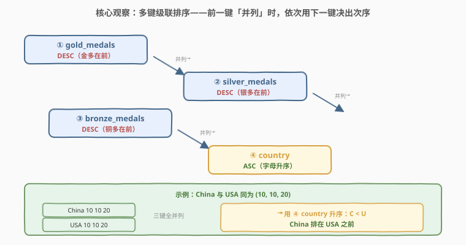
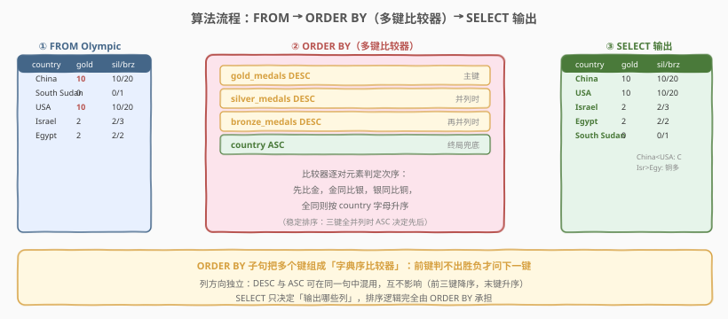
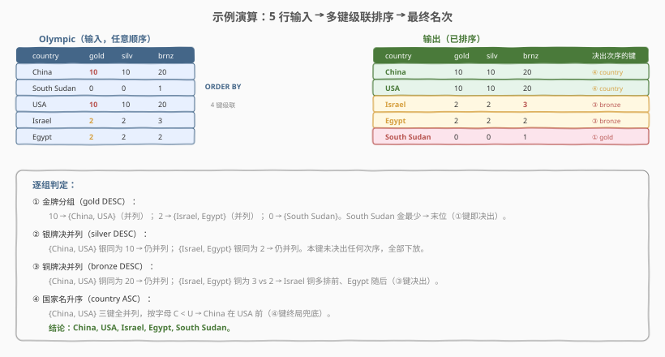

# 整理奥运表

- **题目名称**：整理奥运表
- **链接**：[2377. 整理奥运表](https://leetcode.cn/problems/sort-the-olympic-table/)
- **难度**：简单
- **标签**：数据库、SQL、`ORDER BY`、多键排序、级联 tie-break

## 1. 题目概述

给定 `Olympic` 表，每行记录某国在本届奥运获得的金、银、铜牌数。编写 SQL 查询，把这张表按奥运奖牌榜惯例排序后返回：**金多者在前；金同则银多者在前；金银同则铜多者在前；金银铜三键全同则按国家名升序**。

**表结构**：

```text
表：Olympic
+-------------+----------+
| Column Name | Type     |
+-------------+----------+
| country     | varchar  |
| gold_medals | int      |
| silver_medals | int    |
| bronze_medals | int    |
+-------------+----------+
country 是该表的主键（具有唯一值）。
该表每一行表示某国获得的金、银、铜牌数。
```

**示例 1**：

```text
输入：
Olympic 表:
+-------------+-------------+---------------+-----------------+
| country     | gold_medals | silver_medals | bronze_medals   |
+-------------+-------------+---------------+-----------------+
| China       | 10          | 10            | 20              |
| South Sudan | 0           | 0             | 1               |
| USA         | 10          | 10            | 20              |
| Israel      | 2           | 2             | 3               |
| Egypt       | 2           | 2             | 2               |
+-------------+-------------+---------------+-----------------+
输出：
+-------------+-------------+---------------+-----------------+
| country     | gold_medals | silver_medals | bronze_medals   |
+-------------+-------------+---------------+-----------------+
| China       | 10          | 10            | 20              |
| USA         | 10          | 10            | 20              |
| Israel      | 2           | 2             | 3               |
| Egypt       | 2           | 2             | 2               |
| South Sudan | 0           | 0             | 1               |
+-------------+-------------+---------------+-----------------+
解释：
China 与 USA 的金银铜同为 (10, 10, 20)，三键全并列 → 按 country 升序，C < U，故 China 在 USA 前。
Israel 与 Egypt 金银同为 (2, 2) → 比铜牌：Israel 3 > Egypt 2，故 Israel 在 Egypt 前。
South Sudan 金最少 → 末位。
```

**约束条件**：

- `country` 为 `Olympic` 表主键，故国家唯一、无完全重复行；
- `gold_medals`、`silver_medals`、`bronze_medals` 均为非负整数；
- 表至少含一行；结果需返回全部四列。

> 💡 **关键观察**：排序的目标不是单一键，而是「金 → 银 → 铜 → 国名」的**多键级联**。任一行的最终次序，由「从前往后逐键比较、第一处能分出胜负的键」决定。SQL 的 `ORDER BY` 子句天然支持这种「字典序比较器」——把多个键依次列出，前键判不出胜负才看下一键。

---

## 2. 解题思路

### 2.1 直觉思路：按主键排序

最直白的做法：既然要排成奖牌榜，那就按金牌降序排一遍。伪代码：

```text
for each country c in Olympic:
    key = c.gold_medals
sort rows by key DESC
```

对应 SQL 即 `SELECT * FROM Olympic ORDER BY gold_medals DESC`。但它**只用了第一键**：China 与 USA 金牌同为 10，二者次序未定（取决于排序稳定性与输入顺序），无法保证 China 恒在 USA 前；Israel 与 Egypt 金牌同为 2，二者次序也悬而未决。

> ⚠️ **陷阱定位**：单键 `ORDER BY gold_medals DESC` 只保证「金牌多的在前」，对金牌并列的行给出的是**未定义次序**（依赖数据库实现与输入顺序）。奥运榜要求并列时继续比银、比铜、再比国名——必须把后续 tie-break 键显式写进 `ORDER BY`，不能指望排序的「稳定性」替你完成。

### 2.2 核心观察：多键级联比较器——`ORDER BY` 多键



把问题拆为「**逐键字典序比较**」一个动作。`ORDER BY` 后列出多个键，每个键独立指定升/降序，SQL 引擎在排序时构造一个**复合比较器**：对任意两行 $r_1, r_2$，从第一键起逐键比较——

$$
\text{cmp}(r_1, r_2) = \begin{cases}
\text{sign}(g_1 - g_2) & g_1 \neq g_2 \\
\text{sign}(s_1 - s_2) & g_1 = g_2,\ s_1 \neq s_2 \\
\text{sign}(b_1 - b_2) & g_1 = g_2,\ s_1 = s_2,\ b_1 \neq b_2 \\
\text{cmp}_{\text{str}}(\text{country}_1, \text{country}_2) & \text{三键全同}
\end{cases}
$$

其中 $g,s,b$ 分别为金、银、铜牌数，前三个数值键取 $\text{sign}(r_1-r_2)$ 即「降序」（差为正者在前），末键国名取字符串字典序即「升序」。这一比较器**等价于**：

```sql
ORDER BY gold_medals DESC, silver_medals DESC, bronze_medals DESC, country ASC
```

- 前**三键降序**（`DESC`）：奖牌多者在前；
- 末**一键升序**（`ASC`）：国名字母在前者居先（`ASC` 是默认可省，但显式写出更清晰）；
- 键间用逗号分隔，列方向（`DESC`/`ASC`）彼此独立、互不影响。

> 💡 **`ORDER BY` 多键 = 字典序**：`ORDER BY a, b, c` 的语义不是「分别排序后合并」，而是「把 $(a,b,c)$ 当作一个元组，按字典序整体排序」。即先按 $a$ 排，$a$ 相同的行才聚到一起按 $b$ 排，以此类推。这与多级比较器（`Comparator.thenComparing`）完全同构，是所有「主键 + tie-break」排序题的统一模板。

> ⚠️ **方向陷阱**：题目要求前三键「多者在前」=降序 `DESC`，末键国名「字母升序」=`ASC`。新手易把所有键都写成 `DESC`（导致国名倒序，USA 排到 China 前），或把国名也按降序写。务必逐键核对方向：「数值多在前 = DESC；字符串字母在前 = ASC」。

### 2.3 算法流程图



SQL 子句执行顺序为 `FROM` → `WHERE`（本题无）→ `SELECT` → `ORDER BY`。排序逻辑完全由 `ORDER BY` 承担，`SELECT` 只决定输出哪些列：

| 步骤 | 子句 | 作用 | 本题 |
|------|------|------|------|
| ① | `FROM Olympic` | 取出待排序的行 | 5 行原始数据 |
| ② | `ORDER BY ...` | 用多键比较器排序 | `gold DESC, silver DESC, bronze DESC, country ASC` |
| ③ | `SELECT` | 选输出列 | `country, gold_medals, silver_medals, bronze_medals` |

### 2.4 示例演算

以示例 1 走一遍「逐键级联决出次序」：



| 决出阶段 | 分组 / 结论 | 决出次序的键 |
|---|---|---|
| ① 金牌 `gold DESC` | 10→{China,USA}；2→{Israel,Egypt}；0→{South Sudan} | ①（South Sudan 末位） |
| ② 银牌 `silver DESC` | {China,USA} 银同 10；{Israel,Egypt} 银同 2 | 未决出，全部下放 |
| ③ 铜牌 `bronze DESC` | {China,USA} 铜同 20；{Israel,Egypt} 铜为 3 vs 2 | ③（Israel 在 Egypt 前） |
| ④ 国名 `country ASC` | {China,USA} 三键全同，C < U | ④（China 在 USA 前） |

最终顺序：**China, USA, Israel, Egypt, South Sudan**。

- **China vs USA**：三键全并列 $(10,10,20)$，靠 ④ `country ASC` 兜底——`C < U` 决定 China 居前，这正是末键升序的价值。
- **Israel vs Egypt**：金银并列 $(2,2)$，靠 ③ `bronze DESC` 决出——Israel 铜牌 3 多于 Egypt 的 2，故居前。
- **South Sudan**：金牌 0 最少，① 键即定末位，后续键不再参与比较。

> 💡 **末键是「兜底键」**：只有当前三键全并列时，④ `country ASC` 才真正起作用。由于 `country` 是主键（唯一），它保证**任何两行最终都能分出胜负**——排序结果完全确定、不依赖稳定性。这正是把「主键」放作末键的核心收益。

---

## 3. 参考代码

### SQL（多键 `ORDER BY`，推荐）

```sql
SELECT country, gold_medals, silver_medals, bronze_medals
FROM Olympic
ORDER BY gold_medals DESC, silver_medals DESC, bronze_medals DESC, country ASC;
```

> 💡 **写法要点**：
> - `ORDER BY` 列出全部四个键，前三键 `DESC`（奖牌多在前），末键 `ASC`（国名升序）。
> - `SELECT` 显式列出全部四列，与题目输出要求一致（避免 `SELECT *` 在列序/列集变化时产生歧义）。
> - 末键 `country` 为主键，保证任意两行可分胜负，结果确定。

### SQL（省略默认 `ASC`）

```sql
SELECT country, gold_medals, silver_medals, bronze_medals
FROM Olympic
ORDER BY gold_medals DESC, silver_medals DESC, bronze_medals DESC, country;
```

> 💡 **写法要点**：`ASC` 是 `ORDER BY` 的默认方向，末键 `country` 后不写方向等价于升序。功能与解法 A 完全一致，更简洁；但显式写 `ASC` 在「与前三键 `DESC` 形成对照」时可读性更好，团队规范中二选一即可。

### Python（pandas）

```python
import pandas as pd

def sort_olympic_table(olympic: pd.DataFrame) -> pd.DataFrame:
    return olympic.sort_values(
        by=['gold_medals', 'silver_medals', 'bronze_medals', 'country'],
        ascending=[False, False, False, True],
    ).reset_index(drop=True)
```

> 💡 **pandas 对照**：
> - `sort_values(by=[...])` 对应 `ORDER BY` 多键，`by` 列表的顺序即键的优先级（字典序）。
> - `ascending` 是**逐键方向列表**，与 `by` 一一对应——这正是「列方向独立」的体现：`[False, False, False, True]` 等价于 `DESC, DESC, DESC, ASC`。⚠️ 若误写成标量 `ascending=False`，会让**所有键**都降序（国名也会倒序），与单键 SQL 全写 `DESC` 的陷阱同构。
> - `reset_index(drop=True)` 丢弃原行号，使输出从 0 开始连续编号，对应「排序后的干净结果集」。

---

## 4. 复杂度分析

| 维度 | SQL（多键 `ORDER BY`） | pandas（`sort_values`） |
|------|------------------------|-------------------------|
| **时间** | $O(n \log n)$（排序） | $O(n \log n)$ |
| **空间** | $O(n)$（排序缓冲） | $O(n)$ |
| **键数** | 4（3 数值 + 1 字符串） | 4 |
| **依赖窗口函数** | 否 | 否 |

> - $n$ = `Olympic` 表行数（国家数，现实规模 $\le 200$）。
> - **时间**：排序主导。多键比较器对每对元素做至多 4 次比较，比较代价 $O(1)$（数值直接比、字符串按 collation 比），故整体仍为 $O(n \log n)$；三键全并列时才用到第 4 键，常数略增但量级不变。
> - **空间**：排序需 $O(n)$ 缓冲（归并/快排的临时存储）。
> - **索引建议**：若在 `Olympic(gold_medals, silver_medals, bronze_medals, country)` 上建复合索引，且索引顺序与 `ORDER BY` 一致、方向匹配，则可走索引有序扫描**免排序**（仅 MySQL 8.0+ 支持降序索引 `DESC`）。但本题规模小，全表排序已足够。

---

## 5. 扩展：多键排序的稳定性、`NULL` 与排序规则

### 5.1 为什么末键要放主键？——稳定性的兜底

若 `ORDER BY` 的所有键都对某两行给出「相等」（如只排 `gold_medals DESC`，China 与 USA 都是 10），SQL 标准对这些并列行的相对次序**不做保证**——取决于数据库实现与扫描顺序。这种「未定义次序」在需要稳定输出时是隐患。

把**主键**（本题 `country`）作为末键后，由于主键值唯一，任意两行在末键上必然不同，排序结果**完全确定**、与稳定性无关。推广：**任何「主键 + 若干 tie-break 键」的排序，把主键放末位即可消除并列不确定性**。

> 💡 **稳定性 vs 主键兜底**：稳定性（stable sort）保证「键相等时保持原输入次序」；主键兜底则是「让键永远不相等」。后者更强——不依赖实现是否稳定。面试答「末键放主键消除并列」比「靠稳定排序」更稳妥。

### 5.2 `NULL` 在 `ORDER BY` 中的位置

本题奖牌数非负、`country` 为主键，均无 `NULL`。但若排序键可空，需知各数据库对 `NULL` 的默认位置：

| 数据库 | `NULL` 在升序中的位置 | 可显式控制 |
|--------|----------------------|------------|
| MySQL | `NULL` 最小（升序在前、降序在后） | `IS NULL` 手工排 |
| PostgreSQL | `NULL` 最大（升序在后、降序在前） | `NULLS FIRST` / `NULLS LAST` |
| SQL Server | `NULL` 最小 | `NULLS` 不支持，用 `CASE WHEN` |

跨数据库要保证 `NULL` 位置一致，常用 `ORDER BY (col IS NULL), col` 把非空行先排好、`NULL` 行统一末尾。

### 5.3 字符串排序规则（collation）——大小写与重音

末键 `country` 是 `varchar`，其升序受列的**排序规则（collation）**影响。MySQL 默认 collation 多为大小写不敏感、重音不敏感（如 `utf8mb4_general_ci` 后缀 `_ci`），于是 `"China"` 与 `"china"` 被视为相等——本题国名均为规范写法无此问题，但在允许大小写混写的场景下，需切换到大小写敏感的 collation（`_cs` 后缀或 `_bin`）才能严格按字符比较：

```sql
ORDER BY ... , country COLLATE utf8mb4_bin ASC
```

> ⚠️ 跨语言国名比较还涉及本地化排序（如中文按拼音/笔画）。SQL 默认按 collation 的二进制/字典序，与人类直觉的「拼音序」可能不同。生产中如需本地化名次，应在应用层用 `locale` 排序，而非依赖数据库 collation。

### 5.4 泛化：多键排序母题

本题是「**主指标 + tie-break 序列**」排序的母题。推广：给定任意表，要求按 $k_1$ 主序、$k_2$ 次序、…、$k_m$ 末序排序，核心一句 `ORDER BY k_1 <dir>, k_2 <dir>, ..., k_m <dir>`。识别要点：

1. **键的优先级顺序** = `ORDER BY` 中列出的顺序（左高右低）；
2. **每键方向独立**，逐键核对 `DESC`/`ASC`；
3. **末键放主键**（或唯一键）以消除并列不确定性。

> 💡 一句话：**`ORDER BY` 多键 = 字典序元组比较**——这是所有「奖牌榜/排行榜/多级排名」题的统一模板。

---

## 6. 面试要点

1. **为什么不能只写 `ORDER BY gold_medals DESC`？**

   > 单键只保证金牌多者在前，对金牌并列的行（如 China 与 USA 都 10）给出的是未定义次序，无法保证 China 恒在 USA 前。奥运榜要求并列时继续比银、比铜、再比国名，必须把后续 tie-break 键显式写进 `ORDER BY`，构造多键字典序比较器。单键排序依赖实现稳定性，不可靠。

2. **`ORDER BY a DESC, b DESC, c` 里第三键 `b` 后没写方向，默认是升序还是降序？**

   > 升序（`ASC`）。`ASC` 是 `ORDER BY` 的默认方向，**逐键独立**——前键写 `DESC` 不会传染给后键。故 `gold_medals DESC, silver_medals DESC, country` 中 `country` 是升序。新手常误以为「前面写了 DESC 后面都 DESC」，这是方向陷阱的核心。

3. **为什么把 `country` 放在最后一个排序键？**

   > 因为 `country` 是主键（唯一），把它放末位可保证任意两行最终都能分出胜负——前三键全并列时由它兜底，排序结果完全确定、不依赖稳定性。推广：任何「主键 + tie-break 键」的排序，主键放末位即可消除并列不确定性。

4. **`ORDER BY` 多键的执行机制是什么？是分别排序再合并吗？**

   > 不是。`ORDER BY a, b, c` 是把 $(a,b,c)$ 当作元组按字典序整体排序：先按 $a$ 排，$a$ 相同的行聚到一起再按 $b$ 排，以此类推。对应一个 `thenComparing` 链式多级比较器，比较代价 $O(1)$（每对至多比到第一个能分胜负的键），整体仍是 $O(n \log n)$。

5. **pandas 中 `ascending=False` 与 `ascending=[False, False, False, True]` 有何区别？**

   > 标量 `ascending=False` 让**所有键**降序（国名也倒序，USA 会排到 China 前）；列表 `ascending=[...]` 则逐键指定方向，与 `by` 一一对应。本题国名需升序，必须用列表形式把末键设为 `True`，否则与「SQL 里所有键都写 DESC」是同一个陷阱。

> 💡 **一句话总结**：2377 是「多键级联排序」母题——核心就一句 `SELECT * FROM Olympic ORDER BY gold_medals DESC, silver_medals DESC, bronze_medals DESC, country ASC`。要点：① `ORDER BY` 多键 = 字典序元组比较，前键判不出胜负才看下一键；② 每键方向独立，前三键 DESC（多者在前）、末键 ASC（字母升序）；③ 末键放主键 `country` 兜底，消除并列不确定性，结果确定不依赖稳定性。

---

## 7. 同类练习题

- [176. 第二高的薪水](https://leetcode.cn/problems/second-highest-salary/)（[题解](../0101-0200/176_第二高的薪水.md)）：`ORDER BY ... DESC LIMIT 1` 取次大值，对照「单键降序 + LIMIT」的极简排序取值，与本题多键级联形成对照
- [178. 分数排名](https://leetcode.cn/problems/rank-scores/)（[题解](../0101-0200/178_分数排名.md)）：按分数降序排并赋 DENSE_RANK，对照「排序 + 排名函数」场景，与本题「只排序不排名」形成对照
- [196. 删除重复的电子邮箱](https://leetcode.cn/problems/delete-duplicate-emails-in-an-arbitrary-order/)（[题解](../0101-0200/196_删除重复的电子邮箱.md)）：自连接 + 比较，涉及「按某键保留最优行」的多行择一逻辑，与本题「多键定次序」同为比较型 SQL 题
- [596. 超过 5 名学生的课](https://leetcode.cn/problems/classes-more-than-5-students/)（[题解](../0501-0600/596_超过5名学生的课.md)）：`GROUP BY + HAVING COUNT` 过滤，对照「分组计数」与「逐行排序」两类常见 SQL 套路
- [1141. 查询近 30 天活跃用户数](https://leetcode.cn/problems/user-activity-for-the-past-30-days-i/)（[题解](../1101-1200/1141_查询近30天活跃用户数.md)）：`WHERE` 日期过滤 + `COUNT(DISTINCT)`，对照「过滤后聚合」与本题「无过滤纯排序」的子句组合差异
