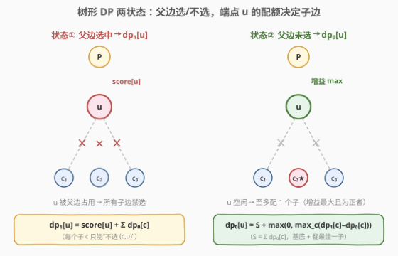
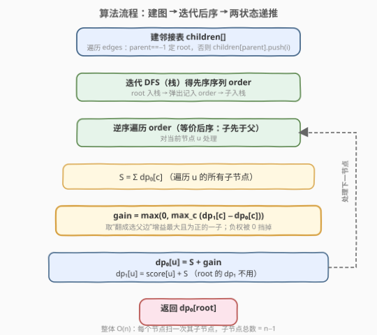
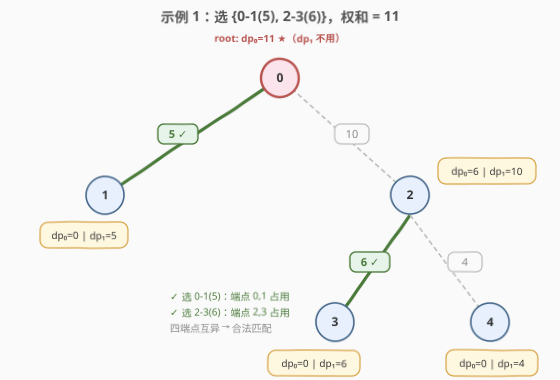

# 选择边来最大化树的得分

- **题目名称**：选择边来最大化树的得分
- **链接**：[2378. 选择边来最大化树的得分](https://leetcode.cn/problems/choose-edges-to-maximize-score-in-a-tree/)
- **难度**：中等
- **标签**：树、深度优先搜索、动态规划

## 1. 题目概述

给你一棵 $n$ 个节点（编号 $0 \dots n-1$）的**有根树**，根为节点 $0$。树以二维数组 `edges` 给出，其中 `edges[i] = [parent_i, score_i]`：

- `parent_i` 是节点 $i$ 的父节点；根节点 $0$ 的 `parent_0 = -1`；
- `score_i` 是连接节点 $i$ 与其父节点的那条边的**得分**；根节点 $0$ 的 `score_0 = -1`（占位、无意义）。

你需要从树中**选出一组边**，使得**任意两条被选中的边不共享端点**（即被选边构成一个**匹配**），目标是使被选边的**得分之和最大**。返回该最大得分之和。

**示例 1**：

```text
输入：edges = [[-1,-1],[0,5],[0,10],[2,6],[2,4]]
输出：11
解释：树边为 0-1(5)、0-2(10)、2-3(6)、2-4(4)。
     选 {0-1, 2-3}，得分 5+6 = 11，两条边端点 {0,1}∪{2,3} 互异。
     选 {0-2} 单条仅 10；选 {0-1, 2-4} 仅 9；均不优。最大为 11。
```

**示例 2**：

```text
输入：edges = [[-1,-1],[0,5],[0,-6],[0,7]]
输出：7
解释：三条边 0-1(5)、0-2(-6)、0-3(7) 共用端点 0，至多选一条。
     负权边 0-2(-6) 不该选；选 0-3(7) 最优。
```

**约束条件**：

- $1 \le n \le 10^5$（`edges.length == n`）
- `edges[i].length == 2`，`edges[i] = [parent_i, score_i]`
- `edges[0] == [-1, -1]`；对 $i \ge 1$：$0 \le \text{parent}_i < n$，$\text{parent}_i \ne i$，且 `edges` 描述一棵以 $0$ 为根的有效树
- $-10^9 \le \text{score}_i \le 10^9$（$i \ge 1$）

> 💡 **关键量级**：被选边不共端点 ⇒ 每个节点**至多关联一条被选边**。这把"在树上选一组互不共端点的边使权和最大"精确化为**树上的最大权匹配**——可在树上以 $O(n)$ 的两状态 DP 求解，无需一般图匹配的复杂算法。

---

## 2. 解题思路

### 2.1 暴力思路

枚举所有边子集（$2^{n-1}$ 个），逐个检查是否为合法匹配（无两条边共端点），取权和最大。$n=10^5$ 时 $2^{10^5}$ 完全不可行。

> ⚠️ 暴力的浪费：匹配合法性的判定是"局部"的——只看每个端点是否被至多一条边占用。但枚举却把整棵树当成独立方案。事实上，一棵子树"对外"只通过它与父节点的那条边发生关系（选或不选），子树内部怎么选完全不影响子树之外——这正是树形 DP 的"无后效性"信号。

### 2.2 核心观察：树形 DP 两状态



任意定根（题目根为 $0$）。对每个非根节点 $u$，"选/不选边 $(u,\text{parent}[u])$"决定了端点 $u$ 是否被占用，进而约束 $u$ 与其子节点之间的边能否再选。于是定义两状态：

- $dp_1[u]$：**选中**边 $(u,\text{parent}[u])$ 时，子树 $u$ 内能取得的最大得分；
- $dp_0[u]$：**不选**边 $(u,\text{parent}[u])$ 时，子树 $u$ 内能取得的最大得分。

设 $u$ 的子节点集合为 $C$，记 $S = \sum_{c\in C} dp_0[c]$（所有子都默认"不选 $(c,u)$ 边"时的子树得分之和）。

**选中父边（$dp_1[u]$）**：端点 $u$ 已被父边占用 → $u$ 与任一子节点的边都**不能再选**（否则共端点 $u$）→ 每个子节点 $c$ 只能处于"不选 $(c,u)$ 边"的状态，贡献 $dp_0[c]$；再加父边本身的得分：

$$dp_1[u] = \text{score}[u] + \sum_{c\in C} dp_0[c] = \text{score}[u] + S$$

**不选父边（$dp_0[u]$）**：端点 $u$ 空闲 → $u$ 可与**至多一个**子节点 $c$ 配对（选边 $(u,c)$；选两个会共端点 $u$），其余子节点都处于"不选 $(c,u)$ 边"状态贡献 $dp_0[c]$。把某个子 $c$ 从"不选"翻成"选中 $(c,u)$ 边"，子树 $c$ 的得分由 $dp_0[c]$ 变为 $dp_1[c]$，**增益**为 $dp_1[c] - dp_0[c]$；在所有子中挑增益最大者，且仅当增益为正才翻：

$$dp_0[u] = S + \max\bigl(0,\;\max_{c\in C}(dp_1[c]-dp_0[c])\bigr)$$

> 💡 **为何"至多配一个子节点"**：被选边不共端点 ⇒ 端点 $u$ 至多关联一条被选边。父边不选时，$u$ 的"配额"可让给恰好一条子边 $(u,c)$。把 $S$（所有子默认不选）作基底，再挑增益最大且为正的那一条翻成选中，即得 $dp_0[u]$；增益都为负时翻 0 个，即 $dp_0[u]=S$。
>
> ⚠️ **负权边被天然规避**：若边 $(u,c)$ 的 $\text{score}[c]<0$，则 $dp_1[c]-dp_0[c]$ 多半为负（选中它使子树得分变小），$\max(0,\cdot)$ 会把它过滤掉，无需对负权特判——这正是示例 2 中 $0\text{-}2(-6)$ 不被选的内在机制。
>
> ⚠️ **根节点无父边**：根 $0$ 的 $\text{score}[0]=-1$ 是占位值，$dp_1[0]$ 不参与答案；答案即 $dp_0[0]$（根没有父边可选，自然处于"不选父边"态）。

### 2.3 算法流程图



整体 $O(n)$：

1. 由 `edges` 建 `children` 邻接表，定位根（`parent==-1` 的节点）；
2. 用栈做一次迭代 DFS 得到**先序序列** `order`（根在前）；
3. **逆序**遍历 `order`（等价于后序：子先于父），对每个 $u$ 用上述两式算 $dp_0[u],dp_1[u]$；
4. 返回 $dp_0[\text{root}]$。

> 💡 **为何"逆序先序"就是后序**：先序里父必在子之前，故逆序里子必在父之前——满足"子先算、父后合并"的依赖。用迭代而非递归，规避链式树 $n=10^5$ 时的栈溢出（见第 5 节）。

### 2.4 示例演算



以示例 1 为例，$\text{score}=[\_,5,10,6,4]$，子节点：$0\to\{1,2\}$，$2\to\{3,4\}$，$1,3,4$ 为叶。

| 节点 $u$ | 子节点 $C$ | $S=\sum dp_0[c]$ | $\max_c(dp_1[c]-dp_0[c])$ | $dp_0[u]=S+\max(0,\cdot)$ | $dp_1[u]=\text{score}+S$ | 说明 |
|----------|-----------|------------------|---------------------------|---------------------------|---------------------------|------|
| 1 | ∅ | 0 | — | 0 | 5 | 叶：$dp_0=0$，$dp_1=$ 边权 5 |
| 3 | ∅ | 0 | — | 0 | 6 | 叶 |
| 4 | ∅ | 0 | — | 0 | 4 | 叶 |
| 2 | {3,4} | $0+0=0$ | $\max(6-0,\,4-0)=6$ | $0+6=6$ | $10+0=10$ | 翻 $c=3$，增益 $6>0$ |
| 0 | {1,2} | $0+6=6$ | $\max(5-0,\,10-6)=5$ | $6+5=\mathbf{11}$ | $(-1)+6=5$（不用） | 翻 $c=1$，增益 $5>0$ |

答案 $=dp_0[0]=11$，对应匹配 $\{0\text{-}1(5),\;2\text{-}3(6)\}$，权和 $5+6=11$。✓

> ⚠️ **贪心陷阱**：不可"每条边独立贪心取正权最大"。例 1 中 $0\text{-}2(10)$ 是单条最大权，但选中它后端点 $0,2$ 都被占用，$0\text{-}1(5)$ 与 $2\text{-}3(6)$ 都不能再选，权和仅 $10<11$。树形 DP 通过"端点配额"权衡了"选大边独占"与"选两条小边"，给出全局最优。

---

## 3. 参考代码

### C++

```cpp
class Solution {
public:
    long long maxScore(vector<vector<int>>& edges) {
        int n = edges.size();
        vector<vector<int>> children(n);
        int root = 0;
        for (int i = 0; i < n; ++i) {
            int p = edges[i][0];
            if (p == -1) root = i;              // 定位根
            else children[p].push_back(i);
        }

        vector<int> order; order.reserve(n);    // 先序序列
        vector<int> st; st.push_back(root);
        while (!st.empty()) {
            int u = st.back(); st.pop_back();
            order.push_back(u);
            for (int v : children[u]) st.push_back(v);
        }

        vector<long long> dp0(n, 0), dp1(n, 0);
        for (int i = n - 1; i >= 0; --i) {       // 逆序先序 = 后序：子先于父
            int u = order[i];
            long long S = 0, best = 0;          // best 初值 0 即 max(0,·)
            for (int v : children[u]) {
                S += dp0[v];
                long long g = dp1[v] - dp0[v];
                if (g > best) best = g;
            }
            dp0[u] = S + best;                  // 翻增益最大且为正的一子
            dp1[u] = (long long)edges[u][1] + S; // root 的 dp1 不用
        }
        return dp0[root];
    }
};
```

### Python

```python
class Solution:
    def maxScore(self, edges: List[List[int]]) -> int:
        n = len(edges)
        children = [[] for _ in range(n)]
        root = 0
        for i, (p, _) in enumerate(edges):
            if p == -1:
                root = i                       # 定位根
            else:
                children[p].append(i)

        order = []                              # 先序序列（迭代 DFS）
        st = [root]
        while st:
            u = st.pop()
            order.append(u)
            st.extend(children[u])

        dp0 = [0] * n
        dp1 = [0] * n
        for u in reversed(order):               # 逆序先序 = 后序：子先于父
            S = 0
            best = 0                            # best 初值 0 即 max(0,·)
            for v in children[u]:
                S += dp0[v]
                g = dp1[v] - dp0[v]
                if g > best:
                    best = g
            dp0[u] = S + best                   # 翻增益最大且为正的一子
            dp1[u] = edges[u][1] + S            # root 的 dp1 不用
        return dp0[root]
```

> ⚠️ **两个易错点**：
> 1. **`best` 初值为 $0$**。它同时承担"至多配一个子（取最大增益）"与"增益为正才翻"两重语义——$0$ 对应"一个子都不配"。若误把初值设成 $-\infty$，会强制翻一个子，在负权边（如示例 2 的 $0\text{-}2(-6)$）或全负增益时出错。
> 2. **`dp1` 用 `edges[u][1]` 作 $\text{score}[u]$**。根节点的 $\text{edges}[0][1]=-1$ 是占位值，但 $dp_1[\text{root}]$ 永不被读取，故无碍；非根节点的 $\text{edges}[u][1]$ 才是真实边权。若误把根的 $dp_1$ 当答案会得到荒谬的负值。
>
> 💡 **求和溢出**：$n\le 10^5$、$|\text{score}|\le 10^9$，权和可达 $\approx 5\times10^{13}$，超 `int` 范围；C++ 用 `long long`，Python 整数任意精度无需关心。

---

## 4. 复杂度分析

| 维度 | 复杂度 | 说明 |
|------|--------|------|
| 时间复杂度 | $O(n)$ | 建图 $O(n)$；迭代 DFS $O(n)$；逆序处理时每个节点扫其子节点一次，所有子节点总数 $=n-1$，故合并总耗时 $O(n)$ |
| 空间复杂度 | $O(n)$ | `children` 邻接表 $O(n)$、`order`、`dp0`/`dp1` 各 $O(n)$；迭代栈最坏 $O(n)$（退化成链） |

> 💡 暴力 $O(2^n)$ 与本解 $O(n)$ 差指数级，关键在于把"全局枚举边子集"重构为"按子树两状态递推"——端点占用信息沿父边这一条"接口"自下而上传递，子树之间互不干扰。

---

## 5. 扩展：从「点的独立集」到「边的独立集（匹配）」

本题是树上的**最大权匹配**（边的独立集：被选边不共端点），它的"表亲"是 [337. 打家劫舍 III](../0301-0400/337_打家劫舍III.md)——树上的**最大权点独立集**（被选点不共边，即相邻两点不共选）。两者共用**完全相同的两状态 DP 骨架**：

| 问题 | 决策对象 | 状态语义 | $dp_1$ 转移 | $dp_0$ 转移 |
|------|----------|----------|-------------|-------------|
| 337 打家劫舍 III | **点** | $dp_1[u]$=选点 $u$ | $\text{val}[u]+\sum dp_0[c]$ | $\sum \max(dp_0[c],dp_1[c])$（每个子独立选/不选） |
| 2378 选边 | **边** | $dp_1[u]$=选父边 | $\text{score}[u]+\sum dp_0[c]$ | $S+\max(0,\max_c(dp_1[c]-dp_0[c]))$（至多配一子） |

两者 $dp_1$ 转移同形（选中则邻居全禁）；差异只在 $dp_0$：**点独立集**里 $u$ 不选时各子彼此独立（子之间不相邻，因 $u$ 不选就断开了），故逐子取 $\max$；**匹配**里 $u$ 不选时各子**通过 $u$ 间接共端点**（边 $u\text{-}c_1$ 与 $u\text{-}c_2$ 共 $u$），故至多选一个，体现为"基底 + 取一个最大增益"。把"点独立集"对照"边独立集"看，转移形态的差异根源立现。

> 💡 **递归写法**：本解用迭代后序以规避深栈。若树较平衡（深度 $\le 10^4$），递归更直观：
> ```cpp
> // pair<long long,long long> dfs(int u): {dp0[u], dp1[u]}
> function<pair<ll,ll>(int)> dfs = [&](int u) {
>     long long S = 0, best = 0;
>     for (int v : children[u]) {
>         auto [d0, d1] = dfs(v);
>         S += d0; best = max(best, d1 - d0);
>     }
>     return pair{(long long)edges[u][1] + S, S + best}; // 注意顺序：这里返回 {dp1,dp0}
> };
> ```
> Python 需 `sys.setrecursionlimit` 且链式 $10^5$ 仍有 C 栈溢出风险，故参考代码统一采用迭代版。

---

## 6. 面试要点

1. **为什么两状态够（无后效性）？**

   - 子树对外只经父边一条"接口"连接外部。父边选/不选唯一决定了端点 $u$ 是否被占用，进而唯一约束了 $u$ 的子边能否再选。子树内部如何选不影响这一接口状态，故"父边选/不选"是充分统计量，无后效性。

2. **$dp_0$ 转移里"至多配一个子"如何用一个 `max` 增益实现？**

   - 记 $S=\sum dp_0[c]$（所有子默认不选的基底）。把子 $c$ 翻成"选 $(c,u)$ 边"使子树 $c$ 得分由 $dp_0[c]$ 变 $dp_1[c]$，增益 $dp_1[c]-dp_0[c]$。由于各子通过 $u$ 间接共端点，至多翻一个 → 取所有子增益的最大值，并以 $0$ 为下界（增益为负则不翻）。$dp_0[u]=S+\max(0,\max_c(\cdot))$。

3. **负权边如何被自然规避，要不要特判？**

   - 不用。$\text{score}[c]<0$ 时 $dp_1[c]-dp_0[c]$ 倾向为负，$\max(0,\cdot)$ 把它滤掉，等价于"不选该边"。示例 2 的 $0\text{-}2(-6)$ 正是如此被跳过。提示"忽略负权边"是这一性质的口语表述。

4. **根节点 $\text{score}=-1$ 怎么处理？答案为何是 $dp_0[\text{root}]$？**

   - 根没有父边可选，天然处于"不选父边"态，故答案取 $dp_0[\text{root}]$。$dp_1[\text{root}]$ 引用了占位值 $-1$ 且永不读取，无碍。若误用 $dp_1[\text{root}]$ 或 $\max(dp_0,dp_1)$ 会引入这 $-1$ 出错。

5. **为何用迭代 DFS 而非递归？**

   - $n\le 10^5$，链式树递归深 $10^5$：C++ 可能爆栈、Python 即使 `setrecursionlimit` 也可能因 C 栈限制崩溃。迭代 DFS（显式栈 + 先序序列逆序）逻辑等价、常数略大但无栈深风险，是工程上更稳的选择。

> 💡 **一句话总结**：2378 是「树形两状态 DP 求最大权匹配」——父边选/不选决定端点配额，$dp_1=\text{score}+S$、$dp_0=S+\max(0,\max_c(dp_1[c]-dp_0[c]))$，迭代后序一次 $O(n)$，与 337 打家劫舍 III 同骨架而转移相异。

---

## 7. 同类练习题

- [337. 打家劫舍 III](https://leetcode.cn/problems/house-robber-iii/)（[题解](../0301-0400/337_打家劫舍III.md)）：树上最大权**点**独立集，与本题"边独立集（匹配）"共用两状态骨架，对照 $dp_0$ 转移的"逐子独立"vs"至多配一子"
- [968. 监控二叉树](https://leetcode.cn/problems/binary-tree-cameras/)（[题解](../0901-1000/968_监控二叉树.md)）：树上覆盖型三状态 DP，对照本题两状态，体会"状态按端点占用情况设计"的进阶
- [2322. 从树中删除边的最小分数](https://leetcode.cn/problems/minimum-score-after-removals-on-a-tree/)（[题解](../2301-2400/2322_从树中删除边的最小分数.md)）：同区间树形 DFS 题，后序 DFS + 子树聚合量的范式对照
- [124. 二叉树中的最大路径和](https://leetcode.cn/problems/binary-tree-maximum-path-sum/)（[题解](../0101-0200/124_二叉树中的最大路径和.md)）：后序 DFS 把子树信息向上合并的经典，对照本题"子状态经父边接口传递"
- [543. 二叉树的直径](https://leetcode.cn/problems/diameter-of-binary-tree/)（[题解](../0501-0600/543_二叉树的直径.md)）：后序 DFS 在节点处"合并两子信息"取最值，对照本题"在节点处挑增益最大的一子"
