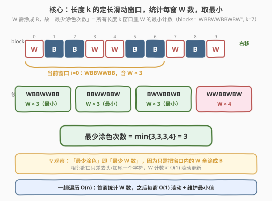
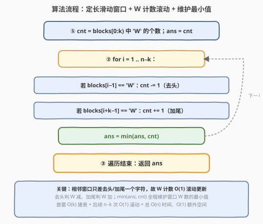
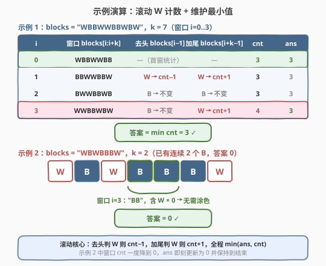

# 得到 K 个黑块的最少涂色次数

- **题目名称**：得到 K 个黑块的最少涂色次数
- **链接**：[2379. 得到 K 个黑块的最少涂色次数](https://leetcode.cn/problems/minimum-recolors-to-get-k-consecutive-black-blocks/)
- **难度**：简单
- **标签**：滑动窗口、字符串

## 1. 题目概述

给定一个下标从 $0$ 开始、长度为 $n$ 的字符串 `blocks`，每个字符 `blocks[i]` 为 `'W'`（白）或 `'B'`（黑）。再给定整数 $k$，表示想要**连续** $k$ 个黑色块。

每次操作可任选一个白色块涂成黑色块。返回「**至少出现一次**连续 $k$ 个黑块」的**最少**操作次数。

**示例 1**：

```text
输入：blocks = "WBBWWBBWBW", k = 7
输出：3
解释：把第 0、3、4 个块涂成黑色，得到 "BBBBBBBWBW"（前 7 个连续黑）。
     可以证明无法用少于 3 次操作得到 7 个连续黑块。
```

**示例 2**：

```text
输入：blocks = "WBWBBBW", k = 2
输出：0
解释：已有 2 个连续黑块（下标 3、4 或 4、5），无需任何操作。
```

**约束条件**：

- $n = \text{blocks.length}$
- $1 \le n \le 100$
- `blocks[i]` 为 `'W'` 或 `'B'`
- $1 \le k \le n$

> 💡 **题眼**：「至少出现一次连续 $k$ 个黑块」等价于「存在某个长度为 $k$ 的窗口，其内的 W 全部涂成 B」。要操作最少，自然选「W 数最少」的那个窗口——于是问题归约为：**在所有长度 $k$ 的子串里求 `'W'` 个数的最小值**。这是一道标准「定长滑动窗口 + 计数取最小」的签到题，可看作 [2269. 找到一个数字的 K 美丽值](../2201-2300/2269_找到一个数字的K美丽值.md) 的姊妹篇（同为定长窗口、仅判定/统计对象不同）。

---

## 2. 解题思路

### 2.1 暴力思路：枚举每个长度 k 的窗口，逐字符数 W

最直白的做法：枚举每个起点 $i \in [0, n-k]$，取子串 `blocks[i:i+k]`，线性数其中 `'W'` 的个数，取所有窗口的最小值。

```python
n = len(blocks)
ans = k
for i in range(n - k + 1):
    ans = min(ans, blocks[i:i+k].count('W'))
return ans
```

由于 $n, k \le 100$，$n - k + 1$ 个窗口、每窗 $O(k)$ 数一遍，共 $O(n \cdot k) \le 10^4$ 次，远低于时限，能轻松 AC。

问题在于：

1. **重复数 W**：相邻窗口只差「去头一字符、加尾一字符」，却把共享的 $k-1$ 个字符重新数了一遍；
2. **窗口定长、单调滑动**：存在 $O(1)$ 滚动更新的空间——去头判 W 减、加尾判 W 加，无需重数。

> ⚠️ 暴力在本题规模下不超时，优化的意义在「方法论」：当 $n, k$ 放大到 $10^5$ 时，$O(n \cdot k)$ 退化成 $O(n^2)$，必须用滚动计数把每窗降到 $O(1)$。这是把签到题讲出深度的关键。

### 2.2 核心观察：定长滑动窗口 + W 计数滚动取最小



**关键洞察**：把目标「最少涂色次数」翻译成「最少 W 数」——因为只要把某个长度 $k$ 窗口里的 W 全涂成 B，该窗口即满足条件，操作数恰等于该窗口的 W 数。要最少，就取所有长度 $k$ 窗口里 W 数的最小值：

$$
\text{ans} \;=\; \min_{i=0}^{\,n-k}\; \bigl|\{\,j \in [i,\, i+k) : \text{blocks}[j] = \text{'W'}\,\}\bigr|
$$

**为何能 $O(1)$ 滚动？** 相邻两个窗口 $i-1$ 与 $i$ 仅在两端差一个字符：窗口 $i$ 去掉了 `blocks[i-1]`、加上了 `blocks[i+k-1]`，中间 $k-1$ 个字符完全相同。于是从窗口 $i-1$ 滑到窗口 $i$ 时，W 计数 `cnt` 只需：

$$
\text{cnt} \;\gets\; \text{cnt} \;-\; \mathbb{1}[\text{blocks}[i-1]=\text{'W'}] \;+\; \mathbb{1}[\text{blocks}[i+k-1]=\text{'W'}]
$$

即「去头是 W 则 `cnt -= 1`，加尾是 W 则 `cnt += 1`」。每窗 $O(1)$，全程维护 `ans = min(ans, cnt)` 即可。

> 💡 **无后效性**：每个长度 $k$ 的窗口只属于一个起点 $i$，各窗口的 W 数相互独立；窗口定长意味着不需要像变长窗口那样维护收缩条件，只需右移起点、$O(1)$ 更新计数即可。这正是「定长滑动窗口」比「变长滑动窗口」简单的根——前者只滑动不收缩。

### 2.3 算法流程图



整体只扫一遍 `blocks`，维护当前窗口的 W 计数 `cnt` 与全局最小 `ans`：

1. **首窗建表**：统计 `blocks[0:k)` 中 `'W'` 的个数记为 `cnt`，`ans = cnt`；
2. **滚动窗口**：对 $i = 1, \dots, n-k$：
   - 若 `blocks[i-1] == 'W'`：`cnt -= 1`（去头）；
   - 若 `blocks[i+k-1] == 'W'`：`cnt += 1`（加尾）；
   - `ans = min(ans, cnt)`；
3. **返回** `ans`。

### 2.4 示例演算



以两个示例对照「滚动更新」与「窗口 cnt 降到 0 即停」两种情形：

**示例 1** `blocks = "WBBWWBBWBW", k = 7`（$n=10$，窗口 $i=0..3$）：

| $i$ | 窗口 `blocks[i:i+k]` | 去头 `blocks[i-1]` | 加尾 `blocks[i+k-1]` | cnt | ans |
|-----|----------------------|--------------------|---------------------|-----|-----|
| 0 | `WBBWWBB` | —（首窗统计） | — | 3 | 3 |
| 1 | `BBWWBBW` | W → cnt−1 | W → cnt+1 | 3 | 3 |
| 2 | `BWWBBWB` | B → 不变 | B → 不变 | 3 | 3 |
| 3 | `WWBBWBW` | B → 不变 | W → cnt+1 | 4 | 3 |

遍历结束 → **返回 3** ✓（最小 W 数出现在 $i=0,1,2$ 三个窗口，均含 3 个 W）。

**示例 2** `blocks = "WBWBBBW", k = 2`（$n=7$，窗口 $i=0..5$）：首窗 `WB` cnt=1、ans=1；滑动到 $i=3$ 时窗口 `BB` 的 cnt 降到 0，ans 即刻更新为 0 并保持到结束 → **返回 0** ✓。

> ⚠️ **易错点**：注意「去头」判的是**前一个窗口的左端** `blocks[i-1]`，「加尾」判的是**当前窗口的右端** `blocks[i+k-1]`，下标别写反；首窗（$i=0$）没有去头/加尾，需单独一次性统计 `blocks[0:k]` 的 W 数作为 `cnt` 初值。

---

## 3. 参考代码

### C++

```cpp
class Solution {
public:
    int minimumRecolors(string blocks, int k) {
        int n = blocks.size();
        int cnt = 0;
        for (int i = 0; i < k; ++i)
            if (blocks[i] == 'W') ++cnt;
        int ans = cnt;
        for (int i = 1; i + k <= n; ++i) {
            if (blocks[i - 1] == 'W') --cnt;
            if (blocks[i + k - 1] == 'W') ++cnt;
            ans = min(ans, cnt);
        }
        return ans;
    }
};
```

### Python

```python
class Solution:
    def minimumRecolors(self, blocks: str, k: int) -> int:
        cnt = blocks[:k].count('W')
        ans = cnt
        for i in range(1, len(blocks) - k + 1):
            if blocks[i - 1] == 'W':
                cnt -= 1
            if blocks[i + k - 1] == 'W':
                cnt += 1
            ans = min(ans, cnt)
        return ans
```

> 💡 **两种写法的取舍**：滚动版每窗 $O(1)$，整体 $O(n)$；若追求代码极简、$n \le 100$ 时也可一行暴力 `return min(blocks[i:i+k].count('W') for i in range(len(blocks)-k+1))`，可读性高但每窗 $O(k)$、总 $O(nk)$。面试中优先讲滚动版体现「定长滑窗 $O(1)$ 更新」的套路，再口头提暴力版作为对照。

---

## 4. 复杂度分析

| 维度 | 复杂度 | 说明 |
|------|--------|------|
| 时间复杂度 | $O(n)$ | 首窗 $O(k)$ 统计 + 后续 $n-k$ 次滚动每次 $O(1)$，合计 $O(n)$；$n=100$ 时约百次操作，稳过 |
| 空间复杂度 | $O(1)$ | 仅维护 `cnt`、`ans` 与循环变量 $i$，额外常数空间；Python 切片 `blocks[:k]` 临时 $O(k)$ 可用循环消去 |

> 💡 本题 $n \le 100$，$O(nk)$ 暴力也仅 $10^4$ 级，远低于时限。复杂度分析的价值在于指出「每窗重数 W」是瓶颈，引出滚动 $O(1)$ 更新——当 $n, k$ 放大到 $10^5$ 时把 $O(nk)$ 降到 $O(n)$。

---

## 5. 扩展：前缀和写法与「至多型」语义

### 5.1 前缀和写法

把 `'W'` 视作 $1$、`'B'` 视作 $0$，构造前缀和 $S$（$S[0]=0$，$S[i]=S[i-1]+\mathbb{1}[\text{blocks}[i-1]=\text{'W'}]$），则窗口 $[i, i+k)$ 的 W 数 $= S[i+k]-S[i]$，答案即 $\min_{i} (S[i+k]-S[i])$。时空皆 $O(n)$，与滚动版等价但多一张前缀和表——滚动版把它压到了 $O(1)$ 空间，故本题首选滚动。前缀和的价值在「窗口长度可变」或「多次区间查询」场景，本题固定 $k$ 不必。

### 5.2 与「至多型」滑窗的对照

本题问的是「定长 $k$ 窗口里 W 的最小数」。换个角度，等价于「是否存在长度 $\ge k$ 的子串，其 W 数 $\le$ 某阈值」——这正是 [1052. 爱生气的书店老板](../1001-1100/1052_爱生气的书店老板.md) 的「最长窗口 + 计数上限」型变体。两者同属「窗口内 W/B 计数」家族：本题窗口定长、求计数最小；1052 窗口变长、求在计数约束下的最长。把「定长取最小」与「变长取最长」并记，可覆盖一大类滑动窗口题。

---

## 6. 面试要点

1. **这道简单题的考点在哪？**

   - 表面是「枚举窗口数 W 取最小」，一行暴力似能搞定。真正考点是**把目标翻译成模型**的能力：「最少涂色次数」$=$ 「最少 W 数的窗口」这一步归约，以及**定长滑窗的 $O(1)$ 滚动更新**——能否意识到相邻窗口只差去头/加尾、避免每窗 $O(k)$ 重数，是区分「能 AC」与「写得好」的分水岭。

2. **滚动更新时去头和加尾各判谁？**

   - 从窗口 $i-1$ 滑到窗口 $i$：**去头**判的是前窗左端 `blocks[i-1]`（它离开了窗口，是 W 则 `cnt -= 1`）；**加尾**判的是当前窗右端 `blocks[i+k-1]`（它进入窗口，是 W 则 `cnt += 1`）。两个下标都从 $i$ 起算，首窗 $i=0$ 无去头/加尾，需先一次性统计 `blocks[0:k]` 的 W 数作 `cnt` 初值。

3. **首窗为什么不能也走滚动分支？**

   - 滚动分支依赖「前一个窗口的 cnt」，$i=0$ 时没有前窗，`blocks[i-1]=blocks[-1]` 在 C++ 是越界、在 Python 是末元素（语义错误）。故首窗必须独立用 $O(k)$ 统计，从 $i=1$ 起才进入滚动。这是定长滑窗模板的固定写法：先建首窗、再滚后续。

4. **$k = n$ 时退化成什么？**

   - 只有一个窗口（整串），答案即整串的 W 数。首窗统计后循环不进入（$n-k=0$，`i=1` 不满足 `i+k<=n`），直接返回 `ans = cnt`，符合预期。$k=1$ 时每个单字符都是窗口，答案为 $0$（只要串里有 `B`）或 $1$（全 W 串）。两种边界均被同一套代码自然覆盖。

5. **能否用前缀和或其它写法？**

   - 可以。前缀和 $S[i+k]-S[i]$ 表窗口 W 数，时空 $O(n)$，与滚动等价但多用一张表，本题首选滚动压到 $O(1)$ 空间。若窗口长度可变或需多次区间查询，前缀和更合适。也可用「至多型」变长窗口语义理解（见第 5 节），但定长 $k$ 直接滚动最简。

> 💡 **一句话总结**：2379 的最优解是「定长 $k$ 滑动窗口 + W 计数 $O(1)$ 滚动 + $\min(\text{ans}, \text{cnt})$」——把「最少涂色」归约为「最少 W 数的窗口」，首窗统计、之后去头加尾判 W 增减，一趟 $O(n)$ 时间、$O(1)$ 空间。

---

## 7. 同类练习题

- [2269. 找到一个数字的 K 美丽值](https://leetcode.cn/problems/find-the-k-beauty-of-a-number/)（[题解](../2201-2300/2269_找到一个数字的K美丽值.md)）：同为「定长 $k$ 滑动窗口」，对照「逐窗口判定整除」与本题「逐窗口数 W 取最小」，巩固定长窗口模板
- [3. 无重复字符的最长子串](https://leetcode.cn/problems/longest-substring-without-repeating-characters/)（[题解](../0001-0100/3_无重复字符的最长子串.md)）：变长滑动窗口母题，对照「定长窗口只需右移」与「变长窗口需收缩 left」的差异
- [209. 长度最小的子数组](https://leetcode.cn/problems/minimum-size-subarray-sum/)（[题解](../0201-0300/209_长度最小的子数组.md)）：正数单调滑窗，对照「窗口值随扩张单调增、随收缩单调减」与本题「窗口定长、计数可任意」的区别
- [187. 重复的 DNA 序列](https://leetcode.cn/problems/repeated-dna-sequences/)（[题解](../0101-0200/187_重复的DNA序列.md)）：定长 $10$ 滑动窗口 + 滚动哈希，与本题「去头加尾 $O(1)$ 滚动」同构，巩固定长窗口滚动模板
- [1052. 爱生气的书店老板](https://leetcode.cn/problems/grumpy-bookstore-owner/)（[题解](../1001-1100/1052_爱生气的书店老板.md)）：「窗口内 W/B 计数」家族的变长版，求在计数约束下的最长窗口，对照本题「定长取计数最小」
