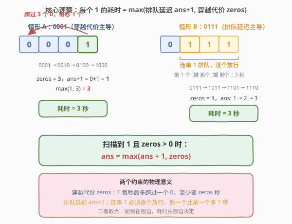
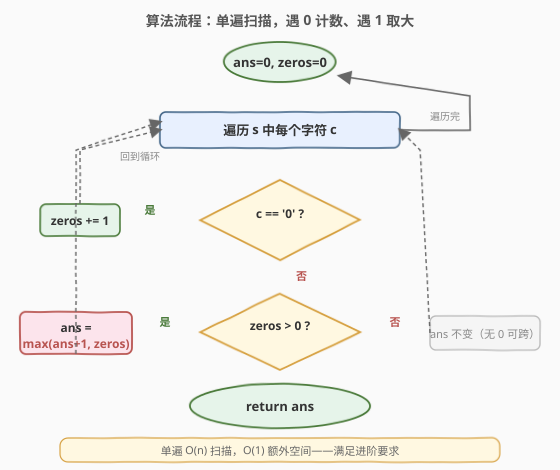
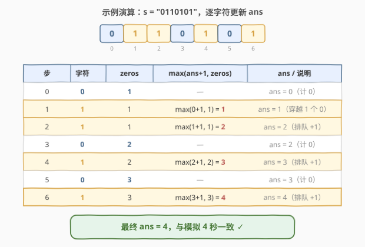

# LeetCode 二进制字符串重新安排顺序需要的时间 题解

## 1. 题目概述

- **标题 / 题号**：二进制字符串重新安排顺序需要的时间（#2380，medium）
- **链接**：https://leetcode.cn/problems/time-needed-to-rearrange-a-binary-string/
- **难度**：中等
- **标签**：字符串、动态规划、贪心

**题意**：给你一个二进制字符串 `s`。在**一秒**之中，**所有**子字符串 `"01"` **同时**被替换成 `"10"`。这个过程持续进行到没有 `"01"` 存在。请你返回完成这个过程所需要的秒数。

**示例 1**：

```text
输入：s = "0110101"
输出：4
解释：
一秒后，s 变成 "1011010"。
再过 1 秒后，s 变成 "1101100"。
第三秒过后，s 变成 "1110100"。
第四秒后，s 变成 "1111000"。  ← 此时没有 "01"，花费 4 秒。
```

**示例 2**：

```text
输入：s = "11100"
输出：0
解释：s 中没有 "01" 存在，花费 0 秒。
```

**约束**：

- $1 \le \text{s.length} \le 1000$
- `s[i]` 要么是 `'0'`，要么是 `'1'`。

**进阶**：你能以 $O(n)$ 的时间复杂度解决这个问题吗？

> 💡 **终态长什么样**：没有 `"01"` 子串意味着任何相邻两位都不是「0 在前、1 在后」，故所有 `1` 必须在所有 `0` 之前——终态就是把 `s` 排成「先 1 后 0」的形式。而 `"01"→"10"` 正是一次相邻交换，把 `1` 左移、`0` 右移。于是整个过程的本质是：**对二进制串反复做并行相邻交换（冒泡），直到 1 全部冒到左端，问要几趟**。

## 2. 解题思路

### 2.1 暴力思路：逐秒模拟

最直白的做法是老老实实模拟每一秒：扫描一遍 `s`，找出所有不重叠的 `"01"`（注意并行交换时，相邻的 `"01"` 不能共享下标，但 `"0101"` 里的两处 `"01"` 互不相邻、可同时换），把它们同时换成 `"10"`，秒数 `+1`；若本轮没有任何 `"01"` 则停止。

```python
def secondsToRemoveOccurrences(s):
    t = list(s)
    ans = 0
    while True:
        i, swapped = 0, False
        nxt = t[:]
        while i + 1 < len(t):
            if t[i] == '0' and t[i+1] == '1':   # 找到一处 "01"
                nxt[i], nxt[i+1] = '1', '0'
                swapped = True
                i += 2                          # 跳过，避免相邻共享下标
            else:
                i += 1
        t = nxt
        if not swapped:
            break
        ans += 1
    return ans
```

> ⚠️ 模拟的代价与答案规模绑定。本题答案上界为 $n-1$（如 `"00…01…1"` 形态），故最坏 $O(n)$ 秒、每秒 $O(n)$ 扫描，共 $O(n^2)$。$n \le 1000$ 时约 $10^6$ 次操作，能过，但无法满足进阶的 $O(n)$ 要求。突破口在于：**每一秒的并行交换是有规律的，1 的运动可被一行递推刻画**——不必真的模拟。

### 2.2 核心观察：每个 1 的耗时 = 「排队延迟」与「穿越代价」取大



终态是「1 在前、0 在后」。由于 `"01"→"10"` 只让 `1` 与 `0` 互换位置、**1 之间（以及 0 之间）相对顺序永不变**，最终第 $k$ 个 `1` 仍是从左数第 $k$ 个 `1`，它要到位，必须**越过它左侧的全部 `0`**。从左到右扫 `s`，对每个遇到的 `1`：

- 设到目前为止已累计的 `0` 的个数为 `zeros`（即此 `1` 左侧的 `0` 数），它**每秒最多越过一个 `0`**，故至少要 `zeros` 秒——这是「**穿越代价**」。
- 若它与前一个 `1` 紧随其后（一串连排的 `1`），则它**不能**立即越过 `0`，必须等前一个 `1` 先动、让出位置，比前一个 `1` 晚 $1$ 秒——这是「**排队延迟**」，体现为 `ans + 1`（`ans` 是前一个 `1` 的耗时）。

两约束并存，取其大者即此 `1` 的实际耗时：

$$
\text{ans} \;\leftarrow\; \max(\text{ans}+1,\; \text{zeros}) \qquad (\text{仅当}\; \text{zeros} > 0\; \text{时更新})
$$

> 💡 **为何是 max 而非相加**：穿越与排队并非两段独立时间，而是**同一过程的两个下界**。`1` 在「等前一个 1 让位」的同时也在「逐个越过 0」——两者并行发生，瓶颈由较大者决定。情形 A（`"0001"`）穿越代价 `3` 远大于排队 `1`，瓶颈在穿越；情形 B（`"0111"`）排队延迟 `1→2→3` 远大于穿越 `1`，瓶颈在排队。两种极端恰好都给出 `3` 秒，正说明 max 的合理性。
>
> ⚠️ **`zeros == 0` 时不更新**：若 `1` 左侧还没有任何 `0`，它本就在「应在的位置」前段，无需移动，`ans` 维持 `0`（如 `"11100"` 一路扫完仍是 `0`）。这正是示例 2 返回 `0` 的原因。

### 2.3 算法流程图



一次扫描维护两个标量 `ans`（前一个 `1` 的耗时，初值 `0`）与 `zeros`（已累计的 `0` 数，初值 `0`）：

1. 遇 `'0'`：`zeros += 1`，`ans` 不动；
2. 遇 `'1'` 且 `zeros > 0`：`ans = max(ans + 1, zeros)`；
3. 遇 `'1'` 且 `zeros == 0`：`ans` 不动（无需移动）；
4. 扫完返回 `ans`。

### 2.4 示例演算



以 `s = "0110101"` 为例，逐字符推进 `zeros` 与 `ans`：

| 步 | 字符 | zeros | $\max(\text{ans}+1,\text{zeros})$ | ans / 说明 |
|----|------|-------|-----------------------------------|-----------|
| 0 | `0` | 1 | — | `ans = 0`（计 0） |
| 1 | `1` | 1 | $\max(0+1,1)=1$ | `ans = 1`（穿越 1 个 0） |
| 2 | `1` | 1 | $\max(1+1,1)=2$ | `ans = 2`（排队 +1） |
| 3 | `0` | 2 | — | `ans = 2`（计 0） |
| 4 | `1` | 2 | $\max(2+1,2)=3$ | `ans = 3`（排队 +1） |
| 5 | `0` | 3 | — | `ans = 3`（计 0） |
| 6 | `1` | 3 | $\max(3+1,3)=4$ | `ans = 4`（排队 +1） |

最终 `ans = 4`，与逐秒模拟得到的 `4` 秒一致 ✓。

> 💡 **读法**：步 1 的 `1` 只需越过左侧 1 个 `0`，耗时 `1`；步 2、4、6 的 `1` 都紧随前一个 `1`，各自再 `+1`（`1→2→3→4`）；步 3、5 的 `0` 只把 `zeros` 推到 `2、3`，但当前 `ans` 已超过它们，故不抬高答案。整串 4 个 `1` 排成一列「火车」，逐个放行，耗时由队尾决定。

## 3. 参考代码

### C++

```cpp
class Solution {
public:
    int secondsToRemoveOccurrences(string s) {
        int ans = 0, zeros = 0;
        for (char c : s) {
            if (c == '0') {
                ++zeros;
            } else if (zeros > 0) {
                ans = max(ans + 1, zeros);
            }
        }
        return ans;
    }
};
```

### Python

```python
class Solution:
    def secondsToRemoveOccurrences(self, s: str) -> int:
        ans = zeros = 0
        for c in s:
            if c == '0':
                zeros += 1
            elif zeros > 0:
                ans = max(ans + 1, zeros)
        return ans
```

> ⚠️ **两个易错点**：
> 1. **`zeros == 0` 时不要更新 `ans`**。若写成「遇 `1` 一律 `ans = max(ans+1, zeros)`」，对 `"11100"` 这种开头无 `0` 的串会错误地累加成 `1→2→3`。必须用 `elif zeros > 0` 守门：左侧无 `0` 的 `1` 无需移动，`ans` 保持 `0`。
> 2. **`ans + 1` 用的是旧 `ans`**。递推里 `ans` 既读又写，但 `ans + 1` 读的是「前一个 `1` 的耗时」（尚未被当前 `1` 覆盖），先算右值再赋值给 `ans`，天然一拍时滞，语义正确。
>
> 💡 **常数极小**：单遍扫描、两个整型变量、无额外数组。$n=1000$ 时仅千次比较，远优于 $O(n^2)$ 模拟。

## 4. 复杂度分析

| 维度 | 复杂度 | 说明 |
|------|--------|------|
| **时间复杂度** | $O(n)$ | 单遍扫描 `s`，每个字符做常数次判断与算术 |
| **空间复杂度** | $O(1)$ | 仅 `ans`、`zeros` 两个标量，无额外数组 |
| 对照：逐秒模拟 | $O(n^2)$ / $O(n)$ | 最坏 $n-1$ 秒、每秒 $O(n)$ 扫描；空间用于存放下一秒的串拷贝 |

> 💡 与暴力 $O(n^2)$ 相比，本解法把「并行交换的轮数」从**逐秒模拟**降维为「**一维递推取 max**」——这正是满足进阶 $O(n)$ 要求的关键。

## 5. 扩展：并行相邻交换的轮数 = 最长依赖链

本题是「**并行相邻交换直到有序，求轮数**」的一个干净实例。这类问题的通用结论是：**并行轮数等于最长依赖链的长度**——每个元素要到位，必须等它依赖的那些元素先动，依赖关系串成的最长链条即答案。

对一般数组（非二进制串），「把第 $i$ 个元素冒泡到目标位置」的并行轮数，可由「它左侧应排在它右边的元素数」与「同向排队位置」两下界取大而得，思路与本题完全同构。本题的简洁之处在于：元素只有 `0/1` 两类，`1` 的目标位置只取决于「它之前有几个 `0`」——于是 `zeros` 一个标量就完整刻画了依赖，递推退化为一行 `max(ans+1, zeros)`。

> 💡 **答案为何 $\le n-1$**：`ans` 在每次更新时取 `max(ans+1, zeros)`，而 `ans+1` 每步至多增 `1`、`zeros` 至多为 `n`。极端形态 `"00…011…1"`（$k$ 个 0 接 $k$ 个 1，$n=2k$）给出最大值：首个 `1` 耗 `k`、其后每个 `+1`，末 `1` 耗 $2k-1=n-1$。故答案上界 $n-1$，逐秒模拟的轮数也是 $O(n)$ 级，$O(n^2)$ 模拟在 $n\le 1000$ 下本可接受，$O(n)$ 递推则把常数压到最小。

## 6. 面试要点

1. **为什么终态是「1 在前、0 在后」？**

   - 没有 `"01"` 子串，意味着不存在「0 在 1 左边且相邻」的位置。由相邻关系递推，所有 `1` 必须位于所有 `0` 之前。故终态即把 `s` 重排成「先 1 后 0」。

2. **`max(ans+1, zeros)` 中两项分别是什么、为何取 max？**

   - `zeros` 是穿越代价：当前 `1` 左侧的 `0` 数，它每秒最多越过一个 `0`，至少要 `zeros` 秒；`ans+1` 是排队延迟：紧随前一个 `1` 时必须等它让位，晚 1 秒。两者是**同一过程的两个下界**，并行发生而非串联相加，故取大。

3. **`"11100"` 为何返回 0？**

   - 前三个 `1` 扫到时 `zeros` 仍为 `0`（左侧无 `0`），`elif zeros > 0` 守门不更新，`ans` 保持 `0`；后两个 `0` 只抬高 `zeros` 而不再有 `1` 触发更新。整串本就已是「1 在前 0 在后」的终态，无需任何交换。

4. **为什么 1 之间、0 之间的相对顺序不变？**

   - `"01"→"10"` 只交换相邻的 `0` 与 `1`，从不交换两个 `1` 或两个 `0`。故 `1` 序列、`0` 序列各自的内部顺序在过程中保持不变，第 $k$ 个 `1` 始终是第 $k$ 个 `1`，越过左侧 `0` 即可到位——这是把问题降维到「逐 1 计时」的前提。

5. **能否不用递推、直接由逆序对或某种统计算出？**

   - 可以把 `ans` 看作「`1` 越过 `0` 的最长依赖链」长度。最朴素的统计是「`1` 左侧 `0` 数的最大值」，但它忽略了连排 `1` 的排队延迟（如 `"0111"`，最大左侧 0 数仅 `1`，真实答案 `3`）。加上「连排 `1` 逐个 `+1`」的链式约束后，递推 `max(ans+1, zeros)` 正是对「最长依赖链」的一行式刻画——比单独求逆序对更精炼。

> 💡 **一句话总结**：单遍扫描，遇 `0` 累加 `zeros`、遇 `1`（且 `zeros>0`）执行 `ans = max(ans+1, zeros)`——$O(n)$/$O(1)$，把并行冒泡的轮数压成一行递推。

## 同类练习题

| # | 题目 | 与本题的关联 |
|---|------|-------------|
| 2340 | [生成有效数组的最少交换次数](https://leetcode.cn/problems/minimum-adjacent-swaps-to-make-a-valid-array/)（[题解](../2301-2400/2340_生成有效数组的最少交换次数.md)） | 同为「相邻交换」家族，但问的是**最少交换次数（计数）**而非并行轮数（计时）——计数与计时是相邻交换问题的两个对偶面 |
| 912 | [排序数组](https://leetcode.cn/problems/sort-an-array/)（[题解](../0901-1000/912_排序数组.md)） | 冒泡排序即反复相邻交换直至有序；「`01→10` 并行交换直到无 `01`」本质就是对二进制串做一次冒泡，本题问的正是冒泡的**趟数** |
| 315 | [计算右侧小于当前元素的个数](https://leetcode.cn/problems/count-of-smaller-numbers-after-self/)（[题解](../0301-0400/315_计算右侧小于当前元素的个数.md)） | 右侧更小元素数 = 逆序对 = 冒泡排序的总交换次数，对照本题的「并行轮数」——总交换数与并行轮数是冒泡排序的两个度量 |
| 1850 | [邻位交换的最小次数](https://leetcode.cn/problems/minimum-adjacent-swaps-to-reach-the-kth-smallest-number/) | 把排列经相邻交换变为第 $k$ 小排列，求最少交换次数；同属「相邻交换」贪心家族 |
| 283 | [移动零](https://leetcode.cn/problems/move-zeroes/) | 把所有 `0` 移到末尾且保持非零相对序——与本题「`01→10` 把 1 推到前部、0 退到后部」达成**同一终态**（1 在前 0 在后），但用覆盖式快写而非并行交换、问的是「能否完成」而非「耗时」 |
