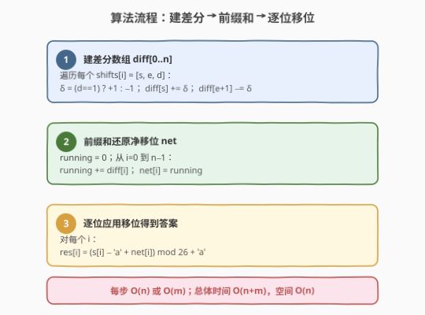
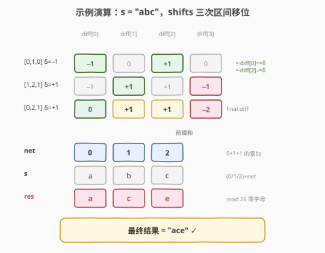

# 字母移位 II

- **题目名称**：字母移位 II
- **链接**：[2381. 字母移位 II](https://leetcode.cn/problems/shifting-letters-ii/)
- **难度**：中等
- **标签**：数组、字符串、差分数组、前缀和

## 1. 题目概述

给你一个小写英文字母组成的字符串 `s` 和一个二维整数数组 `shifts`，其中 `shifts[i] = [start_i, end_i, direction_i]`。对每个 `i`，把 `s` 中下标从 `start_i` 到 `end_i`（两端都包含）的所有字符移位：`direction_i = 1` 向后移位（用字母表下一个字母替换，`'z'` 变 `'a'`），`direction_i = 0` 向前移位（用前一个字母替换，`'a'` 变 `'z'`）。返回所有移位操作后的最终字符串。

**示例 1**：

```text
输入：s = "abc", shifts = [[0,1,0],[1,2,1],[0,2,1]]
输出："ace"
解释：
将下标 0~1 的字母向前移位，得 "zac"；
将下标 1~2 的字母向后移位，得 "zbd"；
将下标 0~2 的字母向后移位，得 "ace"。
```

**示例 2**：

```text
输入：s = "dztz", shifts = [[0,0,0],[1,1,1]]
输出："catz"
```

**约束条件**：

- $1 \le \text{s.length},\ \text{shifts.length} \le 5 \times 10^4$
- $\text{shifts}[i].\text{length} = 3$
- $0 \le \text{start}_i \le \text{end}_i < \text{s.length}$
- $0 \le \text{direction}_i \le 1$
- `s` 只包含小写英文字母

> 💡 **移位 = 加减 1**：把字母看成 $0\sim25$ 的整数，向后移位等价于 $+1$，向前移位等价于 $-1$。多个移位叠加时，**每个位置的净移位量**就是它被覆盖的所有移位之代数和。题目本质是「**区间加法**」——这正是差分数组的招牌场景。

---

## 2. 解题思路

### 2.1 暴力思路

按题意逐条模拟：对每个 `shifts[i] = [s, e, d]`，遍历 `s[s..e]` 的每个字符，按 `d` 移位一次。每次移位用 `(c - 'a' \pm 1 + 26) \bmod 26 + 'a'`。

- 时间复杂度 $O(nm)$：$n$、$m$ 同阶 $\le 5\times10^4$，最坏约 $2.5\times10^9$ 次操作，**超时**。
- 空间复杂度 $O(n)$（存放可变字符串）。

> ⚠️ 暴力的盲点在于：它逐次修改区间，没有发现「同一位置的多次移位可合并为一个净移位量」。突破口是——**先把所有区间加法累加成每个位置的净移位，再一次应用**。

### 2.2 核心观察：差分数组

![差分数组：区间移位 [start, end] → 两端 ±δ 标记](../images/2381_diff_concept.svg)

把每次移位看作一次「区间加法」：对区间 $[\text{start}, \text{end}]$ 整体加 $\delta$，其中 $\delta = +1$（`dir=1`，向后）或 $\delta = -1$（`dir=0`，向前）。**区间加法不必逐个修改**，只需在差分数组 `diff`（长度 $n+1$）的两端做 $O(1)$ 标记：

$$
\text{diff}[\text{start}] \mathrel{+}= \delta,\qquad \text{diff}[\text{end}+1] \mathrel{-}= \delta
$$

> 💡 **差分的对偶性**：`diff[start] += δ` 让前缀和从 `start` 起抬高 $\delta$；`diff[end+1] -= δ` 让前缀和从 `end+1` 起回落 $\delta$。于是前缀和在区间 $[\text{start}, \text{end}]$ 上**恰好**恒为 $\delta$，区间外为 $0$——这正是「区间整体加 $\delta$」的紧凑编码。`diff` 多开一个长度（$n+1$）是为了容纳 `end+1` 可能取到 $n$。

所有 $m$ 次移位只共做 $2m$ 次端点标记。然后对 `diff` 跑一趟**前缀和**即可还原每个位置的净移位量 `net[i]`：

$$
\text{net}[i] = \sum_{k=0}^{i} \text{diff}[k]
$$

最后一次性应用：$\text{res}[i] = (s[i] - \text{'a'} + \text{net}[i]) \bmod 26 + \text{'a'}$。

### 2.3 算法流程图



1. **建差分**：`diff = [0]*(n+1)`；遍历每个 `[s, e, d]`，`δ = 1 if d==1 else -1`，`diff[s] += δ`、`diff[e+1] -= δ`。
2. **前缀和**：`running = 0`；从 `i=0` 到 `n-1`，`running += diff[i]` 得 `net[i]`。
3. **逐位移位**：`res[i] = (s[i] - 'a' + net[i]) mod 26 + 'a'`。

### 2.4 示例演算



以 `s = "abc"`、`shifts = [[0,1,0],[1,2,1],[0,2,1]]` 为例，`n=3`，`diff` 长度 4（下标 `0..3`）：

| shift | $\delta$ | 标记 | diff 状态（`[0,1,2,3]`） |
|-------|----------|------|---------------------------|
| 初始 | — | — | `[0, 0, 0, 0]` |
| `[0,1,0]` | $-1$ | `diff[0]+=−1`、`diff[2]−=−1` | `[-1, 0, +1, 0]` |
| `[1,2,1]` | $+1$ | `diff[1]+=1`、`diff[3]−=1` | `[-1, +1, +1, -1]` |
| `[0,2,1]` | $+1$ | `diff[0]+=1`、`diff[3]−=1` | `[0, +1, +1, -2]` |

对最终 `diff = [0, +1, +1, −2]` 取前缀和（只用到下标 `0..2`，下标 `3` 是哨兵、不参与输出）：

| 下标 `i` | `diff[i]` | `running`（`net[i]`） | `s[i]` | `(s[i]−'a'+net) mod 26` | 结果 |
|----------|-----------|-----------------------|--------|-------------------------|------|
| 0 | 0 | 0 | a(0) | 0 → a | a |
| 1 | +1 | 1 | b(1) | 2 → c | c |
| 2 | +1 | 2 | c(2) | 4 → e | e |

最终结果 `"ace"`，与逐次模拟一致 ✓。

> 💡 **关键看点**：下标 2 被三次移位共同影响（$+1-1+1+1=+2$），但差分法从不逐次累加——它只在端点打标，最后用一趟前缀和把「区间内恒为 $\delta$」的叠加结果「压」出来。`diff[3] = −2` 是 `end+1=3` 两轮 `−1` 的累计，恰使 `running` 在越过最后一个有效位后归零，体现了哨兵的**截断**作用。

---

## 3. 参考代码

### C++

```cpp
class Solution {
public:
    string shiftingLetters(string s, vector<vector<int>>& shifts) {
        int n = s.size();
        vector<int> diff(n + 1, 0);
        for (auto& sh : shifts) {
            int st = sh[0], ed = sh[1], d = sh[2];
            int delta = d == 1 ? 1 : -1;
            diff[st] += delta;
            diff[ed + 1] -= delta;
        }

        string res;
        res.reserve(n);
        int running = 0;
        for (int i = 0; i < n; ++i) {
            running += diff[i];
            int idx = ((s[i] - 'a' + running) % 26 + 26) % 26;
            res.push_back('a' + idx);
        }
        return res;
    }
};
```

### Python

```python
class Solution:
    def shiftingLetters(self, s: str, shifts: List[List[int]]) -> str:
        n = len(s)
        diff = [0] * (n + 1)
        for st, ed, d in shifts:
            delta = 1 if d == 1 else -1
            diff[st] += delta
            diff[ed + 1] -= delta

        res = []
        running = 0
        for i, ch in enumerate(s):
            running += diff[i]
            idx = (ord(ch) - 97 + running) % 26
            res.append(chr(97 + idx))
        return "".join(res)
```

> ⚠️ **负数取模**：`running` 可能为负（向前移位多过向后），C++ 的 `%` 对负数保留符号，故用 `((x % 26) + 26) % 26` 规整到 $[0,25)$；Python 的 `%` 天然返回非负，直接写即可。
>
> 💡 **为何 `diff` 长 $n+1$ 而非 $n$**：当 $\text{end} = n-1$ 时 `end+1 = n`，必须能在 `diff[n]` 落标。它只是哨兵，前缀和扫描只到 `i = n-1`，`diff[n]` 不参与输出字符，但保证了 `running` 的语义完整（区间加法在数组末端的「回落」有处可写）。

---

## 4. 复杂度分析

| 维度 | 复杂度 | 说明 |
|------|--------|------|
| **时间复杂度** | $O(n + m)$ | $m$ 次端点标记各 $O(1)$，加一趟 $O(n)$ 前缀和与移位 |
| **空间复杂度** | $O(n)$ | 差分数组 `diff` 长 $n+1$（输出不计） |
| 对照：逐次模拟 | $O(nm)$ / $O(n)$ | 每次移位遍历区间，最坏 $2.5\times10^9$ 超时 |

> 💡 与暴力 $O(nm)$ 相比，差分把「逐次改区间」升维为「两端打标 + 一次还原」——这是所有「**多次区间加法、最后一次性查询**」问题的通用降维手段。

---

## 5. 扩展：差分数组的母题与变体

差分数组（difference array）是前缀和的对偶：前缀和把「点修改、区间查」化为 $O(1)$ 更新 + $O(n)$ 还原；差分则把「区间修改、点查」化为 $O(1)$ 端点标记 + $O(n)$ 还原。两者通过「差分 → 前缀和」互转。

- **母题 [370. 区间加法](https://leetcode.cn/problems/range-addition/)**：纯区间加法、最后查每个位置，差分数组的最干净定义。
- **支持原数组复用**：若无需保留原 `s`，可直接把前缀和写回原数组空间，省去 `diff`——但本题原数组是字符串且需要边累加边用，仍建议保留 `diff`。
- **二维差分**：把一维区间 $[\text{start},\text{end}]$ 推广到二维矩形 $[(r_1,c_1),(r_2,c_2)]$，端点标记变为四角 $+/-\delta$（容斥原理），如「山脉数组」类二维区间加法。

> 💡 **何时选差分**：当「修改」是**区间整体加减**、且「查询」发生在**所有修改之后**（离线一次性）时，差分是首选。若修改与查询**交替进行**，则需要树状数组/线段树等支持在线的数据结构。

---

## 6. 面试要点

1. **为什么用差分数组而不是逐次模拟？**

   - 每次移位是区间加法（整体 $\pm1$），逐次模拟需遍历整个区间 $O(\text{区间长})$，$m$ 次共 $O(nm)$ 超时。差分把每次区间加法压缩为两端两个 $O(1)$ 标记，$m$ 次共 $O(m)$，最后用一趟 $O(n)$ 前缀和还原净移位，总计 $O(n+m)$。

2. **`diff` 数组为什么长度是 $n+1$？**

   - 当 $\text{end} = n-1$ 时需要标记 `diff[end+1] = diff[n]`，若只开 $n$ 长会越界。多出的 `diff[n]` 是哨兵，承载「区间右端回落」的标记，但不参与输出（前缀和只扫到下标 $n-1$）。

3. **负数移位如何处理取模？**

   - `running` 可能为负。C++ 中 `(s[i]-'a'+running) % 26` 可能得负值，需 `((x % 26) + 26) % 26` 归一到 $[0,25)$；Python `%` 天然非负。等价地，字母环绕意味着「向前移位 $k$ 次」与「向后移位 $26-k$ 次」等价，取模自动完成这一转换。

4. **前缀和与差分是什么关系？**

   - 互为对偶。原数组 $A$ 的前缀和 $P$ 满足 $A[i] = P[i] - P[i-1]$；反过来 $A$ 的差分 $D$ 满足 $D[i] = A[i] - A[i-1]$。「区间加法」在差分上表现为两端 $\pm\delta$，再用前缀和还原回原数组——两步恰好是「差分 → 前缀和」的链路。

5. **能否原地 $O(1)$ 额外空间完成？**

   - 严格来说不行：净移位 `net` 依赖全量前缀和，必须先存完所有 `diff` 端点标记才能开始累加。但若题目允许覆盖原数组且移位区间端点天然有序，可把 `diff` 复用进原整数数组（本题 `s` 是字符串不便直接写回，故保留 `diff`）。空间 $O(n)$ 已是渐近最优。

> 💡 **一句话总结**：每次移位只在 `diff[start]` 与 `diff[end+1]` 两端打 $\pm\delta$ 标记，一趟前缀和还原每个位置的净移位，再 `(c + net) mod 26` 落字母——$O(n+m)$/$O(n)$，差分数组的招牌应用。

---

## 7. 同类练习题

- [848. 字母移位](https://leetcode.cn/problems/shifting-letters/)（[题解](../0801-0900/848_字母移位.md)）：同家族的前作，但 `shifts[i]` 覆盖**前缀** $[0,i]$，用**后缀和**；本题覆盖**任意区间** $[\text{start},\text{end}]$，用**差分数组**——前缀和 vs 差分是一对对偶
- [1109. 航班预订统计](https://leetcode.cn/problems/corporate-flight-bookings/)（[题解](../1101-1200/1109_航班预订统计.md)）：差分数组经典模板，区间加法 → 两端标记 → 前缀和还原，与本题同构
- [1854. 人口最多的年份](https://leetcode.cn/problems/maximum-population-year/)（[题解](../1801-1900/1854_人口最多的年份.md)）：差分数组 + 半开区间 $[\text{birth},\text{death})$ 的 $+1/-1$，模板与本图同源
- [1893. 检查是否区域内所有整数都被覆盖](https://leetcode.cn/problems/check-if-all-the-integers-in-a-range-are-covered/)（[题解](../1801-1900/1893_检查是否区域内所有整数都被覆盖.md)）：差分数组 + 前缀和判定区间覆盖，差分用于「查询」而非「修改」
- [370. 区间加法](https://leetcode.cn/problems/range-addition/)：差分数组母题，纯区间加法最后查每个位置，是本题去掉「字母 mod 26」外衣后的骨架
