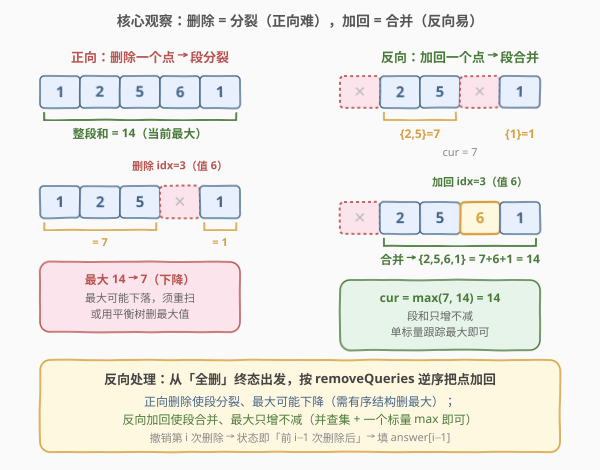
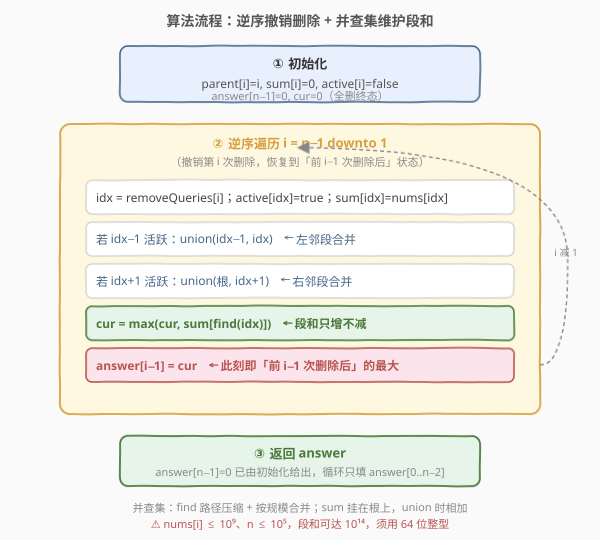
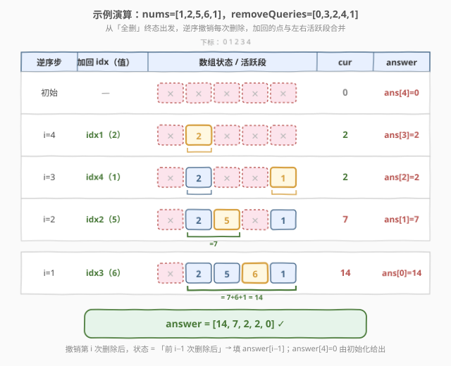

# LeetCode 删除操作后的最大子段和 题解

## 1. 题目概述

- **标题 / 题号**：删除操作后的最大子段和（#2382，hard）
- **链接**：https://leetcode.cn/problems/maximum-segment-sum-after-removals/
- **难度**：困难
- **标签**：并查集、数组、逆序处理

**题意**：给你两个下标从 **0** 开始的整数数组 `nums` 和 `removeQueries`，长度都为 `n`。第 `i` 次操作把 `nums` 中下标 `removeQueries[i]` 处的元素删除（视作置 `0`），将 `nums` 分割成更小的子段。**子段**是 `nums` 中连续的、未被删除元素形成的序列，**子段和**是子段中所有元素之和。请返回长度为 `n` 的数组 `answer`，其中 `answer[i]` 是第 `i` 次删除操作后的**最大**子段和。每个下标至多删除一次。

**示例 1**：

```text
输入：nums = [1,2,5,6,1], removeQueries = [0,3,2,4,1]
输出：[14,7,2,2,0]
解释：
查询 1：删除下标 0，nums = [0,2,5,6,1]，最大子段和 = 2+5+6+1 = 14。
查询 2：删除下标 3，nums = [0,2,5,0,1]，最大子段和 = 2+5 = 7。
查询 3：删除下标 2，nums = [0,2,0,0,1]，最大子段和 = 2。
查询 4：删除下标 4，nums = [0,2,0,0,0]，最大子段和 = 2。
查询 5：删除下标 1，nums = [0,0,0,0,0]，没有子段，最大子段和 = 0。
```

**示例 2**：

```text
输入：nums = [3,2,11,1], removeQueries = [3,2,1,0]
输出：[16,5,3,0]
```

**约束**：

- $n = \text{nums.length} = \text{removeQueries.length}$
- $1 \le n \le 10^5$
- $1 \le \text{nums}[i] \le 10^9$
- $0 \le \text{removeQueries}[i] < n$
- `removeQueries` 中所有数字互不相同

> 💡 **终态长什么样**：`removeQueries` 是 $0\sim n-1$ 的一个排列（长度 $n$、互异、值域 $[0,n)$），故每个下标恰被删一次。删完所有 $n$ 次后 `nums` 全为 `0`，**没有任何子段**，最大子段和为 `0`——这正是 `answer[n-1]=0` 的来源。整道题的难点不在于终态，而在于**删除是"分裂"**：一次删除可能把一个大连段砍成两小段，全局最大随之下降，要在线维护这个"下降的最大"。

## 2. 解题思路

### 2.1 暴力思路：正向逐次扫描

最直白的做法：用一个 `deleted[]` 标记被删下标，每次删除后从头到尾扫一遍 `nums`，对每段连续未删元素求和、取最大。

```python
def maximumSegmentSum(nums, removeQueries):
    n = len(nums)
    deleted = [False] * n
    ans = []
    for q in removeQueries:
        deleted[q] = True
        cur, seg = 0, 0
        for i in range(n):
            if not deleted[i]:
                seg += nums[i]
            else:
                cur = max(cur, seg)
                seg = 0
        cur = max(cur, seg)
        ans.append(cur)
    return ans
```

> ⚠️ 每次删除后都要 $O(n)$ 重扫，共 $n$ 次，总计 $O(n^2)$。$n=10^5$ 时约 $10^{10}$ 次操作，超时。问题在于**删除是破坏性操作**——它把段一分为二，全局最大可能下降，没法增量维护。突破口在于换个方向：**删除的逆操作是"加回"，而加回是"合并"**——合并只会让段和变大，最大单调不减，于是维护代价骤降。

### 2.2 核心观察：反向加边 + 并查集



**正向删除 = 分裂**：删掉一个内部点，一段被切成两段，全局最大可能从 $14$ 掉到 $7$。要在线维护这个"会下降的最大"，要么每次 $O(n)$ 重扫，要么上**有序结构（平衡树/`multiset`）**——删除时把旧段从结构里摘掉、塞进两个新段，还要支持"删当前最大值"，常数和实现都重。

**反向加回 = 合并**：从"全删"终态出发，按 `removeQueries` 的**逆序**把点一个个加回来。加回一个点时，它可能把左、右两个相邻活跃段以及它自己拼成一段，**新段和 = 左段和 + nums[idx] + 右段和 $\ge$ 原来的任意一段**。于是全局最大**只增不减**，用一个标量 `cur` 取 `max(cur, 新段和)` 即可跟踪，**无需任何有序结构**。

> 💡 **为什么逆序**：`answer[i]` 是"前 $i$ 次删除后"的最大子段和。逆序撤销第 $i$ 次删除（加回 `removeQueries[i]`）之后，留在现场的删除恰好是第 $0\dots i-1$ 次，即"前 $i-1$ 次删除后"的状态——所以撤销第 $i$ 次后立刻得到 `answer[i-1]`。终态（全删，`answer[n-1]=0`）作为逆序的起点天然已知，无需任何计算。

**并查集维护段和**：把每个连续活跃段视作一个集合，`sum[根]` 存该段元素和。加回 `idx` 时：

1. `active[idx]=True`，`sum[idx]=nums[idx]`（先独自成段）；
2. 若 `idx-1` 活跃 → `union(idx-1, idx)`：把左段并入当前段，`sum[新根]+=sum[左根]`；
3. 若 `idx+1` 活跃 → `union(根, idx+1)`：再把右段并入，`sum[新根]+=sum[右根]`；
4. `cur = max(cur, sum[find(idx)])`，写回 `answer[i-1]`。

带**路径压缩 + 按规模合并**，单次 `union/find` 均摊 $O(\alpha(n))\approx O(1)$。

### 2.3 算法流程图



1. **初始化**：`parent[i]=i`、`sum[i]=0`、`active[i]=false`，`answer[n-1]=0`、`cur=0`（全删终态）。
2. **逆序遍历** `i = n-1 \text{ downto } 1`：
   - `idx = removeQueries[i]`；`active[idx]=true`；`sum[idx]=nums[idx]`；
   - `idx-1` 活跃则 `union(idx-1, idx)`；`idx+1` 活跃则 `union(根, idx+1)`；
   - `cur = max(cur, sum[find(idx)])`；
   - `answer[i-1] = cur`。
3. **返回** `answer`（`answer[n-1]=0` 已由初始化给出，循环只填 `answer[0..n-2]`）。

### 2.4 示例演算



以示例 1 `nums=[1,2,5,6,1], removeQueries=[0,3,2,4,1]` 为例，从"全删"终态（`answer[4]=0`）逆序撤销：

| 逆序步 | 撤销第 $i$ 次 | 加回 idx（值） | 活跃段 | 各段和 | cur | 填入 |
|--------|---------------|----------------|--------|--------|-----|------|
| 初始 | — | — | （全删） | — | 0 | `answer[4]=0` |
| $i=4$ | 第 4 次（`rq[4]=1`） | idx 1（2） | `{1}` | `{2}` | 2 | `answer[3]=2` |
| $i=3$ | 第 3 次（`rq[3]=4`） | idx 4（1） | `{1}`,`{4}` | `{2}`,`{1}` | 2 | `answer[2]=2` |
| $i=2$ | 第 2 次（`rq[2]=2`） | idx 2（5） | `{1,2}`,`{4}` | `{7}`,`{1}` | 7 | `answer[1]=7` |
| $i=1$ | 第 1 次（`rq[1]=3`） | idx 3（6） | `{1,2,3,4}` | `{14}` | 14 | `answer[0]=14` |

最终 `answer = [14,7,2,2,0]` ✓。注意 `removeQueries[0]=0` 对应的"第 0 次删除"**永不撤销**——循环 `i` 只走到 $1$，撤销完第 $1$ 次后现场只剩第 $0$ 次删除生效，即"前 0 次删除后"（实为只删了下标 0）的状态，正是 `answer[0]`。

> 💡 **读法**：`cur` 在逆序过程中**单调不减**（$0\to2\to2\to7\to14$），因为加回只让段变大、从不让它变小。每步只需关心"刚合并出的那段"是否刷新了 `cur`，其余段保持原值不动——这正是反向处理能省掉有序结构的关键。

## 3. 参考代码

### C++

```cpp
class Solution {
public:
    vector<long long> maximumSegmentSum(vector<int>& nums, vector<int>& removeQueries) {
        int n = nums.size();
        vector<int> parent(n), size_(n, 1);
        vector<long long> sum_(n, 0);
        vector<bool> active(n, false);
        iota(parent.begin(), parent.end(), 0);

        function<int(int)> find = [&](int x) -> int {
            while (parent[x] != x) {
                parent[x] = parent[parent[x]];     // 路径压缩（隔代）
                x = parent[x];
            }
            return x;
        };
        auto unite = [&](int x, int y) {
            int rx = find(x), ry = find(y);
            if (rx == ry) return;
            if (size_[rx] < size_[ry]) swap(rx, ry);   // 小树挂大树
            parent[ry] = rx;
            size_[rx] += size_[ry];
            sum_[rx] += sum_[ry];
        };

        vector<long long> ans(n, 0);                  // ans[n-1] = 0（全删终态）
        long long cur = 0;
        for (int i = n - 1; i > 0; --i) {             // 逆序撤销第 i 次删除
            int idx = removeQueries[i];
            active[idx] = true;
            sum_[idx] = nums[idx];
            int root = idx;
            if (idx - 1 >= 0 && active[idx - 1]) {    // 左邻活跃：合并
                unite(idx - 1, idx);
                root = find(idx);
            }
            if (idx + 1 < n && active[idx + 1]) {    // 右邻活跃：合并
                unite(root, idx + 1);
                root = find(root);
            }
            cur = max(cur, sum_[find(idx)]);
            ans[i - 1] = cur;
        }
        return ans;
    }
};
```

> ⚠️ **必须用 `long long`**：$\text{nums}[i]\le10^9$、$n\le10^5$，一段的和可达 $10^{14}$，远超 `int32` 上界 $\approx2.1\times10^9$。`sum_`、`ans`、`cur` 都要 64 位。

### Python

```python
class Solution:
    def maximumSegmentSum(self, nums: List[int], removeQueries: List[int]) -> List[int]:
        n = len(nums)
        parent = list(range(n))
        size = [1] * n
        seg = [0] * n                      # 段和，挂在根上
        active = [False] * n

        def find(x: int) -> int:
            while parent[x] != x:
                parent[x] = parent[parent[x]]   # 路径压缩（隔代）
                x = parent[x]
            return x

        def unite(a: int, b: int) -> None:
            ra, rb = find(a), find(b)
            if ra == rb:
                return
            if size[ra] < size[rb]:           # 小树挂大树
                ra, rb = rb, ra
            parent[rb] = ra
            size[ra] += size[rb]
            seg[ra] += seg[rb]

        ans = [0] * n                          # ans[n-1] = 0（全删终态）
        cur = 0
        for i in range(n - 1, 0, -1):          # 逆序撤销第 i 次删除
            idx = removeQueries[i]
            active[idx] = True
            seg[idx] = nums[idx]
            root = idx
            if idx - 1 >= 0 and active[idx - 1]:   # 左邻活跃：合并
                unite(idx - 1, idx)
                root = find(idx)
            if idx + 1 < n and active[idx + 1]:    # 右邻活跃：合并
                unite(root, idx + 1)
                root = find(root)
            cur = max(cur, seg[find(idx)])
            ans[i - 1] = cur
        return ans
```

> 💡 Python 大整数天然不溢出，无需类型标注。`find` 写成迭代式，避免 $n=10^5$ 退化成链时递归过深的风险。

## 4. 复杂度分析

| 维度 | 复杂度 | 说明 |
|------|--------|------|
| **时间复杂度** | $O\!\left(n\,\alpha(n)\right)$ | 逆序 $n-1$ 轮，每轮常数次 `union`/`find`，均摊 $O(\alpha(n))\approx O(1)$ |
| **空间复杂度** | $O(n)$ | `parent`、`size`、`seg`、`active`、`ans` 各 $O(n)$ |

> 💡 与暴力 $O(n^2)$ 相比，本解法把"删除分裂 → 重扫求最大"重构为"加回合并 → 单标量取 max"——**操作的单调性**（合并只增不减）是省掉有序结构、降到近线性的关键。

## 5. 扩展：正向解法（有序集合）

反向并查集并非唯一解。正向也能做，但需要维护"当前所有段和"的有序结构：

- 用一个 `map`/`TreeMap` 按 `idx` 存每段的 `[l, r]`，配合一个 `multiset`（或 `SortedList`/`TreeMap<Long>` 计数）存所有段和；
- 删除 `idx` 时：找到 `idx` 所属段 `[l, r]`（按 `l` 二分），从 `multiset` 删去该段和，把段拆成 `[l, idx-1]` 和 `[idx+1, r]` 两段（若非空），把两个新段和塞回 `multiset`；
- 当前最大即 `multiset` 的最大值（`*rbegin` 或末尾键）。

| 解法 | 思路 | 时间 | 空间 | 备注 |
|------|------|------|------|------|
| 反向并查集 | 逆序加边、`cur` 取 max | $O(n\alpha(n))$ | $O(n)$ | 实现简洁、常数小，**推荐** |
| 正向有序集合 | 删段拆两段、维护段和多重集 | $O(n\log n)$ | $O(n)$ | 逻辑直接但需 `TreeMap`+`multiset`，C++ 用 `std::map`+`std::multiset` |

> 💡 **何时该选正向**：若题目改为"在线询问、删除顺序事先未知（流式）"，反向不再可用，正向有序集合便是唯一出路。本题删除顺序以 `removeQueries` 全量给出，故反向可整体倒推——这是**离线逆序处理**的典型适用条件。

## 6. 面试要点

1. **为什么想到反向处理？**

    - 正向删除是"分裂"，会让全局最大下降，要在线维护一个"会减少的最大值"，必须上有序结构。反向把"分裂"翻转成"合并"，而合并只让段和变大、最大单调不减——用一个标量 `cur = max(cur, 新段和)` 就能跟踪，**单调性消除了对有序结构的依赖**。这是"操作可逆 + 顺序离线给定"时的通用思路。

2. **`answer[i-1]` 为什么等于撤销第 $i$ 次后的 `cur`？**

    - 撤销第 $i$ 次删除（加回 `removeQueries[i]`）后，现场仍生效的删除是第 $0\dots i-1$ 次，这正是"前 $i-1$ 次删除后"的状态，对应 `answer[i-1]`。逆序从"全删"（`answer[n-1]=0`）起步，每撤销一步就把时间倒退一格，`answer` 从右往左填满。

3. **为什么 `cur = max(cur, 新段和)` 就够，不用遍历所有段？**

    - 反向过程中只发生"合并"，段只会变大、不会变小或消失。除刚合并出的那段外，其余段和**保持不变**；而刚合并出的新段和 $\ge$ 它吞掉的旧段和。故全局最大要么不变、要么被新段刷新，取 `max(cur, 新段和)` 即可维护。若改回正向（分裂），此性质失效，必须维护多重集。

4. **并查集的 `sum` 为什么挂在根上、合并时相加？**

    - 一个连续活跃段对应一个并查集集合，段和即集合内所有元素之和。把 `sum` 只存在根处，`find(x)` 拿到根即拿到整段和；`union` 时把被挂树的 `sum` 累加到新根上，不变量"根的 `sum` = 该段总和"始终成立。配合按规模合并 + 路径压缩，单次均摊 $O(\alpha(n))$。

5. **`removeQueries[0]` 为什么不撤销？循环为什么到 `i=1` 就停？**

    - 循环 `i` 从 $n-1$ 降到 $1$，撤销的是第 $1\dots n-1$ 次删除。撤销完第 $1$ 次后，现场只剩第 $0$ 次删除生效，即 `answer[0]` 对应的状态。第 $0$ 次删除无需再撤销——`answer[0]` 已在这一步填好。若误把循环写成降到 $0$，会多撤销一次，得到的"全原始数组"状态不对应任何 `answer[i]`。

> 💡 **一句话总结**：删除是分裂、加回是合并——把删除逆序翻转成"加边"，用并查集维护段和，靠"合并只增不减"的单调性用单标量 `cur` 跟踪最大，$O(n\alpha(n))$ 搞定。

## 同类练习题

| # | 题目 | 与本题的关联 |
|---|------|-------------|
| 2316 | [统计无向图中无法互相到达点对数](../2301-2400/2316_统计无向图中无法互相到达点对数.md) | 并查集模板题，`union`+`find`+按规模合并的同一套骨架，本题在此之上多维护一个挂在根上的 `sum` |
| 684 | [冗余连接](../0601-0700/684_冗余连接.md) | 并查集判环，加边时两端已同根即为答案，同模板不同问法 |
| 547 | [省份数量](../0501-0600/547_省份数量.md) | 并查集求连通分量数，承接 `union`/`find` 的基础用法 |
| 2380 | [二进制字符串重新安排顺序需要的时间](../2301-2400/2380_二进制字符串重新安排顺序需要的时间.md) | 同在 23xx 区间，把"逐秒模拟 $O(n^2)$"降维为"一维递推 $O(n)$"——与本题"正向 $O(n^2)$ → 反向 $O(n\alpha)$"同为**通过改变处理方向/维度把高复杂度压成线性**的范例 |
| 1850 | [邻位交换的最小次数](https://leetcode.cn/problems/minimum-adjacent-swaps-to-reach-the-kth-smallest-number/) | 通过把"相邻交换计数"转化为对排列的贪心操作来降维，体现"换个角度看操作"的同一思想 |
