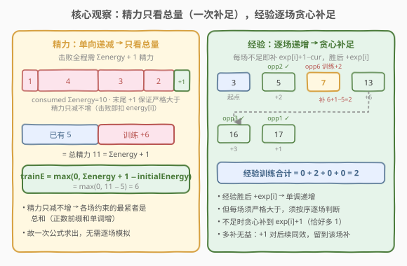
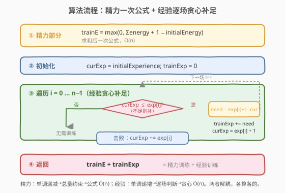
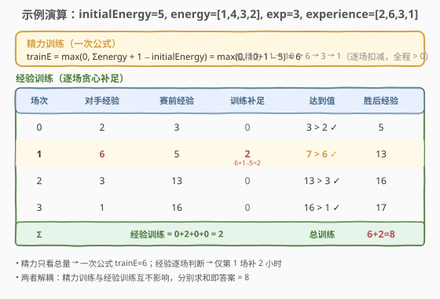

# 赢得比赛需要的最少训练时长

- **题目名称**：赢得比赛需要的最少训练时长
- **链接**：[2383. 赢得比赛需要的最少训练时长](https://leetcode.cn/problems/minimum-hours-of-training-to-win-a-competition/)
- **难度**：简单
- **标签**：贪心、数组、模拟

## 1. 题目概述

你正在参加一场比赛，初始精力为 `initialEnergy`、初始经验为 `initialExperience`（均为正整数）。另给两个长度均为 $n$ 的数组 `energy` 与 `experience`，你将**依次**对上 $n$ 个对手：第 $i$ 个对手精力为 `energy[i]`、经验为 `experience[i]`。

击败对手 $i$ 需要**在精力和经验上都严格超过**对手（$>$，而非 $\ge$），击败后：

- 经验**增加** `experience[i]`；
- 精力**减少** `energy[i]`。

开赛前可训练若干小时，每小时**任选**其一：精力 $+1$ 或经验 $+1$。返回击败全部 $n$ 个对手所需的**最少**训练小时数。

**示例 1**：

```text
输入：initialEnergy = 5, initialExperience = 3, energy = [1,4,3,2], experience = [2,6,3,1]
输出：8
解释：训练 6 小时把精力提到 11，再训练 2 小时把经验提到 5；
依次击败 4 个对手，最终精力 1、经验 17。
```

**示例 2**：

```text
输入：initialEnergy = 2, initialExperience = 4, energy = [1], experience = [3]
输出：0
解释：初始精力 2 > 1、初始经验 4 > 3，无需训练。
```

**约束条件**：

- $n = \text{energy.length} = \text{experience.length}$
- $1 \le n \le 100$
- $1 \le \text{initialEnergy}, \text{initialExperience}, \text{energy}[i], \text{experience}[i] \le 100$

> 💡 **关键不变式**：精力只减不增、经验只增不减——两条资源走相反方向，决定了它们的最优补足策略完全不同：**精力看总和，经验看每场**。

---

## 2. 解题思路

### 2.1 暴力思路：二分训练总时长 + 逐场模拟

最直白的做法是**二分训练小时数** $T$，对每个 $T$ 暴力枚举「分多少给精力、分多少给经验」并逐场模拟判定。但「分配」是二维的，朴素枚举分配方案达 $O(T)$，再加二分与 $O(n)$ 模拟，整体 $O(T\,n\log T)$，虽能 AC 却把简单问题复杂化，且掩盖了「两种资源为何可解耦」的本质。

> ⚠️ 关键在于：精力约束与经验约束**互不耦合**——精力是否够只取决于精力总量，经验是否够只取决于经验序列，二者可**独立**求最小补足再相加。

### 2.2 核心观察：精力看总和，经验逐场贪心补足



把两类资源分开看：

**精力（单向递减 → 只看总和）。** 击败对手 $i$ 后精力减 `energy[i]`，故精力在全程**只减不增**。设赛前训练补足精力 $t_E$，则第 $i$ 场赛前精力为

$$\text{curE}_i = \text{initialEnergy} + t_E - \sum_{j<i} \text{energy}[j].$$

需 $\text{curE}_i > \text{energy}[i]$，即

$$\text{initialEnergy} + t_E > \sum_{j\le i} \text{energy}[j].$$

由于 `energy` 全为正，前缀和 $\sum_{j\le i}\text{energy}[j]$ **单调递增**，最紧约束在 $i=n-1$，即全程总需求：

$$\text{initialEnergy} + t_E > \sum_{j}\text{energy}[j] \;\Longleftrightarrow\; t_E = \max\!\left(0,\; \sum_j \text{energy}[j] + 1 - \text{initialEnergy}\right).$$

> 💡 末尾的 $+1$ 来自「严格大于」：精力需比总和**多至少 1**，故总需求是 $\Sigma\text{energy}+1$。

**经验（单向递增 → 逐场贪心补足）。** 击败对手 $i$ 后经验加 `experience[i]`，经验**只增不减**。但每场都必须严格大于对手经验，无法像精力那样压成一条公式——因为经验在比赛中途会变化，第 $i$ 场的「赛前经验」依赖前几场的胜负与补足。

最优策略是**逐场贪心**：到场 $i$ 时，若当前经验 $\text{curX} \le \text{experience}[i]$，就**恰好补足**到 $\text{experience}[i]+1$（多 1 即严格大于，多补无益），随后击败并 $\text{curX} \mathrel{+}= \text{experience}[i]$。

> 💡 **为什么多补无益？** 训练给经验 $+1$，这个 $+1$ 对后续所有场同效——无论在第 $i$ 场前补还是第 $i+1$ 场前补，它都同样抬高后续的 `curX`。但第 $i$ 场的「严格大于」是**硬门槛**，不足就必须当场补到 `experience[i]+1`；而超过门槛部分留到后面再补，不会让总训练变少。故「每场补到恰好 `experience[i]+1`」是最优。

两类资源解耦，最终答案 $= t_E + t_X$，其中 $t_X = \sum_i \max(0,\, \text{experience}[i]+1 - \text{curX}_i)$ 在逐场模拟中累加。

### 2.3 算法流程图



三段走：精力一次公式求 $t_E$ $\to$ 遍历 $n$ 场贪心补足累加 $t_X$ $\to$ 返回 $t_E + t_X$。精力 $O(n)$ 求和、经验 $O(n)$ 扫描，整体 $O(n)$。

### 2.4 示例演算



以示例 1 `initialEnergy=5, energy=[1,4,3,2], initialExperience=3, experience=[2,6,3,1]` 演算：

**精力部分**：$\Sigma\text{energy}=10$，$t_E = \max(0,\, 10+1-5) = 6$，总精力 $11$。逐场扣减 $11\to10\to6\to3\to1$，全程严格大于 $0$。✓

**经验部分**（逐场贪心）：

| 场次 | 对手经验 | 赛前经验 | 训练补足 | 达到值 | 胜后经验 |
|------|----------|----------|----------|--------|----------|
| 0    | 2        | 3        | 0        | $3>2$ ✓ | 5        |
| 1    | 6        | 5        | 2        | $7>6$ ✓ | 13       |
| 2    | 3        | 13       | 0        | $13>3$ ✓ | 16       |
| 3    | 1        | 16       | 0        | $16>1$ ✓ | 17       |

仅第 1 场不足：$6+1-5=2$，补 $2$ 小时后到 $7$，胜后 $7+6=13$。$t_X = 0+2+0+0 = 2$。

**总训练** $= t_E + t_X = 6 + 2 = 8$ ✓。

---

## 3. 参考代码

### C++

```cpp
class Solution {
public:
    int minNumberOfHours(int initialEnergy, int initialExperience,
                         vector<int>& energy, vector<int>& experience) {
        int sumEnergy = 0;
        for (int e : energy) sumEnergy += e;
        int trainE = max(0, sumEnergy + 1 - initialEnergy);

        int curX = initialExperience, trainX = 0;
        for (int x : experience) {
            if (curX <= x) {
                trainX += x + 1 - curX;
                curX = x + 1;
            }
            curX += x;
        }
        return trainE + trainX;
    }
};
```

> 💡 精力用「求和 + 一次公式」，无需逐场判断；经验用「不足即补到 `x+1`，再 `+= x`」。`curX <= x` 含等号，因为要求严格大于。若 `curX == x` 也要补 1。

### Python

```python
class Solution:
    def minNumberOfHours(self, initialEnergy: int, initialExperience: int,
                         energy: List[int], experience: List[int]) -> int:
        train_e = max(0, sum(energy) + 1 - initialEnergy)

        cur_x, train_x = initialExperience, 0
        for x in experience:
            if cur_x <= x:
                train_x += x + 1 - cur_x
                cur_x = x + 1
            cur_x += x
        return train_e + train_x
```

> 💡 `sum(energy)` 一次求和；经验循环里 `cur_x <= x` 分支补足后再 `+= x`。也可写成 `need = max(0, x + 1 - cur_x); train_x += need; cur_x += need + x`，省去分支显式更新，语义一致。

---

## 4. 复杂度分析

| 维度 | 复杂度 | 说明 |
|------|--------|------|
| **时间复杂度** | $O(n)$ | 精力求和一轮 $O(n)$ + 经验逐场扫描一轮 $O(n)$ |
| **空间复杂度** | $O(1)$ | 只用常数个累加变量，无需额外数据结构 |
| 对照：二分 + 枚举分配 | $O(Tn\log T)$ / $O(1)$ | 二维分配枚举 + 模拟判定，正确但大材小用 |
| 对照：逐场模拟精力 | $O(n)$ / $O(1)$ | 不压成公式，对每场判断精力也 AC，但冗余 |

> 💡 本题 $n \le 100$、值域 $\le 100$，任何 $O(n)$ 甚至 $O(n\log n)$ 做法都轻松 AC。最优解胜在**两条 $O(n)$ 单遍扫描 + 常数空间**，且揭示了精力/经验可解耦的本质。

---

## 5. 扩展：双向资源类贪心——单向看端点，可变看过程

2383 是「**双资源各走相反方向**」的贪心招牌题。把这种结构抽象出来：

| 资源方向 | 约束形态 | 最优策略 | 代表量 |
|----------|----------|----------|--------|
| 单调递减（只耗） | 各点 $\ge$ 阈值 $\Rightarrow$ 总量约束 | 看端点：一次公式补足 | 精力 $t_E$ |
| 单调递增（只攒） | 各点 $>$ 阈值，过程受前序影响 | 看过程：逐场贪心补足 | 经验 $t_X$ |

> 💡 **通用判据**：若某量在过程中**单调不变**（只增或只减），其约束可压成「端点 / 总和」一条公式；若在过程中**随胜负变化**，则须**按序逐项**处理。2383 把两种情形放在一起，正好训练「识别可解耦 vs 必须逐项」的直觉。

可看作「**前缀最值约束**」家族的变体：精力的最紧约束 $=$ 末尾前缀和（单调增序列的 max），与「前缀 max 决定下界」一脉相承；经验的逐场门槛则类似「**在线补足**」——看到才能决策。

---

## 6. 面试要点

1. **为什么精力只看总和，不必逐场判断？**

   > 精力击败后只减不增。第 $i$ 场赛前精力 $= \text{init}+t_E-\sum_{j<i}\text{energy}[j]$，需 $>$ `energy[i]`，即 $\text{init}+t_E > \sum_{j\le i}\text{energy}[j]$。`energy` 全正 $\Rightarrow$ 前缀和单调递增 $\Rightarrow$ 最紧约束在末场 $=$ 总和。故 $t_E=\max(0, \Sigma\text{energy}+1-\text{init})$ 一条公式搞定。

2. **经验为什么不能也压成一条公式？**

   > 经验击败后**增加** `experience[i]`，第 $i$ 场赛前经验依赖前面每场的胜负与补足，是一条「会变的状态」。它不像精力的总量那样可被端点决定，必须**按序逐场**判断并补足。核心区别：精力状态单调减（终点定），经验状态单调增但带跳变（过程定）。

3. **经验贪心补足「恰好到 `experience[i]+1`」为何最优？多补会怎样？**

   > 多补的 $+1$ 对后续所有场同效（都抬高后续 `curX`），但当前场的硬门槛只要「严格大于」，超过部分留到需要时再补不迟——多补不会减少总训练。故每场补到恰好 `experience[i]+1` 是最小且充分的。可用交换论证：把「在第 $i$ 场多补 1」换到「第 $i+1$ 场前补 1」，可行性不变，总额不变，故存在最优解满足「每场恰好补足」。

4. **「严格大于」在代码里如何体现？**

   > 精力：总需求是 $\Sigma\text{energy}+1$（$+1$ 即严格大于的 slack）。经验：判断条件用 `curX <= x`（含等号），不足时补到 `x+1`。若误用 `<` 或 `>=`，会在相等时漏补导致无法严格超过。

5. **两类资源为何可解耦、直接相加？**

   > 训练每小时二选一加精力或经验，但精力的最小需求 $t_E$ 只由精力数组决定、经验的最小需求 $t_X$ 只由经验数组决定，二者**无耦合约束**（不存在「同一小时必须同时服务两方」的硬限制）。故各自取最小再相加即为全局最小：$t_E+t_X$。

> 💡 **一句话总结**：精力单调减 $\Rightarrow$ 看总和一条公式；经验单调增带跳变 $\Rightarrow$ 逐场贪心补到 `exp[i]+1`。两者解耦，$O(n)$ 各扫一遍，$O(1)$ 空间，相加即答案。

---

## 7. 同类练习题

- [55. 跳跃游戏](https://leetcode.cn/problems/jump-game/)：维护「最远可达」前缀 max——单向扩张的覆盖范围由前缀端点决定，与精力「总量约束」同属「单调量看端点」范式
- [134. 加油站](https://leetcode.cn/problems/gas-station/)：油量在环形路径上增减，净余量 $\ge 0$ 决定可达性——单向累积资源能否撑完全程的判定，对照精力的总和门槛
- [122. 买卖股票的最佳时机 II](https://leetcode.cn/problems/best-time-to-buy-and-sell-stock-ii/)：贪心逐日决策（每天能赚就赚）——「按序逐项贪心」的纯经验版，对照经验逐场补足
- [2133. 检查是否每一行出现且仅出现一次](https://leetcode.cn/problems/check-if-every-row-and-column-contains-all-numbers/)：行列独立校验——资源/约束分维度解耦后各算各的，与精力/经验解耦同构
- [1423. 可获得的最大点数](https://leetcode.cn/problems/maximum-points-you-can-obtain-from-cards/)：从两端取 $k$ 张求最大——端点决定型贪心，对照精力「看端点/总和」而非逐项
