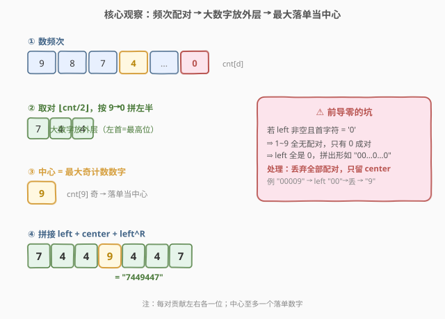
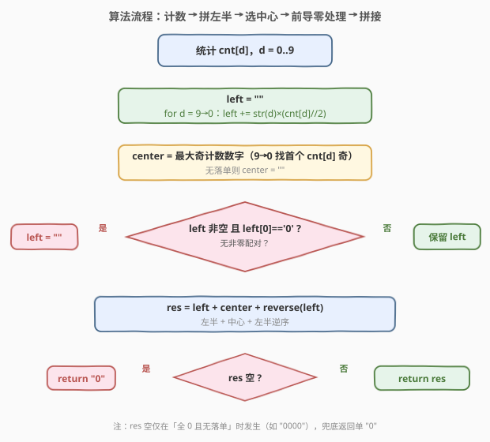
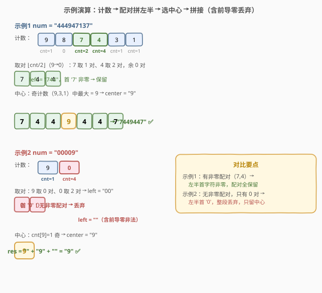

# LeetCode 最大回文数字 题解

## 1. 题目概述

- **标题 / 题号**：最大回文数字（#2384，medium）
- **链接**：https://leetcode.cn/problems/largest-palindromic-number/
- **难度**：中等
- **标签**：贪心、计数、字符串

**题意**：给你一个仅由数字（$0\sim 9$）组成的字符串 $\text{num}$。从中**挑选若干数字**（可重排、不必用完，但**至少用一个**），拼成一个**不含前导零**的**最大回文整数**，以字符串形式返回。

**示例 1**：

```text
输入：num = "444947137"
输出："7449447"
解释：选用 4,4,4,9,4,7,7 → 回文 "7449447"，为能拼出的最大回文。
```

**示例 2**：

```text
输入：num = "00009"
输出："9"
解释：含前导零的回文非法，故只能取单数字 "9"。
```

**约束**：

- $1 \le \text{num.length} \le 10^5$
- $\text{num}$ 仅由数字 $0\sim 9$ 组成

> ⚠️ **关键信号**：回文的结构是「左半 + 中心 + 右半（左半的逆）」。每个出现在两侧的数字必然**成对**（贡献 $2$ 个相同数字），中心至多 $1$ 个落单数字。于是问题退化为：**统计每种数字的频次 → 决定每对放哪、谁当中心**。一对一对地数，贪心即出。

## 2. 解题思路

### 2.1 暴力思路

$n$ 高达 $10^5$，若枚举「选哪些位、怎么排列」是组合爆炸（$O(n!)$ 量级）。正解应从回文的**结构对称性**入手：只看每个数字「能用几对」「谁有落单」，把搜索问题转化为**计数 + 拼接**的构造问题。

### 2.2 核心观察：配对计数 + 贪心放外层 + 取最大落单作中心



设 $\text{cnt}[d]$ 为数字 $d$ 的出现次数。回文由两部分拼成：

1. **成对部分**：每个 $d$ 可贡献 $\lfloor \text{cnt}[d]/2 \rfloor$ 对，每对在左右两侧各放一个 $d$。
2. **中心部分**：至多取一个「落单」的 $d$（即 $\text{cnt}[d]$ 为奇数者）放在正中。

**贪心三原则**：

| 原则 | 做法 | 理由 |
|------|------|------|
| **大数字放外层** | 左半按 $d$ **从大到小**拼接 | 最外层（最高位）数字越大，整数越大 |
| **配对尽量用满** | 每 $d$ 取满 $\lfloor \text{cnt}/2 \rfloor$ 对 | 合法的更长回文必大于更短者（无前导零时） |
| **中心取最大落单** | 从 $9$ 往 $0$ 找首个奇计数 $d$ 作中心 | 中心位同长下越大越好 |

于是左半 $\text{left}=\underbrace{9\cdots9}_{\lfloor c_9/2\rfloor}\underbrace{8\cdots8}_{\lfloor c_8/2\rfloor}\cdots\underbrace{0\cdots0}_{\lfloor c_0/2\rfloor}$，中心 $\text{center}=$ 最大的奇计数数字，答案即 $\text{left}+\text{center}+\text{left}^R$。

> ⚠️ **唯一的坑——前导零**：若 $\text{left}$ 非空且首字符为 `'0'`，说明**没有任何非零数字成对**（$\text{left}$ 全是 $0$），拼出形如 `"00...0...0...0"` 必含前导零、非法。此时**丢弃所有配对**，只留中心（若中心也空则只能返回 `"0"`）。这正是示例 2 的情形。

> 💡 **为何「配对尽量用满」恒优**：一个合法回文只要不含前导零，位数越多越大。多塞一对 $d$ 是在**最内层**各加一位 $d$，不改变最高位、只增长度，必然变大。故每 $d$ 都取满对数最优（除非触发前导零丢弃）。

### 2.3 算法流程图



### 2.4 示例演算



- **示例 1** `"444947137"`：计数 $c_4=4,c_7=2,c_9=c_3=c_1=1$。配对：$7$ 取 $1$ 对、$4$ 取 $2$ 对 → $\text{left}=\text{"744"}$（大在前）；中心：奇计数中最大为 $9$ → $\text{center}=\text{"9"}$。$\text{left}$ 首 `'7'$ 非零，不丢。结果 $=\text{"744"}+\text{"9"}+\text{"447"}=\text{"7449447"}$。
- **示例 2** `"00009"`：计数 $c_0=4,c_9=1$。配对：$9$ 取 $0$ 对、$0$ 取 $2$ 对 → $\text{left}=\text{"00"}$；中心：$9$ → $\text{"9"}$。但 $\text{left}$ 首 `'0'` → **丢弃** → $\text{left}=\text{""}$。结果 $=\text{""}+\text{"9"}+\text{""}=\text{"9"}$。

## 3. 参考代码

### C++

```cpp
class Solution {
public:
    string largestPalindromic(string num) {
        int cnt[10] = {0};
        for (char c : num) ++cnt[c - '0'];

        string left;
        for (int d = 9; d >= 0; --d)
            left += string(cnt[d] / 2, '0' + d);

        string center;
        for (int d = 9; d >= 0; --d) {
            if (cnt[d] % 2 == 1) { center = string(1, '0' + d); break; }
        }

        if (!left.empty() && left[0] == '0') left.clear();

        string res = left + center + string(left.rbegin(), left.rend());
        return res.empty() ? "0" : res;
    }
};
```

### Python

```python
class Solution:
    def largestPalindromic(self, num: str) -> str:
        cnt = [0] * 10
        for c in num:
            cnt[int(c)] += 1

        left = "".join(str(d) * (cnt[d] // 2) for d in range(9, -1, -1))
        center = ""
        for d in range(9, -1, -1):
            if cnt[d] % 2 == 1:
                center = str(d)
                break

        if left and left[0] == "0":
            left = ""

        res = left + center + left[::-1]
        return res if res else "0"
```

> 💡 两个要点：(1) 外层循环固定遍历 $9\to 0$ 共 $10$ 次，天然把大数字排到外层；(2) 前导零判定只需看 `left[0]`——由于是按降序拼的，首字符为 `'0'` 当且仅当**全程无非零配对**，故 `clear()` 丢掉的是一串全零，不必逐位剥。

## 4. 复杂度分析

| 维度 | 复杂度 | 说明 |
|------|--------|------|
| **时间复杂度** | $O(n)$ | 一次遍历计数 $O(n)$；拼接与翻转合计 $\le n$；外层固定 $10$ 步 |
| **空间复杂度** | $O(n)$ | 输出串最长即 $n$（除输出外仅 $O(1)$ 的计数数组） |

> ⚠️ 朴素「枚举排列」是 $O(n!)$；本题关键在于把「搜索最大回文」转化为「按数字频次贪心拼接」，一步把阶乘级压成线性。

## 5. 扩展：与「回文排列 / 最长回文串」的对照

本题属于「**回文构造**」家族，与几道同源题可对照：

- [266. 回文排列](https://leetcode.cn/problems/palindrome-permutation/)（[站内题解](../0201-0300/266_回文排列.md)）：只**判定**能否重排成回文——条件是「奇计数数字种类 $\le 1$」。本题在其上多走两步：不仅要能成回文，还要**最大**，故从「可行性」升级为「最优构造」。
- [409. 最长回文串](https://leetcode.cn/problems/longest-palindrome/)（[站内题解](../0401-0500/409_最长回文串.md)）：问能拼出的最长回文**长度**，套路完全一致（成对 $\times 2$ + 至多一个落单）。本题是它的「数字版 + 要求字典序最大 + 禁前导零」加强版——同一套配对计数，但本题要把对**按数字降序排到外层**并处理 $0$ 的特殊性。

> 💡 一句话横向对比：**266 判可行（奇种 $\le1$）、409 求最长（数对和）、2384 求最大（数对降序拼外层 + 最大落单当中心 + 禁前导零）**。同一频次表，三种问法。

## 6. 面试要点

1. **为什么左半要按数字从大到小拼接？**
   - 回文的最高位就是左半的首字符。要最大化整数，最高位越大越好；次高位同理。把可用配对的大数字放外层（左半前部），即让高位尽量大，这是字典序贪心。交换论证：若左半存在「小在前、大在后」的相邻两位，把它们换位后高位变大、回文仍合法，故降序最优。

2. **「配对尽量用满」会不会因为塞了 $0$ 而变差？**
   - 不会。多塞一对 $d$ 是在**最内层**（左半末、右半首）各加一位，不碰最高位，只让回文变长。无前导零时长回文必大于短回文，故塞满更优。唯一的例外是「全程无非零配对」时 $0$ 对会顶到最高位形成前导零，需整体丢弃——这正是前导零判定的边界。

3. **前导零判定为什么只看 `left[0] == '0'`？**
   - 左半是按 $9\to 0$ 降序拼的，首字符即「最大的有配对的数字」。它为 `'0'` 当且仅当 $1\sim 9$ 都没有配对、只有 $0$ 有配对。此时 `left` 必是一串全零，整体丢弃即可，不必逐位判断。

4. **中心一定要取「最大落单数字」吗？能不能不用中心更长更好？**
   - 中心是单个字符，塞它只增 $1$ 位且在最中央，必让回文更长（且不影响最高位与前导零），故有落单就**尽量用**。多个落单数字中选最大的，是因为同长（都加一个中心）下中心越大整数越大。落单数字至多取一个（中心只能放一个），其余落单者自动舍弃。

5. **全是 $0$ 的输入（如 `"0000"`）返回什么？为什么不是 `"00"`？**
   - 返回 `"0"`。$c_0$ 为偶数时无落单 → 中心空；$\text{left}$ 为 `"00"` 触发前导零丢弃 → 空；最终结果空，按「至少用一个数字」兜底返回 `"0"`。`"00"` 含前导零非法，`"0"` 是唯一合法的单零回文。

> 💡 **一句话总结**：数频次，每数字取满 $\lfloor c/2 \rfloor$ 对按降序拼左半、最大奇计数当中心、左半首为 `'0'` 则丢全部配对；左半+中心+左半逆即答案。

## 同类练习题

| # | 题目 | 与本题的关联 |
|---|------|-------------|
| 409 | [最长回文串](https://leetcode.cn/problems/longest-palindrome/)（[站内题解](../0401-0500/409_最长回文串.md)） | 同套配对计数求最长回文长度，本题是其「要求字典序最大 + 禁前导零」的数字加强版。 |
| 266 | [回文排列](https://leetcode.cn/problems/palindrome-permutation/)（[站内题解](../0201-0300/266_回文排列.md)） | 判定能否重排成回文（奇种 $\le 1$），把本题的「构造」退回为「可行性」。 |
| 9 | [回文数](https://leetcode.cn/problems/palindrome-number/)（[站内题解](../0001-0100/9_回文数.md)） | 数字版回文判定，对照「给定数字判是否回文」与本题「给定数字位拼最大回文」的方向差异。 |
| 680 | [验证回文串 II](https://leetcode.cn/problems/valid-palindrome-ii/)（[站内题解](../0601-0700/680_验证回文串II.md)） | 回文家族的「删一位判可行」，与本题「拼最大」互补——前者做减法，后者做加法。 |
| 5 | [最长回文子串](https://leetcode.cn/problems/longest-palindromic-substring/)（[站内题解](../0001-0100/5_最长回文子串.md)） | 在原串中找最长回文子串（不可重排），与本题「可重排拼最大」形成「保序 vs 自由序」对照。 |
