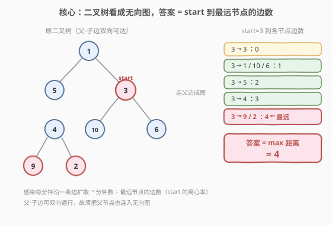
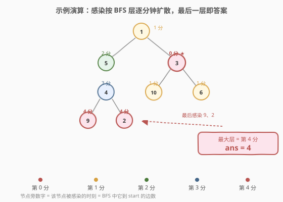
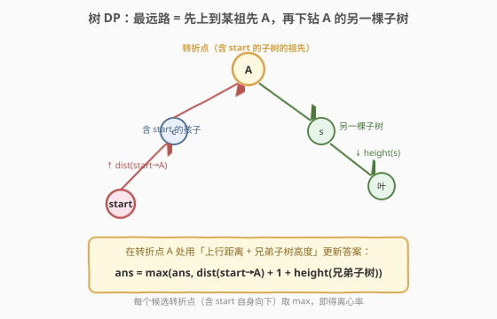

# LeetCode 感染二叉树需要的总时间 题解

## 1. 题目概述

- **标题 / 题号**：感染二叉树需要的总时间（#2385，medium）
- **链接**：https://leetcode.cn/problems/amount-of-time-for-binary-tree-to-be-infected/
- **难度**：中等
- **标签**：树、深度优先搜索、广度优先搜索、二叉树

**题意**：给你一棵二叉树的根 `root`，节点值**互不相同**；另给整数 `start`。第 `0` 分钟，值为 `start` 的节点被感染。每分钟，**任一与已感染节点相邻且尚未感染的节点**都会被感染（相邻 = 父子边相连，**双向可达**）。返回感染整棵树所需的分钟数。

**示例 1**：

```text
输入：root = [1,5,3,null,4,10,6,9,2], start = 3
输出：4
解释：
        1
       / \
      5   3   <- start
       \  / \
        4 10 6
       / \
      9   2
第 0 分钟：节点 3
第 1 分钟：节点 1、10、6
第 2 分钟：节点 5
第 3 分钟：节点 4
第 4 分钟：节点 9 和 2   → 共需 4 分钟
```

**示例 2**：

```text
输入：root = [1], start = 1
输出：0
解释：第 0 分钟唯一节点已感染，直接返回 0。
```

**约束**：

- 树中节点数目在 $[1, 10^5]$ 范围内。
- $1 \le \text{Node.val} \le 10^5$。
- 每个节点的值**互不相同**。
- 树中**必定存在**值为 `start` 的节点。

> 💡 **关键信号**：感染**每分钟沿一条边扩散一格**，而父子边**双向可达**（子可感染父、父可感染子）。于是「感染整棵树的分钟数」就是**从 `start` 出发，走到树上最远节点所经过的边数**——即无向树中 `start` 节点的**离心率（eccentricity）**。一旦把「二叉树」改看成「无向图」，这道题就坍缩成单源最短路求最大距离。

## 2. 解题思路

### 2.1 暴力思路

最直白的模拟：**逐分钟推演感染前沿**。维护「已感染集合」，每分钟扫描所有节点，把「与已感染节点相邻且未感染」的全部标记感染，直到所有节点都感染，统计分钟数。链状树下退化到 $O(n^2)$（每分钟只新增一个感染节点，却扫描整棵树）。

> ⚠️ 真正的瓶颈在于「逐分钟」地按**时间**组织推进。一旦意识到「分钟数 = 节点 `i` 到 `start` 的最短边数」，就能用**一次 BFS** 直接算出所有节点的被感染时刻，免去逐轮扫描。

### 2.2 核心观察：树即无向图，答案 = start 的离心率



把二叉树的每条父-子边视作**无向边**（父连子、子也连父），整棵树就是一张**无权无向连通图**。感染沿边逐分钟扩散等价于 BFS 的逐层展开：

- 第 $d$ 分钟被感染的节点 = BFS 中**距 `start` 恰好 $d$ 条边**的节点。
- 最后一个被感染的节点 = 距 `start` **最远**的节点。
- 因此答案 $= \max\limits_{v} \text{dist}(start, v)$，即 `start` 在这棵无向树上的**离心率**。

> 💡 **为什么最远节点一定是叶子**：树中任意内部节点的某条邻边都通向"更远"的方向，故离心的极值总在**叶子**取到。这也保证了 BFS 的最大层数即答案，无需特殊处理内部节点。

### 2.3 算法流程图


两步走：① 一次 DFS 建邻接表（含父边）；② 从 `start` 做 BFS，按距离分层，`ans = max(d)` 即所求。

### 2.4 示例演算



对示例 1，BFS 从 `start=3` 出发的各层距离如下表（每行 = 一个 BFS 层 = 一个分钟）：

| 分钟（距离 d） | 本层新感染节点 | 说明 |
|------|------|------|
| 0 | `3` | 起点 |
| 1 | `1`、`10`、`6` | `3` 的三个邻居（父 `1` + 两子 `10`/`6`） |
| 2 | `5` | `1` 的未感染邻居（`5` 是 `1` 的子；`3` 已感染） |
| 3 | `4` | `5` 的未感染邻居 |
| 4 | `9`、`2` | `4` 的两个未感染孩子 |

最大层 $d = 4$，返回 `4`。注意 `1` 是 `3` 的**父**却被感染，正是因为我们把父子边视作无向边、把父连入了图。

## 3. 参考代码

### C++

```cpp
/**
 * Definition for a binary tree node.
 * struct TreeNode {
 *     int val;
 *     TreeNode *left;
 *     TreeNode *right;
 *     TreeNode() : val(0), left(nullptr), right(nullptr) {}
 *     TreeNode(int x) : val(x), left(nullptr), right(nullptr) {}
 *     TreeNode(int x, TreeNode *left, TreeNode *right) : val(x), left(left), right(right) {}
 * };
 */
class Solution {
public:
    int amountOfTime(TreeNode* root, int start) {
        // ① 一次 DFS 建无向图：值 -> 邻居值
        unordered_map<int, vector<int>> adj;
        function<void(TreeNode*, TreeNode*)> build = [&](TreeNode* node, TreeNode* parent) {
            if (!node) return;
            if (parent) {
                adj[node->val].push_back(parent->val);
                adj[parent->val].push_back(node->val);
            }
            build(node->left, node);
            build(node->right, node);
        };
        build(root, nullptr);

        // ② 从 start 做 BFS，按距离分层，ans = 最大层
        unordered_set<int> visited{start};
        queue<pair<int,int>> q;            // (值, 距离)
        q.push({start, 0});
        int ans = 0;
        while (!q.empty()) {
            auto [v, d] = q.front(); q.pop();
            ans = max(ans, d);
            for (int nb : adj[v]) {
                if (!visited.count(nb)) {
                    visited.insert(nb);
                    q.push({nb, d + 1});
                }
            }
        }
        return ans;
    }
};
```

### Python

```python
# Definition for a binary tree node.
# class TreeNode:
#     def __init__(self, val=0, left=None, right=None):
#         self.val = val
#         self.left = left
#         self.right = right
class Solution:
    def amountOfTime(self, root: Optional[TreeNode], start: int) -> int:
        # ① 一次 DFS 建无向图：值 -> 邻居值列表
        graph: dict[int, list[int]] = {}
        def build(node: TreeNode, parent: TreeNode | None) -> None:
            if node is None:
                return
            graph.setdefault(node.val, [])
            if parent is not None:
                graph[node.val].append(parent.val)
                graph[parent.val].append(node.val)
            build(node.left, node)
            build(node.right, node)
        build(root, None)

        # ② 从 start 做 BFS，按距离分层，ans = 最大层
        from collections import deque
        visited = {start}
        q = deque([(start, 0)])
        ans = 0
        while q:
            v, d = q.popleft()
            ans = max(ans, d)
            for nb in graph.get(v, ()):
                if nb not in visited:
                    visited.add(nb)
                    q.append((nb, d + 1))
        return ans
```

> 💡 **用值还是用指针当键**：题目保证**节点值互不相同**，故直接以值作哈希键，代码简洁、可序列化。若值可能重复，则应改用 `TreeNode*` 或给节点编号作键。

## 4. 复杂度分析

| 维度 | 复杂度 | 说明 |
|------|--------|------|
| **时间复杂度** | $O(n)$ | 建图 DFS 访问每个节点一次 $O(n)$；BFS 每条无向边最多入队一次，共 $2(n-1)$ 条有向边 $O(n)$ |
| **空间复杂度** | $O(n)$ | 邻接表存 $2(n-1)$ 条边 $O(n)$；`visited` 集合 $O(n)$；BFS 队列最大 $O(w)$，$w \le n$。合计 $O(n)$ |

> ⚠️ $n \le 10^5$，递归建图在链状树下栈深可达 $n$，C++ 无虞，Python 可能触线；可改迭代建图或 `sys.setrecursionlimit(300000)`。BFS 本身不受递归栈限制。

## 5. 扩展：一次 DFS 的树形 DP（$O(h)$ 额外空间）

建图版虽直观，却要 $O(n)$ 额外空间存邻接表。其实可借**树形 DP** 把"距离"信息随递归返回值上传，**不建图**地一次 DFS 求出离心率，额外空间仅为 $O(h)$ 递归栈。



**关键观察**：从 `start` 到任意节点的路径，必然是「**先上行**到某个祖先 $A$，**再下钻**到 $A$ 的另一棵子树（与含 `start` 的那棵互为兄弟）的某片叶子」。于是只需在每个候选转折点 $A$ 处用「上行距离 + 兄弟子树高度」更新答案，并在 `start` 自身处用「`start` 子树高度」更新"一路向下"的答案。所有候选点取 max 即得离心率。

**递归返回值**设计为二元组 `(depth, dist)`：

- `depth` = 本子树高度（最深向下的边数），空节点返回 $-1$，叶子为 $0$。
- `dist` = 本节点到 `start` 的距离；**`start` 不在本子树**时返回 $-1$ 哨兵。

在每个节点处分四种情况更新答案：

| 情况 | 含义 | 更新 `ans` | 返回值 |
|------|------|-----------|--------|
| `node.val == start` | 转折点就是 start，路径一路向下 | `max(ans, depth)` | `(depth, 0)` |
| `start` 在左子树（`ls≥0`） | 上行经本节点，下钻右子树 | `max(ans, (ls+1)+1+rd)` | `(depth, ls+1)` |
| `start` 在右子树（`rs≥0`） | 上行经本节点，下钻左子树 | `max(ans, (rs+1)+1+ld)` | `(depth, rs+1)` |
| `start` 不在任一子树 | 本节点非转折点，仅上传高度 | 不更新 | `(depth, -1)` |

```python
class Solution:
    def amountOfTime(self, root: Optional[TreeNode], start: int) -> int:
        ans = 0
        def dfs(node: TreeNode | None) -> tuple[int, int]:
            nonlocal ans
            if node is None:
                return -1, -1                       # (子树高度, 到 start 距离); -1 = 不存在
            ld, ls = dfs(node.left)
            rd, rs = dfs(node.right)
            depth = 1 + max(ld, rd)
            if node.val == start:
                ans = max(ans, depth)                # 从 start 一路向下到本子树最深叶
                return depth, 0
            if ls >= 0:                             # start 在左子树 → 在本节点折返下钻右子树
                dist = ls + 1
                ans = max(ans, dist + 1 + rd)
                return depth, dist
            if rs >= 0:                             # start 在右子树 → 在本节点折返下钻左子树
                dist = rs + 1
                ans = max(ans, dist + 1 + ld)
                return depth, dist
            return depth, -1                        # start 不在本子树
        dfs(root)
        return ans
```

以示例 1 验证（后序求高度，再在上行链上更新答案）：

| 节点 | 左返回 `(ld,ls)` | 右返回 `(rd,rs)` | 动作 | `ans` |
|------|------|------|------|------|
| `9`（叶） | `(-1,-1)` | `(-1,-1)` | 高度 0，无 start | 0 |
| `2`（叶） | `(-1,-1)` | `(-1,-1)` | 高度 0，无 start | 0 |
| `4` | `(0,-1)` | `(0,-1)` | 高度 1，无 start | 0 |
| `10`/`6`（叶） | `(-1,-1)` | `(-1,-1)` | 高度 0 | 0 |
| `3` = start | — | — | `ans=max(0, depth=1)=1`，返回 `(1, 0)` | 1 |
| `5` | null `(-1,-1)` | `4` 返回 `(1,-1)` | 高度 2，无 start | 1 |
| `1` | `5` 返回 `(2,-1)` | `3` 返回 `(1,0)` | start 在右子树：`dist=1`，`ans=max(1, 1+1+2)=4`，返回 `(3,1)` | **4** ✓ |

最终 `ans = 4`。`4` 来自节点 `1`：上行 `start→1`（1 边）+ 下钻左子树（`1` 边到 `5` + `5` 子树高度 `2`）$= 1+1+2=4$，对应终点 `9` 或 `2`。

> 💡 **与建图版的对比**：两者都是 $O(n)$ 时间；树 DP 版**不建图**、不存邻接表与 `visited`，额外空间仅 $O(h)$ 递归栈（平衡树 $O(\log n)$），是更"树味"的解法。但它要求**精确把握转折点语义**，易在 `+1` 处出错；建图版则把树问题彻底"图化"，思路线性、不易错。面试中**先用建图版讲清模型**，再用树 DP 版秀优化，是稳健的递进话术。

## 6. 面试要点

1. **为什么答案是 `start` 到最远节点的边数？**

   > 感染每分钟沿一条边扩散一格，故节点 $v$ 被感染的时刻恰为 $\text{dist}(start, v)$。整树感染完成的时刻 $= \max_v \text{dist}(start, v)$，即 `start` 的离心率。把"时间驱动"转译成"距离驱动"，是本题最核心的一步建模。

2. **为什么要把父子边建成无向边？**

   > 题面"与已感染节点相邻"是**对称关系**：子感染父、父感染子都成立。若只连父→子，就无法表达"子先把父感染、父再感染兄弟"的路径（如示例中 `3` 先感染父 `1`，`1` 再感染 `5`）。连成无向图后，BFS 自然能走上行边。

3. **BFS 还是 DFS 求最远距离？**

   > 无权图单源最短路**首选 BFS**：天然按距离 $0,1,2,\dots$ 分层，第 $d$ 层即"第 $d$ 分钟感染集"，最大层即答案。DFS 不保证按距离顺序访问，需额外判重，且不易直接得最大距离。本题的树形 DP 版虽是 DFS，但靠"返回值上传距离"而非"访问顺序"求最远，本质不同于裸 DFS。

4. **建图为何用节点值作键？如何处理值重复？**

   > 题目保证值**互不相同**，故值即天然唯一键，`unordered_map<int, vector<int>>` / `dict[int, list[int]]` 直接用。若值可能重复，则改用 `TreeNode*` 指针或给节点编号（DFS 时分配 `1..n`）作键。

5. **链状树 $n=10^5$ 的栈溢出风险？**

   > Python 递归建图在链状树下栈深 $10^5$，默认递归上限（~1000）必爆。解法：`sys.setrecursionlimit(300000)`，或改迭代建图/迭代后序（树 DP 版亦可显式栈化）。C++ 默认栈空间通常够用，但极深链也可考虑迭代。

> 💡 **一句话总结**：2385 = 「二叉树→无向图」的建模题。一旦看出"感染分钟数 = start 的离心率"，建图 BFS 即得 $O(n)$ 解；进阶用一次 DFS 的树形 DP 把额外空间压到 $O(h)$。它与 [543](../0501-0600/543_二叉树的直径.md)「树中最长路径」同源——543 求**任意两端**的最长路（直径），本题求**指定端 start** 的最长路（离心率）。

## 同类练习题

| # | 题目 | 与本题的关联 |
|---|------|-------------|
| 543 | [二叉树的直径](https://leetcode.cn/problems/diameter-of-binary-tree/) | 同为「树中最长路径」的树形 DP，后序求子树高度 + 在节点处合并左右高度更新直径；本题把"任意两端最长路"换成"从指定 start 出发的最长路"（[题解](../0501-0600/543_二叉树的直径.md)） |
| 1522 | [N 叉树的直径](https://leetcode.cn/problems/diameter-of-n-ary-tree/) | 543 的 N 叉泛化版，后序合并**最大的两个子树高度**更新直径，强化"在转折点合并多分支"的直觉（[题解](../1501-1600/1522_N叉树的直径.md)） |
| 124 | [二叉树中的最大路径和](https://leetcode.cn/problems/binary-tree-maximum-path-sum/) | 后序把"单侧最大贡献"向上传递 + 在节点处"左右合并"更新全局答案，与本题树 DP 版"上行距离 + 兄弟高度合并"结构同构（[题解](../0101-0200/124_二叉树中的最大路径和.md)） |
| 310 | [最小高度树](https://leetcode.cn/problems/minimum-height-trees/) | 无向树的离心率/直径应用——求**使离心率最小**的节点，三步走（剥叶求拓扑层），与本题"无向树 + 离心率"同源而问法相反（[题解](../0301-0400/310_最小高度树.md)） |
| 236 | [二叉树的最近公共祖先](https://leetcode.cn/problems/lowest-common-ancestor-of-a-binary-tree/) | 父子边**双向可达**的另一典型应用——两节点间路径必过其 LCA，与本题"上行到祖先再下钻"的转折点思想同根（[题解](../0201-0300/236_二叉树的最近公共祖先.md)） |
