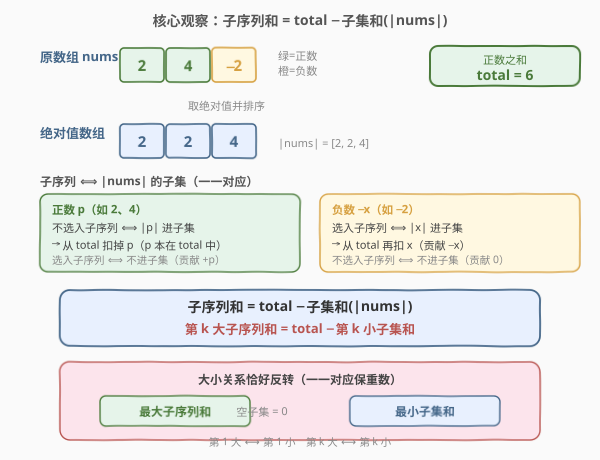
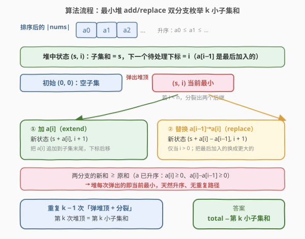

# 找出数组的第 K 大和

- **题目名称**：找出数组的第 K 大和
- **链接**：[2386. 找出数组的第 K 大和](https://leetcode.cn/problems/find-the-k-sum-of-an-array/)
- **难度**：困难
- **标签**：数组、堆（优先队列）、排序

## 1. 题目概述

给你一个整数数组 `nums` 和一个**正**整数 `k`。可以选择数组的任一**子序列**并对全部元素求和。数组的**第 k 大和**定义为可获得的第 `k` 个**最大**子序列和（子序列和允许出现重复）。空子序列的和视作 `0`。返回数组的第 k 大和。

**示例 1**：

```text
输入：nums = [2,4,-2], k = 5
输出：2
解释：所有子序列和按递减顺序排列为
6、4、4、2、2、0、0、-2
第 5 大和为 2。
```

**示例 2**：

```text
输入：nums = [1,-2,3,4,-10,12], k = 16
输出：10
解释：第 16 大和为 10。
```

**约束条件**：

- $n = \text{nums.length}$，$1 \le n \le 10^5$
- $-10^9 \le \text{nums}[i] \le 10^9$
- $1 \le k \le \min(2000,\; 2^n)$

> 💡 **关键约束**：$n$ 可达 $10^5$（无法枚举 $2^n$），但 $k \le 2000$ 很小。这一「$n$ 大 $k$ 小」的不对称决定了**只需求第 $k$ 小、不必全算**，是本题解法的出发点。

---

## 2. 解题思路

### 2.1 暴力思路：枚举所有子序列

最直白的做法是枚举每个元素「选 / 不选」，共 $2^n$ 个子序列，逐一求和、排序后取第 $k$ 大。但 $n=10^5$ 时 $2^n$ 是天文数字，完全不可行。突破口在于：**最大子序列和可一眼看出**——把所有正数都选上即得最大和；进一步，任何子序列和都能表示成「最大和减去某个子集和」。

### 2.2 核心观察：子序列和 = total − 子集和(|nums|)



记 $\text{total} = \sum\_{\text{nums}[i] > 0} \text{nums}[i]$（所有正数之和）。这是**最大子序列和**（全选正数、不选负数，空集对应差值 $0$）。

对每个元素取绝对值，得数组 $|\text{nums}|$（升序排列）。**任何子序列和**都可写成 $\text{total} - S$，其中 $S$ 是 $|\text{nums}|$ 的某个**子集和**，且子序列与子集**一一对应**：

- **正数 $p$**（已在 $\text{total}$ 中）：选入子序列 ⟺ $|p|$ **不**进入子集（贡献 $+p$）；不选 ⟺ $|p|$ 进入子集（从 $\text{total}$ 扣掉 $p$）。
- **负数 $-x$**（不在 $\text{total}$ 中）：选入子序列 ⟺ $|x|$ 进入子集（从 $\text{total}$ 再扣 $x$，贡献 $-x$）；不选 ⟺ $|x|$ 不进入子集（贡献 $0$）。

于是子序列和 $\equiv \text{total} - \text{子集和}$，且「第 $k$ **大**子序列和」恰好对应「第 $k$ **小**子集和」（大小关系反转，一一对应保重数，故重复子序列和也正确对应）：

$$
\text{第 } k \text{ 大子序列和} = \text{total} - \text{第 } k \text{ 小子集和}(|\text{nums}|)
$$

> 💡 **转化后**：原问题化为「求升序数组 $|\text{nums}|$ 的第 $k$ 小子集和」。由于 $k \le 2000$，只需生成前 $k$ 小即可，不必求出全部 $2^n$ 个子集和——这正是堆枚举派上用场的地方。
>
> ⚠️ **为什么是减第 $k$ 小而非第 $k$ 大**：映射 $\text{subseq} = \text{total} - \text{subset}$ 把「大」对应到「小」（最大子序列 ⟺ 空子集 = 最小子集和 $0$）。故第 $1$ 大子序列 ⟺ 第 $1$ 小子集和，第 $k$ 大 ⟺ 第 $k$ 小。一一对应保证了重复值的计数也一致。

### 2.3 算法流程：最小堆 add/replace 双分支



对升序数组 $a = |\text{nums}|$（$a_0 \le a_1 \le \dots$，均 $\ge 0$），用最小堆按升序生成子集和。堆中状态为 $(s,\, i)$：当前子集和为 $s$，下一个待处理下标为 $i$（$a[i-1]$ 是最后加入的元素）。每次弹出堆顶（当前最小）后，若 $i < n$ 则分裂出两个后继：

1. **加 $a[i]$（extend）**：把 $a[i]$ 追加到子集末尾 → 新状态 $(s + a[i],\; i+1)$。
2. **替换 $a[i-1] \to a[i]$（replace）**：把最后加入的换成更大的 → 新状态 $(s + a[i] - a[i-1],\; i+1)$，仅当 $i > 0$。

由于 $a$ 升序，两分支新和都 $\ge$ 原和（$a[i] \ge 0$、$a[i]-a[i-1] \ge 0$），故堆每次弹出即当前最小，天然升序。该分裂方式让**每个子集恰生成一次**（一棵二叉生成树，路径唯一）。

**整体流程**：

1. 计算 $\text{total}$（正数和），构造升序 $a = |\text{nums}|$；
2. 堆初始化为 $\{(0, 0)\}$（空子集，和为 $0$）；
3. 重复 $k-1$ 次「弹出堆顶 $(s,i)$ + 按 add/replace 分裂」——弹掉第 $1$ 到第 $k-1$ 小子集和；
4. 此时堆顶即第 $k$ 小子集和，答案 $= \text{total} - \text{堆顶}$。

> 💡 **add/replace 的来历**：它等价于「有序地枚举子集」。固定子集的最大下标 $i$，从「上一个状态」要么在其末尾**追加** $a[i]$、要么把末尾的 $a[i-1]$ **换成** $a[i]$，恰好不重不漏地遍历所有子集。这与 [373. 查找和最小的 K 对数字](https://leetcode.cn/problems/find-k-pairs-with-smallest-sums/) 的双数组「加/换」归并同源。

### 2.4 示例演算

![示例演算：nums=[2,4,−2], k=5](../images/kthsum_walkthrough.svg)

以示例 1 `nums = [2,4,-2], k = 5` 演算：$\text{total} = 2+4 = 6$，$a = [2,2,4]$。堆的弹出顺序即升序子集和：

| 步 | 弹出 $(s,i)$ | 子集和 $s$ | 压入后继 |
|----|-------------|-----------|---------|
| 1 | $(0,0)$ | 0 | ① $(2,1)$ |
| 2 | $(2,1)$ | 2 | ① $(4,2)$　② $(2,2)$ |
| 3 | $(2,2)$ | 2 | ① $(6,3)$　② $(4,3)$ |
| 4 | $(4,2)$ | 4 | ① $(8,3)$　② $(6,3)$ |
| 5 | $(4,3)$ | 4 | $i=3=n$，不再分裂 |

弹 $4 = k-1$ 次后堆顶为 $(4,3)$，第 $5$ 小子集和 $= 4$。答案 $= 6 - 4 = 2$ ✓。

升序子集和序列为 $0, 2, 2, 4, 4, 6, 6, 8$（含重复，因 $a$ 中两个 $2$ 来自不同位置），由 $\text{total}-s$ 反转得子序列和降序 $6,4,4,2,2,0,0,-2$，第 $5$ 大为 $2$，与题面一致。

> 💡 **重复值为何不出错**：$a$ 中绝对值相等的元素来自不同原位置（如两个 $2$ 分别来自正数 $2$ 和负数 $-2$），它们对应**不同子序列**却产生相同和。题目允许子序列和重复，add/replace 按「子集」逐个枚举，自然把重复和按重数计入，与题意契合。

---

## 3. 参考代码

### C++

```cpp
class Solution {
public:
    long long kSum(vector<int>& nums, int k) {
        long long total = 0;
        for (int x : nums) if (x > 0) total += x;

        vector<int> a;
        for (int x : nums) a.push_back(abs(x));
        sort(a.begin(), a.end());
        int n = a.size();

        using P = pair<long long, int>;            // (子集和, 下一个待处理下标)
        priority_queue<P, vector<P>, greater<P>> pq;
        pq.push({0, 0});                            // 空子集，和为 0
        for (int step = 1; step < k; ++step) {
            auto [s, i] = pq.top(); pq.pop();
            if (i < n) {
                pq.push({s + a[i], i + 1});                 // ① 加 a[i]
                if (i > 0)
                    pq.push({s + a[i] - a[i - 1], i + 1});   // ② 替换 a[i-1] -> a[i]
            }
        }
        return total - pq.top().first;
    }
};
```

### Python

```python
import heapq
from typing import List

class Solution:
    def kSum(self, nums: List[int], k: int) -> int:
        total = sum(x for x in nums if x > 0)
        a = sorted(abs(x) for x in nums)
        n = len(a)

        pq = [(0, 0)]                              # (子集和, 下一个待处理下标)
        for _ in range(k - 1):
            s, i = heapq.heappop(pq)
            if i < n:
                heapq.heappush(pq, (s + a[i], i + 1))                 # ① 加 a[i]
                if i:
                    heapq.heappush(pq, (s + a[i] - a[i - 1], i + 1))  # ② 替换
        return total - pq[0][0]
```

> ⚠️ **三个易错点**：
> 1. **`total` 用 `long long`**：$n=10^5$、$\text{nums}[i]$ 可达 $10^9$，正数和上界 $\approx 10^{14}$，超出 `int` 范围。Python 无此虑，C++ 必须用 `long long`。
> 2. **replace 分支要判 `i > 0`**：$i=0$ 时没有「最后加入的元素 $a[i-1]$」可替换，否则下标越界。`add` 分支只需 $i < n$。
> 3. **弹 $k-1$ 次后取堆顶**：初始堆顶 $(0,0)$ 即第 $1$ 小。循环弹 $k-1$ 次（弹掉第 $1\sim k-1$ 小），余下堆顶才是第 $k$ 小。若错弹 $k$ 次则会取到第 $k+1$ 小。

---

## 4. 复杂度分析

| 维度 | 复杂度 | 说明 |
|------|--------|------|
| **时间复杂度** | $O(n \log n + k \log k)$ | 排序 $O(n \log n)$；堆每次弹出做至多 $2$ 次压入，共 $k-1$ 轮，堆大小 $O(k)$，故 $O(k \log k)$ |
| **空间复杂度** | $O(n + k)$ | 存绝对值数组 $O(n)$；堆至多 $O(k)$ 个状态 |

> 💡 本题的复杂度由「$n$ 大 $k$ 小」刻画：排序主导 $O(n \log n)$，堆枚举仅 $O(k \log k)$（$k \le 2000$）。若 $k$ 也很大（如 $\sim 2^n$），堆空间会爆炸，此时需改用二分答案（见第 5 节）。

---

## 5. 扩展：为何用堆枚举而非二分答案

求「第 $k$ 小」的经典套路之一是**二分答案 + 计数**：二分一个值 $mid$，统计有多少子集和 $\le mid$，据此缩进。此法在 [719. 找出第 K 小的数对距离](https://leetcode.cn/problems/find-k-pairs-with-smallest-sums/) 中大放异彩，因「数对距离 $\le mid$」可用双指针 $O(n)$ 计数。

但本题用二分答案会卡在**计数步骤**：「$|\text{nums}|$ 的子集和 $\le mid$ 有几个」本质是子集和计数，属 0-1 背包变形，朴素 $O(n \cdot \text{sum})$ 在 $n=10^5$、$\text{sum}$ 高达 $10^{14}$ 时完全不可行。反观堆枚举只**生成前 $k$ 小**、与 $n$ 几乎无关（仅排序依赖 $n$），恰好利用了 $k \le 2000$ 的微小规模。因此：

> **$n$ 大 $k$ 小 → 堆枚举（本题）；$k$ 大但计数易 → 二分答案（719）。** 两法互补，关键看「第 $k$ 小」中的 $k$ 与「能否快速计数」孰轻孰重。

此外，add/replace 的堆归并是「有序序列第 $k$ 小和」的通用武器：把本题的「单数组子集和」换成「多组有序数列的和」，即得 [373. 查找和最小的 K 对数字](https://leetcode.cn/problems/find-k-pairs-with-smallest-sums/) 与 [1439. 有序矩阵中的第 k 个最小数组和](https://leetcode.cn/problems/find-the-kth-smallest-sum-with-k-numbers/)，分裂逻辑完全同构，只是分支数与序列数不同。

---

## 6. 面试要点

1. **最大子序列和怎么得到？为何它能作为「基准」？**

   - 全选正数、不选负数即得最大和 $\text{total}$。它是基准，因为任何子序列都可视为「从 $\text{total}$ 起扣掉若干绝对值」：不选的正数 $p$ 扣 $|p|$、选了的负数 $-x$ 也扣 $|x|$。于是子序列和 $=\text{total}-\text{子集和}(|\text{nums}|)$，统一了正负两类元素的处理。

2. **「第 $k$ 大子序列和」为何等于「$\text{total}-$ 第 $k$ 小子集和」而不是第 $k$ 大子集和？**

   - 映射 $\text{subseq}=\text{total}-\text{subset}$ 是减函数：子集和越大、子序列和越小。最大子序列和（$\text{total}$）对应最小子集和（$0$，空集）。故第 $1$ 大 ⟺ 第 $1$ 小，依此第 $k$ 大 ⟺ 第 $k$ 小。且映射一一对应，重复值的重数也一致。

3. **add/replace 两个分支为什么能不重不漏地遍历所有子集？**

   - 固定子集的「最大下标 $i$」。从上一个状态出发，要么在末尾**追加** $a[i]$（add），要么把末尾的 $a[i-1]$ **换成** $a[i]$（replace）。两种「末尾动作」唯一地指向一个新子集，且每个子集都恰由其前驱经一种动作生成——构成一棵覆盖全部子集、无重复的二叉生成树。

4. **为什么两分支的新和一定 $\ge$ 原和？堆弹出的就是升序吗？**

   - 数组升序且元素 $\ge 0$：add 加 $a[i]\ge 0$ 故和增；replace 用 $a[i]$ 换 $a[i-1]$，差 $a[i]-a[i-1]\ge 0$ 故和不减。因此每个后继和 $\ge$ 父状态和；又因最小堆每次弹全局最小，而所有状态都由更小（或相等）的父状态生成，故弹出顺序天然非降——这是「按升序生成」的保证。

5. **若 $k$ 很大（接近 $2^n$）怎么办？**

   - 堆空间会膨胀到 $O(k)$ 乃至 $O(2^n)$，不可行。此时需改用二分答案，但难点在「子集和 $\le mid$ 的计数」。若值域小可用 bitset 优化背包计数 $O(n \cdot \text{sum}/w)$；若值域也大，则两难。本题巧妙处正在 $k\le 2000$，让堆枚举成为最优解。

> 💡 **一句话总结**：$\text{total}=$ 正数和，子序列和 $=\text{total}-$ 子集和（$|\text{nums}|$），第 $k$ 大 $=\text{total}-$ 第 $k$ 小子集和；最小堆 add/replace 双分支生成前 $k$ 小，$O(n\log n+k\log k)$。

---

## 7. 同类练习题

- [1439. 有序矩阵中的第 k 个最小数组和](https://leetcode.cn/problems/find-the-kth-smallest-sum-with-k-numbers/)（[题解](../1401-1500/1439_有序矩阵中的第k个最小数组和.md)）：多组有序数列各取一个求第 $k$ 小和，**同一套 add/replace 堆归并**，只是每步分支数 = 行数——本题的单数组子集是其退化特例
- [373. 查找和最小的 K 对数字](https://leetcode.cn/problems/find-k-pairs-with-smallest-sums/)（[题解](../0301-0400/373_查找和最小的K对数字.md)）：两升序数组各取一求第 $k$ 小和，add/replace 堆归并的**原始母题**，理解了它即理解了本题的分裂逻辑
- [719. 找出第 K 小的数对距离](https://leetcode.cn/problems/find-k-th-smallest-pair-distance/)（[题解](../0701-0800/719_找出第K小的数对距离.md)）：同为「第 $k$ 小」却走**二分答案 + 双指针计数**路线，对照本题的堆枚举——$k$ 大但计数易时选二分，$k$ 小但计数难时选堆
- [378. 有序矩阵中第 K 小的元素](https://leetcode.cn/problems/kth-smallest-element-in-a-sorted-matrix/)（[题解](../0301-0400/378_有序矩阵中第K小的元素.md)）：矩阵中第 $k$ 小，既可小顶堆 $k$ 路归并、也可二分值域计数，是「堆 vs 二分」两路线的另一经典演练场
- [1985. 找出数组中的第 K 大整数](https://leetcode.cn/problems/find-the-kth-largest-integer-in-the-array/)（[题解](../1901-2000/1985_找出数组中的第K大整数.md)）：同为「第 $k$ 大」但元素是字符串大整数、用字典树/排序解决，对比本题的「转化 + 堆」思路——同为第 $k$ 大，数据形态决定解法
