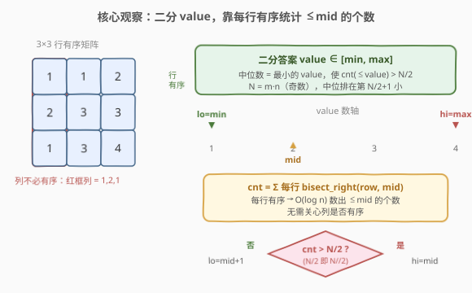
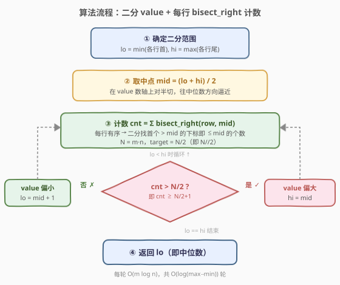

# LeetCode 行排序矩阵的中位数 题解

## 1. 题目概述

- **标题 / 题号**：行排序矩阵的中位数（#2387，medium）
- **链接**：https://leetcode.cn/problems/median-of-a-row-wise-sorted-matrix/
- **难度**：中等
- **标签**：数组、二分查找、矩阵

**题意**：给定一个 $m \times n$ 的整数矩阵 `grid`，其中**每一行**都按**非递减顺序**排序（列不保证有序）。请返回该矩阵的**中位数**。

由于 $m \cdot n$ 为奇数，中位数是把矩阵所有元素扁平化排序后位于正中位置的元素——即排序后的第 $\lfloor m \cdot n / 2 \rfloor + 1$ 小的元素（0-indexed 下标恰为 $\lfloor m \cdot n / 2 \rfloor$）。

> ⚠️ **题面来源**：本题是 LeetCode **Plus 会员专享题**，完整题面与约束在页面上被锁定。下方题意与示例根据 LeetCode GraphQL 接口返回的**官方测试用例**与**官方提示**（"Try to binary search the answer"）整理而成，题意可靠；约束区间为按题型的合理表述，提交前可在题目页核对。

**示例 1**：

```text
输入：grid = [[1,1,2],[2,3,3],[1,3,4]]
输出：2
解释：扁平化排序后得到 [1,1,1,2,2,3,3,3,4]，共 9 个元素，中位数是第 5 小 = 2。
```

**示例 2**：

```text
输入：grid = [[1,1,3,3,4]]
输出：3
解释：扁平化排序后得到 [1,1,3,3,4]，共 5 个元素，中位数是第 3 小 = 3。
```

**约束**：

- $m = \text{grid.length}$，$n = \text{grid[i].length}$
- $m, n \ge 1$，且 $m \cdot n$ 为奇数
- 每行 `grid[i]` 已按非递减序排序（列方向**不保证**有序）
- 矩阵元素为普通 int 范围（量级约 $\pm 10^9$）

> 💡 **关键性质**：只有「行」有序，「列」无序。这一点决定了计数手法——可在每行内用二分统计 $\le x$ 的个数，但**不能**像 378 题那样从左下角走台阶 $O(m+n)$ 计数（那种技巧依赖「列也有序」）。

## 2. 解题思路

### 2.1 暴力思路：扁平化排序

最直白的做法：把 $m \cdot n$ 个元素全部摊到一个数组里，排序后取正中那个。

```python
def matrixMedian(grid):
    flat = sorted(v for row in grid for v in row)
    return flat[len(flat) // 2]
```

> ⚠️ 代价：时间 $O(mn \log(mn))$、空间 $O(mn)$，把「行有序」这条信息**完全浪费**掉了。当 $m \cdot n$ 较大时，光排序就要扛住 $N \log N$；而且全程没有用到行有序的性质。突破口在于：**中位数是一个「值」而不是一个「位置」**——于是可以对**值域**二分，而「行有序」恰好让「统计 $\le$ 某值的元素个数」变得高效。

### 2.2 核心观察：二分答案（value 域）+ 每行 bisect_right 计数



中位数 `x` 的**单调判定**刻画如下：记 `cnt(x)` 为矩阵中 $\le x$ 的元素个数。则

$$
x \text{ 是中位数} \iff \text{cnt}(x-1) < \tfrac{N}{2}+1 \le \text{cnt}(x), \qquad N = m\cdot n
$$

即 `x` 是**最小的**使 $\text{cnt}(x) > N/2$（也就是 $\ge N/2+1$）的值。`cnt` 关于 `x` 单调不减，于是这是一个标准的「在值域上找下界」的二分：

- 二分对象不是下标，而是**值** `value ∈ [min, max]`，其中 `min` 取各行首元素的最小、`max` 取各行末元素的最大——二者一定覆盖矩阵全体元素。
- 每轮取中点 `mid`，问「$\le mid$ 的元素是否已经过半」：
  - 若 $\text{cnt}(mid) > N/2$：过半了，说明中位数 $\le mid$，缩右界 `hi = mid`；
  - 否则：还不到一半，中位数 $> mid$，缩左界 `lo = mid + 1`。

**而行有序的价值正在「计 $\text{cnt}(mid)$」这一步**：每行有序，则该行中 $\le mid$ 的元素是一段前缀，其长度即 `bisect_right(row, mid)`，对每行做一次二分即可，单轮 $O(m \log n)$。无需关心列是否有序。

> 💡 **为什么答案一定是矩阵里的真实元素？** 二分在整数值域上收敛，最终 `lo == hi` 落在「最小的使 cnt 过半的整数」上。由于 `cnt` 是阶梯函数、只在矩阵真实元素处跳变，这个最小整数必然是某个真实元素——正是排序后第 $\lfloor N/2 \rfloor$ 位的中位数。因此无需担心「二分到某个不在矩阵里的值」。

### 2.3 算法流程图



一次完整流程：

1. **定范围**：`lo = min(各行首)`、`hi = max(各行尾)`，覆盖所有元素；
2. **取中点**：`mid = lo + (hi - lo) / 2`（防溢出）；
3. **计数**：`cnt = Σ bisect_right(row, mid)`，每行一次二分，统计 $\le mid$ 的总数；
4. **判定缩界**：`cnt > N/2` 则 `hi = mid`，否则 `lo = mid + 1`；
5. `lo == hi` 时退出，`lo` 即中位数。

### 2.4 示例演算

![示例演算：grid=[[1,1,2],[2,3,3],[1,3,4]]，逐轮二分](../images/2387_example_walkthrough.svg)

以 `grid = [[1,1,2],[2,3,3],[1,3,4]]` 为例，$N = 9$，$\text{target} = N/2 = 4$，找最小的使 $\text{cnt} > 4$ 的值。范围 `lo = 1`（首列最小）、`hi = 4`（末列最大）：

| 轮次 | lo, hi | mid | 行0计 | 行1计 | 行2计 | cnt | cnt>4? | 更新 |
|------|--------|-----|-------|-------|-------|-----|--------|------|
| 1 | 1, 4 | 2 | 3 | 1 | 1 | 5 | 是 ✓ | hi=2 |
| 2 | 1, 2 | 1 | 2 | 0 | 1 | 3 | 否 ✗ | lo=2 |

- 轮 1：`mid=2`，行0 `[1,1,2]` 全 $\le 2$ 计 3，行1 `[2,3,3]` 仅 2 计 1，行2 `[1,3,4]` 仅 1 计 1，共 5 > 4 → 缩右 `hi=2`；
- 轮 2：`mid=1`，行0 `[1,1,2]` 计 2，行1 `[2,3,3]` 计 0，行2 `[1,3,4]` 计 1，共 3 ≤ 4 → 缩左 `lo=2`；
- `lo == hi == 2`，返回 2 ✓。与扁平化排序 `[1,1,1,2,2,3,3,3,4]` 第 5 小一致。

> 💡 **读法**：两轮就把 4 个候选值压到 1 个。注意轮 1 的 `mid=2` 落在矩阵真实值上、`cnt=5` 恰好过半；轮 2 的 `mid=1` 的 `cnt=3` 不足半数，说明中位数 $>1$，于是 `lo` 跳到 `2` 与 `hi` 相会——这正是「最小使 cnt 过半的值」的收敛过程。

## 3. 参考代码

### C++

```cpp
class Solution {
public:
    int matrixMedian(vector<vector<int>>& grid) {
        int m = grid.size(), n = grid[0].size();
        long long target = 1LL * m * n / 2;        // 中位数：使 cnt(<=x) > target 的最小 x
        int lo = INT_MAX, hi = INT_MIN;
        for (const auto& row : grid) {
            lo = min(lo, row.front());
            hi = max(hi, row.back());
        }
        while (lo < hi) {
            int mid = lo + (hi - lo) / 2;          // 防溢出
            long long cnt = 0;
            for (const auto& row : grid) {
                cnt += upper_bound(row.begin(), row.end(), mid) - row.begin();
            }
            if (cnt > target) hi = mid;            // <=mid 已过半，中位数 <= mid
            else              lo = mid + 1;       // 不足半数，中位数 > mid
        }
        return lo;
    }
};
```

### Python

```python
import bisect

class Solution:
    def matrixMedian(self, grid: List[List[int]]) -> int:
        m, n = len(grid), len(grid[0])
        target = m * n // 2                       # 使 cnt(<=x) > target 的最小 x 即中位数
        lo = min(row[0] for row in grid)
        hi = max(row[-1] for row in grid)
        while lo < hi:
            mid = (lo + hi) // 2
            cnt = sum(bisect.bisect_right(row, mid) for row in grid)
            if cnt > target:
                hi = mid
            else:
                lo = mid + 1
        return lo
```

> ⚠️ **两个易错点**：
> 1. **判定是 `cnt > target` 而非 `cnt >= target`**。中位数是「最小的使 $\le x$ 的个数**严格过半**」的值。若写成 `cnt >= target`（`target=N//2`，对 $N=9$ 即 `cnt>=4`），则 `mid=1` 时 `cnt=3` 不满足、`mid=2` 时 `cnt=5` 满足——这里恰好也能收敛到 2，但当存在大量重复时 `>=` 会让 `hi` 收得过快、漏判边界。严格用 `cnt > N/2`（等价于 `cnt >= N//2 + 1`）语义最清晰。
> 2. **二分范围用「首列最小 / 末列最大」**。因为每行有序，各行首元素是本行最小、末元素是本行最大，故 `lo=min(首列)`、`hi=max(末列)` 必然覆盖全体元素，保证答案落在 `[lo, hi]` 内。若误用 `grid[0]` 的首末（只看第一行），可能漏掉更小或更大的元素。
>
> 💡 **`bisect_right` 而非 `bisect_left`**：我们要统计 $\le mid$ 的个数，即「严格大于 `mid` 的首个位置」，正是 `bisect_right(row, mid)` 返回的下标值。用 `bisect_left` 会把等于 `mid` 的元素排除，导致重复元素场景下计数偏小。

## 4. 复杂度分析

| 维度 | 复杂度 | 说明 |
|------|--------|------|
| **时间复杂度** | $O(m \log n \log V)$ | 每轮对 $m$ 行各做一次 $O(\log n)$ 的二分计数，共 $\log V$ 轮（$V = \text{hi}-\text{lo}$ 为值域跨度） |
| **空间复杂度** | $O(1)$ | 仅几个标量，无额外数组（不计输入） |
| 对照：扁平化排序 | $O(mn \log(mn))$ / $O(mn)$ | 把 $N=mn$ 个元素摊平排序，浪费行有序信息；元素多时空间也吃紧 |

> 💡 当元素值域 $V$ 较大（如 $\pm 10^9$）时 $\log V \approx 30$，而 $m\log n$ 远小于 $mn$，总体远优于 $O(mn\log(mn))$ 的扁平化。二分答案类问题的统一形态是：**把「求第 k 小」转成「值域二分 + 单调判定」**，判定函数越高效（本题靠行有序做到 $O(m\log n)$），整体越优。

## 5. 扩展：与 378「有序矩阵中第 K 小的元素」的对照

本题与 [378. 有序矩阵中第 K 小的元素](https://leetcode.cn/problems/kth-smallest-element-in-a-sorted-matrix/) 是「二分答案求第 k 小」的姊妹题，但**计数手法因有序结构不同而不同**：

| 维度 | 378 | 2387（本题） |
|------|-----|--------------|
| 有序结构 | 行、列**都**有序 | 仅**行**有序 |
| 计 $\le mid$ 个数 | 从左下角走台阶，行减列增，$O(m+n)$ | 每行 `bisect_right`，$O(m\log n)$ |
| 总复杂度 | $O((m+n)\log V)$ | $O(m\log n\log V)$ |

378 的「左下角台阶」依赖**列也有序**：若当前格 $> mid$ 则整列往下都更大，向上走；否则向右走累计。本题列无序，这种单调性失效，只能退回到「每行独立二分」。

> 💡 **统一视角**：两者都是「值域二分 + 单调判定」，差异只在判定函数怎么利用有序性。判定函数从 $O(mn)$（暴力数）→ $O(m\log n)$（行有序）→ $O(m+n)$（行列都序），刻画的正是「有序信息利用得越充分，计数越快」。掌握了这套模板，遇到任意「行有序 / 行列有序矩阵求第 k 小」都能立刻落地。

## 6. 面试要点

1. **为什么对「值」二分而不是对「下标」二分？**

   - 中位数本质是一个**值**，且关于该值存在**单调判定**：值越大，$\le$ 它的元素越多。单调 + 求满足某条件的边界 → 经典二分。对下标二分需要全局有序数组，本题只行有序，下标维度无法直接二分。

2. **`cnt > N/2` 这一判定为什么是「过半」？$N/2$ 取整怎么算？**

   - $N$ 为奇数，中位数是第 $\lfloor N/2 \rfloor + 1$ 小。即最小的使 $\le x$ 的个数 $\ge \lfloor N/2 \rfloor + 1$ 的值，等价于个数 $> \lfloor N/2 \rfloor$（严格过半）。用 `target = N // 2`，判 `cnt > target` 即可，整数除法天然给出 $\lfloor N/2 \rfloor$。

3. **为什么二分范围取「首列最小 / 末列最大」就能覆盖答案？**

   - 每行有序 ⇒ 该行首元素最小、末元素最大。故 `min(各行首)` 是全局最小、`max(各行末)` 是全局最大，二者界定的区间必含全部元素、必含中位数。绝不能只看 `grid[0]` 的首末。

4. **`bisect_right` 和 `bisect_left` 在这里差在哪？**

   - 统计 $\le mid$ 的个数，要数到「首个 $> mid$ 的位置」，即 `bisect_right(row, mid)`。`bisect_left` 返回「首个 $\ge mid$ 的位置」，会把等于 `mid` 的元素排除。当矩阵有大量等于 `mid` 的元素时，`bisect_left` 会让 `cnt` 偏小，导致误判「未过半」而把 `lo` 推过中位数，答案出错。

5. **行列都序时能不能更快？**

   - 能。若列也有序（如 378），可用「左下角台阶」计数 $O(m+n)$ 一轮，总复杂度 $O((m+n)\log V)$。本题列无序故不可用，但思路同源——都是「值域二分 + 尽量利用有序性加速判定」。

> 💡 **一句话总结**：在值域上二分，每轮用「每行 `bisect_right`」统计 $\le mid$ 的个数，`cnt > N/2` 缩右、否则缩左，收敛处即中位数——$O(m\log n\log V)$ / $O(1)$。

## 同类练习题

| # | 题目 | 与本题的关联 |
|---|------|-------------|
| 378 | [有序矩阵中第 K 小的元素](https://leetcode.cn/problems/kth-smallest-element-in-a-sorted-matrix/)（[题解](../0301-0400/378_有序矩阵中第K小的元素.md)） | 同一「值域二分求第 k 小」模板，但行列**都**有序，判定可走左下角台阶 $O(m+n)$，对照本题只用行有序的 $O(m\log n)$ |
| 719 | [找出第 K 小的数对距离](https://leetcode.cn/problems/find-k-th-smallest-pair-distance/)（[题解](../0701-0800/719_找出第K小的数对距离.md)） | 值域二分 + 双指针计数，同样把「求第 k 小」转成「值域二分 + 单调判定」，判定函数用排序后双指针而非本题的逐行二分 |
| 875 | [爱吃香蕉的珂珂](https://leetcode.cn/problems/koko-eating-bananas/)（[题解](../0801-0900/875_爱吃香蕉的珂珂.md)） | 值域二分 + 贪心验证的经典题，同为「二分答案」家族，对照本题在「最小满足条件的值」上收敛 |
| 668 | [乘法表中第 K 小的数](https://leetcode.cn/problems/kth-smallest-number-in-multiplication-table/) | 值域二分 + 每行计数求第 k 小，结构同构——只是计数函数换成「每行可数出 $\le mid$ 的个数」的乘法表性质 |
| 410 | [分割数组的最大值](https://leetcode.cn/problems/split-array-largest-sum/)（[题解](../0401-0500/410_分割数组的最大值.md)） | 二分答案 + 贪心验证，把「最小化最大值」转成值域二分 + 单调判定，是二分答案类问题在数组划分场景的代表作 |
