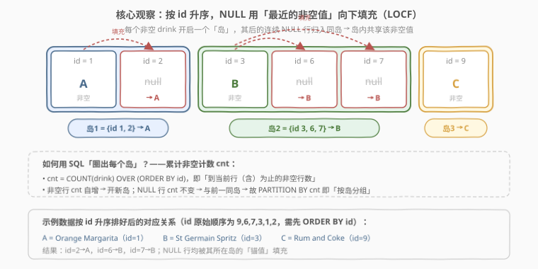
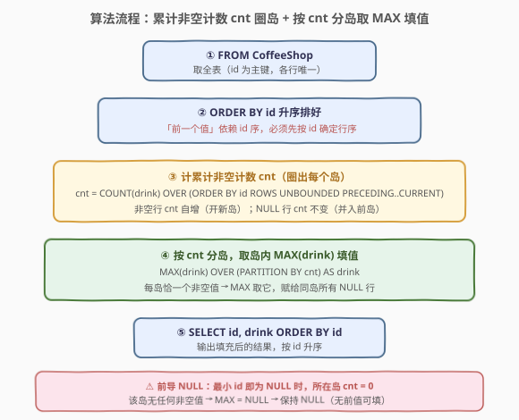
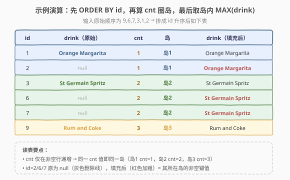

# 将表中的空值更改为前一个值

- **题目名称**：将表中的空值更改为前一个值
- **链接**：[2388. 将表中的空值更改为前一个值](https://leetcode.cn/problems/change-null-values-in-a-table-to-the-previous-value/)
- **难度**：中等
- **标签**：数据库、SQL、`NULL` 处理、窗口函数、`COUNT`/`MAX`、islands-and-gaps、LOCF

## 1. 题目概述

给定 `CoffeeShop` 表，每行记录一笔订单的 `id` 与所点饮品 `drink`。`drink` 列可能为 `NULL`，语义为「该顾客点了和**前一笔订单**（按 `id` 升序）相同的饮品」。请编写 SQL 查询，把 `drink` 列中的 `NULL` 改为「按 `id` 升序时其前面最近的那个非空 `drink` 值」，并按 `id` 升序返回结果。

> ⚠️ **题面来源**：本题为 **LeetCode Plus 会员专享题**，官方题面与示例输出被会员墙锁定，公开 GraphQL 接口（leetcode.cn 与 leetcode.com）的 `content` 字段均返回 `null`。下文 **第 1 节题意**系依据公开可见的**建表信息（`CoffeeShop(id, drink)`，`id` 为主键）与示例输入（`sampleTestCase`）+ 题目名「将表中的空值更改为前一个值」**重构而成。**核心算法（按 `id` 升序做「最近非空值向下填充」LOCF）与示例输入的演算结果是确定的**；输出列名 `drink` 依表结构推断，**以官方题面为准**——若官方要求列名/顺序不同，仅需改 `AS` 别名或 `ORDER BY`，主体逻辑不变。

**表结构**：

```text
表：CoffeeShop
+-------------+---------+
| Column Name | Type    |
+-------------+---------+
| id          | int     |
| drink       | varchar |
+-------------+---------+
id 是该表的主键（具有唯一值）。
该表每一行表示一笔订单的 id 与所点饮品。drink 可能为 NULL，表示该笔订单与前一笔（按 id 升序）饮品相同。
```

**示例 1**：

```text
输入：
CoffeeShop 表:
+----+---------------------+
| id | drink               |
+----+---------------------+
| 9  | Rum and Coke        |
| 6  | null                |
| 7  | null                |
| 3  | St Germain Spritz   |
| 1  | Orange Margarita    |
| 2  | null                |
+----+---------------------+
输出：
+----+---------------------+
| id | drink               |
+----+---------------------+
| 1  | Orange Margarita    |
| 2  | Orange Margarita    |
| 3  | St Germain Spritz   |
| 6  | St Germain Spritz   |
| 7  | St Germain Spritz   |
| 9  | Rum and Coke        |
+----+---------------------+
解释：
按 id 升序排好后为 (1, Orange Margarita)、(2, null)、(3, St Germain Spritz)、(6, null)、(7, null)、(9, Rum and Coke)。
- id=2 为 null → 取前面最近的非空值（id=1）= Orange Margarita；
- id=6、7 为 null → 取前面最近的非空值（id=3）= St Germain Spritz；
- 其余行已有值，保持不变。
```

**约束条件**：

- `id` 为 `CoffeeShop` 主键，故每行唯一、无完全重复行；
- `drink` 可为 `NULL`，非 `NULL` 时为饮品名字符串；
- 表至少含一行；结果需返回全部 `id`、`drink` 两列，按 `id` 升序排列。

> 💡 **关键观察**：本质是 **LOCF（Last Observation Carried Forward，最后观测值向下填充）**——把序列中的 `NULL` 用「按序在它之前最近的非空值」替换。难点不在语义（很直白），而在「**标准 SQL 窗口函数不能一步取『前一个非空值』**」：`LAG` 取的是「物理上一行」的原值，若上一行也是 `NULL`，`LAG` 仍返回 `NULL`，不会自动回溯到更早的非空行。突破口是把序列切成「**岛**」——每个非空值开启一个岛，其后的连续 `NULL` 并入同岛，岛内共享该非空值。

---

## 2. 解题思路

### 2.1 直觉思路：逐行回溯取最近非空值

最直白的做法：对每一行，若是 `NULL`，就回头在「`id` 比自己小、`drink` 非空」的行里挑 `id` 最大的那一行，取它的 `drink`。伪代码：

```text
for each row r in CoffeeShop ordered by id:
    if r.drink is null:
        r.drink = the drink of the row with max(id) where id < r.id and drink is not null
```

对应 SQL 是一个**相关子查询**（见 3.2 解法 B）。它直观易读，但代价是：每个 `NULL` 行都要回头扫描，最坏 $O(n^2)$。能否做到**一趟扫描、一次排序**就完成填充？可以——把「逐行回溯」换成「按岛分组」。

### 2.2 核心观察：累计非空计数圈岛 + `MAX(drink)` 取岛内锚值



把问题拆成「**圈出每个岛**」与「**岛内填值**」两个动作。

**圈岛**靠一个**累计非空计数** `cnt`：

$$
\text{cnt}_i = \text{COUNT}(\text{drink})\ \text{OVER}\ (\text{ORDER BY id}\ \text{ROWS BETWEEN UNBOUNDED PRECEDING AND CURRENT ROW})
$$

即「到当前行（含）为止的非空行数」。它有一个绝妙的性质：

- **非空行**：`cnt` 在前值基础上 **+1** → 该行开启一个**新岛**，并把 `cnt`「染」上自己的编号；
- **`NULL` 行**：`drink` 不计入 `COUNT`，`cnt` **不变** → 与前一行同 `cnt` → 并入**同一个岛**。

于是「**`cnt` 相等的连续行恰构成一个岛**」，岛的编号就等于它锚点（首个非空行）的累计计数。比如示例按 `id` 升序：

| id | drink（原始） | cnt | 归属岛 |
|----|---|----|---|
| 1 | Orange Margarita | **1** | 岛1（锚） |
| 2 | null | 1 | 岛1 |
| 3 | St Germain Spritz | **2** | 岛2（锚） |
| 6 | null | 2 | 岛2 |
| 7 | null | 2 | 岛2 |
| 9 | Rum and Coke | **3** | 岛3（锚） |

**填值**靠 `MAX(drink) OVER (PARTITION BY cnt)`：每个岛内**恰有一个非空行**（锚点），`MAX` 自动忽略 `NULL`，故岛内 `MAX(drink)` 就是锚点的值——锚点行取到自身值（不变），`NULL` 行取到锚值（被填充）。一次窗口聚合，全表搞定。

> 💡 **为什么是 `MAX` 而非 `MIN`？** 岛内只有**一个**非空值，其余全是 `NULL`；`MAX`/`MIN` 都会忽略 `NULL` 并返回那个唯一的非空值，故二者等价。习惯用 `MAX`，因为它与「取岛内锚点」的语义更贴合（「锚点值即岛内最大非空」）。⚠️ 切勿误以为「岛内有多个不同值取最大」——岛上根本只有一个非空值。

> ⚠️ **为何不能直接 `LAG(drink) OVER (ORDER BY id)`？** `LAG` 取的是「按 `id` 排序后的物理上一行」的**原始** `drink`。对 id=2，`LAG` 取到 id=1 的值（对）；但对 id=6，`LAG` 取到 id=3 的值（对）；可一旦上一行**也是 `NULL`**（如某序列 null,null,A），`LAG` 只取到紧邻的 `null`，不会跳过它继续往前找——所以 `LAG` **无法一步实现 LOCF**。需要 `LAG ... IGNORE NULLS` 才行，但 MySQL 不支持（见 5.2）。`cnt` 圈岛正是为绕开这一限制。

### 2.3 算法流程图



SQL 子句执行顺序为 `FROM` → `WHERE`（本题无）→ 窗口函数（在 `SELECT`/子查询中计算）→ `ORDER BY`。两步窗口都在子查询里完成：

| 步骤 | 子句 / 窗口 | 作用 | 本题 |
|------|------|------|------|
| ① | `FROM CoffeeShop` | 取全表 | 6 行原始数据 |
| ② | 子查询内 `ORDER BY id`（窗口排序） | 确定行序 | 按 id 升序 |
| ③ | `COUNT(drink) OVER (ORDER BY id ...)` | 算累计非空计数 `cnt` | 圈出 3 个岛 |
| ④ | `MAX(drink) OVER (PARTITION BY cnt)` | 按岛取锚值 | NULL 行填锚值 |
| ⑤ | 外层 `SELECT id, drink ORDER BY id` | 输出 | 按 id 升序 |

### 2.4 示例演算

以示例 1 走一遍「排序 → 算 `cnt` 圈岛 → 取 `MAX` 填值」：



| id | drink（原始） | cnt | 岛 | drink（填充后） |
|----|---|----|---|---|
| 1 | Orange Margarita | 1 | 岛1 | Orange Margarita（不变） |
| 2 | null | 1 | 岛1 | **Orange Margarita**（填锚值） |
| 3 | St Germain Spritz | 2 | 岛2 | St Germain Spritz（不变） |
| 6 | null | 2 | 岛2 | **St Germain Spritz**（填锚值） |
| 7 | null | 2 | 岛2 | **St Germain Spritz**（填锚值） |
| 9 | Rum and Coke | 3 | 岛3 | Rum and Coke（不变） |

- **岛1（cnt=1）**：锚点 id=1 = Orange Margarita，`MAX` 把它赋给同岛的 id=2；
- **岛2（cnt=2）**：锚点 id=3 = St Germain Spritz，`MAX` 把它赋给同岛的 id=6、7；
- **岛3（cnt=3）**：仅 id=9 一行，`MAX` 取自身值。

最终按 `id` 升序输出：`1 A, 2 A, 3 B, 6 B, 7 B, 9 C`，与示例一致。

> 💡 **前导 `NULL` 怎么办？** 若最小 `id` 那行就是 `NULL`（题面样例未出现，但需考虑），它所在岛没有任何非空行，`cnt` 全程为 0，`MAX(drink)` 对全 `NULL` 组返回 `NULL`——该行保持 `NULL`。这正是 LOCF 的正确语义：**没有「前一个值」可填时，保持空**，不会凭空造一个值出来。

---

## 3. 参考代码

### SQL（解法 A：累计非空计数圈岛 + 窗口 `MAX`，推荐）

```sql
SELECT
    id,
    MAX(drink) OVER (PARTITION BY cnt) AS drink
FROM (
    SELECT
        id,
        drink,
        COUNT(drink) OVER (
            ORDER BY id
            ROWS BETWEEN UNBOUNDED PRECEDING AND CURRENT ROW
        ) AS cnt
    FROM CoffeeShop
) t
ORDER BY id;
```

> 💡 **写法要点**：
> - 内层 `COUNT(drink) OVER (ORDER BY id ROWS ...)` 算累计非空计数 `cnt`——`COUNT(drink)` 不计 `NULL`，故 `NULL` 行不递增，与前一非空行同 `cnt`。
> - 外层 `PARTITION BY cnt` 把同岛行聚到一起，`MAX(drink)` 取岛内唯一非空值赋给全岛。
> - 显式写 `ROWS BETWEEN UNBOUNDED PRECEDING AND CURRENT ROW`：默认 frame 在有 `ORDER BY` 时是 `RANGE ... CURRENT ROW`，遇到 `ORDER BY` 列有**并列值**（peers）会把并列行算同一 frame。本题 `id` 为主键唯一无并列，`RANGE`/`ROWS` 等价；但显式 `ROWS` 表意更精确、对「无唯一约束」的同类题也安全，是值得养成的好习惯。
> - 最外层 `ORDER BY id` 保证输出按 `id` 升序。

### SQL（解法 B：相关子查询 + `COALESCE`，直观）

```sql
SELECT
    c1.id,
    COALESCE(
        c1.drink,
        (SELECT c2.drink
         FROM CoffeeShop c2
         WHERE c2.id < c1.id AND c2.drink IS NOT NULL
         ORDER BY c2.id DESC
         LIMIT 1)
    ) AS drink
FROM CoffeeShop c1
ORDER BY id;
```

> 💡 **写法要点**：
> - 对每行 `c1`，若 `drink` 非空用自身值（`COALESCE` 第一参数命中）；若为 `NULL`，子查询在「`id` 更小且 `drink` 非空」的行里按 `id DESC` 取首行——即「前面最近的非空值」。
> - `ORDER BY c2.id DESC LIMIT 1` 是关键：要「最近」就必须降序取首条；写成升序会拿到「最早的」非空值，语义错误。
> - 直观易读，但每个 `NULL` 行都触发一次子查询扫描，最坏 $O(n^2)$；适合小表或一次性脚本。

### Python（pandas）

```python
import pandas as pd

def change_null_values(coffeeshop: pd.DataFrame) -> pd.DataFrame:
    coffeeshop = coffeeshop.sort_values('id', kind='stable')
    coffeeshop['drink'] = coffeeshop['drink'].ffill()
    return coffeeshop[['id', 'drink']]
```

> 💡 **pandas 对照**：
> - `.sort_values('id', kind='stable')` 对应 SQL 的 `ORDER BY id`——「前一个值」依赖行序，必须先按 `id` 定序。
> - `.ffill()` 即 **forward fill**，pandas 内置的 LOCF：把 `NaN` 用「上方最近的有效值」填充，与 SQL 的「最近非空值向下填充」语义完全一致。`shift(1)`（等价 `LAG`）同样无法一步跨过连续 `NaN`，故直接用 `ffill` 而非 `shift`。
> - 前导 `NaN`（最小 `id` 即空）`ffill` 填不动 → 保持 `NaN`，与 SQL「全 `NULL` 组 `MAX` 为 `NULL`」行为一致。
> - 返回 `[['id','drink']]` 保证只输出两列；排序后顺序即 `id` 升序，无需再排。

---

## 4. 复杂度分析

| 维度 | 解法 A（窗口 `COUNT`+`MAX`） | 解法 B（相关子查询） | pandas（`sort`+`ffill`） |
|------|------------------------------|----------------------|--------------------------|
| **时间** | $O(n \log n)$ | $O(n^2)$（最坏） | $O(n \log n)$ |
| **空间** | $O(n)$ | $O(1)$ 额外 | $O(n)$ |
| **依赖窗口函数** | 是 | 否 | — |
| **是否需自连接** | 否 | 否（相关子查询） | 否 |

> - $n$ = `CoffeeShop` 表行数。
> - **解法 A 时间**：两个窗口函数都依赖 `ORDER BY id` 的排序，$O(n \log n)$；排序后线性扫描累计计数与分岛取 `MAX`，$O(n)$，整体 $O(n \log n)$。
> - **解法 B 时间**：外层 $n$ 行，每行子查询最坏扫描 $O(n)$（无合适索引时），整体 $O(n^2)$。若在 `(id, drink)` 上有索引且 `drink IS NOT NULL` 可走索引过滤，单次子查询可降至 $O(\log n)$，整体 $O(n \log n)$——但 LeetCode 在线判题环境通常无此索引，按 $O(n^2)$ 估算更稳妥。
> - **空间**：解法 A 窗口排序需 $O(n)$ 缓冲；解法 B 仅相关子查询、无需物化中间表，额外空间 $O(1)$（不计返回结果）。
> - **索引建议**：生产中在 `CoffeeShop(id)` 上建主键索引（题目已隐含），解法 A 的窗口排序可走索引有序扫描免排序；解法 B 的子查询 `WHERE id < ? AND drink IS NOT NULL ORDER BY id DESC LIMIT 1` 在 `(id DESC, drink)` 上建索引可极速定位。

---

## 5. 扩展：`IGNORE NULLS`、会话变量法与 islands-and-gaps

### 5.1 为什么 `LAG` 不行而要圈岛？

`LAG(drink, 1) OVER (ORDER BY id)` 取的是「物理上一行」的**原始** `drink`。考虑序列 `null, null, A`：第二行的 `LAG` 取到第一行的 `null`，仍为 `null`；它不会「跳过 `null` 继续往前找 A」。所以**裸 `LAG` 无法一步实现 LOCF**——除非数据库支持 `IGNORE NULLS` 修饰符（见 5.2）。`cnt` 圈岛的本质，就是用「累计触发计数」构造一个 `LAG IGNORE NULLS` 的等价物：把「回溯找最近非空」转成「与最近非空同组」。

### 5.2 `LAG ... IGNORE NULLS`：一步到位的「本意」写法

部分数据库在窗口函数上支持 `IGNORE NULLS`，让它**跳过 `NULL`** 取「前一个非空值」：

```sql
-- Oracle / PostgreSQL 16+ / BigQuery / Snowflake
SELECT id, LAG(drink IGNORE NULLS) OVER (ORDER BY id) AS drink
FROM CoffeeShop;
-- 注：锚点行（首非空）的 LAG 会是 NULL，需再 COALESCE 自身 drink
```

这才是 LOCF 最贴近题意的写法。⚠️ **MySQL 不支持 `IGNORE NULLS`**，故在 LeetCode（MySQL）环境下必须用 2.2 的 `cnt` 圈岛绕路。识别要点：见到「向前传播某属性至下一个非空为止」的需求，先问数据库是否支持 `IGNORE NULLS`——支持则一行，不支持则圈岛。

### 5.3 会话变量法（MySQL 经典但脆弱）

MySQL 另一经典写法用会话变量做「滚动记忆」：

```sql
SELECT
    id,
    @prev := COALESCE(drink, @prev) AS drink
FROM CoffeeShop, (SELECT @prev := NULL) init
ORDER BY id;
```

语义清晰：非空行把 `@prev` 更新为自身值，`NULL` 行沿用 `@prev`。⚠️ **但 MySQL 8.0+ 优化器可能把 `ORDER BY` 与变量赋值的求值顺序打乱**，导致结果不确定。可靠写法需用派生表先排序、再在外层赋值，并常以 `LIMIT` 强制物化派生表——可移植性差、易踩坑。**生产环境优先用 2.2 的窗口函数解法**，会话变量仅作了解。

### 5.4 泛化：islands-and-gaps（累计触发计数圈岛）

`cnt` 圈岛是 **islands-and-gaps**（岛屿与间隙）模式的典型应用——把序列按某种「触发条件」切成连续段，段内共享同一标记。通用模板：

1. 定义「触发条件」`T(row)`（本题 = `drink IS NOT NULL`）；
2. 算累计触发数 `cnt = COUNT/T SUM(CASE WHEN T THEN 1 ELSE 0 END) OVER (ORDER BY ...) `；
3. 按 `cnt` 分组，对段内做聚合（`MAX`/`MIN`/`COUNT`/`FIRST_VALUE`）。

推广：任何「按序把某属性向前传播至下一个触发点为止」的问题——如「连续相同值分组」「填空到下一个非空」「分段求和」——都可套此模板。本题正是 `T = drink 非空`、段内聚合 `MAX(drink)` 的实例。

> 💡 一句话：**`cnt` 圈岛 = 用累计触发计数把「回溯找最近非空」转成「与最近非空同组」**，是标准 SQL 实现 LOCF 的通用钥匙。

---

## 6. 面试要点

1. **为什么不能直接用 `LAG(drink) OVER (ORDER BY id)`？**

   > `LAG` 取的是「按 `id` 排序后物理上一行」的**原始** `drink`。若上一行也是 `NULL`，`LAG` 只返回 `null`，不会跳过它继续回溯到更早的非空值，故无法一步实现「最近非空值向下填充」。要么用支持 `IGNORE NULLS` 的数据库特性，要么用累计非空计数 `cnt` 把序列切成「岛」，让 `NULL` 行与其前一个非空行落入同岛。

2. **`COUNT(drink)` 为什么能区分岛屿？`NULL` 行 `cnt` 不变是关键吗？**

   > 是。`COUNT(drink)` 不计 `NULL`，故非空行让 `cnt` 递增（开新岛、染上新编号），`NULL` 行不递增（与前一同 `cnt`、并入同岛）。于是「`cnt` 相等的连续行恰为一个岛」，岛的编号即其锚点的累计计数。`PARTITION BY cnt` 即「按岛分组」。

3. **最小 `id` 那行就是 `NULL`（前导空）时怎么处理？**

   > 该岛没有任何非空行，`cnt` 全程为 0，`MAX(drink)` 对全 `NULL` 组返回 `NULL`，该行保持 `NULL`。这正是 LOCF 的正确语义——没有「前一个值」可填时保持空。pandas 的 `ffill` 对前导 `NaN` 同样填不动，行为一致。⚠️ 若题面要求前导空也填某个默认值，需额外 `COALESCE(..., 默认值)`，但样例与「前一个值」语义均不支持凭空造值。

4. **窗口函数默认 frame 与本题为何要显式 `ROWS BETWEEN UNBOUNDED PRECEDING AND CURRENT ROW`？**

   > 有 `ORDER BY` 时窗口默认 frame 是 `RANGE BETWEEN UNBOUNDED PRECEDING AND CURRENT ROW`，`RANGE` 会把 `ORDER BY` 列**值相同**的行（peers）划入同一 frame。本题 `id` 是主键唯一无并列，`RANGE`/`ROWS` 等价；但若同类题的排序键有重复值，`RANGE` 会把并列行算同一 frame、`cnt` 提前一致，可能出错。显式 `ROWS` 表意精确、对「无唯一约束」场景也安全，是值得养成的好习惯。

5. **解法 A 与解法 B 各适合什么场景？**

   > 解法 A（窗口 `COUNT`+`MAX`）一趟排序 + 线性扫描，$O(n\log n)$，适合大表与生产环境；解法 B（相关子查询 + `COALESCE`）每个 `NULL` 行触发一次回头扫描，最坏 $O(n^2)$，但语义直白、无需窗口函数，适合小表、一次性脚本或面试时先讲清思路。若在 `(id DESC, drink)` 上有索引，解法 B 也能降至 $O(n\log n)$。

> 💡 **一句话总结**：2388 是 **LOCF（最近非空值向下填充）** 母题——核心就「`COUNT(drink) OVER (ORDER BY id)` 算累计非空计数圈岛 → `MAX(drink) OVER (PARTITION BY cnt)` 取岛内锚值填空」。要点：① 裸 `LAG` 取「物理上一行」无法跨过连续 `NULL`，故改用 `cnt` 圈岛把「回溯找最近非空」转成「与最近非空同岛」；② `NULL` 行不递增 `cnt` 是圈岛成立的关键；③ 前导 `NULL` 所在岛全空，`MAX` 返回 `NULL`，正确保持空。

---

## 7. 同类练习题

- [603. 连续空余座位](https://leetcode.cn/problems/consecutive-available-seats/)（[题解](../0601-0700/603_连续空余座位.md)）：`LAG(free,1)`/`LEAD(free,1)` 把相邻行状态拉到同行比较，对照「裸 `LAG` 取物理上一行」与本题「需要跨连续 `NULL` 回溯」的分野
- [601. 体育馆的人流量](https://leetcode.cn/problems/human-traffic-of-stadium/)（[题解](../0601-0700/601_体育馆的人流量.md)）：用 `LAG(id)` 校验 `id` 连续 + `CASE ... cumsum` 圈岛找「连续三行」，与本题「累计计数圈岛」同属 islands-and-gaps 套路
- [626. 换座位](https://leetcode.cn/problems/exchange-seats/)（[题解](../0601-0700/626_换座位.md)）：`LAG(student)`/`LEAD(student)` 偶奇行互换，对照「`LAG` 取相邻行」的最简应用与本题「需跨 `NULL` 回溯」的差异
- [197. 上升的温度](https://leetcode.cn/problems/rising-temperature/)（[题解](../0101-0200/197_上升的温度.md)）：`LAG(temperature)` + `DATEDIFF=1` 校验「上一行是否真是昨天」，呼应「`LAG` 取的是相邻行而非语义上的前一个有效对象」这一关键钉子
- [180. 连续出现的数字](https://leetcode.cn/problems/consecutive-numbers/)（[题解](../0101-0200/180_连续出现的数字.md)）：自连接/`LAG(num,2)` 判「连续三行同值」，与本题「连续 `NULL` 归并成岛」同为「按序分段」家族
