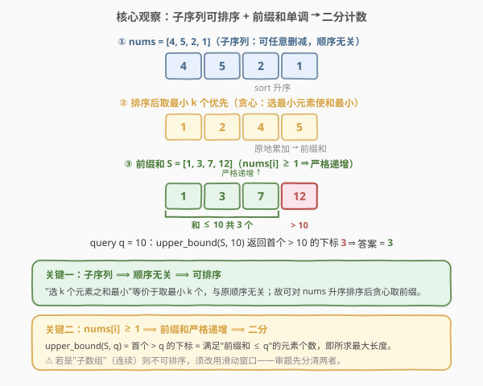
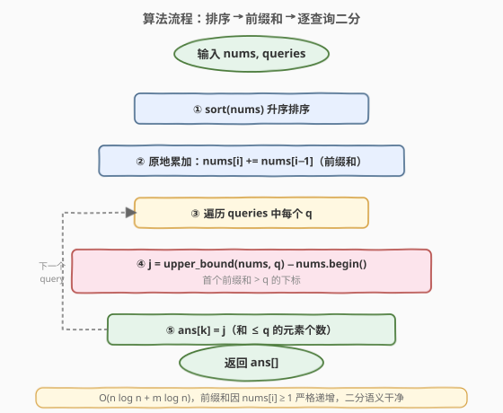

# 和有限的最长子序列

- **题目名称**：和有限的最长子序列
- **链接**：[2389. 和有限的最长子序列](https://leetcode.cn/problems/longest-subsequence-with-limited-sum/)
- **难度**：简单
- **标签**：贪心、数组、排序、前缀和、二分查找

## 1. 题目概述

给你一个长度为 $n$ 的整数数组 `nums`，和一个长度为 $m$ 的整数数组 `queries`。返回一个长度为 $m$ 的数组 `answer`，其中 `answer[i]` 是 `nums` 中元素之和小于等于 `queries[i]` 的**子序列**的**最大**长度。

**子序列**是由一个数组删除某些元素（也可以不删除）但不改变剩余元素顺序得到的一个数组。

**示例 1**：

```text
输入：nums = [4,5,2,1], queries = [3,10,21]
输出：[2,3,4]
解释：
- 子序列 [2,1] 的和等于 3 ≤ 3，最大长度为 2，故 answer[0] = 2。
- 子序列 [4,5,1] 的和等于 10 ≤ 10，最大长度为 3，故 answer[1] = 3。
- 子序列 [4,5,2,1] 的和等于 12 ≤ 21，最大长度为 4，故 answer[2] = 4。
```

**示例 2**：

```text
输入：nums = [2,3,4,5], queries = [1]
输出：[0]
解释：空子序列是唯一一个元素和 ≤ 1 的子序列，故 answer[0] = 0。
```

**约束条件**：

- $n = \text{nums.length}$，$m = \text{queries.length}$
- $1 \le n, m \le 1000$
- $1 \le \text{nums}[i], \text{queries}[i] \le 10^6$

> 💡 **题眼是「子序列」而非「子数组」**：子序列只要求保留相对顺序、却允许任意跳选元素，这意味着**选哪些元素与它们在原数组中的位置无关**——于是可以重排（排序）。这正是把问题从「指数级枚举」降为「排序贪心」的钥匙。若题面是连续子数组，排序会破坏结构，思路就完全不同了。

---

## 2. 解题思路

### 2.1 暴力思路：枚举子序列

最直白的做法：对每个 `query` 枚举 `nums` 的所有子序列（共 $2^n$ 个），筛出元素之和不超过 `query` 的最长者。$n=1000$ 时 $2^{1000}$ 是天文数字，完全不可行。

退一步，对单个 `query`，我们要判定的是「能否选出 $k$ 个元素使其和 $\le q$，并最大化 $k$」。这仍是组合选取问题，朴素判定没有高效途径。突破口在于：**要让"选出 $k$ 个元素之和最小"，就该挑最小的那 $k$ 个**——而子序列允许我们任意挑选元素，故最小的 $k$ 个之和正是所有「$k$ 元子集」中和的下界。

### 2.2 核心观察：子序列可排序 + 前缀和单调 → 二分计数



两步关键转化：

1. **子序列 → 可排序贪心**。子序列只要求保留相对顺序，但"选哪些元素"完全自由。要使"选出的 $k$ 个元素之和最小"，等价于取最小的 $k$ 个元素——这与它们在原数组中的顺序无关，故可直接对 `nums` 升序排序。于是「和不超过 $q$ 的最长子序列」等价于「排序后前若干个元素之和 $\le q$ 的最大个数」。

2. **前缀和单调 → 二分**。排序后取前 $k$ 个元素之和即前缀和 $S_k = \sum_{i<k} a_i$。由约束 $a_i \ge 1$，$S_k$ 随 $k$ **严格递增**。对每个 `query` $q$，要找最大的 $k$ 使 $S_k \le q$，等价于在 $\{S_1, S_2, \dots, S_n\}$ 中找「首个 $> q$ 的位置」的下标 $j$——这正是 `upper_bound(q)` 的语义。该下标 $j$ 恰为满足 $S_j > q$ 而 $S_{j-1} \le q$ 的位置，即有 $j$ 个元素之和 $\le q$，故 $j$ 即答案。

> 💡 **为何 `upper_bound` 直接得个数**：把前缀和**原地存回** `nums`（即 `nums[i]` 变为前 $i+1$ 个元素之和），下标 $i$ 对应"取 $i+1$ 个元素"。`upper_bound(nums, q)` 返回首个 $> q$ 的下标 $j$，意味着下标 $0 \dots j-1$ 共 $j$ 个前缀和都 $\le q$，即能取 $j$ 个元素——$j$ 正是答案。Python 用 `bisect_right`，C++ 用 `std::upper_bound`。
>
> ⚠️ **别和「子数组」混淆**：若题目是连续子数组，排序会破坏连续性，本解法失效；正因是子序列（可跳选），排序才合法。审题第一关就在这里。
>
> ⚠️ **用 `upper_bound`/`bisect_right` 而非 `lower_bound`/`bisect_left`**：我们求「和 $\le q$ 的最大个数」=「首个 $> q$ 的位置」。若误用 `lower_bound`（首个 $\ge q$），当 $q$ 恰等于某前缀和时会少算一个——如 $q=3$、前缀和含 $3$ 时，应得 $2$，`bisect_left` 却返回 $1$。

### 2.3 算法流程图



1. 对 `nums` 升序排序；
2. 原地累加生成前缀和（`nums[i] += nums[i-1]`，数组即变为 $S_1, S_2, \dots, S_n$）；
3. 对每个 `query` $q$：`ans[k] = upper_bound(nums, q) - nums.begin()`（首个 $> q$ 的下标 = 元素个数）；
4. 返回 `ans` 数组。

### 2.4 示例演算

![示例演算：nums=[4,5,2,1], queries=[3,10,21]](../images/2389_example_walkthrough.svg)

以示例 1 `nums = [4,5,2,1], queries = [3,10,21]` 为例：

排序后 `nums = [1,2,4,5]`，前缀和 $S = [1, 3, 7, 12]$（下标 $0\sim3$ 分别对应取 $1\sim4$ 个元素之和）。

| query $q$ | 首个 $> q$ 的位置 | 答案 $k$ | 取最小 $k$ 个（和） |
|-----------|------------------|----------|---------------------|
| 3  | 下标 2（值 $7>3$） | 2 | $[1,2]=3$ ✓ |
| 10 | 下标 3（值 $12>10$） | 3 | $[1,2,4]=7$ ✓ |
| 21 | 末尾（全 $\le 21$） | 4 | $[1,2,4,5]=12$ ✓ |

答案 $[2,3,4]$ ✓。

> 💡 **读法**：下标 $j$ = 前缀和中首个 $> q$ 的位置 = 满足「和 $\le q$」的元素个数（即答案 $k$）。三者在本题里是同一个数，这是「前缀和严格递增 + 二分定位」带来的三合一。
>
> 示例 2 `nums=[2,3,4,5], queries=[1]`：排序后 $S=[2,5,9,14]$，首个 $>1$ 是下标 $0$（值 $2$），故答案 $0$——最小元素 $2$ 已超过 $1$，只能取空子序列。

---

## 3. 参考代码

### C++

```cpp
class Solution {
public:
    vector<int> answerQueries(vector<int>& nums, vector<int>& queries) {
        sort(nums.begin(), nums.end());
        for (int i = 1; i < (int)nums.size(); ++i)
            nums[i] += nums[i - 1];          // 原地前缀和：nums[i] = 前 i+1 个之和
        vector<int> ans;
        ans.reserve(queries.size());
        for (int q : queries)
            ans.push_back(upper_bound(nums.begin(), nums.end(), q) - nums.begin());
        return ans;
    }
};
```

### Python

```python
from itertools import accumulate
from bisect import bisect_right

class Solution:
    def answerQueries(self, nums: List[int], queries: List[int]) -> List[int]:
        nums.sort()
        acc = list(accumulate(nums))          # 前缀和：acc[i] = 前 i+1 个之和
        return [bisect_right(acc, q) for q in queries]
```

> 💡 **常数极小**：排序 + 一遍累加 + 每查询一次二分，无复杂数据结构。$n, m \le 1000$ 时操作量仅几千次，远低于时限。
>
> ⚠️ **原地 vs 另存前缀和**：C++ 直接把前缀和写回 `nums` 省去额外数组（$O(1)$ 额外空间）；Python 若不改原数组则另开 `acc`（$O(n)$）。两者等价，按语言习惯选择即可。

---

## 4. 复杂度分析

| 维度 | 复杂度 | 说明 |
|------|--------|------|
| **时间复杂度** | $O(n\log n + m\log n)$ | 排序 $O(n\log n)$；每个查询二分 $O(\log n)$，共 $m$ 次 |
| **空间复杂度** | $O(\log n)$ 或 $O(n)$ | 排序递归栈 $O(\log n)$；若另存前缀和数组则 $O(n)$。输出数组不计 |
| 对照：枚举子序列 | $O(2^n)$ / $O(n)$ | 每查询枚举全部子序列，$n=1000$ 时不可行 |

> 💡 与暴力 $O(2^n)$ 相比，本解法把「在 $2^n$ 个子序列中找最长」降为「排序 + 前缀和上 $m$ 次二分」——关键就在识别出"子序列 ⟹ 可排序"这一性质。

---

## 5. 扩展：离线查询 + 双指针

把"逐查询二分"换成"按 $q$ 升序处理 + 单指针扫描"，可省去二分。先对 `nums` 排序，再按 `queries` 值升序处理（用下标数组 `order` 记原位以便回填）。维护已选元素之和 `s` 与已选个数 `j`，对每个 $q$ 不断把更小的元素累入直至 `s + nums[j] > q`，此时 `j` 即该 $q$ 的答案。

```python
class Solution:
    def answerQueries(self, nums: List[int], queries: List[int]) -> List[int]:
        nums.sort()
        m = len(queries)
        ans = [0] * m
        order = sorted(range(m), key=lambda i: queries[i])   # 离线：按 q 升序
        s = j = 0
        for i in order:
            while j < len(nums) and s + nums[j] <= queries[i]:
                s += nums[j]
                j += 1
            ans[i] = j
        return ans
```

> 💡 **在线 vs 离线**：方法一（二分）对每个 `query` 独立作答、顺序无关，属**在线**；方法二需先对 `queries` 排序、用 `order` 回填原位，属**离线**。当查询流式到达、无法预知后续时只能用方法一。
>
> ⚠️ 单指针 `j` 在所有查询中**总共**最多前进 $n$ 步，故扫描摊还 $O(n + m)$；加上排序 `nums` 与排序 `order`，总时间 $O(n\log n + m\log m)$。当 $m$ 与 $n$ 同阶时与方法一渐近相近，选用看是否需要在线作答。

---

## 6. 面试要点

1. **子序列 vs 子数组为何决定了能否排序？**

   - 子序列只保留相对顺序、"选哪些元素"完全自由，选最小 $k$ 个之和不依赖原顺序，故可排序；子数组必须连续，排序破坏连续性，不可。审题先分清这两者。

2. **为何贪心"取最小"是最优？**

   - 目标是元素个数最多且和 $\le q$。若某最优解没取最小元素 $a$ 反而取了更大元素 $b$，把 $b$ 换成 $a$ 只会减小（或不增）和、个数不变，仍合法——由**交换论证**，必存在一个全由最小元素构成的最优解。

3. **`upper_bound` 还是 `lower_bound`？**

   - 求「和 $\le q$ 的最大个数」=「首个前缀和 $> q$ 的位置」=`upper_bound(q)`，它等于 $\le q$ 的前缀和个数。用 `lower_bound`（首个 $\ge q$）会在 $q$ 恰等于某前缀和时少算一个。

4. **`nums[i] ≥ 1` 在此起什么作用？**

   - 保证排序后前缀和**严格递增**，二分语义干净（首个 $>q$ 的位置唯一确定）；也保证"取更多元素则和更大"，即个数与和单调对应。若有 $0$ 或负数，前缀和非严格单调，需改用别法（贪心"取最小"对负数仍成立，但二分要换形）。

5. **能否在线逐个回答、不排序 `queries`？**

   - 方法一即可：每个查询独立二分，与顺序无关。方法二（双指针）必须先排序 `queries`，属离线；若要求"流式到达"的查询，只能用方法一。

> 💡 **一句话总结**：识别"子序列 ⟹ 可排序"，于是 `sort` + 前缀和 + `upper_bound` 三步走，$O(n\log n + m\log n)$ 离线/在线通吃。

---

## 7. 同类练习题

- [35. 搜索插入位置](https://leetcode.cn/problems/search-insert-position/)（[题解](../0001-0100/35_搜索插入位置.md)）：二分找插入位（`lower_bound`），对照本题用 `upper_bound` 找"和 $\le q$ 的右界"——二分母题的左/右边界两种用法
- [209. 长度最小的子数组](https://leetcode.cn/problems/minimum-size-subarray-sum/)（[题解](../0201-0300/209_长度最小的子数组.md)）：同为"和约束下求长度极值"，但要求**连续子数组**用滑动窗口（不可排序），对照本题子序列可排序贪心——连续 vs 离散的对偶
- [713. 乘积小于K的子数组](https://leetcode.cn/problems/subarray-product-less-than-k/)（[题解](../0701-0800/713_乘积小于K的子数组.md)）：连续子数组的乘积约束计数（滑动窗口），对照本题子序列版的"取最小"贪心——窗口单调性 vs 排序单调性
- [875. 爱吃香蕉的珂珂](https://leetcode.cn/problems/koko-eating-bananas/)（[题解](../0801-0900/875_爱吃香蕉的珂珂.md)）：二分答案 + $O(n)$ 验证，同属二分家族，但二分对象是"答案值域"而非"前缀和定位"——两类二分的对照
- [378. 有序矩阵中第K小的元素](https://leetcode.cn/problems/kth-smallest-element-in-a-sorted-matrix/)（[题解](../0301-0400/378_有序矩阵中第K小的元素.md)）：二分值域 + 计数判定，对照本题"前缀和上二分定位个数"——值域二分与下标二分的两种姿态
