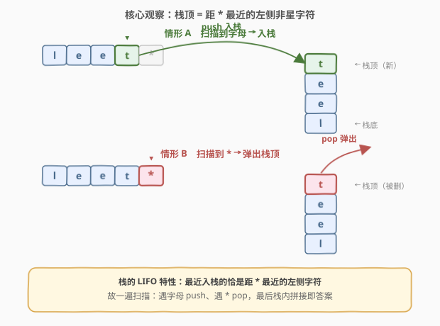
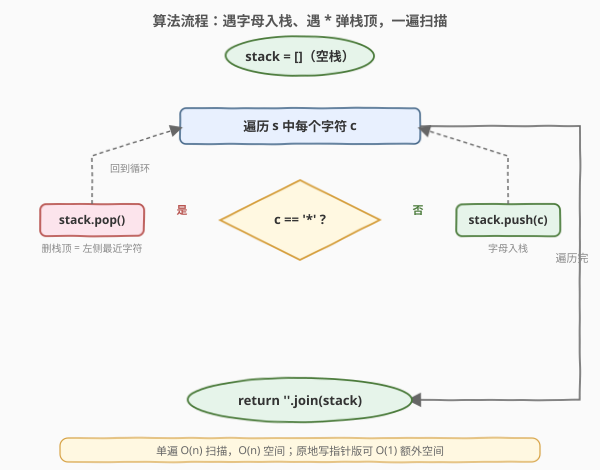
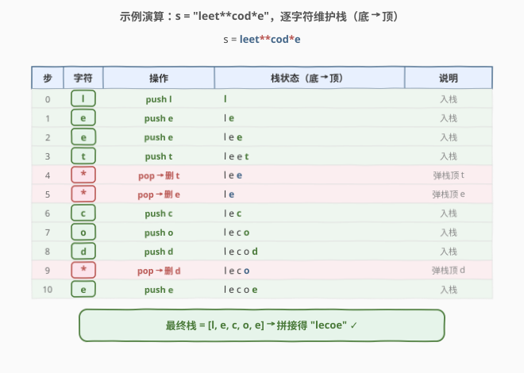

# LeetCode 从字符串中移除星号 题解

## 1. 题目概述

- **标题 / 题号**：从字符串中移除星号（#2390，medium）
- **链接**：https://leetcode.cn/problems/removing-stars-from-a-string/
- **难度**：中等
- **标签**：栈、字符串、模拟

**题意**：给你一个字符串 `s`，其中包含若干星号 `*`。每次操作你可以：

- 选择 `s` 中的一个 `*`；
- 删除它**左侧最近的非星号字符**，同时删除这个 `*` 本身。

返回**所有 `*` 都被移除后**的字符串。题目保证操作总能进行，且最终结果唯一。

**示例 1**：

```text
输入：s = "leet**cod*e"
输出："lecoe"
解释：从左到右依次执行删除：
- 第 1 个 *：左侧最近的字符是 't'（"leet**cod*e"）→ "lee*cod*e"
- 第 2 个 *：左侧最近的字符是 'e'（"leecod*e"）→ "lecod*e"
- 第 3 个 *：左侧最近的字符是 'd'（"lecoe"）→ "lecoe"
没有更多 *，返回 "lecoe"。
```

**示例 2**：

```text
输入：s = "erase*****"
输出：""
解释：整个字符串被删空，返回空字符串。
```

**约束**：

- $1 \le \text{s.length} \le 10^5$
- `s` 由小写英文字母和星号 `*` 组成。
- 题目保证上述操作总能对 `s` 执行。

> 💡 **一句话题意**：把 `*` 当成「退格键」——每按一下就抹掉它左边最近的一个字母。问题等价于：带着退格符扫描一遍，求最终留下的文本。

## 2. 解题思路

### 2.1 暴力思路：逐个模拟删除

最直白的做法是老老实实模拟：在 `s` 里反复找出一个 `*`，再从它出发向左扫描到最近的非 `*` 字符，把两者一起删掉，循环直到没有 `*`。

```python
def removeStars(s):
    a = list(s)
    while True:
        star = -1
        for i, c in enumerate(a):      # 找第一个 *
            if c == '*':
                star = i
                break
        if star == -1:
            break
        j = star - 1                    # 向左找最近的非 * 字符
        while j >= 0 and a[j] == '*':
            j -= 1
        del a[star]                     # 先删靠后的，避免索引错乱
        del a[j]
    return ''.join(a)
```

> ⚠️ 代价与删除次数绑定：每个 `*` 触发一次 $O(n)$ 的查找 + $O(n)$ 的数组删除（元素前移），最坏 $O(n)$ 个星号，共 $O(n^2)$。$n = 10^5$ 时约 $10^{10}$ 次操作，**必超时**。突破口在于：**「左侧最近的非星号字符」在扫描过程中有天然的维护结构——它就是栈顶**。不必每次回头找。

### 2.2 核心观察：栈顶即「距 * 最近的左侧非星字符」



从左到右扫描 `s`，只把**保留下来的字母**按到达顺序存入一个栈。当遇到一个字母时入栈；当遇到一个 `*` 时，它要删的「左侧最近的非星号字符」恰好就是**栈顶**——因为栈顶是当前最近一次入栈、且尚未被删除的字母。于是整个删除操作塌缩成一行：

- 遇字母：`stack.push(c)`；
- 遇 `*`：`stack.pop()`（删掉栈顶，即其左侧最近的字母）。

> 💡 **为什么是栈？** 栈的 **LIFO**（后进先出）特性，恰好对应「最近入栈的 = 距当前位置最近的左侧字符」。`*` 删的总是「最近的未删除字母」，这与弹栈顶语义完全一致。换言之，**问题天然是栈形结构**——把 `*` 理解为退格符，栈就是文本编辑器的标准实现。

### 2.3 算法流程图



一次扫描维护一个栈 `stack`（初值空）：

1. 遍历 `s` 中每个字符 `c`；
2. `c == '*'`：`stack.pop()`（题目保证栈非空，即左侧必有可删字母）；
3. `c != '*'`：`stack.push(c)`；
4. 扫完返回 `''.join(stack)`。

### 2.4 示例演算



以 `s = "leet**cod*e"` 为例，逐字符推进栈：

| 步 | 字符 | 操作 | 栈（底→顶） | 说明 |
|----|------|------|------------|------|
| 0 | `l` | push l | `l` | 入栈 |
| 1 | `e` | push e | `l e` | 入栈 |
| 2 | `e` | push e | `l e e` | 入栈 |
| 3 | `t` | push t | `l e e t` | 入栈 |
| 4 | `*` | pop → 删 t | `l e e` | 弹栈顶 t |
| 5 | `*` | pop → 删 e | `l e` | 弹栈顶 e |
| 6 | `c` | push c | `l e c` | 入栈 |
| 7 | `o` | push o | `l e c o` | 入栈 |
| 8 | `d` | push d | `l e c o d` | 入栈 |
| 9 | `*` | pop → 删 d | `l e c o` | 弹栈顶 d |
| 10 | `e` | push e | `l e c o e` | 入栈 |

最终栈为 `[l, e, c, o, e]`，拼接得 `"lecoe"`，与示例一致 ✓。

> 💡 **读法**：连读的 `*` 会连续弹栈——示例中第 4、5 步连删 `t`、`e`，对应文本编辑器连按两次退格。整串共 3 个 `*` 弹 3 次，与「最后留下的 5 个字母」严丝合缝。

## 3. 参考代码

### C++

```cpp
class Solution {
public:
    string removeStars(string s) {
        string st;                       // 把 string 当栈用
        for (char c : s) {
            if (c == '*') st.pop_back(); // 删栈顶 = 左侧最近字母
            else           st.push_back(c);
        }
        return st;
    }
};
```

### Python

```python
class Solution:
    def removeStars(self, s: str) -> str:
        st = []
        for c in s:
            if c == '*':
                st.pop()                 # 题目保证栈非空
            else:
                st.append(c)
        return ''.join(st)
```

> ⚠️ **一个易错点**：弹出前要不要判空？题目保证「操作总能执行」，即不会有前导 `*`、每个 `*` 左侧必有非星字符，故扫描到 `*` 时栈必非空，`pop()` 不会越界。但工程实践中若输入不受控，加一句 `if st:` 守卫更稳妥。
>
> 💡 **常数极小**：单遍扫描、每个字符一次压栈或弹栈，无额外数组。$n = 10^5$ 时仅十万次操作，远优于 $O(n^2)$ 模拟。

## 4. 复杂度分析

| 维度 | 复杂度 | 说明 |
|------|--------|------|
| **时间复杂度** | $O(n)$ | 单遍扫描 `s`，每个字符做常数次栈操作（push/pop 均摊 $O(1)$） |
| **空间复杂度** | $O(n)$ | 栈存放结果；最坏全是字母时栈深 $n$ |
| 对照：暴力模拟 | $O(n^2)$ / $O(n)$ | 每个星号触发 $O(n)$ 查找 + $O(n)$ 删除，星号数最坏 $O(n)$ |

> 💡 与暴力 $O(n^2)$ 相比，本解法把「每个 `*` 回头找最近字母」从**线性扫描**降维为**栈顶 $O(1)$ 弹出**——这正是栈结构对「最近相关性」的天然刻画。

## 5. 扩展：原地写指针（$O(1)$ 额外空间）

栈解法用了 $O(n)$ 空间存放结果。若输入以可变数组形式给出（如 C++ 的 `string`），可用**写指针**在原数组上覆盖，把额外空间压到 $O(1)$：

```cpp
class Solution {
public:
    string removeStars(string s) {
        int j = 0;                       // 写指针：[0, j) 为保留下来的字符
        for (int i = 0; i < (int)s.size(); ++i) {
            if (s[i] == '*') --j;        // 回退一格 = 删掉最近写入的字符
            else            s[j++] = s[i];
        }
        s.resize(j);
        return s;
    }
};
```

思路：读指针 `i` 线性扫描，写指针 `j` 始终指向「结果区的末尾」。遇字母就写到 `s[j]` 并 `j++`；遇 `*` 就 `j--`，相当于把刚写入的字母「抹掉」——这与栈的 push/pop 完全等价，只是把栈复刻在原数组的左半部分。

> ⚠️ Python 字符串不可变，无法原地修改；若要 $O(1)$ 额外空间须先把 `s` 转成 `list`，最终再 `join`，仍需 $O(n)$ 空间存放该列表。故原地写指针主要适用于 C++ 等可变字符串语言。

## 6. 面试要点

1. **为什么用栈？**

   - `*` 删除的是「左侧最近的非星号字符」，而扫描过程中「最近一次入栈、尚未被删的字母」正是栈顶（LIFO）。于是 `*` 的语义等价于弹栈顶，问题天然映射为栈操作。

2. **栈空时遇到 `*` 会不会出错？**

   - 题目保证操作总能执行，意味着不会有前导 `*`，且每个 `*` 左侧必有可删字母，故扫描到 `*` 时栈必非空。若输入不受控，加 `if st: st.pop()` 守卫即可。

3. **和「退格键」类问题的关系？**

   - 本题把 `*` 当退格符；[844. 比较含退格的字符串](https://leetcode.cn/problems/backspace-string-compare/) 用 `#` 当退格符，是完全同构的模板——都用「栈」或「写指针」一遍扫描处理退格。

4. **能否做到 $O(1)$ 额外空间？**

   - 可以。用写指针 `j`：遇字母写 `s[j++]`，遇 `*` 执行 `j--`，最后截断到 `j`。本质是把栈复刻在原数组前缀，C++ 中可原地完成；Python 串不可变，最低仍需 $O(n)$ 存结果。

5. **为什么结果唯一、与 `*` 处理顺序无关？**

   - 每个 `*` 删的是它左侧最近的未删字母，这个「最近」关系由位置唯一决定，与先处理哪个 `*` 无关。用栈一遍扫描的顺序恰好就是「从左到右依次消除」，自然得到唯一终态。

> 💡 **一句话总结**：把 `*` 当退格符，遇字母入栈、遇 `*` 弹栈顶，一遍 $O(n)$ 扫描后拼接栈即得答案；追求极致可用写指针做到 $O(1)$ 额外空间。

## 同类练习题

| # | 题目 | 与本题的关联 |
|---|------|-------------|
| 844 | [比较含退格的字符串](https://leetcode.cn/problems/backspace-string-compare/) | 把 `#` 当退格符删前一字符，与本题完全同模板（栈 / 写指针）；可进一步用「从右向左双指针」做到 $O(1)$ 空间比较两串 |
| 71 | [简化路径](https://leetcode.cn/problems/simplify-path/)（[题解](../0001-0100/71_简化路径.md)） | `..` 弹出栈顶目录组件，同属「扫描 + 特殊标记触发 pop」模式，只是把字母换成了路径段 |
| 150 | [逆波兰表达式求值](https://leetcode.cn/problems/evaluate-reverse-polish-notation/)（[题解](../0101-0200/150_逆波兰表达式求值.md)） | 运算符作用于栈顶操作数求值，同为「扫描 + 栈顶操作」家族，本题是它的最简退化版（运算符只有一种「删」） |
| 735 | [行星碰撞](https://leetcode.cn/problems/asteroid-collision/)（[题解](../0701-0800/735_行星碰撞.md)） | 栈模拟碰撞，新元素与栈顶交互决定去留——对照本题「新元素直接决定栈顶去留」的更简单情形 |
| 946 | [验证栈序列](https://leetcode.cn/problems/validate-stack-sequences/)（[题解](../0901-1000/946_验证栈序列.md)） | 按给定顺序 push/pop 模拟判定序列可达性，强化对「栈 push/pop 配对」的直觉 |
