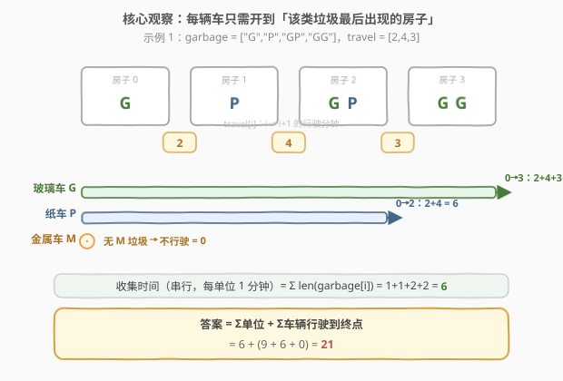
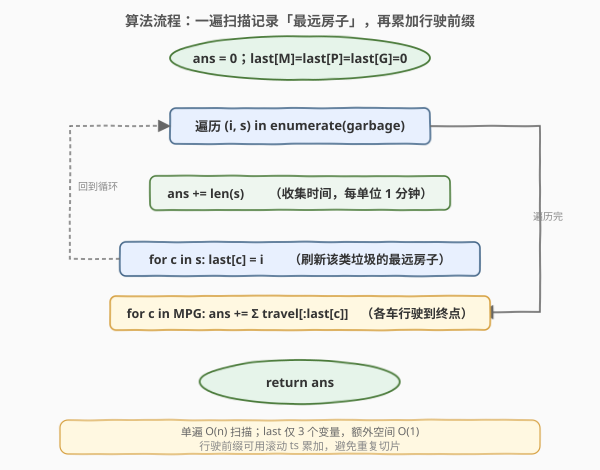
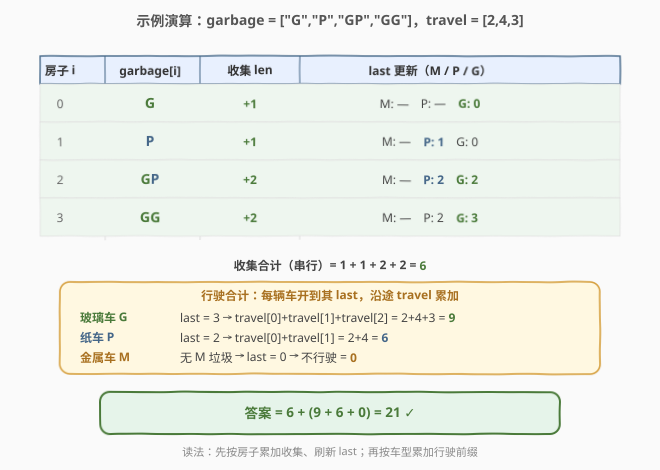

# 收集垃圾的最少总时间

- **题目名称**：收集垃圾的最少总时间
- **链接**：[2391. 收集垃圾的最少总时间](https://leetcode.cn/problems/minimum-amount-of-time-to-collect-garbage/)
- **难度**：中等
- **标签**：数组、字符串、前缀和

## 1. 题目概述

给你下标从 0 开始的字符串数组 `garbage`，其中 `garbage[i]` 表示第 `i` 个房子的垃圾集合，只包含字符 `'M'`、`'P'`、`'G'`，每个字符代表一单位的金属、纸、玻璃。垃圾车收拾**一**单位的任何垃圾都需花费 `1` 分钟。

同时给你下标从 0 开始的整数数组 `travel`，其中 `travel[i]` 是垃圾车从房子 `i` 行驶到房子 `i+1` 需要的分钟数。

城市里有三辆垃圾车，分别收拾金属（M）、纸（P）、玻璃（G）。每辆车都从房子 `0` 出发，**按顺序**到达每一栋房子，但**不是必须**到达所有房子。**任何时刻只有一辆垃圾车处在使用状态**——一辆车在行驶或收拾垃圾时，另两辆车什么都不能做。求收拾完所有垃圾的**最少**总分钟数。

**示例 1**：

```text
输入：garbage = ["G","P","GP","GG"], travel = [2,4,3]
输出：21
解释：
  收拾纸的车：0→1（2）+ 收 P（1）+ 1→2（4）+ 收 P（1）= 8 分钟
  收拾玻璃的车：收 G（1）+ 0→1（2）+ 1→2（4）+ 收 G（1）+ 2→3（3）+ 收 GG（2）= 13 分钟
  无金属垃圾，金属车不花时间。合计 8 + 13 = 21。
```

**示例 2**：

```text
输入：garbage = ["MMM","PGM","GP"], travel = [3,10]
输出：37
解释：金属车 7 分钟、纸车 15 分钟、玻璃车 15 分钟，合计 37。
```

**约束条件**：

- $2 \le \text{garbage.length} \le 10^5$
- `garbage[i]` 只包含字母 `'M'`、`'P'`、`'G'`。
- $1 \le \text{garbage[i].length} \le 10$
- $\text{travel.length} = \text{garbage.length} - 1$
- $1 \le \text{travel}[i] \le 100$

> 💡 **一句话题意**：三辆车各管一种垃圾，串行调度（任一时刻只有一辆车在工作）。求把所有垃圾收完的总时间。关键不在调度顺序，而在认清「哪些时间是逃不掉的下界」。

---

## 2. 解题思路

### 2.1 暴力思路：逐辆车模拟到每个房子

最直白的做法是模拟：对每种垃圾车，从房子 0 出发，逐栋向右开，每到一栋若该房有本类垃圾就花对应分钟收集、否则只花行驶时间通过。三辆车串行跑完即得总时间。

> ⚠️ 这套模拟本身的复杂度其实不高，真正的浪费在于**没有认清下界**：一辆车其实**只需**开到「该类垃圾最后出现的房子」即可——其后更远的房子都没有它的垃圾，开过去纯属空驶。把这点看穿，问题就塌缩成一个一遍扫描 + 前缀和的计数题。

### 2.2 核心观察：收集与行驶都是「逃不掉的下界」，且互不耦合



把总时间拆成两部分，分别论证它们既是**下界**又是**可达**的：

1. **收集时间**：每单位垃圾必须被对应的车收拾 `1` 分钟，且任意时刻只有一辆车在工作（串行），所以收集部分至少为「所有垃圾单位总数」$\sum_i \text{len}(\text{garbage}[i])$。让每辆车把自己类型的垃圾全收掉，恰好花掉这个数——**下界即上界**。

2. **行驶时间**：金属车要收完所有金属，就必须到达「最后一个含 `M` 的房子」`last[M]`；按顺序前进意味着它必须经过 `0 → last[M]` 全程，行驶至少为 `travel[0] + ... + travel[last[M]-1]`。纸车、玻璃车同理。三辆车串行调度，行驶部分至少为 $\sum_{T \in \{M,P,G\}} \text{prefix\_travel}[\text{last}[T]]$。让每辆车各自跑完 `0 → last[T]`（沿途顺手收掉本类垃圾），恰好花掉这个数——**下界即上界**。

> 💡 **为什么不用回程、不会相互抢占？** 题目只要求「收完」，车辆不必回到起点；按 `0 → last[T]` 单向跑完即停。三辆车互不抢路（串行），各自走各自的最短必要路段，**不存在更省的调度**——因为每一段都是该车的不可压缩下界。于是答案就是两部分下界之和。

### 2.3 算法流程图



一遍扫描维护 `last['M'/'P'/'G']` 与收集累计：

1. `ans = 0`，`last[M] = last[P] = last[G] = 0`；
2. 遍历 `(i, s) in enumerate(garbage)`：
   - `ans += len(s)`（收集时间）；
   - 对 `s` 中每个字符 `c`，`last[c] = i`（不断刷新「最远房子」）；
3. 对每种 `c ∈ {M,P,G}`：`ans += travel[0..last[c]-1]` 之和（行驶前缀）；
4. 返回 `ans`。

> 💡 **一个小技巧**：`last[c] = 0` 有两种含义——该类垃圾只出现在房子 0，或根本不出现。两者都对应「行驶 0 分钟」，所以用 `0` 作初值天然正确，无需特判「不存在」。

### 2.4 示例演算



以 `garbage = ["G","P","GP","GG"]`，`travel = [2,4,3]` 为例：

| 房子 i | garbage[i] | 收集 len | last 更新（M / P / G） |
|--------|-----------|----------|----------------------|
| 0 | `G` | +1 | M: —　P: —　**G: 0** |
| 1 | `P` | +1 | M: —　**P: 1**　G: 0 |
| 2 | `GP` | +2 | M: —　**P: 2**　**G: 2** |
| 3 | `GG` | +2 | M: —　P: 2　**G: 3** |

- 收集合计 = $1+1+2+2 = 6$；
- 行驶：玻璃 `last=3 → 2+4+3=9`，纸 `last=2 → 2+4=6`，金属 `last=0 → 0`；
- 答案 = $6 + (9+6+0) = 21$ ✓

> 💡 **读法**：`last[T]` 在扫描中**单调不减**地刷新——每遇到含 `T` 的房子就把它顶到当前位置，扫完时它就是该类的最远房子。行驶前缀恰好是「从 0 走到这个最远房子」的累计 `travel`。

---

## 3. 参考代码

### C++

```cpp
class Solution {
public:
    int garbageCollection(vector<string>& garbage, vector<int>& travel) {
        int ans = 0;
        int lastM = 0, lastP = 0, lastG = 0;      // 各类垃圾最后出现的房子
        for (int i = 0; i < (int)garbage.size(); ++i) {
            ans += garbage[i].size();             // 收集时间：每单位 1 分钟
            for (char c : garbage[i]) {           // 刷新最远房子
                if (c == 'M')      lastM = i;
                else if (c == 'P')  lastP = i;
                else                lastG = i;
            }
        }
        for (int i = 0; i < lastM; ++i) ans += travel[i];   // 金属车开到 lastM
        for (int i = 0; i < lastP; ++i) ans += travel[i];   // 纸车开到 lastP
        for (int i = 0; i < lastG; ++i) ans += travel[i];   // 玻璃车开到 lastG
        return ans;
    }
};
```

### Python

```python
class Solution:
    def garbageCollection(self, garbage: List[str], travel: List[int]) -> int:
        ans = 0
        last = {'M': 0, 'P': 0, 'G': 0}           # 每种垃圾最后出现的房子（0 = 不需行驶）
        for i, s in enumerate(garbage):
            ans += len(s)                          # 收集时间：每单位 1 分钟
            for c in s:
                last[c] = i                        # 持续刷新最远房子
        for c in 'MPG':
            ans += sum(travel[:last[c]])           # 该车开到 last[c]，沿途行驶时间
        return ans
```

> ⚠️ **避免重复切片**：上面 `sum(travel[:last[c]])` 每次构造一个切片，三趟合计仍为 $O(n)$，量级无碍。追求常数更优可用滚动前缀 `ts`：扫到房子 `i` 时 `ts += travel[i-1]`，若某类 `last == i` 就把 `ts` 累入答案——一趟即完成行驶部分的累加（见第 5 节）。
>
> 💡 **`'M' in s` 还是逐字符扫描？** 用 `'M' in s` 判定该房是否含某类垃圾可少做字符遍历，但 `garbage[i].length ≤ 10` 极短，逐字符扫描刷新 `last` 写法更直接、常数与可读性俱佳。

---

## 4. 复杂度分析

| 维度 | 复杂度 | 说明 |
|------|--------|------|
| **时间复杂度** | $O(n)$ | 一遍扫描 `garbage` 累加 `len` 与刷新 `last`；行驶前缀累加三趟合计仍 $O(n)$（$n$ 为房子数） |
| **空间复杂度** | $O(1)$ | 仅用 3 个 `last` 变量与若干累加器，与 `n` 无关 |
| 对照：逐车逐房模拟 | $O(n)$ / $O(1)$ | 复杂度同阶，但本解法把「模拟」提炼为「下界求和」，逻辑更短、常数更小 |

> 💡 本题的关键不在复杂度优化，而在**洞察**：把看似需要调度的模拟问题，拆成「收集下界 + 行驶下界」两个互不耦合的求和。一旦认清二者独立且都是下界，三辆车串行的安排天然可达，答案即下界之和。

---

## 5. 扩展：滚动前缀一趟累加行驶时间

把行驶部分也压进单趟扫描，可避免重复切片、常数更优：

```python
class Solution:
    def garbageCollection(self, garbage: List[str], travel: List[int]) -> int:
        ans = 0
        last = {'M': 0, 'P': 0, 'G': 0}
        for i, s in enumerate(garbage):
            ans += len(s)
            for c in s:
                last[c] = i
        ts = 0                                     # 滚动行驶前缀
        for i, t in enumerate(travel, 1):           # i = 当前抵达的房子下标
            ts += t
            for c in 'MPG':
                if last[c] == i:                    # 该车终点恰为房子 i → 把前缀累入答案
                    ans += ts
        return ans
```

思路：行驶前缀 `ts` 在扫到房子 `i` 时正好是 `travel[0]+...+travel[i-1]`。若某类垃圾的 `last == i`，意味着对应车的终点就是房子 `i`，其行驶时间正是此刻的 `ts`，直接累入即可。这样行驶部分也只需单趟 $O(n)$，且无切片开销。

> ⚠️ 注意枚举顺序：`last[c]` 在第一趟已全部确定，第二趟只读不写，`ts` 单调递增，每类至多命中一次 `last[c] == i`，逻辑正确。

---

## 6. 面试要点

1. **为什么收集时间是「单位总数」而不是取三者最大？**

   - 题目规定「任何时刻只有一辆车在使用状态」——一辆车在收拾垃圾时，另两辆不能动。因此收集是**串行**的，三辆车各自的收拾分钟相加，恰为垃圾单位总数。若题目改为「三车可并行收集」，则收集部分才退化为「三类计数取最大」。

2. **为什么每辆车只需开到「该类垃圾最后出现的房子」？**

   - 一辆车要收完本类全部垃圾，必须访问每个含该类垃圾的房子；按顺序前进意味着最远必须到达 `last[T]`。`last[T]` 之后的房子没有该类垃圾，开过去纯属空驶，只会增加时间。所以 `0 → last[T]` 是必要且充分的最短路段。

3. **`last` 初值取 0 为什么安全？**

   - 两类情形都对应「行驶 0 分钟」：若该类只出现在房子 0，车停在起点收完即止；若该类完全不出现，车根本不动。两者都不需要任何 `travel`，故用 `0` 作初值天然正确，省去「是否存在」的特判。

4. **三辆车串行会不会让某辆车重复跑同一段路？**

   - 会，但**无法避免也不影响最优**。比如玻璃车和纸车都经过 `0→1`，由于串行（不能同时开），这段路被各算一次。这正是「下界即上界」的体现：每辆车对各自必要路段的行驶时间是它自己的不可压缩下界，叠加即答案。

5. **能否换成只扫一遍、不存 `last` 数组？**

   - `last` 只有 3 个标量，本身就是 $O(1)$ 空间，已经极简。若要进一步把行驶累加并入第一趟扫描，需在扫到房子 `i` 时预判「该类之后是否还会出现」——这要么倒着扫一次预处理，要么第二趟补加（即第 5 节方案）。直接一遍双职责反而不直观，故推荐「两趟各司其职」的写法。

> 💡 **一句话总结**：把调度问题拆成「收集下界 $\sum\text{len}$ + 行驶下界 $\sum_T \text{prefix\_travel}[\text{last}[T]]$」两个独立求和；一遍扫描记录每类垃圾的最远房子，再累加各自行驶前缀，$O(n)$ 时间、$O(1)$ 空间即得答案。

---

## 7. 同类练习题

- [2383. 赢得比赛需要的最少训练时长](https://leetcode.cn/problems/minimum-hours-of-training-to-win-a-competition/)（[题解](../2301-2400/2383_赢得比赛需要的最少训练时长.md)）：同为「拆成两个独立下界求和」的周赛题——初始能力不足量与练习时间各自独立计算，思路与本题把总时间拆成收集/行驶两段如出一辙
- [2335. 装满杯子需要的最短总时长](https://leetcode.cn/problems/minimum-amount-of-time-to-fill-cups/)（[题解](../2301-2400/2335_装满杯子需要的最短总时长.md)）：三组需求并行/串行调度的最短时间，对照本题「串行则求和」与「可并行则取最大」两种情形的边界，强化对调度下界的直觉
- [135. 分发糖果](https://leetcode.cn/problems/candy/)（[题解](../0101-0200/135_分发糖果.md)）：左右两趟扫描各取下界再取 max 的范式，与本题「两段独立下界求和」共享「把约束拆成独立方向再合并」的思想
- [2390. 从字符串中移除星号](https://leetcode.cn/problems/removing-stars-from-a-string/)（[题解](../2301-2400/2390_从字符串中移除星号.md)）：同为第 308 场周赛相邻题号，对照「一遍扫描维护状态 + 后处理汇总」的简洁单链写法
