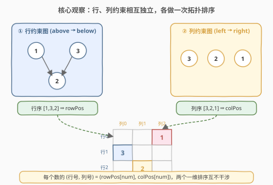
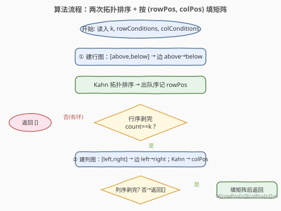
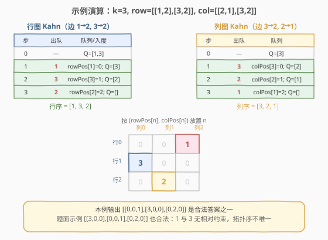

# LeetCode 给定条件下构造矩阵 题解

## 1. 题目概述

- **标题 / 题号**：给定条件下构造矩阵（#2392，hard）
- **链接**：https://leetcode.cn/problems/build-a-matrix-with-conditions/
- **难度**：困难
- **标签**：图、拓扑排序、数组、矩阵

**题意**：给定正整数 `k`，以及两组条件：

- `rowConditions[i] = [above_i, below_i]`：数字 `above_i` 必须出现在 `below_i` **所在行严格上方**的某一行；
- `colConditions[i] = [left_i, right_i]`：数字 `left_i` 必须出现在 `right_i` **所在列严格左侧**的某一列。

两组条件中的整数都取自 `1` 到 `k`。要求构造一个 `k × k` 的矩阵，使 `1` 到 `k` 每个数**恰好出现一次**，其余格子填 `0`，并满足上述全部行列约束。返回任一合法矩阵；若无解返回空矩阵 `[]`。

**示例 1**：

```text
输入：k = 3, rowConditions = [[1,2],[3,2]], colConditions = [[2,1],[3,2]]
输出：[[3,0,0],[0,0,1],[0,2,0]]
解释：1 在第 1 行、2 在第 2 行 → 1 在 2 上方；3 在第 0 行、2 在第 2 行 → 3 在 2 上方。
      2 在第 1 列、1 在第 2 列 → 2 在 1 左侧；3 在第 0 列、2 在第 1 列 → 3 在 2 左侧。
```

**示例 2**：

```text
输入：k = 3, rowConditions = [[1,2],[2,3],[3,1],[2,3]], colConditions = [[2,1]]
输出：[]
解释：行约束形成 1→2→3→1 的环，无法满足，返回空矩阵。
```

**约束**：

- $2 \le k \le 400$
- $1 \le \text{rowConditions.length}, \text{colConditions.length} \le 10^4$
- `rowConditions[i].length == colConditions[i].length == 2`
- $1 \le \text{above}_i, \text{below}_i, \text{left}_i, \text{right}_i \le k$
- `above_i != below_i`，`left_i != right_i`

> 💡 **一句话题意**：给每个数 $1\ldots k$ 定一个 $(\text{行号}, \text{列号})$，使行方向的偏序约束和列方向的偏序约束各自成立——本质上就是**两个互不干涉的拓扑排序问题**。

## 2. 解题思路

### 2.1 暴力思路：枚举排列

最直白的做法是枚举数字 $1\ldots k$ 的所有行排列与列排列（共 $(k!)^2$ 种），逐一验证约束。$k = 400$ 时 $k!$ 是天文数字，完全不可行。

突破口在于：**行列约束彼此独立**——行号只取决于 `rowConditions`，列号只取决于 `colConditions`。于是可以把"二维放置"拆成两个"一维排序"问题分别求解，再合并。而"给定偏序关系求一个合法线性序"恰好是**拓扑排序**的标准应用。

### 2.2 核心观察：两次拓扑排序，按出队序定位



关键直觉：

- **建图方向**：`[above, below]` 表示 `above` 在 `below` 之上，即 `above` 的行号 `<` `below` 的行号，对应有向边 `above → below`（前者先排）。列约束 `[left, right]` 同理对应边 `left → right`。
- **行、列分离**：行约束只决定每个数的**行号**，列约束只决定每个数的**列号**，两组条件互不引用，可各自跑一次 Kahn 拓扑排序。
- **出队序即坐标**：Kahn 的出队顺序天然是一个拓扑序。令 `rowPos[num] = num 在行拓扑序中的下标`，`colPos[num] = num 在列拓扑序中的下标`，则把 `num` 放到 `mat[rowPos[num]][colPos[num]]` 即同时满足两组约束。
- **判无解**：若某次拓扑排序没能取出全部 $k$ 个节点（出队数 `< k`），说明该方向存在**环**，无解，直接返回 `[]`。例 2 的 `1→2→3→1` 正是此情形。
- **不会撞格**：行拓扑序是 $1\ldots k$ 的一个排列，列拓扑序也是 $1\ldots k$ 的一个排列，因此 $\{(\text{rowPos}[n], \text{colPos}[n])\}$ 这 $k$ 个坐标两两不同，填入矩阵不会冲突。

> ⚠️ **方向是本题最易写反的细节**：边应从"在前者"指向"在后者"——行是 `above → below`，列是 `left → right`。建反了会把约束颠倒，得到错误甚至自相矛盾的拓扑序。

### 2.3 算法流程图



流程对行、列各执行一次 Kahn：建邻接表与入度数组 → 入度为 $0$ 的节点入队 → 反复出队并把邻点入度 $-1$、归零者入队 → 出队数 `< k` 即判环返回空。两次都通过后，按 $(\text{rowPos}[n], \text{colPos}[n])$ 放置每个数。

### 2.4 示例演算



以例 1 `k=3, row=[[1,2],[3,2]], col=[[2,1],[3,2]]` 为例：

**行图**（边 `1→2, 3→2`，入度 `1:0, 2:2, 3:0`）：

| 步 | 出队 | 说明 |
|----|------|------|
| 0 | — | 队列 `[1,3]`（入度 0 者） |
| 1 | 1 | `rowPos[1]=0`；`2` 入度 →1 |
| 2 | 3 | `rowPos[3]=1`；`2` 入度 →0 入队 |
| 3 | 2 | `rowPos[2]=2`；队列空，共 3 个 = 无环 ✓ |

行拓扑序 = `[1, 3, 2]`。

**列图**（边 `3→2, 2→1`，入度 `3:0, 2:1, 1:1`）：

| 步 | 出队 | 说明 |
|----|------|------|
| 0 | — | 队列 `[3]` |
| 1 | 3 | `colPos[3]=0`；`2` 入度 →0 入队 |
| 2 | 2 | `colPos[2]=1`；`1` 入度 →0 入队 |
| 3 | 1 | `colPos[1]=2`；队列空，共 3 个 = 无环 ✓ |

列拓扑序 = `[3, 2, 1]`。

**填矩阵**：`1→(0,2)`、`2→(2,1)`、`3→(1,0)`，得

$$
\begin{bmatrix} 0 & 0 & 1 \\ 3 & 0 & 0 \\ 0 & 2 & 0 \end{bmatrix}
$$

> 💡 **拓扑序不唯一**：本例输出 `[[0,0,1],[3,0,0],[0,2,0]]` 与题面示例 `[[3,0,0],[0,0,1],[0,2,0]]` **都是合法答案**。因为 `1` 与 `3` 之间没有任何行约束（两者都只指向 `2`），在行拓扑序中 `1、3` 谁先都行——Kahn 中入队顺序不同就会产生不同的合法排列。题目允许多解，任取其一即可。

## 3. 参考代码

### C++

```cpp
class Solution {
public:
    vector<vector<int>> buildMatrix(int k, vector<vector<int>>& rowConditions,
                                    vector<vector<int>>& colConditions) {
        auto topo = [&](vector<vector<int>>& cond) -> vector<int> {
            vector<vector<int>> adj(k + 1);
            vector<int> indeg(k + 1, 0);
            for (auto& c : cond) {            // [above,below] / [left,right] → u->v
                adj[c[0]].push_back(c[1]);
                indeg[c[1]]++;
            }
            queue<int> q;
            for (int i = 1; i <= k; ++i)
                if (indeg[i] == 0) q.push(i);
            vector<int> order;
            while (!q.empty()) {
                int u = q.front(); q.pop();
                order.push_back(u);
                for (int v : adj[u])
                    if (--indeg[v] == 0) q.push(v);
            }
            return order;                     // order.size()==k 表示无环
        };

        vector<int> row = topo(rowConditions);
        vector<int> col = topo(colConditions);
        if ((int)row.size() < k || (int)col.size() < k) return {};   // 存在环

        vector<int> rowPos(k + 1), colPos(k + 1);
        for (int i = 0; i < k; ++i) {
            rowPos[row[i]] = i;               // 出队序号 = 行号
            colPos[col[i]] = i;               // 出队序号 = 列号
        }
        vector<vector<int>> mat(k, vector<int>(k, 0));
        for (int n = 1; n <= k; ++n)
            mat[rowPos[n]][colPos[n]] = n;
        return mat;
    }
};
```

### Python

```python
from collections import deque

class Solution:
    def buildMatrix(self, k: int, rowConditions: List[List[int]],
                    colConditions: List[List[int]]) -> List[List[int]]:
        def topo(cond: List[List[int]]) -> List[int]:
            adj = [[] for _ in range(k + 1)]
            indeg = [0] * (k + 1)
            for a, b in cond:                # a -> b
                adj[a].append(b)
                indeg[b] += 1
            q = deque([i for i in range(1, k + 1) if indeg[i] == 0])
            order = []
            while q:
                u = q.popleft()
                order.append(u)
                for v in adj[u]:
                    indeg[v] -= 1
                    if indeg[v] == 0:
                        q.append(v)
            return order

        row = topo(rowConditions)
        col = topo(colConditions)
        if len(row) < k or len(col) < k:      # 有环，无解
            return []

        rowPos = [0] * (k + 1)
        colPos = [0] * (k + 1)
        for i, x in enumerate(row):
            rowPos[x] = i                     # 出队序号 = 行号
        for i, x in enumerate(col):
            colPos[x] = i                     # 出队序号 = 列号
        mat = [[0] * k for _ in range(k)]
        for n in range(1, k + 1):
            mat[rowPos[n]][colPos[n]] = n
        return mat
```

> ⚠️ **重复边**：例 2 的 `rowConditions` 含两个 `[2,3]`，说明输入可能重复。上面的代码不预先去重也能正确工作——重复边会让入度与邻接表都多算一份，但删边时也会相应多减一份，入度仍能正确归零，不影响判环与拓扑序。若想严格，可先对条件去重再建图。

## 4. 复杂度分析

| 维度 | 复杂度 | 说明 |
|------|--------|------|
| **时间复杂度** | $O(k + E_{\text{row}} + E_{\text{col}} + k^2)$ | 两次 Kahn 各 $O(k + E)$；初始化与填写矩阵 $O(k^2)$ |
| **空间复杂度** | $O(k + E_{\text{row}} + E_{\text{col}} + k^2)$ | 邻接表与入度数组 $O(k + E)$，输出矩阵 $O(k^2)$ |

其中 $E_{\text{row}}, E_{\text{col}}$ 分别为行、列条件数，上界 $10^4$；$k \le 400$，故 $k^2 \le 1.6 \times 10^5$，整体规模很小。

> 💡 矩阵的 $O(k^2)$ 来自输出本身（必须填 $k \times k$ 个格子），无法回避；拓扑排序部分是线性于"点数 + 边数"的，是这类问题能达到的最优。

## 5. 扩展：DFS 后序逆序求拓扑序

除 Kahn（BFS）外，也可用 **DFS 三色标记 + 后序逆序**求拓扑序：节点离开递归栈前压栈，最终逆序即为一个拓扑序；递归途中遇到"访问中"的节点即判环。两种方法都可行，但本题 $k \le 400$、递归深度有限，DFS 同样安全。

> 💡 **选型建议**：Kahn 无递归、出队序直接就是坐标，与"按序定位"的思路无缝衔接，本题首选；DFS 三色更适合需要逆拓扑序或与状态压缩结合的变体。

## 6. 面试要点

1. **为什么行列可以独立求解？**

   - 行约束只规定数字在**行方向**的相对顺序，列约束只规定**列方向**的相对顺序，两组条件互不引用同一个坐标分量。因此每个数的行号只由行图决定、列号只由列图决定，可分别做一次拓扑排序再合并。

2. **有向边的方向怎么定？**

   - "在前者 → 在后者"。行约束 `[above, below]` 即 `above → below`（`above` 行号更小，先排）；列约束 `[left, right]` 即 `left → right`。建反了会把入度算到错的端点上，拓扑序颠倒。

3. **如何判无解？**

   - 任意一次 Kahn 的出队数 `< k`，即该方向存在环，返回 `[]`。例 2 的 `1→2→3→1` 使初始没有任何入度为 0 的节点，队列为空、出队数为 0，立即判定无解。

4. **为什么不会有两个数填到同一格？**

   - 行拓扑序是 $1\ldots k$ 的一个排列，每个数得到互不相同的行号；列拓扑序同理给出互不相同的列号。组合后 $k$ 个坐标两两不同，且都在 $k \times k$ 范围内，填矩阵无冲突。

5. **为什么我的输出和题面示例不一样但判通过？**

   - 当两个数之间没有任何相对约束时，它们在拓扑序中的先后可任意，Kahn 的入队顺序不同会产生不同的合法排列。题目允许多解，任一满足全部约束的矩阵都正确。

> 💡 **一句话总结**：把"二维放置"拆成两个一维拓扑排序——行约束建 `above→below` 图、列约束建 `left→right` 图，各跑一次 Kahn，出队序下标即为坐标；任一方有环则无解。

## 同类练习题

| # | 题目 | 与本题的关联 |
|---|------|-------------|
| 207 | [课程表](https://leetcode.cn/problems/course-schedule/)（[题解](../0201-0300/207_课程表.md)） | Kahn 拓扑排序判环的母题，本题的两路拓扑排序就是它的直接复用 |
| 210 | [课程表 II](https://leetcode.cn/problems/course-schedule-ii/)（[题解](../0201-0300/210_课程表II.md)） | 在 207 基础上输出拓扑序本身——本题用出队序定位坐标正是同一思路 |
| 310 | [最小高度树](https://leetcode.cn/problems/minimum-height-trees/)（[题解](../0301-0400/310_最小高度树.md)） | 逐层"剥"入度 1 的叶子节点，与 Kahn 删入度 0 的节点同源 |
| 1462 | [课程表 IV](https://leetcode.cn/problems/course-schedule-iv/)（[题解](../1401-1500/1462_课程表IV.md)） | 在拓扑排序过程中传递闭包，判定两课程是否构成先后关系，强化对拓扑序的运用 |
| 802 | [找到最终的安全状态](https://leetcode.cn/problems/find-eventual-safe-states/)（[题解](../0801-0900/802_找到最终的安全状态.md)） | 反向图 + 拓扑判环，对照本题"出队数 < k 即有环"的判定 |
