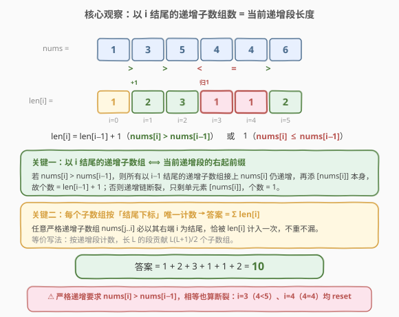
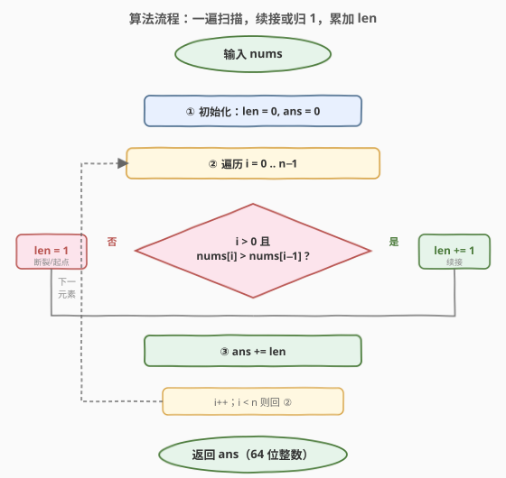

# 严格递增的子数组数目

- **题目名称**：严格递增的子数组数目
- **链接**：[2393. 严格递增的子数组数目](https://leetcode.cn/problems/count-strictly-increasing-subarrays/)
- **难度**：中等
- **标签**：数组、数学、动态规划

## 1. 题目概述

给你一个整数数组 `nums`。**子数组**是数组中一个连续的、非空的元素序列。如果一个子数组中**每个元素都严格大于它的前一个元素**，则称该子数组为**严格递增**的（单个元素视为严格递增）。

返回 `nums` 中**严格递增子数组的总数目**。

**示例 1**：

```text
输入：nums = [1, 2, 3]
输出：6
解释：6 个严格递增子数组分别为 [1], [2], [3], [1,2], [2,3], [1,2,3]。
```

**示例 2**：

```text
输入：nums = [1, 3, 5, 4, 4, 6]
输出：10
解释：以各下标结尾的递增子数组数依次为 1, 2, 3, 1, 1, 2，累加得 10。
```

**示例 3**：

```text
输入：nums = [5, 4, 3, 2, 1]
输出：5
解释：数组严格递减，只有 5 个单元素子数组严格递增。
```

**约束条件**：

- $1 \le \text{nums.length} \le 10^5$
- $1 \le \text{nums}[i] \le 10^9$
- 答案保证在 64 位整数范围内。

> 💡 **一句话题意**：数一遍有多少个连续子数组是「逐个严格递增」的。暴力是 $O(n^2)$ 枚举所有子数组，但只要把视角从「枚举子数组」换成「按结尾下标计数」，就能一遍 $O(n)$ 搞定。

---

## 2. 解题思路

### 2.1 暴力思路：枚举所有子数组

最直白的做法：枚举所有 $\frac{n(n+1)}{2}$ 个子数组，对每个子数组检查是否严格递增（内层再扫一遍）。

```python
def countSubarrays(nums):
    n = len(nums)
    ans = 0
    for i in range(n):
        for j in range(i, n):
            ok = True
            for k in range(i + 1, j + 1):
                if nums[k] <= nums[k - 1]:
                    ok = False
                    break
            if ok:
                ans += 1
    return ans
```

> ⚠️ 代价 $O(n^3)$（内层提前 break 仍 $O(n^2)$）。$n = 10^5$ 时 $n^2 = 10^{10}$，必超时。突破口在于：**不必独立检查每个子数组**——相邻位置的递增性具有「传递性」，`nums[i−1] < nums[i]` 且 `nums[i] < nums[i+1]` 即知三者递增。把视角从「枚举子数组」换成「按结尾下标增量计数」即可降维。

### 2.2 核心观察：以 i 结尾的递增子数组数 = 当前递增段长度



令 `len[i]` 表示**以下标 `i` 结尾的严格递增子数组个数**。关键是它和「以 `i−1` 结尾」的关系：

- 若 `nums[i] > nums[i−1]`：所有以 `i−1` 结尾的递增子数组，末尾接上 `nums[i]` 后仍严格递增；再添上单独的 `[nums[i]]` 本身。故 `len[i] = len[i−1] + 1`。
- 否则（`nums[i] ≤ nums[i−1]`，含相等）：递增链在 `i` 处**断裂**，唯一能以 `i` 结尾的递增子数组就是单元素 `[nums[i]]`，故 `len[i] = 1`。

边界 `len[0] = 1`（单元素天然严格递增）。每个严格递增子数组**唯一地以其最右端下标为「结尾」被计入** `len[i]` 一次，不重不漏，因此：

$$\text{答案} = \sum_{i=0}^{n-1} \text{len}[i]$$

> 💡 **为什么不重不漏**：任意子数组 `nums[j..i]` 严格递增 ⟺ `j` 落在以 `i` 结尾的最长递增段内 ⟺ 它被 `len[i]` 计入。`len[i]` 恰等于「以 `i` 结尾的递增段长度」，即从 `i` 向左能延伸的连续严格递增长度。换一个等价视角：把数组切成若干**极大严格递增段**，长度为 $L$ 的段贡献 $\frac{L(L+1)}{2}$ 个子数组——这正是 $1+2+\cdots+L$。
>
> ⚠️ **「严格」二字**：`nums[i] == nums[i−1]` 也算断裂，`len` 归 1，不是「非严格递增」下的续接。审题要看清是否带「严格」。

### 2.3 算法流程图



只需一个滚动变量 `len`（无需数组）：

1. `ans = 0`，`len = 0`；
2. 遍历 `i = 0..n−1`：
   - `i == 0` 或 `nums[i] <= nums[i−1]`：`len = 1`（断裂/起点）；
   - 否则：`len = len + 1`（续接）；
   - `ans += len`；
3. 返回 `ans`。

### 2.4 示例演算

![示例演算：nums=[1,3,5,4,4,6]，逐下标维护 len 与 ans](../images/2393_example_walkthrough.svg)

以示例 2 `nums = [1, 3, 5, 4, 4, 6]` 为例：

| i | nums[i] | 与前比较 | len | 累计 ans | 以 i 结尾的递增子数组 |
|---|---------|----------|-----|----------|----------------------|
| 0 | 1 | —（起点） | 1 | 1 | [1] |
| 1 | 3 | 3 > 1 ✓ | 2 | 3 | [3], [1,3] |
| 2 | 5 | 5 > 3 ✓ | 3 | 6 | [5], [3,5], [1,3,5] |
| 3 | 4 | 4 < 5 ✗ | 1 | 7 | [4] |
| 4 | 4 | 4 = 4 ✗ | 1 | 8 | [4] |
| 5 | 6 | 6 > 4 ✓ | 2 | 10 | [6], [4,6] |

最终 `ans = 10` ✓。注意 `i=3`（4<5）与 `i=4`（4=4）两次断裂，`len` 都归 1——**相等也断**。

---

## 3. 参考代码

### C++

```cpp
class Solution {
public:
    long long countSubarrays(vector<int>& nums) {
        long long ans = 0;
        int len = 0;
        for (int i = 0; i < (int)nums.size(); ++i) {
            if (i > 0 && nums[i] > nums[i - 1]) len++;   // 续接：递增段 +1
            else                                  len = 1; // 断裂/起点：归 1
            ans += len;
        }
        return ans;
    }
};
```

### Python

```python
class Solution:
    def countSubarrays(self, nums: List[int]) -> int:
        ans = 0
        length = 0
        for i, x in enumerate(nums):
            if i > 0 and x > nums[i - 1]:
                length += 1        # 续接
            else:
                length = 1         # 断裂/起点
            ans += length
        return ans
```

> 💡 **常数极小**：单遍扫描、每个元素一次比较与一次加法，无额外数组。$n = 10^5$ 时仅十万次操作。
>
> ⚠️ **答案用 64 位**：最坏全递增时答案 $= \frac{n(n+1)}{2} \approx 5\times 10^9$，超过 32 位 `int` 上界（约 $2.1\times 10^9$）。C++ 用 `long long`，Python 整数无上限天然安全。

---

## 4. 复杂度分析

| 维度 | 复杂度 | 说明 |
|------|--------|------|
| **时间复杂度** | $O(n)$ | 单遍扫描，每步常数次比较与累加 |
| **空间复杂度** | $O(1)$ | 只用 `len`、`ans` 两个滚动变量，无额外数组 |
| 对照：枚举子数组 | $O(n^3)$ / $O(1)$ | 三重循环枚举 + 检查；内层提前 break 仍 $O(n^2)$ |

> 💡 与暴力 $O(n^3)$ 相比，本解法把「对每个子数组独立判定递增性」改为「按结尾下标增量维护递增段长度」——递增性的**局部传递性**让续接只需 $O(1)$，从立方降到线性。

---

## 5. 扩展：按递增段批量计数（等价公式版）

`len` 的逐步累加与「先切段再求和」完全等价。扫一遍找出每个极大严格递增段的长度 $L_j$，则该段贡献 $\frac{L_j(L_j+1)}{2}$ 个子数组，答案 $= \sum_j \frac{L_j(L_j+1)}{2}$。

```python
class Solution:
    def countSubarrays(self, nums: List[int]) -> int:
        ans = 0
        L = 1                                  # 当前递增段长度
        for i in range(1, len(nums)):
            if nums[i] > nums[i - 1]:
                L += 1
            else:
                ans += L * (L + 1) // 2         # 结算上一段
                L = 1
        ans += L * (L + 1) // 2                 # 结算最后一段
        return ans
```

> 💡 两种写法**完全等价**：$\sum_i \text{len}[i] = \sum_j (1+2+\cdots+L_j) = \sum_j \frac{L_j(L_j+1)}{2}$。增量累加版代码更短、无需末尾结算；分段公式版更直观地揭示「递增段」结构。面试中讲清这层等价关系即可。

---

## 6. 面试要点

1. **为什么按「结尾下标」计数就能不重不漏？**

   - 任意子数组有唯一的右端下标 `i`；它严格递增 ⟺ 左端落在以 `i` 结尾的最长递增段内 ⟺ 被 `len[i]` 计入。故「按结尾分组」构成一组划分，求和即总数。

2. **`nums[i] == nums[i−1]` 时 `len` 怎么变？**

   - 归 1。「严格递增」要求严格大于，相等不满足，递增链断裂，只剩单元素 `[nums[i]]`。这与「非严格递增（$\ge$）」问题不同——审题要看清是否带「严格」二字。

3. **为什么答案要 64 位？**

   - 最坏整个数组严格递增，答案 $= \frac{n(n+1)}{2}$，$n=10^5$ 时约 $5\times 10^9$，超过 32 位有符号整数上界 $2^{31}-1 \approx 2.1\times 10^9$。C++ 用 `long long`，Java 用 `long`，Python 整数无溢出。

4. **能否不用 DP、直接数递增段？**

   - 可以。扫一遍切出极大严格递增段，长 $L$ 的段贡献 $\frac{L(L+1)}{2}$，求和即答案。与增量累加版等价（见第 5 节），因为 $\sum_i \text{len}[i] = \sum_j \frac{L_j(L_j+1)}{2}$。

5. **和「最长递增子序列 LIS」有何区别？**

   - 本题数的是**连续子数组**且只需相邻递增，$O(n)$ 即可；LIS（[300](https://leetcode.cn/problems/longest-increasing-subsequence/)）求**不连续子序列**的最长长度，需 $O(n\log n)$ 二分。前者靠「递增段长度」局部传递，后者靠 patience sorting 维护尾元素——连续 vs 离散是分水岭。

> 💡 **一句话总结**：维护「以当前下标结尾的递增段长度」`len`，遇续接则 `+1`、遇断裂则归 `1`，累加 `len` 即答案，$O(n)$ / $O(1)$。

---

## 7. 同类练习题

- [674. 最长连续递增序列](https://leetcode.cn/problems/longest-continuous-increasing-subsequence/)（[题解](../0601-0700/674_最长连续递增序列.md)）：求最长严格递增**连续子数组**长度，即本题「递增段」结构取 max——同一个 `len` 变量，本题求和、674 求最大值
- [300. 最长递增子序列](https://leetcode.cn/problems/longest-increasing-subsequence/)（[题解](../0201-0300/300_最长递增子序列.md)）：求**不连续**子序列的最长长度，对照本题连续版——离散需二分 patience，连续只需相邻比较
- [713. 乘积小于K的子数组](https://leetcode.cn/problems/subarray-product-less-than-k/)（[题解](../0701-0800/713_乘积小于K的子数组.md)）：滑动窗口按「右端」计数子数组个数 `right−left+1`，与本题「以 i 结尾的个数 = len」同为「按右端增量计数」范式
- [2348. 全0子数组的数目](https://leetcode.cn/problems/number-of-zero-filled-subarrays/)（[题解](2348_全0子数组的数目.md)）：数全 0 连续子数组，本质完全同构——把「0 连续段长 $L$」贡献 $\frac{L(L+1)}{2}$，与本题递增段计数同模板
- [53. 最大子数组和](https://leetcode.cn/problems/maximum-subarray/)（[题解](../0001-0100/53_最大子数组和.md)）：Kadane 按「以 i 结尾的最大和」增量递推，与本题「以 i 结尾的递增段长」增量递推同属「结尾下标 DP」家族
