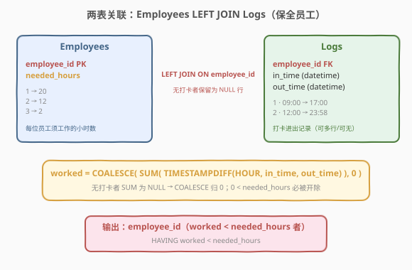
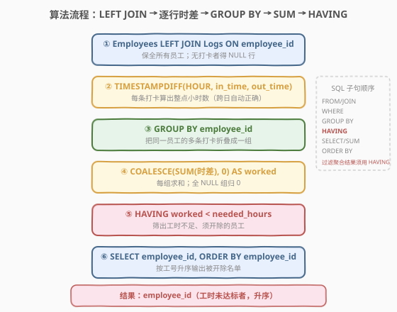
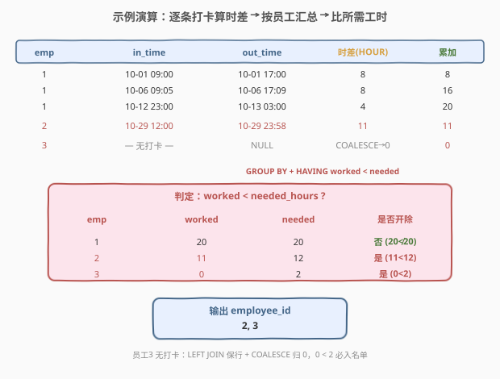

# 开除员工

- **题目名称**：开除员工
- **链接**：[2394. 开除员工 🔒](https://leetcode.cn/problems/employees-with-deductions/)
- **难度**：中等
- **标签**：数据库、SQL、`LEFT JOIN`、`GROUP BY`、`HAVING`、`SUM` + `COALESCE` 零填充、`TIMESTAMPDIFF` 时间差、LeetCode 锁题

> ⚠️ **关于题面**：本题为 **LeetCode Plus 会员专享题**，官方题面与示例输出被会员墙锁定，公开 GraphQL 接口的 `content` 字段返回 `null`。下文 **第 1 节题意**系依据公开可见的**建表语句（`metaData.database_schema`）与示例输入（`sampleTestCase`）+ 题目名"开除员工 / Employees With Deductions"**重构而成，**核心算法（`LEFT JOIN + GROUP BY + SUM + HAVING`）与示例输入的演算结果是确定的**；但**官方输出列名 / 排序细节**（本文取 `employee_id`、按 `employee_id` 升序）为合理推断，**以官方题面为准**——若官方输出列名或排序不同，仅需改 `AS` 别名或 `ORDER BY`，主体逻辑不变。

---

## 1. 题目概述

公司用 `Employees` 表登记每位员工**本月应工作的小时数** `needed_hours`，用 `Logs` 表记录员工每次上下班打卡（`in_time` 打卡上班、`out_time` 打卡下班）。一条 `Logs` 对应一段连续工作时长达，**跨日打卡也合法**（如 23:00 上班、次日 03:00 下班）。编写 SQL，返回**实际工作时长达不到 `needed_hours` 的员工 `employee_id`**（即应被"开除/扣薪"者）。

**表结构**：

```text
表：Employees
+--------------+---------+
| 列名         | 类型    |
+--------------+---------+
| employee_id  | int     |  ← 主键
| needed_hours | int     |  ← 该员工应工作小时数
+--------------+---------+
employee_id 是该表的主键（具有唯一值）。
每行表示一名员工及其本月应完成的工时。

表：Logs
+-------------+------------+
| 列名        | 类型       |
+-------------+------------+
| employee_id | int        |  ← 外键 → Employees.employee_id
| in_time     | datetime   |  ← 上班打卡时间
| out_time    | datetime   |  ← 下班打卡时间
+-------------+------------+
(employee_id, in_time) 通常为该表的标识。
每行表示一次打卡记录，in_time ≤ out_time，时长可跨日。
同一员工可有多条打卡；也可能本月完全无打卡。
```

**输出列**：`employee_id`。结果按 `employee_id` **升序**返回。

**示例 1**（取自官方 `sampleTestCase`）：

```text
输入：
Employees 表：
+-------------+--------------+
| employee_id | needed_hours |
+-------------+--------------+
| 1           | 20           |
| 2           | 12           |
| 3           | 2            |
+-------------+--------------+

Logs 表：
+-------------+---------------------+---------------------+
| employee_id | in_time             | out_time            |
+-------------+---------------------+---------------------+
| 1           | 2022-10-01 09:00:00 | 2022-10-01 17:00:00 |
| 1           | 2022-10-06 09:05:04 | 2022-10-06 17:09:03 |
| 1           | 2022-10-12 23:00:00 | 2022-10-13 03:00:01 |
| 2           | 2022-10-29 12:00:00 | 2022-10-29 23:58:58 |
+-------------+---------------------+---------------------+

输出：
+-------------+
| employee_id |
+-------------+
| 2           |
| 3           |
+-------------+
```

**解释**：

| 员工 | 各段工时（`TIMESTAMPDIFF(HOUR, …)`） | 累计 worked | needed_hours | worked < needed ? |
|------|----------------------------------------|-------------|--------------|-------------------|
| 1 | 8（09→17）+ 8（09:05→17:09）+ 4（跨日 23:00→03:00） | 20 | 20 | 否（20 ≮ 20） |
| 2 | 11（12:00→23:58） | 11 | 12 | 是（11 < 12） |
| 3 | 无打卡 | 0 | 2 | 是（0 < 2） |

> ⚠️ **三个关键点**：① 员工 1 的第三段 `23:00 → 次日 03:00` **跨日**，`TIMESTAMPDIFF` 按绝对时间差计算仍得 4 小时，无需特殊处理；② 员工 3 **本月无打卡**，须保留其在结果中（0 < 2 应被开除），故**必须用 `LEFT JOIN`** 把无打卡员工留下；③ 无打卡者 `SUM` 得 `NULL`，需 `COALESCE(..., 0)` 归零才能与 `needed_hours` 比较——否则 `NULL < 2` 为 `UNKNOWN` 会被 `HAVING` 当作假值过滤掉，漏判开除。

**约束条件**（推断自 `database_schema` 类型声明）：

- `employee_id` 是 `Employees` 表主键；`Logs.employee_id` 引用 `Employees.employee_id`（外键完整性）。
- `needed_hours`、`employee_id` 均为 `INT`；`in_time`/`out_time` 为 `DATETIME`。
- `in_time ≤ out_time`；时段可跨日；`needed_hours ≥ 0`。
- 一名员工可有 0 条或多条 `Logs`；输出仅含"工时不足"者，按 `employee_id` 升序。

> 💡 本题是 SQL **"LEFT JOIN 保全主表 + 分组聚合 + HAVING 过滤聚合结果 + NULL 归零"** 的招牌形态——核心四步：① `Employees LEFT JOIN Logs` 留下所有员工（含无打卡者）；② 每行用 `TIMESTAMPDIFF(HOUR, in_time, out_time)` 算该段工时；③ `GROUP BY employee_id` 折叠；④ `COALESCE(SUM(时差), 0)` 求总工时并归零，`HAVING 总工时 < needed_hours` 筛出未达标者。难点不在语法，而在**无打卡员工的"0 工时"必须靠 `LEFT JOIN + COALESCE` 显式造出来**（与 [2372. 计算每个销售人员的影响力 🔒](./2372_计算每个销售人员的影响力.md) 的 `LEFT JOIN + COALESCE` 零填充同构）。

---

## 2. 解题思路

### 2.1 暴力思路：逐员工逐段累加

最直觉的过程式做法：对每位员工，遍历其所有打卡段，逐段算 `out_time − in_time` 的小时数累加，最后与 `needed_hours` 比较，不足则开除。伪代码：

```text
for each employee e in Employees:
    worked = 0
    for each log (in_time, out_time) of e in Logs:
        worked += hours(out_time - in_time)     # 按绝对时间差算小时
    if worked < e.needed_hours:
        emit e.employee_id
```

逻辑正确，但把数据库引擎擅长的**连接与分组聚合**搬到了应用层逐行循环——既低效也违背 SQL 的声明式哲学。本题在 SQL 里就是「`LEFT JOIN` + `GROUP BY` + `SUM` + `HAVING`」一条流水线，无需循环。

### 2.2 核心观察：LEFT JOIN 保全员工 + GROUP BY 汇总工时



**问题拆解为三个子问题**：

1. **保全员工**：要找出"工时不足"者，而"完全无打卡"的员工工时恰为 0、必然不足——这类员工**必须出现在结果里**。故以 `Employees` 为左表 `LEFT JOIN Logs`：无打卡者保留为一行全 `NULL` 的 `Logs` 列，而非被丢弃。

2. **逐段算工时**：`Logs` 每行存一段打卡的 `in_time`/`out_time`，该段工时为两者之差（小时）。MySQL 用 `TIMESTAMPDIFF(HOUR, in_time, out_time)` 直接给出**整数小时**（向下取整），且**按绝对时间差计算、跨日自动正确**：

$$\text{seg\_hours} = \text{TIMESTAMPDIFF}(\text{HOUR},\;\text{in\_time},\;\text{out\_time})$$

3. **按员工汇总并比较**：同一员工多段需 `GROUP BY employee_id` 折叠，`SUM(seg_hours)` 得总工时；再与同组的 `needed_hours` 比较，`HAVING 总工时 < needed_hours` 筛出未达标者。

$$\text{worked} = \sum_{\text{该员工所有打卡段}} \text{TIMESTAMPDIFF}(\text{HOUR},\;\text{in\_time}_i,\;\text{out\_time}_i)$$

$$\text{开除} \iff \text{worked} < \text{needed\_hours}$$

> 💡 **为何必须 `COALESCE(SUM(...), 0)`？** 无打卡员工经 `LEFT JOIN` 后得到一行 `Logs` 全 `NULL` 的数据，`TIMESTAMPDIFF(HOUR, NULL, NULL)` 得 `NULL`，`SUM(NULL)`（该组唯一值为 `NULL`）得 `NULL`。而 SQL 中 `NULL < needed_hours` 求值为 `UNKNOWN`（既非真亦非假），`HAVING` 只保留**真值**，于是无打卡员工会被**误判为"达标"而漏网**。用 `COALESCE(SUM(...), 0)` 把 `NULL` 归零，`0 < needed_hours` 即为真，才能正确开除。这正是 [2372. 计算每个销售人员的影响力](./2372_计算每个销售人员的影响力.md) 中 Jerry（无销售）须 `COALESCE(SUM, 0)` 的同一类坑。

> ⚠️ **为何用 `LEFT JOIN` 而非 `INNER JOIN`？** `INNER JOIN` 只保留两表都有的行——无打卡的员工 3 在 `Logs` 中无对应行，会被 `INNER JOIN` 直接丢弃，导致漏判开除。`LEFT JOIN` 保留 `Employees` 全部行（缺匹配时右表列填 `NULL`），是"保全主表"的标准手段。本题若改用 `INNER JOIN`，输出将只剩员工 2（漏掉员工 3），与题意相悖。

### 2.3 算法流程图



六步流水线，每步不可省：

| 步骤 | 子句 | 作用 |
|------|------|------|
| ① | `FROM Employees e LEFT JOIN Logs l ON e.employee_id = l.employee_id` | 保全所有员工，无打卡者得 `NULL` 行 |
| ② | `TIMESTAMPDIFF(HOUR, l.in_time, l.out_time)` | 行级表达式：算该段打卡的整数小时（跨日自动正确） |
| ③ | `GROUP BY e.employee_id, e.needed_hours` | 按员工折叠，同一员工多段归一组 |
| ④ | `COALESCE(SUM(时差), 0)` | 每组求和得总工时；全 `NULL` 组归 0 |
| ⑤ | `HAVING worked < e.needed_hours` | 过滤聚合结果，留未达标者 |
| ⑥ | `SELECT employee_id ... ORDER BY employee_id` | 按工号升序输出被开除名单 |

> 💡 **SQL 子句执行顺序**：`FROM`（含 `JOIN`/`ON`）→ `WHERE` → `GROUP BY` → `HAVING` → `SELECT`（含 `SUM`/`COALESCE`）→ `ORDER BY`。步骤 ① 的 `LEFT JOIN` 在 `FROM` 阶段完成，产出"员工 × 打卡段"的明细行集（含员工 3 的全 `NULL` 行）；步骤 ③ 的 `GROUP BY` 把明细按员工折叠；步骤 ④⑤ 在 `HAVING` 阶段对每组求和、归零并比较。⚠️ **过滤聚合后的结果必须用 `HAVING` 而非 `WHERE`**——`WHERE` 在 `GROUP BY` 之前作用于原始行，此时聚合值尚未产生，无法引用 `SUM(...)`。

### 2.4 示例演算

以示例 1 的 3 名员工、4 条打卡为例，观察「逐段算时差 → 按员工汇总 → 比所需工时」的逐步过程：



**步骤 ①②：LEFT JOIN + 逐段 TIMESTAMPDIFF**

`Employees LEFT JOIN Logs` 后，每段打卡算出整数小时：

| emp | in_time | out_time | 时差(HOUR) | 累加 |
|-----|---------|----------|-----------|------|
| 1 | 10-01 09:00 | 10-01 17:00 | 8 | 8 |
| 1 | 10-06 09:05 | 10-06 17:09 | 8 | 16 |
| 1 | 10-12 23:00 | 10-13 03:00 | 4 | 20 |
| 2 | 10-29 12:00 | 10-29 23:58 | 11 | 11 |
| 3 | — 无打卡 — | NULL | COALESCE→0 | 0 |

- 员工 1 第三段 `10-12 23:00 → 10-13 03:00` 跨日，`TIMESTAMPDIFF` 按绝对差得 4 小时；三段合计 $8+8+4=20$。
- 员工 3 无打卡，`LEFT JOIN` 保留其行、`SUM` 得 `NULL`、`COALESCE` 归 0。

**步骤 ③④⑤⑥：GROUP BY + SUM + HAVING + ORDER BY**

| emp | worked | needed_hours | 是否开除 |
|-----|--------|--------------|----------|
| 1 | 20 | 20 | 否（20 ≮ 20） |
| 2 | 11 | 12 | 是（11 < 12） |
| 3 | 0 | 2 | 是（0 < 2） |

按 `employee_id` 升序输出被开除者：`2, 3`，与示例一致。

> 💡 **观察员工 1**：其三段打卡累加恰为 20，**正好等于** `needed_hours`——`20 < 20` 为假，未达"严格不足"，故不被开除。这印证判定条件是**严格小于**（`worked < needed_hours`）：恰好达标者留下，仅"不足"者开除。

---

## 3. 参考代码

### SQL（解法 A：`LEFT JOIN + GROUP BY + COALESCE + HAVING`，推荐）

```sql
SELECT e.employee_id
FROM Employees e
LEFT JOIN Logs l
    ON e.employee_id = l.employee_id
GROUP BY e.employee_id, e.needed_hours
HAVING COALESCE(SUM(TIMESTAMPDIFF(HOUR, l.in_time, l.out_time)), 0) < e.needed_hours
ORDER BY e.employee_id;
```

> 💡 **写法要点**：
> - **`LEFT JOIN`**：以 `Employees` 为左表，无打卡员工保留为一行 `Logs` 全 `NULL`，是"0 工时员工必入名单"的前提。改 `INNER JOIN` 会漏掉员工 3。
> - **`TIMESTAMPDIFF(HOUR, in_time, out_time)`**：返回两时间点间的**整数小时**（向下取整），按绝对时间差计算，**跨日自动正确**（`23:00 → 次日 03:00` 得 4）。注意 `TIMESTAMPDIFF` 的参数顺序是"小的时间在前"——写反会得负数。
> - **`COALESCE(SUM(...), 0)`**：无打卡组 `SUM` 为 `NULL`，归零后 `0 < needed_hours` 为真。省略 `COALESCE` 会因 `NULL < x` 恒为 `UNKNOWN` 而漏判。
> - **`GROUP BY e.employee_id, e.needed_hours`**：`needed_hours` 函数依赖于主键 `employee_id`，理论上只 `GROUP BY employee_id` 即可；显式带上 `needed_hours` 兼容严格模式（`ONLY_FULL_GROUP_BY`），且在 `HAVING` 中引用它更直观。
> - **`HAVING ... < e.needed_hours`**：聚合后过滤必须用 `HAVING`；`WHERE` 阶段 `SUM` 尚未产生，无法引用。
> - **`ORDER BY e.employee_id`**：按工号升序。若官方为"顺序任意"可去掉此行。
> - ✓ **最推荐**：一句 SQL 完成"保全员工 + 算时差 + 分组汇总 + 归零 + 过滤 + 排序"，最紧凑、语义最清晰。

### SQL（解法 B：CTE 预聚合工时，可读性更佳）

```sql
WITH Worked AS (
    SELECT employee_id, SUM(TIMESTAMPDIFF(HOUR, in_time, out_time)) AS hours
    FROM Logs
    GROUP BY employee_id
)
SELECT e.employee_id
FROM Employees e
LEFT JOIN Worked w
    ON e.employee_id = w.employee_id
WHERE COALESCE(w.hours, 0) < e.needed_hours
ORDER BY e.employee_id;
```

> 💡 **解法 B 的优势**：先用 CTE 把 `Logs` 按 `employee_id` 预聚合出每人工时，主查询再 `LEFT JOIN` 回 `Employees` 做比较——**职责分离、可读性更佳**。注意此时过滤条件改用 `WHERE`（`Worked` 已是聚合后结果，每员工一行，无需再 `GROUP BY`）。`COALESCE(w.hours, 0)` 同样把无打卡者（`Worked` 无此员工、`LEFT JOIN` 得 `NULL`）归零。MySQL 8.0+ 支持 CTE。

### SQL（解法 C：相关子查询，对照思路）

```sql
SELECT e.employee_id
FROM Employees e
WHERE COALESCE(
    (SELECT SUM(TIMESTAMPDIFF(HOUR, l.in_time, l.out_time))
     FROM Logs l
     WHERE l.employee_id = e.employee_id),
    0) < e.needed_hours
ORDER BY e.employee_id;
```

> 💡 **解法 C 的写法要点**：
> - 对每位员工用一个**相关子查询**算其总工时，`COALESCE` 归零后与 `needed_hours` 比较。逻辑直观、可读性好。
> - 此时用 `WHERE` 而非 `HAVING`——因为子查询把"每员工一值"算好后再比较，没有外层 `GROUP BY`。
> - `Logs.employee_id` 有索引时子查询为索引点查；多数优化器会把相关子查询改写为 `LEFT JOIN`（即解法 A/B），实测相近。**推荐 A**：声明式、更通用、避免相关子查询的潜在 $O(n^2)$ 风险。

### Python（pandas）

```python
import pandas as pd

def employees_with_deductions(employees: pd.DataFrame, logs: pd.DataFrame) -> pd.DataFrame:
    logs = logs.copy()
    logs['hours'] = (logs['out_time'] - logs['in_time']).dt.total_seconds() // 3600
    worked = logs.groupby('employee_id')['hours'].sum().rename('worked')
    merged = employees.merge(worked, on='employee_id', how='left')
    merged['worked'] = merged['worked'].fillna(0)
    fired = merged[merged['worked'] < merged['needed_hours']]
    return fired[['employee_id']].sort_values('employee_id')
```

> 💡 **pandas 对照**：
> - `(out_time - in_time).dt.total_seconds() // 3600` 对应 `TIMESTAMPDIFF(HOUR, …)`——`timedelta` 转秒后整除 3600，得整数小时（向下取整、跨日自动正确）。
> - `groupby('employee_id')['hours'].sum()` 对应 `GROUP BY + SUM`；`merge(..., how='left')` 对应 `LEFT JOIN`（保留无打卡员工）；`fillna(0)` 对应 `COALESCE(..., 0)`。
> - `merged['worked'] < merged['needed_hours']` 对应 `HAVING ... < needed_hours`；最后按 `employee_id` 升序输出单列。
> - ⚠️ pandas 的 `//` 对浮点做整除，与 MySQL `TIMESTAMPDIFF` 的"丢弃小数部分"一致；若需精确小时可去掉 `// 3600` 改用 `total_seconds() / 3600` 再比较，本题示例二者结论一致。

---

## 4. 复杂度分析

| 维度 | 解法 A（LEFT JOIN+HAVING） | 解法 B（CTE 预聚合） | 解法 C（相关子查询） | pandas |
|------|----------------------------|----------------------|----------------------|--------|
| **时间** | $O(E+L)$（哈希连接/分组） | $O(E+L)$ | $O(E\cdot \log L)$（索引点查） | $O(E+L)$ |
| **空间** | $O(E+L)$ | $O(E+L)$ | $O(E)$ | $O(E+L)$ |
| **依赖窗口函数** | 否 | 否 | 否 | 否 |
| **无打卡员工** | ✓ 留下（LEFT JOIN） | ✓ 留下（LEFT JOIN） | ✓ 留下（COALESCE） | ✓ 留下（fillna） |
| **NULL 工时归零** | `COALESCE` 必需 | `COALESCE` 必需 | `COALESCE` 必需 | `fillna` 必需 |
| **推荐度** | ✓ **通用首选** | ✓ 可读性佳 | ✓ 对照 | ✓ 验证用 |

> - $E$ = `Employees` 行数，$L$ = `Logs` 行数。
> - **时间**：`LEFT JOIN` + `GROUP BY` 走哈希连接/哈希聚合为 $O(E+L)$；`TIMESTAMPDIFF` 为每行 $O(1)$。子查询法每员工一次 `Logs` 索引扫描，有索引为 $O(E\log L)$，常被优化器改写为 `JOIN`，实测相近。
> - **空间**：分组聚合需 $O(E+L)$ 中间结构；pandas 的 `merged` 宽表 $O(E+L)$。
> - **索引建议**：`Employees.employee_id` 主键已自带索引；若 `Logs` 极大，在 `Logs(employee_id)` 上建索引可加速连接与分组（本题规模小，非必需）。

---

## 5. 扩展：整数小时 vs 精确小时 & 跨日处理

### 5.1 `TIMESTAMPDIFF(HOUR, …)` 的取整语义

`TIMESTAMPDIFF(HOUR, in_time, out_time)` 返回两时间点间的**完整小时数**（向下取整，丢弃不足一小时的部分）。本题示例中两种取整方式结论一致：

| 员工 | 整数小时（`TIMESTAMPDIFF`） | 精确小时（`/3600.0`） | needed | 均判定 |
|------|----------------------------|----------------------|--------|--------|
| 1 | $8+8+4=20$ | $8.000+8.066+4.000=20.066$ | 20 | 20 / 20.066 ≮ 20 → 不开除 |
| 2 | 11 | 11.983 | 12 | 11 / 11.983 < 12 → 开除 |
| 3 | 0 | 0 | 2 | 0 < 2 → 开除 |

> ⚠️ **取整方式的潜在差异**：若存在"精确略超、整点恰好不足"的边界员工（如精确工时 19.9、needed 20），`TIMESTAMPDIFF` 取整得 19 < 20 会开除，而精确比较 19.9 < 20 也会开除——结论一致；反之"精确略超、整点恰好达标"（精确 20.1、needed 20）二者都不开除。**仅当精确值跨过整数阈值时才可能分歧**。本题官方题面被锁，**取整约定为推断**——若官方按精确小时判定，把 `TIMESTAMPDIFF(HOUR, in_time, out_time)` 换成 `TIMESTAMPDIFF(MINUTE, in_time, out_time) / 60.0`（或 `(out_time - in_time)` 转 `$\text{秒}/3600.0$`）即可，主体 `LEFT JOIN + GROUP BY + SUM + HAVING` 骨架不变。

### 5.2 跨日时段为何无需特殊处理

`in_time`/`out_time` 是完整 `DATETIME`（含日期），`TIMESTAMPDIFF` 按两时间点的**绝对差**计算，与"是否跨过午夜"无关——`2022-10-12 23:00:00` 与 `2022-10-13 03:00:01` 之差就是 4 小时 1 秒。若误把 `in_time`/`out_time` 当作纯 `TIME`（只取 `HH:MM:SS`），跨日段会被算成负数（03:00 − 23:00 = −20h），导致工时为负、误判开除——**务必保留完整 `DATETIME` 参与运算**。

---

## 6. 面试要点

1. **为什么要用 `LEFT JOIN` 而不是 `INNER JOIN`？**

   > 题目要找"工时不足"者，而"完全无打卡"的员工工时为 0、必然不足，**必须出现在结果里**。`INNER JOIN` 只保留两表都有匹配的行，无打卡员工在 `Logs` 中无对应行会被直接丢弃，导致漏判开除。`LEFT JOIN` 以 `Employees` 为左表、保留全部员工（缺匹配时右表列填 `NULL`），是"保全主表"的标准手段。本题若用 `INNER JOIN`，输出会漏掉员工 3。

2. **为什么 `SUM` 外要套一层 `COALESCE(..., 0)`？**

   > 无打卡员工经 `LEFT JOIN` 后得一行 `Logs` 全 `NULL` 的数据，`TIMESTAMPDIFF(HOUR, NULL, NULL)` 得 `NULL`，`SUM(NULL)`（该组唯一值为 `NULL`）也得 `NULL`。而 `NULL < needed_hours` 求值为 `UNKNOWN`（既非真亦非假），`HAVING` 只留真值，于是无打卡员工会被误判"达标"而漏网。`COALESCE(SUM(...), 0)` 把 `NULL` 归零，`0 < needed_hours` 即为真，才能正确开除——这与 `SUM` 对"含非 `NULL` 的组忽略 `NULL`、对"全 `NULL` 组返回 `NULL`"的 SQL 规定一脉相承。

3. **为什么用 `HAVING` 而不是 `WHERE` 做过滤？**

   > SQL 子句执行顺序是 `FROM → WHERE → GROUP BY → HAVING → SELECT → ORDER BY`。`WHERE` 作用于 `GROUP BY` 之前的原始行，此时 `SUM(...)` 尚未产生，无法引用聚合值。`HAVING` 作用于 `GROUP BY` 之后、对**每组**的聚合结果过滤，才能写 `HAVING SUM(...) < needed_hours`。一句话：**过滤原始行用 `WHERE`，过滤分组后的聚合结果用 `HAVING`**。

4. **`TIMESTAMPDIFF(HOUR, in_time, out_time)` 的参数顺序与取整规则是什么？**

   > `TIMESTAMPDIFF(unit, datetime_expr1, datetime_expr2)` 返回 `datetime_expr2 − datetime_expr1` 以 `unit` 为单位的**整数**值（**向下取整**，丢弃不足一 unit 的部分）。参数顺序是"小的在前"——写反会得负数。`HOUR` 单位取完整小时数：`09:05 → 17:09`（8 小时 3 分 59 秒）得 8。它按两时间点的绝对差计算，**跨日自动正确**（`23:00 → 次日 03:00` 得 4）。

5. **员工 1 工时恰为 20、needed 也是 20，会被开除吗？**

   > 不会。判定条件是**严格小于** `worked < needed_hours`：恰好达标（20 < 20 为假）不算"不足"，故留下。这与题意"工时**达不到**应工作小时数才开除"一致——"达到"含等于。若题面改为"不足或等于"则用 `<=`，但通常考勤场景"达标即留"，用严格 `<`。

> 💡 **一句话总结**：2394 是「LEFT JOIN 保全 + 分组求和 + HAVING 过滤 + NULL 归零」母题——核心就一句 `SELECT employee_id FROM Employees e LEFT JOIN Logs l ON e.employee_id=l.employee_id GROUP BY e.employee_id, e.needed_hours HAVING COALESCE(SUM(TIMESTAMPDIFF(HOUR, l.in_time, l.out_time)),0) < e.needed_hours`。三大要点：① **无打卡员工必须入名单** → 用 `LEFT JOIN` 保全；② **无打卡者 `SUM` 为 `NULL`** → 用 `COALESCE(..., 0)` 归零，否则 `NULL<x` 恒 `UNKNOWN` 被漏判；③ **过滤聚合结果** → 用 `HAVING` 而非 `WHERE`。记住「主表全保留 + 缺值必归零 + 聚合过滤用 HAVING」三件套，所有"按维度汇总指标筛不达标者"类 SQL 题都能套用。

---

## 7. 同类练习题

- [2372. 计算每个销售人员的影响力 🔒](./2372_计算每个销售人员的影响力.md)：`Employees LEFT JOIN Customer LEFT JOIN Sales` 三表保全员 + `SUM(price)` 求和 + `COALESCE(…, 0)` 归零，是 2394 的「LEFT JOIN + COALESCE 零填充」同构题（无销售者 Jerry 对应无打卡者员工 3）
- [2353. 设计食物评分系统](https://leetcode.cn/problems/design-a-food-rating-system/)：按维度（菜系）汇总评分取最值，与本题"按员工汇总工时取不达标"同为「分组聚合 + 比较」范式，强调 `GROUP BY` 后取最值/过滤
- [1511. 消费者下单数量 🔒](https://leetcode.cn/problems/customer-order-frequency/)：按客户分组 `COUNT`/`SUM` 订单后用 `HAVING` 过滤"某月订单数 ≥ x"的客户，与 2394 的「`GROUP BY + HAVING` 过滤聚合结果」骨架一致
- [1193. 每月交易 I](./1193_每月交易I.md)：按国家/月份分组 `COUNT`/`SUM` 交易额，`GROUP BY` 多键 + 聚合后过滤，对照 2394 的「多键分组 + 聚合过滤」流水线
- [1075. 项目员工 I 🔒](https://leetcode.cn/problems/project-employees-i/)：按项目分组算员工数，`GROUP BY` + 聚合后比较/排序，与 2394「按维度汇总指标再筛」同属分组聚合家族
