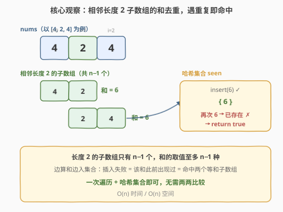
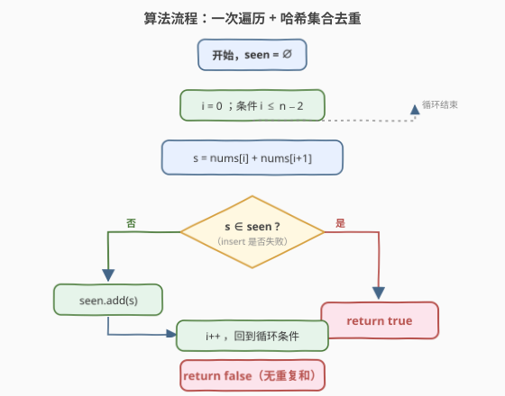
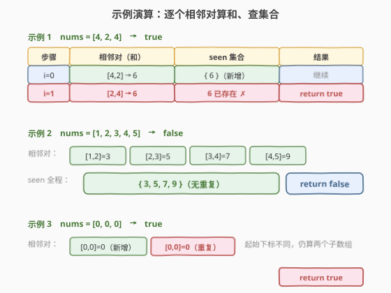

# LeetCode 和相等的子数组 题解

## 1. 题目概述

- **标题 / 题号**：和相等的子数组（#2395，easy）
- **链接**：https://leetcode.cn/problems/find-subarrays-with-equal-sum/
- **难度**：简单
- **标签**：数组、哈希表

**题意**：给你一个下标从 **0** 开始的整数数组 `nums`，判断是否存在 **两个** 长度为 `2` 的子数组且它们的 **和** 相等。注意，这两个子数组起始位置的下标必须 **不相同**。

如果这样的子数组存在，返回 `true`，否则返回 `false`。

> 💡 **一句话题意**：扫一遍所有相邻两元素之和，看是否有两个和相等（起始下标不同即可，元素值是否相同无所谓）。

**示例 1**：

```text
输入：nums = [4,2,4]
输出：true
解释：元素为 [4,2] 和 [2,4] 的子数组有相同的和 6。
```

**示例 2**：

```text
输入：nums = [1,2,3,4,5]
输出：false
解释：没有长度为 2 的两个子数组和相等。
```

**示例 3**：

```text
输入：nums = [0,0,0]
输出：true
解释：子数组 [nums[0],nums[1]] 和 [nums[1],nums[2]] 的和相等，都为 0。
注意即使子数组的元素相同，这两个子数组也视为不相同的子数组，因为它们在原数组中的起始位置不同。
```

**约束**：

- $2 \le \text{nums.length} \le 1000$
- $-10^9 \le \text{nums[i]} \le 10^9$

## 2. 解题思路

### 2.1 暴力思路：两两比较相邻对

最直白的做法是：枚举所有长度为 2 的子数组（共 $n-1$ 个，起点 $i \in [0,\, n-2]$），把它们两两配对比较，只要发现一对和相等就返回 `true`。

```python
def findSubarrays(nums):
    n = len(nums)
    for i in range(n - 1):
        for j in range(i + 1, n - 1):
            if nums[i] + nums[i + 1] == nums[j] + nums[j + 1]:
                return True
    return False
```

> ⚠️ 双重循环共 $\frac{(n-1)(n-2)}{2}$ 次比较，$n = 1000$ 时约 $5\times10^5$ 次，能 AC 但完全没必要——因为这本质上是**判断序列里有无重复元素**，一次遍历 + 哈希集合即可降到 $O(n)$。

### 2.2 核心观察：哈希集合查重



把问题换个视角：我们要找的是「**相邻两元素之和**」这个序列里有没有重复值。这等价于经典的**判重**问题，一次遍历 + 哈希集合即可：

- 长度为 2 的子数组只有 $n-1$ 个，和的取值至多 $n-1$ 种。
- 边算和边向集合插入：**插入失败（和已存在）= 命中两个等和子数组** → 立即返回 `true`。
- 全程无插入失败 → 返回 `false`。

> 💡 **关键直觉**：「找两个相等的和」与「集合里出现了重复」是同一件事。集合的 `insert` 返回是否成功正好把「是否已存在」一步给出，连单独 `count` 再 `add` 的两次查询都省了。这与 [1. 两数之和](../0001-0100/1_两数之和.md)「边查表边入表」是同一套哈希去重范式。

> ⚠️ **数据范围坑**：$|\text{nums[i]}| \le 10^9$，两数之和可达 $\pm2\times10^9$。C++ 中 `int` 上限约 $2.147\times10^9$，**恰好能装下但极度危险**（边界值会踩到 UB 线）。稳妥起见用 `long long` 存和；Python 无此问题。

### 2.3 算法流程图



一次遍历的骨架：

1. 初始化空集合 `seen`；
2. 对每个起点 $i \in [0,\, n-2]$，计算 $s = \text{nums}[i] + \text{nums}[i+1]$；
3. 用 `seen.insert(s)` 的返回值判断：插入失败 → 该和已存在 → 返回 `true`；
4. 否则继续；循环走完仍无重复 → 返回 `false`。

### 2.4 示例演算



| 示例 | 相邻对（和） | seen 演进 | 结果 |
|------|-------------|-----------|------|
| `[4,2,4]` | `[4,2]=6`，`[2,4]=6` | `{6}` → 再插 6 失败 | `true` |
| `[1,2,3,4,5]` | `3, 5, 7, 9` | `{3,5,7,9}` 全程无重复 | `false` |
| `[0,0,0]` | `[0,0]=0`，`[0,0]=0` | `{0}` → 再插 0 失败 | `true` |

> 💡 **示例 3 的要点**：两个子数组的元素值相同（都 `[0,0]`），但因为**起始下标不同**（0 与 1），仍视为两个不同子数组——这正是题目要 `i` 不同的含义。集合查重天然满足：第二个 `0` 出现时插入即失败，无需关心它来自哪些元素。

## 3. 参考代码

### C++

```cpp
class Solution {
public:
    bool findSubarrays(vector<int>& nums) {
        int n = nums.size();
        unordered_set<long long> seen;
        for (int i = 0; i + 1 < n; ++i) {
            long long s = (long long)nums[i] + nums[i + 1];
            if (!seen.insert(s).second) return true; // 插入失败 = 已存在
        }
        return false;
    }
};
```

### Python

```python
class Solution:
    def findSubarrays(self, nums: List[int]) -> bool:
        seen = set()
        for a, b in zip(nums, nums[1:]):
            s = a + b
            if s in seen:
                return True
            seen.add(s)
        return False
```

> 💡 C++ 用 `seen.insert(s).second` 一次完成「判存在 + 入集」，省掉 `count` 后再 `insert` 的两步查询。Python 的 `set` 没有等价的「插入返回成功与否」接口，故用 `if s in seen` 先判再 `add`；想一步到位可用 `seen.add(s); ...` 但语义不如先判清晰，此处优先可读性。

## 4. 复杂度分析

| 维度 | 复杂度 | 说明 |
|------|--------|------|
| **时间复杂度** | $O(n)$ | 单次遍历，每个相邻对算和 + 集合插入均摊 $O(1)$ |
| **空间复杂度** | $O(n)$ | 集合至多存 $n-1$ 个和 |
| 对照：暴力两两比较 | $O(n^2)$ / $O(1)$ | $\frac{(n-1)(n-2)}{2}$ 次比较，时间换空间，不推荐 |

> 💡 与暴力 $O(n^2)$ 相比，本解法把「两两比较」化简为「逐个入集判重」——这正是哈希表降低比较类问题复杂度的标准套路（参照 [1. 两数之和](../0001-0100/1_两数之和.md) 把 $O(n^2)$ 降为 $O(n)$）。

## 5. 扩展：子数组长度推广

本题是「长度固定为 2 的等和子数组对」判定。若把长度约束放松，可衍生两类经典题：

- **长度仍固定为 $k$**：把「相邻两元素之和」换成「长度 $k$ 的子数组和」，用前缀和 $O(1)$ 算每个窗口和，再同样哈希集合判重，整体仍 $O(n)$。本题 $k=2$ 的特例甚至不用前缀和，直接两元素相加即可。
- **长度任意、和相等的子数组**：退化为 [523. 连续子数组和](https://leetcode.cn/problems/continuous-subarray-sum/)、[560. 和为 K 的子数组](https://leetcode.cn/problems/subarray-sum-equals-k/) 一族，需用**前缀和 + 哈希表**统计同和（同余）出现次数，复杂度仍 $O(n)$ 但思路从「判重」升级为「计数」。

> 💡 一句话：固定窗口长度 → 滑窗/前缀和算和 + 集合判重；任意窗口长度 → 前缀和 + 哈希计数。本题是这条谱系最简单的起点。

## 6. 面试要点

1. **为什么一次遍历 + 哈希集合就够了？**

   - 题目本质是判断「$n-1$ 个相邻两元素之和」中是否存在重复值。集合天然支持 $O(1)$ 判存在，边算和边入集，遇插入失败即命中，无需两两枚举。

2. **C++ 为什么用 `long long` 存和？**

   - $|\text{nums}[i]| \le 10^9$，两数之和可达 $\pm2\times10^9$。`int` 上限约 $2.147\times10^9$，**恰好能装下正方向**但贴着边界，负方向同理贴着 `INT_MIN`。面试中任何「贴着整数范围」的情形都应主动用更宽类型规避溢出与 UB，这是数据范围敏感题的通用素养。

3. **示例 3 里两个子数组元素完全相同，为什么也算？**

   - 题目只要求**起始下标不同**，不要求元素值不同。`[0,0]`（下标 0,1）与 `[0,0]`（下标 1,2）起始下标分别为 0 与 1，是两个不同子数组。集合判重判的是「和」是否重复出现，与元素是否相同无关，天然兼容此情形。

4. **`seen.insert(s).second` 比先 `count` 再 `insert` 好在哪？**

   - 一次 `insert` 同时完成「判存在」与「入集」，均摊 $O(1)$；先 `count` 再 `insert` 则是两次哈希查询。两者渐进复杂度相同，但常数更优、语义更紧凑（「插入是否成功」即「是否重复」），是 C++ 哈希判重的惯用写法。

5. **若改成「找三个起始下标互不相同的等和长度 2 子数组」呢？**

   - 把集合换成「和 → 出现次数」的哈希表，遍历中累计每个和的出现次数，一旦某个和计数达到 3 即返回 `true`。骨架不变，只是从「判重」升级为「计数阈值判定」，仍 $O(n)$。

> 💡 **一句话总结**：扫一遍相邻两元素之和、用哈希集合判重，遇插入失败即 `true`，全程无重复即 `false`，$O(n)$ 时间 $O(n)$ 空间。

## 同类练习题

| # | 题目 | 与本题的关联 |
|---|------|-------------|
| 1 | [两数之和](https://leetcode.cn/problems/two-sum/)（[题解](../0001-0100/1_两数之和.md)） | 同样是「一次遍历 + 哈希表边查边入」，把 $O(n^2)$ 两两比较降为 $O(n)$，本题的哈希去重母题 |
| 560 | [和为 K 的子数组](https://leetcode.cn/problems/subarray-sum-equals-k/) | 前缀和 + 哈希计数，任意长度等和子数组的进阶版，从「判重」升级到「计数」 |
| 523 | [连续子数组和](https://leetcode.cn/problems/continuous-subarray-sum/) | 前缀和 + 同余定理判重复，把「和相等」推广到「和模 $k$ 同余」，承接本题判重思想 |
| 219 | [存在重复元素 II](https://leetcode.cn/problems/contains-duplicate-ii/)（[题解](../0201-0300/219_存在重复元素II.md)） | 哈希表记录上次出现下标判「距离 ≤ k 的重复」，与本题「判和是否重复出现」同为哈希查重家族 |
| 217 | [存在重复元素](https://leetcode.cn/problems/contains-duplicate/)（[题解](../0201-0300/217_存在重复元素.md)） | 最纯粹的哈希集合判重，本题的「值判重」退化原型 |
