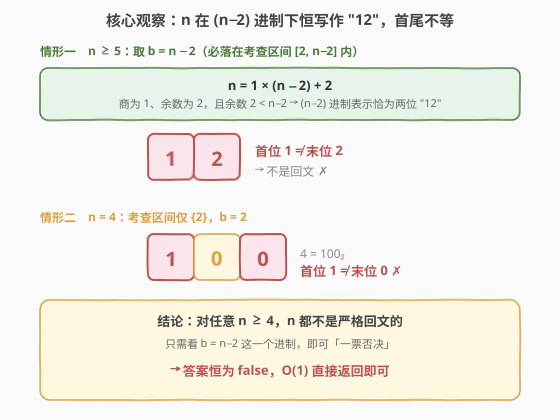
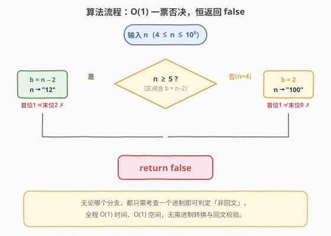
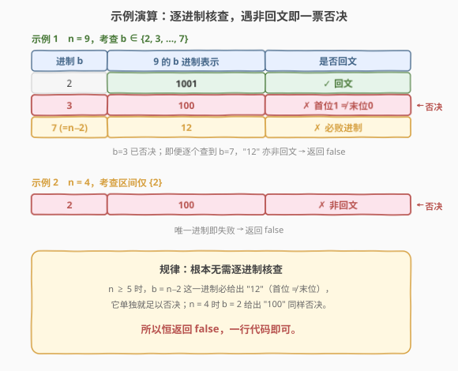

# LeetCode 严格回文的数字 题解

## 1. 题目概述

- **标题 / 题号**：严格回文的数字（#2396，medium）
- **链接**：https://leetcode.cn/problems/strictly-palindromic-number/
- **难度**：中等
- **标签**：数学、脑筋急转弯

**题意**：如果一个整数 `n` 在 `b` 进制下（`b` 取 `2` 到 `n - 2` 之间的**所有**整数）对应的字符串**全部**都是回文的，则称 `n` 是**严格回文**的。给你一个整数 `n`，判断它是否严格回文，是返回 `true`，否则返回 `false`。

> 💡 **一句话题意**：`n` 必须在「从 2 到 n−2 的每一个进制」下都是回文数，才算严格回文——只要有一个进制不回文就 `false`。

**示例 1**：

```text
输入：n = 9
输出：false
解释：
  2 进制：9 = 1001   → 回文 ✓
  3 进制：9 = 100    → 不是回文 ✗（首位 1 ≠ 末位 0）
  故 9 不是严格回文的，返回 false。
  （4~7 进制下 9 同样不回文，无需继续核查。）
```

**示例 2**：

```text
输入：n = 4
输出：false
解释：只需考查 2 进制（区间 [2, n−2] = {2}）：4 = 100，不是回文 → false。
```

**约束**：

- $4 \le n \le 10^5$

## 2. 解题思路

### 2.1 暴力思路：逐进制转换 + 回文校验

最直白的做法是老老实实模拟题意：对每个 $b \in [2,\, n-2]$，把 $n$ 转换成 $b$ 进制字符串，再判断它是否回文；只要遇到一个不回文就立即返回 `false`，全部通过才返回 `true`。

```python
def isStrictlyPalindromic(n):
    for b in range(2, n - 1):          # b ∈ [2, n-2]
        digits = []
        x = n
        while x:
            digits.append(x % b)
            x //= b
        if digits != digits[::-1]:     # 回文判定
            return False
    return True
```

> ⚠️ 代价与进制个数绑定：共有 $n-3$ 个进制要核查，每次转换 + 回文校验是 $O(\log n)$。总体 $O(n \log n)$，$n = 10^5$ 时约百万级操作，**虽不超时但纯属浪费**——因为题目存在一个**对任意 $n$ 都成立**的「一票否决」进制，根本不用逐个试。

### 2.2 核心观察：n 在 (n−2) 进制下恒写作 "12"



突破口在于**固定考查 $b = n - 2$ 这一个进制**（它一定落在题设区间 $[2,\, n-2]$ 内）：

- 对任意 $n \ge 5$：$n = 1 \times (n-2) + 2$，商为 $1$、余数为 $2$。又因为 $n \ge 5 \Rightarrow n-2 \ge 3 > 2$，余数严格小于基数，所以 $n$ 的 $(n-2)$ 进制表示**恰好就是两位数 "12"**。而 "12" 的首位 $1 \ne$ 末位 $2$，**不是回文**。
- 对 $n = 4$：考查区间 $[2,\, n-2] = \{2\}$，只有 $2$ 进制，$4 = 100_2$，首位 $1 \ne$ 末位 $0$，同样**不是回文**。

> 💡 **关键直觉**：一个进制表示是否回文，最先能看出的就是「首尾是否相等」。而在 $b = n-2$ 下表示恒为 "12"，首尾天然不等——这一个进制就足以否决一切 $n \ge 4$。题目要「全部进制都回文」，只要有一个进制不回文就 `false`，于是恒为 `false`。

### 2.3 算法流程图



无需任何转换与校验，按 $n$ 的大小走一条直线即可：

1. 若 $n \ge 5$：取 $b = n - 2$，则 $n$ 写作 "12"，首尾不等 → 非回文；
2. 若 $n = 4$：取 $b = 2$，则 $n$ 写作 "100"，首尾不等 → 非回文；
3. 两条分支都否决 → 返回 `false`。

### 2.4 示例演算



以两个示例验证上述规律：

| $n$ | 考查进制 $b$ | $n$ 的 $b$ 进制 | 回文? | 结论 |
|-----|------------|----------------|-------|------|
| 9 | 2 | 1001 | ✓ | — |
| 9 | 3 | 100 | ✗（首位1≠末位0）| 已否决 → false |
| 9 | 7（=n−2）| 12 | ✗（首位1≠末位2）| 必败进制，单独即可否决 |
| 4 | 2（=n−2）| 100 | ✗（首位1≠末位0）| 否决 → false |

> 💡 **读法**：示例 1 中 $b=3$ 就已否决；退一万步即便 $b=3$ 恰好回文，$b=n-2=7$ 给出的 "12" 仍会否决。示例 2 的唯一进制 $b=2$ 直接给出 "100" 否决。两者殊途同归：`false`。

## 3. 参考代码

### C++

```cpp
class Solution {
public:
    bool isStrictlyPalindromic(int n) {
        return false;
    }
};
```

### Python

```python
class Solution:
    def isStrictlyPalindromic(self, n: int) -> bool:
        return False
```

> ⚠️ **一个易错点**：别被「区间 $[2, n-2]$」吓到去写循环。先想清楚「是否存在一个对全体 $n$ 都否决的进制」——$b=n-2$ 正是这个杀手锏。一旦意识到这点，循环、转换、回文校验全部多余。
>
> 💡 **常数极小**：零次进制转换、零次回文校验，直接返回字面量，真正的 $O(1)$ 时间与 $O(1)$ 空间。

## 4. 复杂度分析

| 维度 | 复杂度 | 说明 |
|------|--------|------|
| **时间复杂度** | $O(1)$ | 不做任何转换/校验，直接返回 `false` |
| **空间复杂度** | $O(1)$ | 不分配任何与 $n$ 相关的空间 |
| 对照：暴力逐进制 | $O(n \log n)$ / $O(\log n)$ | 核查 $n-3$ 个进制，每次转换 + 回文校验 $O(\log n)$ |

> 💡 与暴力 $O(n \log n)$ 相比，本解法把「逐个进制试探」化简为「一个必败进制的数学证明」——这正是「脑筋急转弯」类问题的典型套路：题面伪装成模拟，实则考察对不变量的洞察。

## 5. 扩展：暴力解法（逐进制核查）

若没看出 $b=n-2$ 的把戏，也可写出正确的暴力解（在 $n \le 10^5$ 下可 AC），作为对照：

```cpp
class Solution {
public:
    bool isStrictlyPalindromic(int n) {
        for (int b = 2; b <= n - 2; ++b) {       // 逐进制
            string s;
            for (int x = n; x; x /= b)
                s.push_back("0123456789"[x % b]); // 低位在前
            string r(s.rbegin(), s.rend());
            if (s != r) return false;             // 任一进制非回文即否决
        }
        return true; // 理论可达，但本题永远走不到这里
    }
};
```

> 💡 注意 `return true` 这一行**永远执行不到**——因为对任意 $n \ge 4$，循环里 $b = n-2$ 那一轮必然 `s = "12"`、`r = "21"`，触发 `return false`。暴力解写出来「正确但冗余」，正是它暴露了恒为 `false` 的本质，反过来印证了 $O(1)$ 解法。

## 6. 面试要点

1. **为什么答案恒为 `false`？**

   - 对 $n \ge 5$，考查 $b = n-2$（必在区间 $[2, n-2]$ 内）。$n = 1\cdot(n-2) + 2$，且余数 $2 < n-2$，故 $(n-2)$ 进制表示恰为 "12"，首位 $1 \ne$ 末位 $2$，非回文。对 $n=4$，$b=2$ 给出 "100"，首尾亦不等。故所有 $n \ge 4$ 都非严格回文。

2. **为什么余数 2 一定小于基数 $n-2$？**

   - $n \ge 5 \Rightarrow n-2 \ge 3 > 2$。这正是「$n \ge 5$」与「$n = 4$」要分两条分支讨论的根因：$n=4$ 时 $n-2=2$，余数 $2$ 不小于基数 $2$，"12" 的推导失效，需单独用 $b=2$ 的 "100" 否决。

3. **「严格回文」与「回文数」的区别？**

   - 普通回文数只要求**某一**进制下回文（通常指十进制）；严格回文要求 $2$ 到 $n-2$ **每一个**进制都回文。条件极苛刻，以至于**没有任何 $n \ge 4$ 能满足**——这正是题目作为「脑筋急转弯」的趣味所在。

4. **为什么 $b$ 的上界是 $n-2$ 而非 $n-1$ 或 $n$？**

   - 在 $b \ge n$ 时 $n$ 本身就是一位数，恒回文（无意义）；$b = n-1$ 时 $n = 11_{n-1}$ 也是回文。题目故意把上界定在 $n-2$，正好让 $b=n-2$ 这一非回文进制进入考查范围，使「恒 false」成立。

5. **这类「恒定答案」题如何快速识别？**

   - 特征：题面看似要模拟大量情况，但约束范围里藏着一个对所有输入都成立的不变量。遇到「在某个区间内**全部**满足某条件才为真」的判定，先找一个能**一票否决**的极端情形（此处即区间的上界 $b=n-2$），往往一行就能出答案。

> 💡 **一句话总结**：固定看 $b = n-2$ 这一个进制——$n$ 在其下恒写作 "12"，首尾不等即非回文；$n=4$ 时 $b=2$ 给出 "100" 同样非回文。故恒返回 `false`，$O(1)$ 一行解决。

## 同类练习题

| # | 题目 | 与本题的关联 |
|---|------|-------------|
| 292 | [Nim 游戏](https://leetcode.cn/problems/nim-game/)（[题解](../0201-0300/292_Nim游戏.md)） | 必胜当且仅当 $n \bmod 4 \ne 0$，同为「看似要模拟博弈、实则 $O(1)$ 一行」的脑筋急转弯 |
| 877 | [石子游戏](https://leetcode.cn/problems/stone-game/)（[题解](../0801-0900/877_石子游戏.md)） | 先手在最优策略下恒胜，直接返回 `true`，同为博弈型「恒定答案」trick |
| 258 | [各位相加](https://leetcode.cn/problems/add-digits/)（[题解](../0201-0300/258_各位相加.md)） | 数根 $= 1 + (n-1) \bmod 9$，数学化简后 $O(1)$ 返回，对照本题「循环化为一行」 |
| 29 | [两数相除](https://leetcode.cn/problems/divide-two-integers/)（[题解](../0001-0100/29_两数相除.md)） | 用位运算与进制思想把减法加速，承接本题对「进制/位运算」的洞察，只是把 $O(1)$ 换成了 $O(\log n)$ |
