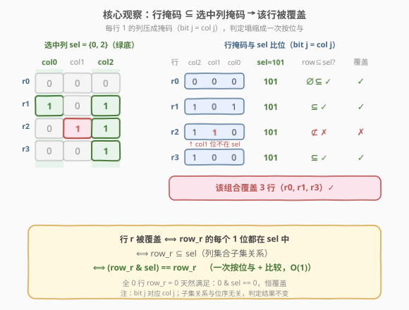
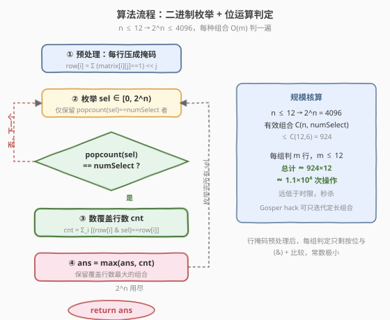

# 被列覆盖的最多行数

- **题目名称**：被列覆盖的最多行数
- **链接**：[2397. 被列覆盖的最多行数](https://leetcode.cn/problems/maximum-rows-covered-by-columns/)
- **难度**：中等
- **标签**：位运算、二进制枚举、数组、矩阵

## 1. 题目概述

给定下标从 **0** 开始、大小为 $m \times n$ 的二进制矩阵 `matrix` 和整数 `numSelect`。你需要从 $n$ 列中选出**恰好** `numSelect` 个**不同**的列，记选中的列集合为 $s$。

若矩阵某行满足下述任一条件，则称该行被 $s$ **覆盖**：

- 行中每个值为 `1` 的单元格，其所在列都在 $s$ 中；或
- 该行**不存在**值为 `1` 的单元格（即全 0 行）。

目标：选出 `numSelect` 列，使被覆盖的**行数最大化**，返回这个最大行数。

**示例 1**：

```text
输入：matrix = [[0,0,0],[1,0,1],[0,1,1],[0,0,1]], numSelect = 2
输出：3
解释：选 s = {0, 2}：
- 第 0 行全 0 → 覆盖；
- 第 1 行的 1 在列 0、2，均在 s 中 → 覆盖；
- 第 2 行的 1 在列 1，不在 s 中 → 不覆盖；
- 第 3 行的 1 在列 2，在 s 中 → 覆盖。
共覆盖 3 行。选 s = {1, 2} 同样覆盖 3 行，已是最优。
```

**示例 2**：

```text
输入：matrix = [[1],[0]], numSelect = 1
输出：2
解释：只有 1 列，必选它，两行都被覆盖。
```

**约束条件**：

- $m = \text{matrix.length}$，$n = \text{matrix}[i].\text{length}$
- $1 \le m, n \le 12$
- $\text{matrix}[i][j]$ 取值 $0$ 或 $1$
- $1 \le \text{numSelect} \le n$

> 💡 **一句话题意**：从 $n$ 列里选 `numSelect` 列，使得「1 全落在选中列里」的行尽量多。**关键参数**是 $n \le 12$——列数极小，直接枚举所有选列组合即可，瓶颈在「每种组合如何快速数覆盖行数」。

---

## 2. 解题思路

### 2.1 暴力思路：枚举列组合 + 逐单元格判定

最直白的做法是**忠实枚举所有「选 `numSelect` 列」的组合**：对每种组合 $s$，逐行扫描判定是否被覆盖——把该行所有 `1` 的列号取出来，检查它们是否都在 $s$ 中。$n \le 12$，组合数 $\binom{n}{\text{numSelect}} \le \binom{12}{6} = 924$ 种，规模完全可行。

```python
def maximumRows(matrix, numSelect):
    m, n = len(matrix), len(matrix[0])
    # 行的 1 所在列号列表
    ones = [[j for j in range(n) if matrix[i][j]] for i in range(m)]
    ans = 0
    for sel in combinations(range(n), numSelect):
        s = set(sel)
        cnt = sum(all(j in s for j in ones[i]) for i in range(m))  # 全 0 行 all([])==True
        ans = max(ans, cnt)
    return ans
```

> ⚠️ 上述写法正确但判定偏「重」：每种组合对每行都要做「列号集合包含判定」，最坏 $O(m\cdot n)$。$m,n\le 12$ 时这只是常数差异，但若把规模放大就不优雅。突破口在于：**「该行的 1 全落在选中列里」本质是一个集合「子集」关系，可用一次位运算塌缩判定**。

### 2.2 核心观察：行掩码 ⊆ 选中列掩码



把每一行的 `1` 列压成一个**位掩码** `row[i]`（约定 **bit j 对应 col j**，即第 $j$ 列为 1 时置上 $2^j$ 这一位）。同样把选中的列集合压成掩码 `sel`。于是：

$$
\text{行 } i \text{ 被覆盖} \iff \text{row}[i] \text{ 的每个 1 位都在 sel 中} \iff \text{row}[i] \subseteq \text{sel}
$$

而「子集」关系在位运算里有一条 $O(1)$ 的等价判定：

$$
\text{row}[i] \subseteq \text{sel} \iff (\text{row}[i]\ \&\ \text{sel}) == \text{row}[i]
$$

> 💡 **为什么？** 按位与 `row & sel` 会保留「两者都为 1」的位。若结果仍等于 `row`，说明 `row` 的每个 1 位在 `sel` 里也都是 1——即 `row` 是 `sel` 的子集。全 0 行 `row=0` 天然满足：`0 & sel == 0`，恒覆盖，与题意「无 1 即覆盖」一致。

如此，每种组合的判定从「逐列集合包含」塌缩成对每行做**一次按位与 + 一次比较**，常数极小。

### 2.3 算法流程图



两阶段：

1. **预处理**：遍历矩阵，把每行压成掩码 `row[i]`，$O(mn)$；
2. **枚举**：遍历 `sel` 从 $0$ 到 $2^n-1$，仅保留 $\text{popcount}(\text{sel}) = \text{numSelect}$ 者；
   - 对每个合法 `sel`，数覆盖行数 `cnt = Σ_i [(row[i] & sel) == row[i]]`；
   - 更新 `ans = max(ans, cnt)`；
3. 返回 `ans`。

枚举域 $2^n \le 4096$，其中合法组合至多 $\binom{12}{6}=924$ 种，每种判 $m\le 12$ 行，总计约 $1.1\times 10^4$ 次操作，远低于时限。

### 2.4 示例演算

![示例演算：matrix=[[0,0,0],[1,0,1],[0,1,1],[0,0,1]], numSelect=2](../images/2397_example_walkthrough.svg)

以示例 1 为例。先预处理行掩码（bit j = col j）：

| 行 | 取值 | 1 所在列 | 掩码 `row[i]`（col2 col1 col0） |
|----|------|----------|-------------------------------|
| r0 | `[0,0,0]` | ∅ | `000` = 0 |
| r1 | `[1,0,1]` | {0,2} | `101` = 5 |
| r2 | `[0,1,1]` | {1,2} | `110` = 6 |
| r3 | `[0,0,1]` | {2} | `100` = 4 |

$n=3$，$\binom{3}{2}=3$ 种组合，逐一枚举：

| 组合 `sel` | r0 | r1 | r2 | r3 | 覆盖数 `cnt` |
|-----------|----|----|----|----|--------------|
| {0,1} = `011` = 3 | `0&3=0`✓ | `5&3=1`≠5 ✗ | `6&3=2`≠6 ✗ | `4&3=0`≠4 ✗ | 1 |
| {0,2} = `101` = 5 | `0&5=0`✓ | `5&5=5`=5 ✓ | `6&5=4`≠6 ✗ | `4&5=4`=4 ✓ | **3** |
| {1,2} = `110` = 6 | `0&6=0`✓ | `5&6=4`≠5 ✗ | `6&6=6`=6 ✓ | `4&6=4`=4 ✓ | **3** |

`ans = max(1, 3, 3) = 3`。两种组合 {0,2}、{1,2} 并列最优，均覆盖 3 行 ✓。

> 💡 **读法**：`{0,1}` 只覆盖 1 行——因为 r1/r2/r3 的 1 都涉及 col2，而 col2 未选；后两组各「放过」一行（{0,2} 放过 r2，{1,2} 放过 r1），都能凑到 3 行。这说明最优组合未必唯一，但枚举全空间必能取到最大值。

---

## 3. 参考代码

### C++

```cpp
class Solution {
public:
    int maximumRows(vector<vector<int>>& matrix, int numSelect) {
        int m = matrix.size(), n = matrix[0].size();
        vector<int> row(m, 0);
        for (int i = 0; i < m; ++i)
            for (int j = 0; j < n; ++j)
                if (matrix[i][j]) row[i] |= 1 << j;       // bit j 对应 col j

        int ans = 0;
        for (int sel = 0; sel < (1 << n); ++sel) {
            if (__builtin_popcount(sel) != numSelect) continue;   // 只要定长组合
            int cnt = 0;
            for (int i = 0; i < m; ++i)
                if ((row[i] & sel) == row[i]) ++cnt;              // row ⊆ sel
            ans = max(ans, cnt);
        }
        return ans;
    }
};
```

> 💡 `__builtin_popcount` 统计掩码中 1 的个数，用来过滤出恰好 `numSelect` 列的组合。判定只需 `row[i] & sel == row[i]` 一行——子集关系的位运算等价。全 0 行 `row[i]=0` 自动满足，无需特判。

### Python

```python
class Solution:
    def maximumRows(self, matrix: List[List[int]], numSelect: int) -> int:
        m, n = len(matrix), len(matrix[0])
        row = [0] * m
        for i in range(m):
            for j in range(n):
                if matrix[i][j]:
                    row[i] |= 1 << j

        ans = 0
        for sel in range(1 << n):
            if sel.bit_count() != numSelect:
                continue
            cnt = sum((row[i] & sel) == row[i] for i in range(m))
            ans = max(ans, cnt)
        return ans
```

> 💡 `int.bit_count()`（Python 3.10+）等价于 `bin(sel).count('1')`，但更快。生成器表达式把「计数覆盖行」压成一句。整体 $O(2^n \cdot m)$，$n\le 12$ 时瞬时跑完。

---

## 4. 复杂度分析

| 维度 | 复杂度 | 说明 |
|------|--------|------|
| **时间复杂度** | $O(2^n \cdot m)$ | 预处理 $O(mn)$；枚举 $2^n$ 个掩码，每个做 popcount（$O(1)$）+ 对 $m$ 行各一次按位与比较 |
| **空间复杂度** | $O(m)$ | 存 $m$ 个行掩码；若不计输入与掩码，可逐行即时判定压到 $O(1)$ 额外 |
| 有效枚举量 | $\le \binom{12}{6}=924$ | 仅 popcount==numSelect 的组合才进入判定，最坏组合数远小于 $2^n$ |

> 💡 与「逐单元格集合判定」的 $O\!\left(\binom{n}{k}\cdot m\cdot n\right)$ 相比，本解法把每行判定从「扫描该行所有 1 列」降为「一次按位与 + 比较」——常数从 $O(n)$ 降到 $O(1)$。$n\le 12$ 时这是锦上添花，但当 $n$ 放大（如竞赛中的同型变体 $n\le 20$）时，掩码判定的优势会被枚举量的指数增长所掩盖，届时需转而考虑状态压缩 DP 或贪心剪枝。

---

## 5. 扩展：Gosper's hack 只枚举定长组合

主解法遍历了全部 $2^n$ 个掩码再用 popcount 过滤，合法组合占比 $\binom{n}{k}/2^n$ 可能不高。若想**只遍历恰好 $k$ 个 1 的掩码**，可用 **Gosper's hack**（位运算生成「下一个同 popcount 的掩码」）：

```cpp
int k = numSelect;
for (int sel = (1 << k) - 1; sel < (1 << n); ) {
    // 处理 sel（恰好 k 个 1）
    int cnt = 0;
    for (int i = 0; i < m; ++i)
        if ((row[i] & sel) == row[i]) ++cnt;
    ans = max(ans, cnt);

    // 推进到下一个恰好 k 个 1 的掩码
    int c = sel & -sel;
    int r = sel + c;
    sel = (((r ^ sel) >> 2) / c) | r;
}
```

> 💡 **原理**：`c = sel & -sel` 取最低位的 1；`r = sel + c` 让该位「进位」向左爬一格；`(r ^ sel) >> 2 / c` 把被打散的低位 1 重新压回最右端，拼接进 `r`。如此按字典序遍历所有恰好 $k$ 个 1 的掩码，恰好 $\binom{n}{k}$ 次。Python 可用 `itertools.combinations(range(n), k)` 达到同样效果，语义更直白。

### 5.1 回溯写法

若更习惯递归，也可用回溯枚举列组合，选满 `numSelect` 个即判定一次——逻辑等价，只是把「二进制枚举」换成「显式 DFS」。在 $n\le 12$ 下两者性能无差别，二进制枚举写起来更短、常数更小。

---

## 6. 面试要点

1. **为什么能直接枚举所有列组合？**

   > 关键约束是 $n \le 12$，$2^n \le 4096$、合法组合 $\le \binom{12}{6}=924$，再加 $m\le 12$ 的行判定，总量约 $10^4$，远低于时限。题目把「列」维度的规模压到极小，正是暗示在「列」上做指数枚举。看到 $n \le 20$ 以内的规模，第一反应就该是二进制枚举 / 状压。

2. **「行被覆盖」的判定为什么能塌缩成一次按位与？**

   > 行被覆盖 ⟺ 行的每个 1 列都在选中列集合里 ⟺ 行掩码是选中列掩码的子集 ⟺ `(row & sel) == row`。按位与只保留两者都为 1 的位；结果仍等于 `row`，说明 `row` 的每个 1 位在 `sel` 里也都是 1。全 0 行 `row=0` 满足 `0 & sel == 0`，天然覆盖，与题意一致，无需特判。

3. **bit j 对应 col j 的位序约定影响结果吗？**

   > 不影响。子集关系 `(row & sel) == row` 对「列 ↔ 位」的映射是**置换不变**的——只要 `row` 和 `sel` 用同一套映射，哪些列映射到哪些位都改变不了「每行的 1 是否都在选中列里」这一布尔结果。所以代码里取 `bit j = col j`（第 $j$ 列置 $2^j$）只是约定俗成，取反序映射也正确。涉及「数值大小」的进阶技巧（如 Gosper's hack、状压 DP 转移）才需要固定位序。

4. **若 $n$ 放大到 20、30，本解法还可行吗？**

   > 不可行。$2^{20}\approx 10^6$ 尚可硬撑，$2^{30}$ 就完全不可行。「在 $n$ 列中选 $k$ 列覆盖最多行」本质是集合覆盖的变体，是 NP-hard。$n$ 变大后只能转而求近似——如按「列的覆盖贡献」贪心、或状压 DP 按子集转移、或整数规划。本题 $n\le 12$ 是刻意留出的「可枚举甜区」。

5. **全 0 行为什么恒覆盖，需要单独处理吗？**

   > 不需要。全 0 行没有值为 1 的单元格，按题意直接算覆盖；在掩码判定里 `row=0`，`0 & sel == 0` 恒成立，自动计入。这正是把判定塌缩成位运算的一个额外好处——边界情形被公式自然吸收，代码无需分支。

> 💡 **一句话总结**：$n\le 12$ 暗示在列维做二进制枚举；先把每行压成掩码，再把「行被覆盖」塌缩为 `row ⊆ sel` 即 `(row & sel) == row`，每种组合 $O(m)$ 判一遍取最大，整体 $O(2^n \cdot m)$ 秒杀。

---

## 7. 同类练习题

- [78. 子集](https://leetcode.cn/problems/subsets/)：二进制枚举所有子集的母题——`i` 从 $0$ 到 $2^n-1$，每位决定取/不取，是本题枚举框架的最简退化
- [1601. 最多可达成的换楼请求数](https://leetcode.cn/problems/maximum-number-of-achievable-transfer-requests/)：枚举 $2^n$ 种请求子集，统计每栋楼净流入为 0 即合法、取请求数最大——与本题同为「$2^n$ 子集枚举 + 计数 + 取最值」招牌题
- [2317. 操作后的最大异或和](https://leetcode.cn/problems/maximum-xor-after-operations/)（[题解](./2317_操作后的最大异或和.md)）：按位独立 + 位运算化简，对照本题「把判定塌缩成一次位运算」的思维
- [526. 优美的排列](https://leetcode.cn/problems/beautiful-arrangement/)（[题解](../0501-0600/526_优美的排列.md)）：状压 DP 以 bitmask 记已用集合，对照本题「bitmask 表示列集合」的枚举视角（一者枚举全集、一者 DP 转移）
- [1774. 最接近目标价格的甜点成本](https://leetcode.cn/problems/closest-dessert-cost/)：枚举两堆配料的组合取最接近目标价——同属「枚举组合 + 逐项判定 + 取最优」家族，规模小到可直接搜
