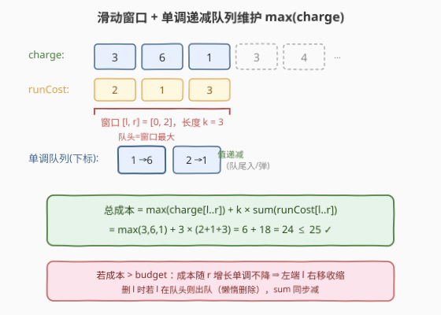
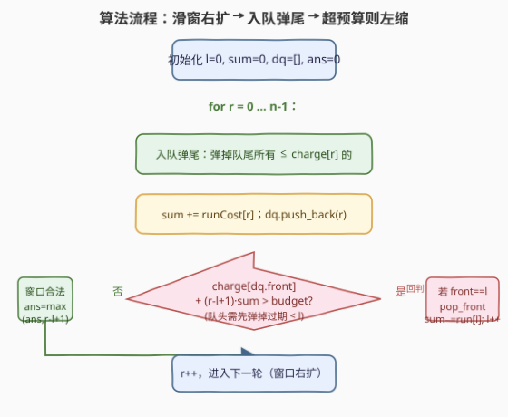
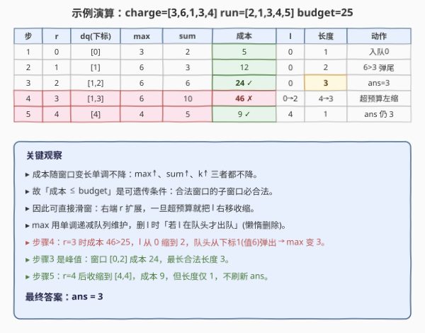

# 预算内的最多机器人数目

- **题目名称**：预算内的最多机器人数目
- **链接**：[2398. 预算内的最多机器人数目](https://leetcode.cn/problems/maximum-number-of-robots-within-budget/)
- **难度**：困难
- **标签**：数组、滑动窗口、单调队列、单调性优化

## 1. 题目概述

你有 `n` 个机器人，给定两个长度均为 `n` 的 0 下标整数数组 `chargeTimes` 和 `runningCosts`。第 `i` 个机器人充电需 `chargeTimes[i]`、运行需 `runningCosts[i]`。再给定整数 `budget`。

运行 **`k` 个连续机器人** 的总成本为：

$$\text{cost} = \max(\textit{chargeTimes}[l..r]) + k \cdot \sum(\textit{runningCosts}[l..r])$$

其中 $k = r - l + 1$。返回**在不超过 `budget` 的前提下，能运行的最多连续机器人数目**。若没有任何一个机器人能运行则返回 `0`。

**示例 1**：

```text
输入：chargeTimes = [3,6,1,3,4], runningCosts = [2,1,3,4,5], budget = 25
输出：3
解释：取前 3 个机器人 [3,6,1]，cost = max(3,6,1) + 3×(2+1+3) = 6 + 18 = 24 ≤ 25。
     不可能运行 4 个连续机器人，故返回 3。
```

**示例 2**：

```text
输入：chargeTimes = [11,12,19], runningCosts = [10,8,7], budget = 19
输出：0
解释：单个机器人最小成本 11+10=21 > 19，无解，返回 0。
```

**约束条件**：

- `chargeTimes.length == runningCosts.length == n`
- $1 \le n \le 5 \times 10^4$
- $1 \le \textit{chargeTimes}[i], \textit{runningCosts}[i] \le 10^5$
- $1 \le \textit{budget} \le 10^{15}$

> 💡 本题是 [239. 滑动窗口最大值](../0201-0300/239_滑动窗口最大值.md) 单调队列的进阶应用——把"求窗口最大值"嵌进一个**带预算约束的最长窗口**问题里。难点不在单调队列本身，而在于看出**成本关于窗口扩张是单调不降的**，从而可以套最长子数组的滑窗模板，不必二分。

---

## 2. 解题思路

### 2.1 暴力思路：枚举所有连续段

枚举每对 `(l, r)`，求 `max(chargeTimes[l..r])` 和 `sum(runningCosts[l..r])`，判断成本是否 `≤ budget`，取最长者。

```text
for l in 0..n-1:
    for r in l..n-1:
        cost = max(charge[l..r]) + (r-l+1) * sum(run[l..r])
        if cost <= budget: ans = max(ans, r-l+1)
```

时间复杂度 $O(n^2)$，$n=5\times10^4$ 时约 $2.5\times10^9$，**超时**。且每轮重复求 `max` 与 `sum`，毫无复用。

> ⚠️ 暴力的浪费：相邻窗口共享大量元素，却每轮从头算 `max`/`sum`。`sum` 可用前缀和 $O(1)$ 拿到，但 `max` 仍是瓶颈——这正是单调队列的用武之地。更进一步，若能发现成本的单调性，连"枚举每个右端点再找左端点"都无需二分。

### 2.2 核心观察：成本单调不降 + 单调队列维护 max

**关键观察一（成本单调性）**：固定左端 $l$，随右端 $r$ 增大，成本 $C(l,r)$ 三项**都不降**：

- $\max(\textit{charge}[l..r])$ 不降（区间只增不减，最大值不降）；
- $\sum(\textit{run}[l..r])$ 不降（累加正数）；
- $k = r-l+1$ 递增。

三者相加 $\Rightarrow C(l,r)$ 随 $r$ 单调不降。推论：若 $C(l,r) > \textit{budget}$，则对同一 $l$，所有 $r' \ge r$ 也必然超预算——**右扩到超预算后，只能靠左缩来降成本**。

**关键观察二（可遗传性）**：子窗口成本 $\le$ 父窗口成本（$\max$、$\sum$、$k$ 三项在收缩时都不增），故"成本 $\le$ budget"是**可遗传条件**：合法窗口的任一子窗口必合法。这正是"最长子数组滑窗"适用的前提——**右端不断扩张，左端只在超预算时右移收缩**，窗口长度只增不减地逼近最长合法段。

**关键观察三（max 用单调队列 + 懒惰删除）**：左缩时若恰好删掉的是当前 `max`，需快速得到新区间最大值。用**单调递减队列**存下标，队头即窗口 `max`。删 `l` 时：若 `l` 恰为队头则 `pop_front()`；否则 `l` 早在更大元素入队时被弹尾淘汰，队列不变。此即"懒惰删除"——不在队列中精确查找 `l`，仅在它出现在队头时弹出。



> 💡 与 [239. 滑动窗口最大值](../0201-0300/239_滑动窗口最大值.md) 的区别：239 是**定长**窗口求每个窗口的 max；本题是**变长**窗口，窗口长度由预算约束动态决定，单调队列服务于"快速重算 max"，而窗口长度本身由滑窗逻辑滚动。两者共享同一套单调递减队列骨架。

### 2.3 算法流程图



**完整步骤**：

1. **初始化**：`l = 0`、`sum = 0`、单调队列 `dq`（存下标，对应 `charge` 单调递减）、`ans = 0`。
2. **遍历** `r` **从 0 到 n-1**：
   - **入队弹尾**：`while dq 非空 且 charge[dq.back()] ≤ charge[r]`：`dq.pop_back()`（弹掉不可能再成为 max 的小元素），再 `dq.push_back(r)`。
   - **累加运行成本**：`sum += run[r]`。
   - **超预算则左缩**：`while dq 非空 且 charge[dq.front()] + (r-l+1)*sum > budget`：
     - 若 `dq.front() == l`：`dq.pop_front()`（删掉的恰是当前 max）；
     - `sum -= run[l]`；`l += 1`。
   - **更新答案**：`ans = max(ans, r - l + 1)`。
3. 返回 `ans`。

> ⚠️ 顺序要点：**先入队弹尾 + 累加 sum，再判预算**——保证判预算时 `dq.front()` 已包含 `charge[r]`，`sum` 已含 `run[r]`。左缩循环里，每次重算成本用的 `dq.front()` 与 `sum` 都是收缩后的最新值，故能正确判断"缩到这一步是否已合法"。若 `l` 缩到 `r+1`（窗口空），`dq` 必空、`sum` 归零，循环自然停止，`ans` 计入长度 0 不刷新。

### 2.4 示例演算

以 `chargeTimes = [3,6,1,3,4]`、`runningCosts = [2,1,3,4,5]`、`budget = 25` 为例：



| 步 | r | dq(下标) | max | sum | 成本 | l | 长度 | 动作 |
|----|---|---------|-----|-----|------|---|------|------|
| 1 | 0 | [0] | 3 | 2 | 5 | 0 | 1 | 入队0；ans=1 |
| 2 | 1 | [1] | 6 | 3 | 12 | 0 | 2 | 6>3 弹尾；ans=2 |
| 3 | 2 | [1,2] | 6 | 6 | 24 ✓ | 0 | **3** | 1<6 入队；ans=3（峰值）|
| 4 | 3 | [1,3]→[3] | 6→3 | 10→7 | 46 ✗→24 | 0→2 | 4→3 | 超预算左缩2格，队头下标1弹出，max 变 3 |
| 5 | 4 | [4] | 4 | 5 | 9 ✓ | 4 | 1 | 4>3 弹尾；收缩后仅 [4,4]，ans 仍 3 |

第 3 步达峰值：窗口 `[0,2]` 成本 `24 ≤ 25`，长度 3。第 4 步 `r=3` 时成本 `46` 超预算，`l` 从 `0` 缩到 `2`，队头下标 `1`（值 `6`）出队，`max` 由 `6` 变 `3`，成本降回 `24`。第 5 步收缩后窗口仅 `[4,4]`，长度不刷新。最终 `ans = 3`。

> 💡 注意第 4 步左缩的精髓：`l` 从 `0→2` 跨两格，第一格 `l=0`（值 `3`）不在队头（队头是下标 `1`），故**队列不变**只减 `sum`；第二格 `l=1`（值 `6`）恰为队头，弹出后 `max` 才真正下降。这就是"懒惰删除"——不主动搜索被删元素，只在它浮现到队头时一并清掉。每个下标至多入队 1 次、出队 1 次，均摊 $O(n)$。

---

## 3. 参考代码

### C++

```cpp
// 预算内的最多机器人数目.cpp —— 滑窗 + 单调递减队列
// 编译: g++ -O2 -std=c++17 预算内的最多机器人数目.cpp -o robots
#include <vector>
#include <deque>
#include <algorithm>
using namespace std;

class Solution {
  public:
    int maximumRobots(vector<int>& chargeTimes, vector<int>& runningCosts, long long budget) {
        int n = chargeTimes.size();
        int ans = 0, l = 0;
        long long sum = 0;
        deque<int> dq; // 存下标，charge 值单调递减

        for (int r = 0; r < n; ++r) {
            // ① 入队弹尾：弹掉不可能再成为 max 的小元素
            while (!dq.empty() && chargeTimes[dq.back()] <= chargeTimes[r]) {
                dq.pop_back();
            }
            dq.push_back(r);
            sum += runningCosts[r];

            // ② 超预算则左缩：队头若 == l 则出队（懒惰删除）
            while (!dq.empty() &&
                   chargeTimes[dq.front()] + (long long)(r - l + 1) * sum > budget) {
                if (dq.front() == l) dq.pop_front();
                sum -= runningCosts[l];
                ++l;
            }
            // ③ 窗口 [l, r] 已合法
            ans = max(ans, r - l + 1);
        }
        return ans;
    }
};
```

### Python

```python
from collections import deque

class Solution:
    def maximumRobots(self, chargeTimes: list[int], runningCosts: list[int], budget: int) -> int:
        n = len(chargeTimes)
        ans = l = 0
        s = 0
        dq = deque()  # 存下标，charge 值单调递减

        for r in range(n):
            # ① 入队弹尾
            while dq and chargeTimes[dq[-1]] <= chargeTimes[r]:
                dq.pop()
            dq.append(r)
            s += runningCosts[r]

            # ② 超预算则左缩（懒惰删除）
            while dq and chargeTimes[dq[0]] + (r - l + 1) * s > budget:
                if dq[0] == l:
                    dq.popleft()
                s -= runningCosts[l]
                l += 1

            # ③ 窗口 [l, r] 已合法
            ans = max(ans, r - l + 1)
        return ans
```

> 💡 三个易错点：①预算高达 $10^{15}$，成本计算用 `long long`（C++），Python 整数无溢出无需操心；②左缩循环条件里 `(r - l + 1)` 每轮都重算，因为 `l` 在缩；③懒惰删除的判定 `dq.front() == l` 必须用**下标**比，故队列存下标而非值——与 [239](../0201-0300/239_滑动窗口最大值.md) 一脉相承。

---

## 4. 复杂度分析

| 维度 | 复杂度 | 说明 |
|------|--------|------|
| **时间复杂度** | $O(n)$ | `r` 单调右移至多 `n` 步；`l` 单调右移至多 `n` 步；每个下标入队 1 次、出队 1 次（弹尾或队头出队）。三层 `while` 总操作均摊 $O(n)$ |
| **空间复杂度** | $O(n)$ | 单调队列最坏存 `n` 个下标（`charge` 严格递减时） |

> ⚠️ 不要被"嵌套 `while`"误导成 $O(n^2)$。均摊分析：`l` 与 `r` 各只增不减，跨整趟至多各走 `n` 步；队列入队 `n` 次、出队总和 $\le n$ 次。故总操作 $O(n)$，与所有单调结构一致。budget 高达 $10^{15}$ 但不影响复杂度——它只决定窗口收缩的迟早，不改变均摊步数。

---

## 5. 扩展：二分答案解法与对比

### 5.1 二分答案 + 单调队列验证

若一时没想到成本单调性，也可**二分长度 `k`**：对固定 `k`，用单调队列在 $O(n)$ 内判断是否存在长 `k` 的窗口成本 $\le$ budget，再二分 `k`。

```python
def check(k, charge, run, budget):
    dq = deque()
    s = 0
    for r in range(len(charge)):
        while dq and charge[dq[-1]] <= charge[r]:
            dq.pop()
        dq.append(r)
        s += run[r]
        if r >= k:                       # 窗口长度恒为 k
            if dq[0] == r - k:
                dq.popleft()
            s -= run[r - k]
        if r >= k - 1:                   # 窗口已满 k
            if charge[dq[0]] + k * s <= budget:
                return True
    return False
# 外层：二分 k ∈ [0, n]，总 O(n log n)
```

### 5.2 两种解法对比

| 解法 | 时间 | 空间 | 何时占优 |
|------|------|------|---------|
| **滑窗 + 单调队列**（主解） | $O(n)$ | $O(n)$ | 利用成本单调性，最优 |
| 二分 `k` + 单调队列 | $O(n \log n)$ | $O(n)$ | 条件非可遗传（如"恰好"型约束）时滑窗失效，二分更稳 |

> 💡 判别口诀：若所求为"**最长**子数组"且约束条件**可遗传**（合法窗口的子窗口必合法）→ 直接滑窗 $O(n)$；若约束不可遗传（如"恰好等于 K"、"至多 K 类"等需计数边界）→ 考虑二分答案或"至多 K − 至多 K−1"转化。本题成本约束天然可遗传，故滑窗胜出，与 [209. 长度最小的子数组](../0201-0300/209_长度最小的子数组.md)（正数单调、求最短）属同一可遗传家族的正反两面。

---

## 6. 面试要点

1. **为什么能直接滑窗，不必二分长度？**

   - 成本 $C(l,r)$ 随窗口扩张单调不降（`max`↑、`sum`↑、`k`↑），"成本 ≤ budget" 是**可遗传条件**：合法窗口的子窗口必合法。
   - 可遗传 ⟹ 最长子数组可用"右扩左缩"滑窗直接求，无需对长度二分。二分解法 $O(n\log n)$ 是"没想到单调性"时的保底，能过但非最优。

2. **单调队列为什么存下标而非值？左缩时如何删除离开窗口的元素？**

   - 存下标才能判断"被删的 `l` 是否就是当前队头 `max`"。存值算不出位置关系。
   - **懒惰删除**：左缩删 `l` 时，仅在 `dq.front() == l` 才 `pop_front()`；若 `l` 不在队头，说明它早在更大元素入队时被弹尾淘汰，队列自然不含它，无需额外操作。这避免在队列中线性查找 `l`，保住 $O(1)$ 均摊。

3. **入队弹尾条件用 `≤` 还是 `<`？顺序能否调换？**

   - 弹尾条件 `charge[dq.back()] ≤ charge[r]`：相等时也弹旧者——旧者先过期，留着只会让队头过期判定多走弯路，`≤` 更紧凑。两种都能过。
   - 顺序：**先入队弹尾 + 累加 `sum`，再判预算左缩**。若先判预算，用的是未含 `charge[r]` 的旧 `max`，会把"恰好因 `r` 变大才超预算"误判为合法，逻辑错乱。

4. **预算 $10^{15}$、`charge/run` 至 $10^5$，会溢出吗？**

   - 成本上界：`max ≤ 10^5`、`k ≤ 5×10^4`、`sum ≤ 5×10^4 × 10^5 = 5×10^9`，故 $k\cdot\text{sum} \le 5\times10^4 \times 5\times10^9 = 2.5\times10^{14}$，加 `max` 后 $\approx 2.5\times10^{14}$，逼近 `budget` 上界 $10^{15}$。
   - C++ 必须用 `long long`（`int` 上界 $\approx 2.1\times10^9$ 会溢出）；Python 无需关心。乘法 `(r-l+1)*sum` 两边都先转 `long long` 再乘。

5. **时间复杂度为什么是 $O(n)$ 而非 $O(n^2)$？**

   - 均摊：`r` 与 `l` 各单调右移，跨全程至多各 `n` 步；队列入队 `n` 次、出队（弹尾 + 队头弹出）总和 $\le 2n$ 次。
   - 嵌套 `while` 不代表 $O(n^2)$——关键是每个元素只进出队列各一次，`while` 的总触发次数有上界，与 [239](../0201-0300/239_滑动窗口最大值.md)、[739](../0701-0800/739_每日温度.md) 等所有单调结构同构。

> 💡 **一句话总结**：本题把单调队列（维护窗口 `max`）嵌进"最长合法子数组"滑窗里——成败关键是先看出**成本随窗口扩张单调不降**（三项皆不降 ⟹ 可遗传），从而省去二分、直接 $O(n)$ 左缩右扩；左缩时用**懒惰删除**（仅 `l` 在队头才出队）让 `max` 维持 $O(1)$ 均摊。它是 [239 单调队列](../0201-0300/239_滑动窗口最大值.md) 从"定长求 max"到"变长带约束求最长"的自然跃迁。

---

## 7. 同类练习题

- [239. 滑动窗口最大值](https://leetcode.cn/problems/sliding-window-maximum/)（题解）：单调递减队列母题，维护窗口 max 的骨架直接复用
- [1438. 绝对差不超过限制的最长连续子数组](https://leetcode.cn/problems/longest-continuous-subarray-with-absolute-diff-less-than-or-equal-to-limit/)：双单调队列（max+min）+ 滑窗求最长，结构高度相似
- [209. 长度最小的子数组](https://leetcode.cn/problems/minimum-size-subarray-sum/)（题解）：正数单调性 + 滑窗求最短，与本题求最长同属可遗传条件滑窗家族
- [862. 和至少为 K 的最短子数组](https://leetcode.cn/problems/shortest-subarray-with-sum-at-least-k/)：前缀和 + 单调队列，单调队列更进阶的用法
- [410. 分割数组的最大值](https://leetcode.cn/problems/split-array-largest-sum/)（题解）：二分答案 + 贪心验证，本题二分解法的对照练习
