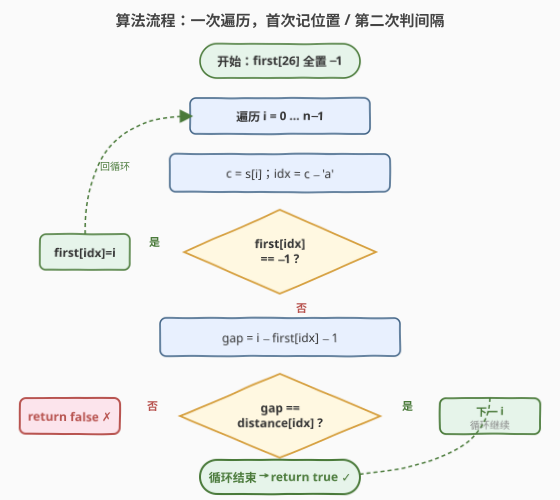
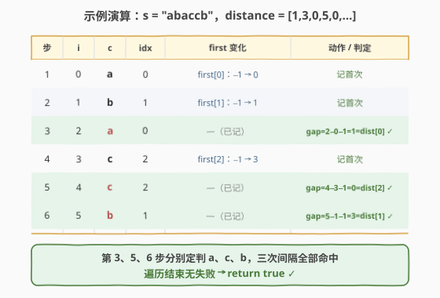

# 检查相同字母间的距离

- **题目名称**：检查相同字母间的距离
- **链接**：[2399. 检查相同字母间的距离](https://leetcode.cn/problems/check-distances-between-same-letters/)
- **难度**：简单
- **标签**：数组、哈希表、字符串

## 1. 题目概述

给定下标从 `0` 开始的字符串 `s`（仅小写字母），**每个字母恰好出现两次**。再给长度为 `26` 的数组 `distance`：字母表中第 `i` 个字母两次出现**之间夹的字母数**应为 `distance[i]`。若第 `i` 个字母未在 `s` 中出现，`distance[i]` 可忽略。若 `s` 是「匀整」字符串返回 `true`，否则 `false`。

**示例 1**：

```text
输入：s = "abaccb", distance = [1,3,0,5,0,0,...,0]
输出：true
解释：
  'a' 出现在下标 0、2，间隔字母数 = 2−0−1 = 1 = distance[0] ✓
  'b' 出现在下标 1、5，间隔字母数 = 5−1−1 = 3 = distance[1] ✓
  'c' 出现在下标 3、4，间隔字母数 = 4−3−1 = 0 = distance[2] ✓
  'd' 未出现，distance[3]=5 忽略。
```

**示例 2**：

```text
输入：s = "aa", distance = [1,0,0,...,0]
输出：false
解释：'a' 出现在下标 0、1，间隔 = 1−0−1 = 0，但 distance[0] = 1，不匹配。
```

**约束条件**：

- $2 \le \text{s.length} \le 52$
- `s` 仅由小写字母组成，每个字母恰好出现两次
- $\text{distance.length} = 26$，$0 \le \text{distance}[i] \le 50$

> 💡 **一句话题意**：对每个出现的字母，验证它两次出现位置 $p < q$ 满足 $q - p - 1 = \text{distance}[\text{该字母序号}]$。题面关键词是「恰好两次」——这让我们只需记**首次位置**，遇第二次即可定终判。

---

## 2. 解题思路

### 2.1 暴力思路：逐字母两遍扫描

对字母表中每个字母 `i`（共 26 个），若它在 `s` 中出现，则从头到尾扫两遍 `s` 找到首次下标 `p` 与第二次下标 `q`，再比 $q - p - 1$ 与 `distance[i]`。

```text
for i in 0..25:
    p = q = -1
    for j in 0..n-1:          # 找首次
        if s[j] == 'a'+i: p = j; break
    if p == -1: continue      # 未出现，跳过
    for j in p+1..n-1:        # 找第二次
        if s[j] == 'a'+i: q = j; break
    if q - p - 1 != distance[i]: return false
return true
```

> ⚠️ 这能过（$n \le 52$ 极小），但每个出现的字母都要**从头扫两遍** `s`，重复劳动：把 $O(n)$ 的工作拆成 $O(26n)$，且两次扫描本可合并——既然遍历 `s` 时按顺序遇到字母，**第一次见就记位置，第二次见就能判**。

### 2.2 核心观察：首次出现位置即全部信息

![核心观察：首次出现位置数组 first[26] + 间隔公式 q−p−1](../images/2399_concept.svg)

「每个字母恰好出现两次」这一约束把状态简化到极致：

- **只需记首次下标**：用长度 26 的数组 `first`（初值 $-1$）。遍历到 `s[i]` 时，若 `first[idx] == -1` 说明首次见，记下 `first[idx] = i`；否则必是第二次见，间隔 $= i - \text{first}[idx] - 1$，直接与 `distance[idx]` 比对。
- **第二次即终判**：因为每字母恰好两次，遇第二次比完即可定该字母结论，无需第三态。遍历结束从未失败 → 全部通过 → `true`。
- **间隔公式**：两次出现下标 $p < q$，中间夹的字母数 $= q - p - 1$（不含两端，恰为下标差减 1）。

> 💡 本质是「首次出现编码」哈希模式：`first[c-'a']` 把字符映射到定长槽位，槽里存的是「关键状态」（首次下标）。这与 [1. 两数之和](../0001-0100/1_两数之和.md)「哈希存已见值、当前元素查配对」、[448. 找到所有数组中消失的数字](../0401-0500/448_找到所有数组中消失的数字.md)「下标当哈希键编码存在性」同属一脉——**用一次遍历 + 一个映射把多遍扫描压成一次**。

### 2.3 算法流程图



**完整步骤**：

1. **初始化**：`first[26]` 全填 $-1$（表示「尚未见过」）。
2. **遍历** `i` **从 0 到 n−1**，`c = s[i]`，`idx = c − 'a'`：
   - 若 `first[idx] == -1`：`first[idx] = i`（记录首次出现）。
   - 否则（第二次出现）：算 `gap = i − first[idx] − 1`；若 `gap ≠ distance[idx]` → 立即 `return false`。
3. 遍历结束无失败 → `return true`。

> ⚠️ **顺序要点**：判定 `first[idx] == -1` 必须在赋值之前——先判再写，否则首次出现也会被当成「第二次」误算 `gap`。间隔公式用下标差减 1（$q - p - 1$），别写成 $q - p$（那会多算一个端点）。

### 2.4 示例演算

以 `s = "abaccb"`、`distance = [1,3,0,5,0,...]` 为例：



| 步 | i | c | idx | first 变化 | 动作 | 判定 |
|----|---|---|-----|-----------|------|------|
| 1 | 0 | a | 0 | first[0]：−1→0 | 记首次 | — |
| 2 | 1 | b | 1 | first[1]：−1→1 | 记首次 | — |
| 3 | 2 | a | 0 | — | gap=2−0−1=1，比 distance[0]=1 | ✓ |
| 4 | 3 | c | 2 | first[2]：−1→3 | 记首次 | — |
| 5 | 4 | c | 2 | — | gap=4−3−1=0，比 distance[2]=0 | ✓ |
| 6 | 5 | b | 1 | — | gap=5−1−1=3，比 distance[1]=3 | ✓ |

第 3、5、6 步分别定判 `a`、`c`、`b`，三次间隔全部命中。遍历结束无失败 → `true`。

> 💡 注意第 3 步：`a` 第二次出现在下标 2，间隔 $2 - 0 - 1 = 1$ 恰为 `distance[0]=1`。下标 0 与下标 2 之间只夹着下标 1 的 `b` 一个字母，故间隔为 1——这正是 $q - p - 1$ 的直观含义。`distance[3]=5` 因 `d` 未出现自始至终无人读取，符合题意「可忽略」。

---

## 3. 参考代码

### C++

```cpp
// 检查相同字母间的距离.cpp —— 首次出现位置数组 + 间隔公式
// 编译: g++ -O2 -std=c++17 检查相同字母间的距离.cpp -o sameletters
#include <vector>
#include <string>
using namespace std;

class Solution {
  public:
    bool checkDistances(string s, vector<int>& distance) {
        int first[26];
        for (int i = 0; i < 26; ++i) first[i] = -1;   // -1 表示尚未见过
        for (int i = 0; i < (int)s.size(); ++i) {
            int idx = s[i] - 'a';
            if (first[idx] == -1) {
                first[idx] = i;                       // 记录首次出现下标
            } else {                                   // 第二次出现：定判
                if (i - first[idx] - 1 != distance[idx])
                    return false;
            }
        }
        return true;                                  // 所有出现字母间隔均匹配
    }
};
```

### Python

```python
class Solution:
    def checkDistances(self, s: str, distance: list[int]) -> bool:
        first = [-1] * 26                  # -1 表示尚未见过
        for i, c in enumerate(s):
            idx = ord(c) - ord('a')
            if first[idx] == -1:
                first[idx] = i             # 记录首次出现下标
            else:                          # 第二次出现：定判
                if i - first[idx] - 1 != distance[idx]:
                    return False
        return True                        # 所有出现字母间隔均匹配
```

> 💡 **两个易错点**：①间隔公式 $i - \text{first}[idx] - 1$（减 1 不含两端），别漏；②首次判定 `first[idx] == -1` 要在赋值之前，以区分「首次/第二次」。用 $-1$ 作哨兵因下标非负，天然区分「未见过」与「下标 0」。

---

## 4. 复杂度分析

| 维度 | 复杂度 | 说明 |
|------|--------|------|
| **时间复杂度** | $O(n)$ | 单次遍历 `s`，每步 $O(1)$ 哈希查写；$n = \text{s.length}$ |
| **空间复杂度** | $O(1)$ | `first` 固定 26 格，与 $n$ 无关（字母集大小为常数） |

> ⚠️ 不要被「字母集 26」误导成 $O(26n)$——我们只遍历 `s` **一次**，26 只决定哈希槽的常数大小。$n \le 52$ 极小，但 $O(n)$ 的思路可平移到任意大小字符集（把数组换成哈希表即可）。

---

## 5. 扩展：暴力逐字母扫描（对照）

若没意识到「一次遍历记首次」的技巧，也可对每个出现的字母独立两遍扫描 `s`（暴力思路 2.1 的实现），在 $n \le 52$ 下同样 AC：

```cpp
class Solution {
public:
    bool checkDistances(string s, vector<int>& distance) {
        int n = s.size();
        for (int ch = 0; ch < 26; ++ch) {
            int p = -1, q = -1;
            for (int i = 0; i < n; ++i)
                if (s[i] - 'a' == ch) { p = i; break; }     // 找首次
            if (p == -1) continue;                            // 未出现，跳过
            for (int i = p + 1; i < n; ++i)
                if (s[i] - 'a' == ch) { q = i; break; }     // 找第二次
            if (q - p - 1 != distance[ch]) return false;
        }
        return true;
    }
};
```

| 解法 | 时间 | 空间 | 何时占优 |
|------|------|------|---------|
| **首次位置数组**（主解） | $O(n)$ | $O(1)$ | 一次遍历，最优 |
| 逐字母两遍扫描 | $O(26 n)$ | $O(1)$ | 思路最直白，常数大但 $n$ 极小时无差异 |

> 💡 判别口诀：凡「配对 / 重复出现」类问题，先想能否用**一次遍历 + 哈希记首次**把多遍扫描压成一遍——这是 [1. 两数之和](../0001-0100/1_两数之和.md)「查配对」与本题「查间隔」共用的骨架。逐字母扫描把 26 当成外层循环是「以字符集驱动」，主解把 `s` 当成外层循环是「以输入驱动」，后者永远更省。

---

## 6. 面试要点

1. **为什么只需记首次出现位置，不必记第二次？**

   - 题设「每字母恰好两次」保证：遍历中第二次出现即终次出现，遇到时 `first[idx]` 已存首次下标，间隔 $= i - \text{first}[idx] - 1$ 当场可算。无需第三态（如「已判过」标记），第二次比完即定该字母结论。

2. **间隔公式为什么是 $q - p - 1$ 而非 $q - p$？**

   - 两次出现下标 $p < q$，**之间**夹的字母不含两端。从 $p$ 到 $q$ 跨 $q - p$ 步，扣去两端各占一步，故中间字母数 $= q - p - 1$。例：`a_b_a` 下标 0 与 2，中间只有下标 1 一个字母，$2 - 0 - 1 = 1$。

3. **为何用 $-1$ 作哨兵？能否用 0？**

   - 下标从 0 起，下标 0 是合法的首次位置（如 `s = "aa"` 中 `a` 首次在 0）。若哨兵用 0 则无法区分「尚未见」与「首次在下标 0」。$-1$ 非下标取值范围，天然区分两者，与 [1. 两数之和](../0001-0100/1_两数之和.md) 用「不在哈希中」判首次同思路。

4. **若字母可能不止出现两次，方案如何调整？**

   - 改 `first` 为「上次出现下标」，并在每字母第二次及以后出现都重算间隔比对（或只关心首末两次）。本题约束把状态简化为「首次 / 第二次」二态，是题面给的免费简化。

5. **时间复杂度是 $O(26n)$ 还是 $O(n)$？**

   - $O(n)$。外层只有一重对 `s` 的循环，每步内层是 $O(1)$ 数组读写。`26` 只是哈希槽的常数大小（空间 $O(1)$），不进时间。若误写成「对 26 字母各扫一遍 `s`」才是 $O(26n)$，那是暴力解法。

> 💡 **一句话总结**：题面「每字母恰好两次」是最大馈赠——用 26 格数组 `first` 记首次下标（$-1$ 哨兵区分未见 / 下标 0），遍历遇第二次即算 $i - \text{first} - 1$ 比对 `distance`。一次遍历 $O(n)$、$O(1)$ 空间，是「哈希记首次 + 输入驱动单遍扫描」骨架的最简练手题。

---

## 7. 同类练习题

- [1. 两数之和](https://leetcode.cn/problems/two-sum/)（[题解](../0001-0100/1_两数之和.md)）：哈希存已见值、当前元素查配对，同属「一次遍历 + 哈希记首次」骨架
- [448. 找到所有数组中消失的数字](https://leetcode.cn/problems/find-all-numbers-disappeared-in-an-array/)（[题解](../0401-0500/448_找到所有数组中消失的数字.md)）：下标当哈希键编码存在性，定长槽位映射的同类思路
- [599. 两个列表的最小索引总和](https://leetcode.cn/problems/minimum-index-sum-of-two-lists/)（[题解](../0501-0600/599_两个列表的最小索引总和.md)）：哈希记录首次下标、遇配对算索引和，与本题「记首次、遇第二次算间隔」同构
- [205. 同构字符串](https://leetcode.cn/problems/isomorphic-strings/)（[题解](../0201-0300/205_同构字符串.md)）：双向哈希双射判定，同属「定长映射 + 单遍扫描」家族
