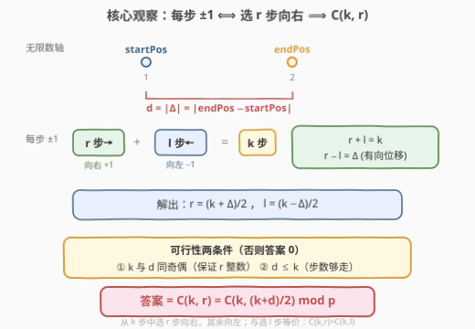
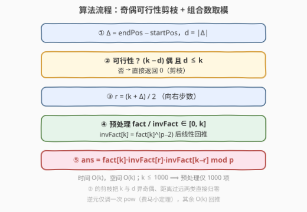
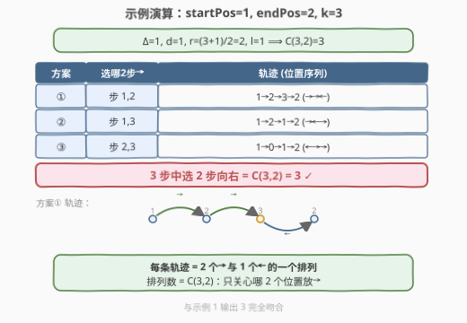

# 恰好移动 k 步到达某一位置的方法数目

- **题目名称**：恰好移动 k 步到达某一位置的方法数目
- **链接**：[2400. 恰好移动 k 步到达某一位置的方法数目](https://leetcode.cn/problems/number-of-ways-to-reach-a-position-after-exactly-k-steps/)
- **难度**：中等
- **标签**：数学、动态规划、组合数学

## 1. 题目概述

给定两个**正**整数 `startPos` 和 `endPos`。最初站在**无限**数轴上位置 `startPos` 处。每步可向左或向右移动一个位置。给定正整数 `k`，返回从 `startPos` 出发、**恰好**移动 `k` 步并到达 `endPos` 的**不同**方法数目。答案对 $10^9+7$ 取余。移动顺序不同即视为不同方法。数轴含负整数。

**示例 1**：

```text
输入：startPos = 1, endPos = 2, k = 3
输出：3
解释：3 种从 1 到 2 且恰好 3 步的方法
  - 1 -> 2 -> 3 -> 2   (→,→,←)
  - 1 -> 2 -> 1 -> 2   (→,←,→)
  - 1 -> 0 -> 1 -> 2   (←,→,→)
```

**示例 2**：

```text
输入：startPos = 2, endPos = 5, k = 10
输出：0
解释：不存在从 2 到 5 且恰好 10 步的方法。
```

**约束条件**：

- $1 \le \text{startPos}, \text{endPos}, k \le 1000$

> 💡 **关键信号**：每步只有 $\pm 1$ 两个选择，且**与具体路径无关**——只关心"几步向右、几步向左"。一旦确定方向步数 $r$（向目标方向）与 $l$（背离方向），满足 $r+l=k$、$r-l=d$（$d=|\text{endPos}-\text{startPos}|$），方案数就是从 $k$ 步中选 $r$ 步走向目标的组合数 $\binom{k}{r}$。这是"路径计数 ⟹ 组合计数"的典型转化。

---

## 2. 解题思路

### 2.1 暴力思路：区间 DP

最直观的做法：令 $dp[i][j]$ 表示走 $i$ 步后位于位置 $j$ 的方法数。由于 $k$ 步内可达位置范围为 $[\text{startPos}-k,\ \text{startPos}+k]$（含负数），把位置整体平移 $k$ 使其落在 $[0,2k]$：

- **初值**：$dp[0][\text{startPos}+k]=1$。
- **转移**：$dp[i][j]=dp[i-1][j-1]+dp[i-1][j+1]$（一步从左右邻位走来）。
- **答案**：$dp[k][\text{endPos}+k]$（下标越界即为 $0$）。

> ⚠️ **复杂度陷阱**：两层循环 $O(k\cdot 2k)=O(k^2)$，$k=1000$ 时约 $2\times10^6$ 次操作，本身不超时，但**状态维度 $(i,j)$ 把本可一步算出的组合数逐格展开**。若 $k$ 放大到 $10^5$ 就会爆掉，而组合数法仍是 $O(k)$。根因是位置维 $j$ 有线性递推的闭式解，无需枚举。

### 2.2 核心观察：±1 步序列 ⟺ 选 r 步向目标 ⟹ $\binom{k}{r}$



**第一步：拆成方向步数。** 设 $d=|\text{endPos}-\text{startPos}|$ 为距离，$\Delta=\text{endPos}-\text{startPos}$ 为有向位移。令 $r$ 为**朝目标方向**的步数（$\Delta>0$ 即向右，$\Delta<0$ 即向左），$l$ 为**背离方向**的步数。则：

$$r+l=k,\qquad r-l=d$$

（净位移在朝目标方向上恰好抵消到 $d$：朝目标走 $r$ 步、背离走 $l$ 步，净推进 $r-l=d$。）

**第二步：解出步数。** 解二元一次方程组：

$$r=\frac{k+d}{2},\qquad l=\frac{k-d}{2}$$

**第三步：可行性两条件。** $r,l$ 必须是非负整数，等价于：

1. **奇偶匹配**：$(k-d)$ 为偶数，即 $k$ 与 $d$ 同奇偶（否则 $r$ 不是整数）。
2. **步数充足**：$d\le k$（否则 $l<0$，走不到）。

任一不满足，答案直接为 $0$（对应示例 2：$d=3$ 奇、$k=10$ 偶，奇偶不匹配）。

**第四步：转化为组合数。** 一旦 $r$ 确定，每条合法路径恰是"$r$ 步朝目标、$l$ 步背离"的一个**排列**。从 $k$ 个位置中选 $r$ 个放"朝目标"步即可，其余自动是"背离"步：

$$\text{ans}=\binom{k}{r}=\binom{k}{\tfrac{k+d}{2}}\bmod (10^9+7)$$

> 💡 **对称性**：$\binom{k}{r}=\binom{k}{l}$，所以"选朝目标步"与"选背离步"等价，公式与 $\Delta$ 的正负无关——只依赖距离 $d$。这正是为什么参数给绝对位置却退化为距离问题。

### 2.3 算法流程图



五步：算距离 $d$ → 奇偶/距离剪枝（不符返回 $0$）→ 定 $r=(k+d)/2$ → 预处理阶乘与逆阶乘 → $\binom{k}{r}=\text{fact}[k]\cdot\text{invFact}[r]\cdot\text{invFact}[k-r]\bmod p$。

> ⚠️ **逆元仅调一次 `pow`**：$\text{invFact}[k]=\text{fact}[k]^{p-2}\bmod p$（费马小定理，$p=10^9+7$ 为素数），之后用 $\text{invFact}[i-1]=\text{invFact}[i]\cdot i\bmod p$ 线性回推，整体 $O(k)$。

### 2.4 示例演算



以示例 1（$\text{startPos}=1,\ \text{endPos}=2,\ k=3$）为例：$d=1$，$(k-d)=2$ 为偶、$d\le k$ ✓，$r=(3+1)/2=2$、$l=1$，答案 $\binom{3}{2}=3$。三条路径正是 $\{→,→,←\}$ 的全部排列：

| 方案 | 选哪 2 步朝目标 | 轨迹 |
|------|---------------|------|
| ① | 步 1,2 | 1→2→3→2 (→→←) |
| ② | 步 1,3 | 1→2→1→2 (→←→) |
| ③ | 步 2,3 | 1→0→1→2 (←→→) |

选 2 步朝目标 = $\binom{3}{2}=3$，与输出吻合。

---

## 3. 参考代码

### C++

```cpp
class Solution {
public:
    int numberOfWays(int startPos, int endPos, int k) {
        const long long MOD = 1e9 + 7;
        int d = abs(endPos - startPos);          // 距离
        // 可行性：k 与 d 同奇偶，且 d <= k
        if ((k - d) % 2 != 0 || d > k) return 0;
        int r = (k + d) / 2;                     // 朝目标方向的步数

        // 预处理阶乘与逆阶乘 [0, k]
        vector<long long> fact(k + 1), invFact(k + 1);
        fact[0] = 1;
        for (int i = 1; i <= k; i++) fact[i] = fact[i - 1] * i % MOD;
        auto powMod = [&](long long a, long long b) {
            long long res = 1; a %= MOD;
            while (b) {
                if (b & 1) res = res * a % MOD;
                a = a * a % MOD;
                b >>= 1;
            }
            return res;
        };
        invFact[k] = powMod(fact[k], MOD - 2);   // 费马小定理求逆
        for (int i = k; i >= 1; i--) invFact[i - 1] = invFact[i] * i % MOD;

        return (int)(fact[k] * invFact[r] % MOD * invFact[k - r] % MOD);
    }
};
```

> 💡 `(k - d) % 2 != 0` 同时拦截"奇偶不匹配"与（结合 `d > k`）"步数不足"两类不可达情形。`r` 取 $(k+d)/2$ 后必落在 $[0,k]$，组合数无需再判越界。

### Python

```python
class Solution:
    def numberOfWays(self, startPos: int, endPos: int, k: int) -> int:
        MOD = 10**9 + 7
        d = abs(endPos - startPos)              # 距离
        # 可行性：k 与 d 同奇偶，且 d <= k
        if (k - d) % 2 != 0 or d > k:
            return 0
        r = (k + d) // 2                         # 朝目标方向的步数

        fact = [1] * (k + 1)
        for i in range(1, k + 1):
            fact[i] = fact[i - 1] * i % MOD
        invFact = [1] * (k + 1)
        invFact[k] = pow(fact[k], MOD - 2, MOD)  # 费马小定理求逆
        for i in range(k, 0, -1):
            invFact[i - 1] = invFact[i] * i % MOD

        return fact[k] * invFact[r] % MOD * invFact[k - r] % MOD
```

> ⚠️ Python 内置三参数 `pow(base, exp, mod)` 比 `**` 后取模快得多（底层用快速幂 + 取模），且 $k\le1000$ 时 `fact[k]` 不溢出，无需大整数兜底。

---

## 4. 复杂度分析

| 维度 | 复杂度 | 说明 |
|------|--------|------|
| **时间复杂度** | $O(k)$ | 阶乘 $O(k)$、一次 `pow` 快速幂 $O(\log p)$、逆阶乘回推 $O(k)$；$p$ 视常数，主导项 $O(k)$ |
| **空间复杂度** | $O(k)$ | `fact` / `invFact` 各 $k+1$ 项 |

> 💡 相比暴力 DP 的 $O(k^2)$，组合数法把位置维 $j$ 的线性递推压成一步闭式，$k=1000$ 时约 $10^3$ 次操作即可。若 $k$ 放大到 $10^6$（无此约束），组合数法仍只需 $O(k)$ 预处理 + $O(1)$ 查询。

---

## 5. 扩展：滚动数组 DP 的通用价值

当数轴上加约束（如某些位置禁止停留、或每步代价不同）时，组合数闭式不再成立，区间 DP 重新成为主力。用**滚动数组**把 $dp[i][\cdot]$ 压成两行即可：

```cpp
vector<int> prev(2 * k + 1, 0), cur(2 * k + 1, 0);
prev[startPos - (startPos - k)] = 1;            // 即 prev[k] = 1（平移后）
for (int i = 1; i <= k; i++) {
    fill(cur.begin(), cur.end(), 0);
    for (int j = 0; j <= 2 * k; j++) {
        if (j > 0)     cur[j] = (cur[j] + prev[j - 1]) % MOD;
        if (j < 2 * k) cur[j] = (cur[j] + prev[j + 1]) % MOD;
    }
    swap(prev, cur);
}
// 答案 = prev[endPos - startPos + k]（需先判 d <= k）
```

空间从 $O(k^2)$ 降到 $O(k)$，时间仍 $O(k^2)$。该模板可平滑迁移到 [2266. 统计打字机按键序列的数目](https://leetcode.cn/problems/count-number-of-texts/)（每步多种推进）、带障碍的网格路径计数等**无法闭式**的场景。组合数法与 DP 的分水岭正是"状态转移是否齐次线性且有闭式解"。

> 💡 另一种等价视角：$dp[i][j]=\binom{i}{(i+j)/2}$（$i,j$ 同奇偶时），即 DP 的闭式恰为本题的组合数。这说明区间 DP 与组合数法**同源**，只是后者预先算了闭式。

---

## 6. 面试要点

1. **为什么只关心方向步数 $r,l$，而不关心具体路径形状？**
   - 每步只有 $\pm1$ 两个选择，"朝目标 / 背离目标"的二分类完全刻画了一步的作用；同方向步之间不可区分，路径唯一由"哪几步朝目标"决定，故方案数 = 排列数 = $\binom{k}{r}$。

2. **可行性两条件的等价含义是什么？**
   - $(k-d)$ 偶 ⟺ $r=(k+d)/2$ 为整数；$d\le k$ ⟺ $l=(k-d)/2\ge0$。两者合起来保证 $r,l\in[0,k]$ 且 $r+l=k$，即存在合法步数分配。缺一则无解返回 $0$。

3. **为什么 $\Delta$ 的正负不影响答案？**
   - 答案 $\binom{k}{r}=\binom{k}{l}$ 依赖 $r=(k+d)/2$，而 $d=|\Delta|$ 与方向无关。"朝目标"在 $\Delta>0$ 时指向右、$\Delta<0$ 时指向左，但"选哪 $r$ 步朝目标"的组合数不变，故绝对位置退化为距离。

4. **模逆为什么用费马小定理而非扩展欧几里得？**
   - 模数 $p=10^9+7$ 是素数，且 $\text{fact}[k]$ 与 $p$ 互素，故 $a^{-1}\equiv a^{p-2}\pmod p$。`pow` 快速幂实现简洁；扩展欧几里得在非素数模或需批量求逆时更优，本题不必。

5. **逆阶乘为何只调一次 `pow` 再线性回推？**
   - 由 $\binom{n}{k}=\frac{n!}{k!(n-k)!}$，逆元需求集中在 $i!$ 的逆。利用 $\text{invFact}[i-1]=\text{invFact}[i]\cdot i\bmod p$（因 $\frac{1}{(i-1)!}=\frac{i}{i!}$），算出最大者 $\text{invFact}[k]$ 后 $O(k)$ 倒推，避免对每个 $i$ 调 `pow`（那会退化到 $O(k\log p)$）。

6. **暴力 DP 何时反而更优？**
   - 当问题带**位置相关约束**（障碍格、禁停位、变步长）时，转移不再是齐次 $\pm1$，组合数闭式失效，DP 仍能逐格推进。本题无此类约束，故组合数法是更优解。

> 💡 **一句话总结**：±1 步路径计数 ⟹ 方向步数 $r+l=k$、$r-l=d$ ⟹ 解出 $r=(k+d)/2$ ⟹ 方案数 $\binom{k}{r}\bmod p$。把"位置维线性递推"压成"一步组合计数"，是本题从 $O(k^2)$ 降到 $O(k)$ 的关键。

---

## 7. 同类练习题

- [62. 不同路径](https://leetcode.cn/problems/unique-paths/)（[题解](../0001-0100/62_不同路径.md)）：网格路径计数 $\binom{m+n}{m}$ 的母题，理解"路径 = 方向步数排列 = 组合数"的基础
- [70. 爬楼梯](https://leetcode.cn/problems/climbing-stairs/)（[题解](../0001-0100/70_爬楼梯.md)）：±1 步序列计数的入门 DP，与本题组合数法互为闭式与递推两面
- [357. 统计各位数字都不同的数字个数](https://leetcode.cn/problems/count-numbers-with-unique-digits/)（[题解](../0301-0400/357_统计各位数字都不同的数字个数.md)）：逐位组合计数 + 模运算，同属"排列/组合数取模"脉络
- [2338. 统计理想数组的数目](https://leetcode.cn/problems/count-the-number-of-ideal-arrays/)（[题解](../2301-2400/2338_统计理想数组的数目.md)）：阶乘 + 费马小定理求逆元 + 隔板法，是本题"组合数取模"工具链的进阶应用
- [1735. 生成乘积数组的方案数](https://leetcode.cn/problems/count-ways-to-make-array-with-product/)（[题解](../1701-1800/1735_生成乘积数组的方案数.md)）：逐质因子隔板法 + 模逆，与 2338/2400 同为组合数学 + 数论取模的姊妹题
