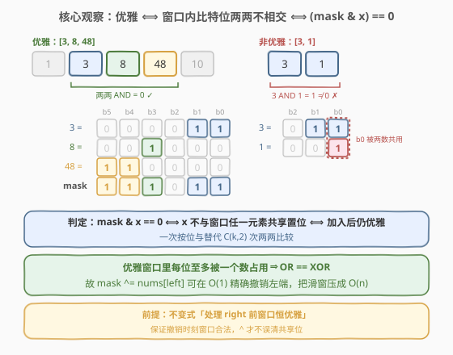
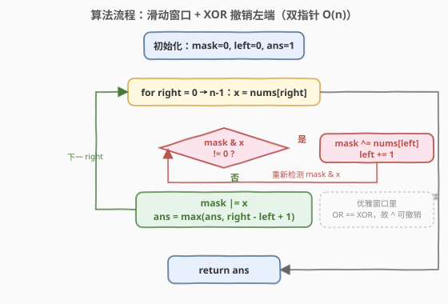

# LeetCode 最长优雅子数组 题解

## 1. 题目概述

- **标题 / 题号**：最长优雅子数组（#2401，medium）
- **链接**：https://leetcode.cn/problems/longest-nice-subarray/
- **难度**：中等
- **标签**：位运算、数组、滑动窗口、双指针

**题意**：给定一个由**正**整数组成的数组 `nums`。如果 `nums` 的某个子数组中位于**不同**位置的每对元素，按位 **与（AND）** 运算结果都等于 `0`，则称该子数组为**优雅**子数组。返回**最长**优雅子数组的长度。

子数组是数组中一个**连续**部分。注意：长度为 `1` 的子数组始终视作优雅子数组。

**示例 1**：

```text
输入：nums = [1,3,8,48,10]
输出：3
解释：最长的优雅子数组是 [3,8,48]：
- 3  AND 8  = 0
- 3  AND 48 = 0
- 8  AND 48 = 0
可以证明不存在更长的优雅子数组，故返回 3。
```

**示例 2**：

```text
输入：nums = [3,1,5,11,13]
输出：1
解释：最长的优雅子数组长度为 1，任何长度为 1 的子数组都满足条件。
```

**约束**：

- $1 \le \text{nums.length} \le 10^5$
- $1 \le \text{nums}[i] \le 10^9$

> ⚠️ 逐对判定 $\binom{k}{2}$ 次 AND 显然过慢。突破口在「位」的层面：两数 AND 为 `0` 当且仅当它们**没有公共的置位**——把每个数看成「占用了一组比特位」，优雅子数组就是「窗口内所有数的占用位两两不相交」。

## 2. 解题思路

### 2.1 暴力思路：枚举子数组 + 增量 OR

最朴素的思路是枚举所有 $O(n^2)$ 个子数组，对每个子数组判定是否优雅。利用「向右扩展一位只需把新元素 OR 进累计掩码」的增量计算，可把单个子数组的判定降到均摊 $O(1)$：

```text
ans = 1
for left in 0..n-1:
    mask = 0
    for right in left..n-1:
        if (mask & nums[right]) != 0: break   // 与窗口某元素冲突，再扩展也无效
        mask |= nums[right]
        ans = max(ans, right - left + 1)
```

> 💡 为什么 `break` 安全？因为窗口扩展只会让 `mask` **置位更多、不会清位**。一旦 `nums[right]` 与当前 `mask` 冲突，再往右加元素也无法消除这个冲突——优雅性是「全员两两不相交」的**单调塌缩**性质：包含冲突对的任何更大子数组都不优雅。

时间 $O(n^2)$（最坏如 `[1,2,4,8,...]` 全不相交，每个 `left` 扫到末尾），$n = 10^5$ 时 $n^2 \approx 10^{10}$ 超时。瓶颈在于 `left` 每次从 `left+1` 重新累计 `mask`，丢弃了右移得到的全部信息。

### 2.2 核心观察：优雅 ⟺ 窗口内位置两两不相交 ⟺ `(mask & x) == 0`



**观察一：两数 AND 为 `0` ⟺ 两数无公共置位。** 把每个数看作「占用了一组比特位」。`a & b == 0` 说明 `a` 与 `b` 占用的位集合**不相交**。于是「优雅子数组」等价于「窗口内所有数的占用位**两两不相交**」，进而等价于「窗口内**每个比特位至多被一个数占用**」。

**观察二：累计 OR 即可代表窗口占用位。** 令 `mask` = 窗口内所有元素的按位或。由于每个位至多被一个数占用，`mask` 恰好是「窗口当前占用的全部位」。判定新元素 `x` 能否加入：

$$
\text{mask} \;\&\; x \;=\; 0 \;\iff\; x \text{ 与窗口内任意元素都不共享置位} \;\iff\; \text{加入后仍优雅}
$$

这正是 2.1 增量判定的依据——`(mask & x) == 0` 一次按位与即可代表 $\binom{k}{2}$ 次两两 AND。

**观察三（提速关键）：优雅窗口里 OR == XOR，故可用 `^` 撤销左端。** 普通滑动窗口的难点是「右移 `left` 时如何从 `mask` 撤销 `nums[left]`」——按位或**只置位不清位**，无法直接减。但优雅窗口有个绝佳性质：**每个位至多被一个数占用**，所以窗口内各数的置位两两不相交，于是

$$
\text{mask} \;=\; \bigvee_{i \in \text{window}} \text{nums}[i] \;=\; \bigoplus_{i \in \text{window}} \text{nums}[i]
$$

即「**OR 等于 XOR**」。不相交集合的并集等于对称差——既然 `nums[left]` 的位在窗口里独一份，用 `mask ^= nums[left]` 就能精确清掉它（等价于 `mask &= ~nums[left]`）。这让 `left` 右移的撤销变成 $O(1)$，无需重扫，从而把 $O(n^2)$ 压成 $O(n)$。

> 💡 **不变式**：每轮处理 `right` 之前，窗口 $[\text{left},\,\text{right}-1]$ **始终保持优雅**。因此 `mask` 始终满足「OR == XOR」，`^` 撤销才合法。窗口的「合法性」与「可撤销性」互为因果。

### 2.3 算法流程图



算法是经典的**双指针滑动窗口**，唯一特殊处是「撤销用 `^` 而非重算」：

1. `right` 每右移一格，取出 `x = nums[right]`。
2. **冲突检测**：若 `(mask & x) != 0`，说明 `x` 与窗口内某元素共享置位。**撤销左端**：`mask ^= nums[left]`，`left += 1`，重复直到 `(mask & x) == 0`。
3. **并入新元素**：`mask |= x`（也可写 `mask ^= x`，因不相交故等价）。
4. **更新答案**：`ans = max(ans, right - left + 1)`。

`left`、`right` 各至多移动 $n$ 次，每次窗口操作 $O(1)$，总 $O(n)$。

### 2.4 示例演算

以 `nums = [1, 3, 8, 48, 10]` 为例（括号内为二进制，观察位的占用与撤销）：

![示例演算：nums=[1,3,8,48,10]](../images/longest_nice_subarray_example_walkthrough.svg)

| 步 | `right` | `x`（二进制） | 冲突检测 `mask & x` | 动作 | 窗口 | `mask` | `ans` |
|----|---------|--------------|---------------------|------|------|--------|-------|
| 0 | 0 | `1`(`00001`) | `0 & 1 = 0` | 并入 | `[1]` | `00001`=1 | 1 |
| 1 | 1 | `3`(`00011`) | `1 & 3 = 1` ✗ | 撤 `1`→left=1；再检测 `0 & 3=0`；并入 | `[3]` | `00011`=3 | 1 |
| 2 | 2 | `8`(`01000`) | `3 & 8 = 0` | 并入 | `[3,8]` | `01011`=11 | 2 |
| 3 | 3 | `48`(`110000`) | `11 & 48 = 0` | 并入 | `[3,8,48]` | `111011`=59 | **3** |
| 4 | 4 | `10`(`001010`) | `59 & 10 = 10` ✗ | 撤 `3`(→56)；检测 `56&10=8`✗；撤 `8`(→48)；检测 `48&10=0`；并入 | `[48,10]` | `111010`=58 | 3 |

最长优雅子数组 `[3, 8, 48]` 长度为 `3`。注意第 4 步：`10` 与窗口里的 `3`、`8` 都共享位（bit 1 与 bit 3），需连续撤销两个左端元素才把冲突位清空，体现「`^` 逐个撤销 + 反复检测」的过程。

## 3. 参考代码

### C++

```cpp
class Solution {
  public:
    int longestNiceSubarray(vector<int>& nums) {
        int mask = 0, left = 0, ans = 1;
        for (int right = 0; right < (int)nums.size(); ++right) {
            while (mask & nums[right]) {      // 冲突：x 与窗口某元素共享置位
                mask ^= nums[left++];        // 优雅窗口里 OR==XOR，用 ^ 精确撤销左端
            }
            mask |= nums[right];             // 并入新元素
            ans = max(ans, right - left + 1);
        }
        return ans;
    }
};
```

### Python

```python
class Solution:
    def longestNiceSubarray(self, nums: List[int]) -> int:
        mask = left = 0
        ans = 1
        for right, x in enumerate(nums):
            while mask & x:          # 冲突：x 与窗口某元素共享置位
                mask ^= nums[left]   # 优雅窗口里 OR==XOR，用 ^ 精确撤销左端
                left += 1
            mask |= x                # 并入新元素
            ans = max(ans, right - left + 1)
        return ans
```

> 💡 **为何 `mask |= x` 与 `mask ^= x` 等价？** 进入第 3 步时已保证 `(mask & x) == 0`，即 `x` 的置位与 `mask` 完全不相交。对不相交位，OR 与 XOR 都只是「把这些位置 `1`」，结果相同。一般习惯用 `|=` 表「并入」，用 `^=` 表「撤销」，语义更清晰。
>
> ⚠️ **`^` 撤销的正确性前提是「窗口优雅」**。若窗口不优雅（某位被多元素占用），`mask` 中该位只记一次，`^` 会误把它清零却留下其它占用者，导致错误。本题靠 2.2 的不变式保证撤销时窗口恒优雅，故 `^` 合法。

## 4. 复杂度分析

| 维度 | 滑动窗口 + XOR 撤销 | 暴力枚举 |
|------|---------------------|---------|
| **时间复杂度** | $O(n)$ | $O(n^2)$ |
| **空间复杂度** | $O(1)$ | $O(1)$ |
| **撤销左端** | `mask ^= nums[left]`，$O(1)$ | 重扫累计 `mask`，$O(\text{窗口长})$ |

> 💡 **为何是 $O(n)$？** `left` 与 `right` 都单调不减，全程各至多前进 $n$ 步。`while` 循环的总执行次数受 `left` 的总位移量约束（$\le n$），而非每轮 $O(n)$。这是滑动窗口「均摊 $O(1)$」的经典论证，与 [3. 无重复字符的最长子串](../0001-0100/3_无重复字符的最长子串.md) 同构。

## 5. 扩展：位计数法——更通用的撤销方式

`^` 撤销依赖「窗口优雅 ⇒ 每位独一份」这一强前提。若题目放宽为「每位至多被 `k` 个数占用」或允许重叠，`mask` 单值就不够用了。更通用的做法是**逐位计数**：维护 `cnt[30]`，记录窗口内每个比特位的占用次数。

```cpp
int cnt[30] = {0};
int left = 0, ans = 1;
for (int right = 0; right < (int)nums.size(); ++right) {
    int x = nums[right];
    for (int b = 0; b < 30; ++b)
        if (x >> b & 1) cnt[b]++;                 // 并入 x 的各位
    while (*max_element(cnt, cnt + 30) > 1) {     // 任一位被 ≥2 个数占用 → 不优雅
        for (int b = 0; b < 30; ++b)
            if (nums[left] >> b & 1) cnt[b]--;    // 撤销左端的各位
        ++left;
    }
    ans = max(ans, right - left + 1);
}
```

- 时间 $O(30n)$（每位操作 $O(1)$，共 30 位），空间 $O(30)$。
- 优点是不依赖「OR==XOR」前提，撤销总是正确，**可推广到「至多 `k` 次重叠」等变体**。
- 本题因 $k=1$，单值 `mask` 的 `^` 撤销更精炼，常数更小；但位计数法是「位运算 + 滑动窗口」的**通用底座**，面试时若对撤销正确性没把握，优先用它保底。

> 💡 「位有限」是位运算题的通用压缩源：本题用「30 位」把状态压成一个整数；[898. 子数组按位或操作](../0801-0900/898_子数组按位或操作.md) 用「OR 单调不减 ⇒ 每端点至多 30 种值」把子数组压成滚动集合；思路同源——**位运算单调性 ⇒ 状态空间有界**。

## 6. 面试要点

1. **「优雅」的本质是什么？为何 `(mask & x) == 0` 能代表两两 AND 为 `0`？**

   - 优雅 ⟺ 窗口内任意两数无公共置位 ⟺ 每个比特位至多被一个数占用。
   - `mask` = 窗口 OR = 当前占用的全部位。`(mask & x) == 0` ⟺ `x` 不与任何已占用位相交 ⟺ `x` 与窗口内每个数都不相交。一次按位与替代 $\binom{k}{2}$ 次两两比较。

2. **为什么撤销左端能用 `mask ^= nums[left]`？普通滑动窗口为何不行？**

   - 普通窗口里同一位可能被多个元素占用，OR「只记一次」，`^` 会把它误清零而漏掉其它占用者。
   - 优雅窗口里每位**至多一个**占用者，OR == XOR，`nums[left]` 的位在 `mask` 中独一份，`^` 精确清掉它而不影响他人。前提是「窗口恒优雅」这一不变式。

3. **算法为什么是 $O(n)$ 而非 $O(n^2)$？`while` 嵌在 `for` 里不会退化吗？**

   - `left` 全程单调不减，总位移 $\le n$。`while` 的执行总次数 = `left` 的总位移，均摊到 $n$ 轮每轮 $O(1)$。与 [3. 无重复字符的最长子串](../0001-0100/3_无重复字符的最长子串.md) 的哈希滑窗同构——本质都是「指针单调，总位移线性」。

4. **第 4 步为何要连续撤销 `3` 和 `8` 两个元素？**

   - `10`(`001010`) 同时与 `3`(`000011`，共享 bit 1) 和 `8`(`001000`，共享 bit 3) 冲突。`mask` 是这些冲突位的并，单撤 `3` 只清掉 bit 1，bit 3 仍由 `8` 占用故仍冲突；继续撤 `8` 才清空。撤销顺序由 `left` 决定，从左到右逐个清，直到 `mask & x == 0`。

5. **若允许窗口内每位至多被 `k` 个数占用（`k > 1`），算法如何改？**

   - 退化为「至多 K」型滑窗，但 `mask` 单值无法表示「每位占用几次」。改用 `cnt[30]` 逐位计数，冲突条件改为 `max(cnt) > k`。这是把 2.2 的「单值压缩」还原为「位计数通用底座」，见第 5 节。

> 💡 **一句话总结**：优雅 ⟺ 窗口内比特位两两不相交 ⟺ `(mask & x) == 0`；而优雅窗口里 OR == XOR，故 `mask ^= nums[left]` 即可 $O(1)$ 撤销左端，把双指针滑窗压成 $O(n)$。撤销的「`^` 技巧」是「位不相交 ⇒ OR==XOR」的直接红利。

## 同类练习题

| # | 题目 | 与本题的关联 |
|---|------|-------------|
| 3 | [无重复字符的最长子串](https://leetcode.cn/problems/longest-substring-without-repeating-characters/)（[题解](../0001-0100/3_无重复字符的最长子串.md)） | 同构的「指针单调 + 哈希/计数滑窗」，把「字符不重复」换成「比特位不相交」，双指针总位移线性的论证完全一致 |
| 898 | [子数组按位或操作](https://leetcode.cn/problems/bitwise-ors-of-subarrays/)（[题解](../0801-0900/898_子数组按位或操作.md)） | 同样利用「30 位 ⇒ 状态有界」压缩子数组，对照本题「30 位 ⇒ 单值 mask 即可代表窗口占用」的位压缩思想 |
| 2411 | [按位或为最大的最小子数组长度](https://leetcode.cn/problems/smallest-subarrays-with-maximum-bitwise-or/) | 姊妹题，同属 2401 系列的位运算子数组题，用「逐位贪心 + 最近置位位置」求最短子数组 |
| 3171 | [找到按位与最接近 K 的子数组](https://leetcode.cn/problems/find-subarray-with-bitwise-and-closest-to-k/) | 按位**与**的滑窗/滚动集合，对照本题的按位**或**视角，体会 AND/OR 在滑窗中的对称与差异 |
| 438 | [找到字符串中所有字母异位词](https://leetcode.cn/problems/find-all-anagrams-in-a-string/) | 定长滑窗 + 计数数组模板，可作 `cnt[30]` 位计数法的「字符版」对照练习 |
