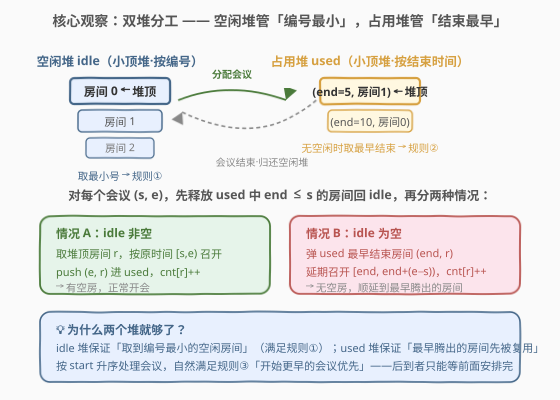
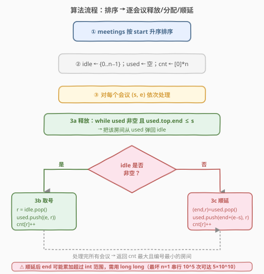

# LeetCode 会议室 III 题解

## 1. 题目概述

- **标题 / 题号**：会议室 III（#2402，hard）
- **链接**：https://leetcode.cn/problems/meeting-rooms-iii/
- **难度**：困难
- **标签**：堆、优先队列、模拟、排序、贪心

**题意**：给定 `n` 个会议室（编号 `0` 到 `n-1`）和一组会议 `meetings`，`meetings[i] = [starti, endi]` 表示会议在**半闭区间** `[starti, endi)` 召开，所有 `starti` 互不相同。会议按如下规则分配会议室：

1. 每场会议安排到**未占用且编号最小**的会议室。
2. 若没有可用会议室，会议**延期**到有空房为止，延期会议**保持原时长**不变。
3. 会议室腾出后，**原开始时间更早**的会议优先获得。

返回举办会议次数最多的房间编号；若并列，返回编号最小者。

**示例 1**：

```text
输入：n = 2, meetings = [[0,10],[1,5],[2,7],[3,4]]
输出：0
解释：
  时间 0  房间 0 召开 [0,10)
  时间 1  房间 1 召开 [1,5)
  时间 2  两房被占，[2,7) 延期
  时间 3  两房被占，[3,4) 延期
  时间 5  房间 1 腾出，[2,7) 顺延为 [5,10) 召开于房间 1
  时间 10 两房同时腾出，[3,4) 顺延为 [10,11) 召开于房间 0
  房间 0、1 各开 2 次 → 返回编号小的 0
```

**示例 2**：

```text
输入：n = 3, meetings = [[1,20],[2,10],[3,5],[4,9],[6,8]]
输出：1
解释：
  [1,20]→房间0；[2,10]→房间1；[3,5]→房间2
  [4,9] 无空房，顺延到 (5,2)，[5,10) 召开于房间2
  [6,8] 无空房，顺延到 (10,1)，[10,12) 召开于房间1
  房间 1、2 各开 2 次 → 返回编号小的 1
```

**约束**：

- $1 \leq n \leq 100$
- $1 \leq \text{meetings.length} \leq 10^5$
- $\text{meetings}[i].\text{length} == 2$
- $0 \leq \text{start}_i < \text{end}_i \leq 5 \times 10^5$
- 所有 $\text{start}_i$ **互不相同**

> 💡 本题是「会议室」系列的进阶版：[253. 会议室 II](https://leetcode.cn/problems/meeting-rooms-ii/) 只问「最少需要多少房间」，而本题固定 `n` 个房间并要求**模拟真实调度**——既要选编号最小的房间，又要在无空房时按最早腾出顺序顺延。核心是**双优先队列（双堆）模拟**：一个堆管空闲房间编号，另一个堆管占用房间的结束时间。

## 2. 解题思路

### 2.1 暴力思路：时间线逐刻扫描

按时间轴从 $0$ 逐刻推进到最大时刻，每个时刻先释放到期的房间、再把等待队列里开始最早的会议塞进编号最小的空房。问题在于时刻范围 $5 \times 10^5$、会议数 $10^5$，逐刻扫描虽可过但常数大、且「等待队列」需反复排序，实现繁琐。

> ⚠️ 暴力法的痛点是「时间被空房与会议结束事件驱动，而非均匀流逝」。其实真正推动状态变化的只有两类事件：**新会议到来**与**占用房间到期**。我们无需逐刻扫描，只要按「会议开始时间」顺序处理，遇到无空房时直接跳到「占用堆里最早结束时间」即可——这正是优先队列擅长的事。

### 2.2 核心观察：双堆分工



关键洞察是用**两个小顶堆**分别承载两条规则：

1. **空闲堆 `idle`**（按房间编号）：存当前未被占用的房间编号，堆顶即编号最小的空房 → 满足规则①「编号最小」。
2. **占用堆 `used`**（按 `(结束时间, 房间编号)`）：存当前正在开会的房间，堆顶即**结束最早**的房间；同结束时间时编号小者先出 → 满足规则②「顺延到最早腾出的房间」。

而规则③「开始更早的会议优先」由**预处理**保证：把 `meetings` 按 `start` 升序排序后逐个处理，先到者先安排，后到者只能等前面安排完。

> 💡 **为什么按 `start` 升序处理就满足规则③？** 因为所有 `start` 互不相同，排序后是严格有序的。每个会议到来时，我们会先释放所有「结束时间 ≤ 当前 `start`」的房间再分配；如果当前无空房，它只能顺延到占用堆里最早腾出的房间。后到的会议 `start` 更大，绝不可能「插队」抢在前面会议之前获得房间——前面会议要么已被安排，要么已在等待队列最前。因此**处理顺序 = 开始时间顺序 = 规则③要求的优先级**。

### 2.3 算法流程图



**完整步骤**：

1. 将 `meetings` 按 `start` 升序排序（`start` 互不相同，无需额外去重）。
2. 初始化 `idle` 堆为 `{0, 1, ..., n-1}`；`used` 堆为空；计数数组 `cnt[0..n-1] = 0`。
3. 对每个会议 `(s, e)`：
   - **释放**：`while used 非空 且 used.top.end ≤ s`：把该房间从 `used` 弹出、压回 `idle`。
   - **分配/顺延**：
     - 若 `idle` 非空：`r = idle.pop()`；`used.push((e, r))`；`cnt[r]++`。
     - 否则（`idle` 为空）：`(end, r) = used.pop()`；`used.push((end + (e - s), r))`；`cnt[r]++`。
4. 遍历 `cnt`，返回最大值中编号最小的房间。

> ⚠️ **顺延后的新结束时间** `end + (e - s)`：会议时长 `e - s` 不变，只是起点从原 `s` 平移到腾出时刻 `end`。注意 `end` 是占用堆里最早结束时间（一定 `> s`，因为 ≤ s 的都已释放），所以新结束时间严格大于原结束时间，调度单调推进，不会死循环。

> ⚠️ **溢出**：`n=1` 时所有会议在一间房串行召开，结束时间逐次累加时长，最坏 $10^5$ 次 × $5\times10^5$ 时长 $= 5\times10^{10}$，超出 32 位 `int`（$\approx 2.1\times10^9$）。C++ 中结束时间须用 `long long`；Python 无此问题。

### 2.4 示例演算

以示例 1 `n=2, meetings=[[0,10],[1,5],[2,7],[3,4]]` 为例（已按 `start` 排序）：

![示例演算：四场会议逐步分配，cnt 最终为 [2,2]](../images/meeting_rooms_iii_example_walkthrough.svg)

| 会议 | 释放 end≤s | idle | 动作 | used | cnt |
|------|-----------|------|------|------|-----|
| [0,10] | 无 | {0,1} | 取房间 0 | {(10,0)} | [1,0] |
| [1,5] | 无（10>1） | {1} | 取房间 1 | {(5,1),(10,0)} | [1,1] |
| [2,7] | 无 | {} | 顺延到 (5,1)，新区间 [5,10) | {(10,0),(10,1)} | [1,2] |
| [3,4] | 无 | {} | 顺延到 (10,0)（同 10 取小号），新区间 [10,11) | {(10,1),(11,0)} | [2,2] |

最终 `cnt = [2, 2]`，最大值 2 并列，返回编号小的 **0** ✓

> 💡 **第 4 场的并列处理是关键**：占用堆顶两个元素 `(10,0)` 与 `(10,1)` 结束时间相同。`used` 堆按 `(end, room)` 字典序排，所以堆顶是 `(10,0)`——编号小的房间 0 先被复用，与「编号最小」规则一致。这正是占用堆元组里**第二维放房间编号**的妙处：同结束时间自动按编号排序。

## 3. 参考代码

### C++

```cpp
class Solution {
  public:
    int mostBooked(int n, vector<vector<int>>& meetings) {
        sort(meetings.begin(), meetings.end());  // 按 start 升序

        priority_queue<int, vector<int>, greater<int>> idle;  // 空闲堆：房间编号
        for (int i = 0; i < n; i++) idle.push(i);

        // 占用堆：(结束时间, 房间编号)，按结束时间、再按编号排
        priority_queue<pair<long long, int>,
                       vector<pair<long long, int>>, greater<>> used;
        vector<int> cnt(n, 0);

        for (auto& m : meetings) {
            int s = m[0], e = m[1];
            // 释放所有结束时间 <= s 的房间
            while (!used.empty() && used.top().first <= s) {
                idle.push(used.top().second);
                used.pop();
            }
            if (!idle.empty()) {
                int r = idle.top(); idle.pop();
                used.push({e, r});
                cnt[r]++;
            } else {
                // 无空房：顺延到最早腾出的房间
                auto [end, r] = used.top(); used.pop();
                used.push({end + (long long)(e - s), r});
                cnt[r]++;
            }
        }

        int ans = 0;
        for (int i = 1; i < n; i++)
            if (cnt[i] > cnt[ans]) ans = i;
        return ans;
    }
};
```

### Python

```python
class Solution:
    def mostBooked(self, n: int, meetings: List[List[int]]) -> int:
        meetings.sort()                       # 按 start 升序
        idle = list(range(n))                 # 空闲堆：房间编号
        heapq.heapify(idle)
        used = []                              # 占用堆：(end, room)
        cnt = [0] * n

        for s, e in meetings:
            while used and used[0][0] <= s:   # 释放到期房间
                _, r = heapq.heappop(used)
                heapq.heappush(idle, r)
            if idle:                          # 有空房：正常分配
                r = heapq.heappop(idle)
                heapq.heappush(used, (e, r))
                cnt[r] += 1
            else:                              # 无空房：顺延到最早腾出房间
                end, r = heapq.heappop(used)
                heapq.heappush(used, (end + (e - s), r))
                cnt[r] += 1

        ans = 0
        for i in range(1, n):
            if cnt[i] > cnt[ans]:
                ans = i
        return ans
```

> ⚠️ Python 的 `heapq` 是小顶堆，元组按字典序比较——`(end, room)` 自动先比 `end` 再比 `room`，与题目「同结束时间取编号小者」完全吻合。C++ 用 `greater<pair<long long,int>>` 达到相同效果。注意 C++ 结束时间用 `long long` 防溢出。

## 4. 复杂度分析

| 维度 | 复杂度 | 说明 |
|------|--------|------|
| 时间复杂度 | $O(m \log m + m \log n)$ | 排序 $O(m \log m)$；每场会议释放/入堆操作合计 $O(\log n)$（每房间至多进出堆各一次，均摊 $O(1)$ 次/会议） |
| 空间复杂度 | $O(n)$ | 两个堆共存 $n$ 个房间编号，计数数组 $O(n)$ |

> 💡 $n \leq 100$、$m \leq 10^5$，时间瓶颈在排序 $O(m \log m) \approx 10^5 \times 17 \approx 1.7 \times 10^6$，堆操作因 $n$ 很小几乎常数级。注意**不是** $O(m \log m + m \log n)$ 中的 $m \log n$ 主导——$n$ 仅 100，$m \log n \approx 10^5 \times 7 = 7\times10^5$。两段量级相当，总操作量级 $10^6$，轻松通过。

## 5. 扩展：为什么「逐刻扫描」不必要

一个常见疑问：是否需要按时间轴逐刻模拟，才能正确处理「某时刻多个房间同时腾出、多个会议同时等待」？

答案是**不必**。原因有三：

1. **事件驱动而非时间驱动**：状态只在「会议到来」或「房间到期」时变化。我们按 `start` 顺序处理会议，每场会议到来时**一次性释放所有到期房间**（`while used.top.end ≤ s`），把离散的到期事件批量处理。
2. **顺延直接跳到下一事件点**：无空房时，下一腾出时刻就是 `used.top.end`——直接把会议安排到那一刻，省略中间空闲时段。
3. **并列情况由堆序天然解决**：多房间同时腾出时，`idle` 堆保证取编号最小；多会议同时等待时，因按 `start` 顺序处理，开始早的自然先安排。无需显式维护等待队列。

> ⚠️ 对比 [253. 会议室 II](https://leetcode.cn/problems/meeting-rooms-ii/)：那题只需统计**同时占用数的峰值**，一个堆扫描结束时间即可；本题要**精确还原每场会议落到哪个房间**，故需双堆——一个管「谁空闲」、一个管「何时腾出」。两者是「统计型」与「模拟型」的代表。

## 6. 面试要点

1. **为什么用两个堆？各自存什么？**

   - `idle` 存空闲房间编号（小顶堆），保证取到**编号最小**的空房 → 规则①。
   - `used` 存 `(结束时间, 房间编号)`（小顶堆），保证无空房时取到**最早腾出**的房间 → 规则②；同结束时间按编号升序，恰好满足「编号最小」。
   - 两堆分工：一个管「谁可用」、一个管「何时可用」，避免逐刻扫描。

2. **规则③「开始更早的会议优先」如何保证？需要额外数据结构吗？**

   - 不需要。把 `meetings` 按 `start` 升序排序后**逐个处理**即可。
   - 因为 `start` 互不相同，处理顺序就是优先级顺序；后到者 `start` 更大，无法插队抢在前面会议之前。
   - 每场会议到来时先释放所有到期房间，再分配或顺延——前面未安排的会议已先于它处理完毕。

3. **释放条件为什么是 `end ≤ s` 而不是 `end < s`？**

   - 半闭区间 `[start, end)`：会议在 `end` 时刻已结束，房间立即可用。
   - 新会议在 `s` 时刻开始，若 `end == s`，房间恰好在 `s` 腾出，可立即接新会议——故用 `≤`。
   - 用 `<` 会让 `end == s` 的房间错过本轮释放、错误顺延，导致计数错乱。

4. **同结束时间多房间腾出时，怎么保证取编号最小的？**

   - `used` 元组第二维是房间编号，小顶堆按 `(end, room)` 字典序排——`end` 相同时自动按 `room` 升序，堆顶即编号最小者。
   - 若只存 `end` 不存 `room`，并列时无法决定取哪间，需额外处理。**把编号塞进元组**是最简洁的解法。

5. **顺延后新结束时间怎么算？为什么要防溢出？**

   - 时长 `e - s` 不变，起点平移到腾出时刻 `end`：新结束 = `end + (e - s)`。
   - `n=1` 时所有会议在一间房串行，结束时间逐次累加，最坏 $10^5 \times 5\times10^5 = 5\times10^{10}$，超 32 位 `int`。C++ 须 `long long`。

> 💡 **一句话总结**：会议室 III 是「双堆模拟」的招牌题——`idle` 堆管编号最小、`used` 堆管结束最早，按 `start` 顺序逐会议「释放 → 分配/顺延」。与 [253. 会议室 II](https://leetcode.cn/problems/meeting-rooms-ii/) 的单堆统计形成「模拟型 vs 统计型」对照，与 [502. IPO](../0501-0600/502_IPO.md) 的排序+大顶堆同属「排序建立单调性 + 堆高效选择」范式。

## 同类练习题

| # | 题目 | 与本题的关联 |
|---|------|-------------|
| 253 | [会议室 II](https://leetcode.cn/problems/meeting-rooms-ii/) | 单堆统计同时占用峰值，与本题双堆精确模拟形成「统计型 vs 模拟型」对照 |
| 502 | [IPO](../0501-0600/502_IPO.md) | 排序 + 大顶堆贪心选最大利润，与本题同为「排序建立单调性 + 堆高效选择」范式 |
| 621 | [任务调度器](https://leetcode.cn/problems/task-scheduler/) | 资源约束下的贪心调度，用公式而非堆模拟，可对比两种调度思路 |
| 1353 | [最多可以参加的会议数目](https://leetcode.cn/problems/maximum-number-of-events-that-can-be-attended/) | 按时间扫 + 小顶堆选结束最早，与本题占用堆「最早结束」思路同源 |
| 1882 | [使用服务器处理任务](https://leetcode.cn/problems/process-tasks-using-servers/) | 双堆模拟（空闲服务器堆 + 任务执行堆），与本题结构几乎同构 |
