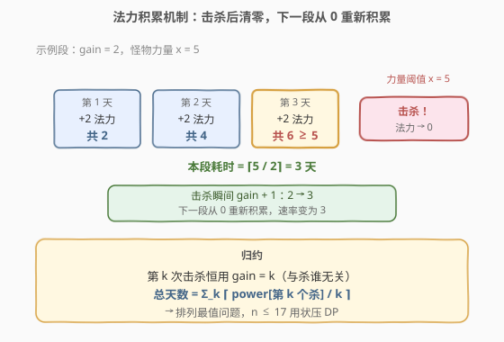
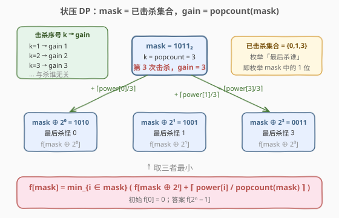

# 杀死所有怪物的最短时间

- **题目名称**：杀死所有怪物的最短时间
- **链接**：[2403. 杀死所有怪物的最短时间](https://leetcode.cn/problems/minimum-time-to-kill-all-monsters/)
- **难度**：困难
- **标签**：位运算、数组、动态规划、状态压缩、位掩码

## 1. 题目概述

你有一个整数数组 `power`，其中 `power[i]` 是第 `i` 个怪物的力量。你从 `0` 点法力值开始，**每天**获取 `gain` 点法力值，最初 `gain = 1`。每天，在获得 `gain` 点法力值后，若你的法力值**大于或等于**某个未击败怪物的力量，你就可以打败它。当你打败一个怪物时：

- 你的法力值会被**重置为 `0`**，并且
- `gain` 的值**增加 `1`**。

返回打败**所有**怪物所需的最少天数。

**示例 1**：

```text
输入：power = [3,1,4]
输出：4
解释：
  第 1 天：+1 法力（共 1）→ 击杀第 2 个怪物（力量 1）
  第 2 天：+2 法力（共 2）
  第 3 天：+2 法力（共 4）→ 击杀第 3 个怪物（力量 4）
  第 4 天：+3 法力（共 3）→ 击杀第 1 个怪物（力量 3）
```

**示例 2**：

```text
输入：power = [1,1,4]
输出：4
解释：
  第 1 天：+1（共 1）→ 击杀怪物 1（力量 1）
  第 2 天：+2（共 2）→ 击杀怪物 2（力量 1）
  第 3 天：+3（共 3）
  第 4 天：+3（共 6）→ 击杀怪物 3（力量 4）
```

**示例 3**：

```text
输入：power = [1,2,4,9]
输出：6
解释：击杀顺序按力量 [1,2,9,4]，分别用 gain 1,2,3,4：
  ⌈1/1⌉ + ⌈2/2⌉ + ⌈9/3⌉ + ⌈4/4⌉ = 1 + 1 + 3 + 1 = 6 天
```

**约束条件**：

- $1 \le \text{power.length} \le 17$
- $1 \le \text{power}[i] \le 10^9$

> ⚠️ **关键信号**：`n ≤ 17` 是**状压 DP（bitmask DP）**的标志性甜区——$2^{17} = 131072$ 个状态，恰好落在「可以枚举所有击杀子集」的范围。再结合「击杀顺序影响总天数」的排列型最值结构，第一反应应是状压 DP。

---

## 2. 解题思路

### 2.1 暴力思路：枚举全排列

击杀顺序决定总天数，最暴力的做法是枚举所有 $n!$ 种击杀排列，对每种排列累加天数取最小。$n=17$ 时 $17! \approx 3.5\times 10^{14}$，远超时限。需要利用「**子结构只依赖已击杀集合**」这一性质，用记忆化避免重复计算。

### 2.2 核心观察：法力段独立 + gain 只看击杀序号



逐步拆解两个关键性质：

**性质一（法力段独立）**：每次击杀后法力清零，所以「击杀一个怪物」对应一个**从 0 开始积累**的独立时间段。在该段内法力以恒定速率 `gain` 每天增长，直到累计法力 $\ge$ 怪物力量 $x$ 即可击杀。所需天数就是

$$
\left\lceil \frac{x}{\text{gain}} \right\rceil = \left\lfloor \frac{x + \text{gain} - 1}{\text{gain}} \right\rfloor
$$

> 💡 **为什么法力一旦够就该立即击杀？** 多攒的法力在清零后全部浪费，而 `gain` 只在击杀后才增长。拖延既不省法力也不改变 `gain`，只会白白多花天数。所以每个怪物单独贡献 $\lceil x/\text{gain}\rceil$ 天，各段相加即总天数。

**性质二（gain 只看序号）**：`gain` 初始为 `1`、每击杀一次 `+1`，因此**第 $k$ 次击杀**（$k$ 从 1 计起）使用的 `gain` 恰为 $k$，**与到底杀了哪个怪物无关**。若击杀顺序为 $p_1, p_2, \dots, p_n$（一个排列），总天数为

$$
\text{days} = \sum_{k=1}^{n} \left\lceil \frac{\text{power}[p_k]}{k} \right\rceil
$$

问题被干净地归约为：**把 $n$ 个怪物分配到序号 $1..n$，最小化上述加权和**——一个排列型最值问题，$n\le 17$ 正适合状压 DP。

> ⚠️ **能不能贪心排序？** 直觉是「大力量放后面用大 gain」，但因 $\lceil x/k\rceil$ 有上取整，未必单调。如 `power=[3,1,4]`：按「大力量配大 gain」得 $4\to\text{gain}3,\ 3\to\text{gain}2,\ 1\to\text{gain}1$ → $\lceil4/3\rceil+\lceil3/2\rceil+\lceil1/1\rceil = 2+2+1 = 5$ 天；而最优是 $4\to\text{gain}2,\ 3\to\text{gain}3,\ 1\to\text{gain}1$ → $\lceil4/2\rceil+\lceil3/3\rceil+\lceil1/1\rceil = 2+1+1 = 4$ 天。**最大力量 4 反而用 gain 2 而非最大 gain 3**——上取整的非线性让排序不等式失效，必须 DP。

### 2.3 算法流程：状压 DP 状态转移



用 $n$ 位二进制 `mask` 表示**已击杀的怪物集合**：第 $i$ 位为 `1` 表示怪物 $i$ 已被击败。设 $k = \text{popcount}(\text{mask})$ 为已击杀个数，则「凑成 `mask` 的最后一步」就是**第 $k$ 次击杀**，使用 $\text{gain} = k$。

定义 $f[\text{mask}]$ = 击杀掉 `mask` 所表示的怪物集合所需的最少天数。枚举 `mask` 中最后被击杀的怪物 $i$：

$$
f[\text{mask}] = \min_{i \in \text{mask}} \left( f[\text{mask} \oplus 2^i] + \left\lceil \frac{\text{power}[i]}{\text{popcount}(\text{mask})} \right\rceil \right)
$$

- **初始**：$f[0] = 0$（一只没杀，0 天）。
- **答案**：$f[2^n - 1]$（全部击杀）。
- **顺序**：按 `mask` 从小到大递推即可——因为 $\text{mask} \oplus 2^i < \text{mask}$，前驱状态先于后继被算出。

> 💡 **为什么不用再记一维「已击杀个数」或「当前 gain」？** 已击杀个数就是 $\text{popcount}(\text{mask})$，`gain` 又由它唯一决定，所以一维 `mask` 已包含全部信息——这与 [526. 优美的排列](../0501-0600/526_优美的排列.md)「位置由 `popcount` 还原」同构。

### 2.4 示例演算（power = [3,1,4], n = 3）

![示例演算：power=[3,1,4] 的状压 DP](../images/2403_example_walkthrough.svg)

记 `power[0]=3, power[1]=1, power[2]=4`。`mask` 按 `popcount` 分层，节点形如 `mask (f 值)`，边权为该步代价 $\lceil \text{power}[i]/k\rceil$。逐层转移（仅列每个状态的最优来源）：

| 目标 mask | 最优来源 | 击杀怪物 | 代价 $\lceil x/k\rceil$ | f 值 |
|-----------|----------|----------|--------------------------|------|
| 001 | 000 | 怪0 (power 3) | $\lceil3/1\rceil=3$ | 3 |
| 010 | 000 | 怪1 (power 1) | $\lceil1/1\rceil=1$ | 1 |
| 100 | 000 | 怪2 (power 4) | $\lceil4/1\rceil=4$ | 4 |
| 011 | 010 | 怪0 (power 3) | $\lceil3/2\rceil=2$ | 3 |
| 101 | 001 | 怪2 (power 4) | $\lceil4/2\rceil=2$ | 5 |
| 110 | 010 | 怪2 (power 4) | $\lceil4/2\rceil=2$ | 3 |
| 111 | 110 | 怪0 (power 3) | $\lceil3/3\rceil=1$ | **4** |

最优路径 `000 →(+1, 杀怪1) 010 →(+2, 杀怪2) 110 →(+1, 杀怪0) 111`，共 $1+2+1=4$ 天 ✓——击杀顺序按力量 `[1,4,3]`，分别用 gain `1,2,3`，与示例 1 解释一致。

---

## 3. 参考代码

### 方法一：递推状压 DP（自底向上，常数小）

### C++

```cpp
class Solution {
public:
    long long minimumTime(vector<int>& power) {
        int n = power.size();
        vector<long long> f(1 << n, LLONG_MAX);
        f[0] = 0;
        for (int mask = 1; mask < (1 << n); ++mask) {
            int k = __builtin_popcount(mask);            // 第 k 次击杀，gain = k
            for (int i = 0; i < n; ++i) {
                if (mask >> i & 1) {
                    long long cost = (power[i] + k - 1) / k;   // ⌈power[i]/k⌉
                    f[mask] = min(f[mask], f[mask ^ (1 << i)] + cost);
                }
            }
        }
        return f[(1 << n) - 1];
    }
};
```

### Python

```python
class Solution:
    def minimumTime(self, power: List[int]) -> int:
        n = len(power)
        f = [inf] * (1 << n)
        f[0] = 0
        for mask in range(1, 1 << n):
            k = mask.bit_count()                         # 第 k 次击杀，gain = k
            for i, x in enumerate(power):
                if mask >> i & 1:
                    cost = (x + k - 1) // k              # ⌈x/k⌉
                    f[mask] = min(f[mask], f[mask ^ (1 << i)] + cost)
        return f[-1]
```

> 💡 **整数除法做上取整**：$\lceil x/k\rceil = \lfloor (x+k-1)/k\rfloor$，避免浮点。`power[i]` 可达 $10^9$、$n=17$ 时天数上界约 $17\times 10^9$，超过 `int32`，故 C++ 用 `long long`、Python 用任意精度整数。

### 方法二：记忆化搜索（自顶向下，更贴近思路）

### Python

```python
class Solution:
    def minimumTime(self, power: List[int]) -> int:
        n = len(power)

        @cache
        def dfs(mask: int) -> int:
            if mask == 0:
                return 0
            ans = inf
            gain = 1 + (n - mask.bit_count())          # 剩余里第 1 次击杀用的 gain
            for i, x in enumerate(power):
                if mask >> i & 1:
                    ans = min(ans, dfs(mask ^ (1 << i)) + (x + gain - 1) // gain)
            return ans

        return dfs((1 << n) - 1)
```

### C++

```cpp
class Solution {
public:
    long long minimumTime(vector<int>& power) {
        int n = power.size();
        vector<long long> memo(1 << n, -1);
        function<long long(int)> dfs = [&](int mask) -> long long {
            if (mask == 0) return 0;
            if (memo[mask] != -1) return memo[mask];
            long long ans = LLONG_MAX;
            int gain = 1 + (n - __builtin_popcount(mask));   // 剩余里第 1 次击杀用的 gain
            for (int i = 0; i < n; ++i) {
                if (mask >> i & 1) {
                    long long cost = (power[i] + gain - 1) / gain;
                    ans = min(ans, dfs(mask ^ (1 << i)) + cost);
                }
            }
            return memo[mask] = ans;
        };
        return dfs((1 << n) - 1);
    }
};
```

> 💡 **两种口径的 `gain`**：递推版 `mask` = **已击杀集**，新加入者用 $\text{gain}=\text{popcount}(\text{mask})$（即第 $k$ 次）；记忆化版 `mask` = **未击杀集（剩余）**，从全集出发递减，下一次击杀用 $\text{gain}=1+(n-\text{popcount}(\text{mask}))$。两者等价，仅状态语义相反——两版 `mask` 互为按位取反，答案同为 $f[\text{全集}]$ / $\text{dfs}(\text{全集})$。

---

## 4. 复杂度分析

| 维度 | 复杂度 | 说明 |
|------|--------|------|
| **时间复杂度** | $O(n \cdot 2^n)$ | $2^n$ 个状态，每个枚举 $n$ 个怪物做转移，每次 $O(1)$ 上取整除法 |
| **空间复杂度** | $O(2^n)$ | `f` / `memo` 数组大小为 $2^n$ |

$n=17$ 时约 $17 \times 131072 \approx 2.2\times 10^6$ 次操作，毫秒级完成。`power[i]` 达 $10^9$ 不影响状态数，只影响数值大小（故用 64 位整数）。

---

## 5. 扩展：贪心反例与更大 n 的解法

**贪心为什么失效**：目标函数 $\sum_k \lceil x_{p_k}/k\rceil$ 含**上取整非线性**，无法像 $\sum x_{p_k}\cdot w_k$ 那样用排序不等式直接定解——上取整会「削平」相近力量的差异，使分配呈现非单调结构。前述 `[3,1,4]` 反例中最大力量 4 反而分配给 `gain 2`（而非最大 `gain 3`），正是因为 $\lceil4/2\rceil=\lceil4/3\rceil=2$ 相同，把更大的 `gain 3` 让给力量 3 能省一天（$\lceil3/3\rceil=1 < \lceil3/2\rceil=2$）。

**一个可证下界**：由 $\lceil x/k\rceil \ge x/k$，有

$$
\text{days} \ge \sum_{k=1}^{n} \frac{\text{power}[p_k]}{k} \ge \sum_{k=1}^{n} \frac{\text{power}_{(k)}}{k}
$$

其中 $\text{power}_{(k)}$ 为升序排列后第 $k$ 小者（由排序不等式，升序力量配升序权重 $1,1/2,\dots,1/n$ 取得连续下界）。该下界未必可达（因上取整不可去），故仅用于剪枝或估算，精确最优仍需状压 DP。

**$n$ 更大时**：若把规模放宽到 $n\le 20$，可改用 **KM / Hungarian 二分图最优匹配**——左点为怪物、右点为序号 $1..n$、边权为 $\lceil x/k\rceil$，$O(n^3)$ 求最小权完美匹配。$n\le 17$ 时状压 DP 写法更短、常数更小，是首选。

---

## 6. 面试要点

1. **为什么「击杀段」是独立的、能直接相加？**

   > 每次击杀后法力清零，下一段从 0 重新积累；且 `gain` 在击杀瞬间才 `+1`，段内速率恒定。所以每只怪物单独贡献 $\lceil x/\text{gain}\rceil$ 天，互不干扰，总天数即各段之和。若法力不清零（可累积），结构会完全不同，必须另建模。

2. **`gain` 为什么只依赖「第几次击杀」而非「杀了谁」？**

   > `gain` 初值 1、每杀一次 +1，与怪物身份无关，所以第 $k$ 次击杀恒用 $\text{gain}=k$。正因如此，问题归约成「分配怪物到序号」的排列优化，而非复杂的状态依赖，状压 DP 转移只需 `popcount` 即可还原 `gain`。

3. **状态用「已击杀」还是「未击杀」编码？**

   > 皆可。递推版用「已击杀集」`mask`，新加入者用 $\text{gain}=\text{popcount}(\text{mask})$；记忆化版用「未击杀集」`mask`（从全集出发递减），下一次击杀用 $\text{gain}=1+(n-\text{popcount}(\text{mask}))$。两版 `mask` 互为按位取反，转移方向相反，答案同为「全击杀」。选更顺手的写法即可。

4. **为什么必须用 `long long`？**

   > 最坏每只怪物力量 $10^9$、$n=17$、全程 $\text{gain}=1$ 时天数上界约 $1.7\times 10^{10}$，超过 `int32`（约 $2.1\times 10^9$）。Python 整数自动扩展无虞，C++ 务必用 `long long` 防溢出。

5. **能否贪心排序求解？**

   > 不能。上取整使目标函数非线性，排序不等式失效——`[3,1,4]` 反例中最大力量 4 反而分配给 `gain 2`（而非最大 `gain 3`）才最优。精确解需状压 DP（$n\le 17$）或二分图最优匹配（$n$ 更大时）。

> 💡 **一句话总结**：法力段独立 + `gain` 只看击杀序号 ⇒ 总天数 $= \sum_k \lceil \text{power}[p_k]/k\rceil$，归约为排列最值问题；$n\le 17$ 用状压 DP，`mask` 编码已击杀集、`gain=\text{popcount}(\text{mask})`，$O(n\cdot 2^n)$ 秒杀。

---

## 7. 同类练习题

- [526. 优美的排列](https://leetcode.cn/problems/beautiful-arrangement/)（[题解](../0501-0600/526_优美的排列.md)）：状压 DP 母题，`mask` 记已放集合、位置由 `popcount` 还原，与本题「`gain` 由 `popcount` 还原」同构
- [691. 贴纸拼词](https://leetcode.cn/problems/stickers-to-spell-word/)：`mask` 记已拼出字符子集、求最少贴纸数——同为最值型状压 DP，对照本题的排列型
- [1799. N 次操作后的最大分数](https://leetcode.cn/problems/maximize-score-after-n-operations/)：`mask` 记剩余可用数字、成对取数求最大分——「序号决定系数」与本题「序号决定 gain」结构呼应
- [1655. 分配重复整数](https://leetcode.cn/problems/distribute-repeating-integers/)：状压 DP 把数分配到需求子集，与本题「把怪物分配到序号」同为分配型状压
- [2397. 被列覆盖的最多行数](https://leetcode.cn/problems/maximum-rows-covered-by-columns/)（[题解](../2301-2400/2397_被列覆盖的最多行数.md)）：$n\le 12$ 二进制枚举的招牌题，对照本题把「枚举」升级为「DP 转移」
