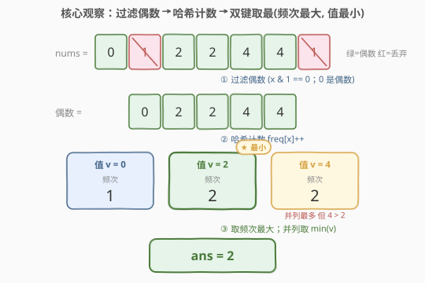
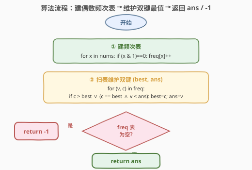
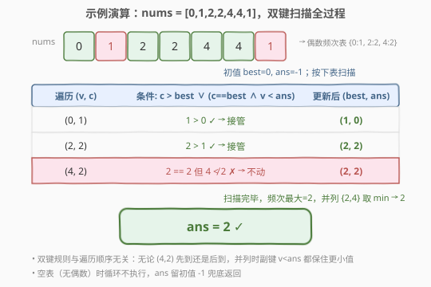

# 出现最频繁的偶数元素

- **题目名称**：出现最频繁的偶数元素
- **链接**：[2404. 出现最频繁的偶数元素](https://leetcode.cn/problems/most-frequent-even-element/)
- **难度**：简单
- **标签**：数组、哈希表、计数、一次遍历

## 1. 题目概述

给你一个整数数组 `nums`，返回出现**最频繁的偶数元素**。

- 若存在多个满足条件的元素，返回**最小**的那个；
- 若不存在偶数元素，返回 `-1`。

**示例 1**：

```text
输入：nums = [0,1,2,2,4,4,1]
输出：2
解释：偶数元素为 0、2、4，其中 2 和 4 各出现 2 次为最多；返回最小的 2。
```

**示例 2**：

```text
输入：nums = [4,4,4,9,2,4]
输出：4
解释：偶数元素中 4 出现 3 次为最多。
```

**示例 3**：

```text
输入：nums = [29,47,21,41,13,37,25,7]
输出：-1
解释：不存在偶数元素。
```

**约束条件**：

- $1 \le \text{nums.length} \le 2000$
- $0 \le \text{nums}[i] \le 10^5$

> 💡 **关键不变式**：题目对候选元素施加了**两道独立约束**——(1) 必须是偶数；(2) 在偶数子集中频次最大，并列时取值最小。偶数判定 `x & 1 == 0` 一次性把值域二分为「参与」与「不参与」，而「频次最大 + 值最小」是一次遍历中可增量维护的双键最值，无需排序。

---

## 2. 解题思路

### 2.1 暴力思路：逐偶数扫描计数

最直白的做法是**对每个偶数值重新扫一遍数组**数出现次数：

```text
ans, best = -1, 0
for v in nums:
    if v 是奇数: continue
    if v 已统计过: continue          # 避免重复数同一值
    c = 数 nums 中 v 的个数
    if c > best or (c == best and v < ans):
        best, ans = c, v
return ans
```

正确性没问题，但每个不同偶数值都要 $O(n)$ 重扫一遍，最坏 $O(n^2)$。对 $n \le 2000$ 能 AC，却把「逐值重扫」的重复劳动背在身上，且未揭示「频次天然可一次遍历累加」。

> ⚠️ 暴力把「同一值被多次扫描」当作必然，但频次信息在一次遍历中就能全部收集——关键观察：**频次按值聚合，一次遍历即可建表**。

### 2.2 核心观察：过滤偶数 + 频次表 + 双键取最



题目可拆成**三步流水线**：

1. **过滤**：只保留偶数（`x & 1 == 0`，注意 $0$ 也是偶数），奇数直接丢弃——它们既不参与计数也不参与答案；
2. **聚合**：对偶数子集建频次表 $c_v$，一次遍历即可完成；
3. **取最**：在频次表上选 $v$，使 $(c_v, -v)$ 字典序最大——即「频次最大，并列取值最小」。

第三步的双键可增量维护。设当前最优 $(best, ans)$，遍历到 $(v, c)$：

$$
\text{更新当且仅当}\quad c > best \quad\text{或}\quad (c = best \;\land\; v < ans)
$$

- $c > best$：发现更高频次，直接接管；
- $c = best \land v < ans$：频次并列但值更小，替换为更小值；
- 否则不动——保证最终 $ans$ 是「最大频次下的最小值」。

若过滤后频次表为空（无偶数），循环不执行，`ans` 保持初值 $-1$，天然满足「不存在返回 $-1$」。

> 💡 **为什么不需要排序？** 双键 $(c, -v)$ 的最值可由一次扫描确定：$c$ 严格更大时直接换，并列时比 $v$。这把 $O(n\log n)$ 的排序压成 $O(n)$ 的扫描——前提是「并列取最小」与扫描方向兼容（先遇到者因更小的 $v$ 而被保留）。

### 2.3 算法流程图



两遍扫描即可：第一遍「遇偶数则 `freq[x]++`」建表；第二遍遍历频次表，按双键规则维护 $(best, ans)$。若无偶数，表空、`ans` 留 $-1$。零分支特判，靠初值兜底。

### 2.4 示例演算



以示例 1 `nums = [0,1,2,2,4,4,1]` 演算：

**第一步——过滤偶数**（标记参与 / 丢弃）：

| 元素 | 0 | 1 | 2 | 2 | 4 | 4 | 1 |
|------|---|---|---|---|---|---|---|
| 偶? | ✅ | ✗ | ✅ | ✅ | ✅ | ✅ | ✗ |

偶数子序列 = $[0,2,2,4,4]$。

**第二步——建频次表**：

| 偶数值 $v$ | 0 | 2 | 4 |
|------------|---|---|---|
| 频次 $c_v$ | 1 | 2 | 2 |

**第三步——双键取最**（设初值 $best=0,\ ans=-1$）：

| 遍历到 $(v, c)$ | 条件判断 | 更新后 $(best, ans)$ |
|-----------------|----------|----------------------|
| $(0, 1)$ | $1 > 0$ ✅ | $(1, 0)$ |
| $(2, 2)$ | $2 > 1$ ✅ | $(2, 2)$ |
| $(4, 2)$ | $2 = 2$ 但 $4 \not< 2$ ✗ | $(2, 2)$ |

最终 $ans = 2$ ✓。值 2 与 4 频次并列（都为 2），但 $2 < 4$ 故保留更小的 2。

> 💡 若把遍历顺序换为 $(4,2) \to (2,2) \to (0,1)$：先 $(4,2)$ 设 $best=2,ans=4$；再 $(2,2)$ 触发「$c=best \land v<ans$」换为 $ans=2$。**双键规则与遍历顺序无关**——最终总得「最大频次下的最小值」。

---

## 3. 参考代码

### C++

```cpp
class Solution {
public:
    int mostFrequentEven(vector<int>& nums) {
        unordered_map<int, int> freq;
        for (int x : nums) {
            if ((x & 1) == 0) ++freq[x];
        }
        int ans = -1, best = 0;
        for (auto& [v, c] : freq) {
            if (c > best || (c == best && v < ans)) {
                best = c;
                ans = v;
            }
        }
        return ans;
    }
};
```

> 💡 `x & 1 == 0` 判偶比 `x % 2 == 0` 略快且对负数同样正确（本题值域非负）。`best` 初值取 $0$ 而非 $-1$：频次表中 $c \ge 1$，故空表时循环不执行、`ans` 留 $-1$ 兜底；非空时首个 $c \ge 1 > 0$ 必触发更新，免去对 $-1$ 的特殊比较。

> ⚙️ **值域优化**：值域 $[0, 10^5]$ 时可用定长数组 `int cnt[100001]`，遍历偶数下标 $v=0,2,\dots,10^5$ 用严格 `>` 比较即可天然保留最小值——$O(1)$ 空间、缓存友好，但牺牲了值域无关性。

### Python

```python
class Solution:
    def mostFrequentEven(self, nums: List[int]) -> int:
        cnt = Counter(x for x in nums if (x & 1) == 0)
        ans, best = -1, 0
        for v, c in cnt.items():
            if c > best or (c == best and v < ans):
                best, ans = c, v
        return ans
```

> 💡 也可一行流：`return min(cnt.items(), key=lambda kv: (-kv[1], kv[0]))[0] if cnt else -1`。原理——`min` 在键 `(-频次, 值)` 上取最小，即「频次最大、值最小」。空表单独判 `-1`。拆开写更易读、面试更易讲清双键语义。

---

## 4. 复杂度分析

| 维度 | 复杂度 | 说明 |
|------|--------|------|
| **时间复杂度** | $O(n)$ | 一次遍历建频次表 + 一次遍历频次表（至多 $n$ 个不同偶数），每元素 $O(1)$ |
| **空间复杂度** | $O(n)$ | 哈希表存不同偶数值个数，最坏 $n$ 个不同偶数 |
| 对照：逐值重扫 | $O(n^2)$ / $O(1)$ | 每个不同偶数值重扫一遍数组，正确但慢；空间省 |
| 对照：排序后扫描 | $O(n\log n)$ / $O(1)$ | 排序后相邻等值合并频次，再选最值；折中方案 |

> 💡 值域 $[0, 10^5]$ 时空间退化为 $O(1)$（定长数组）；值域大则用哈希表，最坏 $O(n)$。本题 $n \le 2000$，三种做法皆 AC，频次法胜在 $O(n)$ 且语义直白、与值域解耦。

---

## 5. 扩展：双键取最的两种等价写法

「频次最大，并列取值最小」本质上是在键 $k(v) = (c_v,\; -v)$ 上取最大（等价于在 $(-c_v,\; v)$ 上取最小）。这衍生两种等价实现：

| 写法 | 代表 | 适用 |
|------|------|------|
| **显式双键分支** | C++/Python 循环里 `c > best \|\| (c==best \&\& v<ans)` | 通用、与遍历顺序无关、无需排序 |
| **键函数 + min/max** | Python `min(..., key=lambda kv: (-kv[1], kv[0]))` | 简洁、声明式，但需语言支持自定义键 |
| **升序遍历 + 严格大于** | 定长数组按下标升序、`if cnt[v] > best` | 天然保留最小值，前提是按下标（即值）升序 |

> 💡 抽象经验：见到「主键取最、副键并列取次最」的题，先想能否压成**单次扫描的双键维护**。若副键恰是遍历维度的自然序（按下标升序），严格 `>` 即让先到者（更小值）胜出，省去副键比较。

---

## 6. 面试要点

1. **为什么 `0` 也算偶数并被计数？**

   > 偶数定义是「能被 2 整除的整数」，$0 \bmod 2 = 0$，故 $0$ 是偶数。代码用 `(x & 1) == 0`，对 $0$ 返回真，正确纳入计数。示例 1 中 $0$ 出现 1 次但频次不及 2、4，故不影响答案。

2. **双键规则为什么与遍历顺序无关？**

   > 设全局最大频次为 $c^\* $。则答案为 $\min\{v : c_v = c^\*\}$。遍历中：凡 $c_v < c^\*$ 者永不会成为最终最优；凡 $c_v = c^\*$ 者中，双键的「$v < ans$」分支总会把当前最小者留下，无论先后——只要遍历覆盖所有候选，最终必收敛到 $\min\{v : c_v = c^\*\}$。

3. **`best` 初值为何取 $0$ 而非 $-1$？**

   > 频次表只含出现过至少一次的偶数，故 $c \ge 1$。空表时循环不执行、`ans` 留初值 $-1$ 兜底返回；非空时首个 $c \ge 1 > 0$ 必触发 `c > best` 更新。若 `best` 取 $-1$，空表也不影响（仍返回 $-1$），但语义上「频次」不会为负，$0$ 更贴合「尚未见到任何元素」的语义。

4. **能否不建哈希表，原地完成？**

   > 能。值域 $[0, 10^5]$ 时用定长数组 `cnt[100001]` 当哈希，按下标升序遍历偶数、严格 `>` 比较即可天然保留最小值，$O(n)$ 时间 / $O(1)$ 额外空间。值域大或未知时哈希表更通用；也可排序后扫相邻等值合并，$O(n\log n)$ / $O(1)$。

5. **本题与 2341 数组能形成多少数对的区别？**

   > 二者同属「频次表」骨架，但目标不同：2341 是「每个值贡献 $\lfloor c/2\rfloor$ 对 + $c\bmod 2$ 余」的求和；2404 是「在偶数子集上取 $(c, -v)$ 双键最大」的选最值。前者聚合所有值、后者先过滤再取最——同一频次预处理，后续运算不同。

> 💡 **一句话总结**：偶数过滤 + 一次遍历建频次 + 双键增量取最 ⟹ $O(n)$ 闭式。`ans` 初值 $-1$ 兜底空表，双键 `c > best ∨ (c==best ∧ v<ans)` 与遍历顺序无关，最终总得「最大频次下的最小偶数」。

---

## 7. 同类练习题

- [1394. 找出数组中的幸运数](https://leetcode.cn/problems/find-lucky-integer-in-an-array/)：同「建频次表后做一次条件筛选」——找 $c_v = v$ 的最大值，对照 2404 的 $c_v$ 取最
- [1636. 按照频率将数组升序排序](https://leetcode.cn/problems/sort-array-by-increasing-frequency/)：频次表驱动排序，副键为值——同「频次为主键、值为副键」的双键思想
- [1748. 唯一元素的和](https://leetcode.cn/problems/sum-of-unique-elements/)：频次表筛选——只对 $c_v = 1$ 的值求和，同「一次遍历建频次再二次筛选」范式
- [1207. 独一无二的出现次数](https://leetcode.cn/problems/unique-number-of-occurrences/)：频次之频次——建 $c_v$ 后判各频次是否唯一，频次表的进一步用法
- [2341. 数组能形成多少数对](https://leetcode.cn/problems/maximum-number-of-pairs-in-array/)：同频次表骨架的求和版——每个值贡献 $\lfloor c_v/2\rfloor$，对照 2404 的取最值版
