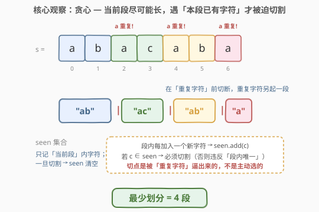
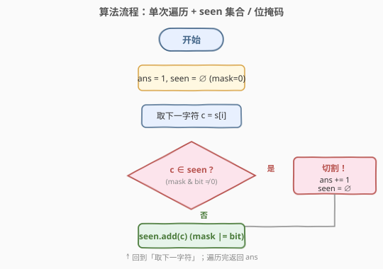
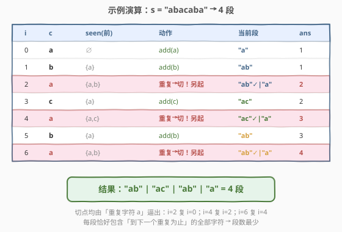

# LeetCode 子字符串的最优划分 题解

## 1. 题目概述

- **标题 / 题号**：子字符串的最优划分（#2405，medium）
- **链接**：https://leetcode.cn/problems/optimal-partition-of-string/
- **难度**：中等
- **标签**：贪心、字符串、哈希表、位运算

**题意**：给你一个字符串 `s`，请你将该字符串划分成一个或多个**子字符串**，使得每个子字符串中的字符都是**唯一**的（单个子字符串中每个字母至多出现一次）。在满足要求的前提下，返回**最少**需要划分多少个子字符串。划分后原串每个字符恰好属于一个子字符串。

**示例 1**：

```text
输入：s = "abacaba"
输出：4
解释：可行的划分有 ("a","ba","cab","a") 或 ("ab","a","ca","ba") 等，最少需要 4 个子字符串。
```

**示例 2**：

```text
输入：s = "ssssss"
输出：6
解释：只能划分为 ("s","s","s","s","s","s")。
```

**约束**：

- $1 \le \text{s.length} \le 10^5$
- `s` 仅由小写英文字母组成

> 💡 **关键不变式**：题目要求「段内字符唯一」+「段数最少」。这二者天然引向贪心——**把每段拉得尽量长**，段数才会尽量少。每段能拉多长？扫描到下一个「本段已出现过的字符」就必须停，因为再走一步就违反唯一性。于是切点完全由重复字符「逼」出来，无需搜索。

## 2. 解题思路

### 2.1 暴力思路：枚举所有切法

最直白的做法是**枚举所有切分位置组合**：在 $n-1$ 个间隙中选若干处切断，对每种切法验证每段字符是否唯一，取合法切法中段数最少的。

```text
ans = n                              # 最坏每字符一段
枚举间隙子集 S ⊆ {0,1,…,n-2}:
    按切点把 s 分段
    若每段字符均唯一: ans = min(ans, 段数)
return ans
```

正确性没问题，但 $n-1$ 个间隙有 $2^{n-1}$ 种切法，对 $n \le 10^5$ 完全不可行。它把「切点其实是被重复字符唯一确定的」这层结构完全忽略，当成自由搜索问题。

> ⚠️ 暴力把切点当成「自由选择」，但实际上**切点位置是被字符重复关系强制出来的**——一旦扫描到一个本段已出现过的字符，在它之前必须有一个切点。这把指数级搜索压成线性扫描。

### 2.2 核心观察：贪心「能拉多长拉多长」



**贪心策略**：从左到右扫描，维护**当前段**已出现的字符集合 `seen`。对每个字符 `c`：

- 若 $c \notin \text{seen}$：把它并入当前段，`seen.add(c)`；
- 若 $c \in \text{seen}$：**必须切割**——在 $c$ 之前结束当前段（段数 $+1$），并把 `seen` 清空后用 $c$ 起一段。

**贪心正确性（交换论证 / 最优性）**：贪心把每个切点推到「最晚能到的位置」——即被重复字符逼出来的那一格。设贪心第一个切点在第 $k_1$ 个字符之后（即 $s[k_1]$ 是首个让段内出现重复的字符）。那么**任何合法划分**的当前段都不能包含 $s[k_1]$（否则它与其前驱同段、违反唯一性），故任何合法划分的第一段必须在 $s[k_1]$ 之前结束，结束位置 $\le k_1 - 1$。贪心取到上限 $k_1 - 1$，剩余后缀最短。对最短后缀递归套用同样论证（归纳），贪心每一步都把切点推到最晚，最终段数 $\le$ 任何合法划分。故贪心最优。

> 💡 **一句话直觉**：切点不是「选」出来的，是「逼」出来的。每段能拉到哪由下一个重复字符决定，贪心只是把切点贴到那个被逼出的位置——晚切一段，后缀就短一截，段数只减不增。

### 2.3 算法流程图



一次遍历即可完成：`ans` 初值取 $1$（至少一段），`seen` 初值为空。对每个字符判 `c ∈ seen`：是则 `ans += 1` 且 `seen` 清空后重置为 $\{c\}$；否则 `seen.add(c)`。遍历结束返回 `ans`。

> 💡 由于 `s` 仅小写字母（$26$ 种），`seen` 可用一个 `bool[26]` 数组，或更紧凑地用一个 $26$ 位整数 `mask`：第 $b = c-\text{'a'}$ 位为 $1$ 表示该字符已在段内。判重即 `mask & (1<<b)`，加入即 `mask |= (1<<b)`，清空即 `mask = 0`——$O(1)$ 空间、无哈希开销。

### 2.4 示例演算



以示例 1 `s = "abacaba"` 演算（设初值 `ans=1`，`seen=∅`）：

| $i$ | $c$ | seen(前) | 动作 | 当前段 | ans |
|-----|-----|----------|------|--------|-----|
| 0 | a | ∅ | add(a) | "a" | 1 |
| 1 | b | {a} | add(b) | "ab" | 1 |
| 2 | a | {a,b} | a 重复 → 切！另起 | "ab"✓ \| "a" | 2 |
| 3 | c | {a} | add(c) | "ac" | 2 |
| 4 | a | {a,c} | a 重复 → 切！另起 | "ac"✓ \| "a" | 3 |
| 5 | b | {a} | add(b) | "ab" | 3 |
| 6 | a | {a,b} | a 重复 → 切！另起 | "ab"✓ \| "a" | 4 |

最终 `"ab" | "ac" | "ab" | "a"`，`ans = 4` ✓。三次切割全部由字符 `a` 的重复逼出：$i=2$ 复 $i=0$，$i=4$ 复 $i=2$，$i=6$ 复 $i=4$。

> 💡 注意切割后「重复字符」本身归入**新段**而非旧段——它只是旧段无法容纳的「边界字符」。这与「最长无重复子串」(3 题) 用窗口左端收缩的处理方向相反：那里移动 `left` 跳过冲突，这里直接另起一段。

## 3. 参考代码

### C++

```cpp
class Solution {
public:
    int partitionString(string s) {
        int ans = 1;
        int mask = 0;
        for (char c : s) {
            int bit = 1 << (c - 'a');
            if (mask & bit) {
                ++ans;
                mask = 0;
            }
            mask |= bit;
        }
        return ans;
    }
};
```

> 💡 `mask` 仅 $26$ 位，`int` 足够。判重用 `mask & bit`（非零即重复），加入用 `mask |= bit`，切割即 `mask = 0` 后由循环末尾的 `|=` 把当前字符补进新段——故 `mask = 0` 之后必须执行 `mask |= bit`，顺序不可换。`ans` 初值 $1$ 兜底串非空时的第一段，全程无需为空串特判（约束 $n \ge 1$）。

> ⚙️ 若字符集更宽（如任意 ASCII），把 `mask` 换成 `unordered_set<char> seen` 或 `bool seen[128]`，逻辑不变。

### Python

```python
class Solution:
    def partitionString(self, s: str) -> int:
        ans = 1
        seen = set()
        for c in s:
            if c in seen:
                ans += 1
                seen.clear()
            seen.add(c)
        return ans
```

> 💡 位掩码版：`mask = 0`，循环内 `bit = 1 << (ord(c) - 97)`，`if mask & bit: ans += 1; mask = 0`，`mask |= bit`。Python 整数任意精度，`mask` 无溢出之忧，但 `set` 版在小数据量下与位运算近乎同速，可读性更佳。

## 4. 复杂度分析

| 维度 | 复杂度 | 说明 |
|------|--------|------|
| **时间复杂度** | $O(n)$ | 单次遍历，每个字符做 $O(1)$ 的位判 / 集合操作 |
| **空间复杂度** | $O(1)$ | `mask` 占 $26$ 位；或 `bool[26]` / `set` 至多 $26$ 元素 |
| 对照：枚举切法 | $O(2^n \cdot n)$ / $O(n)$ | 枚举间隙子集 × 段内判重，指数级不可行 |
| 对照：DP | $O(n \cdot 26)$ / $O(n)$ | `dp[i]` 为前 $i$ 字符最少段数，倒退最长唯一后缀；正确但比贪心绕远 |

> 💡 贪心之所以能 $O(n)$ 在线维护，是因为切点位置**单调向右**且由重复关系唯一确定——扫描到重复即切，无需回看。DP 的 $O(n\cdot 26)$ 虽同为线性，但把「每段拉到最长」这一性质拆成了状态转移，舍近求远。

## 5. 扩展：与「最长无重复子串」的对偶

本题与 [3. 无重复字符的最长子串](https://leetcode.cn/problems/longest-substring-without-repeating-characters/) 共享「段内字符唯一」这一约束，但目标相反，处理方向也不同：

| 维度 | 3 最长无重复子串 | 2405 子串最优划分 |
|------|------------------|-------------------|
| 目标 | **单个**窗口最长 | **多段**划分，段数**最少** |
| 遇重复时 | 收缩左端 `left`，窗口继续滑动 | 直接切割，另起一段 |
| `seen` 生命周期 | 跨多个字符持续维护 | 切割即清空重置 |
| 复杂度 | $O(n)$ / $O(1)$（哈希） | $O(n)$ / $O(1)$（位掩码） |

> 💡 对偶关系：3 题把「唯一」约束压在**一个**滑窗上求最长；2405 把约束压在**每一段**上求最少段数——相当于把串「折叠」成若干最长无重复块。两者都靠「遇重复即处理」的单调性达到线性。

## 6. 面试要点

1. **为什么贪心「每段尽可能长」能得到最少段数？**

   > 交换论证：设贪心第一段在第 $k$ 个字符后被逼停。任何合法划分的第一段都不能含 $s[k]$（否则与其前驱重复），故其第一段终点 $\le k-1$，后缀比贪心的更长。对更短后缀递归套用同样论证，贪心每步把切点推到最晚、后缀最短，归纳得段数 $\le$ 任何合法划分。

2. **切割后那个「重复字符」归入新段还是旧段？**

   > 新段。它是旧段无法容纳的「边界字符」——若留在旧段则旧段违反唯一性。代码中先 `mask = 0`（清空旧段），再 `mask |= bit`（把它作为新段首字符），顺序不可颠倒。

3. **为什么用位掩码而不是哈希表？**

   > 字符集仅 $26$ 个小写字母，一个 `int` 的 $26$ 位即够编码全集。判重 `mask & bit`、加入 `mask |= bit`、清空 `mask = 0` 均为 $O(1)$ 且无哈希开销与冲突。若字符集扩大到任意 Unicode，则改用 `set` 或 `bool[128]`，逻辑不变。

4. **`ans` 初值为何取 $1$ 而非 $0$？**

   > 约束 $n \ge 1$，串非空时至少有一段。取 $1$ 后只在「真正发生切割」时才 `+1`，免去末段特判。若取 $0$，则每个字符进入新段时都要算一段，逻辑等价但需把首段也计入切点，反而绕。

5. **能否用二分答案 / DP 求解？**

   > DP 可以：`dp[i]` 表示前 $i$ 个字符的最少段数，转移时倒推一个「字符均唯一」的最长后缀，$O(n \cdot 26)$。但贪心把切点贴到重复字符逼出的位置，$O(n)$ 单趟扫描即得最优，DP 把可直接确定的切点拆成状态转移，舍近求远。二分答案不适用——「段数」并非可二分的单调谓词。

> 💡 **一句话总结**：贪心「每段拉到最长，遇重复即切」⟹ 切点被字符重复关系唯一逼出 ⟹ $O(n)$ / $O(1)$ 最优解。位掩码把 `seen` 压成一个 `int`，判重 / 加入 / 清空各 $O(1)$。

## 同类练习题

| # | 题目 | 与本题的关联 |
|---|------|-------------|
| 3 | [无重复字符的最长子串](https://leetcode.cn/problems/longest-substring-without-repeating-characters/) | 共享「段内字符唯一」约束，目标对偶——求最长单窗口 vs 求最少段数；遇重复时收缩窗口 vs 切割另起 |
| 8 | [字符串转换整数 (atoi)](https://leetcode.cn/problems/string-to-integer-atoi/) | 同「单趟扫描 + 状态在字符流上增量维护」的线性字符串处理范式 |
| 187 | [重复的 DNA 序列](https://leetcode.cn/problems/repeated-dna-sequences/) | 同样利用「$26$/少量字符 → 位编码」思想把集合压进整数 |
| 231 | [2 的幂](https://leetcode.cn/problems/power-of-two/) | 位运算基础——`mask & bit` 判特定位的存在性是本题位掩码解法的原子操作 |
| 191 | [位 1 的个数](https://leetcode.cn/problems/number-of-1-bits/) | `mask \|= bit` 置位、`mask = 0` 清零的位运算基本功，承接本题 `seen` 的位实现 |
