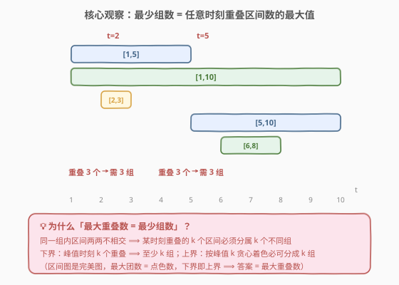
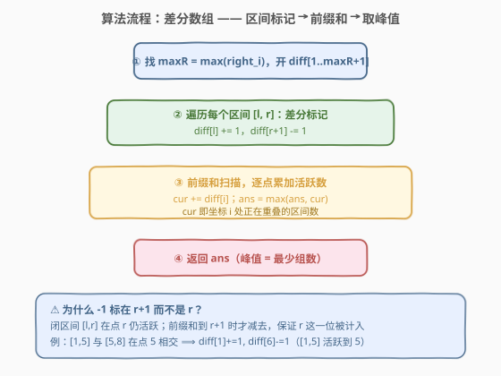
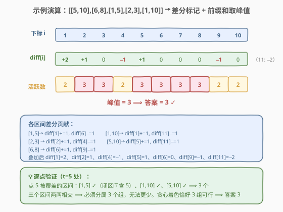

# LeetCode 将区间分为最少组数 题解

## 1. 题目概述

- **标题 / 题号**：将区间分为最少组数（#2406，medium）
- **链接**：https://leetcode.cn/problems/divide-intervals-into-minimum-number-of-groups/
- **难度**：中等
- **标签**：数组、差分数组、前缀和、排序、堆、贪心

**题意**：给定若干**闭区间** `intervals[i] = [lefti, righti]`，需将它们划分成若干**组**：每组内任意两个区间**不相交**（即不共享任何整数点，注意 `[1,5]` 与 `[5,8]` 因共享点 `5` 而算相交）。返回所需的最少组数。

**示例 1**：

```text
输入：intervals = [[5,10],[6,8],[1,5],[2,3],[1,10]]
输出：3
解释：
  第 1 组：[1,5], [6,8]
  第 2 组：[2,3], [5,10]
  第 3 组：[1,10]
  无法少于 3 组。
```

**示例 2**：

```text
输入：intervals = [[1,3],[5,6],[8,10],[11,13]]
输出：1
解释：所有区间互不相交，可全部放入一个组。
```

**约束**：

- $1 \le \text{intervals.length} \le 10^5$
- $\text{intervals}[i].\text{length} == 2$
- $1 \le \text{left}_i \le \text{right}_i \le 10^6$

> 💡 本题是「会议室 II」家族的统计型变体：[253. 会议室 II](https://leetcode.cn/problems/meeting-rooms-ii/) 问最少多少间房同时开会，本题问最少多少组让组内不相交——两者本质相同，答案都等于**任意时刻同时活跃（重叠）的区间数的最大值**。区别仅在区间开闭：会议室是半闭 `[s,e)` 本题是闭区间 `[l,r]`，导致「结束标记」要放在 `r+1` 而非 `r`。

## 2. 解题思路

### 2.1 暴力思路：逐点统计重叠数

最直白的做法：对每个整数时刻 $t$（从 $1$ 到 $\max\text{right}_i$），扫描所有区间数有多少个覆盖 $t$，取最大值。正确性没问题——峰值 $t$ 处 $k$ 个区间两两相交，必属 $k$ 组。

但每个 $t$ 都要扫全部区间，时间 $O(n \cdot V)$（$V = \max\text{right}_i \le 10^6$），约 $10^{11}$ 次操作，远远超时。且绝大多数时刻活跃数为 $0$，扫描纯属浪费。

> ⚠️ 暴力把「逐时刻重扫」当必然，但区间对活跃数的贡献只在**端点处变化**——进入区间时 $+1$、离开时 $−1$。把端点变化累加成一条「活跃数曲线」，峰值即为答案。这正是差分数组擅长的事。

### 2.2 核心观察：差分数组求活跃数峰值



关键洞察分两步：

1. **答案 = 最大重叠数**。同一组内区间两两不相交 ⟹ 某时刻重叠的 $k$ 个区间必须分属 $k$ 个不同组，故组数 $\ge$ 峰值 $k$（下界）；而区间图是**完美图**，其点色数等于最大团数（= 峰值重叠数），故贪心按峰值 $k$ 着色必可分成 $k$ 组（上界）。下界 = 上界 ⟹ **答案恰为峰值**。

2. **差分数组 O(1) 刻画「活跃数曲线」**。对每个闭区间 $[l, r]$：在 $l$ 处 $+1$（进入），在 $r+1$ 处 $−1$（离开）。$−1$ 放 $r+1$ 是关键——保证点 $r$ 仍被计入（闭区间含右端点）。前缀和 $\text{cur} = \sum_{j \le i}\text{diff}[j]$ 即坐标 $i$ 处的活跃区间数，扫一遍取 $\max$ 即得峰值。

> 💡 **为什么 $−1$ 标在 $r+1$ 而非 $r$？** 闭区间 $[l,r]$ 在点 $r$ 仍活跃；若 $−1$ 放 $r$，前缀和到 $r$ 时已减去，导致 $r$ 这一位漏计。例如 $[1,5]$ 与 $[5,8]$ 在点 $5$ 相交，须让 $[1,5]$ 在点 $5$ 仍 $+1$，故其 $−1$ 落在 $6$。这与「半闭区间 $−1$ 放 $r$」的会议室题形成对照——开闭之差，全在这一位。

### 2.3 算法流程图



**完整步骤**：

1. 求 $\text{maxR} = \max_i \text{right}_i$，开差分数组 $\text{diff}[1 .. \text{maxR}+1]$（多开一位容纳 $r+1$）。
2. 遍历每个区间 $[l, r]$：$\text{diff}[l] \mathrel{+}= 1$；$\text{diff}[r+1] \mathrel{-}= 1$。
3. 前缀和扫描 $i = 1 \dots \text{maxR}$：$\text{cur} \mathrel{+}= \text{diff}[i]$，$\text{ans} = \max(\text{ans}, \text{cur})$。
4. 返回 $\text{ans}$。

> ⚠️ **数组大小**：$r \le 10^6$，$r+1$ 最大 $10^6+1$，故开 $10^6+2$ 长度即可。C++ `vector<int>` 约 $4\text{MB}$，可接受。若值域再大（如 $10^9$）则需改用「事件扫描法」（见第 5 节），不依赖值域。

### 2.4 示例演算



以示例 1 `intervals = [[5,10],[6,8],[1,5],[2,3],[1,10]]` 演算。

**第一步——差分标记**（对每个区间 `diff[l]+=1, diff[r+1]-=1`）：

| 区间 | $+1$ 位置 | $−1$ 位置 |
|------|-----------|-----------|
| $[1,5]$ | $\text{diff}[1]\mathrel{+}=1$ | $\text{diff}[6]\mathrel{-}=1$ |
| $[1,10]$ | $\text{diff}[1]\mathrel{+}=1$ | $\text{diff}[11]\mathrel{-}=1$ |
| $[2,3]$ | $\text{diff}[2]\mathrel{+}=1$ | $\text{diff}[4]\mathrel{-}=1$ |
| $[5,10]$ | $\text{diff}[5]\mathrel{+}=1$ | $\text{diff}[11]\mathrel{-}=1$ |
| $[6,8]$ | $\text{diff}[6]\mathrel{+}=1$ | $\text{diff}[9]\mathrel{-}=1$ |

**第二步——叠加后的 diff**（下标 $1 \dots 11$）：

| $i$ | 1 | 2 | 3 | 4 | 5 | 6 | 7 | 8 | 9 | 10 | 11 |
|-----|---|---|---|---|---|---|---|---|---|----|----|
| $\text{diff}$ | 2 | 1 | 0 | −1 | 1 | 0 | 0 | 0 | −1 | 0 | −2 |

**第三步——前缀和（活跃数）取 $\max$**：

| $i$ | 1 | 2 | 3 | 4 | 5 | 6 | 7 | 8 | 9 | 10 |
|-----|---|---|---|---|---|---|---|---|---|----|
| $\text{cur}$ | 2 | **3** | **3** | 2 | **3** | **3** | **3** | **3** | 2 | 2 |

峰值 $= 3$ ⟹ 答案 $= 3$ ✓。

> 💡 逐点验证点 $t=5$：被覆盖区间为 $[1,5]$（闭区间含 $5$）✓、$[1,10]$ ✓、$[5,10]$ ✓，共 $3$ 个，三者两两相交，必须分属 $3$ 组，无法更少。注意点 $6$ 处 $[1,5]$ 已退出（$−1$ 在 $6$ 生效），活跃数仍为 $3$（$[1,10],[5,10],[6,8]$），峰值保持。

## 3. 参考代码

### C++

```cpp
class Solution {
public:
    int minGroups(vector<vector<int>>& intervals) {
        int maxR = 0;
        for (auto& it : intervals) maxR = max(maxR, it[1]);
        vector<int> diff(maxR + 2, 0);          // 多开一位容纳 r+1
        for (auto& it : intervals) {
            diff[it[0]] += 1;
            diff[it[1] + 1] -= 1;              // 闭区间：-1 放 r+1
        }
        int ans = 0, cur = 0;
        for (int i = 1; i <= maxR; i++) {
            cur += diff[i];
            ans = max(ans, cur);
        }
        return ans;
    }
};
```

### Python

```python
class Solution:
    def minGroups(self, intervals: List[List[int]]) -> int:
        max_r = max(r for _, r in intervals)
        diff = [0] * (max_r + 2)                # 多开一位容纳 r+1
        for l, r in intervals:
            diff[l] += 1
            diff[r + 1] -= 1                    # 闭区间：-1 放 r+1
        ans = cur = 0
        for i in range(1, max_r + 1):
            cur += diff[i]
            ans = max(ans, cur)
        return ans
```

> 💡 差分数组把「区间加」摊还成 $O(1)$ 端点标记，再 $O(V)$ 前缀和还原成「活跃数曲线」。核心就两行：`diff[l] += 1` 与 `diff[r+1] -= 1`。注意 `r+1` 而非 `r`——闭区间的全部奥妙在此。

## 4. 复杂度分析

| 维度 | 复杂度 | 说明 |
|------|--------|------|
| **时间复杂度** | $O(n + V)$ | 遍历区间建差分 $O(n)$；前缀和扫描 $O(V)$，$V = \max\text{right}_i \le 10^6$ |
| **空间复杂度** | $O(V)$ | 差分数组长度 $V+2 \approx 10^6$，约 $4\text{MB}$ |
| 对照：事件扫描 | $O(n \log n)$ / $O(n)$ | 不依赖值域，值域极大时更优 |
| 对照：小顶堆 | $O(n \log n)$ / $O(n)$ | 排序 + 堆维护结束时间，会议室 II 标准做法 |

> 💡 $n \le 10^5$、$V \le 10^6$：差分法总操作 $\approx 10^5 + 10^6 = 1.1\times10^6$，常数极小、缓存友好，是本题最优解。若 $V$ 升至 $10^9$ 则差分数组不可用，改用事件扫描 $O(n\log n)$。

## 5. 扩展：值域无关的两种解法

差分数组依赖 $V \le 10^6$ 的有限值域。当右端点很大（如 $10^9$）时，需改用**值域无关**的方案。

### 5.1 事件扫描法（排序 + 一次遍历）

把每个区间拆成两个事件：$(l, +1)$ 与 $(r+1, -1)$，按坐标排序后累加取峰值。同一坐标处 $−1$ 须在 $+1$ 之前处理——保证两区间端点相接（如 $[1,5]$ 与 $[6,8]$，$−1$ 在 $6$、$+1$ 在 $6$）时不被误算为重叠。

```python
class Solution:
    def minGroups(self, intervals: List[List[int]]) -> int:
        events = []
        for l, r in intervals:
            events.append((l, 1))         # 进入
            events.append((r + 1, -1))     # 离开（r+1 保证闭区间末位仍计）
        events.sort()                      # 按坐标升序；同坐标 -1 < +1 先处理
        ans = cur = 0
        for _, d in events:
            cur += d
            ans = max(ans, cur)
        return ans
```

> 💡 `events.sort()` 按元组 $(coord, delta)$ 字典序排，$-1 < +1$ 天然让「离开」先于「进入」——恰好对应「不相交的两区间端点相接时不应并列计数」。这是把差分的 $O(V)$ 前缀和压缩成 $O(n)$ 个离散事件点的关键。

### 5.2 小顶堆法（排序 + 堆维护结束时间）

即 [253. 会议室 II](https://leetcode.cn/problems/meeting-rooms-ii/) 的标准做法：按 `left` 升序处理，小顶堆存各组当前结束时间；若堆顶（最早结束）`< left` 则该组已在本区间开始前结束，可复用（弹一个再压一个）。由于每步「弹 $\le 1$ 个、压恰好 1 个」，堆大小单调不减，最终堆大小即为答案。

```python
class Solution:
    def minGroups(self, intervals: List[List[int]]) -> int:
        intervals.sort()                   # 按 left 升序
        heap = []                          # 小顶堆：各组当前结束时间
        for l, r in intervals:
            if heap and heap[0] < l:       # 最早结束的组在 l 前已结束 → 复用
                heapq.heappop(heap)
            heapq.heappush(heap, r)
        return len(heap)                   # 堆大小单调不减 ⟹ 最终大小 = 峰值
```

> ⚠️ 复用条件是 `heap[0] < l`（严格小于），而非 `<=`：因为 $[1,5]$ 与 $[5,8]$ 在点 $5$ 相交，结束时间 $5$ 的组不能接起点 $5$ 的区间；只有结束时间 $< 5$（即 $\le 4$）才不相交。这与差分法「$−1$ 放 $r+1$」是同一件事的两种视角。

> 💡 **三法对照**：差分数组 $O(n+V)$ 最快但吃值域；事件扫描 $O(n\log n)$ 值域无关、最通用；小顶堆 $O(n\log n)$ 与会议室 II 同构、面试最易讲清「复用」语义。三者答案一致，因为本质上都在求**活跃数曲线的峰值**。

## 6. 面试要点

1. **为什么「最少组数 = 最大重叠数」？需要严谨论证吗？**

   > 需要，分上下界。**下界**：峰值时刻 $t$ 处有 $k$ 个区间两两相交（都覆盖 $t$），它们必须分属 $k$ 个不同组 ⟹ 组数 $\ge k$。**上界**：区间图是完美图，点色数 = 最大团数（= 峰值重叠数），故按贪心着色必可分成 $k$ 组 ⟹ 组数 $\le k$。上下界夹逼，答案 $= k$。面试中至少讲清下界（峰值 $k$ 个必不同组），上界可一句带过「贪心按结束时间分组合法」。

2. **差分的 $−1$ 为什么放在 $r+1$ 而不是 $r$？放错会怎样？**

   > 闭区间 $[l,r]$ 在点 $r$ 仍活跃，$−1$ 放 $r+1$ 使前缀和到 $r$ 时还未减去。若放 $r$：$[1,5]$ 与 $[5,8]$ 在点 $5$ 应相交（活跃数 $2$），但 $−1$ 在 $5$ 会让前缀和到 $5$ 时先减，误算为 $1$，漏判一组。对照半闭区间 $[s,e)$ 的会议室题，$−1$ 放 $e$——开闭之别全在此。

3. **事件扫描法中，同一坐标的 $+1$ 和 $−1$ 谁先处理？为什么？**

   > $−1$ 先。因为两区间端点相接（如 $[1,5]$ 与 $[6,8]$，事件都在坐标 $6$）时不相交，应先减（离开 $[1,5]$）再加（进入 $[6,8]$），活跃数 $1 \to 0 \to 1$，峰值 $1$ 正确。若 $+1$ 先则 $1 \to 2 \to 1$ 误判峰值 $2$。按元组 $(coord, delta)$ 排序，$-1 < +1$ 天然保证此序。

4. **小顶堆法的复用条件为何是 `<` 严格小于？**

   > 因为相交定义是「共享至少一个点」。组内结束时间 $e$ 的区间与起点 $l$ 的新区间：若 $e < l$ 则不相交（可复用）；若 $e = l$ 则共享点 $l$（相交，不可复用）。故堆顶 $< l$ 才弹。这等价于差分把 $−1$ 放 $r+1$——保证 $r$ 这一位仍计为活跃。

5. **值域 $10^9$ 时还能用差分数组吗？怎么办？**

   > 不能，数组长度爆内存。改用事件扫描法：只取 $2n$ 个端点事件排序累加，$O(n\log n)$ 时间 / $O(n)$ 空间，与值域无关。差分数组适合「值域小、区间多」；事件扫描适合「值域大、区间少」。

> 💡 **一句话总结**：将区间分为最少组数 = 任意时刻重叠区间数的峰值。差分数组 `diff[l]++, diff[r+1]--` 后前缀和取 $\max$，$O(n+V)$ 一把过；闭区间的全部要害在 $−1$ 放 $r+1$，与会议室半闭区间的 $−1$ 放 $r$ 形成开闭对照。

## 同类练习题

| # | 题目 | 与本题的关联 |
|---|------|-------------|
| 253 | [会议室 II](https://leetcode.cn/problems/meeting-rooms-ii/) | 半闭区间版「最少房间 = 最大并发」，小顶堆统计型招牌题，与本题同源（开闭区间对照） |
| 435 | [无重叠区间](https://leetcode.cn/problems/non-overlapping-intervals/) | 贪心按右端点选最多不交区间，与本题「分组内不相交」的约束同构，方向是「保留最多」而非「最少分组」 |
| 56 | [合并区间](https://leetcode.cn/problems/merge-intervals/) | 排序后合并相交区间，是区间问题的基础操作，与本题差分标记形成「合并 vs 计数」两种处理范式 |
| 732 | [我的日程安排表 III](https://leetcode.cn/problems/my-calendar-iii/) | 动态查询最大并发数，差分 + 有序 map 的在线版，与本题离线差分形成在线/离线对照 |
| 1851 | [包含每个查询的最小区间](https://leetcode.cn/problems/minimum-interval-to-include-each-query/) | 离线排序查询 + 事件扫描，与本题同为「端点事件驱动」的区间计数家族 |
