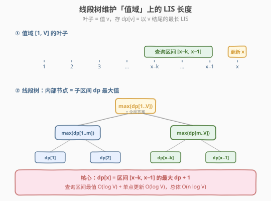
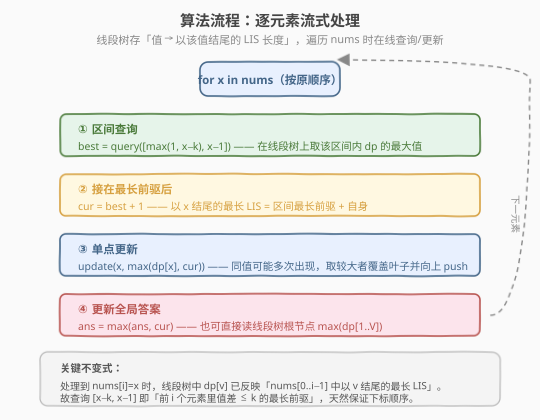

# LeetCode 最长递增子序列 II 题解

## 1. 题目概述

- **标题 / 题号**：最长递增子序列 II（#2407，hard）
- **链接**：https://leetcode.cn/problems/longest-increasing-subsequence-ii/
- **难度**：困难
- **标签**：线段树、树状数组、数组、动态规划

**题意**：给你一个整数数组 `nums` 和一个整数 `k`。找到 `nums` 中满足以下要求的最长子序列：

- 子序列**严格递增**；
- 子序列中相邻元素的差值**不超过** `k`。

返回满足上述要求的最长子序列的长度。子序列是从数组中删除部分元素后、剩余元素不改变顺序得到的数组。

**示例 1**：

```text
输入：nums = [4,2,1,4,3,4,5,8,15], k = 3
输出：5
解释：满足要求的最长子序列是 [1,3,4,5,8]，长度为 5。
注意 [1,3,4,5,8,15] 不满足要求，因为 15 - 8 = 7 大于 3。
```

**示例 2**：

```text
输入：nums = [7,4,5,1,8,12,4,7], k = 5
输出：4
解释：满足要求的最长子序列是 [4,5,8,12]，长度为 4。
```

**示例 3**：

```text
输入：nums = [1,5], k = 1
输出：1
解释：满足要求的最长子序列是 [1]，长度为 1（5 - 1 = 4 > 1，不能接上）。
```

**约束**：

- $1 \le \text{nums.length} \le 10^5$
- $1 \le \text{nums}[i], k \le 10^5$

> ⚠️ 本题是 [300. 最长递增子序列](../0201-0300/300_最长递增子序列.md) 的带约束升级版：相邻元素差值需 $\le k$。300 题的贪心+二分（`tails` 数组）依赖「**长度相同则末尾越小越好**」的全局最优性，但这里的差值约束是**局部**的——末尾更小未必更优（可能离前驱太近或太远），`tails` 单调性被破坏。需要换一个**按值域维护 dp**的数据结构来加速。

## 2. 解题思路

### 2.1 暴力思路：朴素 DP O(n²)

承接 300 题的 DP 思路，定义 `dp[i]` = 以 `nums[i]` 结尾、满足差值约束的最长子序列长度。转移时枚举所有前驱：

```text
dp[i] = max(dp[j] + 1)   对所有 j < i 且 nums[j] < nums[i] 且 nums[i] - nums[j] <= k
dp[i] = 1                无合法前驱时
```

答案为 $\max_i \text{dp}[i]$。时间 $O(n^2)$，$n = 10^5$ 时 $n^2 = 10^{10}$ 超时。瓶颈在于「为每个 $i$ 线性扫描所有前驱 $j$」。

### 2.2 核心观察：把 dp 从「按下标」搬到「按值域」



**观察一：差值约束只与「值」有关，与「下标」无关。** 合法前驱的条件是 $\text{nums}[j] < \text{nums}[i]$ 且 $\text{nums}[i] - \text{nums}[j] \le k$，即前驱值落在区间 $[\text{nums}[i]-k,\; \text{nums}[i]-1]$ 内。下标顺序的要求（$j < i$）则可由「**流式处理**」天然满足——只要按 `nums` 原顺序遍历，处理 `nums[i]` 时线段树里只装了下标更早的元素。

**观察二：按值域维护 dp，区间最值即为最长前驱。** 把状态从 `dp[i]`（按下标）改为 `dp[v]`（按值）：`dp[v]` = 当前已处理元素中、以值 $v$ 结尾的最长满足约束的子序列长度。于是

$$
\text{dp}[\text{nums}[i]] \;=\; \max_{v \in [\text{nums}[i]-k,\; \text{nums}[i]-1]} \text{dp}[v] \;+\; 1
$$

查询的是一个**区间最大值**，更新是**单点覆盖**（取较大者，因同值可多次出现）。这正是**线段树**的拿手好戏：区间最值查询 + 单点更新，各 $O(\log V)$。

**观察三：值域有界 → 无需离散化。** 约束给出 $1 \le \text{nums}[i] \le 10^5$，值域 $V = \max(\text{nums}) \le 10^5$，可直接开 $O(V)$ 的线段树。若值域更大（如 $10^9$），可先对 `nums` 做坐标压缩再用线段树，逻辑不变。

> 💡 **与 300 题的本质区别**：300 题无差值约束，前驱范围是「所有更小的值」$(-\infty, x)$，可用 `tails` 数组+二分维护「每个长度的最小末尾」。本题前驱范围是**有界窗口** $[x-k, x-1]$，`tails` 的单调性论证失效（末尾更小但落在窗口外反而更差），必须改用「按值维护区间最值」的线段树/树状数组。

### 2.3 算法流程图



线段树采用**自底向上的数组实现**（叶子从下标 `n` 开始，`n` 为 $\ge V+1$ 的 2 的幂），省去递归与指针：

1. **遍历** `nums`，对每个 `x = nums[i]`：
2. **区间查询**：$L = \max(1,\, x-k)$，$R = x-1$；若 $L \le R$，在线段树上查询 $[L, R]$ 的最大值 `best`，否则 `best = 0`。
3. **接前驱**：`cur = best + 1`（以 `x` 结尾的最长长度）。
4. **单点更新**：把叶子 `dp[x]` 升级为 $\max(\text{dp}[x], \text{cur})$，并自底向上 `push` 到所有祖先。
5. **更新答案**：`ans = max(ans, cur)`。

> 💡 **不变式**：处理 `nums[i]` 之前，线段树中 `dp[v]` 反映的是 `nums[0..i-1]` 中以值 $v$ 结尾的最长长度。因此查询 `[x-k, x-1]` 时，所有候选前驱的下标必然 $< i$，顺序约束自动满足——这是「流式处理 + 在线数据结构」的经典配合。

### 2.4 示例演算

以 `nums = [4,2,1,4,3,4,5,8,15], k = 3` 为例（$V = 15$）：

![示例演算：nums=[4,2,1,4,3,4,5,8,15], k=3](../images/lis2_example_walkthrough.svg)

关键看点：

- **第 6 步**（第二个 `4`）：查询 `[1,3]` 拿到 `best=2`（来自 `dp[3]=2`），`cur=3`，把 `dp[4]` 从 `2` 升级为 `3`——同值重复出现时取较大者覆盖，体现「单点取 max 更新」。
- **第 9 步**（`15`）：查询 `[12,14]` 全为 `0`，`cur=1`。因 `15-8=7 > k=3`，窗口 `[12,14]` 恰好把 `8` 排除在外——区间 `[x-k, x-1]` 精确编码了差值约束。

最终 `dp[8]=5`，对应子序列 `[1,3,4,5,8]`，长度 `5`。

## 3. 参考代码

### C++

```cpp
// 自底向上的数组式线段树（叶子从下标 n 开始）
class Solution {
  public:
    int lengthOfLIS(vector<int>& nums, int k) {
        int maxVal = *max_element(nums.begin(), nums.end());
        int n = 1;
        while (n <= maxVal) n <<= 1;          // n 为 >= V+1 的 2 的幂
        vector<int> tree(2 * n, 0);            // 区间最大值线段树
        int ans = 0;
        for (int x : nums) {
            int L = max(1, x - k), R = x - 1;  // 合法前驱值域
            int best = 0;
            for (int l = L + n, r = R + n + 1; l < r; l >>= 1, r >>= 1) {
                if (l & 1) best = max(best, tree[l++]);
                if (r & 1) best = max(best, tree[--r]);
            }
            int cur = best + 1;
            ans = max(ans, cur);
            int p = x + n;                     // 单点更新：取较大者覆盖
            tree[p] = max(tree[p], cur);
            for (p >>= 1; p >= 1; p >>= 1)
                tree[p] = max(tree[2 * p], tree[2 * p + 1]);
        }
        return ans;
    }
};
```

### Python

```python
class Solution:
    def lengthOfLIS(self, nums: List[int], k: int) -> int:
        max_val = max(nums)
        n = 1
        while n <= max_val:
            n <<= 1                       # n 为 >= V+1 的 2 的幂
        tree = [0] * (2 * n)              # 区间最大值线段树
        ans = 0
        for x in nums:
            L, R = max(1, x - k), x - 1    # 合法前驱值域
            best = 0
            l, r = L + n, R + n + 1
            while l < r:
                if l & 1:
                    best = max(best, tree[l])
                    l += 1
                if r & 1:
                    r -= 1
                    best = max(best, tree[r])
                l >>= 1
                r >>= 1
            cur = best + 1
            ans = max(ans, cur)
            p = x + n                      # 单点更新：取较大者覆盖
            tree[p] = max(tree[p], cur)
            p >>= 1
            while p >= 1:
                tree[p] = max(tree[2 * p], tree[2 * p + 1])
                p >>= 1
        return ans
```

> 💡 **单点更新为何用 `max` 而非直接赋值？** 同一个值 `x` 可在 `nums` 中多次出现，后出现的 `x` 可能接在更长的前驱后（如示例第 4、6 步的两个 `4`）。直接赋值会丢失更长的那次结果，故对叶子取 `max(tree[p], cur)`。这也是「以值为主键」建模相比「以下标为主键」的一个细节差异。

## 4. 复杂度分析

| 维度 | 线段树（值域） | 朴素 DP |
|------|----------------|---------|
| **时间复杂度** | $O(n \log V)$，$V = \max(\text{nums}) \le 10^5$ | $O(n^2)$ |
| **空间复杂度** | $O(V)$（线段树 $2n \le 4V$） | $O(n)$ |
| **单次操作** | 区间查询 / 单点更新各 $O(\log V)$ | 枚举前驱 $O(n)$ |
| **适用场景** | $n, V \le 10^5$，带差值约束的 LIS | $n \le 2500$，无约束 LIS |

> 💡 **$V$ 与 $n$ 的取舍**：本题 $V$ 与 $n$ 同阶（均 $\le 10^5$），故 $O(n \log V) \approx O(n \log n)$。若 $V \gg n$（如值域 $10^9$），先对 `nums` 排序去重做坐标压缩，把 $V$ 降到 $n$，再用线段树，时间仍是 $O(n \log n)$。

## 5. 扩展：动态开点线段树 / 树状数组

### 5.1 动态开点线段树（值域 $10^9$）

当 $\text{nums}[i]$ 范围高达 $10^9$ 时，$O(V)$ 的数组式线段树不可行。利用「实际只触及 $O(n \log V)$ 个节点」的稀疏性，可用**动态开点线段树**：节点按需创建，每次查询/更新只走 $\log V \approx 30$ 层，单次 $O(\log V)$，总体 $O(n \log V)$，空间 $O(n \log V)$。逻辑与上述完全一致，仅把数组下标换成指针/哈希映射节点。详见 [732. 我的日程安排表 III](../0701-0800/732_我的日程安排表III.md) 的动态开点写法。

### 5.2 为何本题不宜用树状数组（BIT）？

[300. 最长递增子序列](../0201-0300/300_最长递增子序列.md) 的「个数」变体（[673](https://leetcode.cn/problems/number-of-longest-increasing-subsequence/)）可用 BIT 按值域维护「长度+计数」做前缀最值。但本题查询的是**有界区间** $[x-k, x-1]$ 而非前缀 $[1, x-1]$。

- BIT 维护前缀最值依赖「`query(r) = f(prefix(r))`」的单调累积，而区间最值 $[L, R]$ 需要 `query(R) - query(L-1)`——**减法**对 `max` 运算无意义（`max` 不可逆）。
- 故 BIT 只能做前缀最值查询，无法直接做任意区间最值。本题窗口 $[x-k, x-1]$ 是任意区间，**线段树才是正解**。

> ⚠️ 若把约束放宽为「前驱值 $< x$」（即 $k = \infty$，退化回 300 题），则查询变为前缀 $[1, x-1]$，此时 BIT 可用。本题的差值约束正是把「前缀查询」升级为「区间查询」的关键。

## 6. 面试要点

1. **为什么 300 题的贪心+二分（`tails`）在这里失效？**

   - `tails` 的正确性依赖「长度相同则末尾越小越好」的全局最优性：末尾越小，后面能接的元素越多。但加入差值约束后，末尾更小**未必更优**——它可能离当前 `x` 太远（差值 $> k$）反而接不上，而一个末尾稍大但落在窗口内的前驱才是合法的。局部约束破坏了 `tails` 的全局单调性论证，故需换数据结构。

2. **为什么把 dp 从「按下标」改为「按值」？**

   - 差值约束 $\text{nums}[i] - \text{nums}[j] \le k$ 只依赖**值**，前驱值落在固定区间 $[x-k, x-1]$。按下标维护 dp 时，这个区间在值域上分散于各个下标，无法快速聚合；按值维护后，前驱恰好是值域上一段连续区间，可用线段树做区间最值查询。下标顺序则由「流式遍历 + 在线更新」保证。

3. **线段树的单点更新为什么取 `max` 而不直接赋值？**

   - 同一个值 `x` 可多次出现，后到的 `x` 可能接在更长前驱后（如示例的两个 `4`）。直接赋值会用较短的结果覆盖较长的，丢失最优；取 `max` 保留以该值结尾的最长长度。

4. **流式处理如何保证子序列的下标顺序？**

   - 处理 `nums[i]` 时，线段树只装了下标 $< i$ 的元素（之前遍历过的）。查询 $[x-k, x-1]$ 得到的 `best` 必然来自更早的元素，接上 `x` 后下标顺序合法。这是「在线数据结构 + 流式输入」的标准范式，无需显式记录下标。

5. **能否用线段树根节点直接当答案，而不用 `ans = max(ans, cur)`？**

   - 可以。根节点 `tree[1]` 管辖整个值域 $[1, V]$，存的就是 $\max_v \text{dp}[v]$，即全局最长长度。遍历结束后读 `tree[1]` 即可。代码里用 `ans` 变量是为了在遍历中提前记录、并在值域很大（动态开点）时省去对根的依赖，两者等价。

> 💡 **一句话总结**：差值约束把 LIS 的前驱从「全局更小」缩成「值域窗口 $[x-k, x-1]$」，使 `tails` 贪心失效；把 dp 搬到值域上用**线段树维护区间最值**，查询 $O(\log V)$、单点更新 $O(\log V)$，配合流式遍历保证下标顺序，总体 $O(n \log V)$。

## 同类练习题

| # | 题目 | 与本题的关联 |
|---|------|-------------|
| 300 | [最长递增子序列](https://leetcode.cn/problems/longest-increasing-subsequence/)（[题解](../0201-0300/300_最长递增子序列.md)） | 无差值约束的 LIS 母题，贪心+二分 $O(n \log n)$；本题是其带约束升级版，对照体会 `tails` 单调性为何失效 |
| 673 | [最长递增子序列的个数](https://leetcode.cn/problems/number-of-longest-increasing-subsequence/) | LIS + 计数，可用 BIT 按值域维护「(长度, 计数)」前缀最值——对照本题为何 BIT 不适用（前缀 vs 区间查询） |
| 354 | [俄罗斯套娃信封问题](https://leetcode.cn/problems/russian-doll-envelopes/) | 二维 LIS，排序降维后套 300 题模板，体会「约束维度」与「数据结构选择」的关系 |
| 1649 | [通过指令创建有序数组](https://leetcode.cn/problems/create-sorted-array-through-instructions/)（[题解](../1601-1700/1649_通过指令创建有序数组.md)） | 值域树状数组维护前缀和的在线插入计数，同属「按值域建数据结构 + 流式处理」范式，对照 BIT 前缀查询与线段树区间查询的边界 |
| 699 | [掉落的方块](https://leetcode.cn/problems/falling-squares/)（[题解](../0601-0700/699_掉落的方块.md)） | 坐标压缩 + 线段树（区间最值查询 + 区间赋值），巩固线段树的区间操作套路与离散化技巧 |
