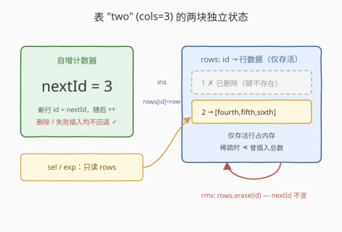
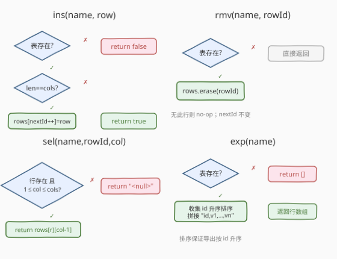
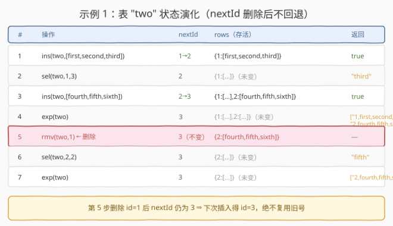

# 设计 SQL

- **题目名称**：设计 SQL
- **链接**：[2408. 设计 SQL](https://leetcode.cn/problems/design-sql/)
- **难度**：中等
- **标签**：设计、哈希表、模拟

## 1. 题目概述

实现一个简易关系数据库 `SQL`，支持在多张表上**插入 / 删除 / 查询单元格 / 导出 CSV**。构造时给定 `names` 与 `columns`（大小均为 `n`），`names[i]` 为第 `i` 张表名，`columns[i]` 为该表列数。

实现 `SQL` 类：

- `SQL(String[] names, int[] columns)`：创建 `n` 张表。
- `bool ins(String name, String[] row)`：将 `row` 插入表 `name`，返回 `true`；若 `row.length` 不等于该表列数，或 `name` 不是合法表名，则**不插入**并返回 `false`。**id 按表内自增分配**：首行 id 为 1，同一表内后续行 id 为上一插入行 id 加 1（**即使上一行已被删除**）。
- `void rmv(String name, int rowId)`：从表 `name` 中移除 id 为 `rowId` 的行。若表不存在或无此行，不进行任何操作。**删除不影响下一个插入行的 id。**
- `String sel(String name, int rowId, int columnId)`：返回表 `name` 中 `(rowId, columnId)` 单元格的值。若表不存在或单元格不合法，返回 `"<null>"`。
- `String[] exp(String name)`：以 CSV 格式导出表 `name` 中**现存的所有行**，每个单元格（**包括行 id**）以 `","` 分隔。若表不存在，返回空数组。

**示例 1**：

```text
输入：
["SQL","ins","sel","ins","exp","rmv","sel","exp"]
[[["one","two","three"],[2,3,1]],["two",["first","second","third"]],["two",1,3],["two",["fourth","fifth","sixth"]],["two"],["two",1],["two",2,2],["two"]]

输出：
[null,true,"third",true,["1,first,second,third","2,fourth,fifth,sixth"],null,"fifth",["2,fourth,fifth,sixth"]]
```

**示例 2**（演示失败插入与删除后查询）：

```text
SQL(["one","two","three"],[2,3,1])          // 建 3 张表
ins("two",["first","second","third"])      // true，id=1
sel("two",1,3)                             // "third"
rmv("two",1)                               // 删 id=1
sel("two",1,2)                             // "<null>"，行已删
ins("two",["fourth","fifth"])              // false，列数不符 2≠3（不消耗 id）
ins("two",["fourth","fifth","sixth"])       // true，id=2（不复用 1）
```

**约束条件**：

- $n = \text{names.length} = \text{columns.length}$，$1 \le n \le 10^4$
- $1 \le \text{names[i].length},\ \text{row[i].length},\ \text{name.length} \le 10$，均为小写字母
- $1 \le \text{columns[i]} \le 10$，$1 \le \text{row.length} \le 10$
- 所有 `names[i]` 互不相同
- 最多调用 `ins` / `rmv` 各 $2000$ 次、`sel` $10^4$ 次、`exp` $500$ 次

> 💡 **关键不变式**：题目把「**分配 id 的计数器**」与「**存储行数据**」这两件事解耦——id 由一张表内单调递增的计数器 `nextId` 决定，**只增不减、不受删除与失败插入影响**；行数据只存「存活行」。这意味着删除某行不会腾出 id 槽位给后续插入复用，也不会回退计数器。抓住这条不变式，数据结构的选择便一目了然。

---

## 2. 解题思路

### 2.1 暴力思路：数组按下标存行 + 墓碑标记

最直观的做法是**用 `vector` 按下标（id-1）存每一行**，删除时打墓碑（置空标记）而不真正移除：

```text
table.rows: vector<vector<string>?>   // rows[id-1]，删除置 null
ins: 若合法则 rows.push(row)（id = rows.size()+1）
rmv: rows[rowId-1] = null
sel: rows[rowId-1] 是否 null？列号越界？→ 返回值或 "<null>"
exp: 遍历整个 vector，跳过 null，拼 CSV（按下标天然升序）
```

正确性没问题，所有操作 $O(1)$、导出 $O(m)$（$m$ 为**曾插入总数**）。但有个隐患：删除只打墓碑、不释放槽位，`rows` 长度始终等于**历史插入总数**。若一张表反复「插入后删除」大量行，存活行寥寥无几、墓碑成片——内存随插入总数线性膨胀，与当前实际行数严重不匹配。

> ⚠️ 暴力法的瓶颈在「**存储粒度绑死插入历史**」：墓碑占据的槽位永不回收。当题目进阶追问「表因多次删除而变得稀疏时如何取舍」时，这一弱点被直接命中——需要一种**只存存活行**、内存随存活数而非插入总数增长的表示。

### 2.2 核心观察：计数器与行存储解耦，行用哈希表只存存活行



把每张表拆成**两块独立状态**：

| 状态 | 类型 | 作用 | 生命周期 |
|------|------|------|----------|
| `cols` | `int` | 该表列数，插入 / 查询时校验 | 构造时确定，不变 |
| `nextId` | `int` | 自增计数器，初值 $1$ | **单调递增**——仅成功 `ins` 时 `++`，`rmv` 与失败 `ins` 都不碰 |
| `rows` | `id → 行数据` 哈希表 | 存**存活**行 | `ins` 写入、`rmv` 擦除，键不存在即「无此行」 |

关键设计点：

1. **id 的来源是 `nextId` 而非 `rows.size()`**。`ins` 成功时取 `id = nextId`，随后 `nextId++`。删除只擦除 `rows` 里的键，绝不回退 `nextId`——这正是「删除不影响下一个插入 id」的直接实现。
2. **`rows` 用哈希表而非数组**。键是稀疏的 id（删除后出现空洞），哈希表**只占存活行的内存**：$O(k)$，$k$ 为存活行数，与曾插入总数无关。稀疏场景下这远胜墓碑数组。
3. **失败 `ins` 不消耗 id**。列数不符或表名非法时，**在自增之前** `return false`，`nextId` 纹丝不动（示例 2 验证）。
4. **`sel` 的三层校验**：表存在 → 行存在（键在哈希表里）→ `1 \le \text{columnId} \le \text{cols}`。任一不满足返回 `"<null>"`。注意 `columnId` 是 **1-indexed**，示例 `sel("two",1,3)` 返回 `["first","second","third"]` 的第 3 个元素 `"third"`。
5. **`exp` 需排序**。哈希表遍历无序，而导出要求按 id 升序（示例先 `1,...` 后 `2,...`）。收集键后排序即可：$O(k \log k)$。由于 `exp` 调用上限仅 $500$、$k$ 受 `ins` 上限 $2000$ 约束，排序开销可忽略。

> 💡 **为什么哈希表 + 排序导出是最优？** 题目四操作的调用频次不均：`sel` 最多 $10^4$ 次、`ins`/`rmv` 各 $2000$、`exp` 仅 $500$。哈希表让高频的 `sel` 走 $O(1)$，把唯一的代价 $O(k\log k)$ 排序留给低频的 `exp`。若改用有序映射（`std::map` / `SortedList`），导出免排序但每次 `sel` 升到 $O(\log k)$——在 `sel` 占绝对多数时反而不划算。这是「**让低频操作承担贵代价**」的经典取舍。

### 2.3 算法流程图



四方法各自短小，核心是 `ins` 的「**先校验后自增**」与 `sel` 的「**三层短路校验**」：

```text
ins(name, row):
    if name 不在 tables: return false
    t = tables[name]
    if row.size != t.cols: return false     # 失败不消耗 id
    id = t.nextId; t.nextId += 1            # 仅成功才自增
    t.rows[id] = row
    return true

rmv(name, rowId):
    if name 在 tables: tables[name].rows.erase(rowId)   # 键不存在即 no-op

sel(name, rowId, columnId):
    if name 不在 tables: return "<null>"
    t = tables[name]
    if rowId 不在 t.rows: return "<null>"
    if columnId < 1 或 columnId > t.cols: return "<null>"
    return t.rows[rowId][columnId - 1]

exp(name):
    if name 不在 tables: return []
    t = tables[name]
    ids = 排序(t.rows 的键)                   # 升序
    return [ join(id, ",", t.rows[id] 各单元格) for id in ids ]
```

> ⚠️ **`ins` 的校验顺序**：必须**先判表存在、再判列数**，两道校验都通过后才动 `nextId`。任何一道失败都要在自增前退出——否则会「消耗一个 id 却没写入行」，造成 id 空洞且与题意「下一个插入行的 id 为上一个插入行 id 加 1」相悖。

### 2.4 示例演算



以示例 1 追踪表 `"two"`（`cols=3`）的状态演化，重点看第 5 步 `rmv` 后 `nextId` 的行为：

| # | 操作 | nextId | rows（存活） | 返回 |
|---|------|--------|--------------|------|
| 1 | `ins(two,[first,second,third])` | $1 \to 2$ | `{1:[first,second,third]}` | `true` |
| 2 | `sel(two,1,3)` | $2$ | `{1:[…]}` | `"third"` |
| 3 | `ins(two,[fourth,fifth,sixth])` | $2 \to 3$ | `{1:[…],2:[fourth,fifth,sixth]}` | `true` |
| 4 | `exp(two)` | $3$ | `{1:[…],2:[…]}` | `["1,first,second,third","2,fourth,fifth,sixth"]` |
| 5 | **`rmv(two,1)`** | **$3$（不变）** | `{2:[fourth,fifth,sixth]}` | `—` |
| 6 | `sel(two,2,2)` | $3$ | `{2:[…]}` | `"fifth"` |
| 7 | `exp(two)` | $3$ | `{2:[…]}` | `["2,fourth,fifth,sixth"]` |

第 5 步是全题核心：删除 `id=1` 后，`rows` 中键 `1` 消失（**不留墓碑**），但 `nextId` 仍是 $3$。因此若此后再 `ins`，新行得 `id=3`——**不复用被删的 1**。第 6 步 `sel(two,2,2)` 印证 `id=2` 的行仍在、第 2 列为 `"fifth"`；第 7 步导出只剩 `id=2` 一行，CSV 头部仍是 `"2,fourth,fifth,sixth"`（id 不被重新编号）。

> 💡 **对照示例 2**：`rmv(two,1)` 后一次**列数不符**的 `ins(["fourth","fifth"])` 返回 `false` 且**不消耗 id**，紧接着成功的 `ins(["fourth","fifth","sixth"])` 得 `id=2`（而非 1）。两条不变式——「删除不回退计数器」「失败插入不消耗 id」——共同保证 id 序列是「所有**成功**插入按时间顺序」的 $1,2,3,\dots$，与删除和失败无关。

---

## 3. 参考代码

### C++

```cpp
class SQL {
    struct Table {
        int cols = 0;
        int nextId = 1;                       // 单调递增：仅成功 ins 时 ++
        unordered_map<int, vector<string>> rows;  // id -> 行数据（仅存活行）
    };
    unordered_map<string, Table> tables;

  public:
    SQL(vector<string>& names, vector<int>& columns) {
        for (int i = 0; i < (int)names.size(); ++i)
            tables[names[i]].cols = columns[i];   // operator[] 默认构造：nextId=1, rows 空
    }

    bool ins(string name, vector<string> row) {
        auto it = tables.find(name);
        if (it == tables.end()) return false;     // 表不存在
        Table& t = it->second;
        if ((int)row.size() != t.cols) return false;  // 列数不符——自增前退出
        int id = t.nextId++;                       // 仅成功才分配并自增
        t.rows[id] = std::move(row);
        return true;
    }

    void rmv(string name, int rowId) {
        auto it = tables.find(name);
        if (it == tables.end()) return;           // 表不存在，no-op
        it->second.rows.erase(rowId);              // 键不存在时 erase 本就是 no-op
    }

    string sel(string name, int rowId, int columnId) {
        auto it = tables.find(name);
        if (it == tables.end()) return "<null>";
        Table& t = it->second;
        auto rit = t.rows.find(rowId);
        if (rit == t.rows.end()) return "<null>";  // 行已删除 / 不存在
        if (columnId < 1 || columnId > t.cols) return "<null>";  // 列越界
        return rit->second[columnId - 1];         // 1-indexed -> 0-indexed
    }

    vector<string> exp(string name) {
        auto it = tables.find(name);
        if (it == tables.end()) return {};
        Table& t = it->second;
        vector<int> ids;
        ids.reserve(t.rows.size());
        for (auto& [id, _] : t.rows) ids.push_back(id);
        sort(ids.begin(), ids.end());             // 哈希表无序，导出需升序
        vector<string> res;
        res.reserve(ids.size());
        for (int id : ids) {
            string line = to_string(id);          // CSV 头部 = 行 id
            for (auto& cell : t.rows[id]) line += "," + cell;
            res.push_back(line);
        }
        return res;
    }
};
```

> 💡 **实现细节**：① `ins` 中 `std::move(row)` 避免拷贝整行字符串，`row` 按值传入本就是调用方的副本，移动进哈希表后销毁，零额外开销。② `tables[names[i]].cols = columns[i]` 借助 `unordered_map::operator[]` 在键不存在时**默认构造** `Table`（`cols=0, nextId=1, rows 空`），再赋 `cols`——一行完成建表。③ `rmv` 中 `unordered_map::erase` 对不存在的键是合法的 no-op，故无需额外 `find` 判断行是否存在，但**表存在性**仍要先查（否则对不存在的表误建空表）。④ `sel` 的 `columnId > t.cols` 用 `cols` 而非 `rit->second.size()` 校验——二者恒等（插入时已校验列数），用 `cols` 语义更清晰且对「行存在但列越界」同样兜底。

### Python

```python
class SQL:
    class _Table:
        __slots__ = ("cols", "next_id", "rows")
        def __init__(self, cols: int):
            self.cols = cols
            self.next_id = 1           # 单调递增：仅成功 ins 时 ++
            self.rows = {}             # id -> 行数据（仅存活行）

    def __init__(self, names: List[str], columns: List[int]):
        self.tables = {names[i]: self._Table(columns[i]) for i in range(len(names))}

    def ins(self, name: str, row: List[str]) -> bool:
        t = self.tables.get(name)
        if t is None or len(row) != t.cols:   # 表不存在或列数不符——自增前退出
            return False
        t.rows[t.next_id] = row               # 仅成功才分配并自增
        t.next_id += 1
        return True

    def rmv(self, name: str, rowId: int) -> None:
        t = self.tables.get(name)
        if t is not None:
            t.rows.pop(rowId, None)           # 键不存在即 no-op

    def sel(self, name: str, rowId: int, columnId: int) -> str:
        t = self.tables.get(name)
        if t is None:
            return "<null>"
        row = t.rows.get(rowId)
        if row is None or not (1 <= columnId <= t.cols):   # 行/列合法性
            return "<null>"
        return row[columnId - 1]              # 1-indexed -> 0-indexed

    def exp(self, name: str) -> List[str]:
        t = self.tables.get(name)
        if t is None:
            return []
        return [f"{rid}," + ",".join(t.rows[rid]) for rid in sorted(t.rows)]
```

> 💡 **对照 C++**：Python 用嵌套类 `_Table` + `__slots__` 装三块状态，比并列三个字典更聚合、可读性更好且省内存。`rmv` 用 `dict.pop(rowId, None)` 一步完成「存在则删、不存在则忽略」。`exp` 用 `sorted(t.rows)` 对字典键升序，列表推导式拼接 `f"{rid}," + ",".join(...)`——`rid` 不在 `",".join` 之内，故先拼 id 再接单元格。

---

## 4. 复杂度分析

| 维度 | 复杂度 | 说明 |
|------|--------|------|
| `ins` 时间 | $O(1)$ | 一次哈希查找 + 列数比较 + 一次哈希写入（均摊） |
| `rmv` 时间 | $O(1)$ | 一次哈希查找 + 一次哈希删除（键不存在即 no-op） |
| `sel` 时间 | $O(1)$ | 两次哈希查找 + 边界判断 + 下标访问 |
| `exp` 时间 | $O(k \log k)$ | 收集 $k$ 个存活 id + 排序 + 拼接 $k$ 行 |
| 构造时间 | $O(n)$ | 建 $n$ 张表，各一次哈希写入 |
| 空间 | $O(n + \sum k)$ | $n$ 个表项 + 各表存活行总单元格数 |

> ⚠️ **空间分析**：`rows` 的容量随**存活行数** $k$ 而非**曾插入总数** $m$ 变化——这是相对墓碑数组的核心优势。设一张表反复「插 $m$ 次删 $m-1$ 次」只剩 1 行：墓碑数组占 $O(m)$、哈希表占 $O(1)$。约束下 $m \le 2000$，两种做法内存都吃得下，但进阶追问的稀疏场景正是哈希表胜出之处。`exp` 的 $O(k\log k)$ 在 $k \le 2000$、调用 $\le 500$ 次时总计约 $10^6$ 量级，远低于时限。

---

## 5. 扩展：稀疏表的三种表示对比（进阶追问）

题目进阶问：「表因多次删除而稀疏时选哪种方法？考虑内存与性能。」关键在于「**存活行数 $k$** 与 **曾插入总数 $m$**」之间的关系。下表对比三种 `rows` 表示：

| 表示 | `ins` | `rmv` | `sel` | `exp` | 内存 | 稀疏表现 |
|------|-------|-------|-------|-------|------|----------|
| **墓碑数组** `vector<row?>` 按下标 | $O(1)$ | $O(1)$ | $O(1)$ | $O(m)$ | $O(m)$ | ❌ 内存随插入总数膨胀，墓碑占满 |
| **哈希表** `unordered_map<id,row>` | $O(1)$ | $O(1)$ | $O(1)$ | $O(k\log k)$ | $O(k)$ | ✅ 只存存活行，导出需排序 |
| **有序映射** `map<id,row>` | $O(\log k)$ | $O(\log k)$ | $O(\log k)$ | $O(k)$ | $O(k)$ | △ 内存好，导出免排序但每次操作带 $\log$ |

抉择依据：

- **稀疏（$k \ll m$）**：墓碑数组的 $O(m)$ 内存是硬伤，淘汰。哈希表与有序映射内存均为 $O(k)$，再按**操作频次**选——`sel` 高频（$10^4$）则哈希表 $O(1)$ 占优，把唯一的 $O(k\log k)$ 留给低频 `exp`（$500$）；若 `exp` 极高频而 `sel` 少，则有序映射的免排序导出更划算。
- **稠密（$k \approx m$，少删除）**：墓碑数组全场 $O(1)$ 且导出按下标天然升序免排序、缓存友好，是最简单的最优解——本题约束温和时它也能 AC，但**经不起稀疏追问**。

> 💡 **本题最优解 = 哈希表**：约束明确标注 `sel` 最多 $10^4$ 次、`exp` 仅 $500$ 次，`sel` 占绝对多数。哈希表让最高频的 `sel` 走 $O(1)$，排序代价留给最低频的 `exp`，且内存严格 $O(k)$ 应对稀疏——一招命中「性能 + 内存」两头。这正是第 2.2 节选哈希表的底层理由。

---

## 6. 面试要点

1. **为什么 id 不随删除回退？题意如何保证？**

   > 题目明文规定「id 用自增法分配，下一个插入行的 id 为上一个插入行的 id（**即使它已被删除**）加 1」。实现上 id 来自独立计数器 `nextId`，`rmv` 只擦除 `rows` 里的键、完全不碰 `nextId`，故删除不回退。这一解耦让 id 序列等价于「成功插入的时间顺序编号」$1,2,3,\dots$，与删除和失败插入无关。

2. **失败的 `ins` 会消耗一个 id 吗？为什么？**

   > 不会。代码在**自增之前**完成表存在性与列数两项校验，任一不满足即 `return false` 退出，`nextId` 不动。示例 2 印证：`rmv(two,1)` 后失败的 `ins(["fourth","fifth"])`（列数 $2 \ne 3$）返回 `false`，紧接着成功的 `ins(["fourth","fifth","sixth"])` 得 `id=2`（不是 1）——若失败也消耗 id，此处应得 3，与题意相悖。

3. **`sel` 返回 `"<null>"` 的三种情形分别是什么？**

   > (a) 表名不存在（`tables` 无此键）；(b) 行 id 不在 `rows`（从未插入过该 id，或已被 `rmv` 删除——哈希表里键不存在）；(c) `columnId` 越界（$<1$ 或 $> \text{cols}$）。三者短路校验，任一命中即返回 `"<null>"`。注意 `columnId` 是 **1-indexed**，取值时用 `rows[rowId][columnId - 1]`。

4. **`exp` 为什么需要排序？能否避免？**

   > 哈希表遍历顺序无序，而导出要求按 id 升序（示例先 `1,...` 后 `2,...`）。故收集键后 `sort`，$O(k\log k)$。避免排序的代价是改用有序映射（`std::map`），导出 $O(k)$ 免排序，但每次 `ins`/`rmv`/`sel` 升至 $O(\log k)$。鉴于 `sel` 是最高频操作，本题用哈希表 + 排序导出更优；若反过来 `exp` 极高频，可换有序映射。

5. **如果表极稀疏（插入百万次、删除绝大多数），墓碑数组为何不可行？**

   > 墓碑数组按 `id-1` 下标存行，删除只置 null 不回收槽位，长度始终等于**曾插入总数** $m$。百万次插入即使只剩 10 行存活，数组仍占百万槽位内存。哈希表只存存活行，内存 $O(k)$ 与 $m$ 无关，稀疏场景完胜。这正是进阶追问的答案——**稀疏用哈希表，稠密可用墓碑数组**。

> 💡 **一句话总结**：把「自增计数器 `nextId`」与「存活行哈希表 `rows`」解耦——`nextId` 只增不减决定新 id，`rows` 只存存活行决定内存，`ins` 先校验后自增、`sel` 三层短路校验、`exp` 排序导出。稀疏场景下哈希表以 $O(k)$ 内存与 $O(1)$ 高频查询完胜墓碑数组。

---

## 7. 同类练习题

- [1396. 设计地铁系统](https://leetcode.cn/problems/design-underground-system/)：同为「设计类 + 多哈希表分离不同生命周期状态」，对照 1396「在途/累计两表」与本题「计数器/行存储两块」的解耦思想
- [1797. 设计一个验证系统](https://leetcode.cn/problems/design-authentication-manager/)：同为设计类用哈希表管理条目并处理失效（删除/过期），对照「按 id 存活」与「按时间过期淘汰」两种清理策略
- [1348. 推文计数](https://leetcode.cn/problems/tweet-counts-per-interval/)：同为「按 key 聚合多条记录」的设计题，对照 1348「有序映射 + 区间查询」与本题「哈希表 + 排序导出」两种有序性取舍
- [911. 在线选举](https://leetcode.cn/problems/online-election/)：同为高频查询型设计题，对照 911「预处理 + 二分查询」与本题「哈希表 $O(1)$ 查询」在查询密集场景下的不同选择
- [1352. 最后 K 个数的乘积](https://leetcode.cn/problems/product-of-the-last-k-numbers/)：同为设计类维护随操作演化的状态，对照 1352「前缀积增量」与本题「计数器自增」两种把状态前置维护的范式
